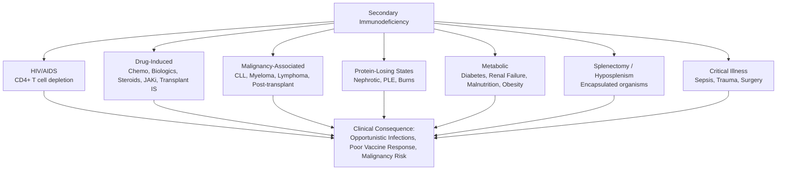
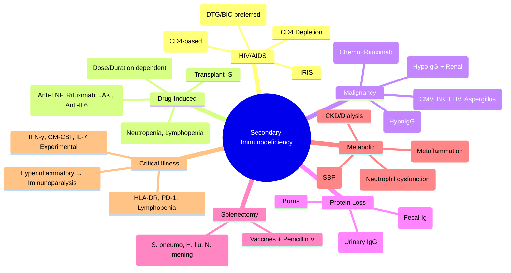

# 2.2 Secondary Immunodeficiencies

---

## 🎯 Learning Objectives
- [ ] Understand **HIV/AIDS** pathogenesis, staging, OIs, ART, Immune reconstitution
- [ ] Recognise **drug-induced immunodeficiency** — Chemotherapy, Biologics, Steroids, JAKi, Transplant immunosuppression
- [ ] Identify **malignancy-associated immunodeficiency** — CLL, Myeloma, Lymphoma, Post-transplant
- [ ] Recognise **protein-losing states** — Nephrotic syndrome, Protein-losing enteropathy
- [ ] Manage **post-splenectomy / hyposplenism** — Encapsulated organisms, Vaccines, Prophylaxis
- [ ] Recognise **metabolic immunodeficiency** — Diabetes, Renal failure, Malnutrition, Obesity
- [ ] Answer viva: "HIV OI prophylaxis" and "Splenectomy vaccination schedule"

---

## 🧠 Core Concept: Secondary vs Primary Immunodeficiency

---

## 1️⃣ HIV/AIDS

### Pathogenesis
- **HIV-1** (Group M dominant) → Binds **CD4 + CCR5/CXCR4** → Entry → Reverse transcription → Integration → **Latent reservoir** (CD4+ memory T cells)
- **CD4+ T cell depletion** → Immune dysregulation, Loss of Th1/Th17, B cell dysfunction, Loss of immune surveillance

### Staging (CDC 1993 / WHO Clinical Staging)

| CDC Category | CD4 Count | Clinical |
|--------------|-----------|----------|
| **A** | ≥500 | Asymptomatic / PGL / Acute HIV |
| **B** | 200-499 | Symptomatic (LIP, Bacillary angiomatosis, Herpes zoster, Oral candidiasis) |
| **C** | <200 | **AIDS-defining illnesses** (see below) |

| AIDS-Defining Illnesses (Category C) |
|--------------------------------------|
| **Protozoal**: PCP, Toxoplasmosis, Cryptosporidiosis, Isosporiasis, Cyclosporiasis |
| **Fungal**: Oesophageal candidiasis, Cryptococcal meningitis, Histoplasmosis, Coccidioidomycosis |
| **Viral**: CMV (retinitis, colitis), HSV (ulcers >1m), HHV-8 (KS), PML (JCV) |
| **Bacterial**: TB (pulmonary/extrapulmonary), MAC, Salmonella septicaemia (recurrent) |
| **Malignancy**: Kaposi sarcoma, NHL (CNS, Primary effusion), Invasive cervical cancer |
| **Other**: HIV wasting syndrome, HIV encephalopathy |

### Antiretroviral Therapy (ART)

| Drug Class | Examples | Key Resistance Mutations |
|------------|----------|--------------------------|
| **NRTI** | TDF, TAF, ABC, 3TC, FTC | M184V (3TC/FTC), K65R (TDF), K103N (EFV/NVP) |
| **NNRTI** | EFV, NVP, RPV, DOR, ETV | K103N, Y181C, G190A |
| **PI** | DRV/r, ATV/r, LPV/r, DRV/c | D30N, M46I/L, V82A, I84V |
| **INSTI** | **DTG, BIC, RAL, EVG/c** | R263K, Q148H, N155H (RAL/EVG), **DTG/BIC high barrier** |
| **Entry Inhibitors** | Maraviroc (CCR5), Fostemsavir (CD4) | Maraviroc: CCR5 tropism only |

### Preferred First-Line Regimens (WHO/DHHS/BHIVA 2024)

| Regimen | Components | Notes |
|---------|------------|-------|
| **INSTI + 2NRTI (Preferred)** | **DTG + TDF/TAF + 3TC/FTC** | **DTG**: High barrier, few interactions, once daily |
| | **BIC/TAF/FTC** (Single tablet) | **BIC**: Similar to DTG, no boosting needed |
| **Alternative** | DRV/r + TDF/TAF + 3TC/FTC | If INSTI contraindicated |
| **Rapid Start** | **DTG + TDF + 3TC** | Same-day start if ready |

### Opportunistic Infection Prophylaxis (CD4-Guided)

| CD4 Count | Prophylaxis | Duration |
|-----------|-------------|----------|
| **<200** | **Co-trimoxazole** (PCP) | Until CD4 >200 for 3m on ART |
| **<100** | **Azithromycin** (MAC) | Until CD4 >100 for 3m on ART |
| **<50** | **Fluconazole** (Cryptococcal) / **Valganciclovir** (CMV if high risk) | Until CD4 >100 for 3m |
| **All** | **TB screening** (IGRA/TST) → **TPT** if positive | As per guidelines |

### Immune Reconstitution Inflammatory Syndrome (IRIS)

| Type | Timing | Features | Management |
|------|--------|----------|------------|
| **Paradoxical IRIS** | 2-12w post-ART | Worsening of known OI (TB, Cryptococcus, MAC) | Continue ART, **Corticosteroids** (Pred 1-2mg/kg) if severe |
| **Unmasking IRIS** | 2-12w post-ART | New OI diagnosis (TB, CMV, KS) | Treat OI, Continue ART, Consider steroids |

---

## 2️⃣ Drug-Induced Immunodeficiency

### Chemotherapy
| Mechanism | Typical Nadir | Key Risks |
|-----------|---------------|-----------|
| **Bone marrow suppression** | 7-14 days post-cycle | **Neutropenic sepsis**, Anaemia, Thrombocytopenia |
| **Lymphodepletion** | Weeks-months | **Viral reactivation** (VZV, CMV, HBV, HCV, JC virus), **PJP** |
| **Mucosal damage** | During therapy | **Mucositis**, Bacteraemia, Fungal translocation |

| Agent | Specific Risks |
|-------|----------------|
| **Cyclophosphamide** | Haemorrhagic cystitis, Bladder cancer, **PJP** (if high dose) |
| **Methotrexate** | Hepatotoxicity, Pulmonary fibrosis, **PJP** (RA/PSA) |
| **Anthracyclines** | Cardiotoxicity |
| **Platinum agents** | Neuropathy, Nephrotoxicity, Ototoxicity |
| **Antimetabolites (5-FU, Gemcitabine)** | Mucositis, Myelosuppression |

**Prophylaxis**: **G-CSF** (Primary/Secondary prophylaxis), **PJP prophylaxis** (Co-trimoxazole) if high risk (lymphocytes <0.5, corticosteroids >20mg >4w)

### Biologic Therapies

| Agent | Target | Infection Risk | Screening/Monitoring |
|-------|--------|----------------|----------------------|
| **Anti-TNF** (Infliximab, Adalimumab, Certolizumab, Golimumab, Etanercept) | TNF-α | **TB reactivation** (Highest), **Hepatitis B**, **Listeria**, **Fungal**, **NTM**, Demyelination | **LTBI screen** (IGRA/TST) pre-treatment; **HBV DNA/HBsAg** |
| **Anti-IL-6R** (Tocilizumab, Sarilumab) | IL-6R | **Bacterial**, **Diverticulitis**, **TB** (lower), **Hepatic** | LFT, Lipids, Neutrophils |
| **Anti-IL-17/23** (Secukinumab, Ixekizumab, Ustekinumab, Risankizumab) | IL-17/IL-23 | **Candida**, **IBD flare** (IL-23), **TB** (low) | TB screen baseline |
| **Anti-CD20** (Rituximab, Ofatumumab, Obinutuzumab) | CD20 (B cells) | **Hypogammaglobulinaemia**, **Viral** (VZV, HBV, HCV, PML/JCV), **Bacterial** | **IgG pre/post**, **HBV/HCV**, **CD19+ count** |
| **Anti-IL-6R** (Tocilizumab) | IL-6R | **GI perforation** (Diverticulitis), **Neutropenia**, **Lipids** | LFT, Lipids, Neutrophils |
| **JAK Inhibitors** (Tofacitinib, Baricitinib, Upadacitinib, Filgotinib) | JAK1/3 or JAK1/2 | **Herpes zoster** (↑↑), **TB**, **VTE**, **Lipids**, **Cytopenias**, **MACE** | **VZV IgG**, TB screen, Lipids, CBC, LFT |
| **BTK Inhibitors** (Ibrutinib, Acalabrutinib, Zanubrutinib) | BTK | **Atrial fibrillation**, **Bleeding**, **Infections** (Pneumonia, Sepsis), **Richter's** | ECG, CBC, Infection surveillance |
| **BCL-2 Inhibitors** (Venetoclax) | BCL-2 | **TLS**, **Infections** (Neutropenia), **Bleeding** | TLS monitoring, Antimicrobial prophylaxis |

### Corticosteroids
| Dose/Duration | Immunosuppression Level | Key Risks |
|---------------|------------------------|-----------|
| **<10mg prednisolone** | Minimal | Low |
| **10-20mg >4 weeks** | Moderate | **PJP, TB, VZV, Fungal**, Hyperglycaemia, Osteoporosis |
| **>20mg >4 weeks** | Significant | **Add opportunistic prophylaxis** (PCP, VZV), **Live vaccines contraindicated** |
| **Pulse IV Methylprednisolone** | Profound | **Opportunistic infections**, **AVN**, **Psychiatric** |

### Transplant Immunosuppression
| Phase | Regimen | Key Infections |
|-------|---------|----------------|
| **Induction** (0-1m) | Basiliximab/ATG + CNI + MMF + Steroid | **Bacterial**, **CMV**, **HSV**, **PJP** |
| **Early** (1-6m) | CNI + MMF + Steroid | **CMV (peak 1-4m)**, **BK virus**, **HSV**, **Aspergillus**, **Nocardia** |
| **Late** (>6m) | CNI ± MMF ± Steroid | **Chronic viral** (BK, HPV), **Community-acquired**, **Skin cancer** |

---

## 3️⃣ Malignancy-Associated Immunodeficiency

| Malignancy | Mechanism | Key Infections |
|------------|-----------|----------------|
| **CLL** | **Hypogammaglobulinaemia**, T cell dysfunction, **Rituximab** → **Encapsulated bacteria** (S. pneumoniae, H. influenzae), **Herpesviruses**, **Richter's transformation** | **IVIG if IgG <4 + recurrent infections** |
| **Multiple Myeloma** | **Hypogammaglobulinaemia**, **Renal impairment**, **Steroids**, **Proteasome inhibitors** → **Encapsulated bacteria**, **VZV**, **PJP** | **IVIG if IgG <4 + recurrent**, **VZV prophylaxis** (Acyclovir), **PJP prophylaxis** |
| **Lymphoma** (DLBCL, FL, HL) | **Chemo (R-CHOP, ABVD)** → **Neutropenia, Lymphopenia**, **Rituximab** → **Hypogammaglobulinaemia** | **PJP prophylaxis** (Co-trimoxazole during chemo), **G-CSF**, **VZV prophylaxis** |
| **Post-Transplant (Solid Organ)** | **Immunosuppression** (CNI, mTOR, MMF, Steroids) | **CMV (1-4m)**, **BK virus**, **EBV (PTLD)**, **Aspergillus**, **Nocardia**, **PJP** |
| **Post-HSCT** | **Conditioning + GvHD + Immunosuppression** | **CMV (1-3m)**, **VZV**, **Adenovirus**, **HHV-6**, **Aspergillus**, **PJP**, **Encapsulated bacteria** |

---

## 4️⃣ Protein-Losing States

| Condition | Mechanism | Immunoglobulin Loss | Infection Risk |
|-----------|-----------|---------------------|----------------|
| **Nephrotic Syndrome** | Glomerular permeability → **Urinary IgG loss** | **IgG > IgA > IgM** | **Encapsulated bacteria** (S. pneumoniae, H. influenzae), **Peritonitis** (Spontaneous bacterial peritonitis) |
| **Protein-Losing Enteropathy (PLE)** | Intestinal lymphatic leakage → **Fecal Ig loss** | **All classes** | **Encapsulated bacteria**, **Enteric pathogens** |
| **Burns** | Skin barrier loss + **Capillary leak** | **All classes** | **Sepsis** (Pseudomonas, Staph), **Fungal** |

### Management
| Strategy | Action |
|----------|--------|
| **Treat underlying cause** | ACEi/ARB (Proteinuria), Steroids/Immunosuppressants (PLE), Burns resuscitation |
| **IVIG Replacement** | **If IgG <4 g/L + recurrent infections** (400-600 mg/kg q3-4w) |
| **Vaccination** | **Pneumococcal (PCV23 + PPV23), Hib, MenACWY, Annual influenza** |
| **Antibiotic Prophylaxis** | **Penicillin V** (Nephrotic children), **Consider in adults with recurrent infections** |

---

## 5️⃣ Post-Splenectomy / Hyposplenism

### Causes
- **Splenectomy** (Trauma, ITP, Hereditary spherocytosis, Thalassaemia, Sickle cell, Splenic lymphoma)
- **Functional hyposplenism** (Sickle cell autoinfarction, Coeliac, SLE, Coeliac, Amyloid)

### Infection Risk: **Overwhelming Post-Splenectomy Infection (OPSI)**
| Organism | Risk | Mortality |
|----------|------|-----------|
| **S. pneumoniae** | **Highest** (50-70% OPSI) | 50-70% |
| **H. influenzae** | High | 20-30% |
| **N. meningitidis** | Moderate | 10-20% |
| **Capnocytophaga canimorsus** | Dog bites | High |
| **Malaria / Babesia** | Severe | High |

### Prevention Protocol (UK Guidelines)

| Intervention | Timing |
|--------------|--------|
| **Pre-splenectomy vaccines** (Ideally 2 weeks pre-op) | |
| - **Pneumococcal** (PCV13 → PPV23 at 2m) | Pre-op / Post-op 2w |
| - **MenACWY** (Conjugate) | Pre-op |
| - **Hib/MenC** (Combined) | Pre-op |
| - **Annual Influenza** | Annual |
| **Antibiotic Prophylaxis** | |
| - **Penicillin V 250mg BD** (or Erythromycin if allergic) | **Lifelong** (or ≥2y post-splenectomy, some guidelines lifelong) |
| **Patient Education** | |
| - **Medical alert bracelet** | Always |
| - **Urgent antibiotics for fever** | Patient-held supply (Amoxicillin/Co-amoxiclav) |
| - **Malaria prophylaxis** | If travelling to endemic areas |
| - **Animal bites** | Urgent medical attention (Capnocytophaga) |

### Functional Hyposplenism Monitoring
- **Howell-Jolly bodies** on blood film
- **Pitted red cells** >3.5%
- **Spleen scintigraphy** (99mTc-labelled RBCs)
- **Ultrasound** (Spleen size <11cm)

---

## 6️⃣ Metabolic & Other Immunodeficiencies

### Diabetes Mellitus
| Mechanism | Infection Risk |
|-----------|----------------|
| **Neutrophil dysfunction** (Chemotaxis, Phagocytosis, ROS) | **S. aureus** (Skin/soft tissue, Osteomyelitis), **Fungal** (Candidiasis, Mucormucosis), **UTI** (E. coli, Klebsiella), **TB** (↑3x) |
| **Hyperglycaemia** | Impaired neutrophil function, Impaired T cell function |
| **Neuropathy/Vascular disease** | Diabetic foot (Polymicrobial), UTI (Stasis) |

### Chronic Kidney Disease / Dialysis
| Defect | Infection Risk |
|--------|----------------|
| **Uraemic toxins** → Neutrophil dysfunction, Lymphopenia | **Peritonitis** (PD), **Access sepsis** (HD), **Septicaemia**, **Viral** (HBV, HCV, HIV - historical) |
| **Dialysis access** | **CRBSI** (Staph aureus, CoNS), **Exit site infection** |

### Malnutrition / Obesity
| State | Immune Impact |
|-------|---------------|
| **Protein-energy malnutrition** | Thymic atrophy, ↓ T cells, ↓ IgA, Impaired phagocytosis, Complement ↓ |
| **Obesity** | **Chronic inflammation** (Leptin, Adipokines), **Impaired NK/T cell**, **Impaired vaccine response**, **↑ COVID-19 severity** |

### Alcohol / Cirrhosis
| Mechanism | Infection Risk |
|-----------|----------------|
| **Kupffer cell dysfunction**, **Complement deficiency**, **Low opsonins**, **Portosystemic shunting** | **SBP** (E. coli, Klebsiella), **Pneumonia**, **Septicaemia**, **Viral** (HBV, HCV, HIV) |

---

## 7️⃣ Critical Illness Immunoparalysis

### Sepsis-Induced Immunosuppression
| Phase | Features |
|-------|----------|
| **Hyperinflammatory** (Early) | Cytokine storm (IL-6, TNF-α, IL-1β), Endothelial activation, Coagulopathy |
| **Immunoparalysis** (Late, >3-5 days) | **Lymphopenia**, **HLA-DR ↓ on monocytes**, **PD-1/PD-L1 ↑**, **Treg expansion**, **IL-10 ↑**, **Impaired antigen presentation**, **Endotoxin tolerance** |

### Monitoring & Therapy
| Biomarker | Significance |
|-----------|--------------|
| **mHLA-DR** (Monocyte HLA-DR) | **<30% = Immunoparalysis**, Predicts secondary infections |
| **Lymphocyte count** | **<800/μL** = High risk |
| **PD-1/PD-L1** | T cell exhaustion |
| **Therapies (Investigational)** | **IFN-γ** (Restores HLA-DR), **GM-CSF**, **IL-7**, **Anti-PD-1/PD-L1** (experimental) |

---

## ⚡ FCPS/MRCP High-Yield Summary

| Condition | Key Immunodeficiency | Key Infections | Prophylaxis/Management |
|-----------|---------------------|----------------|------------------------|
| **HIV/AIDS** | CD4+ depletion | PCP, Toxo, Crypto, MAC, CMV, TB, KS, NHL | **ART**, **Co-trimoxazole** (<200), **Azithro** (<100), **Fluconazole** (<100) |
| **Chemotherapy** | Neutropenia, Lymphopenia | Neutropenic sepsis, VZV, CMV, HBV, PJP | **G-CSF**, **Co-trimoxazole** (if high risk), **Acyclovir** (VZV) |
| **Anti-TNF** | TB reactivation | TB, Listeria, Fungal, PJP | **LTBI screen pre-tx**, HBV screen |
| **Rituximab** | B-cell depletion | Hypogammaglobulinaemia, VZV, HBV, PML | **IgG monitoring**, HBV screen, CD19+ count |
| **JAK Inhibitors** | JAK-STAT blockade | **Herpes zoster**, TB, VTE | **VZV IgG, TB screen, VZV prophylaxis** |
| **Steroids >20mg >4w** | Profound immunosuppression | PJP, TB, VZV, Fungal | **Co-trimoxazole**, VZV prophylaxis |
| **Splenectomy** | Encapsulated bacteria clearance | **S. pneumoniae, H. influenzae, N. meningitidis** | **Vaccines (PCV13, PPV23, MenACWY, Hib)**, **Penicillin V lifelong** |
| **Nephrotic Syndrome** | Urinary IgG loss | S. pneumoniae, Peritonitis | **Penicillin V prophylaxis** (children), **IVIG if IgG<4 + recurrent** |
| **Diabetes** | Neutrophil dysfunction | S. aureus, Fungal, TB, UTI | Glycaemic control, Foot care, Vaccines |
| **CKD/Dialysis** | Uraemic immunosuppression | Peritonitis, Access sepsis, Septicaemia | Vaccines, Access care, Hepatitis B vaccination |

---

## 🎤 Viva Questions (Expected Answers)

| # | Question | Expected Answer |
|---|----------|-----------------|
| 1 | HIV patient CD4 150, on ART. What OI prophylaxis? | **Co-trimoxazole** (PCP prophylaxis) — Continue until CD4 >200 for 3 months on ART |
| 2 | Patient on infliximab develops TB. Screening missed? | **Latent TB screening (IGRA/TST) mandatory pre-anti-TNF**; If positive → LTBI treatment before biologic |
| 3 | Patient on rituximab for 2 years. IgG 3.5 g/L, recurrent sinusitis. Management? | **IVIG replacement** (IgG <4 g/L + recurrent infections); Monitor CD19+ recovery |
| 4 | Patient on tofacitinib develops herpes zoster. Management? | **Hold JAKi**, Treat with **Antivirals** (Valaciclovir), Restart JAKi after resolution if benefit > risk |
| 5 | Post-splenectomy patient with fever. Immediate action? | **Blood cultures**, **IV Ceftriaxone + Vancomycin** (Cover S. pneumoniae, N. meningitidis, H. influenzae); **Patient-held antibiotics** |
| 6 | Nephrotic syndrome adult with recurrent pneumococcal pneumonia. IgG 3.2. Management? | **IVIG** (IgG <4 g/L + recurrent infections), Pneumococcal vaccination, Consider penicillin prophylaxis |
| 7 | Patient on high-dose steroids >4 weeks. What prophylaxis? | **Co-trimoxazole** (PCP), **Consider VZV prophylaxis** (Acyclovir) if high risk, TB screen if endemic |
| 8 | Post-splenectomy vaccines — which and when? | **PCV13, MenACWY, Hib** pre-op or 2w post-op; **PPV23 at 2 months**; **Annual flu** |
| 9 | CLL patient with hypogammaglobulinaemia and recurrent infections. IgG 3.8. Management? | **IVIG replacement** (IgG <4 + recurrent infections); Monitor for Richter's transformation |
| 10 | Post-HSCT patient day +60. CMV PCR positive. Pre-emptive therapy? | **Pre-emptive valganciclovir/ganciclovir** at defined threshold; Monitor viral load kinetics |

---

## 🧩 Confusions & Mnemonics

| Confusion | Clarification |
|-----------|---------------|
| **"All biologics = Same infection risk"** | **NO.** Anti-TNF = **TB highest**; Rituximab = **Hypogammaglobulinaemia + VZV + PML**; JAKi = **Herpes zoster** |
| **"PJP prophylaxis for all immunosuppressed"** | **NO.** Indicated for: **CD4 <200 (HIV), Steroids >20mg >4w, Anti-TNF + Steroids, Transplant, Haematology chemo** |
| **"Rituximab = Only B cell depletion"** | **NO.** Also causes **Hypogammaglobulinaemia**, **Hepatitis B reactivation**, **PML (JCV)**, **VZV** |
| **"JAK inhibitors = Safe in TB"** | **NO.** **TB risk increased** (JAK-STAT needed for IFN-γ signalling); Screen LTBI pre-treatment |
| **"Splenectomy = Only S. pneumoniae risk"** | **NO.** **H. influenzae, N. meningitidis, Capnocytophaga** (dog bites), **Malaria/Babesia** severe |
| **"IVIG for all hypogammaglobulinaemia"** | **NO.** Only if **IgG <4 g/L + recurrent/severe infections**; Not for asymptomatic low IgG |
| **"Diabetes = Only foot infections"** | **NO.** Also **UTI, TB (3x risk), Candidiasis, Mucormycosis**, **S. aureus** (skin, bone) |
| **"All post-transplant infections = CMV"** | **NO.** **BK virus (nephropathy), EBV (PTLD), Aspergillus, Nocardia, PJP**, Community infections |
| **"HIV on ART = No OI risk"** | **NO.** If **CD4 <200** still need OI prophylaxis; **IRIS** can unmask OIs 2-12w post-ART |
| **"Steroids <10mg = Safe"** | **NO.** Even low-dose chronic steroids impair immunity; **PJP risk if >20mg >4w** |

> **Mnemonic: SECONDARY IMMUNE DEFICIENCY**  
> **S**econdary Causes: **HIV, Haematology, Chemo, Biologics, Steroids, Splenectomy, Protein Loss, Metabolic, Critical Illness**  
> **E**vidence: **HIV = CD4 guide**; **Chemo = Neutropenia**; **Biologics = Targeted** (TB/TNF, HypoIgG/Rituximab, Zoster/JAKi)  
> **C**hemotherapy: **Nadir 7-14d**, **G-CSF primary/secondary**, **PJP if Lymph <0.5 or Steroids**  
> **O**pportunistic Infections: **PJP (PCP), TB, VZV, CMV, Fungal, NTM, EBV/PTLD, BK Virus**  
> **N**eutropenia: **G-CSF** (Primary if >20% FN risk, Secondary if FN)  
> **D**rug-Induced: **Anti-TNF (TB), Rituximab (HypoIgG, VZV, PML), JAKi (Zoster), Steroids (PJP, TB)**  
> **A**nti-TNF: **LTBI Screen (IGRA/TST) Mandatory Pre-Tx; HBV Screen**; Contraindicated if Active TB  
> **R**ituximab: **CD20+ B-cell Depletion** → **Hypogammaglobulinaemia, VZV, HBV, PML (JCV)**  
> **Y** (JAKi): **Herpes Zoster ↑↑** (Shingles), **TB, VTE, MACE, Lipids, Cytopenias** → Screen LTBI  
> **I**mmunosuppression Post-Transplant: **CMV (1-4m Peak), BK Virus, EBV/PTLD, Aspergillus, Nocardia, PJP**  
> **M**alignancy: **CLL (HypoIgG), Myeloma (HypoIgG + Renal), Lymphoma (Chemo+Rituximab)**  
> **P**rotein Loss: **Nephrotic (Urinary IgG), PLE (Fecal Ig), Burns** → Recurrent Encapsulated Bacteria  
> **A**ntibiotic Prophylaxis: **Penicillin V (Nephrotic/Splenectomy), Co-trimoxazole (PJP)**  
> **R**enal Failure: **Uraemic Immunosuppression** → Peritonitis (PD), Access Sepsis (HD)  
> **E**ndocrine/Metabolic: **DM (Neutrophil Dysfunction, TB 3x), Obesity (Metaflammation), Cirrhosis (SBP)**  
> **S**plenectomy: **OPSI Risk (S. pneumoniae > H. flu > N. mening)** → **Vaccines (PCV13, PPV23, MenACWY, Hib) + Penicillin V Lifelong**  
> **I**mmunoparalysis: **Sepsis Late Phase** → HLA-DR↓ on Monocytes, PD-1↑, Lymphopenia → IFN-γ/GM-CSF/IL-7 Experimental  
> **T**rauma/Burns: **Barrier Loss + Immunoparalysis** → Sepsis, MOF  
> **Y** (Why Vaccines?): **Splenectomy/Nephrotic/Asplenia/Immunosuppressed** → **PCV13→PPV23, MenACWY, Hib, Flu Annual**  

---

## 🗺️ Mind Map

---

## 📅 Spaced Repetition Tracker

| Review | Date | Score (0–5) | Notes |
|--------|------|-------------|-------|
| Day 1 | | | |
| Day 3 | | | |
| Day 7 | | | |
| Day 14 | | | |
| Day 30 | | | |
| Day 90 | | | |

---

## 📝 Self-Test Scorecard

| Section | Max | Score | % |
|---------|-----|-------|---|
| HIV/AIDS (Pathogenesis, Staging, ART, OIs, IRIS) | 4 | | |
| Drug-Induced (Chemo, Biologics, Steroids, JAKi) | 4 | | |
| Malignancy-Associated | 3 | | |
| Protein-Losing States | 2 | | |
| Splenectomy/Hyposplenism | 3 | | |
| Metabolic (DM, CKD, Obesity, Cirrhosis) | 2 | | |
| Critical Illness Immunoparalysis | 2 | | |
| **Total** | **20** | | |

---

## 💬 Exam Answer Modes

| Format | Prompt | Key Points |
|--------|--------|------------|
| **Long Essay** | "Describe the secondary immunodeficiency caused by biological therapies and its management." | Anti-TNF (TB, Listeria, Fungal), Rituximab (HypoIgG, VZV, HBV, PML), JAKi (Zoster, TB), IL-6R (Diverticulitis), Screening (LTBI, HBV), Monitoring, Prophylaxis |
| **Short Note** | "Post-splenectomy infection prevention." | Vaccines (PCV13→PPV23, MenACWY, Hib), Penicillin V lifelong, Patient education, Animal bites, Malaria prophylaxis, Medical alert |
| **Viva** | "Patient on adalimumab develops TB. What went wrong?" | **Failed LTBI screening pre-anti-TNF**; LTBI treatment before biologic; If active TB → Stop biologic, Treat TB, Restart after 2m TB treatment |
| **Ward Round** | "Post-splenectomy patient with fever and confusion. Blood cultures pending. Immediate antibiotics?" | **IV Ceftriaxone 2g + Vancomycin** (Cover S. pneumoniae, N. meningitidis, H. influenzae); Add Aciclovir if meningoencephalitis; Supportive care |
| **Last-Night** | "HIV: CD4 guide OI prophylaxis. Anti-TNF: LTBI screen. Rituximab: HypoIgG, VZV, PML. JAKi: Zoster, TB screen. Steroids >20mg: Co-trimoxazole. Splenectomy: Vaccines + Pen V. Nephrotic: IgG loss → IVIG if <4+recurrent. DM: Neutrophil dysfunction. CKD: Uraemic immunosupp. Sepsis: Immunoparalysis (HLA-DR↓)." | Compressed. |

---

## 📌 Summary
- **HIV/AIDS**: CD4-guided OI prophylaxis; **ART (DTG/BIC preferred)**; IRIS (Paradoxical/Unmasking); **TDG/BIC** first-line
- **Drug-Induced**: **Chemo** (Neutropenia → G-CSF, PJP prophylaxis); **Anti-TNF** (TB reactivation → LTBI screen mandatory); **Rituximab** (Hypogammaglobulinaemia, VZV, HBV, PML); **JAKi** (Herpes zoster, TB risk); **Steroids** (Dose/duration: PJP >20mg>4w)
- **Malignancy**: CLL/Myeloma/Lymphoma → Hypogammaglobulinaemia; Post-transplant (CMV, BK, EBV, Aspergillus)
- **Protein Loss**: Nephrotic (Urinary IgG), PLE, Burns → Encapsulated bacteria
- **Splenectomy**: **OPSI** (S. pneumoniae, H. influenzae, N. meningitidis) → **Vaccines + Penicillin V lifelong**
- **Metabolic**: DM (Neutrophil dysfunction, TB 3x), CKD/Dialysis (Uraemic immunosuppression), Obesity (Metaflammation), Cirrhosis (SBP)
- **Critical Illness**: Early hyperinflammatory → Late immunoparalysis (HLA-DR↓, PD-1↑, Lymphopenia) → Experimental: IFN-γ, GM-CSF, IL-7
- **Key Prophylaxis**: PJP (Co-trimoxazole), VZV (Acyclovir), TB (INH), CMV (Valganciclovir), Encapsulated bacteria (Vaccines + Penicillin V)

---

## ❓ MCQs (10)

1. **Anti-TNF therapy — mandatory pre-treatment screening?**  
   A. HIV only  B. **LTBI (IGRA/TST) + HBV**  C. HCV only  D. VZV IgG only  
   *Answer: B. LTBI screen (IGRA/TST) and HBV screen mandatory before anti-TNF.*

2. **Rituximab — most characteristic infection risk?**  
   A. TB  B. **Hypogammaglobulinaemia**  C. PJP  D. Listeria  
   *Answer: B. Profound B-cell depletion → Hypogammaglobulinaemia, VZV reactivation, HBV, PML.*

3. **JAK inhibitor — characteristic adverse effect?**  
   A. TB  B. **Herpes zoster**  C. PJP  D. Listeria  
   *Answer: B. Herpes zoster incidence significantly increased (2-3x).*

4. **Steroids — PJP prophylaxis threshold?**  
   A. >5mg >2w  B. **>20mg prednisolone >4 weeks**  C. >10mg >2w  D. Any dose  
   *Answer: B. >20mg prednisolone equivalent for >4 weeks.*

4. **Post-splenectomy — most common OPSI organism?**  
   A. H. influenzae  B. **S. pneumoniae**  C. N. meningitidis  D. Capnocytophaga  
   *Answer: B. S. pneumoniae (50-70% of OPSI).*

6. **Nephrotic syndrome — immunoglobulin lost?**  
   A. IgA  B. **IgG** (selective)  C. IgM  D. IgE  
   *Answer: B. IgG lost selectively (size/charge); IgG > IgA > IgM.*

7. **CLL — immunoglobulin deficiency pattern?**  
   A. IgA only  B. **Hypogammaglobulinaemia (All classes)**  C. IgM only  D. IgE only  
   *Answer: B. Pan-hypogammaglobulinaemia with impaired specific antibody response.*

8. **Diabetes mellitus — TB risk multiplier?**  
   A. 1.5x  B. **3x**  C. 5x  D. 10x  
   *Answer: B. DM increases TB risk ~3-fold.*

9. **CMV reactivation post-transplant — peak incidence?**  
   A. 0-1 month  B. **1-4 months**  C. 6-12 months  D. >1 year  
   *Answer: B. Peak 1-4 months post-transplant (CMV syndrome/disease).*

10. **Immunoparalysis in sepsis — key biomarker?**  
    A. CRP  B. **mHLA-DR on monocytes <30%**  C. PCT  D. IL-6  
    *Answer: B. mHLA-DR <30% on monocytes = Immunoparalysis.*

---

## 📋 SBAs (10)

1. **Patient on infliximab for Crohn's develops fever, cough, weight loss 3 months after starting. CXR: upper lobe cavitation. Most likely?**  
   A. Crohn's flare  B. **TB reactivation**  C. Fungal pneumonia  C. Lymphoma  
   *Answer: B. Anti-TNF → TB reactivation (typically 3-12 months post-start).*

2. **Patient on rituximab for RA for 18 months. IgG 3.2 g/L, recurrent sinusitis. Next step?**  
   A. Increase rituximab  B. **IVIG replacement (IgG <4 + recurrent infections)**  C. Stop rituximab  D. Add prophylactic antibiotics  
   *Answer: B. IgG <4 g/L + recurrent infections → IVIG replacement.*

3. **Patient on tofacitinib 5mg BD for RA develops painful vesicular rash in thoracic dermatome. Diagnosis?**  
   A. Drug rash  B. **Herpes zoster**  C. Contact dermatitis  D. Psoriasis flare  
   *Answer: B. JAKi → ↑ Herpes zoster risk (2-3x).*

4. **Splenectomy for ITP 2 years ago. Now febrile, confused. Blood cultures pending. Empirical antibiotics?**  
   A. Oral Amoxicillin  B. **IV Ceftriaxone + Vancomycin**  C. IV Ciprofloxacin  D. IV Meropenem  
   *Answer: B. OPSI risk → IV 3rd gen Cephalosporin + Vancomycin (Cover S. pneumoniae, N. meningitidis, H. influenzae, resistant Staph).*

5. **Post-renal transplant (3 months) on Tacrolimus/MMF/Prednisolone. Fever, pancytopenia. CMV PCR 50,000 copies/mL. Treatment?**  
   A. Reduce immunosuppression only  B. **Valganciclovir 900mg BD (Pre-emptive therapy)**  C. Ganciclovir IV only if tissue-invasive  D. Foscarnet  
   *Answer: B. Pre-emptive valganciclovir at significant viral load.*

---

## 🔑 Answer Keys
| MCQs | SBAs |
|------|------|
| 1-B, 2-B, 3-B, 4-B, 5-B, 6-B, 7-B, 8-B, 9-B, 10-B | 1-B, 2-B, 3-B, 4-B, 5-B |

---

## 🔗 Cross-Links
- [[1. Fundamentals of Immunology]] — T/B cell biology, Cytokines, Complement
- [[2.1 Primary Immunodeficiencies]] — Contrast Primary vs Secondary
- [[2.3 Approach to Immunodeficiency]] — Exclude secondary causes first
- [[5.1-5.4 Transplant Immunology]] — Transplant immunosuppression details
- [[6.1-6.7 Tumour Immunology & Immunotherapy]] — Cancer immunotherapy adverse effects
- [[7.1-7.6 Immune-Based Therapies]] — Biologics mechanisms & adverse effects
- [[6.1 Hereditary Cancer Syndromes]] — Cancer predisposition vs Secondary immunodeficiency
- [[8. Population & Newborn Screening]] — Vaccination in immunocompromised
- [[9. ELSI]] — Genetic testing ethics in immunodeficiency
- [[10. System-Based Clinical Genetics]] — Immunodeficiency by system

---

**Last Updated:** 2026-06-15  
**Next:** Build `2.3 Approach to Immunodeficiency.md`