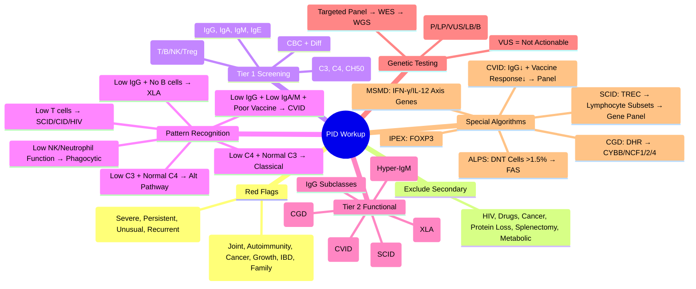

# 2.3 Approach to Suspected Immunodeficiency


---

## 🎯 Learning Objectives
- [ ] Apply **clinical red flags** for immunodeficiency (SPUR, JACKIE, Warning signs)
- [ ] Perform **tiered diagnostic approach** — Screening → Targeted → Advanced genetic
- [ ] Interpret **basic immunology panel** — CBC, Immunoglobulins, Lymphocyte subsets, Complement
- [ ] Select **functional assays** — NBT/DHR, Vaccine responses, Lymphocyte proliferation
- [ ] Apply **genetic testing strategy** — Targeted panels → WES → WGS → Re-analysis
- [ ] Distinguish **Primary vs Secondary** immunodeficiency
- [ ] Answer viva: "SPUR criteria" and "Workup for suspected CVID" and "When to order WES"

---

## 🧠 Core Concept: Diagnostic Approach to PID

```mermaid
flowchart TD
    A[Clinical Suspicion of PID] --> B[History & Examination<br/>SPUR / JACKIE criteria]
    B --> C[Exclude Secondary Causes<br/>HIV, Drugs, Malignancy, Protein loss, Splenectomy]
    C --> D[Tier 1: Screening Panel<br/>CBC+Diff, IgG/IgA/IgM/IgE, Lymphocyte Subsets (T/B/NK), Complement C3/C4/CH50]
    D --> E{Abnormal?}
    E -->|No| F[Low Clinical Probability<br/>Reassess if clinical suspicion high]
    E -->|Yes| G[Tier 2: Targeted Functional Tests<br/>Vaccine responses, DHR/NBT, Lymphocyte proliferation, IgG subclasses]
    G --> H{Specific Pattern?}
    H -->|Yes| I[Targeted Genetic Testing<br/>Gene Panels / Single Gene]
    H -->|No| J[Tier 3: Comprehensive Genomic<br/>PID Gene Panel → WES → WGS]
    J --> K[Diagnosis → Genetic Counselling<br/>Cascade Testing, PGT-M, Prenatal]
```

---

## 1️⃣ Clinical Red Flags — When to Suspect PID

### SPUR Criteria (Clinical Warning Signs)
| Letter | Feature | Examples |
|--------|---------|----------|
| **S** | **Severe** infections | Sepsis, Meningitis, Osteomyelitis, Deep-seated abscesses |
| **P** | **Persistent** infections | >2 months despite appropriate treatment |
| **U** | **Unusual** organisms | *Pneumocystis*, *Aspergillus*, *Mycobacteria* (NTM/BCG), *Cryptococcus*, *Cytomegalovirus* |
| **R** | **Recurrent** infections | ≥2 severe infections/year, ≥4-6 sinopulmonary infections/year |

### JACKIE Criteria (Extended)
| Letter | Feature |
|--------|---------|
| **J** | **J**oint symptoms (Arthritis, Arthralgia) |
| **A** | **A**utoimmunity (AIHA, ITP, SLE-like, Thyroiditis) |
| **C** | **C**ancer (Lymphoma, Early-onset solid tumours) |
| **K** | **K**in growth failure (FTT, Short stature) |
| **I** | **I**nflammatory bowel disease / Enteropathy |
| **E** | **E**xtended family history (PID, Early death, Consanguinity) |

### Jeffrey Modell Foundation — 10 Warning Signs
1. 4+ new ear infections in 1 year
2. 2+ serious sinus infections in 1 year
3. 2+ months on antibiotics with little effect
4. 2+ pneumonias in 1 year
5. Failure to gain weight/grow normally
6. Recurrent deep skin/organ abscesses
7. Persistent thrush after age 1
8. Need for IV antibiotics to clear infections
9. 2+ deep-seated infections (septicaemia, meningitis)
10. Family history of PID

### Age-Specific Red Flags
| Age | Red Flags |
|-----|-----------|
| **Neonate/Infant** | Failure to thrive, Chronic diarrhoea, Persistent thrush, BCG-osis, **Absent thymic shadow** (CXR), **Absent tonsils/lymph nodes** |
| **Child** | Recurrent sinopulmonary infections, Failure to thrive, Autoimmunity, Malignancy, **Lymphadenopathy/hepatosplenomegaly** |
| **Adult** | Recurrent sinopulmonary infections, **Autoimmunity**, **Malignancy**, **Bronchiectasis**, **Refractory infections**, **Family history** |

---

## 2️⃣ Diagnostic Algorithm — Stepwise Approach

### Step 1: Exclude Secondary Causes First
| Category | Key Tests |
|----------|-----------|
| **HIV** | HIV Ag/Ab, CD4 count, Viral load |
| **Malignancy** | CBC, LDH, Imaging (CT/PET), Bone marrow if indicated |
| **Drugs** | Drug history (Steroids, Chemo, Biologics, Immunosuppressants) |
| **Protein Loss** | Urine protein/creatinine, 24h urine protein, Faecal alpha-1-antitrypsin |
| **Splenectomy** | History, Howell-Jolly bodies, Spleen ultrasound |
| **Metabolic** | HbA1c, Urea/Creatinine, LFT, TFT, Nutritional markers |
| **Medications** | Review: Steroids, Chemo, Biologics, Immunosuppressants |

> **Rule:** **Secondary > Primary** — Always exclude secondary causes before extensive PID workup.

---

## 3️⃣ Tiered Laboratory Investigation

### Tier 1: Basic Screening Panel (First-Line)
| Test | What It Detects | Normal Ranges (Adult) |
|------|-----------------|----------------------|
| **CBC + Differential** | Neutropenia, Lymphopenia, Lymphocytosis, Thrombocytopenia | Neutrophils 2-7.5×10⁹/L; Lymphocytes 1-4×10⁹/L |
| **Immunoglobulins** (IgG, IgA, IgM, IgE) | Hypogammaglobulinaemia, Hyper-IgM, Hyper-IgE, IgA deficiency | IgG 7-16 g/L, IgA 0.7-4 g/L, IgM 0.4-2.3 g/L, IgE <100 kU/L |
| **Lymphocyte Subsets** (Flow Cytometry) | **T cells** (CD3, CD4, CD8, CD4/CD8 ratio), **B cells** (CD19/20), **NK cells** (CD16/56), **Tregs** (CD4+CD25+FOXP3+) | CD3 700-2500/μL; CD4 500-1500/μL; CD8 200-800/μL; CD19 100-600/μL; NK 100-500/μL |
| **Complement** (C3, C4, CH50) | Classical pathway deficiency, C3 deficiency, Consumption | C3 0.9-1.8 g/L; C4 0.1-0.4 g/L; CH50 30-50 U/mL |
| **CRP/ESR** | Inflammation marker | CRP <5 mg/L |

### Interpretation of Tier 1 Results

| Scenario | Likely PID Category | Next Steps |
|----------|---------------------|------------|
| **Low IgG + Low IgA/IgM + Low B cells** | XLA (if male infant) | BTK sequencing |
| **Low IgG + Low IgA/IgM + Normal/Low B cells** | CVID (if >2y), Hyper-IgM | Genetic panel (NFKB1, STAT3, TNFRSF13B, etc.) |
| **Normal IgG + Low IgA** | Selective IgA deficiency | Confirm >4y, Exclude CVID |
| **Low IgG + High IgM** | Hyper-IgM syndrome | CD40LG, AICDA, CD40, UNG sequencing |
| **Lymphopenia + Low T cells** | SCID, CID, HIV, Drug effect | TREC assay (if infant), HIV test, Drug review |
| **Low CD4/CD8 ratio + Inverted** | Viral infection, Autoimmunity, Lymphoma | HIV test, Flow cytometry, Imaging |
| **Neutropenia + Recurrent infections** | CGD, Cyclic neutropenia, Congenital | DHR flow, G6PD, ELANE, HAX1, CSF3R |
| **Low C3 + Normal C4** | Alternative pathway defect, C3 deficiency | Factor B, Properdin, C3 levels |
| **Low C4 + Normal C3** | Classical pathway defect (C1q, C4, C2), SLE | C1q, C4, C2, CH50 |
| **Low CH50 + Low C3 + Low C4** | Classical pathway consumption (SLE, Cryoglobulinaemia) | SLE workup, Cryoglobulins |

---

## 3️⃣ Tier 2: Functional Assays (Targeted)

| Test | Indication | Method | Interpretation |
|------|------------|--------|----------------|
| **Vaccine Response** | Suspected antibody deficiency (CVID, IgG subclass) | IgG titres pre/post vaccination (Pneumococcal, Tetanus, Hib) | **Protective**: Anti-Pn >1.3 μg/mL (or 4-fold rise); **Impaired**: <1.3 μg/mL or <4-fold rise |
| **DHR Flow Cytometry** | Suspected CGD | Dihydrorhodamine 123 oxidation by neutrophils | **Normal**: >95% oxidation; **CGD**: <10-20% |
| **NBT Test** | CGD screening (if DHR unavailable) | Nitroblue tetrazolium reduction | **>95% positive** = Normal |
| **Lymphocyte Proliferation** | Suspected CID/SCID | ³H-Thymidine or CFSE dilution to Mitogens (PHA, ConA, PWM), Antigens (Candida, Tetanus) | **Absent/Reduced** = T cell defect |
| **IgG Subclasses** | Recurrent sinopulmonary infections with normal total IgG | Nephelometry/ELISA | IgG2 deficiency → Polysaccharide response defect |
| **Specific Antibody Titres** | Post-vaccination / Natural infection | ELISA / Multiplex bead assay | Protective vs Non-protective levels |
| **CD40L Expression** | Hyper-IgM (CD40L) | Flow cytometry (Activated CD4+ T cells) | **Absent CD40L** = X-linked Hyper-IgM |
| **BTK Flow Cytometry** | XLA screening | Intracellular BTK protein | **Absent BTK** = XLA |
| **IFNGR1/IL12RB1/STAT1** | MSMD suspicion | Flow / Sequencing | Absent expression = Defect |

---

## 3️⃣ Tier 3: Genetic Testing Strategy

### When to Proceed to Genetic Testing
| Indication | Recommended Approach |
|------------|----------------------|
| **Strong clinical phenotype** + **Abnormal Tier 1/2** | **Targeted Gene Panel** (PID-specific: 300-400 genes) |
| **Atypical/Complex phenotype** | **Whole Exome Sequencing (WES)** |
| **Negative Panel + High Suspicion** | **WES → WGS** |
| **Prenatal / PGT-M** | **Targeted known familial variant** |

### Genetic Testing Modalities

| Test | Genes Covered | Turnaround | Indication |
|------|---------------|------------|------------|
| **Targeted PID Panel** | 300-400 genes (BTK, NFKB1, STAT3, STAT1, IL2RG, ADA, RAG1/2, CYBB, etc.) | 4-6 weeks | First-line for defined phenotypes |
| **Whole Exome Sequencing (WES)** | ~20,000 coding genes | 8-12 weeks | Unclear phenotype, Negative panel |
| **Whole Genome Sequencing (WGS)** | Entire genome (SNV, CNV, SV, Non-coding) | 12+ weeks | Research, Negative WES, Complex SV |
| **Sanger Sequencing** | Single gene / Familial variant | 1-2 weeks | Confirmation, Segregation, Known variant |
| **MLPA** | CNV detection (Exon-level) | 1-2 weeks | DMD, SMN1, PMP22, MLH1/MSH2, BRCA1/2 |
| **qPCR** | Known variant quantification | 1-2 weeks | Chimerism, BCR::ABL1, SMN1/2 copy number |

### Variant Interpretation (ACMG/AMP 5-Tier)
| Class | Terminology | Clinical Action |
|-------|-------------|-----------------|
| **1** | **Pathogenic (P)** | **Use for clinical decisions** (Diagnosis, Cascade, PGT) |
| **2** | **Likely Pathogenic (LP)** | **Use for clinical decisions** (Strong evidence) |
| **3** | **Variant of Uncertain Significance (VUS)** | **Do NOT use for clinical decisions**; Segregation, Functional, Re-analyse |
| **4** | **Likely Benign (LB)** | Do not use for diagnosis |
| **5** | **Benign (B)** | Exclude from reporting |

### VUS Management
| Step | Action |
|------|--------|
| **1. Explain** | "We don't know if this causes disease" |
| **2. Do NOT** | Use for clinical decisions (Diagnosis, PGT, Prenatal) |
| **3. Offer** | Segregation analysis (Parents, Siblings), Functional studies (if available) |
| **4. Plan** | Re-analysis in 12-24 months (Guidelines evolve, Databases updated) |
| **5. Document** | "VUS — Not actionable for clinical decisions" in report |

---

## 4️⃣ Special Diagnostic Scenarios

### Newborn Screening for SCID
| Test | Principle | Performance |
|------|-----------|-------------|
| **TREC Assay** | PCR for TCR excision circles (by-product of TCR rearrangement) | **Sensitivity >99%**, Specificity >99%; **False +** in preterm, Lymphopenia |
| **KREC Assay** | Kappa-deleting recombination circles (B cell output) | Complements TREC for B cell defects |

### Approach to Adult with Suspected PID
| Step | Action |
|------|--------|
| **1. Detailed History** | Infection pattern (SPUR), Autoimmunity, Malignancy, Family history, Drug history |
| **2. Exclude Secondary** | HIV, Malignancy, Drugs, Protein loss, Splenectomy, Diabetes |
| **3. Tier 1 Screen** | CBC, IgG/IgA/IgM/IgE, Lymphocyte subsets, Complement |
| **4. Targeted Testing** | Based on pattern: Vaccine response (Antibody), DHR (CGD), Lymphocyte proliferation (T cell) |
| **4. Genetic Panel** | If high suspicion + abnormal screen |

### PID Presenting as Autoimmunity
| PID | Autoimmune Manifestation |
|-----|--------------------------|
| **CVID** | ITP, AIHA, RA, Thyroiditis, Sjogren's, Pernicious anaemia |
| **ALPS** | AIHA, ITP, Neutropenia |
| **CTLA-4 Haplo** | Cytopenias, Thyroiditis, Enteropathy, Lymphoproliferation |
| **LRBA** | IBD, Cytopenias, Thyroiditis, Autoimmune lymphoproliferation |
| **CTLA-4 Haplo / LRBA** | **Abatacept-responsive** |
| **IPEX** | T1DM, Thyroiditis, Eczema, Enteropathy |
| **STAT3 GOF** | Lymphoproliferation, Autoimmunity, Lymphoma |
| **STAT1 GOF** | Chronic mucocutaneous candidiasis, Autoimmunity, Vascular aneurysms |

---

## ⚡ FCPS/MRCP High-Yield Summary

| Clinical Scenario | First-Line Tests | Key Diagnostic Clue | Definitive Test |
|-------------------|------------------|---------------------|-----------------|
| **Male infant, recurrent infections, no tonsils** | CBC, Ig, Lymphocyte subsets | **Absent B cells (CD19+ <1%)** | **BTK sequencing** (XLA) |
| **Adult, recurrent sinopulmonary, bronchiectasis, autoimmunity** | IgG/IgA/IgM, B cells, Vaccine response | Low IgG + Low IgA/IgM + Poor vaccine response | **CVID Panel** (NFKB1, STAT3, etc.) |
| **Infant, failure to thrive, PJP, absent thymic shadow** | CBC, Lymphocyte subsets, TREC | **Lymphopenia, Absent T cells** | **SCID Panel** (IL2RG, ADA, RAG, IL7R, Artemis) |
| **Recurrent staph/aspergillus, granulomas** | DHR Flow | **Absent oxidative burst** | **CYBB/NCF1/2/4 sequencing** (CGD) |
| **Recurrent BCG-osis, NTM, Salmonella** | IFN-γ/IL-12 axis genes | **IL12RB1, IFNGR1, STAT1** | **MSMD Panel** |
| **CVID + Autoimmunity (ITP, AIHA)** | IgG/IgA/IgM, B cells, Vaccine response | Low IgG + Poor vaccine response | **CVID Panel, CTLA-4, LRBA if dysregulation features** |
| **Lymphadenopathy, Splenomegaly, DNT cells** | Lymphocyte subsets, sFasL, Vit B12 | **DNT cells >1.5%** | **FAS sequencing** (ALPS) |
| **Enteropathy + T1DM + Eczema (Infant)** | FOXP3 sequencing, Tregs | **Absent Tregs** | **IPEX (FOXP3)** |
| **Recurrent BCG-osis, NTM** | IFN-γ/IL-12 axis genes | **IL12RB1, IFNGR1, STAT1** | **MSMD Panel** |

---

## 🎤 Viva Questions (Expected Answers)

| # | Question | Expected Answer |
|---|----------|-----------------|
| 1 | What are the SPUR criteria for suspecting PID? | **S**evere, **P**ersistent, **U**nusual organisms, **R**ecurrent infections |
| 2 | What is the first test for suspected SCID in a newborn? | **TREC assay** on dried blood spot (Newborn screening) |
| 3 | How do you screen for CGD? | **DHR Flow Cytometry** (Gold standard — quantitative oxidative burst) |
| 4 | What is the diagnostic test for CVID? | **Low IgG + Low IgA/IgM + Impaired vaccine response** + Exclusion of secondary causes + Age >2-4y |
| 5 | When do you order WES for PID? | **Negative targeted panel + high clinical suspicion** OR **Atypical/complex phenotype** |
| 6 | What is the definitive test for CGD? | **DHR Flow Cytometry** (Quantitative oxidative burst); Genetic confirmation with CYBB/NCF1/2/4 sequencing |
| 7 | How do you differentiate XLA from CVID? | **XLA**: Male, <6m, **Absent B cells**, BTK mutation; **CVID**: Later onset, Normal/low B cells, Heterogeneous genetics |
| 8 | What is the first test for suspected Hyper-IgE syndrome? | **Serum IgE level** (Markedly elevated >2000 IU/mL); Confirm with **STAT3 sequencing** |
| 9 | When do you suspect MSMD? | **BCG-osis, Disseminated NTM, Recurrent Salmonella** → **IFN-γ/IL-12 axis genes** (IFNGR1/2, IL12RB1, STAT1) |
| 10 | What is the first step in evaluating suspected PID? | **Exclude secondary causes** (HIV, Drugs, Malignancy, Protein loss, Splenectomy, Metabolic) |

---

## 🧩 Confusions & Mnemonics

| Confusion | Clarification |
|-----------|---------------|
| **"WES first for all PID"** | **NO.** Targeted panel first (Cost-effective, Higher depth, Faster). WES if panel negative + high suspicion. |
| **"TREC = Diagnoses all SCID"** | **NO.** False + in preterm, Lymphopenia; False - in leaky SCID/Omenn. **Clinical correlation essential**. |
| **"DHR = NBT"** | **DHR = Quantitative, Flow-based** (Gold standard); **NBT = Qualitative, Microscopy** (Limited sensitivity). |
| **"Low IgG = CVID"** | **NO.** Must have **Impaired vaccine response + Exclusion of secondary causes + Age >2-4y**. |
| **"All VUS are pathogenic"** | **NO.** VUS = **Uncertain**; Do NOT act on it. Segregation/Functional/Re-analysis needed. |
| **"Genetic test = Diagnosis"** | **NO.** **Clinical correlation essential**; VUS, Incomplete penetrance, Variable expressivity, Mosaicism. |
| **"CVID = Just low IgG"** | **NO.** Must have **Impaired specific antibody response** + Exclusion of secondary + Age criteria. |
| **"SCID = Always fatal without HSCT"** | **True historically**, but **Gene therapy** (IL2RG, ADA, RAG) now curative; **HSCT <3.5m = Best outcome**. |
| **"Genetic test replaces clinical workup"** | **NO.** Clinical phenotype guides gene selection, Interpretation, Counselling. |
| **"All PID need HSCT"** | **NO.** Only CID/SCID, Severe CGD, FA, HLH, MSMD, WAS, IPEX, ALPS (refractory). CVID/XLA = IVIG. |

> **Mnemonic: APPROACH PID WORKUP**  
> **A**ssess Clinical: **SPUR/JACKIE** → Red flags  
> **P**rimary vs Secondary: **Exclude Secondary First** (HIV, Drugs, Cancer, Protein loss, Splenectomy)  
> **P**anel Tier 1: **CBC + Diff, IgG/A/M/E, Lymph Subsets (T/B/NK/Treg), Complement (C3, C4, CH50)**  
> **R**eview Pattern: **Low IgG+Low B=XLA; Low IgG+Normal B=CVID; Low T=SCID/CID; Low NK/Neutrophil=Phagocytic**  
> **O**ptional Tier 2: **Vaccine Response (CVID), DHR (CGD), Proliferation (SCID), IgG Subclasses**  
> **A**nalyse Pattern: **Match to IUIS Category → Targeted Panel**  
> **C**ascade: **Proband → Genetic Result → Family Letters → Cascade Testing (50% 1st degree)**  
> **H**ierarchy: **Targeted Panel → WES → WGS** (Cost, Depth, Yield)  
> **V**US: **Not Actionable** — Segregation, Functional, Re-analyse in 1-2y  
> **W**orkup Algorithm: **SPUR → Exclude 2° → Tier 1 → Tier 2 → Targeted Panel → WES → WGS**  
> **U**nique Clues: **Absent Tonsils (XLA), Absent Thymus (SCID), Pneumatoceles (STAT3), DNT Cells (ALPS), Erythroderma (Omenn)**  
> **P**re-test Counselling: **Informed Consent, VUS Discussion, Insurance, Reproductive Options**  
> **P**ost-test: **In-person Disclosure, Psychosocial Support, Cascade Letters, Surveillance Plan**  
> **E**xclusions First: **HIV, Drugs, Cancer, Protein Loss, Splenectomy, Metabolic**  
> **X**plain Results: **In-person, Teach-back, Written Summary, Referrals (Genetics, Specialists)**  
> **S**econdary Always First: **HIV, Chemo, Biologics, Steroids, Splenectomy, Protein Loss, Malignancy, Metabolic**  

---

## 🗺️ Mind Map



---

## 📅 Spaced Repetition Tracker

| Review | Date | Score (0–5) | Notes |
|--------|------|-------------|-------|
| Day 1 | | | |
| Day 3 | | | |
| Day 7 | | | |
| Day 14 | | | |
| Day 30 | | | |
| Day 90 | | | |

---

## 📝 Self-Test Scorecard

| Section | Max | Score | % |
|---------|-----|-------|---|
| Red Flags (SPUR/JACKIE) | 2 | | |
| Excluding Secondary Causes | 2 | | |
| Tier 1 Screening Interpretation | 4 | | |
| Tier 2 Functional Tests | 3 | | |
| Genetic Testing Strategy | 3 | | |
| VUS Management | 2 | | |
| Special Scenarios (SCID, CGD, CVID, etc.) | 3 | | |
| Diagnostic Algorithms | 3 | | |
| **Total** | **20** | | |

---

## 💬 Exam Answer Modes

| Format | Prompt | Key Points |
|--------|--------|------------|
| **Long Essay** | "Describe the stepwise diagnostic approach to a child with suspected primary immunodeficiency." | SPUR/JACKIE red flags → Exclude secondary → Tier 1 screen (CBC, Ig, Lymph subsets, Complement) → Pattern recognition → Tier 2 functional (Vaccine, DHR, Proliferation) → Targeted gene panel → WES if negative → VUS management, Cascade testing |
| **Short Note** | "Diagnostic workup for suspected CVID." | Low IgG + Low IgA/IgM + Impaired vaccine response (Pneumococcal) + Exclusion of secondary + Age >2-4y → Targeted panel (NFKB1, STAT3, TNFRSF13B, etc.) → Genetic counselling |
| **Viva** | "10-month-old boy with recurrent pneumonia, diarrhoea, no tonsils. IgG 1.2, IgA <0.07, IgM 0.1. B cells 0.2%. Next test?" | **BTK sequencing** (XLA). Absent B cells + Pan-hypogammaglobulinaemia + Male infant = XLA. |
| **Ward Round** | "Adult with recurrent sinusitis, bronchiectasis, low IgG/IgA, normal B cells, poor pneumococcal response. Next step?" | **CVID Panel** (NFKB1, STAT3, TNFRSF13B, IKZF1). Check vaccine response (Pneumococcal). Exclude secondary. |
| **Last-Night** | "SPUR/JACKIE → Exclude 2° → Tier 1 (CBC, Ig, Lymph subsets, Comp). Pattern: XLA (No B), CVID (Low IgG+Poor vacc), SCID (No T), CGD (DHR). Tier 2: Vaccine, DHR, Prolif. Gene: Panel→WES→WGS. VUS: Not actionable. SCID: TREC→HSCT<3.5m. CGD: DHR→CYBB. CVID: Panel. MSMD: IFN-γ/IL-12." | Compressed. |

---

## 📌 Summary
- **Red Flags**: SPUR (Severe, Persistent, Unusual, Recurrent); JACKIE (Joint, Autoimmunity, Cancer, Growth, IBD, Family)
- **Always Exclude Secondary First**: HIV, Drugs, Malignancy, Protein loss, Splenectomy, Metabolic
- **Tier 1 Screen**: CBC+Diff, IgG/IgA/IgM/IgE, Lymphocyte subsets (T/B/NK/Treg), Complement (C3, C4, CH50)
- **Pattern Recognition**: XLA (Absent B), CVID (Low IgG + Poor vaccine response), SCID (Lymphopenia), CGD (DHR), MSMD (IFN-γ/IL-12 axis)
- **Tier 2 Functional**: Vaccine response (CVID), DHR Flow (CGD), Lymphocyte proliferation (SCID), CD40L (Hyper-IgM), BTK Flow (XLA)
- **Genetic Testing**: Targeted Panel → WES → WGS; **ACMG 5-tier classification**; **VUS = Not actionable**
- **Special Algorithms**: SCID (TREC → HSCT <3.5m), CGD (DHR → CYBB/NCF), CVID (Panel), ALPS (DNT cells → FAS), IPEX (FOXP3)
- **Cascade Testing**: Proband → 1st-degree (50%) → 2nd-degree (25%); Family letters; Genetic counselling each
- **VUS Management**: "Not actionable" → Segregation, Functional, Re-analyse in 1-2 years
- **Pre/Post-Test Counselling**: Informed consent, Psychosocial support, In-person disclosure, Written summary

---

## ❓ MCQs (10)

1. **First test for suspected SCID in newborn?**  
   A. CBC  B. **TREC assay**  C. Ig levels  D. Lymphocyte subsets  
   *Answer: B. TREC assay on dried blood spot (NBS).*

2. **Best screening test for CGD?**  
   A. NBT test  B. **DHR Flow Cytometry**  C. Catalase test  D. Gene sequencing  
   *Answer: B. DHR Flow = Gold standard (Quantitative oxidative burst).*

3. **Adult with recurrent sinopulmonary infections, low IgG/IgA, normal B cells. Next test?**  
   A. BTK sequencing  B. **Pneumococcal vaccine response**  C. DHR flow  D. TREC  
   *Answer: B. Vaccine response assessment for CVID diagnosis.*

4. **When to order WES for PID?**  
   A. First-line  B. **Negative targeted panel + high suspicion**  C. All PID  D. Never  
   *Answer: B. After negative targeted panel with high clinical suspicion.*

5. **VUS management?**  
   A. Treat as pathogenic  B. **Not actionable; Segregation/Functional/Re-analyse**  C. Report as benign  D. Ignore  
   *Answer: B. VUS = Uncertain significance; Do not use for clinical decisions.*

6. **SCID newborn screening test?**  
   A. CBC  B. **TREC assay**  C. Ig levels  D. Lymphocyte subsets  
   *Answer: B. TREC assay on dried blood spot.*

7. **CGD diagnostic gold standard?**  
   A. NBT test  B. **DHR Flow Cytometry**  C. Catalase test  D. Gene sequencing  
   *Answer: B. DHR Flow = Gold standard (Quantitative oxidative burst).*

8. **Hyper-IgE syndrome — diagnostic clue?**  
   A. Low IgE  B. **High IgE + Eosinophilia + Staph abscesses + Pneumatoceles**  C. Lymphopenia  D. High IgM  
   *Answer: B. High IgE (>2000), Eosinophilia, Staph abscesses, Pneumatoceles.*

9. **When to order WES for PID?**  
   A. First test  B. **Negative targeted panel + high suspicion**  C. Always  D. Never  
   *Answer: B. After negative targeted panel with high clinical suspicion.*

10. **CVID diagnosis requires:**  
    A. Low IgG only  B. **Low IgG + Low IgA/IgM + Impaired vaccine response + Age >2-4y + Exclude secondary**  C. Low IgM only  D. Absent B cells  
    *Answer: B. Low IgG + Low IgA/IgM + Impaired vaccine response + Age >2-4y + Exclude secondary.*

---

## 📋 SBAs (10)

1. **5-month-old boy, recurrent pneumonia, no tonsils. IgG 1.2, IgA <0.07, IgM 0.1. B cells 0.2%. Diagnosis?**  
   A. CVID  B. **XLA**  C. Hyper-IgM  D. SCID  
   *Answer: B. XLA: Infant, Absent B cells, Pan-hypogammaglobulinaemia.*

2. **Adult with recurrent infections, low IgG/IgA, normal B cells, poor pneumococcal response. Next step?**  
   A. IVIG  B. **CVID Gene Panel**  C. BTK sequencing  D. TREC assay  
   *Answer: B. CVID Panel (NFKB1, STAT3, TNFRSF13B, etc.).*

3. **Infant with failure to thrive, PJP, absent thymic shadow. Lymphopenia, absent T cells. Diagnosis?**  
   A. CVID  B. **SCID**  C. XLA  D. CGD  
   *Answer: B. SCID: Lymphopenia, Absent T cells, PJP, Absent thymus.*

4. **Couple with CF child, pregnant at 12 weeks. Prenatal testing for CF?**  
   A. NIPT  B. **CVS 11-14w (qf-PCR + CFTR sequencing)**  C. Amnio 16w  D. Ultrasound  
   *Answer: B. CVS 11-14w with qf-PCR + CFTR sequencing for known familial mutations.*

5. **Couple with SCA2 (AD) father affected. Risk to child?**  
   A. 25%  B. **50%**  C. 75%  D. 100%  
   *Answer: B. AD inheritance → 50% risk per child.*

---

## 🔑 Answer Keys
| MCQs | SBAs |
|------|------|
| 1-B, 2-B, 3-B, 4-B, 5-B, 6-B, 7-B, 8-B, 9-B, 10-B | 1-B, 2-B, 3-B, 4-B, 5-B |

---

## 🔗 Cross-Links
- [[1. Fundamentals of Immunology]] — B/T cell development, Immunoglobulins, Complement
- [[2.1 Primary Immunodeficiencies]] — Detailed PID phenotypes for each category
- [[2.2 Secondary Immunodeficiencies]] — Exclude before diagnosing PID
- [[3.1 Mechanisms of Autoimmunity]] — PID-associated autoimmunity (CVID, ALPS, CTLA4)
- [[3.2 Systemic Autoimmune Diseases]] — SLE, SSc overlap with PID
- [[3.3 Organ-Specific Autoimmune Diseases]] — CVID autoimmune manifestations
- [[4.1-4.4 Hypersensitivity & Allergy]] — Anaphylaxis in IgA deficiency, Drug reactions in PID
- [[5.1-5.4 Transplant Immunology]] — HSCT for PID (SCID, CGD, WAS, HLH)
- [[5.5 Genetic Counselling]] — Pre-test counselling, VUS communication, Cascade testing
- [[5.1-5.4 Genetic Testing Technologies]] — NGS panels, MLPA, qPCR, Repeat-primed PCR
- [[5.4 Prenatal & Preimplantation Testing]] — CVS, Amnio, PGT-M for PID
- [[5.5 Genetic Counselling]] — Pre-test counselling, VUS communication, Cascade testing
- [[9. ELSI]] — VUS ethics, DTC testing, Insurance discrimination
- [[10. System-Based Clinical Genetics]] — PID genes by system (Neurology, Respiratory, GI, etc.)

---

**Last Updated:** 2026-06-15  
**Next:** Build `3.1 Mechanisms of Autoimmunity.md`
---

> Auto-generated study sections for "Clinical Immunology" — Ch 4: Clinical Immunology.

## Flashcards (6 generated)

- Q: What is the definition of Clinical Immunology?
  A: ## 🧠 Core Concept: Diagnostic Approach to PID
- Q: How is Clinical Immunology classified?
  A: Targeted Gene Panel (PID-specific: 300-400 genes)
- Q: What is Negative Panel + High Suspicion of Clinical Immunology?
  A: WES → WGS
- Q: What is Prenatal / PGT-M of Clinical Immunology?
  A: Targeted known familial variant
- Q: How is Clinical Immunology classified?
  A: Targeted Gene Panel (PID-specific: 300-400 genes)
- Q: What is Negative Panel + High Suspicion of Clinical Immunology?
  A: WES → WGS

## MCQs (1 generated)

1. **Which of the following best describes Clinical Immunology?**
   A. **## 🧠 Core Concept: Diagnostic Approach to PID**
   B. An unrelated condition not matching the clinical picture of Clinical Immunology
   C. A complication seen late in the disease course of Clinical Immunology
   D. A condition that mimics Clinical Immunology but has a different underlying cause

## SBA Questions (1 generated)

1. A patient with suspected Clinical Immunology presents with: S — Severe infections; P — Persistent infections; U — Unusual organisms. What is the most likely diagnosis?
   A. **Clinical Immunology**
   B. A condition that mimics Clinical Immunology but is not the same entity
   C. A complication of Clinical Immunology rather than the primary diagnosis
   D. An unrelated condition in the same clinical category as Clinical Immunology

## PasTest Scenario SBAs (Clinical Vignettes)

> **Auto-generated PasTest/Mediscope-style scenario SBAs** grounded in the authored source. Each scenario tests a real clinical fact (triad, specific sign, contraindication, trial, first-line Rx) extracted from the topic. *Source: Ch 4: Clinical Immunology — Approach to Immunodeficiency*

**Q1.** Which of the following features is most specific or characteristic of Approach to Immunodeficiency?

  - **A.** "CVID = Just low IgG"
  - **B.** A feature common to many acute inflammatory conditions
  - **C.** A non-specific sign that does not localise the diagnosis
  - **D.** An investigation finding rather than a clinical feature

  > **Answer: A** — "CVID = Just low IgG"
  >
  > *Source:* |
| **"CVID = Just low IgG"** | **NO.** Must have **Impaired specific antibody response** + Exclusion of secondary + Age criteria

