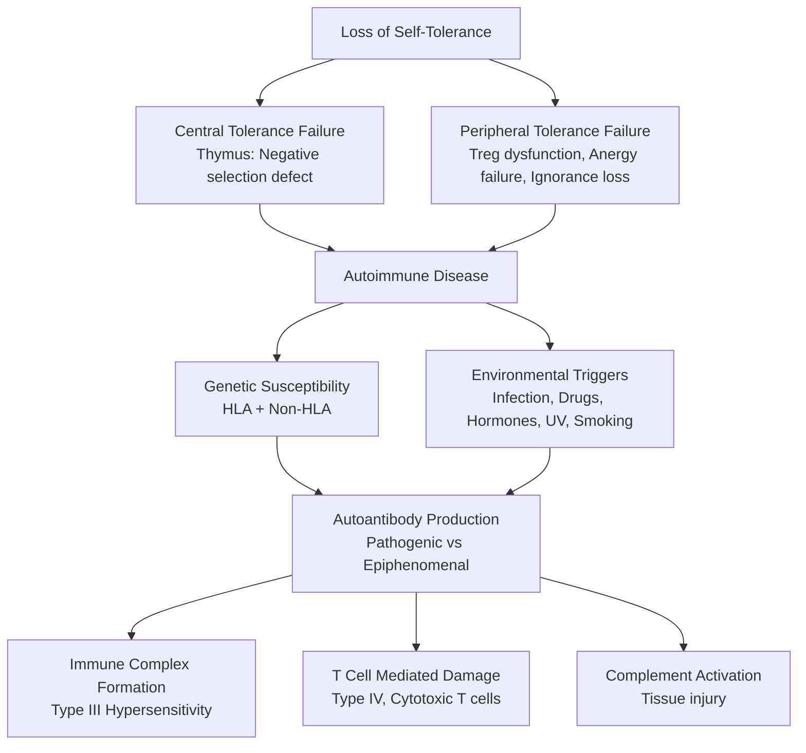

# 3.1 Mechanisms of Autoimmunity


---

## 🎯 Learning Objectives
- [ ] Explain **central & peripheral tolerance** mechanisms (Thymic selection, Treg, Anergy, Deletion)
- [ ] Describe **molecular mimicry**, **epitope spreading**, **bystander activation**, **polyclonal activation**
- [ ] Understand **HLA associations** — Disease-specific alleles, Molecular basis (Shared epitope, Pocket 4)
- [ ] Explain **environmental triggers** — Infections, Drugs, Hormones, UV, Smoking, Microbiome
- [ ] Classify **autoantibodies** by pathogenicity (Direct, Indirect, Epiphenomenon)
- [ ] Apply **autoimmune disease classification** — Systemic vs Organ-specific, Antibody vs Cell-mediated
- [ ] Answer viva: "Central vs peripheral tolerance" and "Molecular mimicry examples" and "HLA-B27 mechanism"

---

## 🧠 Core Concept: Breakdown of Tolerance



---

## 1️⃣ Central Tolerance (Thymic Selection)

### Positive Selection
- **DP Thymocytes** (CD4+CD8+) → TCR認識 self-pMHC (Low affinity) → Survival signal
- **CD4+** → MHC Class II restriction; **CD8+** → MHC Class I restriction

### Negative Selection
| Mechanism | Description |
|-----------|-------------|
| **Clonal Deletion** | High-affinity TCR:self-pMHC → Apoptosis (BIM-dependent) |
| **Treg Differentiation** | Intermediate affinity → **FOXP3+ Tregs** (tTregs) |
| **Receptor Editing** | B cells: Light chain rearrangement (κ/λ) → Altered specificity |

### Key Players
| Molecule | Role |
|----------|------|
| **AIRE** | **Autoimmune Regulator** — Promotes tissue-restricted antigen (TRA) expression in mTECs; **Mutation → APS-1 (APECED)** |
| **FEZF2** | TRA expression in mTECs (Complementary to AIRE) |
| **BIM (BCL2L11)** | Mediates apoptosis during negative selection |

### Defects → Autoimmunity
| Defect | Disease |
|--------|---------|
| **AIRE mutation** | **APS-1** (Candidiasis, Hypoparathyroidism, Addison’s) |
| **FAS/FASL mutation** | **ALPS** (Impaired deletion of autoreactive lymphocytes) |
| **CTLA-4 haploinsufficiency** | Immune dysregulation, Autoimmunity, Lymphoproliferation |

---

## 2️⃣ Peripheral Tolerance

### Mechanisms
| Mechanism | Description | Failure → Disease |
|-----------|-------------|-------------------|
| **Anergy** | TCR signal without co-stimulation (CD28/B7) → Unresponsiveness | **CTLA-4 haploinsufficiency** → Impaired anergy |
| **Deletion** | Activation-induced cell death (AICD) via FAS/FASL | **ALPS** (FAS/FASLG mutation) |
| **Ignorance** | Antigen not encountered (Sequestered sites, Low dose) | **Sympathetic ophthalmia** (Eye trauma → Antigen exposure) |
| **Immunosuppression by Tregs** | **FOXP3+ Tregs** → IL-10, TGF-β, CTLA-4, IL-35, cAMP | **IPEX (FOXP3)**, **CTLA-4/HI**, **LRBA** |
| **Immunosuppressive Cytokines** | IL-10, TGF-β, IL-35 | IL-10 deficiency → Colitis |

### Regulatory T Cells (Tregs)
| Subset | Marker | Function |
|--------|--------|----------|
| **tTregs (Thymic)** | CD4+CD25+FOXP3+Helios+ | Central tolerance, Self-antigen specific |
| **pTregs (Peripheral)** | CD4+CD25+FOXP3+Helios- | Peripheral tolerance, Commensal antigens, Induced by TGF-β + IL-2 |
| **Tr1** | CD4+IL-10+LAG3+ | IL-10 production, Mucosal tolerance |

---

## 3️⃣ Mechanisms Breaking Tolerance

### 3.1 Molecular Mimicry
| Concept | Example |
|---------|---------|
| **Pathogen epitope resembles self-antigen** → Cross-reactive T/B cells | **Rheumatic Fever**: *Streptococcus* M protein → Myosin/Heart valve |
| | **GBS**: *Campylobacter* GM1 ganglioside → Anti-GM1 → Motor neuropathy |
| | **Rheumatic Heart Disease** | Group A Strep M protein → Cardiac myosin |
| | **Reactive Arthritis** | *Chlamydia*, *Salmonella*, *Shigella*, *Yersinia* → HLA-B27 cross-reactivity |

### 3.2 Epitope Spreading
| Type | Description |
|------|-------------|
| **Intramolecular** | Response spreads to **other epitopes on same antigen** (e.g., Sm → Sm, RNP → Sm) |
| **Intermolecular** | Response spreads to **different proteins in same complex** (e.g., SnRNP proteins) |
| **Clinical Significance** | **Disease progression**, **Epitope diversification**, **Predicts flare** |

### 3.3 Bystander Activation
| Mechanism | Example |
|-----------|---------|
| **Inflammatory milieu** (Cytokines, DAMPs, PAMPs) → **Non-specific activation** of autoreactive T/B cells | **Viral myocarditis**: Coxsackie B → Cardiac damage → Release cardiac antigens → Autoimmunity |
| **Inflammatory cytokines** (IL-6, IL-1β, TNF-α, IFN-α) lower activation threshold | **Post-viral autoimmunity** (Post-COVID, Post-EBV) |

### 3.4 Polyclonal B Cell Activation
| Mechanism | Example |
|-----------|---------|
| **Polyclonal B cell stimulation** (TLR agonists, Viral proteins) → **Non-specific antibody production** | **EBV** → Polyclonal B cell activation → **Rheumatoid factor**, **Cryoglobulins** |
| **Hepatitis C** | Cryoglobulinaemia, B cell lymphoproliferation |

### 3.5 Defective Clearance of Apoptotic Cells
| Defect | Disease |
|--------|---------|
| **C1q/C1r/C1s/C2/C4 deficiency** | Impaired opsonisation of apoptotic cells → **SLE** |
| **MerTK/Tyro3/Axl (TAM receptors)** | Impaired efferocytosis → Autoimmunity |
| **DNase I deficiency** | Impaired DNA degradation → **SLE-like** |

---

## 4️⃣ Genetic Susceptibility

### HLA Associations — Strongest Genetic Risk Factors
| Disease | HLA Allele | Odds Ratio | Molecular Mechanism |
|---------|------------|------------|---------------------|
| **Ankylosing Spondylitis** | **HLA-B27** | >100 | **Arthritogenic peptide presentation**, **HLA-B27 misfolding → ER stress, IL-23/IL-17 axis** |
| **Type 1 Diabetes** | **HLA-DR3-DQ2 / DR4-DQ8** | 5-20 | **Insulin peptide presentation** in thymus/periphery |
| **Rheumatoid Arthritis** | **HLA-DRB1*04:01/04:04/01:01** (Shared Epitope) | 5-10 | **Shared epitope (QKRAA)** → Citrullinated peptide presentation |
| **Celiac Disease** | **HLA-DQ2 (DQ2.5), HLA-DQ8** | 10-20 | **Gliadin peptide presentation** → TG2 cross-linking |
| **Narcolepsy** | **HLA-DQB1*06:02** | >200 | **Hypocretin neuron loss** |
| **Psoriasis** | **HLA-C*06:02** | 10-20 | **Keratinocyte stress response** |
| **Type 1 Autoimmune Hepatitis** | **HLA-DR3, DR4** | 5-10 | |
| **Multiple Sclerosis** | **HLA-DRB1*15:01** | 3-5 | **EBV cross-reactivity** |
| **Goodpasture Syndrome** | **HLA-DR15 (DRB1*15:01)** | 10 | **α3(IV) collagen peptide** |
| **Pemphigus Vulgaris** | **HLA-DRB1*04:02, *14:01** | 10-20 | **Desmoglein 3 peptide** |
| **Behçet's Disease** | **HLA-B51** | 5-10 | **Microbe mimicry** (HSP60) |

### Non-HLA Genetic Risk (GWAS Hits)
| Disease | Key Non-HLA Loci |
|---------|------------------|
| **RA** | PTPN22, STAT4, TRAF1-C5, TNFAIP3, IL2RA, CCR6 |
| **SLE** | IRF5, STAT4, BLK, BANK1, TNFAIP3, TREX1, TNIP1 |
| **IBD (Crohn's, UC)** | NOD2, IL23R, ATG16L1, IL10, IL23R, JAK2 |
| **T1D** | INS, PTPN22, CTLA4, IL2RA, IFIH1 |
| **Psoriasis** | IL23R, IL12B, TNIP1, TRAF3IP2 |
| **MS** | IL2RA, IL7R, CD58, EVI5, TYK2 |

---

## 4️⃣ Environmental Triggers

### Infections
| Trigger | Mechanism | Associated Disease |
|---------|-----------|-------------------|
| **Molecular Mimicry** | Cross-reactive epitopes | Rheumatic fever, GBS, Reactive arthritis |
| **Epitope Spreading** | Tissue damage → New epitopes | SLE, MS, RA |
| **Bystander Activation** | Cytokine storm, DAMPs | Post-viral autoimmunity (Post-COVID, Post-EBV) |
| **Polyclonal Activation** | Polyclonal B/T activation | EBV → RF, Cryoglobulins; HCV → Cryoglobulins |
| **Epitope Spreading** | Tissue damage → New epitopes | RA (Citrullinated epitopes), SLE |
| **Molecular Mimicry + Epitope Spreading** | Combined | RMSF, Post-streptococcal GN |
| **CMV (Cytomegalovirus)** | **Molecular mimicry (UL18 → HLA-E), Bystander activation, Immunosenescence** | **SLE, SSc, IBD, Vasculitis, Accelerated immunosenescence** |

### Drugs
| Drug | Mechanism | Induced Condition |
|------|-----------|-------------------|
| **Procainamide / Hydralazine** | DNA hypomethylation → Neoantigens | **Drug-induced SLE** |
| **Minocycline** | Autoimmunity induction | **Lupus, AIHA** |
| **TNF Inhibitors** | Paradoxical autoimmunity | **Psoriasis, SLE, Demyelination** |
| **Immune Checkpoint Inhibitors** (PD-1/PD-L1, CTLA-4) | Loss of peripheral tolerance | **Colitis, Hypophysitis, Thyroiditis, Myocarditis, Pneumonitis** |
| **Interferon-α** | IFN signature upregulation | **SLE, Thyroiditis** |
| **Penicillamine** | Chelation → Neoepitopes | **Myasthenia gravis, Goodpasture** |

### Hormones
| Hormone | Effect on Immunity | Disease Association |
|---------|-------------------|---------------------|
| **Oestrogen** | ↑ B cell survival, ↑ TLR7, ↑ IFN-α → **Female bias** (9:1 in SLE) | SLE, RA, Sjögren's, Hashimoto's |
| **Prolactin** | ↑ B cell proliferation, ↑ IFN-γ | SLE, RA, Prolactinoma |
| **Androgens** | Immunosuppressive | **Male protection** in SLE |
| **Vitamin D** | ↓ Th1/Th17, ↑ Treg | Deficiency → ↑ Autoimmunity risk |

### Other Environmental Factors
| Factor | Mechanism | Disease |
|--------|-----------|---------|
| **Smoking** | Citrullination (PAD activation), Oxidative stress | **RA (ACPA+), SLE**, Anti-CCP |
| **UV Radiation** | Apoptosis → Nuclear antigen exposure, IFN-α | **SLE flares**, Photosensitivity |
| **Silica** | NLRP3 inflammasome → IL-1β | **SLE, SSc, RA, Silicosis** |
| **Gut Microbiome Dysbiosis** | Molecular mimicry, TLR stimulation, Barrier loss | **RA, IBD, T1D, MS**, SpA |
| **Psychological Stress** | HPA axis, Sympathetic → Cytokine dysregulation | **RA flares, SLE flares** |
| **TGF-β** | **Fibrosis, Th17/Treg balance, Epithelial-mesenchymal transition** | **SSc (Fibrosis), IgA nephropathy, Cancer immune evasion** |

---

## 5️⃣ Autoantibody Pathogenicity

### Classification by Mechanism
| Category | Mechanism | Examples |
|----------|-----------|----------|
| **Direct Pathogenic** | **Bind self-antigen → Direct tissue damage** | **Anti-AChR (MG)**, **Anti-GBM (Goodpasture)**, **Anti-DSG1/3 (Pemphigus)**, **Anti-TSHR (Graves)**, **Anti-NMDA (Encephalitis)** |
| **Immune Complex Mediated** | **IC deposition → Complement activation → Inflammation** | **Anti-dsDNA (SLE lupus nephritis)**, **Anti-CCP (RA)**, **ANCA (Vasculitis)**, **Cryoglobulins** |
| **Functional Modulation** | **Receptor stimulation/blockade** | **TSHR Ab (Graves: Stimulate; Hypothyroid: Block)**, **AChR Ab (MG: Block)**, **Insulin receptor Ab (Hypoglycaemia/Insulin resistance)** |
| **Epiphenomenon / Biomarker** | **Marker of disease, not directly pathogenic** | **ANA (SLE), RF (RA), Anti-CCP (RA — predictive), ANA patterns** |

### Direct Pathogenic Autoantibodies — Key Examples
| Antibody | Target | Mechanism | Disease |
|----------|--------|-----------|---------|
| **Anti-AChR** | Nicotinic AChR (Muscle) | **Blockade + Complement-mediated destruction** | **Myasthenia Gravis** |
| **Anti-MuSK** | Muscle-specific kinase | Agrin-LRP4-MuSK clustering disruption | **MuSK-MG** |
| **Anti-GBM** | α3(IV) collagen | Linear deposition → Complement → Crescentic GN | **Goodpasture Syndrome** |
| **Anti-DSG1/3** | Desmoglein 1/3 | **Loss of keratinocyte adhesion** (Acatholysis) | **Pemphigus Vulgaris (DSG3), Foliaceus (DSG1)** |
| **Anti-BP180/230** | Hemidesmosome proteins | Subepidermal blistering | **Bullous Pemphigoid** |
| **Anti-TSHR (Stimulating)** | TSH Receptor | **Constitutive activation** → Hyperthyroidism | **Graves Disease** |
| **Anti-NMDA Receptor** | NMDA Receptor (NR1) | **Internalisation** → Encephalitis | **Anti-NMDA Receptor Encephalitis** |
| **Anti-Centromere** | Centromere proteins | Marker | Limited SSc |
| **Anti-Scl-70 (Topo I)** | Topoisomerase I | Marker | Diffuse SSc, ILD |

---

## 6️⃣ Autoantibody Testing — Interpretation

### ANA Patterns (HEp-2 Cells)
| Pattern | Antigens | Associated Diseases |
|---------|----------|---------------------|
| **Homogeneous** | dsDNA, Histones | **SLE**, Drug-induced lupus |
| **Speckled** | ENA (Sm, RNP, Ro/SSA, La/SSB, Jo-1) | **SLE, Sjögren's, MCTD, SSc, PM/DM** |
| **Nucleolar** | Fibrillarin, RNA Pol I/III, PM-Scl | **Systemic Sclerosis** |
| **Centromere** | CENP-A/B | **Limited SSc (CREST)** |
| **Speckled + Cytoplasmic** | Jo-1, PL-7, PL-12, EJ, OJ | **Anti-synthetase Syndrome (PM/DM)** |
| **Rod/Ring** | PML | Rare |

### ENA Profile — Key Specificities
| Antibody | Target | Disease Association |
|----------|--------|---------------------|
| **Anti-Sm** | Smith antigen (snRNP) | **Specific for SLE** |
| **Anti-RNP** | U1 snRNP | **MCTD** (High titre), SLE, SSc |
| **Anti-Ro/SSA** | Ro52/Ro60 | **Sjögren's, SLE, Neonatal lupus, SCLE** |
| **Anti-La/SSB** | La | **Sjögren's, SLE** |
| **Anti-Jo-1** | Histidyl-tRNA synthetase | **Anti-synthetase Syndrome (DM/PM, ILD, Arthritis, Mechanics hands, Raynaud)** |
| **Anti-Scl-70 (Topo I)** | Topoisomerase I | **Diffuse SSc, ILD** |
| **Anti-Centromere (CENP-B)** | Centromere protein B | **Limited SSc (CREST)** |
| **Anti-dsDNA** | Double-stranded DNA | **SLE (Specific), Lupus nephritis** |
| **Anti-CCP** | Cyclic citrullinated peptide | **RA (Specific, Prognostic)** |
| **ANCA** | c-ANCA (PR3) / p-ANCA (MPO) | **GPA (c-ANCA), MPA (p-ANCA), EGPA (p-ANCA)** |

### Complement Levels
| Pattern | Interpretation |
|---------|----------------|
| **Low C3, Low C4, Low CH50** | **Classical pathway consumption** (SLE, Cryoglobulinaemia, Post-infectious GN) |
| **Low C3, Normal C4** | **Alternative pathway** (C3 Nephritic Factor, C3 Glomerulopathy) |
| **Low C4, Normal C3** | **Classical pathway** (C1q/C4/C2 deficiency, HAE) |
| **Low C4 + Low C3 + Normal CH50** | **Early consumption / Local** |

---

## ⚡ FCPS/MRCP High-Yield Summary

| Mechanism | Key Examples | Key Concept |
|-----------|--------------|-------------|
| **Central Tolerance** | AIRE (APS-1), FAS (ALPS) | Thymic deletion failure |
| **Peripheral Tolerance** | Treg (FOXP3/IPEX), CTLA-4, FAS (ALPS) | Anergy, Deletion, Treg, Ignorance |
| **Molecular Mimicry** | Strep → Rheumatic fever; Campylobacter → GBS | Cross-reactive epitopes |
| **Epitope Spreading** | SLE (Sm → RNP), RA (Citrullinated epitopes) | Disease progression |
| **Bystander Activation** | Post-viral (Post-COVID, Post-EBV) | Inflammatory milieu |
| **HLA-B27** | AS, Reactive arthritis, Uveitis, IBD | Arthritogenic peptide / ER stress |
| **RA — Shared Epitope** | HLA-DRB1*04:01/04/01 | Citrullinated peptide presentation |
| **T1D** | HLA-DR3-DQ2 / DR4-DQ8 | Insulin peptide presentation |
| **Celiac** | HLA-DQ2/DQ8 | Gliadin-TG2 complex |
| **Drug-Induced** | Procainamide (SLE), TNFi (Psoriasis), ICI (Colitis/Thyroiditis) | Neoantigens / Tolerance loss |
| **Smoking** | Citrullination (PAD) → Anti-CCP → RA | PAD activation |
| **UV Light** | Apoptosis → Nuclear antigens → SLE flares | |
| **Female Bias** | Oestrogen → B cell, TLR7, IFN-α | SLE 9:1, RA 3:1 |
| **Pathogenic Autoantibodies** | Anti-AChR, Anti-GBM, Anti-DSG, Anti-TSHR, Anti-NMDA | Direct tissue damage |
| **Immune Complex** | Anti-dsDNA (SLE), ANCA, Cryoglobulins, RF | Complement activation, Neutrophil recruitment |
| **ANA Patterns** | Homogeneous (dsDNA), Speckled (ENA), Nucleolar (SSc), Centromere (CREST) | Diagnostic clues |
| **Key ENA** | Sm (SLE), RNP (MCTD), Ro/La (Sjögren), Jo-1 (Antisynthetase), Scl-70 (SSc), Centromere (CREST) | |
| **ANCA** | c-ANCA/PR3 (GPA), p-ANCA/MPO (MPA, EGPA) | Vasculitis classification |

---

## 🎤 Viva Questions (Expected Answers)

| # | Question | Expected Answer |
|---|----------|-----------------|
| 1 | What is central tolerance? | **Thymic negative selection** — Autoreactive T cells deleted (AIRE-dependent TRA expression in mTECs); Failure → APS-1 (AIRE), ALPS (FAS). |
| 2 | What is peripheral tolerance? | **Anergy, Deletion, Treg suppression, Ignorance** — Maintains self-tolerance in periphery. |
| 3 | What is molecular mimicry? | **Pathogen epitope resembles self-antigen** → Cross-reactive immune response. Examples: Rheumatic fever (Strep M protein ↔ Cardiac myosin), GBS (Campylobacter ↔ GM1). |
| 4 | What is epitope spreading? | **Diversification of immune response** to new epitopes on same antigen (intramolecular) or associated proteins (intermolecular) — Drives disease progression in SLE, RA. |
| 5 | How does HLA-B27 cause AS? | **Arthritogenic peptide presentation** + **HLA-B27 misfolding → ER stress → IL-23/IL-17 axis activation** |
| 6 | What is the "Shared Epitope" in RA? | **HLA-DRB1*04:01/04/01** (QKRAA motif) → Presents citrullinated peptides → Anti-CCP production |
| 7 | How does molecular mimicry cause GBS? | **Campylobacter jejuni** GM1 ganglioside mimicry → **Anti-GM1 antibodies** → Motor neuropathy |
| 8 | What is epitope spreading? | **Diversification of immune response** to new epitopes on same antigen (intramolecular) or associated proteins (intermolecular) — Drives SLE, RA progression |
| 9 | How does UV light trigger SLE flares? | **Keratinocyte apoptosis** → Nuclear antigen exposure (dsDNA, Ro) + **IFN-α** from pDCs → Autoantibody production |
| 10 | Which autoantibodies are directly pathogenic? | **Anti-AChR (MG), Anti-GBM (Goodpasture), Anti-DSG1/3 (Pemphigus), Anti-TSHR (Graves), Anti-NMDA (Encephalitis)** |

---

## 🧩 Confusions & Mnemonics

| Confusion | Clarification |
|-----------|---------------|
| **"Central tolerance = Only thymus"** | **NO.** Also **bone marrow for B cells** (Receptor editing, Clonal deletion). |
| **"All autoreactive T cells deleted in thymus"** | **NO.** Some escape → **Peripheral tolerance** controls them. |
| **"Epitope spreading = Molecular mimicry"** | **NO.** **Mimicry** = Pathogen mimics self; **Spreading** = Response diversifies to new self-epitopes over time. |
| **"All autoantibodies pathogenic"** | **NO.** Most are **epiphenomena** (ANA, RF). Only subset directly pathogenic (Anti-AChR, GBM, DSG, TSHR, NMDA). |
| **"ANA = SLE"** | **NO.** ANA positivity in **5-20% healthy**, **Other diseases** (SSc, Sjögren, MCTD, IIM, Drug-induced). |
| **"HLA-B27 = AS"** | **NO.** HLA-B27 in **6-8% population**; Only **1-5% develop AS**. Necessary but not sufficient. |
| **"Epitope spreading = Only intermolecular"** | **NO.** **Intramolecular** (Same antigen, new epitopes) ALSO **Intermolecular** (Associated proteins). |
| **"ANA pattern = Diagnosis"** | **NO.** Patterns **suggest** but **ENA/clinical correlation needed** (e.g., Speckled = many diseases). |
| **"Anti-dsDNA = Only SLE"** | **NO.** Also **Drug-induced lupus, Chronic active hepatitis, Rarely healthy**. |
| **"HLA = Deterministic"** | **NO.** **Necessary but not sufficient**; Environmental triggers, Epigenetics, Stochastic. |

> **Mnemonic: AUTOIMMUNITY MECHANISMS**  
> **A**utoimmunity = **Loss of Tolerance** = **Central (Thymus) + Peripheral (Treg, Anergy, Deletion, Ignorance)**  
> **U**niversal Triggers: **Infection (Mimicry, Spreading, Bystander), Drugs, Hormones, UV, Smoking, Microbiome**  
> **T**olerance Breakdown: **Central (AIRE, FAS) + Peripheral (Treg, CTLA4, FAS, Anergy)**  
> **O**utcome: **Autoantibody (Direct, IC, Functional, Epiphenomenon) + T Cell Mediated**  
> **I**mmune Complex: **Anti-dsDNA, ANCA, Cryoglobulins, RF** → Complement, Neutrophils  
> **I**mmunogenetics: **HLA Class II (DR/DQ) = Strongest Risk** (RA, T1D, Celiac, SLE, AS)  
> **M**olecular Mimicry: **Strep→Heart (RF), Campylobacter→GM1 (GBS), Chlamydia→HLA-B27 (ReA)**  
> **M**olecular Mimicry: **Pathogen Epitope ≈ Self Epitope** → Cross-Reactive T/B Cells  
> **E**pitope Spreading: **Intramolecular (Same Ag) + Intermolecular (Associated Proteins)** — Disease Progression  
> **C**ytotoxic T Cells: **Type IV (Contact, TB, Drug), CD8+ (T1D, Vitiligo), CD4+ Th1/Th17 (RA, MS, IBD)**  
> **H**LA Risk: **B27 (AS), DR3/DR4 (T1D), DQ2/8 (Celiac), DR4 SE (RA), B51 (Behcet)**  
> **H**ormones: **Oestrogen → ↑ B/TLR7/IFN-α (Female Bias 9:1 SLE)**; **Androgens Protective**  
> **S**moking: **Citrullination (PAD) → Anti-CCP → RA**; **Silica → NLRP3 → Autoimmunity**  
> **U**V Light: **Apoptosis → Nuclear Antigens → IFN-α → SLE Flares**  
> **I**mmunocomplex: **Type III (SLE, Serum Sickness, Vasculitis, Arthus)**  
> **N**eutrophil NETs: **LL-37 + DNA → pDC → IFN-α → SLE**  
> **I**g Classes: **IgG (Main), IgM (Early), IgA (Mucosal), IgE (Allergy)**  
> **T**arget Antigens: **Intracellular (SLE), Cell Surface (MG, Graves, Pemphigus), ECM (GBM, SSc)**  
> **Y** (Why Autoimmunity?): **Genetics + Environment + Stochastic + Hormonal + Age** 

---

## 🗺️ Mind Map

```mermaid
mindmap
  root((Autoimmunity Mechanisms))
    Tolerance
      Central: AIRE, FAS, Negative Selection
      Peripheral: Treg (FOXP3), CTLA-4, FAS, Anergy, Ignorance
    Mechanisms
      Molecular Mimicry: Strep→Heart, Campy→GBS
      Epitope Spreading: Intramolecular, Intermolecular
      Bystander Activation: Post-viral, Cytokine storm
      Polyclonal Activation: EBV, HCV
      Defective Clearance: C1q, DNase I
    Genetic Risk
      HLA Class II: DR3/DR4 (T1D), DR4 SE (RA), DQ2/8 (Celiac), DR3/DR4 (SLE)
      HLA Class I: B27 (AS), B51 (Behcet), B*08 (Autoimmune)
      Non-HLA: PTPN22, STAT4, IRF5, NOD2, IL23R, CTLA4
    Triggers
      Infection: Mimicry, Spreading, Bystander, Polyclonal
      Drugs: Procainamide, TNFi, ICI, Minocycline
      Hormones: Oestrogen, Prolactin, Vitamin D
      Environment: UV, Smoking, Silica, Stress, Microbiome
    Autoantibodies
      Direct: AChR, GBM, DSG, TSHR, NMDA
      IC: dsDNA, ANCA, Cryo, RF
      Functional: TSHR (Graves), AChR (Block)
      Epiphenomenon: ANA, RF, Anti-CCP
    Diagnostics
      ANA Patterns: Homogeneous, Speckled, Nucleolar, Centromere
      ENA: Sm, RNP, Ro/La, Jo-1, Scl-70, Centromere
      ANCA: c-ANCA/PR3 (GPA), p-ANCA/MPO (MPA/EGPA)
      Complement: C3/C4 Low (Classical), C3 Low (Alternative)
```

---

## 📅 Spaced Repetition Tracker

| Review | Date | Score (0–5) | Notes |
|--------|------|-------------|-------|
| Day 1 | | | |
| Day 3 | | | |
| Day 7 | | | |
| Day 14 | | | |
| Day 30 | | | |
| Day 90 | | | |

---

## 📝 Self-Test Scorecard

| Section | Max | Score | % |
|---------|-----|-------|---|
| Central & Peripheral Tolerance | 3 | | |
| Molecular Mimicry & Epitope Spreading | 3 | | |
| Bystander Activation & Polyclonal | 2 | | |
| HLA Associations | 3 | | |
| Environmental Triggers | 2 | | |
| Autoantibody Pathogenicity | 3 | | |
| ANA Patterns & ENA | 3 | | |
| Complement in Autoimmunity | 2 | | |
| **Total** | **20** | | |

---

## 💬 Exam Answer Modes

| Format | Prompt | Key Points |
|--------|--------|------------|
| **Long Essay** | "Describe the mechanisms of loss of self-tolerance leading to autoimmunity." | Central (Thymic deletion, AIRE), Peripheral (Treg, Anergy, Deletion, Ignorance), Mechanisms (Mimicry, Spreading, Bystander, Polyclonal), HLA, Triggers, Autoantibodies |
| **Short Note** | "Molecular mimicry in autoimmunity." | Pathogen epitope ≈ Self epitope → Cross-reactive T/B cells; Examples: Rheumatic fever (Strep M protein ↔ Myosin), GBS (Campylobacter ↔ GM1), Reactive arthritis (Chlamydia ↔ HLA-B27). |
| **Viva** | "How does HLA-B27 predispose to ankylosing spondylitis?" | **Arthritogenic peptide presentation** + **HLA-B27 misfolding → ER stress → IL-23/IL-17 axis** + **HLA-B27 homodimers** → Innate immune activation. |
| **Ward Round** | "Patient with SLE started on procainamide for arrhythmia. Develops new rash, arthralgia, positive ANA/dsDNA. Explanation?" | **Drug-induced SLE** — Procainamide causes **DNA hypomethylation** → Neoantigen exposure → Autoantibody production. Stop drug, Monitor. |
| **Last-Night** | "Tolerance: Central (AIRE, FAS), Peripheral (Treg, CTLA4, FAS, Anergy). Mimicry: Strep→Heart, Campy→GM1(GBS). Spreading: Intramolecular/Intermolecular. Bystander: Post-viral. HLA: B27(AS), DR4(RA), DQ2/8(Celiac), DR3/4(T1D). AutoAb: Direct(AChR,GBM,DSG,TSHR,NMDA), IC(dsDNA,ANCA), Functional(TSHR), Epiphenomenon(ANA,RF). Triggers: Infect, Drugs, Hormones, UV, Smoke, Microbiome." | Compressed. |

---

## 📌 Summary
- **Central Tolerance**: Thymic negative selection (AIRE → TRA expression); Failure → APS-1, ALPS
- **Peripheral Tolerance**: Tregs (FOXP3), CTLA-4, FAS/FASL, Anergy, Ignorance; Failure → IPEX, ALPS, CTLA-4 HI, LRBA
- **Molecular Mimicry**: Pathogen epitope ≈ Self epitope → Cross-reactive T/B cells (Rheumatic fever, GBS, Reactive arthritis)
- **Epitope Spreading**: Intramolecular (Same antigen) + Intermolecular (Associated proteins) → Disease progression (SLE, RA)
- **Bystander Activation**: Inflammatory cytokines/DAMPs → Non-specific autoreactive cell activation
- **HLA Associations**: Class II (DR/DQ) strongest — **DR4 SE (RA), DQ2/8 (Celiac), DR3/DR4 (T1D), DR3/DR4 (SLE)**; Class I: **B27 (AS), B51 (Behçet)**
- **Environmental Triggers**: Infections (Mimicry/Spreading/Bystander), **Drugs** (Procainamide, TNFi, ICI), **Hormones** (Oestrogen ↑ risk), **UV** (Apoptosis → Nuclear antigens), **Smoking** (Citrullination → PAD → Anti-CCP), **Microbiome**
- **Autoantibody Pathogenicity**: **Direct** (AChR, GBM, DSG, TSHR, NMDA), **Immune Complex** (dsDNA, ANCA, Cryo, RF), **Functional** (TSHR stimulation, AChR block), **Epiphenomenon** (ANA, RF)
- **Diagnostics**: **ANA Patterns** (Homogeneous=dsDNA, Speckled=ENA, Nucleolar=SSc, Centromere=CREST); **ENA Specificities** (Sm=SLE, RNP=MCTD, Ro/La=Sjögren, Jo-1=Antisynthetase, Scl-70=SSc, Centromere=CREST); **ANCA** (c-ANCA/PR3=GPA, p-ANCA/MPO=MPA/EGPA); **Complement** (Low C3/C4=Classical consumption, Low C3=Alternative)

---

## ❓ MCQs (10)

1. **Central tolerance defect — which gene?**  
   A. FOXP3  B. **AIRE**  C. CTLA4  D. FAS  
   *Answer: B. AIRE mutation → APS-1 (Impaired TRA expression in thymus).*

2. **Molecular mimicry — classic example?**  
   A. Anti-TSHR in Graves  B. **Streptococcal M protein → Cardiac myosin (Rheumatic fever)**  C. Anti-dsDNA in SLE  D. Anti-AChR in MG  
   *Answer: B. Campylobacter → GM1 (GBS) is another example.*

3. **Epitope spreading — definition?**  
   A. Pathogen mimics self  B. **Diversification to new self-epitopes over time**  C. Bystander activation  D. Polyclonal activation  
   *Answer: B. Intramolecular (same antigen) + Intermolecular (associated proteins).*

4. **HLA-DRB1 Shared Epitope — associated disease?**  
   A. SLE  B. **Rheumatoid Arthritis**  C. T1D  D. AS  
   *Answer: B. HLA-DRB1*04:01/04/01 (QKRAA) → Citrullinated peptide presentation → RA.*

5. **Drug-induced SLE — classic drug?**  
   A. Methotrexate  B. **Procainamide / Hydralazine**  C. Penicillin  D. Aspirin  
   *Answer: B. DNA hypomethylation → Neoantigen exposure.*

6. **Pathogenic autoantibody — direct tissue damage?**  
   A. ANA  B. **Anti-AChR (Myasthenia Gravis)**  C. RF  D. Anti-CCP  
   *Answer: B. Anti-AChR blocks receptor + Complement-mediated destruction.*

7. **Smoking → RA mechanism?**  
   A. HLA-DR4 induction  B. **Citrullination (PAD activation) → Anti-CCP**  C. HLA-B27 upregulation  D. IFN-α production  
   *Answer: B. PAD activation → Protein citrullination → Anti-CCP antibodies.*

8. **ANA pattern — dsDNA association?**  
   A. Speckled  B. **Homogeneous**  C. Nucleolar  D. Centromere  
   *Answer: Homogeneous pattern = dsDNA, Histones.*

9. **ANCA pattern — GPA?**  
   A. p-ANCA (MPO)  B. **c-ANCA (PR3)**  C. Atypical ANCA  D. Negative ANCA  
   *Answer: B. c-ANCA (PR3) = Granulomatosis with Polyangiitis (GPA).*

10. **Complement in SLE — typical pattern?**  
    A. Low C3, Normal C4  B. **Low C3, Low C4, Low CH50**  C. Normal C3, Low C4  D. Low C3, High C4  
    *Answer: B. Classical pathway consumption → Low C3, Low C4, Low CH50.*

---

## 📋 SBAs (10)

1. **Young woman with malar rash, arthritis, positive ANA homogeneous, anti-dsDNA+, low C3/C4. Mechanism of anti-dsDNA pathogenicity?**  
   A. Direct tissue binding  B. **Immune complex deposition → Complement activation (Type III)**  C. Receptor blockade  D. Enzyme inhibition  
   *Answer: B. Immune complex (IC) mediated — Type III hypersensitivity.*

2. **Patient with RA, HLA-DRB1*04:01 positive. Molecular basis of association?**  
   A. Molecular mimicry  B. **Shared epitope (QKRAA) presents citrullinated peptides**  C. Epitope spreading  D. Molecular mimicry  *Answer: B. Shared epitope (QKRAA) presents citrullinated peptides to T cells.*

3. **Patient on procainamide develops lupus-like syndrome. Mechanism?**  
   A. Molecular mimicry  B. **DNA hypomethylation → Neoantigen exposure**  C. Epitope spreading  D. Bystander activation  
   *Answer: B. Procainamide inhibits DNA methyltransferase → Demethylation → Autoantigen exposure.*

4. **SLE patient develops flare after UV exposure. Mechanism?**  
   A. Molecular mimicry  B. **Keratinocyte apoptosis → Nuclear antigen exposure + IFN-α**  C. Epstein-Barr reactivation  D. Drug-induced  
   *Answer: B. UV → Apoptosis → Nuclear antigens (dsDNA, Ro) exposed → pDC IFN-α → Autoantibodies.*

5. **Celiac disease — HLA association?**  
   A. HLA-B27  B. HLA-DR4  C. **HLA-DQ2/DQ8**  D. HLA-DR3  
   *Answer: C. HLA-DQ2.5 (DQ2 homozygote > DQ2 heterozygote > DQ8) — Gliadin-TG2 complex presentation.*

---

## 🔑 Answer Keys
| MCQs | SBAs |
|------|------|
| 1-B, 2-B, 3-B, 4-B, 5-B, 6-B, 7-B, 8-B, 9-B, 10-B | 1-B, 2-B, 3-B, 4-B, 5-C |

---

## 🔗 Cross-Links
- [[1. Fundamentals of Immunology]] — Tolerance mechanisms, T/B cell development, HLA
- [[2.1 Primary Immunodeficiencies]] — IPEX, ALPS, CTLA-4, LRBA (Tolerance defects)
- [[2.2 Secondary Immunodeficiencies]] — Drug-induced autoimmunity (TNFi, ICI)
- [[3.2 Systemic Autoimmune Diseases]] — SLE, SSc, Sjögren, IIM, Vasculitis clinical application
- [[3.3 Organ-Specific Autoimmune Diseases]] — RA, AS, T1DM, Coeliac, Graves, MG clinical details
- [[3.4 Autoimmune Diagnostics]] — ANA, ENA, ANCA, Complement practical interpretation
- [[4.1-4.4 Hypersensitivity & Allergy]] — Type II/III/IV hypersensitivity in autoimmunity
- [[6.1-6.7 Tumour Immunology & Immunotherapy]] — Checkpoint inhibitors (ICI) → Autoimmunity (irAEs)
- [[7.1-7.6 Immune-Based Therapies]] — Biologics targeting autoimmunity pathways
- [[8.1-8.6 Special Situations Immunology]] — Pregnancy (Autoimmune), Ageing (Inflammageing), Obesity (Metaflammation)
- [[5.1-5.4 Genetic Testing Technologies]] — HLA typing, Autoantibody testing technologies
- [[5.5 Genetic Counselling]] — Predictive testing for autoimmune diseases, Reproductive options

---

**Last Updated:** 2026-06-15  
**Next:** Build `3.2 Systemic Autoimmune Diseases.md`
---

> Auto-generated study sections for "Clinical Immunology" — Ch 4: Clinical Immunology.

## Flashcards (6 generated)

- Q: What is the definition of Clinical Immunology?
  A: A[Loss of Self-Tolerance] --> B[Central Tolerance Failure<br/>Thymus: Negative selection defect]
- Q: What is Clonal Deletion of Clinical Immunology?
  A: High-affinity TCR:self-pMHC → Apoptosis (BIM-dependent)
- Q: What is Treg Differentiation of Clinical Immunology?
  A: Intermediate affinity → FOXP3+ Tregs (tTregs)
- Q: What is Receptor Editing of Clinical Immunology?
  A: B cells: Light chain rearrangement (κ/λ) → Altered specificity
- Q: What is Clonal Deletion of Clinical Immunology?
  A: High-affinity TCR:self-pMHC → Apoptosis (BIM-dependent)
- Q: What is Treg Differentiation of Clinical Immunology?
  A: Intermediate affinity → FOXP3+ Tregs (tTregs)

## MCQs (1 generated)

1. **Which of the following best describes Clinical Immunology?**
   A. **A[Loss of Self-Tolerance] --> B[Central Tolerance Failure<br/>Thymus: Negative selection defect]**
   B. An unrelated condition not matching the clinical picture of Clinical Immunology
   C. A complication seen late in the disease course of Clinical Immunology
   D. A condition that mimics Clinical Immunology but has a different underlying cause

## SBA Questions (1 generated)

1. A patient with suspected Clinical Immunology presents with: AIRE — Autoimmune Regulator — Promotes tissue-restricted antigen (TRA) expression in mTECs; Mutation → APS-1 (APECED); FEZF2 — TRA expression in mTECs (Complementary to AIRE); BIM (BCL2L11) — Mediates apoptosis during negative selection. What is the most likely diagnosis?
   A. **Clinical Immunology**
   B. A condition that mimics Clinical Immunology but is not the same entity
   C. A complication of Clinical Immunology rather than the primary diagnosis
   D. An unrelated condition in the same clinical category as Clinical Immunology

