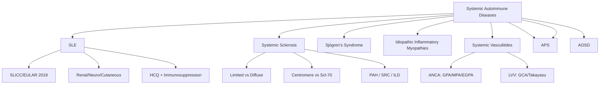

# 3.2 Systemic Autoimmune Diseases


---

## 🎯 Learning Objectives
- [ ] Diagnose **SLE** using SLICC/EULAR 2019 criteria — Clinical, Serological, Renal, Management
- [ ] Classify **Systemic Sclerosis** — Limited vs Diffuse, Autoantibodies, Organ complications, Surveillance
- [ ] Diagnose **Sjögren's Syndrome** — EULAR 2016 criteria, Sicca vs Systemic, Lymphoma risk
- [ ] Classify **Idiopathic Inflammatory Myopathies** — DM/PM/Anti-synthetase/IBM, Cancer screening
- [ ] Classify **Systemic Vasculitides** — CHCC 2012, ANCA-associated (GPA, MPA, EGPA), Large vessel (GCA, Takayasu)
- [ ] Diagnose **MCTD, APS, AOSD** — Criteria, Overlap features, Management
- [ ] Apply **Monitoring & Treatment** — Hydroxychloroquine, Immunosuppressants, Biologics, Glucocorticoids
- [ ] Answer viva: "SLE classification" and "ANCA vasculitis types" and "Scleroderma renal crisis"

---

## 🧠 Core Concept: Systemic Autoimmune Diseases



---

## 1️⃣ Systemic Lupus Erythematosus (SLE)

### Classification Criteria (SLICC 2012 / EULAR 2019)
**≥4 Criteria (Clinical + Immunological), including ≥1 Clinical + ≥1 Immunological**

| Clinical Criteria (7) | Immunological Criteria (6) |
|----------------------|----------------------------|
| 1. Acute/Subacute cutaneous lupus | 1. ANA ≥1:80 |
| 2. Chronic cutaneous lupus (Discoid) | 2. Anti-dsDNA |
| 3. Oral/Nasal ulcers | 3. Anti-Sm |
| 4. Non-scarring alopecia | 4. Anti-Sm/RNP |
| 5. Synovitis (≥2 joints) | 5. Anti-phospholipid antibodies (aCL, β2-GPI, LA) |
| 6. Serositis (Pleuritis/Pericarditis) | 6. Low C3/C4/CH50 |
| 7. Renal (Proteinuria >0.5g/24h or Cellular casts) | 7. Direct Coombs (no haemolysis) |

> **EULAR 2019 Weighted Criteria**: Points-based (≥10 points = SLE); Entry criterion: ANA ≥1:80

### Clinical Manifestations

| System | Manifestations |
|--------|----------------|
| **Mucocutaneous** | Malar rash, Photosensitivity, Discoid lesions, Oral ulcers, Alopecia, Chilblains |
| **Musculoskeletal** | **Arthralgia/Arthritis** (95%, Non-erosive, Symmetrical), Jaccoud's arthropathy |
| **Renal (Lupus Nephritis)** | **Proteinuria**, Haematuria, Cellular casts, Hypertension, CKD — **ISN/RPS Class I-VI** |
| **Neuropsychiatric (NPSLE)** | Seizures, Psychosis, Cognitive dysfunction, Stroke, Headache, Peripheral neuropathy |
| **Haematological** | Anaemia (Chronic disease, AIHA), Leucopenia, **Lymphopenia**, Thrombocytopenia (ITP) |
| **Cardiopulmonary** | Pleuritis, Pericarditis, Libman-Sacks endocarditis, PAH, Shrinking lung |
| **Vascular** | **Antiphospholipid syndrome** (Thrombosis, Pregnancy morbidity), Vasculitis |

### ISN/RPS Lupus Nephritis Classification (2003/2018)
| Class | Pathology | Treatment |
|-------|-----------|-----------|
| **Class I** | Minimal mesangial | Observation |
| **Class II** | Mesangial proliferative | HCQ + ACEi/ARB, steroid if active |
| **Class III** | Focal proliferative (<50% glomeruli) | **MMF + Steroid** or CYC + Steroid |
| **Class IV** | Diffuse proliferative (≥50% glomeruli) — **IV-S (Segmental) / IV-G (Global)** | **MMF 2-3g/d + Steroid** (Preferred) OR **CYC** (Euro-Lupus) |
| **Class V** | Membranous | **MMF + Steroid** ± CNI |
| **Class VI** | Advanced sclerosing (>90% global sclerosis) | Conservative, Dialysis/Transplant |

### Serology & Monitoring
| Test | Significance |
|------|--------------|
| **Anti-dsDNA** | **Specific**, Correlates with renal activity (Titres ↑ = Flare) |
| **Anti-Sm** | **Highly specific** (100% specific, 30% sensitive) |
| **Anti-Ro/SSA, La/SSB** | Neonatal lupus, SCLE, Sjögren's overlap |
| **Anti-RNP** | MCTD (High titre), SLE |
| **Low C3/C4, Low CH50** | Classical pathway consumption → **Active disease** |
| **aPL (aCL, β2-GPI, LA)** | Antiphospholipid syndrome |

### Management

| Manifestation | First-Line | Second-Line / Refractory |
|---------------|------------|--------------------------|
| **Mild (Mucocutaneous, Arthralgia)** | **Hydroxychloroquine (HCQ) 200-400mg/d** (All SLE) + NSAIDs | Topical steroids, Low-dose pred |
| **Moderate (Arthritis, Serositis, Mild renal III/IV)** | **Pred 0.5-1mg/kg** + **MMF 1.5-3g/d** or **AZA 2-2.5mg/kg** | **Belimumab** (Anti-BAFF), **Anifrolumab** (Anti-IFNAR), **Voclosporin** (LN) |
| **Severe (Class III/IV LN, CNS, Vasculitis, TTP)** | **Pulse Methylpred 500-1000mg x3-5d** → **Oral Pred 1mg/kg** + **MMF 2-3g/d** or **CYC** (Euro-Lupus: 500mg x6 q2w) | **Rituximab** (Refractory), **Voclosporin**, **CAR-T** (Experimental) |
| **Antiphospholipid Syndrome** | **Warfarin** (INR 2-3 arterial, 3-4 venous), **HCQ**, **Aspirin** | DOAC? (Not recommended for APS), **Rituximab** |

> **HCQ in ALL SLE** — Reduces flares, Thrombosis, Damage accrual, Improves survival

---

## 2️⃣ Systemic Sclerosis (SSc)

### Classification
| Subtype | Skin Involvement | Key Autoantibodies | Organ Involvement |
|---------|------------------|---------------------|-------------------|
| **Limited (lcSSc)** | Skin ≤ Elbows (Face, Hands, Forearms) | **Anti-Centromere** (ACA) | **PAH**, Calcinosis, CREST syndrome |
| **Diffuse (dcSSc)** | Skin > Elbows (Proximal, Trunk) | **Anti-Scl-70 (Topo I)**, **Anti-RNA Pol III** | **ILD, Scleroderma Renal Crisis, Cardiac, GI** |

### Key Autoantibodies
| Antibody | Specificity | Association |
|----------|-------------|-------------|
| **Anti-Centromere** | CENP-A/B | **Limited SSc (CREST)**, PAH |
| **Anti-Scl-70 (Topo I)** | Topoisomerase I | **Diffuse SSc**, **ILD**, Cardiac |
| **Anti-RNA Pol III** | RNA Pol III subunit | **Diffuse SSc**, **Scleroderma Renal Crisis**, Cancer risk |
| **Anti-U3 RNP (Fibrillarin)** | Nucleolar | **African ancestry**, Cardiac, PAH |
| **Anti-PM-Scl** | PM-Scl complex | Overlap Myositis/SSc |
| **Anti-Th/To** | Th/To | Limited SSc, ILD |

### Clinical Features
| System | Manifestations |
|--------|----------------|
| **Skin** | **Raynaud's** (95%), **Skin thickening** (Sclerodactyly, Sclerodactyly), Digital ulcers, Calcinosis, Telangiectasia |
| **GI** | **Oesophageal dysmotility** (90% — Dysphagia, Reflux), **Gastroparesis**, Intestinal pseudo-obstruction, Constipation |
| **Lung** | **ILD** (NSIP > UIP) — **Anti-Scl-70**, **PAH** — Anti-centromere, **Serositis** |
| **Renal** | **Scleroderma Renal Crisis (SRC)** — **Anti-RNA Pol III**, **Rapid onset HTN, AKI, Microangiopathic HA** |
| **Cardiac** | Myocardial fibrosis, Conduction defects, Pericarditis, **PAH** |
| **Musculoskeletal** | Arthralgia, Flexion contractures, Myopathy, Tendon friction rubs |

### Scleroderma Renal Crisis (SRC)
| Feature | Detail |
|---------|--------|
| **Risk Factors** | **Anti-RNA Pol III**, Diffuse SSc, Recent high-dose steroids |
| **Presentation** | **Accelerated HTN**, AKI (↑ Creatinine), **Microangiopathic HA** (Schistocytes, LDH↑, Haptoglobin↓), Proteinuria |
| **Treatment** | **ACE Inhibitor (Captopril/Enalapril) — FIRST LINE**, Tight BP control, Avoid steroids, Dialysis if needed |
| **Prognosis** | **Dialysis dependence ~20-30%**, Relapse risk if ACEi stopped |

### Monitoring & Surveillance (EULAR)
| Parameter | Frequency |
|-----------|-----------|
| **PFTs (FVC, DLCO)** | 6-12 monthly (ILD monitoring) |
| **Echocardiogram (RVSP, PAH)** | Annually (or 6-monthly if high risk) |
| **Renal Function, BP, Urinalysis** | 3-monthly (First 3y diffuse), 6-monthly (limited) |
| **HRCT Chest** | Baseline, then 12-24m if ILD suspected |
| **Autoantibody Profile** | Baseline |
| **Skin Score (mRSS)** | 6-monthly (dcSSc) |

### Treatment
| Manifestation | Treatment |
|---------------|-----------|
| **Skin (dcSSc)** | **Mycophenolate (MYFORTIC)** — SLS trial; **Cyclophosphamide** (CYC); **Nintedanib** (ILD progression) |
| **ILD** | **Mycophenolate** (SLS II), **Cyclophosphamide** (Scleroderma Lung Study), **Nintedanib** (SENSCIS), **Rituximab** (RECITAL) |
| **PAH** | **PDE5i (Sildenafil/Tadalafil)**, **ERA (Bosentan/Ambrisentan)**, **Prostacyclin (Epoprostenol/Selexipag)** |
| **SRC** | **ACEi (Captopril) — URGENT**, Tight BP control |
| **Digital Ulcers** | **IV Iloprost** (Acute), **Bosentan** (Prevention), **Sildenafil**, **Calcium channel blockers** |

---

## 3️⃣ Sjögren's Syndrome

### EULAR 2016 Classification Criteria (≥4/8)
| Item | Score |
|------|-------|
| **Labial Salivary Gland Biopsy** (Focus score ≥1) | 3 |
| **Anti-Ro/SSA** | 3 |
| **Ocular Staining Score (OSS) ≥5** | 1 |
| **Schirmer's Test ≤5mm/5min** | 1 |
| **Unstimulated Salivary Flow ≤0.1ml/min** | 1 |

> **≥4 points = Primary Sjögren's** (Exclude: HCV, HIV, Sarcoidosis, Amyloidosis, Graft-vs-Host, IgG4-RD)

### Clinical Phenotypes
| Type | Features |
|------|----------|
| **Glandular (Sicca)** | Dry eyes (KCS), Dry mouth (Xerostomia), Parotid enlargement, Dental caries |
| **Systemic (Extraglandular)** | Arthralgia/Arthritis (Non-erosive), **Fatigue**, Raynaud's, **ILD**, **Interstitial Nephritis (RTA Type I)**, **Peripheral Neuropathy**, **Vasculitis**, **Lymphoma** (Risk 5-10x) |
| **Lymphoma Risk** | **MALT lymphoma** (Parotid), **DLBCL** — Risk factors: Persistent parotid enlargement, Splenomegaly, Lymphadenopathy, Cryoglobulinaemia, Low C4, Monoclonal gammopathy |

### Autoantibodies
| Antibody | Frequency | Significance |
|----------|-----------|--------------|
| **Anti-Ro/SSA** | 60-70% | **Neonatal lupus/CHB**, SCLE |
| **Anti-La/SSB** | 30-40% | More specific |
| **RF** | 50-70% | |
| **ANA** | 70-80% | Speckled pattern |
| **Cryoglobulins** | 10-20% | **Type II Cryoglobulinaemia**, Vasculitis |

### Management
| Manifestation | Treatment |
|---------------|-----------|
| **Sicca** | **Artificial tears**, **Pilocarpine/Cevimeline** (Secretagogues), **Hydroxychloroquine** (Fatigue, Arthralgia) |
| **Arthralgia/Arthritis** | **HCQ**, NSAIDs, Low-dose pred |
| **Systemic (Vasculitis, Nephritis, Neuropathy)** | **Glucocorticoids + IS** (MMF, AZA, CYC, Rituximab) |
| **Lymphoma Surveillance** | Annual clinical exam, US neck, LDH, **PET-CT if suspicious** |

---

## 4️⃣ Idiopathic Inflammatory Myopathies (IIM)

### Classification (EULAR/ACR 2017)
| Subtype | Key Features | Autoantibodies | Cancer Risk |
|---------|--------------|----------------|-------------|
| **Dermatomyositis (DM)** | **Heliotrope rash, Gottron's papules**, Proximal weakness, **Malignancy association** | **MDA5** (Amyopathic, Rapid ILD), **TIF1-γ** (Cancer), **NXP2**, **SAE**, **Mi-2** | **High** (TIF1-γ, NXP2) |
| **Polymyositis (PM)** | Proximal weakness, **No rash**, Exclusion of DM/IBM | **ARS** (Anti-synthetase), **PM-Scl**, **Ku** | Low |
| **Anti-Synthetase Syndrome** | **ILD, Arthritis, Raynaud, Mechanic's hands, Fever** | **Jo-1 (75%), PL-7, PL-12, EJ, OJ, KS** | Low |
| **Inclusion Body Myositis (IBM)** | **Age >50, Asymmetric, Distal > Proximal, Finger flexors, Quadriceps**, **Rimmed vacuoles** | **cN-1A** (Autoantibody) | Low |
| **Immune-Mediated Necrotising Myopathy (IMNM)** | Severe proximal weakness, **High CK**, Necrotising biopsy | **Anti-HMGCR** (Statin-associated), **Anti-SRP** | Low |

| Antibody | Clinical Association |
|----------|----------------------|
| **Anti-Jo-1 (HisRS)** | **Anti-synthetase**: ILD, Arthritis, Raynaud, Mechanics hands, Fever |
| **Anti-MDA5** | **Clinically Amyopathic DM**, **Rapidly Progressive ILD**, Skin ulcers |
| **Anti-TIF1-γ** | **Cancer-associated DM** (Ovarian, Breast, Lung, GI) |
| **Anti-NXP2** | Cancer-associated DM, Calcinosis |
| **Anti-Mi-2** | Classic DM, Good prognosis |
| **Anti-SRP** | **IMNM**, Severe, Cardiac involvement |
| **Anti-HMGCR** | **Statin-associated IMNM** |
| **Anti-cN-1A** | **IBM** (Inclusion Body Myositis) |

### Cancer Screening (DM/PM)
| Age | Screening |
|-----|-----------|
| **Age >40** | **CT Chest/Abdomen/Pelvis**, Mammogram (F), Colonoscopy, Pelvic US/CT (F), PSA (M) |
| **Anti-TIF1-γ / NXP2** | **Intensive screening** (PET-CT, Age-appropriate + extended) |
| **Age <40** | **Age-appropriate screening** |

### Treatment
| Subtype | First-Line | Refractory |
|---------|------------|------------|
| **DM/PM** | **Prednisolone 1mg/kg** + **Methotrexate/AZA/MMF** (Steroid-sparing) | **Rituximab**, **IVIG**, **Tacrolimus**, **JAK Inhibitors** (Tofacitinib) |
| **Anti-Synthetase** | **Pred + MMF/AZA** | **Rituximab**, **Tacrolimus**, **JAKi** |
| **MDA5-Rapid ILD** | **High-dose Steroid + Tacrolimus/Cyclosporine + CYC** | **Rituximab**, **JAKi** |
| **IBM** | **Resistant to immunotherapy** | **Exercise**, **Fall prevention**, **Experimental** (Follistatin, ARVC) |
| **IMNM (SRP/HMGCR)** | **Pred + MMF/AZA** | **Rituximab**, **IVIG** |

### Cancer Screening Protocol (DM)
| Timing | Investigations |
|--------|----------------|
| **Baseline** | CT CAP, Mammogram (F), Colonoscopy, Pelvic US (F), PSA (M), CT Neck |
| **Year 1** | Repeat imaging if high risk antibodies (TIF1-γ, NXP2) |
| **Year 2-3** | Age-appropriate screening |

---

## 5️⃣ Systemic Vasculitides (CHCC 2012)

### ANCA-Associated Vasculitis (AAV)
| Subtype | ANCA | Typical Features | Key Organ Involvement |
|---------|------|------------------|----------------------|
| **GPA** (Granulomatosis with Polyangiitis) | **c-ANCA (PR3)** | **Granulomatous** (ENT, Lung), **Renal (Pauci-immune GN)**, **Saddle nose**, **Subglottic stenosis** | Upper/Lower airway, Kidney, Eye |
| **MPA** (Microscopic Polyangiitis) | **p-ANCA (MPO)** | **No granulomas**, **Renal (Pauci-immune GN)**, **Pulmonary haemorrhage**, Neuropathy | Kidney, Lung, Nerve, Skin |
| **EGPA** (Eosinophilic Granulomatosis with Polyangiitis) | **p-ANCA (MPO) ~40%** | **Asthma**, **Eosinophilia >1.5x10⁹/L**, **Eosinophilic granulomas**, **Mononeuritis multiplex**, Cardiac | Lung, Heart, Nerve, Skin |

| Feature | GPA | MPA | EGPA |
|---------|-----|-----|------|
| **ANCA** | c-ANCA (PR3) | p-ANCA (MPO) | p-ANCA (MPO) ~40% |
| **Granulomas** | **Yes** | No | Yes (Eosinophilic) |
| **Asthma** | No | No | **Yes (Precedes by years)** |
| **Eosinophilia** | No | No | **Yes (>1.5x10⁹/L)** |
| **Renal** | Focal GN | **Diffuse GN** | Less common |
| **ENT/Lung** | **Granulomas, Subglottic stenosis** | Pulmonary haemorrhage | Asthma, Nasal polyps |

### Large Vessel Vasculitis (LVV)
| Disease | Age | Key Features | Diagnosis | Treatment |
|---------|-----|--------------|-----------|-----------|
| **GCA** (Giant Cell Arteritis) | **>50y** | **New headache**, Scalp tenderness, **Jaw claudication**, Visual loss (AION), PMR symptoms (50%), **ESR/CRP ↑↑** | **Temporal artery biopsy** (Gold standard), **US (Halo sign)**, PET-CT | **High-dose Pred (40-60mg/d)**, **Tocilizumab** (GiACTA), **Aspirin** |
| **Takayasu Arteritis** | **<40y, Female** | **Pulseless upper limbs**, **Claudication**, Bruits, **Hypertension**, **Aortic regurg**, **ESR/CRP ↑** | **Angiography (CT/MR Angio)**, **US**, **PET-CT** | **Pred + IS** (MTX, AZA, MMF), **Tocilizumab**, Endovascular/surgical |

### Other Vasculitides
| Disease | Key Features |
|---------|--------------|
| **Polyarteritis Nodosa (PAN)** | Medium vessel, **No ANCA**, **HBV-associated**, Mesenteric ischaemia, Renal infarcts, Mononeuritis multiplex |
| **Kawasaki Disease** | **<5y**, Fever ≥5d, Conjunctivitis, Strawberry tongue, Rash, Cervical LN, **Coronary aneurysms** — **IVIG + Aspirin** |
| **IgA Vasculitis (Henoch-Schönlein)** | **<10y**, Palpable purpura (Legs), Abdominal pain, Arthritis, **IgA Nephropathy** — Self-limiting |
| **Cryoglobulinaemic Vasculitis** | **Type II (HCV)**, Purpura, Arthralgia, Nephritis, Neuropathy — **Treat HCV** |
| **Behçet's Disease** | Oral/Genital ulcers, Uveitis, Erythema nodosum, Pathergy test, **HLA-B51** — Colchicine, Apremilast, Anti-TNF |

---

## 6️⃣ Other Systemic Autoimmune Diseases

### Mixed Connective Tissue Disease (MCTD)
| Feature | Detail |
|---------|--------|
| **Criteria** | **High-titre Anti-RNP** + **Raynaud's, Swollen hands, Myositis, Sclerodactyly, Synovitis** (Kasuya/Sharp criteria) |
| **Autoantibody** | **High-titre Anti-RNP (Anti-U1-RNP)** |
| **Features** | Raynaud's (95%), Swollen hands, Myositis, **ILD**, PAH, Sclerodactyly, Synovitis |
| **Treatment** | Based on dominant phenotype (SLE-like, SSc-like, PM-like) — **HCQ, Pred, IS** |

### Antiphospholipid Syndrome (APS)
| Classification | Criteria |
|---------------|----------|
| **Primary** | No associated autoimmune disease |
| **Secondary** | Associated with SLE (30-40%) |

| Clinical Criteria | Laboratory Criteria (Confirmed on 2 occasions ≥12w apart) |
|-------------------|----------------------------------------------------------|
| **Vascular Thrombosis** (Arterial, Venous, Small vessel) | **Lupus Anticoagulant (LA)** — dRVVT, aPTT |
| **Pregnancy Morbidity** (≥3 early miscarriages, ≥1 late loss, Prematurity <34w) | **Anti-Cardiolipin (aCL) IgG/IgM** (>40 GPL/MPL) |
| | **Anti-β2-Glycoprotein I (β2-GPI) IgG/IgM** |

| Thrombosis Type | Treatment |
|-----------------|-----------|
| **Venous** | **Warfarin** (INR 2-3) |
| **Arterial** | **Warfarin (INR 3-4)** or **Warfarin (2-3) + Aspirin** |
| **Catastrophic APS (CAPS)** | **IV Heparin + High-dose Steroid + IVIG + Plasma Exchange** |

> **DOACs NOT recommended** for APS (especially arterial/thrombotic APS)

### Adult-Onset Still's Disease (AOSD)
| Feature | Detail |
|---------|--------|
| **Criteria (Yamaguchi)** | **Major**: Fever ≥39°C (1w), Arthralgia (2w), Salmon rash, Leucocytosis ≥10k; **Minor**: Sore throat, Lymphadenopathy, Hepatomegaly, Abnormal LFT, Negative RF/ANA |
| **Diagnosis** | **≥5 criteria (≥2 Major)**; Exclude infection, malignancy, other rheumatic |
| **Key Feature** | **Ferritin ↑↑** (Hyperferritinaemia), **Glycosylated Ferritin <20%** |
| **Complications** | **Macrophage Activation Syndrome (MAS)** — Ferritin >10,000, Cytopenias, Triglycerides↑, Fibrinogen↓, sCD25↑ |
| **Treatment** | **NSAIDs** → **Steroids** → **Anakinra (IL-1Ra)** / **Canakinumab** (IL-1β) / **Tocilizumab** (IL-6R) → **JAKi** |

---

## ⚡ FCPS/MRCP High-Yield Summary

| Disease | Key Criteria | Key Autoantibody | Key Organ Involvement | Key Treatment |
|---------|--------------|------------------|----------------------|---------------|
| **SLE** | SLICC/EULAR ≥4 (≥1 Clin + 1 Immun) | **Anti-dsDNA, Anti-Sm** | Renal (Class III-V), Neuro, Haematologic | **HCQ (All)**, MMF/CYC (LN), Belimumab/Anifrolumab |
| **SSc (Limited)** | CREST, Anti-centromere | **Anti-centromere** | PAH, Calcinosis, GI | PAH therapy, HCQ |
| **SSc (Diffuse)** | Skin > elbows, Anti-Scl-70/RNA Pol III | **Anti-Scl-70, RNA Pol III** | ILD, SRC, Cardiac | MMF, Nintedanib, ACEi (SRC) |
| **Sjögren's** | EULAR 2016 ≥4/8 | **Anti-Ro/SSA**, Anti-La | Sicca, ILD, Lymphoma | HCQ, Pilocarpine, Rituximab |
| **DM/PM** | EULAR/ACR 2017 | **MDA5, TIF1-γ, Jo-1** | Proximal weakness, ILD, Cancer | Pred + MMF/AZA, Rituximab |
| **GPA** | c-ANCA (PR3) | **c-ANCA (PR3)** | ENT, Lung, Kidney | Rituximab + CYC, Maintenance AZA/MTX |
| **MPA** | p-ANCA (MPO) | **p-ANCA (MPO)** | Renal, Lung | Rituximab + CYC, Maintenance AZA/MTX |
| **EGPA** | Asthma, Eosinophilia, p-ANCA | **p-ANCA (MPO)** | Asthma, Eosinophilia, Cardiac | High-dose Steroid, Mepolizumab (Anti-IL5) |
| **GCA** | Age >50, Headache, Jaw claudication, Visual loss | — | Temporal artery, Aorta | **High-dose Pred + Tocilizumab** |
| **Takayasu** | <40y Female, Pulseless, Bruits, HTN | — | Large vessels (Aorta, Branches) | Pred + MTX/AZA, Tocilizumab |
| **MCTD** | High-titre Anti-RNP + Raynaud's + Swollen hands + Myositis | **Anti-RNP (High titre)** | Overlap: SLE + SSc + PM | HCQ, Pred, IS per phenotype |
| **APS** | Thrombosis + Pregnancy morbidity + aPL (2x ≥12w) | LA, aCL, β2-GPI | Thrombosis, Pregnancy loss | **Warfarin** (INR 2-3 venous, 3-4 arterial) |
| **AOSD** | Yamaguchi ≥5 (≥2 Major) | — | Fever, Rash, Arthritis, Ferritin ↑↑ | NSAIDs → Steroids → **Anakinra/Canakinumab/Tocilizumab** |

---

## 🎤 Viva Questions (Expected Answers)

| # | Question | Expected Answer |
|---|----------|-----------------|
| 1 | SLE classification — SLICC vs EULAR 2019? | **SLICC**: ≥4 criteria (Clinical + Immunological). **EULAR 2019**: Weighted points (≥10), Entry criterion ANA ≥1:80. |
| 2 | Lupus Nephritis Class III vs IV management? | **Class III (Focal)**: MMF preferred. **Class IV (Diffuse)**: MMF 2-3g/d + Steroid (1st line) OR CYC (Euro-Lupus). MMF preferred for fertility. |
| 3 | Scleroderma Renal Crisis — treatment? | **ACE Inhibitor (Captopril) — FIRST LINE**, Tight BP control, Avoid steroids, Dialysis if needed. |
| 4 | Sjögren's — EULAR 2016 criteria? | Focus score ≥1 (3), Anti-Ro/SSA (3), OSS ≥5 (1), Schirmer ≤5mm (1), Unstimulated flow ≤0.1ml/min (1) — **≥4/8 points**. |
| 5 | DM vs PM — key difference? | **DM**: Skin rash (Heliotrope, Gottron's), **Cancer risk**, MDA5/TIF1-γ; **PM**: No rash, Exclusion diagnosis, Lower cancer risk. |
| 6 | Anti-Synthetase Syndrome — key antibody? | **Anti-Jo-1 (75%)** — ILD, Arthritis, Raynaud, Mechanic's hands, Fever. |
| 6 | GPA vs MPA vs EGPA — ANCA pattern? | **GPA: c-ANCA (PR3)**, **MPA: p-ANCA (MPO)**, **EGPA: p-ANCA (MPO) ~40% + Asthma + Eosinophilia** |
| 7 | GCA — diagnostic gold standard? | **Temporal Artery Biopsy**, **US (Halo sign)**; Treat immediately with **High-dose Pred + Tocilizumab**. |
| 8 | APS — DOAC vs Warfarin? | **Warfarin preferred** (DOACs not recommended, especially arterial thrombosis); INR 2-3 venous, 3-4 arterial. |
| 9 | AOSD — key diagnostic clue? | **Ferritin ↑↑ (>10,000), Glycosylated Ferritin <20%**; Yamaguchi criteria ≥5 (≥2 Major). |
| 10 | Scleroderma Renal Crisis — first-line treatment? | **ACE Inhibitor (Captopril/Enalapril)** — Urgent, Tight BP control, Avoid steroids. |

---

## 🧩 Confusions & Mnemonics

| Confusion | Clarification |
|-----------|---------------|
| **"SLE = Only dsDNA positive"** | **NO.** **Anti-Sm = 100% specific**; dsDNA sensitive but not 100% specific; ANA entry criterion. |
| **"All SSc = ILD"** | **NO.** **Limited (CREST) — PAH dominant**; **Diffuse — ILD + SRC risk**. |
| **"Sjögren's = Only dry eyes/mouth"** | **NO.** **Systemic: ILD, Nephritis, Neuropathy, Vasculitis, Lymphoma (5-10x risk)**. |
| **"DM = PM + Rash"** | **NO.** **DM has distinct autoantibodies (MDA5, TIF1-γ), Cancer risk, Skin pathology (Interface dermatitis)**. |
| **"All ANCA vasculitis = Same treatment"** | **Similar induction** (Rituximab+CYC), **but EGPA** = Asthma/Eosinophilia dominant → **Mepolizumab (Anti-IL5)**. |
| **"GCA = Only elderly"** | **YES — >50y**; **Takayasu = <40y**. GCA = **Temporal artery biopsy**; Takayasu = **Angiography (CT/MR Angio)**. |
| **"APS = Warfarin always"** | **NO.** **DOACs contraindicated** in APS (especially arterial/thrombotic). Warfarin only. |
| **"AOSD = Just fever and rash"** | **NO.** **Ferritin ↑↑ (>10,000), Glycosylated Ferritin <20%** = Diagnostic clue; **MAS risk**. |
| **"MCTD = Just overlap"** | **NO.** **High-titre Anti-RNP** = Defining; Can evolve to SLE, SSc, or PM — **PAH major cause of death**. |
| **"EGPA = Just asthma + vasculitis"** | **NO.** **Eosinophilia >1.5x10⁹/L** + **Eosinophilic granulomas** + **Cardiac involvement** = Major mortality. |

> **Mnemonic: SYSTEMIC AUTOIMMUNE DISEASES**  
> **S**LE: **SLICC/EULAR ≥4**, **dsDNA, Sm**, **HCQ ∀**, **MMF/CYC (LN)**  
> **S**cL: **Limited (Centromere) vs Diffuse (Scl-70/RNA Pol III)** — **ILD, SRC (ACEi!), PAH**  
> **S**jögren's: **EULAR 2016 (≥4/8)** — **Ro/SSA, La/SSB**, **Lymphoma risk**  
> **I**DM/PM: **DM (Rash, Cancer, MDA5/TIF1γ), PM (No rash)**, **Anti-synthetase (Jo-1: ILD, Arthritis)**  
> **C**ancer Screening: **DM (TIF1γ, NXP2 → PET-CT), PM (Low risk)**  
> **S**ystemic Vasculitis: **AAV (GPA c-ANCA, MPA p-ANCA, EGPA p-ANCA+Asthma/Eos)**  
> **R**enal in AAV: **Pauci-immune GN** — **Rituximab + CYC** → Maintenance AZA/MTX  
> **G**CA: **>50y, Headache, Jaw claudication, Vision loss** → **Temporal Arth Biopsy + US Halo** → **Pred + Tocilizumab**  
> **T**akayasu: **<40y F, Pulseless, Bruits, HTN** → **Angio (CT/MR), Pred + MTX/Toci**  
> **I**gG4-RD: **IgG4+, Storiform fibrosis, Obliterative phlebitis** — Multi-organ  
> **M**CTD: **High-titre Anti-RNP** — **Overlap (SLE+SSc+PM)**, **PAH risk**  
> **A**PS: **Thrombosis + Pregnancy morbidity + aPL (2x≥12w)** → **Warfarin (No DOAC!)**  
> **A**OSD: **Yamaguchi ≥5**, **Ferritin ↑↑, Glyco-Ferritin <20%** → **Anakinra/Canakinumab/Toci**  
> **R**heumatoid Arthritis: **2010 ACR/EULAR**, **RF/ACPA**, **Treat-to-Target (DMARDs→Bio/JAKi)**  
> **S**pondyloarthritis: **AS (HLA-B27, TNFi/IL-17i)**, **PsA (CASPAR), Reactive, IBD**  
> **S**ystemic Sclerosis: **Limited (Centromere) vs Diffuse (Scl-70, RNA Pol III)** — **SRC = ACEi!**  
> **A**utoantibodies: **dsDNA/Sm (SLE), Centromere (Ltd SSc), Scl-70 (Diff SSc), Ro/La (Sjögren), RNP (MCTD)**  

---

## 🗺️ Mind Map

```mermaid
mindmap
  root((Systemic Autoimmune))
    SLE
      Criteria: SLICC/EULAR 2019
      Renal: ISN/RPS I-VI
      Rx: HCQ ∀, MMF/CYC (LN), Belimumab/Anifrolumab
      APS: Warfarin, No DOAC
    SSc
      Limited: Centromere, PAH, CREST
      Diffuse: Scl-70, RNA Pol III, ILD, SRC
      SRC: ACEi FIRST LINE
    Sjögren's
      EULAR 2016 ≥4/8
      Ro/SSA, La/SSB
      Lymphoma risk 5-10x
    IIM
      DM (MDA5, TIF1γ, Jo-1)
      Anti-synthetase (Jo-1)
      IBM (Anti-cN1A, Refractory)
      Cancer Screening (TIF1γ, NXP2)
    Vasculitis
      AAV: GPA(c-ANCA), MPA(p-ANCA), EGPA(p-ANCA+Asthma/Eos)
      LVV: GCA (>50, Biopsy), Takayasu (<40, Angio)
    Other
      MCTD: Anti-RNP High, PAH risk
      APS: aPL 2x≥12w, Warfarin (No DOAC)
      AOSD: Yamaguchi, Ferritin↑↑, Anakinra/Canakinumab/Toci
    CVD Risk
      SLE/RA/SSc/PSA/PsA: ↑ CVD → Statin, BP, Aspirin
```

---

## 📅 Spaced Repetition Tracker

| Review | Date | Score (0–5) | Notes |
|--------|------|-------------|-------|
| Day 1 | | | |
| Day 3 | | | |
| Day 7 | | | |
| Day 14 | | | |
| Day 30 | | | |
| Day 90 | | | |

---

## 📝 Self-Test Scorecard

| Section | Max | Score | % |
|---------|-----|-------|---|
| SLE (Criteria, LN, Management) | 4 | | |
| SSc (Limited vs Diffuse, SRC) | 3 | | |
| Sjögren's (Criteria, Lymphoma) | 2 | | |
| IIM (DM/PM/Anti-synthetase/IBM) | 3 | | |
| Vasculitis (AAV, LVV) | 4 | | |
| MCTD/APS/AOSD | 2 | | |
| Autoantibodies & Monitoring | 2 | | |
| Treatment Principles | 2 | | |
| **Total** | **20** | | |

---

## 💬 Exam Answer Modes

| Format | Prompt | Key Points |
|--------|--------|------------|
| **Long Essay** | "Describe the classification, clinical features, and management of Systemic Lupus Erythematosus." | SLICC/EULAR criteria, Lupus Nephritis classes, HCQ universal, MMF/CYC for LN, Belimumab/Anifrolumab, APS management |
| **Short Note** | "Scleroderma Renal Crisis — pathophysiology and management." | Anti-RNA Pol III, Endothelial injury, Thrombotic microangiopathy, ACEi first-line, Avoid steroids, Dialysis if needed |
| **Viva** | "Patient with Raynaud's, swollen hands, high-titre Anti-RNP. Diagnosis and complications?" | **MCTD** (High-titre Anti-RNP + Raynaud's + Swollen hands + Myositis/Synovitis). **PAH major cause of death**. Overlap SLE+SSc+PM. |
| **Ward Round** | "Patient with asthma, eosinophilia 3x10⁹/L, mononeuritis multiplex, p-ANCA positive. Diagnosis and treatment?" | **EGPA (Churg-Strauss)**. High-dose Steroid → Mepolizumab (Anti-IL5) for eosinophilic remission; Rituximab/CYC for vasculitic component. |
| **Last-Night** | "SLE: SLICC≥4, dsDNA/Sm, HCQ∀, MMF/CYC LN. SSc: Ltd Centromere PAH, Diff Scl-70/RNA Pol III ILD/SRC (ACEi!). Sjögren: EULAR≥4, Ro/La, Lymphoma. IIM: DM (MDA5/TIF1γ) vs PM, Jo-1 antisyn. AAV: GPA c-ANCA, MPA p-ANCA, EGPA p-ANCA+Asthma. GCA: >50, Biopsy, Toci. Takayasu: <40, Angio. APS: aPL 2x, Warfarin (No DOAC). AOSD: Ferritin↑↑, Anakinra." | Compressed. |

---

## 📌 Summary
- **SLE**: SLICC/EULAR ≥4 criteria; **Lupus Nephritis Class III-V** → MMF/CYC; **HCQ universal**; Belimumab/Anifrolumab refractory; **APS = Warfarin (No DOAC)**
- **SSc**: **Limited (Centromere)** = PAH, CREST; **Diffuse (Scl-70, RNA Pol III)** = ILD, **SRC (ACEi first-line)**; Nintedanib for ILD progression
- **Sjögren's**: EULAR 2016 ≥4/8; **Ro/SSA, La/SSB**; **Lymphoma risk 5-10x**; HCQ, Pilocarpine, Rituximab
- **IIM**: **DM (MDA5, TIF1-γ, Jo-1)** vs **PM**; **Anti-synthetase (Jo-1)** = ILD, Arthritis, Raynaud, Mechanics hands; **IBM** = Refractory, cN-1A; **Cancer screening** (TIF1-γ, NXP2)
- **AAV**: **GPA (c-ANCA/PR3)**, **MPA (p-ANCA/MPO)**, **EGPA** (p-ANCA + Asthma + Eosinophilia >1.5x10⁹/L); **Rituximab + CYC** induction → AZA/MTX maintenance
- **LVV**: **GCA** (>50y, Temporal artery biopsy, **Tocilizumab**); **Takayasu** (<40y, Angiography, **Tocilizumab**)
- **MCTD**: High-titre **Anti-RNP** + Raynaud's + Swollen hands + Myositis/Synovitis; **PAH major mortality**
- **APS**: **aPL 2x ≥12w** (LA, aCL, β2-GPI) + Thrombosis/Pregnancy morbidity → **Warfarin (No DOAC)**
- **AOSD**: **Yamaguchi ≥5 (≥2 Major)**; **Ferritin ↑↑, Glycosylated Ferritin <20%**; **Anakinra/Canakinumab/Tocilizumab**
- **Key Autoantibodies**: dsDNA/Sm (SLE), Centromere (Ltd SSc), Scl-70 (Diff SSc), Ro/La (Sjögren), RNP (MCTD), PR3 (GPA), MPO (MPA/EGPA), Jo-1 (Antisynthetase)

---

## ❓ MCQs (10)

1. **SLE — most specific autoantibody?**  
   A. ANA  B. **Anti-Sm**  C. Anti-Ro  D. Anti-dsDNA  
   *Answer: B. Anti-Sm = 100% specific for SLE (30% sensitive).*

2. **Scleroderma Renal Crisis — first-line treatment?**  
   A. High-dose steroids  B. **ACE Inhibitor (Captopril)**  C. Cyclophosphamide  D. Plasma exchange  
   *Answer: B. ACEi (Captopril) first-line; Steroids can precipitate SRC.*

3. **GPA vs MPA — distinguishing ANCA pattern?**  
   A. GPA = p-ANCA, MPA = c-ANCA  B. **GPA = c-ANCA (PR3), MPA = p-ANCA (MPO)**  C. Both c-ANCA  D. Both p-ANCA  
   *Answer: B. GPA = c-ANCA/PR3; MPA = p-ANCA/MPO.*

4. **EGPA — diagnostic triad?**  
   A. Asthma, Eosinophilia, Vasculitis  B. Asthma, Eosinophilia, p-ANCA  C. **Asthma, Eosinophilia >1.5x10⁹/L, p-ANCA (MPO) ~40%**  D. Asthma, Rash, p-ANCA  
   *Answer: C. Asthma, Eosinophilia >1.5x10⁹/L, p-ANCA (MPO) ~40%.*

5. **GCA — gold standard diagnosis?**  
   A. ESR >50  B. **Temporal artery biopsy**  C. MRI brain  D. PET-CT  
   *Answer: B. Temporal artery biopsy (Gold standard); US Halo sign supportive.*

6. **APS — anticoagulation of choice?**  
   A. DOAC  B. **Warfarin**  C. Aspirin alone  D. LMWH indefinitely  
   *Answer: B. Warfarin (INR 2-3 venous, 3-4 arterial); DOACs contraindicated in APS.*

7. **Anti-synthetase syndrome — most common antibody?**  
   A. Anti-MDA5  B. **Anti-Jo-1 (75%)**  C. Anti-PL-7  D. Anti-PL-12  
   *Answer: B. Jo-1 (Histidyl-tRNA synthetase) = 75% of anti-synthetase syndrome.*

8. **Sjögren's — lymphoma risk?**  
   A. 1%  B. **5-10x increased (MALT lymphoma, DLBCL)**  C. No increased risk  D. Same as SLE  
   *Answer: B. 5-10x increased risk (MALT lymphoma parotid, DLBCL).*

9. **Scleroderma Renal Crisis — first-line treatment?**  
   A. High-dose steroids  B. **ACE Inhibitor (Captopril)**  C. Cyclophosphamide  D. Plasma exchange  
   *Answer: B. ACE Inhibitor (Captopril) FIRST LINE; Steroids can precipitate SRC.*

10. **AOSD — key diagnostic feature?**  
    A. High CRP  B. **Ferritin ↑↑ (>10,000), Glycosylated Ferritin <20%**  C. High ESR  D. Positive RF  
    *Answer: B. Ferritin >10,000 + Glycosylated Ferritin <20% = Highly specific for AOSD.*

---

## 📋 SBAs (10)

1. **45F with malar rash, arthritis, proteinuria 1.2g/d, anti-dsDNA+, low C3/C4. Renal biopsy: Class IV LN. Induction?**  
   A. Pred + AZA  B. **Pred + MMF 2-3g/d**  C. Pred + CYC (Euro-Lupus)  D. Both B and C acceptable  
   *Answer: D. Both MMF 2-3g/d and CYC (Euro-Lupus) are 1st-line for Class IV LN.*

2. **60M with Raynaud's, dyspnoea, skin thickening proximal to elbows. Anti-Scl-70+. HRCT: Basilar fibrosis. Management?**  
   A. Prednisolone alone  B. **MMF 1.5-3g/d**  C. Nintedanib alone  D. CYC  
   *Answer: B. MMF 1.5-3g/d (SLS trial) 1st-line for dcSSc-ILD; Nintedanib add-on.*

3. **30F with dry eyes, dry mouth, parotid enlargement. Anti-Ro/SSA+, focus score 2. EULAR 2016 score?**  
   A. 3  B. 4  C. 5  D. 6  
   *Answer: C. Anti-Ro (3) + Focus score (3) = 6 ≥4 → Meets criteria.*

4. **50M with asthma, eosinophilia 2.5x10⁹/L, mononeuritis multiplex, p-ANCA+. Diagnosis?**  
   A. MPA  B. GPA  C. **EGPA (Churg-Strauss)**  D. Eosinophilic Granulomatosis with Polyangiitis (different)  
   *Answer: C. EGPA = Asthma + Eosinophilia >1.5x10⁹/L + p-ANCA + Vasculitis.*

5. **70F with new headache, jaw claudication, visual loss. ESR 95. Best initial test?**  
   A. MRI Brain  B. **Temporal Artery Biopsy**  C. PET-CT  D. MRI Orbits  
   *Answer: B. Temporal Artery Biopsy = Gold standard for GCA.*

---

## 🔑 Answer Keys
| MCQs | SBAs |
|------|------|
| 1-B, 2-B, 3-B, 4-C, 5-B, 6-B, 7-B, 8-B, 9-B, 10-B | 1-D, 2-B, 3-C, 4-C, 5-B |

---

## 🔗 Cross-Links
- [[3.1 Mechanisms of Autoimmunity]] — Tolerance breakdown, HLA, Molecular mimicry
- [[3.3 Organ-Specific Autoimmune Diseases]] — RA, AS, PsA, Thyroid, T1DM, Coeliac, Liver, MG, MS
- [[3.4 Autoimmune Diagnostics]] — ANA, ENA, ANCA, Complement interpretation
- [[4.1-4.4 Hypersensitivity & Allergy]] — Type II/III/IV hypersensitivity in autoimmune diseases
- [[5.1-5.4 Transplant Immunology]] — Drug-induced autoimmunity (ICI, TNFi)
- [[6.1-6.7 Tumour Immunology & Immunotherapy]] — Checkpoint inhibitor irAEs mimic autoimmune diseases
- [[7.1-7.6 Immune-Based Therapies]] — Biologics used for autoimmune diseases
- [[8.1-8.6 Special Situations Immunology]] — Pregnancy (Autoimmune), Ageing (Inflammageing)
- [[5.5 Genetic Counselling]] — Predictive testing for autoimmune diseases
- [[9. ELSI]] — Genetic discrimination, Predictive testing ethics

---

**Last Updated:** 2026-06-15  
**Next:** Build `3.3 Organ-Specific Autoimmune Diseases.md`
---

> Auto-generated study sections for "Clinical Immunology" — Ch 4: Clinical Immunology.

## Flashcards (30 generated)

- Q: What is the definition of Clinical Immunology?
  A: | Subtype | Skin Involvement | Key Autoantibodies | Organ Involvement |
- Q: What causes Clinical Immunology?
  A: Anti-RNA Pol III, Diffuse SSc, Recent high-dose steroids
- Q: What are the clinical features of Clinical Immunology?
  A: Accelerated HTN, AKI (↑ Creatinine), Microangiopathic HA (Schistocytes, LDH↑, Haptoglobin↓), Proteinuria
- Q: How is Clinical Immunology managed?
  A: ACE Inhibitor (Captopril/Enalapril) — FIRST LINE, Tight BP control, Avoid steroids, Dialysis if needed
- Q: What is the prognosis of Clinical Immunology?
  A: Dialysis dependence ~20-30%, Relapse risk if ACEi stopped
- Q: What is Criteria of Clinical Immunology?
  A: High-titre Anti-RNP + Raynaud's, Swollen hands, Myositis, Sclerodactyly, Synovitis (Kasuya/Sharp criteria)
- Q: What is Autoantibody of Clinical Immunology?
  A: High-titre Anti-RNP (Anti-U1-RNP)
- Q: What are the clinical features of Clinical Immunology?
  A: Raynaud's (95%), Swollen hands, Myositis, ILD, PAH, Sclerodactyly, Synovitis
- Q: How is Clinical Immunology managed?
  A: Based on dominant phenotype (SLE-like, SSc-like, PM-like) — HCQ, Pred, IS
- Q: What is Criteria (Yamaguchi) of Clinical Immunology?
  A: Major: Fever ≥39°C (1w), Arthralgia (2w), Salmon rash, Leucocytosis ≥10k; Minor: Sore throat, Lymphadenopathy, Hepatomegaly, Abnormal LFT, Negative RF/ANA
- Q: What is the investigation of choice for Clinical Immunology?
  A: ≥5 criteria (≥2 Major); Exclude infection, malignancy, other rheumatic
- Q: What are the clinical features of Clinical Immunology?
  A: Ferritin ↑↑ (Hyperferritinaemia), Glycosylated Ferritin <20%
- Q: What are the complications of Clinical Immunology?
  A: Macrophage Activation Syndrome (MAS) — Ferritin >10,000, Cytopenias, Triglycerides↑, Fibrinogen↓, sCD25↑
- Q: How is Clinical Immunology managed?
  A: NSAIDs → Steroids → Anakinra (IL-1Ra) / Canakinumab (IL-1β) / Tocilizumab (IL-6R) → JAKi
- Q: What is Anti-dsDNA of Clinical Immunology?
  A: Specific, Correlates with renal activity (Titres ↑ = Flare)
- Q: What is Anti-Sm of Clinical Immunology?
  A: Highly specific (100% specific, 30% sensitive)
- Q: What is Anti-Ro/SSA, La/SSB of Clinical Immunology?
  A: Neonatal lupus, SCLE, Sjögren's overlap
- Q: What is Anti-RNP of Clinical Immunology?
  A: MCTD (High titre), SLE
- Q: What is Low C3/C4, Low CH50 of Clinical Immunology?
  A: Classical pathway consumption → Active disease
- Q: What causes Clinical Immunology?
  A: Anti-RNA Pol III, Diffuse SSc, Recent high-dose steroids
- Q: What are the clinical features of Clinical Immunology?
  A: Accelerated HTN, AKI (↑ Creatinine), Microangiopathic HA (Schistocytes, LDH↑, Haptoglobin↓), Proteinuria
- Q: How is Clinical Immunology managed?
  A: ACE Inhibitor (Captopril/Enalapril) — FIRST LINE, Tight BP control, Avoid steroids, Dialysis if needed
- Q: What is Criteria of Clinical Immunology?
  A: High-titre Anti-RNP + Raynaud's, Swollen hands, Myositis, Sclerodactyly, Synovitis (Kasuya/Sharp criteria)
- Q: What is Autoantibody of Clinical Immunology?
  A: High-titre Anti-RNP (Anti-U1-RNP)
- Q: What are the clinical features of Clinical Immunology?
  A: Raynaud's (95%), Swollen hands, Myositis, ILD, PAH, Sclerodactyly, Synovitis
- Q: What is Criteria (Yamaguchi) of Clinical Immunology?
  A: Major: Fever ≥39°C (1w), Arthralgia (2w), Salmon rash, Leucocytosis ≥10k; Minor: Sore throat, Lymphadenopathy, Hepatomegaly, Abnormal LFT, Negative RF/ANA
- Q: What is the investigation of choice for Clinical Immunology?
  A: ≥5 criteria (≥2 Major); Exclude infection, malignancy, other rheumatic
- Q: What are the clinical features of Clinical Immunology?
  A: Ferritin ↑↑ (Hyperferritinaemia), Glycosylated Ferritin <20%
- Q: What are the complications of Clinical Immunology?
  A: Macrophage Activation Syndrome (MAS) — Ferritin >10,000, Cytopenias, Triglycerides↑, Fibrinogen↓, sCD25↑
- Q: How is Clinical Immunology managed?
  A: NSAIDs → Steroids → Anakinra (IL-1Ra) / Canakinumab (IL-1β) / Tocilizumab (IL-6R) → JAKi

## MCQs (1 generated)

1. **Which of the following best describes Clinical Immunology?**
   A. **| Subtype | Skin Involvement | Key Autoantibodies | Organ Involvement |**
   B. An unrelated condition not matching the clinical picture of Clinical Immunology
   C. A complication seen late in the disease course of Clinical Immunology
   D. A condition that mimics Clinical Immunology but has a different underlying cause

## SBA Questions (1 generated)

1. A patient with suspected Clinical Immunology presents with: Mucocutaneous — Malar rash, Photosensitivity, Discoid lesions, Oral ulcers, Alopecia, Chilblains; Musculoskeletal — Arthralgia/Arthritis (95%, Non-erosive, Symmetrical), Jaccoud's arthropathy; Renal (Lupus Nephritis) — Proteinuria, Haematuria, Cellular casts, Hypertension, CKD — ISN/RPS Class I-VI. What is the most likely diagnosis?
   A. **Clinical Immunology**
   B. A condition that mimics Clinical Immunology but is not the same entity
   C. A complication of Clinical Immunology rather than the primary diagnosis
   D. An unrelated condition in the same clinical category as Clinical Immunology

