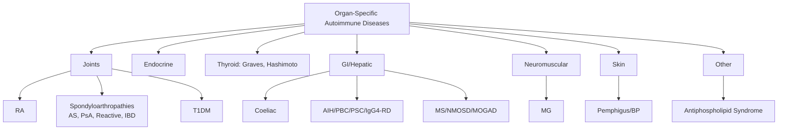
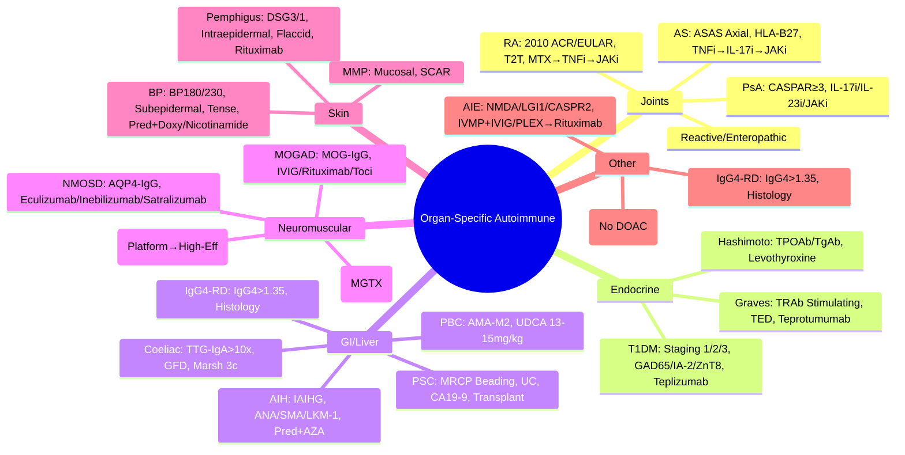

# 3.3 Organ-Specific Autoimmune Diseases

---

## 🎯 Learning Objectives
- [ ] Diagnose **Rheumatoid Arthritis** — 2010 ACR/EULAR Criteria, Treat-to-Target, DMARD Ladder, Biologics/JAKi
- [ ] Diagnose **Spondyloarthropathies** — AS, PsA, Reactive, IBD-associated; ASAS Criteria, TNFi/IL-17i
- [ ] Diagnose **Autoimmune Thyroid Disease** — Graves, Hashimoto, Thyroid Eye Disease, Management
- [ ] Diagnose **Type 1 Diabetes** — Staging, Autoantibodies, Teplizumab Prevention, Management
- [ ] Diagnose **Coeliac Disease** — Serology, Histology, Marsh Classification, GFD, Refractory
- [ ] Diagnose **Autoimmune Liver Disease** — AIH, PBC, PSC, Overlap Syndromes, IgG4-RD
- [ ] Diagnose **Myasthenia Gravis** — AChR/MuSK/LRP4, Thymoma, Crisis, AChE Inhibitors, Thymectomy
- [ ] Diagnose **MS/NMOSD/MOGAD** — McDonald Criteria, AQP4/MOG, DMTs, Relapse Management
- [ ] Diagnose **Autoimmune Bullous** — Pemphigus vs Bullous Pemphigoid, DSG1/3, BP180/230, DIF/IIF
- [ ] Answer viva: "RA Treat-to-Target" and "MS McDonald Criteria" and "MG Crisis"

---

## 🧠 Core Concept: Organ-Specific Autoimmunity

---

## 1️⃣ Rheumatoid Arthritis (RA)

### 2010 ACR/EULAR Classification Criteria (Score ≥6/10)
| Domain | Score |
|--------|-------|
| **Joint Involvement** (1 large = 0, 2-10 large = 1, 1-3 small = 2, 4-10 small = 3, >10 = 5) | 0-5 |
| **Serology** (RF/ACPA: Negative = 0, Low positive = 2, High positive >3x ULN = 3) | 0-3 |
| **Acute Phase Reactants** (CRP/ESR: Normal = 0, Abnormal = 1) | 0-1 |
| **Duration** (<6 weeks = 0, ≥6 weeks = 1) | 0-1 |

> **≥6/10 = Definite RA** — Requires ≥1 swollen joint not explained by other disease

### Clinical Features
| Feature | Detail |
|---------|--------|
| **Joints** | Symmetrical polyarthritis (MCP, PIP, Wrist), Morning stiffness >1h, Synovitis |
| **Extra-articular** | Rheumatoid nodules, Rheumatoid vasculitis, Felty's syndrome, Interstitial lung disease, Pericarditis, Amyloidosis |
| **Systemic** | Fatigue, Low-grade fever, Weight loss, Anaemia of chronic disease |

### Autoantibodies
| Antibody | Sensitivity | Specificity | Clinical Utility |
|----------|-------------|-------------|------------------|
| **RF** (IgM) | 60-80% | 85% | Diagnostic, Prognostic (High titre = Severe) |
| **Anti-CCP** | 60-70% | **>95%** | **Most specific**, Early diagnosis, Prognostic (Erosive disease) |
| **Anti-CarP** | 30-40% | 90% | ACPA-negative RA, Predicts erosions |

### Treat-to-Target (T2T) Strategy (EULAR 2022 Update)
| Step | Therapy | Target |
|------|---------|--------|
| **1. csDMARD Monotherapy** | **MTX** (Anchor drug) 15-25mg/wk + Folic acid | **Remission** (DAS28 <2.6) or **Low Disease Activity** (DAS28 <3.2) at 3-6 months |
| **2. csDMARD Combination** | **MTX + SSZ + HCQ** (Triple) or MTX + SSZ/HCQ | Same target at 3-6 months |
| **3. bDMARD + csDMARD** | **TNFi** (Adalimumab, Etanercept, Infliximab, Certolizumab, Golimumab) + MTX | Target at 6 months |
| | **Non-TNFi** (Rituximab, Abatacept, Tocilizumab, Sarilumab) + MTX | If TNFi failure/contraindicated |
| **4. tsDMARD + csDMARD** | **JAKi** (Tofacitinib, Baricitinib, Upadacitinib, Filgotinib) + MTX | If bDMARD failure/contraindicated |

> **T2T Principle**: Assess disease activity (DAS28, SDAI, CDAI) **every 1-3 months**; Adjust therapy if target not met

### Monitoring on DMARDs/Biologics
| Drug | Monitoring |
|------|------------|
| **MTX** | CBC, LFT, Renal function q8-12w; CXR baseline |
| **Leflunomide** | LFT, BP, Weight q4-8w |
| **Anti-TNF** | TB screen (IGRA/TST) pre-tx; HBV/HIV screen; LFT, CBC q3-6m |
| **Rituximab** | IgG, CD19+ count pre-infusion; Hepatitis B screen |
| **JAKi** | CBC, LFT, Lipids, CK, VZV IgG; TB screen; **CV risk assessment** |

### Comorbidity Management (EULAR)
| Comorbidity | Action |
|-------------|--------|
| **Cardiovascular** | **Statins** (High CVD risk), BP control, Smoking cessation, **Annual CV risk assessment** |
| **Infection** | **Vaccines** (Pneumococcal, Flu, COVID, Shingrix) **before** biologics/JAKi; TB screen |
| **Osteoporosis** | Calcium/Vit D, **Bisphosphonates** if on steroids >3m |
| **Malignancy** | Age-appropriate screening; Caution with JAKi (MACE, Malignancy ORAL Surveillance) |

---

## 2️⃣ Spondyloarthropathies (SpA)

### ASAS Classification Criteria
| Category | Criteria |
|----------|----------|
| **Axial SpA** | **Sacroiliitis on imaging** (X-ray: Modified NY ≥2 bilat / ≥3 unilat) **OR** (MRI: Active sacroiliitis) **PLUS** ≥1 SpA feature |
| **Peripheral SpA** | **Peripheral arthritis/enthesitis/dactylitis** **PLUS** ≥1 SpA feature **OR** **HLA-B27** **PLUS** ≥2 SpA features |

| SpA Features (6) |
|------------------|
| 1. Inflammatory back pain |
| 2. Arthritis |
| 3. Enthesitis (Achilles, Plantar fascia) |
| 4. Dactylitis (Sausage digit) |
| 5. Uveitis (Acute anterior) |
| 6. Good response to NSAIDs |
| 7. Family history (SpA, Psoriasis, IBD, Uveitis) |
| 8. HLA-B27 positive |
| 9. Good response to NSAIDs |

### Subtypes
| Subtype | Key Features | HLA-B27 | Key Treatment |
|---------|--------------|---------|---------------|
| **Ankylosing Spondylitis (AS)** | **Radiographic sacroiliitis** (X-ray Grade ≥2 bilat / ≥3 unilat) | >90% | **TNFi** (1st-line biologic), IL-17i (Secukinumab, Ixekizumab), JAKi |
| **Non-Radiographic Axial SpA (nr-axSpA)** | **MRI sacroiliitis**, No X-ray changes | 70-80% | Same as AS |
| **Psoriatic Arthritis (PsA)** | **CASPAR Criteria** (≥3 pts): Psoriasis (2), Nail dystrophy (1), Dactylitis (1), Negative RF (1), Juxta-articular new bone (1), Negative RF (1) | 50-70% | **TNFi**, **IL-17i** (Secukinumab, Ixekizumab), **IL-23i** (Risankizumab, Guselkumab), JAKi |
| **Reactive Arthritis** | Post-infectious (Chlamydia, Salmonella, Shigella, Yersinia, Campylobacter) | 50-75% | NSAIDs, Antibiotics (Chlamydia), csDMARDs, TNFi if chronic |
| **Enteropathic Arthritis** | IBD-associated (Crohn's, UC) | Variable | Treat IBD + Joints (TNFi, IL-12/23i, JAKi) |

### Enthesitis & Dactylitis
| Feature | Assessment |
|---------|------------|
| **Enthesitis** | **SPARCC Enthesitis Index** (6 sites), **LEI** (Leeds Enthesitis Index), **MASSE** |
| **Dactylitis** | **LDI** (Leeds Dactylitis Index) — Tender + Swollen digit count |

### Treatment (ASAS-EULAR 2022)
| Step | Axial SpA | Peripheral SpA / PsA |
|------|-----------|----------------------|
| **1** | **NSAIDs** (Continuous) | **NSAIDs** + **Local steroid injections** |
| **2** | **TNFi** (Adalimumab, Etanercept, Certolizumab, Golimumab, Infliximab) | **csDMARD** (MTX, SSZ) + **TNFi** |
| **3** | **IL-17i** (Secukinumab, Ixekizumab) | **IL-17i** (Secukinumab, Ixekizumab), **IL-23i** (Guselkumab, Risankizumab — PsA only) |
| **4** | **JAKi** (Tofacitinib, Upadacitinib) | **JAKi** (Tofacitinib, Upadacitinib) |
| **5** | **IL-17i/IL-23i switch** | **IL-23i** (Guselkumab, Risankizumab — PsA only), **Abatacept** (PsA) |

> **IL-23i (Guselkumab, Risankizumab, Mirikizumab) — PsA ONLY; NOT for AS/axSpA** (INEPT trial negative)

---

## 4️⃣ Autoimmune Thyroid Disease

### Graves' Disease (Hyperthyroidism)
| Feature | Detail |
|---------|--------|
| **Autoantibody** | **TSHR Ab (TRAb) — Stimulating** (TSI) — **Pathogenic** |
| **Clinical** | Hyperthyroidism (Weight loss, Tremor, Tachycardia, Heat intolerance), **Goitre**, **Thyroid Eye Disease (TED)**, Pretibial myxoedema, Acropachy |
| **TED** | **Proptosis**, Diplopia, Exposure keratopathy, Optic neuropathy — **CAS/Activity scoring** (EUROGOON) |
| **Diagnosis** | **Low TSH**, **High FT4/FT3**, **TRAb+** (Diagnostic), TSHR Ab |
| **Management** | **Antithyroid drugs** (Carbimazole/Methimazole — 1st line), **Radioiodine (I-131)**, **Thyroidectomy** (Large goitre, TED, Pregnancy) |
| **TED Management** | **Severe/Active**: **IV Methylprednisolone** (Cumulative 4.5-8g) → **Oral Pred**; **Teprotumumab** (IGF-1R Ab, FDA/EMA); **Orbital decompression** (Inactive); Tocilizumab (Emerging) |

### Hashimoto's Thyroiditis (Hypothyroidism)
| Feature | Detail |
|---------|--------|
| **Autoantibodies** | **TPOAb (Anti-TPO)** (90-95%), **TgAb** (70-80%) |
| **Clinical** | Goitre (Firm, Non-tender), Hypothyroidism (Fatigue, Weight gain, Cold intolerance), **Associated**: Coeliac, T1DM, APS, Vitiligo, Pernicious anaemia |
| **Diagnosis** | **High TSH**, **Low FT4**, **TPOAb/TgAb+** |
| **Management** | **Levothyroxine** (1.6 μg/kg/d), Target TSH 0.5-2.5 mU/L; Monitor TSH 6-8w after dose change |

### Thyroid Eye Disease (TED) — Activity/Severity
| Score | Clinical |
|-------|----------|
| **CAS (Clinical Activity Score)** | 0-3 Inactive, 4-7 Active — 7 items (Pain, Redness, Swelling, Proptosis, Motility, Chemosis, Visual acuity) |
| **NO SPECS** | **N**o, **S**oft tissue, **P**roptosis, **E**xtraocular muscle, **C**orneal, **S**ight loss |

---

## 4️⃣ Type 1 Diabetes Mellitus (T1DM)

### Staging (ADA/JDRF)
| Stage | Criteria |
|-------|----------|
| **Stage 1** | **≥2 Autoantibodies**, Normoglycaemia |
| **Stage 2** | **≥2 Autoantibodies**, Dysglycaemia (IFG/IGT) |
| **Stage 3** | **Symptomatic T1DM** (Hyperglycaemia + Symptoms) |

### Autoantibodies (Predictive)
| Antibody | Target | Prevalence at Onset |
|----------|--------|---------------------|
| **GAD65** | Glutamic Acid Decarboxylase 65 | 70-80% |
| **IA-2** | Insulinoma-Associated Antigen-2 | 60-70% |
| **ZnT8** | Zinc Transporter 8 | 60-80% |
| **IAA** | Insulin Autoantibodies | 40-60% (Children) |
| **ICA** | Islet Cell Antibodies | 70-80% (IF) |

### Screening & Prevention
| Population | Screening |
|------------|-----------|
| **General Population** | Not recommended |
| **High Risk** (1st-degree relative) | **Autoantibodies** (GAD65, IA-2, ZnT8, IAA) from age 3-5y, Repeat annually |
| **Teplizumab Prevention** | **Stage 2 T1DM** (≥8y) → **14-day IV Teplizumab** delays Stage 3 onset by ~2y |

### Management
| Component | Details |
|-----------|---------|
| **Insulin** | **Basal-Bolus** (MDI) or **CSII (Pump)**; **HCL (Hybrid Closed Loop)** — 670G, 780G, CamAPS FX |
| **Glucose Targets** | **Time in Range (TIR) 70-180 mg/dL >70%**, **TBR <4%**, **TAR <25%** (CGM metrics) |
| **Education** | **DAFNE** (Type 1), **CARB Counting**, **Sick Day Rules**, **Hypoglycaemia Awareness** |
| **Complications Screening** | **Annual**: Retinal screening, ACR/uACR, eGFR, BP, Lipids, Foot exam, Neuropathy |

---

## 5️⃣ Coeliac Disease

### Diagnosis (ESPGHAN/BSG 2020)
| Step | Test | Threshold |
|------|------|-----------|
| **1. Serology** | **TTG-IgA** (tTG-IgA) + **Total IgA** | **TTG-IgA >10x ULN** + **EMA-IgA+** → **No biopsy needed** (Children) |
| | | **TTG-IgA <10x ULN** → **Biopsy** |
| **2. Histology** | Duodenal biopsies (D2 + Bulb) | **Marsh Classification** (0-IV) |
| **3. HLA Typing** (If serology/biopsy discordant) | **HLA-DQ2/DQ8** | **Negative NPV ~100%** |

### Marsh Classification
| Stage | Histology |
|-------|-----------|
| **0** | Normal |
| **1** | Intraepithelial lymphocytosis (>25/100 enterocytes) |
| **2** | **Crypt hyperplasia** + IEL |
| **3a** | Partial villous atrophy |
| **3b** | Subtotal villous atrophy |
| **3c** | Total villous atrophy |

### Management
| Component | Details |
|-----------|---------|
| **Diet** | **Strict Gluten-Free Diet (GFD) — Lifelong**; Dietitian review; Oats (Pure, Uncontaminated) |
| **Supplements** | Iron, Folic acid, B12, Vitamin D, Calcium (if deficient) |
| **Monitoring** | **6-12m**: TTG-IgA, FBC, Ferritin, B12, Folate, LFT, Bone density (DEXA) |
| **Refractory Coeliac** | **Type I** (Persistent symptoms/villous atrophy despite GFD) → **Budesonide**, **AZA/MMF** |
| | **Type II** (Aberrant T cells, Clonal) → **High lymphoma risk** → **Cladribine**, **Autologous HSCT** |

---

## 4️⃣ Autoimmune Liver Disease

### Autoimmune Hepatitis (AIH)
| Feature | Detail |
|---------|--------|
| **Criteria** | **IAIHG Simplified Score** (≥6 Probable, ≥7 Definite): ANA/SMA ≥1:40, IgG >ULN, Histology, Exclusion viral |
| **Autoantibodies** | **ANA** (Type 1), **SMA** (Type 1), **LKM-1** (Type 2), **SLA/LP** (Specific) |
| **Histology** | Interface hepatitis, Plasma cells, Rosettes, Emperor cells |
| **Treatment** | **Prednisolone** (30-40mg/d) + **Azathioprine** (1.5-2mg/kg) → **Maintenance: Pred 7.5-10mg + AZA** |
| **Relapse** | ↑ ALT/AST, ↑ IgG, Re-biopsy if unclear |
| **Transplant** | Fulminant hepatic failure, Decompensated cirrhosis unresponsive |

### Primary Biliary Cholangitis (PBC)
| Feature | Detail |
|---------|--------|
| **Criteria** | **2/3**: ALP >1.5x ULN, **AMA+ (≥1:40)**, Histology (Florid duct lesion) |
| **Antibody** | **AMA-M2** (>95% sensitivity/specificity) |
| **Staging** | **Ludwig** (1-4) / **Nakanuma** / **Global** (1-4) |
| **Treatment** | **Ursodeoxycholic Acid (UDCA) 13-15mg/kg/d** — **Biochemical response at 12m** (Paris I/II/Toronto criteria) |
| **Second-Line** | **Obeticholic Acid** (OCA) 5-10mg (If UDCA inadequate), **Fibrates** (Bezafibrate) |
| **Complications** | **Portal HTN**, **Osteoporosis**, **Fat-soluble vitamin deficiency**, **HCC** (Cirrhosis) |

### Primary Sclerosing Cholangitis (PSC)
| Feature | Detail |
|---------|--------|
| **Association** | **IBD (UC 70-80%)**, **p-ANCA** (Atypical), **HLA-B8/DR3** |
| **Diagnosis** | **MRCP / ERCP** — **Beading/Strictures** (Multi-focal strictures/dilatations) |
| **Biomarkers** | **ALP >1.5x ULN**, **CA19-9** (Cholangiocarcinoma surveillance) |
| **Treatment** | **UDCA 15-20mg/kg** (Controversial), **Endoscopic dilation/stenting** (Dominant strictures) |
| **Cancer Risk** | **Cholangiocarcinoma** (10-15% lifetime) — **Annual MRI/MRCP + CA19-9** |
| **Transplant** | Only curative option for decompensated cirrhosis |

### IgG4-Related Disease (IgG4-RD)
| Feature | Detail |
|---------|--------|
| **Criteria** | 1) **Clinical/Radiological** (Organ involvement), 2) **Serum IgG4 >1.35g/L**, 3) **Histology** (Dense lymphoplasmacytic infiltrate, **IgG4+ plasma cells >10/HPF**, IgG4/IgG >40%, Storiform fibrosis, Obliterative phlebitis) |
| **Organ Involvement** | Pancreas (Type 1 AIP), Salivary glands (Mikulicz), Bile duct (Sclerosing cholangitis), Retroperitoneum, Kidney (Tubulointerstitial nephritis), Lung, Lacrimal, Thyroid (Riedel's) |
| **Treatment** | **Prednisolone 0.6mg/kg** (4-8w) → Taper; **Rituximab** (Relapse) |

---

## 5️⃣ Myasthenia Gravis (MG)

### Classification
| Type | Antibody | Features |
|------|----------|----------|
| **AChR-Ab** (85%) | AChR binding/blocking/modulating | Generalised (80%), Ocular (15%) |
| **MuSK-Ab** (6-10%) | Muscle-specific kinase | **Bulbar/facial predominant**, **No thymoma**, Poor response to AChE inhibitors |
| **LRP4-Ab** (2-3%) | LDL-receptor related protein 4 | Mild, Ocular |
| **Double Seronegative** | No Ab detected | Clinical diagnosis |

### Clinical Features
| Feature | Detail |
|---------|--------|
| **Fatigable Weakness** | **Proximal > Distal**, **Ocular (Ptosis, Diplopia)**, Bulbar (Dysphagia, Dysarthria) |
| **Diurnal Variation** | Worse evening, Improves with rest |
| **Thymoma** | **10-15%** (Associated with AChR-Ab), **CT Chest** mandatory at diagnosis |
| **Myasthenic Crisis** | **Respiratory failure** (FVC <15-20ml/kg, MIP <30cm H2O), Bulbar weakness → **ICU, IVIG/PLEX, Intubation** |

### Diagnostic Tests
| Test | Sensitivity | Specificity |
|------|-------------|-------------|
| **AChR-Ab** (Binding) | 85% | >95% |
| **MuSK-Ab** | 40% (of AChR-negative) | >95% |
| **LRP4-Ab** | 50% (of Double seronegative) | >95% |
| **Edrophonium (Tensilon) Test** | 90% | 80% (False + in CMS, ALS) |
| **Repetitive Nerve Stimulation (RNS)** | 70-80% | 90% |
| **Single Fibre EMG (SFEMG)** | **95-99%** | 90% |

### Treatment
| Scenario | Treatment |
|----------|-----------|
| **Mild/Ocular** | **Pyridostigmine** 60mg q4-6h (Max 120mg/dose) |
| **Generalised** | **Pyridostigmine** + **Immunosuppression**: **Prednisolone** (0.5-1mg/kg) + **Azathioprine** (2-3mg/kg) / **Mycophenolate** / **Rituximab** (Refractory) |
| **Thymoma** | **Thymectomy** (Transsternal/VATS/Robotic) — **MGTX Trial**: Thymectomy + Pred > Pred alone |
| **Myasthenic Crisis** | **ICU**, **IVIG 2g/kg** (5d) **OR PLEX (5 exchanges)**, **Intubation** if FVC <15ml/kg, **High-dose Steroid** |

### Thymectomy
| Indication | Approach |
|------------|----------|
| **Generalised AChR+ MG** | **Thymectomy** (MGTX Trial: ↓ Pred dose, ↓ AZA, ↑ Remission) |
| **Thymoma** | **Mandatory** (Oncological) |
| **Age** | **18-65y** (Best evidence 18-50y) |
| **Approach** | **VATS/Robotic** (Less morbidity), **Transsternal** (If large/invasive) |

---

## 5️⃣ Multiple Sclerosis (MS) / NMOSD / MOGAD

### MS — McDonald Criteria 2017 (Revision 2021)
| Requirement | DIS (Dissemination in Space) | DIT (Dissemination in Time) |
|-------------|------------------------------|-----------------------------|
| **≥2 Clinical Attacks** | **≥2 Lesions** in ≥2 of 4 areas (Periventricular, Cortical/Juxtacortical, Infratentorial, Spinal Cord) | **Simultaneous Gd+ and Gd- lesions** OR **New T2/Gd+ on follow-up MRI** |
| **1 Attack** | **≥2 Lesions** + **CSF Oligoclonal Bands** | **Simultaneous Gd+ and Gd- lesions** OR **New T2/Gd+ on follow-up MRI** |

### NMOSD (Neuromyelitis Optica Spectrum Disorder) — 2015 Criteria
| Core Criteria | Requirement |
|---------------|-------------|
| **Optic Neuritis** | **+ AQP4-IgG** |
| **Acute Myelitis** | **+ AQP4-IgG** |
| **Area Postrema Syndrome** | **+ AQP4-IgG** |
| **Acute Brainstem Syndrome** | **+ AQP4-IgG** |
| **Symptomatic Narcolepsy** | **+ AQP4-IgG** |
| **Symptomatic Cerebral Syndrome** | **+ AQP4-IgG** |

> **AQP4-IgG+** = **Diagnostic** (High specificity >99%); **MOGAD** = Separate entity (MOG-IgG+)

### Disease-Modifying Therapies (DMTs) — MS
| Category | DMTs | Line | Key Monitoring |
|----------|------|------|----------------|
| **Injectables** | IFN-β, Glatiramer Acetate | 1st | Liver, CBC, Injection site |
| **Oral** | Dimethyl Fumarate, Teriflunomide, Fingolimod, Siponimod, Ozanimod, Ponesimod, Cladribine | 1st/2nd | Lymphocytes, LFT, Eye (Fingolimod), Skin (Cladribine) |
| **High-Efficacy (Infusion)** | **Natalizumab** (Anti-α4-integrin), **Ocrelizumab** (Anti-CD20), **Ofatumumab** (Anti-CD20 SC), **Alemtuzumab** | **High-efficacy / High-risk** | **PML Risk (Natalizumab — JCV Ab+), Infusion reactions, Infections, Malignancy** |
| **B-Cell Depletion** | **Ocrelizumab, Ofatumumab, Rituximab (Off-label)** | High-efficacy | **IgG, CD19+, Vaccines pre-tx** |

### NMOSD & MOGAD Treatment
| Disease | Acute Attack | Maintenance |
|---------|--------------|-------------|
| **NMOSD** (AQP4+) | **IV Methylpred** 1g/d x5d → **PLEX** (5 exchanges) if severe | **Eculizumab** (C5 inhibitor), **Inebilizumab** (Anti-CD19), **Satralizumab** (Anti-IL-6R) |
| **MOGAD** | **IVMP** → **PLEX** if severe | **IVIG** (1g/kg q4-6w), **Rituximab**, **Mycophenolate**, **Tocilizumab** |

---

## 6️⃣ Autoimmune Bullous Diseases

### Pemphigus vs Bullous Pemphigoid
| Feature | **Pemphigus Vulgaris (PV)** | **Bullous Pemphigoid (BP)** |
|---------|----------------------------|----------------------------|
| **Level of Split** | **Intraepidermal** (Suprabasal) | **Subepidermal** |
| **Autoantibody** | **Anti-DSG3 (Mucosal)**, **Anti-DSG1+3 (Mucocutaneous)** | **Anti-BP180 (NC16A)**, **Anti-BP230** |
| **Blisters** | **Fragile, Flaccid**, Rupture easily | **Tense, Intact** |
| **Mucosal Involvement** | **Common (Oral 90%)** | **Rare (<20%)** |
| **Nikolsky Sign** | **Positive** | Negative |
| **DIF (Direct IF)** | **IgG + C3 — Intercellular (Net-like)** | **IgG + C3 — Linear Basement Membrane** |
| **IIF (Indirect IF)** | Anti-DSG3/1 (Monkey oesophagus) | Anti-BP180/230 (Salt-split skin) |
| **Treatment** | **Pred + Azathioprine/MMF/Rituximab** | **Pred + Doxycycline/Nicotinamide / Dapsone / MMF / Rituximab** |

### Pemphigus Subtypes
| Type | Antibody | Clinical |
|-------|----------|---------|
| **PV** | Anti-DSG3 (± DSG1) | Mucosal ± Cutaneous, Severe |
| **Pemphigus Foliaceus** | Anti-DSG1 | **Superficial cutaneous**, No mucosal |
| **Paraneoplastic Pemphigus** | Anti-DSG3 + Plakins | **Malignancy-associated**, Severe mucosal + Cutaneous |

### Bullous Pemphigoid Variants
| Variant | Features |
|---------|----------|
| **Classical BP** | Tense bullae, Pruritus, Elderly |
| **Mucous Membrane Pemphigoid (MMP)** | **Ocular, Oral, Genital** mucosal predominant, Scarring |
| **Linear IgA Disease** | **Linear IgA** at BMZ, Children (Chronic bullous disease of childhood) |
| **Epidermolysis Bullosa Acquisita** | **Anti-Type VII Collagen**, Trauma-induced blisters, Scarring |

### Treatment
| Disease | First-Line | Refractory |
|---------|------------|------------|
| **Pemphigus** | **Prednisolone 1mg/kg** + **Azathioprine 2-3mg/kg** / **MMF** | **Rituximab** (1st-line for moderate-severe), **IVIG**, **Immunoadsorption** |
| **BP** | **Prednisolone 0.5-1mg/kg** + **Doxycycline 100mg BD + Nicotinamide 500mg TDS** | **Rituximab**, **IVIG**, **Immunoadsorption**, **Dapsone** |

---

## 7️⃣ Other Organ-Specific Autoimmune Diseases

### Antiphospholipid Syndrome (APS) — See [[3.2 Systemic Autoimmune Diseases]]
- **Criteria**: Vascular thrombosis + Pregnancy morbidity + aPL (LA, aCL, β2-GPI) on 2 occasions ≥12w apart
- **Treatment**: **Warfarin** (INR 2-3 venous, 3-4 arterial); **DOACs contraindicated**

### IgG4-Related Disease (IgG4-RD)
- **Criteria**: 1) Organ involvement, 2) Serum IgG4 >1.35g/L, 3) Histology (IgG4+ >10/HPF, IgG4/IgG >40%, Storiform fibrosis, Obliterative phlebitis)
- **Treatment**: Pred 0.6mg/kg → Rituximab (Relapse)

### Autoimmune Encephalitis
| Antibody | Syndrome | Treatment |
|----------|----------|---------|
| **Anti-NMDA** | Psychiatric, Seizures, Autonomic instability, Movement disorder | **IVMP + IVIG/PLEX** → Rituximab/Cyclophosphamide |
| **Anti-LGI1** | FBDS (Faciobrachial dystonic seizures), Limbic encephalitis | IVMP + IVIG/PLEX → Rituximab |
| **Anti-CASPR2** | Morvan's syndrome, Limbic encephalitis | IVMP + IVIG/PLEX → Rituximab |
| **Anti-AMPAR/GABA-B/GABA-A** | Limbic encephalitis | IVMP + IVIG/PLEX → Rituximab |

---

## ⚡ FCPS/MRCP High-Yield Summary

| Disease | Key Criteria | Key Antibody | Key Treatment |
|---------|--------------|--------------|---------------|
| **RA** | 2010 ACR/EULAR ≥6 | **RF, Anti-CCP** | **T2T: MTX → TNFi → Non-TNFb → JAKi** |
| **AS** | ASAS Axial (Imaging + SpA features) | **HLA-B27** | **NSAIDs → TNFi → IL-17i → JAKi** |
| **PsA** | CASPAR ≥3 | RF-negative | **TNFi → IL-17i/IL-23i → JAKi** |
| **Graves** | Low TSH, High FT4, **TRAb+** | **TSHR Ab (Stimulating)** | Carbimazole → Radioiodine/Thyroidectomy |
| **Hashimoto** | High TSH, Low FT4 | **TPOAb, TgAb** | Levothyroxine |
| **T1DM** | ≥2 Autoantibodies (GAD65, IA-2, ZnT8, IAA) | **GAD65, IA-2, ZnT8, IAA** | Insulin (MDI/CSII/HCL), Teplizumab prevention |
| **Coeliac** | TTG-IgA >10x ULN + EMA | **TTG-IgA, EMA** | **Strict GFD** |
| **AIH** | IAIHG ≥6/7 | **ANA/SMA (Type 1), LKM-1 (Type 2)** | Pred + AZA |
| **PBC** | ALP↑, AMA-M2+, Histology | **AMA-M2** | UDCA 13-15mg/kg |
| **PSC** | MRCP Beading, IBD, p-ANCA | **No specific Ab** | UDCA (Controversial), Transplant |
| **MG** | Fatigable weakness, **AChR/MuSK/LRP4** | **AChR, MuSK, LRP4** | Pyridostigmine + Pred + AZA/MMF + Thymectomy |
| **MS** | McDonald 2017 (DIS + DIT) | **OCBs, AQP4 (NMOSD), MOG** | DMTs (Platform → High-efficacy) |
| **NMOSD** | Optic Neuritis/Myelitis + **AQP4-IgG** | **AQP4-IgG** | Eculizumab/Inebilizumab/Satralizumab |
| **MG** | Fatigable weakness, AChR/MuSK/LRP4 | **AChR, MuSK, LRP4** | Pyridostigmine + Pred + AZA/MMF + Thymectomy |
| **Pemphigus** | **Anti-DSG3/1**, Intraepidermal, Flaccid | **Anti-DSG3/1** | Pred + AZA/MMF → Rituximab |
| **Bullous Pemphigoid** | **Anti-BP180/230**, Subepidermal, Tense | **Anti-BP180/230** | Pred + Doxy/Nicotinamide → Rituximab |
| **AIH** | IAIHG ≥6/7 | **ANA/SMA/LKM-1/SLA** | Pred + AZA |
| **PBC** | ALP↑, AMA-M2+ | **AMA-M2** | UDCA 13-15mg/kg |
| **PSC** | MRCP Beading, IBD, p-ANCA | None specific | UDCA (Controversial), Transplant |
| **IgG4-RD** | IgG4 >1.35g/L, Histology (IgG4+ >10/HPF, Storiform) | **IgG4** | Pred → Rituximab |

---

## 🎤 Viva Questions (Expected Answers)

| # | Question | Expected Answer |
|---|----------|-----------------|
| 1 | RA — 2010 ACR/EULAR criteria? | Score ≥6/10: Joint involvement (0-5), Serology RF/ACPA (0-3), CRP/ESR (0-1), Duration ≥6w (1) |
| 2 | RA Treat-to-Target — target? | **Remission (DAS28 <2.6) or LDA (DAS28 <3.2)** at 3-6 months; Assess q1-3m |
| 3 | AS vs nr-axSpA — difference? | **AS = Radiographic sacroiliitis (X-ray Grade ≥2 bilat/≥3 unilat)**; nr-axSpA = MRI sacroiliitis only |
| 3 | PsA — CASPAR criteria? | ≥3 points: Psoriasis (2), Nail dystrophy (1), Dactylitis (1), Negative RF (1), Juxta-articular bone (1), Negative RF (1) |
| 4 | Graves vs Hashimoto — key antibody? | **Graves: TRAb (Stimulating)**; **Hashimoto: TPOAb, TgAb** |
| 4 | T1DM staging? | Stage 1: ≥2 AutoAb, Normoglycaemia; Stage 2: ≥2 AutoAb + Dysglycaemia; Stage 3: Symptomatic |
| 5 | Coeliac diagnosis — TTG-IgA >10x ULN + EMA+ → No biopsy needed (Children) |
| 6 | AIH vs PBC vs PSC — key antibodies? | **AIH: ANA/SMA/LKM-1**; **PBC: AMA-M2**; **PSC: p-ANCA, MRCP beading** |
| 7. | MG — AChR vs MuSK vs LRP4? | AChR 85% (Generalised), MuSK 6-10% (Bulbar), LRP4 2-3% (Mild) |
| 7. | MS McDonald 2017 — DIS + DIT? | DIS: ≥2 lesions in 2/4 areas; DIT: Simultaneous Gd+/Gd- or new lesion on follow-up |
| 8. | AQP4 vs MOG — NMOSD vs MOGAD? | AQP4 = NMOSD; MOG = MOGAD; AQP4 highly specific (>99%) |
| 9. | Pemphigus vs BP — level of split? | **Pemphigus = Intraepidermal (Suprabasal)**; **BP = Subepidermal** |
| 9. | Pemphigus vs BP — autoantibodies? | Pemphigus: **Anti-DSG3/1**; BP: **Anti-BP180/230** |
| 10. | MG crisis — management? | **ICU, IVIG 2g/kg x5d OR PLEX x5, Intubation if FVC<15ml/kg, High-dose steroid** |
| 10. | MG — Thymectomy indication? | Generalised AChR+ MG (MGTX Trial: ↓ Pred, ↓ AZA, ↑ Remission); Thymoma = Mandatory |

---

## 🧩 Confusions & Mnemonics

| Confusion | Clarification |
|-----------|---------------|
| **"RA = Only joint disease"** | **NO.** Systemic: Nodules, Vasculitis, ILD, Pericarditis, Felty's, Amyloidosis, CVD risk |
| **"AS = nr-axSpA + Time"** | **NO.** Distinct entities; nr-axSpA may never progress to AS; Different treatment pathways |
| **"PsA = RA + Psoriasis"** | **NO.** Different: CASPAR criteria, Dactylitis/Enthesitis, Nail changes, RF-negative, IL-17i/IL-23i |
| **"Graves = Hashimoto in reverse"** | **NO.** **Graves = TRAb (Stimulating) → Hyperthyroidism**; **Hashimoto = TPOAb/TgAb → Destruction → Hypothyroidism** |
| **"T1DM = Only insulin"** | **NO.** **Staging (1/2/3), Autoantibodies (GAD65/IA-2/ZnT8), Teplizumab Prevention, HCL/CGM** |
| **"Coeliac = Biopsy always"** | **NO.** **Children: TTG-IgA >10x ULN + EMA+ = No biopsy** (ESPGHAN 2020) |
| **"AIH = Just high IgG"** | **NO.** Need **IAIHG Score**: AutoAb (ANA/SMA/LKM-1), IgG, Histology, Exclusion viral |
| **"PBC vs PSC"** | **PBC: AMA-M2+, ALP↑, Female, UDCA**; **PSC: MRCP Beading, IBD (UC), p-ANCA, Male, Transplant** |
| **"MG = Just weakness"** | **NO.** **Fatigable weakness, Diurnal variation, Ocular/Bulbar, Thymoma 15%, Crisis = Respiratory failure** |
| **"MS = Only white matter lesions"** | **NO.** **McDonald 2017**: DIS + DIT; **NMOSD = AQP4-IgG**, MOGAD = MOG-IgG; **OGLE** = Optic neuritis + Myelitis |
| **"Pemphigus = BP"** | **NO.** **Pemphigus = Intraepidermal (DSG3/1), Flaccid, Nikolsky+**; BP = Subepidermal, Tense, BP180/230 |
| **"MG = Only AChR"** | **NO.** **MuSK (6-10%, Bulbar), LRP4 (2-3%), Double Seronegative** |
| **"AIH = Just high IgG"** | **NO.** **IAIHG Score ≥6/7**: AutoAb (ANA/SMA/LKM-1/SLA), IgG, Histology, Exclusion viral |
| **"PSC = Just IBD complication"** | **NO.** **Primary Sclerosing Cholangitis**: MRCP Beading, CA19-9, HCC Risk, Transplant |
| **"IgG4-RD = Just high IgG4"** | **NO.** **Triad: Organ involvement + Serum IgG4 >1.35g/L + Histology (IgG4+ >10/HPF, Storiform, Obliterative phlebitis)** |

> **Mnemonic: ORGAN-SPECIFIC AUTOIMMUNITY**  
> **R**A: **2010 ACR/EULAR ≥6**, **T2T (DAS28<2.6)**, **MTX→TNFi→JAKi**  
> **A**S/SpA: **ASAS Axial (Imaging+SpA features)**, **HLA-B27**, **TNFi→IL-17i→JAKi**  
> **P**sA: **CASPAR ≥3**, **IL-17i/IL-23i/JAKi** (No IL-23i in AS!)  
> **G**raves: **TRAb Stimulating**, **Thyroid Eye Disease (TED: EUROGOON, Teprotumumab)**  
> **H**ashimoto: **TPOAb/TgAb**, **Levothyroxine**, **Associated: Coeliac/T1DM/APS**  
> **T**1DM: **Staging 1/2/3**, **GAD65/IA-2/ZnT8/IAA**, **Teplizumab Prevention**  
> **C**oeliac: **TTG-IgA >10x ULN + EMA = No Biopsy (Kids)**, **Marsh 3c = Total Villous Atrophy**  
> **A**IH: **IAIHG Score**, **ANA/SMA/LKM-1**, **Pred+AZA**  
> **P**BC: **AMA-M2**, **UDCA 13-15mg/kg**, **Paris Criteria Response**  
> **P**SC: **MRCP Beading**, **UC 70-80%**, **CA19-9 Surveillance**, **Transplant Only Cure**  
> **M**G: **AChR (85%), MuSK, LRP4**, **Pyridostigmine + Pred + AZA/MMF + Thymectomy (MGTX)**  
> **M**S: **McDonald 2017 (DIS+DIT)**, **OCBs**, **DMTs: Platform→High-Efficacy**  
> **N**MOSD: **AQP4-IgG**, **MOGAD: MOG-IgG**, **AQP4 Spec >99%**  
> **M**yasthenia: **AChR/MuSK/LRP4**, **Crisis: IVIG/PLEX**, **Thymectomy (MGTX)**  
> **P**emphigus: **Intraepidermal (DSG3/1)**, **Flaccid, Nikolsky+**, **DIF: Intercellular**  
> **B**ullous Pemphigoid: **Subepidermal**, **Tense**, **BP180/230**, **DIF: Linear BM**  
> **A**IH: **IAIHG Score ≥6**, **ANA/SMA/LKM-1**, **Pred+AZA**  
> **P**BC: **AMA-M2**, **UDCA 13-15mg/kg**, **Paris Criteria**  
> **P**SC: **MRCP Beading**, **UC 70-80%**, **HCC Surveillance**, **Transplant**  
> **I**gG4-RD: **IgG4>1.35 + Histology (IgG4+>10/HPF, Storiform, Obliterative Phlebitis)**  
> **A**utoimmune Encephalitis: **NMDA/LGI1/CASPR2**, **IVMP+IVIG/PLEX → Rituximab**  

---

## 🗺️ Mind Map

---

## 📅 Spaced Repetition Tracker

| Review | Date | Score (0–5) | Notes |
|--------|------|-------------|-------|
| Day 1 | | | |
| Day 3 | | | |
| Day 7 | | | |
| Day 14 | | | |
| Day 30 | | | |
| Day 90 | | | |

---

## 📝 Self-Test Scorecard

| Section | Max | Score | % |
|---------|-----|-------|---|
| RA (Criteria, T2T, Drugs) | 3 | | |
| SpA (AS/PsA/Reactive) | 3 | | |
| Thyroid (Graves/Hashimoto/TED) | 3 | | |
| T1DM (Staging, AutoAb, Teplizumab) | 2 | | |
| Coeliac (Diagnosis, GFD, Refractory) | 2 | | |
| Liver (AIH/PBC/PSC/IgG4-RD) | 3 | | |
| Neuromuscular (MG/MS/NMOSD/MOGAD) | 4 | | |
| Skin (Pemphigus/BP) | 2 | | |
| Other (APS/IgG4-RD/Encephalitis) | 2 | | |
| **Total** | **20** | | |

---

## 💬 Exam Answer Modes

| Format | Prompt | Key Points |
|--------|--------|------------|
| **Long Essay** | "Describe the diagnosis and management of Rheumatoid Arthritis." | 2010 Criteria, T2T (DAS28<2.6), MTX anchor, csDMARD combo, bDMARD (TNFi→Non-TNF→JAKi), Monitoring, Comorbidities |
| **Short Note** | "Diagnosis and management of Myasthenia Gravis." | AChR/MuSK/LRP4, Fatigable weakness, Pyridostigmine, Pred+AZA/MMF, Thymectomy (MGTX), Crisis (IVIG/PLEX) |
| **Viva** | "Patient with dry eyes, dry mouth, parotid swelling. Anti-Ro+. Diagnosis?" | **Sjögren's Syndrome** — EULAR 2016 criteria (≥4/8), Anti-Ro/SSA, Focus score, Schirmer's, Management (HCQ, Secretagogues, Lymphoma surveillance) |
| **Ward Round** | "Patient with progressive proximal weakness, heliotrope rash, Gottron's papules. Anti-TIF1-γ+. Management?" | **Dermatomyositis (Cancer-associated)** — Pred + MMF, **Cancer screening (CT CAP, Mammogram, Pelvic US, PET-CT)**, Rituximab if refractory |
| **Last-Night** | "RA: 2010≥6, T2T DAS28<2.6, MTX→TNFi→Non-TNF→JAKi. AS: ASAS, HLA-B27, TNFi→IL-17i→JAKi. PsA: CASPAR≥3, IL-17i/IL-23i. Graves: TRAb, TED Teprotumumab. Hashimoto: TPOAb, Levothyroxine. T1DM: Staging 1/2/3, GAD65/IA-2/ZnT8, Teplizumab. Coeliac: TTG>10x+EMA=NoBiopsy. AIH: IAIHG, Pred+AZA. PBC: AMA-M2, UDCA. PSC: MRCP, UC, Transplant. MG: AChR/MuSK/LRP4, Pyridostigmine+Pred+AZA, Thymectomy MGTX. MS: McDonald DIS+DIT, DMTs. NMOSD: AQP4, Eculizumab. Pemphigus: DSG3/1, Intraepidermal, Rituximab. BP: BP180/230, Subepidermal, Doxy+Nico. AIH: IAIHG, Pred+AZA. PBC: AMA-M2, UDCA. PSC: MRCP, Transplant." | Compressed. |

---

## 📌 Summary
- **RA**: 2010 ACR/EULAR ≥6, **T2T** (DAS28<2.6), **MTX anchor** → csDMARD combo → **bDMARD (TNFi→Non-TNF→JAKi)**; CVD risk management
- **SpA**: **AS** (ASAS Axial, HLA-B27, TNFi→IL-17i→JAKi); **PsA** (CASPAR≥3, **IL-17i/IL-23i/JAKi**); Reactive/Enteropathic
- **Thyroid**: **Graves** (TRAb Stimulating, TED, Teprotumumab); **Hashimoto** (TPOAb/TgAb, Levothyroxine); **TED** → Teprotumumab
- **T1DM**: **Staging** (1=AutoAb+, 2=Dysglycaemia, 3=Symptomatic); **GAD65/IA-2/ZnT8**; **Teplizumab prevention**
- **Coeliac**: **TTG-IgA >10x ULN + EMA+ = No biopsy (Kids)**; **Marsh 3c = Total villous atrophy**; **Strict GFD**
- **Liver**: **AIH** (IAIHG, ANA/SMA/LKM-1, Pred+AZA); **PBC** (AMA-M2, UDCA); **PSC** (MRCP Beading, UC, Transplant); **IgG4-RD** (IgG4>1.35, Histology)
- **MG**: **AChR/MuSK/LRP4**, Fatigable weakness, **Pyridostigmine + Pred + AZA/MMF**, **Thymectomy (MGTX Trial)**, Crisis = IVIG/PLEX
- **MS**: **McDonald 2017 (DIS+DIT)**, OCBs, DMTs (Platform → High-efficacy); **NMOSD** (AQP4-IgG, Eculizumab); **MOGAD** (MOG-IgG, IVIG/Rituximab)
- **Skin**: **Pemphigus** (DSG3/1, Intraepidermal, Flaccid, Nikolsky+, **Rituximab**); **BP** (BP180/230, Subepidermal, Tense, **Pred+Doxy/Nicotinamide**)
- **Liver**: **AIH** (IAIHG, Pred+AZA); **PBC** (AMA-M2, UDCA 13-15mg/kg); **PSC** (MRCP, UC, Transplant)
- **Other**: **APS** (aPL 2x≥12w, **Warfarin**, No DOAC); **IgG4-RD** (IgG4>1.35, Histology); **Autoimmune Encephalitis** (NMDA/LGI1/CASPR2, IVMP+IVIG/PLEX→Rituximab)

---

## ❓ MCQs (10)

1. **RA Treat-to-Target target?**  
   A. DAS28 <3.2  B. **DAS28 <2.6 (Remission) or <3.2 (LDA)**  C. SDAI ≤3.3  D. CDAI ≤2.8  
   *Answer: B. Remission (DAS28<2.6) or LDA (DAS28<3.2) at 3-6 months.*

2. **AS vs nr-axSpA — key difference?**  
   A. HLA-B27 status  B. **Radiographic sacroiliitis (X-ray)**  C. Age of onset  D. Treatment  
   *Answer: B. AS = Radiographic sacroiliitis (X-ray Grade ≥2 bilat/≥3 unilat); nr-axSpA = MRI only.*

3. **Graves disease — pathogenic antibody?**  
   A. TPOAb  B. **TRAb (Stimulating)**  C. TgAb  D. TSHR Ab (Blocking)  
   *Answer: B. TSHR Ab (Stimulating) = TRAb.*

4. **Coeliac disease — biopsy not needed if:**  
   A. TTG-IgA >5x ULN  B. **TTG-IgA >10x ULN + EMA+**  C. Positive HLA-DQ2  C. Symptoms resolve on GFD  
   *Answer: B. ESPGHAN 2020: Children with TTG-IgA >10x ULN + EMA+ → No biopsy needed.*

5. **Myasthenia Gravis — crisis management?**  
   A. Oral prednisolone  B. **ICU, IVIG 2g/kg x5d OR PLEX x5, Intubation if FVC<15ml/kg**  C. Increase pyridostigmine  D. Rituximab  
   *Answer: B. ICU, IVIG 2g/kg x5d OR PLEX x5, Intubation if FVC<15ml/kg, High-dose steroid.*

6. **MS — McDonald 2017 dissemination in space requires:**  
   A. 1 lesion  B. **≥2 lesions in ≥2 of 4 areas (Periventricular, Cortical, Infratentorial, Spinal)**  C. 3 lesions  D. Only spinal cord lesions  
   *Answer: B. ≥2 lesions in ≥2 of 4 typical areas (Periventricular, Cortical/Juxtacortical, Infratentorial, Spinal Cord).*

7. **NMOSD vs MOGAD — key antibody?**  
   A. AQP4-IgG = MOGAD  B. **AQP4-IgG = NMOSD, MOG-IgG = MOGAD**  C. Both AQP4  D. Both MOG  
   *Answer: B. AQP4-IgG = NMOSD (Specificity >99%); MOG-IgG = MOGAD.*

8. **Pemphigus Vulgaris vs Bullous Pemphigoid — split level?**  
   A. Both subepidermal  B. **PV = Intraepidermal (Suprabasal), BP = Subepidermal**  C. Both intraepidermal  D. PV subepidermal, BP intraepidermal  
   *Answer: B. PV = Intraepidermal (Suprabasal, DSG3/1); BP = Subepidermal (BP180/230).*

9. **PBC — first-line treatment & monitoring?**  
   A. Prednisolone  B. **UDCA 13-15mg/kg/d**  C. Azathioprine  D. Liver transplant  
   *Answer: B. UDCA 13-15mg/kg/day; Monitor ALP, Bilirubin, Albumin, Platelets (Paris criteria at 12m).*

10. **PSC — definitive treatment?**  
    A. UDCA  B. **Liver Transplant**  C. Endoscopic dilation only  C. Antibiotics  
    *Answer: B. Liver Transplant = Only curative option for decompensated cirrhosis.*

---

## 📋 SBAs (10)

1. **30F with symmetric polyarthritis MCP/PIP, morning stiffness 2h, RF+, Anti-CCP+, DAS28 5.2. First-line DMARD?**  
   A. Hydroxychloroquine  B. **Methotrexate**  C. Leflunomide  D. Sulfasalazine  
   *Answer: B. MTX is anchor drug for RA.*

2. **25M with inflammatory back pain 6 months, HLA-B27+, sacroiliitis on MRI. Diagnosis?**  
   A. AS  B. **nr-axSpA**  C. PsA  D. Reactive Arthritis  
   *Answer: B. Non-radiographic axial SpA (MRI+ but no X-ray changes).*

3. **40F with weight loss, tremor, tachycardia, exophthalmos. TSH <0.01, FT4 45. Antibody?**  
   A. TPOAb  B. **TRAb (TSHR Ab Stimulating)**  C. TgAb  D. Anti-IFNα  
   *Answer: B. TRAb (TSHR Ab Stimulating) = Pathognomonic for Graves.*

4. **Child with recurrent abdominal pain, diarrhoea, TTG-IgA 15x ULN, EMA+. Biopsy needed?**  
   A. Yes  B. **No (TTG-IgA >10x ULN + EMA+ = No biopsy per ESPGHAN 2020)**  C. Only if symptomatic  D. Only if HLA-DQ2+  
   *Answer: B. ESPGHAN 2020: TTG-IgA >10x ULN + EMA+ = Diagnostic without biopsy.*

5. **60M with progressive dysphagia, weight loss, ALP 3x ULN, AMA-M2+. Diagnosis?**  
   A. AIH  B. **PBC**  C. PSC  D. IgG4-RD  
   *Answer: B. PBC = AMA-M2+ + ALP↑ + Female predominance.*

---

## 🔑 Answer Keys
| MCQs | SBAs |
|------|------|
| 1-B, 2-B, 3-B, 4-B, 5-B, 6-B, 7-B, 8-B, 9-B, 10-B | 1-B, 2-B, 3-B, 4-B, 5-B |

---

## 🔗 Cross-Links
- [[3.1 Mechanisms of Autoimmunity]] — Tolerance breakdown, HLA, Molecular mimicry
- [[3.2 Systemic Autoimmune Diseases]] — SLE, SSc, Sjögren, IIM, Vasculitis, MCTD, APS, AOSD
- [[3.4 Autoimmune Diagnostics]] — ANA, ENA, ANCA, Complement interpretation
- [[4.1-4.4 Hypersensitivity & Allergy]] — Type II/III/IV hypersensitivity in organ-specific autoimmunity
- [[5.1-5.4 Transplant Immunology]] — Drug-induced autoimmunity (ICI, TNFi)
- [[6.1-6.7 Tumour Immunology & Immunotherapy]] — Checkpoint inhibitor irAEs mimic organ-specific autoimmunity
- [[7.1-7.6 Immune-Based Therapies]] — Biologics used for organ-specific autoimmune diseases
- [[8.1-8.6 Special Situations Immunology]] — Pregnancy (Autoimmune), Ageing (Inflammageing)
- [[5.5 Genetic Counselling]] — Predictive testing for autoimmune diseases
- [[9. ELSI]] — Genetic discrimination, Predictive testing ethics

---

**Last Updated:** 2026-06-15  
**Next:** Build `3.4 Autoimmune Diagnostics.md`
---

> Auto-generated study sections for "Clinical Immunology" — Ch 4: Clinical Immunology.

## Flashcards (80 generated)

- Q: What is the definition of Clinical Immunology?
  A: | Axial SpA | Sacroiliitis on imaging (X-ray: Modified NY ≥2 bilat / ≥3 unilat) OR (MRI: Active sacroiliitis) PLUS ≥1 SpA feature |
- Q: What is Joints of Clinical Immunology?
  A: Symmetrical polyarthritis (MCP, PIP, Wrist), Morning stiffness >1h, Synovitis
- Q: What is Extra-articular of Clinical Immunology?
  A: Rheumatoid nodules, Rheumatoid vasculitis, Felty's syndrome, Interstitial lung disease, Pericarditis, Amyloidosis
- Q: What is Systemic of Clinical Immunology?
  A: Fatigue, Low-grade fever, Weight loss, Anaemia of chronic disease
- Q: What is MTX of Clinical Immunology?
  A: CBC, LFT, Renal function q8-12w; CXR baseline
- Q: What is Leflunomide of Clinical Immunology?
  A: LFT, BP, Weight q4-8w
- Q: What is Anti-TNF of Clinical Immunology?
  A: TB screen (IGRA/TST) pre-tx; HBV/HIV screen; LFT, CBC q3-6m
- Q: What is Rituximab of Clinical Immunology?
  A: IgG, CD19+ count pre-infusion; Hepatitis B screen
- Q: What is JAKi of Clinical Immunology?
  A: CBC, LFT, Lipids, CK, VZV IgG; TB screen; CV risk assessment
- Q: What is Enthesitis of Clinical Immunology?
  A: SPARCC Enthesitis Index (6 sites), LEI (Leeds Enthesitis Index), MASSE
- Q: What is Dactylitis of Clinical Immunology?
  A: LDI (Leeds Dactylitis Index) — Tender + Swollen digit count
- Q: What is Autoantibody of Clinical Immunology?
  A: TSHR Ab (TRAb) — Stimulating (TSI) — Pathogenic
- Q: What is Clinical of Clinical Immunology?
  A: Hyperthyroidism (Weight loss, Tremor, Tachycardia, Heat intolerance), Goitre, Thyroid Eye Disease (TED), Pretibial myxoedema, Acropachy
- Q: What is TED of Clinical Immunology?
  A: Proptosis, Diplopia, Exposure keratopathy, Optic neuropathy — CAS/Activity scoring (EUROGOON)
- Q: What is the investigation of choice for Clinical Immunology?
  A: Low TSH, High FT4/FT3, TRAb+ (Diagnostic), TSHR Ab
- Q: How is Clinical Immunology managed?
  A: Antithyroid drugs (Carbimazole/Methimazole — 1st line), Radioiodine (I-131), Thyroidectomy (Large goitre, TED, Pregnancy)
- Q: What is Autoantibodies of Clinical Immunology?
  A: TPOAb (Anti-TPO) (90-95%), TgAb (70-80%)
- Q: What is Clinical of Clinical Immunology?
  A: Goitre (Firm, Non-tender), Hypothyroidism (Fatigue, Weight gain, Cold intolerance), Associated: Coeliac, T1DM, APS, Vitiligo, Pernicious anaemia
- Q: What is the investigation of choice for Clinical Immunology?
  A: High TSH, Low FT4, TPOAb/TgAb+
- Q: How is Clinical Immunology managed?
  A: Levothyroxine (1.6 μg/kg/d), Target TSH 0.5-2.5 mU/L; Monitor TSH 6-8w after dose change
- Q: What is Criteria of Clinical Immunology?
  A: IAIHG Simplified Score (≥6 Probable, ≥7 Definite): ANA/SMA ≥1:40, IgG >ULN, Histology, Exclusion viral
- Q: What is Autoantibodies of Clinical Immunology?
  A: ANA (Type 1), SMA (Type 1), LKM-1 (Type 2), SLA/LP (Specific)
- Q: What is Histology of Clinical Immunology?
  A: Interface hepatitis, Plasma cells, Rosettes, Emperor cells
- Q: How is Clinical Immunology managed?
  A: Prednisolone (30-40mg/d) + Azathioprine (1.5-2mg/kg) → Maintenance: Pred 7.5-10mg + AZA
- Q: What is Relapse of Clinical Immunology?
  A: ↑ ALT/AST, ↑ IgG, Re-biopsy if unclear
- Q: What is Transplant of Clinical Immunology?
  A: Fulminant hepatic failure, Decompensated cirrhosis unresponsive
- Q: What is Criteria of Clinical Immunology?
  A: 2/3: ALP >1.5x ULN, AMA+ (≥1:40), Histology (Florid duct lesion)
- Q: What is Antibody of Clinical Immunology?
  A: AMA-M2 (>95% sensitivity/specificity)
- Q: What is Staging of Clinical Immunology?
  A: Ludwig (1-4) / Nakanuma / Global (1-4)
- Q: How is Clinical Immunology managed?
  A: Ursodeoxycholic Acid (UDCA) 13-15mg/kg/d — Biochemical response at 12m (Paris I/II/Toronto criteria)
- Q: What is Second-Line of Clinical Immunology?
  A: Obeticholic Acid (OCA) 5-10mg (If UDCA inadequate), Fibrates (Bezafibrate)
- Q: What are the complications of Clinical Immunology?
  A: Portal HTN, Osteoporosis, Fat-soluble vitamin deficiency, HCC (Cirrhosis)
- Q: What is Association of Clinical Immunology?
  A: IBD (UC 70-80%), p-ANCA (Atypical), HLA-B8/DR3
- Q: What is the investigation of choice for Clinical Immunology?
  A: MRCP / ERCP — Beading/Strictures (Multi-focal strictures/dilatations)
- Q: What is Biomarkers of Clinical Immunology?
  A: ALP >1.5x ULN, CA19-9 (Cholangiocarcinoma surveillance)
- Q: How is Clinical Immunology managed?
  A: UDCA 15-20mg/kg (Controversial), Endoscopic dilation/stenting (Dominant strictures)
- Q: What is Cancer Risk of Clinical Immunology?
  A: Cholangiocarcinoma (10-15% lifetime) — Annual MRI/MRCP + CA19-9
- Q: What is Transplant of Clinical Immunology?
  A: Only curative option for decompensated cirrhosis
- Q: What is Criteria of Clinical Immunology?
  A: 1) Clinical/Radiological (Organ involvement), 2) Serum IgG4 >1.35g/L, 3) Histology (Dense lymphoplasmacytic infiltrate, IgG4+ plasma cells >10/HPF, IgG4/IgG >40%, Storiform fibrosis, Obliterative phlebitis)
- Q: What is Organ Involvement of Clinical Immunology?
  A: Pancreas (Type 1 AIP), Salivary glands (Mikulicz), Bile duct (Sclerosing cholangitis), Retroperitoneum, Kidney (Tubulointerstitial nephritis), Lung, Lacrimal, Thyroid (Riedel's)
- Q: How is Clinical Immunology managed?
  A: Prednisolone 0.6mg/kg (4-8w) → Taper; Rituximab (Relapse)
- Q: What is Fatigable Weakness of Clinical Immunology?
  A: Proximal > Distal, Ocular (Ptosis, Diplopia), Bulbar (Dysphagia, Dysarthria)
- Q: What is Diurnal Variation of Clinical Immunology?
  A: Worse evening, Improves with rest
- Q: What is Thymoma of Clinical Immunology?
  A: 10-15% (Associated with AChR-Ab), CT Chest mandatory at diagnosis
- Q: What is Myasthenic Crisis of Clinical Immunology?
  A: Respiratory failure (FVC <15-20ml/kg, MIP <30cm H2O), Bulbar weakness → ICU, IVIG/PLEX, Intubation
- Q: What is Joints of Clinical Immunology?
  A: Symmetrical polyarthritis (MCP, PIP, Wrist), Morning stiffness >1h, Synovitis
- Q: What is Extra-articular of Clinical Immunology?
  A: Rheumatoid nodules, Rheumatoid vasculitis, Felty's syndrome, Interstitial lung disease, Pericarditis, Amyloidosis
- Q: What is MTX of Clinical Immunology?
  A: CBC, LFT, Renal function q8-12w; CXR baseline
- Q: What is Leflunomide of Clinical Immunology?
  A: LFT, BP, Weight q4-8w
- Q: What is Anti-TNF of Clinical Immunology?
  A: TB screen (IGRA/TST) pre-tx; HBV/HIV screen; LFT, CBC q3-6m
- Q: What is Rituximab of Clinical Immunology?
  A: IgG, CD19+ count pre-infusion; Hepatitis B screen
- Q: What is Autoantibody of Clinical Immunology?
  A: TSHR Ab (TRAb) — Stimulating (TSI) — Pathogenic
- Q: What is Clinical of Clinical Immunology?
  A: Hyperthyroidism (Weight loss, Tremor, Tachycardia, Heat intolerance), Goitre, Thyroid Eye Disease (TED), Pretibial myxoedema, Acropachy
- Q: What is TED of Clinical Immunology?
  A: Proptosis, Diplopia, Exposure keratopathy, Optic neuropathy — CAS/Activity scoring (EUROGOON)
- Q: What is the investigation of choice for Clinical Immunology?
  A: Low TSH, High FT4/FT3, TRAb+ (Diagnostic), TSHR Ab
- Q: How is Clinical Immunology managed?
  A: Antithyroid drugs (Carbimazole/Methimazole — 1st line), Radioiodine (I-131), Thyroidectomy (Large goitre, TED, Pregnancy)
- Q: What is Autoantibodies of Clinical Immunology?
  A: TPOAb (Anti-TPO) (90-95%), TgAb (70-80%)
- Q: What is Clinical of Clinical Immunology?
  A: Goitre (Firm, Non-tender), Hypothyroidism (Fatigue, Weight gain, Cold intolerance), Associated: Coeliac, T1DM, APS, Vitiligo, Pernicious anaemia
- Q: What is the investigation of choice for Clinical Immunology?
  A: High TSH, Low FT4, TPOAb/TgAb+
- Q: What is Criteria of Clinical Immunology?
  A: IAIHG Simplified Score (≥6 Probable, ≥7 Definite): ANA/SMA ≥1:40, IgG >ULN, Histology, Exclusion viral
- Q: What is Autoantibodies of Clinical Immunology?
  A: ANA (Type 1), SMA (Type 1), LKM-1 (Type 2), SLA/LP (Specific)
- Q: What is Histology of Clinical Immunology?
  A: Interface hepatitis, Plasma cells, Rosettes, Emperor cells
- Q: How is Clinical Immunology managed?
  A: Prednisolone (30-40mg/d) + Azathioprine (1.5-2mg/kg) → Maintenance: Pred 7.5-10mg + AZA
- Q: What is Relapse of Clinical Immunology?
  A: ↑ ALT/AST, ↑ IgG, Re-biopsy if unclear
- Q: What is Criteria of Clinical Immunology?
  A: 2/3: ALP >1.5x ULN, AMA+ (≥1:40), Histology (Florid duct lesion)
- Q: What is Antibody of Clinical Immunology?
  A: AMA-M2 (>95% sensitivity/specificity)
- Q: What is Staging of Clinical Immunology?
  A: Ludwig (1-4) / Nakanuma / Global (1-4)
- Q: How is Clinical Immunology managed?
  A: Ursodeoxycholic Acid (UDCA) 13-15mg/kg/d — Biochemical response at 12m (Paris I/II/Toronto criteria)
- Q: What is Second-Line of Clinical Immunology?
  A: Obeticholic Acid (OCA) 5-10mg (If UDCA inadequate), Fibrates (Bezafibrate)
- Q: What is Association of Clinical Immunology?
  A: IBD (UC 70-80%), p-ANCA (Atypical), HLA-B8/DR3
- Q: What is the investigation of choice for Clinical Immunology?
  A: MRCP / ERCP — Beading/Strictures (Multi-focal strictures/dilatations)
- Q: What is Biomarkers of Clinical Immunology?
  A: ALP >1.5x ULN, CA19-9 (Cholangiocarcinoma surveillance)
- Q: How is Clinical Immunology managed?
  A: UDCA 15-20mg/kg (Controversial), Endoscopic dilation/stenting (Dominant strictures)
- Q: What is Cancer Risk of Clinical Immunology?
  A: Cholangiocarcinoma (10-15% lifetime) — Annual MRI/MRCP + CA19-9
- Q: What is Criteria of Clinical Immunology?
  A: 1) Clinical/Radiological (Organ involvement), 2) Serum IgG4 >1.35g/L, 3) Histology (Dense lymphoplasmacytic infiltrate, IgG4+ plasma cells >10/HPF, IgG4/IgG >40%, Storiform fibrosis, Obliterative phlebitis)
- Q: What is Organ Involvement of Clinical Immunology?
  A: Pancreas (Type 1 AIP), Salivary glands (Mikulicz), Bile duct (Sclerosing cholangitis), Retroperitoneum, Kidney (Tubulointerstitial nephritis), Lung, Lacrimal, Thyroid (Riedel's)
- Q: How is Clinical Immunology managed?
  A: Prednisolone 0.6mg/kg (4-8w) → Taper; Rituximab (Relapse)
- Q: What is Fatigable Weakness of Clinical Immunology?
  A: Proximal > Distal, Ocular (Ptosis, Diplopia), Bulbar (Dysphagia, Dysarthria)
- Q: What is Diurnal Variation of Clinical Immunology?
  A: Worse evening, Improves with rest
- Q: What is Thymoma of Clinical Immunology?
  A: 10-15% (Associated with AChR-Ab), CT Chest mandatory at diagnosis

## MCQs (1 generated)

1. **Which of the following best describes Clinical Immunology?**
   A. **| Axial SpA | Sacroiliitis on imaging (X-ray: Modified NY ≥2 bilat / ≥3 unilat) OR (MRI: Active sacroiliitis) PLUS ≥1 SpA feature |**
   B. An unrelated condition not matching the clinical picture of Clinical Immunology
   C. A complication seen late in the disease course of Clinical Immunology
   D. A condition that mimics Clinical Immunology but has a different underlying cause

## SBA Questions (1 generated)

1. A patient with suspected Clinical Immunology presents with: Joints — Symmetrical polyarthritis (MCP, PIP, Wrist), Morning stiffness >1h, Synovitis; Extra-articular — Rheumatoid nodules, Rheumatoid vasculitis, Felty's syndrome, Interstitial lung disease, Pericarditis, Amyloidosis; Systemic — Fatigue, Low-grade fever, Weight loss, Anaemia of chronic disease. What is the most likely diagnosis?
   A. **Clinical Immunology**
   B. A condition that mimics Clinical Immunology but is not the same entity
   C. A complication of Clinical Immunology rather than the primary diagnosis
   D. An unrelated condition in the same clinical category as Clinical Immunology

