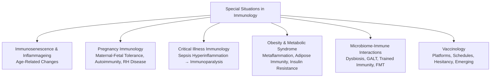
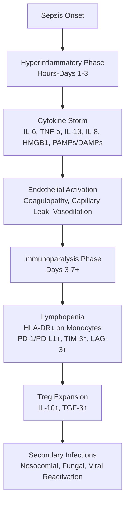

# 8.1-8.6 Special Situations in Clinical Immunology


---

## 🎯 Learning Objectives
- [ ] Understand **Immunosenescence & Inflammageing** — Age-related immune changes, Vaccine responses, Infection susceptibility
- [ ] Manage **Immunology in Pregnancy** — Maternal-Fetal Tolerance, Autoimmune Disease in Pregnancy, RH Disease, Vaccination
- [ ] Recognise **Immunology of Critical Illness** — Sepsis Immunoparalysis, Cytokine Storm, Immunoparalysis, Biomarkers
- [ ] Understand **Immunology of Obesity & Metabolic Syndrome** — Metaflammation, Adipose Tissue Immunity, Insulin Resistance
- [ ] Apply **Microbiome-Immune Interactions** — Dysbiosis, GALT, Trained Immunity, FMT, Probiotics
- [ ] Apply **Vaccinology** — Platforms, Schedules, Contraindications, Hesitancy, Emerging Vaccines
- [ ] Answer viva: "Immunosenescence" and "Pregnancy Immunology" and "Sepsis Immunoparalysis" and "Vaccine Platforms"

---

## 🧠 Core Concept: Immunology in Special Situations



---

## 1️⃣ Immunosenescence & Inflammageing

### Age-Related Immune Remodelling

| Component | Age-Related Change | Clinical Consequence |
|-----------|-------------------|----------------------|
| **Thymus** | **Thymic Involution** (Fatty Replacement) → ↓ Naive T Cell Output | ↓ Naive T Cells, ↓ TCR Diversity, ↓ Response to Novel Antigens (Vaccines, New Infections) |
| **T Cells** | ↓ Naive (CD45RA+), ↑ Memory (CD45RO+), ↓ CD28, ↑ Senescence (CD57+, KLRG1+), ↑ Tregs | ↓ Response to Novel Pathogens/Vaccines, ↑ Autoreactivity, ↑ Latent Virus Reactivation (VZV, CMV) |
| **B Cells** | ↓ Naive B Cells, ↓ Class Switch Recombination, ↓ Somatic Hypermutation | ↓ Vaccine Response (Lower Affinity/Avidity Antibodies), ↓ New Antigen Response |
| **Innate Immunity** | Neutrophil Dysfunction (↓ Chemotaxis, Phagocytosis, NETosis), Macrophage Dysfunction, ↓ NK Cytotoxicity | ↑ Bacterial/Fungal Infections, ↓ Tumour Surveillance |
| **Inflammation** | **"Inflammageing"** — Chronic Low-Grade Inflammation (↑ IL-6, TNF-α, CRP, IL-1β, IFN-γ) | **Frailty**, **Sarcopenia**, **Atherosclerosis**, **Neurodegeneration**, **Insulin Resistance**, **Cancer** |
| **CMV Seropositivity** | **Accelerates Immunosenescence** — Massive CMV-Specific T Cell Expansions (Memory Inflation) | ↑ Mortality, ↓ Vaccine Response, ↑ Frailty |

### Clinical Implications
| Domain | Impact |
|--------|--------|
| **Vaccination** | **Reduced Response** to ALL Vaccines; **Higher Doses/Adjuvants Needed** (High-Dose Flu, Adjuvanted Shingrix, High-Dose Hep B); **Repeated Doses** |
| **Infections** | ↑ **Respiratory Infections** (Influenza, Pneumococcal, COVID-19, RSV), **Zoster Reactivation**, **UTIs**, **Sepsis** |
| **Cancer** | ↓ Immune Surveillance → ↑ Incidence, ↓ Immunotherapy Efficacy (Checkpoint Inhibitors) |
| **Autoimmunity** | ↑ Late-Onset Autoimmune Disease (RA, PMR, GCA, AIHA) |

### Vaccination in Elderly (UK Schedule)
| Vaccine | Recommendation |
|---------|----------------|
| **Seasonal Influenza** | **Annual** — **High-Dose Quadrivalent (HD-QIV)** or **Adjuvanted (aQIV)** Preferred >65y |
| **Pneumococcal** | **PCV20 (Single Dose)** OR **PCV15 → PPV23 (1 Year Later)** |
| **Herpes Zoster** | **Shingrix (Recombinant zoster vaccine)** — **2 Doses 2-6 Months Apart** (Preferred > Zostavax) |
| **COVID-19** | **Boosters Per JCVI** (Seasonal, Variants) |
| **RSV** | **Arexvy/Abrysvo** (New) — **≥60y** (Shared Clinical Decision) |
| **Pertussis** | **Tdap Booster** (If Not in Last 10y) |

---

## 2️⃣ Immunology of Pregnancy

### Maternal-Fetal Tolerance
| Mechanism | Description |
|-----------|-------------|
| **HLA-G** (Trophoblast) | **Non-classical HLA** — Binds **ILT2/LILRB1** on NK/T Cells → **Inhibition** |
| **HLA-E** | Binds **NKG2A/CD94** on NK Cells → **Inhibition** |
| **PD-L1/PD-L2** (Trophoblast) | Binds **PD-1** on T Cells → **Inhibition** |
| **IDO** (Tryptophan Catabolism) | **Local Tryptophan Depletion** → T Cell Anergy/Apoptosis |
| **Treg Expansion** | **FoxP3+ Tregs** ↑ in Decidua → **IL-10, TGF-β, IL-35** |
| **HLA-C** (Paternal) | **KIR-HLA Interactions** on uNK Cells → **Licensing/Inhibition Balance** |

> **Key**: **Semi-Allogeneic Fetus Tolerated** — "Immunological Paradox of Pregnancy"

### Autoimmune Disease in Pregnancy

| Disease | Pregnancy Impact | Management |
|---------|------------------|------------|
| **SLE** | **Flare Risk** (2nd/3rd Trimester, Postpartum); **Lupus Nephritis** → Preterm, Pre-eclampsia | **HCQ Continued** (Safe), **Avoid MMF/Mycophenolate** (Teratogenic), **AZA/Steroids Safe**, **Belimumab** (Limited Data) |
| **APS** | **High Risk Thrombosis/Fetal Loss** | **LMWH (Enoxaparin) Prophylactic/Therapeutic + Aspirin 75-150mg** throughout |
| **RA** | **Improvement** (2nd/3rd Trimester), **Postpartum Flare (90%)** | **Continue HCQ/SSZ**, **Stop MTX/LEF/TOFA/JAKi** (Teratogenic), **Certolizumab Preferred Biologic** (No Fc Transfer) |
| **IBD (CD/UC)** | **Flare Risk** (If Active at Conception) | **Continue Mesalamine/Thiopurines/Anti-TNF (Certolizumab/Infiximab/Adalimumab Safe)** |
| **MS** | **Reduced Relapses** (3rd Trimester), **Postpartum Rebound (3m)** | **Continue Glatiramer/Natalizumab/Ofatumumab**, **Stop Fingolimod/Siponimod/Ozanimod/Ponesimod (Teratogenic)** |
| **T1DM** | **Strict Glycaemic Control** Pre-Conception → **HbA1c <48 mmol/mol** | **Insulin Pump/CGM**, Folic Acid 5mg, Aspirin 75mg (Pre-eclampsia Prophylaxis) |

### Drug Safety in Pregnancy (Immunology-Relevant)

| Drug | Pregnancy Category (UK/BNF) | Notes |
|------|-----------------------------|-------|
| **Hydroxychloroquine** | **Safe (Continue)** | **Strongly Recommended** in SLE |
| **Azathioprine** | **Safe (Continue)** | Monitor FBC, LFT |
| **Azathioprine (Pregnancy)** | **Category D?** | **BNF: Safe** (No Teratogenicity Data) |
| **Methotrexate** | **Contraindicated (Category X)** | **Stop 3-6 Months Pre-Conception** |
| **Leflunomide** | **Contraindicated (Category X)** | **Washout + Cholestyramine** Pre-Conception |
| **Mycophenolate (MMF)** | **Contraindicated (Category X)** | **STOP 6 Weeks Pre-Conception** |
| **Cyclophosphamide** | **Contraindicated (Category X)** | **High Teratogenicity** |
| **Biologics (TNFi)** | **Certolizumab = Safe (No Fc)**; **Others: Cross Placenta (IgG1) 3rd Trimester** | **Stop Infliximab/Adalimumab/Golimumab ~20-24w**; **Certolizumab Continued** |
| **Biologics (Non-TNF)** | **Rituximab (Contraindicated 3rd Trimester)** | **B-Cell Depletion in Fetus** |
| **JAK Inhibitors** | **Contraindicated** | **Teratogenic (Animal Data)** |
| **Corticosteroids** | **Safe (Prednisolone <20mg/d)** | **Cross Placenta (Inactivated by Placental 11β-HSD2)** |
| **IVIG** | **Safe** | **Used in ITP, APS, Kawasaki** |

### Rhesus Disease (Haemolytic Disease of Fetus & Newborn — HDFN)
| Feature | Detail |
|---------|--------|
| **Pathogenesis** | **RhD-Negative Mother** → Sensitisation (Feto-Maternal Haemorrhage) → **Anti-D IgG** → Crosses Placenta → **Haemolysis of RhD+ve Fetus** |
| **Prevention** | **Anti-D IgG Prophylaxis**: **28w + 34w** (Routine), **Post-Delivery (72h)**, **Sensitising Events** (Bleeding, Amnio, Trauma) |
| **Monitoring** | **Maternal Anti-D Titre** (q4w 28-32w, q2w 28-34w), **MCA Doppler** (MCA-PSV >1.5 MoM = Anaemia) |
| **Treatment** | **Intrauterine Transfusion (IUT)**, **Phototherapy**, **Exchange Transfusion**, **IVIG** (Adjunct) |

### Vaccination in Pregnancy (UK)
| Vaccine | Timing | Safety |
|---------|--------|--------|
| **Pertussis (Tdap)** | **16-32 Weeks** (Optimal 20-32w) | **Safe** — Transfers IgG to Fetus |
| **Influenza** | **Any Trimester** (Seasonal) | **Safe (Inactivated)** |
| **COVID-19** | **Any Trimester** | **Safe (mRNA Preferred)** |
| **RSV (Abrysvo)** | **28-36 Weeks** | **Safe (Maternal Immunisation → Infant Protection)** |
| **Live Vaccines (MMR, Varicella, BCG, Yellow Fever, Oral Typhoid)** | **Contraindicated** | Theoretical Risk to Fetus |

---

## 3️⃣ Immunology of Critical Illness

### Sepsis Immunodynamics — Biphasic Model



### Immunoparalysis Biomarkers
| Biomarker | Significance | Threshold |
|-----------|--------------|-----------|
| **mHLA-DR (Monocyte HLA-DR)** | **Gold Standard** for Immunoparalysis | **<30% (or <5000 Ab/C)** = Severe Immunoparalysis |
| **Lymphocyte Count** | **<800/μL** or **<1000/μL** | Sustained Lymphopenia = Poor Outcome |
| **PD-1 / PD-L1** | T Cell Exhaustion | **↑ Expression** = Exhaustion |
| **IL-10 / IL-6 Ratio** | Anti-inflammatory Dominance | **IL-10/IL-6 >1** = Immunosuppression |
| **CD4+ T Cell Count** | **<400/μL** | Predicts Secondary Infection |

### Immune Modulation Therapies (Investigational)
| Therapy | Target | Status |
|---------|--------|--------|
| **IFN-γ** | Restores HLA-DR, ↑ Phagocytosis | Phase II/III (IMMUNOSEP, IFNg-SEPSIS) |
| **GM-CSF** | Myeloid Differentiation, Phagocytosis | Phase II (NCT02361528) |
| **IL-7** | T Cell Homeostasis, Lymphopoiesis | Phase II (REVIVE, CYCLE) |
| **Anti-PD-1/PD-L1** | Reverse T Cell Exhaustion | Case Reports, Small Trials |
| **IL-15** | NK/CD8+ Memory Expansion | Preclinical |

### Haemophagocytic Lymphohistiocytosis (HLH) / Macrophage Activation Syndrome (MAS)
| Feature | Detail |
|---------|--------|
| **Pathogenesis** | **Uncontrolled T/NK activation** → **Cytokine storm** (IFN-γ, IL-6, IL-18, IL-10, CXCL9/10) → **Macrophage activation** → Phagocytosis of blood cells (Haemophagocytosis) |
| **Triggers** | **Primary (Familial)**: PRF1, UNC13D, STX11, STXBP2, RAB27A perforin defects; **Secondary**: Infection (EBV, CMV), Malignancy (Lymphoma), Autoimmune (SLE, sJIA = MAS), Drugs |
| **HLH-2004 Criteria** | ≥5 of 8: **Fever**, **Splenomegaly**, **Cytopenias** (≥2 lineages), **Hypertriglyceridaemia / Hypofibrinogenaemia**, **Haemophagocytosis** (BM/Spleen/LN), **Low/absent NK activity**, **Ferritin ≥500 µg/L** (often >>10,000), **sCD25 (sIL-2Rα) ≥2400 U/mL** |
| **HScore** | **Risk score for secondary HLH** (0-266): **Temperature**, **Organomegaly**, **Cytopenias**, **Ferritin**, **Triglycerides**, **Fibrinogen**, **AST**, **Haemophagocytosis**, **Immunosuppression**; **≥169 = 93% prob. HLH**; **≥200 = 99% prob.** |
| **Treatment** | **HLH-94 Protocol**: **Dexamethasone** + **Etoposide** + **Intrathecal Methotrexate**; **Anakinra** (IL-1Ra) for MAS/sJIA; **Ruxolitinib** (JAK1/2i) for refractory; **Eculizumab** (C5i) for CAPS-associated; **HSCT** for familial/refractory |

---

## 4️⃣ Immunology of Obesity & Metabolic Syndrome

### Metaflammation (Metabolic Inflammation)

| Feature | Mechanism |
|---------|-----------|
| **Adipose Tissue Expansion** | Hypertrophy → Hypoxia → **Necrosis** → **Crown-Like Structures** (Macrophage Crowns) |
| **Macrophage Polarisation** | **M1 (Pro-inflammatory)** Dominance in VAT (Visceral Adipose Tissue) → **TNF-α, IL-6, IL-1β, MCP-1** |
| **Adipokine Dysregulation** | **Leptin ↑** (Pro-inflammatory), **Adiponectin ↓** (Anti-inflammatory, Insulin Sensitising) |
| **Insulin Resistance** | **JNK/IKKβ/NF-κB Activation** → Serine Phosphorylation of IRS-1 → **Impaired Insulin Signalling** |
| **Gut-Liver Axis** | **Dysbiosis** → LPS/TLR4 → **Kupffer Cell Activation** → Hepatic Inflammation (NAFLD/NASH) |

### Immune Consequences of Obesity
| Domain | Impact |
|--------|--------|
| **Infection** | ↑ **Post-Op Infections**, **Wound Complications**, **Influenza Severity**, **COVID-19 Severity** |
| **Vaccine Response** | **Impaired** (Lower Antibody Titres, Faster Waning) — Hepatitis B, Influenza, COVID-19 |
| **Cancer** | ↑ **ESCC, HCC, Colorectal, Endometrial, Breast, Pancreatic** (Chronic Inflammation, Insulin/IGF-1) |
| **Autoimmunity** | ↑ **RA, PsA, SLE, MS, Hashimoto's** (Adipokines, Leptin, Inflammasome) |
| **Vaccine Response** | **Reduced Seroconversion** (Hb <10 → Lower Titres, Faster Waning) |

---

## 5️⃣ Microbiome-Immune Interactions

### Gut-Associated Lymphoid Tissue (GALT)
| Component | Function |
|-----------|----------|
| **Peyer's Patches** | Inductive Sites — **IgA Class Switch**, **T Cell Priming** |
| **Isolated Lymphoid Follicles** | Antigen Sampling (M Cells) |
| **Lamina Propria** | Effector Site — **IgA+ Plasma Cells**, **Trm (Tissue-Resident Memory T Cells)**, **ILC3** |
| **Mesenteric Lymph Nodes** | Drainage → Systemic Immune Priming |

### Microbiome-Immune Crosstalk
| Mechanism | Effect |
|-----------|--------|
| **SCFAs (Butyrate, Propionate, Acetate)** | **HDAC Inhibition** → **Treg Expansion**, **Barrier Integrity**, **Anti-inflammatory** |
| **Bile Acid Metabolism** | **FXR/FXR Activation** → Metabolic Regulation, Immune Modulation |
| **Tryptophan Metabolism** | **AhR Ligands** (Indoles) → **IL-22, IL-17, Barrier Function** |
| **Bile Acid Transformation** | **7α-Dehydroxylation** → Secondary Bile Acids → **TGR5/FXR** |
| **Molecular Mimicry** | **Microbial Peptides** ↔ **Self-Antigens** → Cross-Reactivity (Molecular Mimicry) |

### Dysbiosis & Disease
| Condition | Microbiome Signature | Immune Mechanism |
|-----------|---------------------|------------------|
| **IBD (CD/UC)** | ↓ Diversity, ↓ Faecalibacterium, ↑ Enterobacteriaceae | **Loss of SCFAs**, Barrier Defect, Th1/Th17 |
| **RA** | ↑ Prevotella copri, ↓ Diversity | **Molecular Mimicry**, Citrullination |
| **T1DM** | ↓ Diversity, ↓ Butyrate Producers | Loss of Tolerance, β-Cell Autoimmunity |
| **MS** | ↓ Clostridia, ↑ Akkermansia | Th17/Treg Imbalance, BBB Disruption |
| **Obesity/T2DM** | ↓ Diversity, ↑ Firmicutes/Bacteroidetes Ratio | **Endotoxaemia (LPS)** → Metaflammation |
| **Allergy/Asthma** | ↓ Diversity (Early Life), ↓ Farm Exposure | **Hygiene Hypothesis**, ↓ Treg Induction |

### Trained Immunity (Innate Immune Memory)
| Concept | Description |
|---------|-------------|
| **Definition** | **Epigenetic Reprogramming** of Innate Immune Cells (Monocytes, NK Cells) → **Enhanced Response** to Secondary Stimulus |
| **Inducers** | **BCG**, **β-Glucan**, **Measles Vaccine**, **BCG Scarification** |
| **Epigenetic Changes** | **H3K4me3, H3K27ac** at Promoters of Inflammatory Genes (IL-6, TNF-α, IL-1β) |
| **Clinical Relevance** | **BCG → ↓ Neonatal Mortality**, **BCG → ↓ Respiratory Infections**, **BCG → ↓ COVID-19 Severity (Debated)** |

### Faecal Microbiota Transplantation (FMT)
| Indication | Efficacy |
|------------|----------|
| **Recurrent C. difficile Infection (rCDI)** | **>90% Cure Rate** (Superior to Vancomycin) |
| **IBD (UC)** | **Remission Induction** (Modest, Donor-Dependent) |
| **Obesity/Metabolic Syndrome** | Experimental (Improved Insulin Sensitivity) |
| **Autism/Neuropsychiatric** | Experimental (Gut-Brain Axis) |

---

## 6️⃣ Vaccinology

### Vaccine Platforms

| Platform | Mechanism | Examples | Advantages | Limitations |
|----------|-----------|----------|------------|-------------|
| **Live Attenuated** | Replicating, Weakened Pathogen | **MMR, Varicella, BCG, Oral Polio, Rotavirus, Yellow Fever** | **Strong Cellular + Humoral**, Long-Lasting, Single Dose | **Contraindicated in Immunocompromised, Pregnancy**; Cold Chain |
| **Inactivated (Killed)** | Non-Replicating Pathogen | **Influenza (IIV), Hepatitis A, Polio (IPV), Rabies, Cholera, Pertussis (wP)** | **Safe in Immunocompromised**, Stable | Weaker Immunogenicity, Multiple Doses, Adjuvants Needed |
| **Subunit/Protein** | Purified Antigen | **Hepatitis B, HPV, Pertussis (aP), Meningococcal (MenACWY), Shingrix** | Safe, Defined Antigens | Multiple Doses, Adjuvants Needed |
| **Toxoid** | Inactivated Toxin | **Diphtheria, Tetanus** | Neutralising Antibodies | Boosters Needed |
| **Conjugate** | Polysaccharide + Carrier Protein | **Hib, MenACWY, PCV13/15/20, Typhoid** | **T-Cell Dependent Response** in Infants | Complex Manufacturing |
| **Viral Vector** | Replication-Deficient Virus Delivers Antigen Gene | **AstraZeneca (ChAdOx1), J&J (Ad26), Sputnik V (Ad26+Ad5), Ebola (rVSV-ZEBOV)** | **Strong CD8+ T Cell**, Single Dose Possible | Pre-Existing Vector Immunity, Rare TTS (VITT) |
| **mRNA (LNP)** | mRNA → Host Translation → Antigen | **Pfizer/BioNTech (BNT162b2), Moderna (mRNA-1273)** | **Rapid Development**, Strong CD4/CD8/Ab, No Live Virus | **Cold Chain (-70°C to -20°C)**, Reactogenicity, Myocarditis (Rare) |
| **DNA Plasmid** | DNA → Nucleus → mRNA → Protein | **ZyCoV-D (India), Inovio (INO-4800)** | Stable, No Cold Chain | Lower Immunogenicity (Historically), Electroporation Needed |
|| **Protein Subunit (Adjuvanted)** | Recombinant Protein + Adjuvant | **Novavax (NVX-CoV2373), Sanofi/GSK (VidPrevtyn)** | **Safe, No Genetic Material**, Strong Ab | Adjuvant Dependency |

### Malaria Vaccine (RTS,S/AS01 — Mosquirix)
| Feature | Detail |
|---------|--------|
| **Target** | **Plasmodium falciparum** Circumsporozoite Protein (CSP) |
| **Platform** | **Recombinant Protein (CSP-HBsAg fusion) + AS01 Adjuvant** |
| **Schedule** | **4 Doses**: 5, 6, 7 Months + Booster at 18 Months (0-1-2-20m) |
| **Efficacy** | **~30-40% against Clinical Malaria** (4 years); **~50% in first year**; **~30% against Severe Malaria** |
| **WHO Recommendation** | **Broad Implementation in Sub-Saharan Africa** (2021) — **Pilot Rollout**: Ghana, Kenya, Malawi |
| **Impact** | **Reduces Severe Malaria Hospitalisations**; **Cost-Effective** alongside ITNs, SMC, IRS |
| **Limitations** | **Waning Immunity** (Requires Booster); **Not 100% Protective**; **Cold Chain Required** |

|### UK Immunisation Schedule (Key Points)
| Age | Vaccines |
|-------|----------|
| **8 Weeks** | 6-in-1 (DTaP/IPV/Hib/HepB), Rotavirus, MenB, PCV |
| **12 Weeks** | 6-in-1 (2nd), Rotavirus (2nd), PCV (2nd) |
| **16 Weeks** | 6-in-1 (3rd), MenB (2nd) |
| **1 Year** | Hib/MenC, MMR (1st), PCV (Booster), MenB (Booster) |
| **3y 4m** | MMR (2nd), 4-in-1 (DTaP/IPV Booster) |
| **12-13y (Girls/Boys)** | HPV (2 Doses, 6-24m Apart) |
| **14y** | MenACWY, Td/IPV (Booster) |
| **≥65y** | Flu (Annual, HD/aQIV), Pneumococcal (PCV20), Shingrix, COVID, RSV |
| **Pregnancy** | Tdap (16-32w), Flu, COVID, RSV (28-36w) |

### Vaccine Contraindications & Precautions

| Contraindication | Vaccines Affected |
|------------------|-------------------|
| **Anaphylaxis to Previous Dose/Component** | All |
| **Severe Immunodeficiency** | **Live Vaccines** (MMR, Varicella, BCG, Rotavirus, Yellow Fever, LAIV, Oral Typhoid) |
| **Pregnancy** | **Live Vaccines** (MMR, Varicella, BCG, Yellow Fever, LAIV) |
| **Severe Egg Allergy** | **Influenza (Cell-Based/Recombinant OK), Yellow Fever** |
| **Guillain-Barré (Within 6w of Flu Vaccine)** | Influenza (Precaution) |
| **Thrombocytopenia/Coagulopathy** | IM Injections (Caution), Intranasal/SC Preferred |

### Vaccine Hesitancy / Equity
| Dimension | Strategy |
|-----------|----------|
| **Confidence** | **Transparent Communication**, **Trusted Messengers** (HCPs, Community Leaders), **Address Myths** (Fertility, DNA, Microchips) |
| **Complacency** | **Risk Communication**, **Remind Severity**, **Reminders/Recalls** |
| **Convenience** | **Accessible Locations** (Pharmacies, Community Centres), **Flexible Hours**, **Walk-Ins**, **Co-Administration** |
| **Equity** | **Targeted Outreach** (Underserved, Ethnic Minorities, Homeless, Learning Disabilities), **Multilingual Materials**, **Cultural Sensitivity** |

---

## ⚡ FCPS/MRCP High-Yield Summary

| Topic | Key Points |
|-------|------------|
| **Immunosenescence** | Thymic Involution → ↓ Naive T Cells, ↑ Memory/Senescent T Cells, **Inflammageing** (↑ IL-6, TNF, CRP), CMV Accelerates; **Vaccine Response ↓** → High-Dose/Adjuvanted Vaccines |
| **Pregnancy Immunology** | **Maternal-Fetal Tolerance**: HLA-G, HLA-E, PD-L1, IDO, Tregs; **Autoimmune in Pregnancy**: SLE (Flare Risks, HCQ Safe), APS (LMWH+Aspirin), RA (Improves, Certolizumab Safe), IBD (Continue Biologics), MS (Relapse Postpartum) |
| **Drug Safety in Pregnancy** | **HCQ Safe**, **AZA Safe**, **MTX/LEF/MMF/CYC Contraindicated**, **TNFi: Certolizumab Safe (No Fc), Others Stop 20-24w**, **JAKi Contraindicated**, **Rituximab Avoid 3rd Trimester** |
| **RHD** | Anti-D Prophylaxis (28/34w, Post-Delivery, Sensitising Events), MCA Doppler, IUT/Phototherapy/Exchange |
| **Vaccines in Pregnancy** | **Tdap (16-32w), Flu (Any Trimester), COVID, RSV (28-36w)**; **Live Vaccines Contraindicated** |
| **Critical Illness** | **Hyperinflammatory → Immunoparalysis**; **mHLA-DR <30% = Immunoparalysis**; **Biomarkers**: mHLA-DR, Lymphopenia, PD-1, IL-10; **Therapies**: IFN-γ, GM-CSF, IL-7 (Experimental) |
| **Obesity** | **Metaflammation**: VAT → M1 Macrophages → TNF/IL-6/IL-1β → Insulin Resistance; **Vaccine Response ↓**; ↑ Infection/Cancer/Autoimmunity Risk |
| **Microbiome** | **SCFAs → Treg ↑, Barrier ↑**; **Dysbiosis**: IBD, RA, T1DM, MS, Obesity; **Trained Immunity** (BCG, β-Glucan → Epigenetic Reprogramming); **FMT** (rCDI >90%) |
| **Vaccines** | **Platforms**: Live Attenuated, Inactivated, Subunit, Conjugate, Viral Vector, mRNA, Protein Subunit; **Cold Chain** (mRNA: -70°C/-20°C); **Contraindications**: Live in Immunocompromised/Pregnancy |
| **UK Schedule** | **8/12/16w: 6-in-1, Rotavirus, MenB, PCV**; **1yr: MMR, Hib/MenC, PCV, MenB**; **3y4m: MMR, 4-in-1**; **12-13y: HPV**; **14y: MenACWY, Td/IPV**; **≥65: Flu (HD/aQIV), PPV/PCV20, Shingrix, RSV** |
| **Vaccine Hesitancy** | **3 Cs**: Confidence (Trust), Complacency (Risk Perception), Convenience (Access); **Equity**: Targeted Outreach, Multilingual, Cultural Safety |

---

## 🎤 Viva Questions (Expected Answers)

| # | Question | Expected Answer |
|---|----------|-----------------|
| 1 | What is immunosenescence? | **Age-related immune remodelling**: Thymic involution → ↓ Naive T cells, ↑ Memory/Senescent T Cells, ↓ TCR Diversity, **Inflammageing** (↑ IL-6, TNF, CRP), CMV Acceleration |
| 2 | Why are vaccines less effective in elderly? | **↓ Naive T/B Cells**, **↓ TCR/BCR Diversity**, **Impaired DC Function**, **Inflammageing** → Poor Germinal Centre Response → **Lower Affinity/Avidity, Shorter Duration** |
| 3 | What vaccines are recommended for >65y in UK? | **Flu (High-Dose/Adjuvanted), Pneumococcal (PCV20), Shingrix (RZV), COVID Boosters, RSV (Arexvy/Abrysvo), Pneumococcal (PCV20)** |
| 4 | How does pregnancy affect SLE? | **Flare Risk** (2nd/3rd Trimester, Postpartum); **Lupus Nephritis** → ↑ Preterm/Pre-eclampsia; **HCQ Continued (Safe)**, **Avoid MMF/Mycophenolate** |
| 5 | Which biologic is safe in pregnancy? | **Certolizumab Pegol** (PEGylated Fab', **No Fc Transfer**) → **Safe Throughout Pregnancy** |
| 6 | What is immunoparalysis? | **Late Sepsis Phase**: **Lymphopenia, mHLA-DR <30% on Monocytes**, ↑ PD-1/PD-L1, ↑ Tregs, ↑ IL-10 → **Secondary Infections, Poor Outcome** |
| 7 | Biomarker for sepsis immunoparalysis? | **mHLA-DR on Monocytes <30%** (or <5000 Ab/C) — Best Biomarker |
| 8 | How does obesity cause insulin resistance? | **VAT Macrophages → M1 Polarisation → TNF-α, IL-6, IL-1β → JNK/IKKβ/NF-κB → IRS-1 Serine Phosphorylation → Impaired Insulin Signalling** |
| 9 | What is trained immunity? | **Epigenetic Reprogramming of Innate Cells** (Monocytes, NK) → **Enhanced Response to Secondary Stimulus**; Induced by **BCG, β-Glucan, Measles Vaccine**; **H3K4me3/H3K27ac** Epigenetic Marks |
| 10 | mRNA vaccine mechanism? | **LNP-mRNA → Cytoplasm → Ribosome Translation → Antigen → MHC I/II Presentation → CD8+/CD4+ T Cell + Neutralising Antibody Response** |

---

## 🧩 Confusions & Mnemonics

| Confusion | Clarification |
|-----------|---------------|
| **"Elderly shouldn't get live vaccines"** | **Mostly True**, but **Shingrix (RZV) is RECOMBINANT (Non-Live)** — **Safe & Recommended >50y/≥18y Immunocompromised** |
| **"Pregnancy = Immunosuppression"** | **NO.** **Selective Immune Modulation** — Tolerance to Fetus + **Preserved/Enhanced Innate Immunity** (NK, Neutrophils); **Th1→Th2 Shift** |
| **"All Biologics Contraindicated in Pregnancy"** | **NO.** **Certolizumab (No Fc) = Safe Throughout**; **TNFi (except CZP) Stop 20-24w**; **Rituximab Avoid 3rd Trimester**; **JAKi Contraindicated** |
| **"Live Vaccines = Never in Immunocompromised"** | **TRUE** for **Severe** Immunodeficiency; **BUT** **HIV on ART with CD4>200** → **MMR/Varicella OK**; **RZV (Shingrix) = Non-Live** = Safe |
| **"Immunoparalysis = Sepsis" | **NO.** **Late Phase** of Sepsis; **Hyperinflammatory Phase First** (Cytokine Storm) → **Then Immunoparalysis** |
| **"Obesity = Only Mechanical Problem"** | **NO.** **Metaflammation** — **Adipose Tissue as Endocrine/Immune Organ** → Chronic Inflammation → Insulin Resistance, Cancer, Autoimmunity |
| **"Microbiome = Only Gut"** | **NO.** **Skin, Lung, Oral, Vaginal, Urinary, Placental** Microbiomes All Influence Systemic Immunity |
| **"BCG = Only TB Vaccine"** | **NO.** **BCG Induces Trained Immunity** → **Non-Specific Protection** (Neonatal Mortality ↓, Respiratory Infections ↓) |
| **"All Vaccines = Same Schedule Everywhere"** | **NO.** **UK vs US vs WHO** Differ (e.g., **Varicella in US Schedule**, **BCG in UK High-Risk Only**, **MenB in UK/Canada, Not US Routine**) |
| **"mRNA Vaccines Alter DNA"** | **NO.** **mRNA Never Enters Nucleus**, **No Reverse Transcriptase**, **Degraded in Days** — No Genomic Integration |

> **Mnemonic: SPECIAL SITUATIONS IMMUNOLOGY**  
> **S**enescence: **Thymic Involution → ↓ Naive T, ↑ Memory/Senescent, Inflammageing (IL-6/TNF/CRP), CMV Driver**  
> **P**regnancy: **Tolerance (HLA-G/E, PD-L1, IDO, Treg) + Autoimmune (SLE Flare, APS→LMWH+Aspirin, RA→Improves, Certolizumab Safe)**  
> **E**ligibility: **Vaccines in Pregnancy (Tdap 16-32w, Flu/COVID Any Trimester, RSV 28-36w) — NO Live Vaccines**  
> **C**ritical Illness: **Sepsis Biphasic** (Hyperinflammatory → **Immunoparalysis**); **mHLA-DR<30% = Immunoparalysis**; **IFN-γ/GM-CSF/IL-7 Experimental**  
> **O**besity: **Metaflammation (VAT→M1 Macs→TNF/IL-6→Insulin Resistance)**; **Vaccine Response ↓**; **Cancer/Autoimmunity Risk↑**  
> **I**mmune-Microbiome: **GALT/Peyer's/M Cells**, **SCFAs→Treg↑/Barrier↑**, **Dysbiosis→IBD/RA/T1DM/MS**, **Trained Immunity (BCG/β-Glucan→Epigenetic)**  
> **V**accinology: **Platforms (Live/Inactivated/Subunit/Conjugate/Viral Vector/mRNA/DNA/Subunit+Adjuvant)**; **UK Schedule (8/12/16w, 1y, 3y4m, 12-13y, 14y, ≥65y)**; **Hesitancy (3Cs: Confidence/Complacency/Convenience)**  
> **R**H Disease: **Anti-D Prophylaxis (28/34w, Post-Delivery, Sensitising Events)**  
> **S**pecial Groups: **Immunocompromised (No Live), Elderly (High-Dose/Adjuvanted), Asplenia (Vaccines+Pen V), CKD/Dialysis (Hep B Double Dose), HIV (CD4>200→Live OK)**  

---

## 🗺️ Mind Map

```mermaid
mindmap
  root((Special Situations Immunology))
    Ageing
      Immunosenescence
        Thymic Involution
        Naive T ↓, Memory/Senescent ↑
        Inflammageing (IL-6, TNF, CRP)
        CMV Acceleration
      Vaccines
        High-Dose/Adjuvanted
        Flu (HD/aQIV), Shingrix, PCV20, RSV
    Pregnancy
      Tolerance
        HLA-G/E, PD-L1, IDO, Treg
      Autoimmune
        SLE Flare, APS (LMWH+Aspirin)
        RA Improves, MS Remission
      Drug Safety
        HCQ/AZA Safe; MTX/LEF/MMF/CYC/JAKi NO
        TNFi: Certolizumab Safe
      RHD
        Anti-D 28/34w, Post-Deliv, Events
      Vaccines
        Tdap 16-32w, Flu/COVID/RSV Any Trim
    Critical Illness
      Sepsis Biphasic
        Hyperinflammatory → Immunoparalysis
      Biomarkers
        mHLA-DR <30%, Lymphopenia, PD-1↑
      Therapy
        IFN-γ, GM-CSF, IL-7 (Experimental)
    Obesity
      Metaflammation
        VAT M1 Macs → TNF/IL-6 → Insulin Resistance
      Vaccine Response ↓
      Cancer/Autoimmunity Risk ↑
    Microbiome
      GALT
      SCFA → Treg↑, Barrier↑
      Dysbiosis → IBD/RA/T1DM/MS/Obesity
      Trained Immunity
        BCG/β-Glucan → Epigenetic Reprogramming
      FMT
        rCDI >90% Cure
    Vaccinology
      Platforms
        Live/Inactivated/Subunit/Conjugate/Viral Vector/mRNA/DNA/Protein
      Schedule
        8/12/16w, 1y, 3y4m, 12-13y, 14y, ≥65y
      Contraindications
        Live in Immunocompromised/Pregnancy
      Hesitancy
        3Cs: Confidence/Complacency/Convenience
        Equity
```

---

## 📅 Spaced Repetition Tracker

| Review | Date | Score (0–5) | Notes |
|--------|------|-------------|-------|
| Day 1 | | | |
| Day 3 | | | |
| Day 7 | | | |
| Day 14 | | | |
| Day 30 | | | |
| Day 90 | | | |

---

## 📝 Self-Test Scorecard

| Section | Max | Score | % |
|---------|-----|-------|---|
| Immunosenescence & Vaccines in Elderly | 3 | | |
| Pregnancy Immunology & Drug Safety | 4 | | |
| Critical Illness Immunoparalysis | 3 | | |
| Obesity & Metaflammation | 2 | | |
| Microbiome-Immune Interactions | 3 | | |
| Vaccinology (Platforms, Schedule, Ethics) | 3 | | |
| RHD & Vaccines in Pregnancy | 2 | | |
| **Total** | **20** | | |

---

## 💬 Exam Answer Modes

| Format | Prompt | Key Points |
|--------|--------|------------|
| **Long Essay** | "Discuss the immunological changes with ageing and their impact on vaccination strategy." | Thymic Involution, Naive T Cell Decline, Inflammageing (IL-6, TNF, CRP), CMV, Vaccine Response ↓, High-Dose/Adjuvanted Vaccines (Flu HD/aQIV, Shingrix, PCV20, RSV) |
| **Short Note** | "Immunology of pregnancy — tolerance mechanisms and drug safety." | HLA-G/E, PD-L1, IDO, Tregs; SLE Flare/APS Management; HCQ/AZA Safe; MTX/LEF/MMF/CYC/JAKi Contraindicated; Certolizumab Safe; Anti-D Prophylaxis |
| **Viva** | "Patient with septic shock day 5. mHLA-DR 20%. What does this mean and what therapies exist?" | **Immunoparalysis** (mHLA-DR <30%); **High Risk Secondary Infections**; **Investigational**: IFN-γ, GM-CSF, IL-7; Supportive Care |
| **Ward Round** | "Pregnant woman on adalimumab for Crohn's at 20 weeks. Management?" | **Continue Adalimumab until 20-24 Weeks**, Then Stop; **Certolizumab Safe Throughout**; Plan Delivery/Pediatrician; Newborn: No Live Vaccines (BCG, Rotavirus) if Exposed 3rd Trimester |
| **Last-Night** | "Ageing: Thymus Involution, Naive T↓, Inflammageing (IL-6/TNF/CRP), CMV↑, Vaccines: HD-Flu/aQIV, Shingrix, PCV20, RSV. Pregnancy: HLA-G/E/PD-L1/IDO/Treg. SLE Flare, APS LMWH+Aspirin, Certolizumab Safe, MTX/LEF/MMF/CYC/JAKi NO. RHD: Anti-D 28/34w + Post. Sepsis: Hyperinflam→Immunoparalysis (mHLA-DR<30%). Obesity: VAT→M1 Macs→TNF/IL-6→Insulin Resistance. Microbiome: SCFA→Treg, Dysbiosis→Disease. Vaccines: Live/Inact/Subunit/Conjugate/mRNA/Viral Vector. UK Schedule: 8/12/16w, 1y, 3y4m, 12-13y, 14y, ≥65. Hesitancy: 3Cs. Equity: Targeted Outreach." | Compressed. |

---

## 📌 Summary
- **Immunosenescence**: Thymic Involution → ↓ Naive T Cells, ↑ Senescent/Memory T Cells, **Inflammageing** (Chronic IL-6, TNF, CRP), **CMV Accelerates**; **Vaccine Response ↓** → **High-Dose/Adjuvanted Vaccines** (Fluzone HD, Fluad, Shingrix, PCV20, Arexvy/Abrysvo)
- **Pregnancy Immunology**: **Maternal-Fetal Tolerance** (HLA-G, HLA-E, PD-L1, IDO, Tregs); **Autoimmune Flare Risk** (SLE 2nd/3rd Trimester); **Drug Safety** — **Safe**: HCQ, AZA, Certolizumab, IVIG; **Contraindicated**: MTX, LEF, MMF, CYC, JAKi, Rituximab (3rd Trimester); **RHD Prophylaxis**: Anti-D 28w/34w + Post-Delivery
- **Vaccines in Pregnancy**: **Tdap (16-32w), Influenza, COVID-19, RSV (28-36w)** — **All Inactivated/Non-Live**; **Live Vaccines Contraindicated**
- **Critical Illness**: **Biphasic** — Early **Hyperinflammatory** (Cytokine Storm) → Late **Immunoparalysis** (mHLA-DR <30%, Lymphopenia, PD-1↑, Tregs↑) → **Secondary Infections**; **Experimental**: IFN-γ, GM-CSF, IL-7
- **Obesity (Metaflammation)**: **Visceral Adipose Tissue → M1 Macrophage Polarisation → TNF-α/IL-6/IL-1β → Insulin Resistance**; **Vaccine Response Impaired**, ↑ Infection/Cancer/Autoimmunity Risk
- **Microbiome-Immune Axis**: **GALT** (Peyer's Patches, M Cells, Lamina Propria LP); **SCFAs → Treg ↑, Barrier Integrity ↑**; **Dysbiosis** → IBD, RA, T1DM, MS, Obesity; **Trained Immunity** (BCG, β-Glucan → Epigenetic Reprogramming); **FMT** (rCDI >90% Cure)
- **Vaccinology**: Platforms (Live Attenuated, Inactivated, Subunit, Conjugate, Viral Vector, mRNA, DNA, Protein Subunit); **UK Schedule**: 8/12/16w, 1y, 3y4m, 12-13y, 14y, ≥65y; **Contraindications**: Live Vaccines in Immunocompromised/Pregnancy; **Hesitancy**: 3 Cs (Confidence, Complacency, Convenience); **Equity**: Targeted Outreach
- **RHD**: Anti-D Prophylaxis; **Vaccines in Immunocompromised** (No Live, Inactivated/Subunit/mRNA OK); **Special Populations** (Asplenia, CKD, HIV, Elderly)

---

## ❓ MCQs (10)

1. **Immunosenescence hallmark feature?**  
   A. Thymic Hyperplasia  B. **Thymic Involution**  C. ↑ Naive T Cells  D. ↓ Inflammatory Cytokines  
   *Answer: B. Thymic Involution → ↓ Naive T Cell Output.*

2. **Inflammageing — key cytokine?**  
   A. IL-10  B. **IL-6**  C. IFN-γ  D. IL-4  
   *Answer: B. IL-6 (Also TNF-α, CRP) — Hallmark of Inflammageing.*

3. **Pregnancy — which biologic is SAFE throughout?**  
   A. Infliximab  B. Adalimumab  C. **Certolizumab Pegol**  D. Rituximab  
   *Answer: C. Certolizumab Pegol (PEGylated Fab', No Fc Transfer).*

4. **Methotrexate in pregnancy — category?**  
   A. Safe  B. **Contraindicated (Teratogenic)**  C. Safe 1st Trimester Only  D. Safe 3rd Trimester Only  
   *Answer: B. Contraindicated — Teratogenic (Category X).*

4. **Rhesus Disease prevention — Anti-D timing?**  
   A. 20w & 30w  B. **28 Weeks & 34 Weeks + Post-Delivery**  C. 12w & 20w  D. At Delivery Only  
   *Answer: B. Routine Prophylaxis at 28w & 34w + Post-Delivery (Within 72h) + Sensitising Events.*

5. **Sepsis immunoparalysis — best biomarker?**  
   A. CRP  B. PCT  C. **mHLA-DR on Monocytes <30%**  D. IL-6  
   *Answer: C. mHLA-DR <30% on Monocytes = Immunoparalysis.*

6. **Obesity & immunity — mechanism of insulin resistance?**  
   A. ↑ Adiponectin  B. **VAT M1 Macrophages → TNF-α/IL-6 → IRS-1 Serine Phosphorylation**  C. ↑ Leptin Sensitivity  D. ↓ TNF-α  
   *Answer: B. VAT M1 Macrophages → TNF-α/IL-6 → JNK/IKKβ → IRS-1 Serine Phosphorylation.*

6. **Trained Immunity — inducer?**  
   A. Influenza Vaccine  B. **BCG Vaccine / β-Glucan**  C. Tetravalent Vaccine  D. mRNA Vaccine  
   *Answer: B. BCG, β-Glucan (Also Measles Vaccine).*

7. **Pneumococcal vaccine for elderly — UK recommendation?**  
   A. PPV23 Only  B. **PCV20 (Single Dose) OR PCV15 + PPV23**  C. PCV13 Only  D. PCV15 Only  
   *Answer: B. PCV20 Single Dose OR PCV15 → PPV23 (1 Year Later).*

8. **Vaccine hesitancy — 3 Cs?**  
   A. Cost, Convenience, Compliance  B. **Confidence, Complacency, Convenience**  C. Culture, Community, Communication  D. Cost, Coverage, Confidence  
   *Answer: B. Confidence, Complacency, Convenience (WHO SAGE).*

9. **FMT indication with highest evidence?**  
   A. Obesity  B. **Recurrent C. difficile Infection (rCDI)**  C. Autism  D. IBD  
   *Answer: B. Recurrent C. difficile Infection (rCDI) — >90% Cure Rate.*

10. **mRNA vaccine mechanism?**  
    A. Enters Nucleus → Integrates DNA  B. **LNP-mRNA → Cytoplasm → Ribosome → Antigen → MHC I/II Presentation**  C. Viral Vector → DNA Integration  D. Protein → Direct B Cell Activation  
    *Answer: B. LNP-mRNA → Cytoplasm → Ribosome Translation → Antigen → MHC I/II Presentation.*

---

## 📋 SBAs (10)

1. **80F for flu vaccination. Best choice?**  
   A. Standard Quadrivalent  B. **High-Dose (Fluzone HD) or Adjuvanted (Fluad)**  C. LAIV  D. Any  *Answer: B.*

2. **32F on adalimumab for Crohn's, pregnant 10 weeks. Management?**  
   A. Stop Immediately  B. **Continue Until 20-24 Weeks, Then Stop**  C. Switch to Certolizumab  D. Increase Dose  *Answer: B.*

3. **Septic patient Day 7. mHLA-DR 15%. Interpretation?**  
   A. Hyperinflammatory  B. **Immunoparalysis**  C. Recovery  D. Sepsis Resolved  *Answer: B.*

4. **BMI 38 patient needs COVID booster. Expected response?**  
   A. Normal  B. **Reduced (Impaired Antibody Titres, Faster Waning)**  C. Enhanced  D. No Response  *Answer: B.*

5. **Antibiotic-associated diarrhoea, recurrent C. difficile. Best treatment?**  
   A. Vancomycin  B. Fidaxomicin  C. **FMT (>90% Cure)**  D. Probiotics  *Answer: C.*

---

## 🔑 Answer Keys
| MCQs | SBAs |
|------|------|
| 1-B, 2-B, 3-B, 4-B, 5-B, 6-B, 7-B, 8-B, 9-B, 10-B | 1-B, 2-B, 3-B, 4-B, 5-C |

---

## 🔗 Cross-Links
- [[1. Fundamentals of Immunology]] — T/B Cell Biology, Cytokines, HLA
- [[2.1 Primary Immunodeficiencies]] — PID in Elderly (Late-Onset), Vaccination in PID
- [[2.2 Secondary Immunodeficiencies]] — Drug-Induced Immunosuppression (Biologics in Pregnancy)
- [[3.2 Systemic Autoimmune Diseases]] — Autoimmune Disease in Pregnancy (SLE, APS, RA)
- [[3.3 Organ-Specific Autoimmune Diseases]] — T1DM, Thyroid, Coeliac in Pregnancy
- [[4.1-4.4 Hypersensitivity & Allergy]] — Vaccine Allergy, Anaphylaxis to Vaccines
- [[5.1-5.4 Genetic Testing Technologies]] — HLA Typing for Transplant, Pharmacogenetics of Vaccines
- [[5.4 Prenatal & Preimplantation Testing]] — Prenatal Diagnosis of PID, Carrier Screening
- [[5.5 Genetic Counselling]] — Reproductive Counselling for Autoimmune/Immunodeficiency
- [[6.1 Hereditary Cancer Syndromes]] — Cancer Risk in Immunosuppression, Vaccines in Cancer Patients
- [[6.1-6.7 Tumour Immunology & Immunotherapy]] — Cancer Immunotherapy, Vaccines in Malignancy
- [[7.1-7.6 Immune-Based Therapies]] — IVIG, Biologics, JAKi in Special Situations
- [[9. ELSI]] — Vaccine Ethics, Equity, Mandatory Vaccination, Genetic Discrimination
- [[10. System-Based Clinical Genetics]] — Immunology by System (Respiratory, GI, Neurological, Dermatological)

---

**Last Updated:** 2026-06-15  
**All Chapter 4 Clinical Immunology Files Complete!**