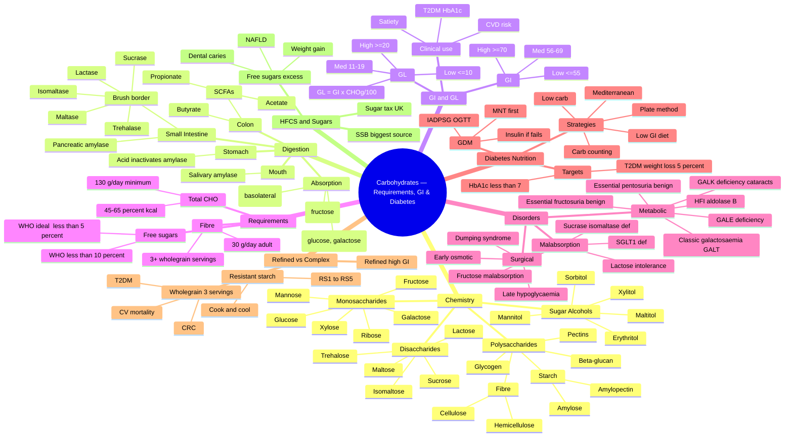

**Related:** [[Nutritional Factors in Disease MOC]], [[Davidson Chapter 22 - Nutritional Factors in Disease Hierarchy]], [[../00_Index/Medicine MOC|Medicine MOC]], [[Dietary Fibre- Soluble, Insoluble & Prebiotic]], [[Protein- Requirements, Functions & Disorders]], [[Diet & Chronic Disease- CVD, Diabetes & Cancer]], [[Obesity- Assessment, Complications & Management]]

> [!important]
> **One-liner:** Carbohydrates are the dominant macronutrient (45–65% kcal), but quality (low GI, high fibre, wholegrain) matters more than quantity — refined sugars drive the global diabetes and obesity pandemics, and the brain's obligate 130 g/day glucose requirement makes carbohydrates nutritionally essential.

---

## 1. 1. Learning Objectives

- [ ] Classify dietary carbohydrates (monosaccharides, disaccharides, oligosaccharides, polysaccharides) and their dietary sources
- [ ] Describe digestion of starch and disaccharides (salivary/pancreatic amylase; brush-border disaccharidases)
- [ ] Define and apply Glycaemic Index (GI) and Glycaemic Load (GL) with clinical cut-offs
- [ ] Distinguish available vs unavailable carbohydrates and the role of dietary fibre and resistant starch
- [ ] State WHO/EFSA/DRV recommendations for total carbohydrate, free sugars and fibre
- [ ] Recognise and manage carbohydrate-related disorders: lactose intolerance, fructose malabsorption, sucrase-isomaltase deficiency, galactosaemia, essential pentosuria, dumping syndrome
- [ ] Apply dietary management strategies in Type 1, Type 2 and gestational diabetes (carbohydrate counting, plate method, low-GI diet)
- [ ] Discuss the role of wholegrains, refined carbohydrates and HFCS in chronic disease (CVD, T2DM, CRC)
- [ ] Identify sugar alcohols and their place in diabetic products

---

## 2. 2. Definitions / Key Concepts

| Term | Definition |
|------|------------|
| **Carbohydrate** | Polyhydroxy aldehydes/ketones; empirical formula (CH₂O)ₙ; main energy substrate (4 kcal/g) |
| **Monosaccharide** | Single sugar unit; cannot be hydrolysed further (glucose, fructose, galactose, ribose) |
| **Disaccharide** | Two monosaccharides joined by glycosidic bond (sucrose, lactose, maltose, trehalose) |
| **Oligosaccharide** | 3–9 monosaccharide units; includes raffinose, stachyose, FOS (flatulence factors) |
| **Polysaccharide** | ≥10 units; storage (starch, glycogen) or structural (cellulose, hemicellulose) |
| **Starch** | Storage polysaccharide of plants: amylose (α-1,4 linear) + amylopectin (α-1,4 with α-1,6 branches) |
| **Glycogen** | Animal storage polysaccharide; highly branched α-1,4/α-1,6; hepatic (glucose homeostasis) + muscular (local fuel) |
| **Available carbohydrate** | Starches + sugars digestible/ absorbable in the human small intestine (glycaemic effect) |
| **Unavailable carbohydrate** | Carbohydrates not digested in SI — dietary fibre (cellulose, hemicellulose, pectin, β-glucan, lignin, resistant starch) |
| **Glycaemic Index (GI)** | Area under 3-h glucose curve after 50 g carbohydrate portion of test food, expressed as % of response to 50 g glucose (=100) |
| **Glycaemic Load (GL)** | (GI × available carbohydrate in portion, g) ÷ 100 |
| **Fibre (dietary)** | Non-digestible carbohydrate + lignin, intact in plants; soluble (viscous) and insoluble (bulking) |
| **Resistant starch (RS)** | Starch that escapes digestion in SI: RS1 (physically trapped), RS2 (raw granules), RS3 (retrograded), RS4 (chemically modified), RS5 (amylose-lipid) |
| **Sugar alcohol / polyol** | Hydrogenated monosaccharide/disaccharide (sorbitol, mannitol, xylitol, erythritol, isomalt, lactitol); ~2 kcal/g; minimal insulinaemic effect |
| **Free sugars** | All monosaccharides & disaccharides added to food by manufacturer/cook/consumer, plus sugars naturally present in honey, syrups, fruit juices & concentrates (WHO definition) |
| **Intrinsic sugars** | Sugars naturally incorporated within the cellular structure of food (whole fruit, milk) — NOT counted as "free" |
| **HFCS** | High-fructose corn syrup; enzymatically isomerised glucose→fructose; HFCS-55 (55% fructose, soft drinks) and HFCS-42 (cereals/baked goods) |
| **Dumping syndrome** | Post-gastrectomy / gastric-bypass rapid gastric emptying causing osmotic + hyperglycaemic symptoms (early & late) |
| **Galactosaemia** | AR disorder of galactose metabolism: classic = GALT deficiency; GALE = peripheral; GALK = cataracts only |
| **Essential fructosuria** | Benign fructokinase deficiency; asymptomatic |
| **Hereditary fructose intolerance (HFI)** | Aldolase B deficiency; severe hypoglycaemia, vomiting, liver/renal failure on fructose intake |
| **Sucrase-isomaltase deficiency** | CSID; congenital/secondary; osmotic diarrhoea on sucrose & starch |

---

## 3. 3. Core Content

### 1. Section 1: Chemistry & Classification of Carbohydrates

Carbohydrates are aldehydic or ketonic derivatives of polyhydric alcohols. They are classified by **degree of polymerisation (DP)**:

#### 1.1 Monosaccharides (DP 1) — 3–7 carbons
| Sugar | Structure | Key features | Sources |
|-------|-----------|--------------|---------|
| **Glucose** (Dextrose) | Aldohexose (C6H12O6) | Universal cellular fuel; "blood sugar"; standard for GI (GI=100) | Starch hydrolysis, fruit, honey |
| **Fructose** (Levulose) | Ketohexose | Sweetest natural sugar (1.7× sucrose); phosphorylated in liver by fructokinase | Fruit, honey, HFCS, sucrose (50%) |
| **Galactose** | Aldohexose (C4 epimer of glucose) | Not free in diet; component of lactose & glycolipids; converted to glucose via Leloir pathway | Milk (lactose), beet |
| **Mannose** | Aldohexose (C2 epimer of glucose) | Glycoprotein synthesis; rare in free form | Plant mannans, mucilages |
| **Ribose** | Aldopentose | RNA, ATP, NAD(F), FAD, CoA; synthesised via HMP shunt | Endogenous; not essential dietary |
| **Xylose** | Aldopentose | Pentosuria test; absorbed via GLUT2, used in D-xylose absorption test | Fruit, wood, bran |

#### 1.2 Disaccharides (DP 2)
| Disaccharide | Composition | Glycosidic bond | Enzyme | Source | Notes |
|---------------|-------------|-----------------|--------|--------|-------|
| **Sucrose** | Glucose + Fructose | α-1,2 | Sucrase-isomaltase | Cane sugar, fruit | "Table sugar"; non-reducing; high GI (~65) |
| **Lactose** | Galactose + Glucose | β-1,4 | Lactase (lactase-phlorizin hydrolase) | Milk | Reducing sugar; low GI (~35); promotes Ca²⁺ absorption |
| **Maltose** | 2 × Glucose | α-1,4 | Maltase (part of sucrase-isomaltase) | Malt, germinating cereals, starch hydrolysis | Intermediate of digestion |
| **Trehalose** | 2 × Glucose | α-1,1 (non-reducing) | Trehalase (brush border) | Mushrooms, yeast, insects | Deficiency = "trehalose intolerance" |
| **Isomaltose** | 2 × Glucose | α-1,6 | Isomaltase (same protein as sucrase) | Branch-point of starch/amylopectin | Deficient in CSID |

#### 1.3 Polysaccharides (DP ≥ 10)

**A. Storage polysaccharides:**
- **Starch** (plant): 20–30% amylose (linear α-1,4, helical) + 70–80% amylopectin (branched α-1,4 + α-1,6 every 24–30 residues)
- **Glycogen** (animal): similar to amylopectin but more branched (α-1,6 every 8–12 residues); stored in liver (~100 g reserve, 24-h glucose supply) and muscle (~400 g, local ATP)
- **Inulin & fructans**: fructose polymers; prebiotic (Jerusalem artichoke, chicory, garlic, onion)

**B. Structural / Non-starch polysaccharides (NSP) = main dietary fibre:**
- **Cellulose**: β-1,4 glucose polymer; insoluble; major plant cell-wall component
- **Hemicellulose**: heterogeneous (xylans, mannans, glucomannans); partly soluble
- **Pectin**: galacturonic acid polymer; soluble, gel-forming; fruits, apples, citrus
- **β-Glucan**: β-1,3/1,4 glucose polymer; soluble, viscous; oats, barley
- **Gums & mucilages**: guar, locust bean, acacia; soluble
- **Alginates, carrageenan**: algal; soluble
- **Lignin**: phenolic polymer, not strictly carbohydrate; insoluble, woody

#### 1.4 Sugar Alcohols (Polyols)
| Polyol | Sweetness (sucrose=1) | Energy (kcal/g) | Glycaemic effect | Use |
|--------|----------------------|-----------------|------------------|-----|
| Sorbitol (E420) | 0.6 | 2.6 | Low (GI 9) | Diabetic confectionery |
| Mannitol (E421) | 0.5 | 1.6 | Low | "Sugar-free" gums |
| Xylitol (E967) | 1.0 | 2.4 | Very low (GI 7) | Chewing gum (anti-caries); ⚠️ toxic to dogs |
| Erythritol (E968) | 0.7 | 0.2 (excreted unchanged) | Negligible | "Zero-calorie" drinks |
| Isomalt (E953) | 0.45 | 2.0 | Low | Hard-boiled sweets |
| Lactitol (E966) | 0.4 | 2.0 | Low | |
| Maltitol (E965) | 0.9 | 2.1 | Moderate (GI 35) | |

**Pitfall:** >20 g/day polyols → osmotic diarrhoea (slowly absorbed; passive paracellular + GLUT-mediated).

#### 1.5 Available vs Unavailable Carbohydrates
- **Available** = digested & absorbed in SI; raises blood glucose (starches, mono-/di-saccharides)
- **Unavailable** = not digested in SI; reaches colon; some fermented by microbiota to SCFAs (acetate, propionate, butyrate) → trophic to colonocytes, ↓pH, ↓ammonia, ↑mineral absorption

---

### 2. Section 2: Digestion & Absorption of Carbohydrates

#### 2.1 Mouth
- **Salivary α-amylase (ptyalin)** hydrolyses α-1,4 bonds → maltose, maltotriose, dextrins (limit-dextrins with α-1,6 branches)
- Inactive at gastric pH < 4

#### 2.2 Stomach
- Acid hydrolysis minimal; amylase inactivated
- Lactose digestion ceases (acid-labile β-galactosidase)
- Hard starches partly cooked/softened; gastric emptying rate depends on osmolality, particle size, fat content, viscosity

#### 2.3 Small Intestine — the major site
- **Pancreatic α-amylase** completes hydrolysis to α-dextrins + disaccharides (maltose, maltotriose, isomaltose)
- **Brush-border (microvillous) disaccharidases** at enterocyte apex:
  - **Lactase-phlorizin hydrolase (LPH)** — β-galactosidase: lactose → glucose + galactose
  - **Sucrase-isomaltase (SI) complex** — single polypeptide with two active sites:
    - **Sucrase** — α-1,2: sucrose → glucose + fructose
    - **Isomaltase (α-dextrinase)** — α-1,6: isomaltose & limit-dextrins → glucose
  - **Maltase (glucoamylase)** — α-1,4: maltose, maltotriose → glucose
  - **Trehalase** — α-1,1: trehalose → glucose (mushroom sensitivity)

#### 2.4 Absorption
- **Glucose & galactose**: secondary active transport via **SGLT1** (Na⁺-coupled, apical), exit via **GLUT2** (basolateral)
- **Fructose**: facilitated diffusion via **GLUT5** (apical, slow), exit via **GLUT2**
- Excess luminal glucose → apical insertion of GLUT2 (acute, regulated)
- All monosaccharides → portal vein → liver (fructose & galactose largely extracted; glucose partly)

#### 2.5 Colon (resistant starch & non-digestible carbs)
- **Bacterial fermentation** → SCFAs (acetate 60%, propionate 20%, butyrate 20%)
- **Butyrate**: preferred fuel for colonocytes; anti-neoplastic; ↓histone deacetylase
- **Propionate**: hepatic gluconeogenesis substrate
- **Acetate**: muscle/heart oxidation; lipogenesis
- Gas production (H₂, CH₄, CO₂) → flatulence, borborygmi

#### 2.6 Fates of Absorbed Glucose (post-hepatic)
1. **Oxidation** → CO₂ + H₂O + ATP (4 kcal/g)
2. **Glycogenesis** → hepatic & muscle glycogen (max ~500 g total; saturates ~12 h post-prandial)
3. **Lipogenesis** (de novo) → fatty acids → TGs (when glycogen stores full; fructose particularly lipogenic via unregulated fructokinase → acetyl-CoA)
4. **Pentose phosphate pathway** → ribose-5-P, NADPH
5. **Glucuronidation, glycosylation** (e.g., UDP-glucose)

#### 2.7 Glycaemic response
GI depends on:
- **Particle size & form** (whole > ground; intact > pureed)
- **Fibre & fat content** (slow gastric emptying)
- **Cooking & processing** (par-boiled rice < instant; al-dente < over-cooked pasta)
- **Starch structure** (amylose > amylopectin; legumes vs root)
- **Presence of fat/protein** (mixed meal)
- **Ripeness of fruit** (ripe banana > unripe; riper = more free sugar)

---

### 3. Section 3: Glycaemic Index (GI) & Glycaemic Load (GL)

#### 3.1 Glycaemic Index (Jenkins, 1981)
- **Definition**: incremental AUC of plasma glucose over 2–3 h after 50 g available CHO in test food, expressed as % of response to 50 g anhydrous glucose (or white bread = 70% reference)

```
GI = (AUC test food / AUC reference food) × 100
```

| Category | GI range | Examples |
|----------|----------|----------|
| **Low GI** | ≤ 55 | Most fruits, non-starchy vegetables, legumes, oats, barley, pasta (al-dente), wholegrain bread, milk, yoghurt, lentils, peanuts, fructose |
| **Medium GI** | 56–69 | Wholemeal bread, basmati rice, sweetcorn, banana, pineapple, sucrose, muesli |
| **High GI** | ≥ 70 | White bread, baguette, mashed potato, instant rice, cornflakes, glucose, maltose, honey, puffed rice cakes, watermelon, dates, parsnips |

**Examples of GI values** (glucose = 100):
- Glucose 100, Maltose 105, Honey 61
- White bread 75, Wholemeal bread 74, Pasta (durum) 49, Cornflakes 81, Muesli 49
- Boiled potato 78, Mashed potato 87, Sweet potato 63, Yam 54
- White rice 73, Brown rice 68, Basmati 58, Parboiled 47
- Apple 36, Banana (ripe) 62, Orange 43, Watermelon 76
- Baked beans 48, Lentils (red) 32, Chickpeas 28, Soybeans 18
- Whole milk 39, Skimmed milk 32, Yoghurt 36
- Sucrose 65, Fructose 15, Lactose 46

#### 3.2 Glycaemic Load
- **More physiologically relevant** — accounts for actual carbohydrate portion

```
GL = (GI × grams of available CHO per portion) ÷ 100
```

| Category | GL | Practical |
|----------|----|-----------|
| **Low GL** | ≤ 10 | "Eat freely" — small/medium portions of any food |
| **Medium GL** | 11–19 | Moderate portion |
| **High GL** | ≥ 20 | Limit portion / frequency |

**Worked examples**:
- Carrots (GI 47) — 1 cup (130 g) ≈ 12 g CHO → GL = 5.5 (low) — *despite "high GI" myth, real GL is low*
- Watermelon (GI 76) — 1 cup (150 g) ≈ 11 g CHO → GL = 8 (low)
- White bagel (GI 72) — 1 bagel (95 g) ≈ 48 g CHO → GL = 35 (high)
- Coca-Cola (GI 63) — 1 can (250 mL) ≈ 27 g CHO → GL = 17 (medium)
- Cornflakes (GI 81) — 1 bowl (40 g) ≈ 33 g CHO → GL = 27 (high)

#### 3.3 Clinical relevance of GI/GL
- **Meta-analyses** (Brand-Miller et al., Cochrane 2009) show low-GI diets reduce HbA1c by **~0.5%** in T2DM and **~0.3%** in T1DM
- Low-GL associated with **↓ 14% CHD risk**, **↓ 11% stroke risk**, **↓ 18% T2DM risk** (meta-analysis of prospective cohorts, Livesey et al., 2008)
- Confounders: wholegrains, fibre, magnesium, phytochemicals co-correlate → hard to separate effects

#### 3.4 Limitations of GI
- Wide intra-/inter-individual variation (±25%)
- Single food vs mixed meal
- Inconsistent reference (glucose vs white bread)
- Doesn't apply to equal-CHO portions (use GL)
- "GI paradox": ice cream (GI 51) < baked beans (GI 48) — but GL & nutrient profile very different

---

### 4. Section 4: Recommended Carbohydrate Intake

| Authority | Total CHO | Free/Added Sugars | Fibre (adult) | Notes |
|-----------|-----------|-------------------|---------------|-------|
| **IOM (US) RDA** | 45–65% kcal (130 g/day minimum) | <25% kcal added | 14 g/1000 kcal (≈25 g women, 38 g men) | 130 g/day = minimum for brain glucose |
| **WHO (2015, strong)** | 45–65% kcal | **< 10% kcal** free sugars (ideal **< 5%**) | ≥ 30 g/day adults | Conditional: ↑ to 50–75% in high-physical-activity populations |
| **EFSA (2010)** | 45–60% E | < 10% added (≈ < 50 g/d) | 25 g/day | |
| **SACN (UK 2015)** | 50% E (population avg) | < 5% free sugars (≈ 30 g/d adults) | 30 g/day adults | Carbohydrate quality (fibre + wholegrain) emphasised |
| **Diabetes UK** | ~50% E (individualised) | < 5% free sugars | ≥ 30 g/day | Carb-counting for insulin users |

**130 g/day minimum rationale**: brain obligate glucose user ≈ 120 g/day (RBCs another 30 g, renal medulla 10 g, peripheral nerves). On a ketogenic or starvation diet, brain adapts to use ketone bodies (β-hydroxybutyrate, acetoacetate) — but red cells & renal medulla always need glucose (no mitochondria).

**% kcal conversion**:
```
(g/day) = (%kcal × Total kcal) ÷ 100 ÷ 4
```
- 50% of 2000 kcal = 250 g/day
- 60% of 2000 kcal = 300 g/day
- 65% of 2000 kcal = 325 g/day

---

### 5. Section 5: Dietary Fibre — Clinical Correlate (cross-ref)

### 6. Section 6: Carbohydrate Malabsorption & Intolerance Disorders

#### 6.1 Lactose Intolerance
**Definition**: inability to digest lactose due to reduced/ absent brush-border **lactase-phlorizin hydrolase (LPH)**, normally declines after weaning (lactase non-persistence, ~70% world population).

**Classification**:
| Type | Cause | Onset | Reversible |
|------|-------|-------|------------|
| Primary adult hypolactasia | Genetic ↓ LPH (C/T-13910 polymorphism) | Adolescence/adulthood | No |
| Secondary (acquired) | SI mucosal damage (coeliac, Crohn, gastroenteritis, post-chemo) | Any age | Yes (if mucosa heals) |
| Congenital lactase deficiency | Rare AR; severe neonatal failure to thrive | Birth | No |
| Developmental | Preterm infants (low LPH activity) | Birth | Transient |

**Symptoms** (bacterial fermentation of unabsorbed lactose in colon):
- Bloating, borborygmi, flatulence, abdominal cramps
- Acidic osmotic diarrhoea (pH < 6), nausea
- Perianal excoriation
- Sx appear 30 min–2 h after milk intake
- Dose-dependent: ≤ 12 g lactose (1 cup milk) often tolerated

**Diagnosis**:
1. **Hydrogen breath test** (gold standard, sensitivity/specificity 80–90%): ↑ H₂ ≥ 20 ppm over baseline after 50 g lactose; also CH₄ in CH₄-producers (10–15%)
2. **Lactose tolerance test** (blood glucose < 1.1 mmol/L rise after 50 g lactose) — older
3. **Stool pH < 5.5** in infants
4. **Genetic test** (C/T-13910 & G/A-22018 upstream LCT) — for primary; not all hypolactasia detected
5. **Empirical 2-week exclusion + rechallenge**

**Management**:
- Limit to individually tolerated dose (up to 12 g/d often OK)
- Spread intake across day
- Use **lactose-free / low-lactose milk** (lactase pre-treated)
- **Lactase enzyme supplements** (Lactaid, Colief) at meals
- **Yoghurt & cheese** often better tolerated (bacterial β-galactosidase, semisolid matrix)
- Hard cheese (Cheddar, Parmesan) virtually lactose-free
- Ensure Ca²⁺ & vit D adequacy (non-dairy sources or supplements)
- Hard cheeses, soy/almond/oat (fortified), leafy greens, sardines, tofu

**Key misconception**: lactose intolerance ≠ milk allergy (IgE to milk protein).

#### 6.2 Fructose Malabsorption
- Reduced GLUT5 transporter function (small capacity) — different from hereditary fructose intolerance
- **Prevalence**: ~30–60% healthy adults (dose-dependent)
- **Mechanism**: saturable facilitated diffusion; malabsorbed fructose draws water & ferments
- **Dose threshold**: ≈ 25–50 g single dose; **fructose:glucose ratio** matters (1:1 better absorbed; > fructose alone → intolerance); high G:F (apples, pears, mango, honey, HFCS) worst
- **Symptoms**: bloating, distension, osmotic diarrhoea, post-prandial fatigue, mood changes
- **Diagnosis**: H₂ breath test with 25 g fructose (↑ 20 ppm)
- **Management**: limit to ≤ 10–15 g per sitting, combined with glucose, cooked/processed fruit (lower F:G)

#### 6.3 Hereditary Fructose Intolerance (HFI) — Aldolase B deficiency
- AR; **ALDOB** gene chromosome 9; severe
- Accumulated fructose-1-P traps phosphate → ↓ ATP, ↓ gluconeogenesis → **fasting hypoglycaemia, vomiting, liver failure, jaundice, renal tubular damage**
- Onset at weaning (when fruit/sucrose introduced); adults with self-imposed aversion
- Diagnosis: enzyme assay (liver/intestinal biopsy), genetic testing (common mutations p.A150P, p.A175D)
- **Treatment**: strict lifelong exclusion of fructose, sucrose, sorbitol (sorbitol → fructose); acute IV dextrose; supportive

#### 6.4 Essential Fructosuria (BENIGN)
- **Fructokinase** deficiency; benign; fructose excreted in urine; **no treatment needed**; **asymptomatic**; diagnosed incidentally (urine reducing substance ≠ glucose)

#### 6.5 Sucrase-Isomaltase Deficiency (CSID)
- AR; **SI** gene chromosome 3; combined sucrase + isomaltase (α-dextrinase) deficiency
- Sucrose, maltose, isomaltose & limit-dextrins malabsorbed → osmotic diarrhoea, failure to thrive (infants) or IBS-like (adults)
- Diagnosis: duodenal biopsy enzyme assay, ¹³C-sucrose breath test, 4,4'-disaccharidyl-ureido-**labetalol**-type test
- Treatment: **sacrosidase** (Sucraid) enzyme replacement; low-sucrose diet

#### 6.6 Galactosaemia
Classic galactosaemia — **GALT (galactose-1-phosphate uridyltransferase)** deficiency:
- AR; **GALT** gene chromosome 9; most severe
- Accumulated galactitol (polyol pathway) + galactose-1-P
- **Acute neonatal**: jaundice, hepatomegaly, liver failure, coagulopathy, *E. coli* sepsis, cataracts, Fanconi syndrome
- **Long-term**: developmental delay, speech apraxia, premature ovarian failure, ataxia
- Diagnosis: newborn screening (GALT activity on dried blood spot; total galactose); confirmatory RBC GALT, urine reducing substance
- **Treatment**: IMMEDIATE & LIFE-LONG **lactose/galactose-free** (soy formula); even trace galactose (from glycolipid turnover) cannot be eliminated completely

Variants:
- **GALE (UDP-galactose-4-epimerase) deficiency** — peripheral form (RBCs/WBCs low, normal elsewhere) usually mild; generalised form is severe (similar to classic)
- **GALK (galactokinase) deficiency** — milder; only cataracts (galactitol in lens); no liver/CNS disease

#### 6.7 Essential Pentosuria
- **Xylitol dehydrogenase (L-xylulose reductase) deficiency**
- AR; common in Ashkenazi Jews (~1 in 2000)
- Benign; L-xylulose excreted in urine
- **Differential**: positive urine reducing substance (Benedict's/Clinitest) but NEGATIVE glucose oxidase (Diastix)
- No treatment; merely diagnostic confusion (don't treat as DM)

#### 6.8 Glucose-Galactose Malabsorption
- Rare AR; **SGLT1** mutation
- Severe neonatal osmotic diarrhoea on breast milk/feeds
- Treatment: glucose-/galactose-free formula (fructose-based)

#### 6.9 Trehalase Deficiency
- Rare; symptoms after mushrooms

#### 6.10 Dumping Syndrome (post-gastrectomy / gastric bypass)
- **Early dumping (15–30 min post-prandial)**:
  - Hyperosmolar gastric contents → fluid shift into jejunum
  - Sx: nausea, vomiting, abdominal cramps, palpitations, **diarrhoea, dizziness, sweating, tachycardia**
  - Mechanism: osmotic + release of vasoactive peptides (VIP, neurotensin)
- **Late dumping (1–3 h post-prandial)**:
  - Rapid glucose absorption → exaggerated incretin (GLP-1, GIP) response → reactive hypoglycaemia
  - Sx: **sweating, tremor, palpitations, confusion, syncope**
  - Diagnosis: oral glucose tolerance test (hyperglycaemia @ 30 min, hypoglycaemia @ 90–180 min); Sigstad scoring
- **Management**:
  - Small, frequent meals (6/d)
  - **Avoid simple sugars** (no sucrose, no liquid calories with meals)
  - Separate solids & liquids (drink 30 min after food)
  - ↑ Protein, ↑ fibre, ↑ complex carbs
  - Lie supine 15–30 min post-prandial (slows gastric emptying)
  - **Acarbose** (α-glucosidase inhibitor) for late dumping
  - Octreotide (somatostatin analogue) for refractory
  - Surgical revision (pouch resizing, Roux-en-Y) for refractory cases

---

### 7. Section 7: Diabetes — Dietary Carbohydrate Management

#### 7.1 Principles
- **Carbohydrate is the main determinant of post-prandial glucose** (≈ 90% in T2DM)
- Macronutrient proportions: individualised; **carbohydrate 45–55% E** is reasonable default; protein 15–20%; fat 30–35% (Mediterranean emphasis)
- **No ideal %** that fits all — Diabetes UK, ADA, NICE, EASD all support **individualisation**
- **No 'diabetic foods'** recommended (often expensive, no glycaemic benefit, may contain sorbitol → laxative)

#### 7.2 Strategies

**A. Carbohydrate Counting** (1st-line for T1DM & insulin T2DM)
- **Level 1 (basic)**: 45–60 g CHO per main meal; 15–30 g snack
- **Level 2 (intermediate)**: 1 carb portion = 10 g CHO
- **Level 3 (advanced)**: insulin-to-carb ratio (e.g., 1 unit per 10 g CHO); mealtime insulin doses calculated
- Enables DAFNE (Dose Adjustment For Normal Eating) — UK standard
- Apps: MyFitnessPal, Carbs & Cals

**B. Plate Model** (universal; especially T2DM & low-literacy)
- 9-inch plate
- **½ plate non-starchy vegetables** (broccoli, spinach, salad)
- **¼ plate lean protein** (fish, chicken, beans, lentils)
- **¼ plate starchy carbohydrate** (wholegrain bread, brown rice, pasta, potato)
- Glass of water/low-fat milk; piece of fruit

**C. Glycaemic Load / Low-GI approach**
- Replace high-GI with low-GI foods (meta-analyses: HbA1c ↓ 0.4–0.5%)
- Combine carb with protein/fat/fibre to slow absorption

**D. Mediterranean diet** (PREDIMED, 2013)
- High MUFA (olive oil, nuts), low red meat, ↑ fish, ↑ legumes, moderate wine
- ↓ 30% CV events in high-risk (including T2DM subgroup)

**E. Low-carbohydrate / Very-low-carb (Atkins, ketogenic)**
- < 130 g/day (< 26% E) or < 50 g/day (ketogenic)
- Meta-analyses: ↓ HbA1c 0.3–0.5%, ↓ weight, ↓ triglycerides; ↑ HDL; LDL variable
- **Concerns**: long-term CV safety, nutrient adequacy, sustainability, ketoacidosis risk (SGLT2 users, T1DM)

**F. DASH / Portfolio / vegetarian patterns** — see [[Diet & Chronic Disease- CVD, Diabetes & Cancer]]

**G. Timing**
- Spread carbs evenly (3 main + 1–2 snacks) — avoid large single loads
- Pre-meal vegetable/fat/protein "preload" ↓ post-prandial excursion
- **Breakfast highest carb**; dinner lower (chrononutrition)

#### 7.3 Sucrose & diabetes
- **Sucrose does NOT need to be restricted entirely** (EASD 2004, ADA 2024)
- Sucrose → glucose + fructose (50:50); GI similar to other carbohydrates
- But sucrose often displaces nutrient-dense foods & adds empty calories
- **Sugar alcohols & artificial sweeteners**: safe in moderation (aspartame, sucralose, saccharin, acesulfame-K, neotame, advantame, stevia) — except:
  - **Aspartame** — phenylalanine (PKU contraindicated)
  - **Sorbitol** > 20 g/d → osmotic diarrhoea

#### 7.4 Gestational Diabetes (GDM)
- Diagnostic: 75 g OGTT — fasting ≥ 5.1, 1 h ≥ 10.0, 2 h ≥ 8.5 mmol/L (IADPSG/WHO 2013)
- **Medical nutrition therapy (MNT) first-line** for 1–2 weeks
- CHO 40–50% E (lower than standard 50–55% to control glucose); distributed over 3 small + 2–4 snacks
- Low-GI foods emphasised
- 30 min moderate activity daily
- If MNT fails (fasting > 5.3, 1 h post-prandial > 7.8, or 2 h > 6.7) → **metformin** then **insulin**
- Caloric restriction only if BMI > 30 (mild, ~70% of EER; avoid ketosis)

---

### 8. Section 8: Refined vs Complex Carbohydrates & Wholegrains

#### 8.1 Refined vs wholegrain
| Feature | Refined (white) | Wholegrain |
|---------|-----------------|------------|
| Bran & germ | Removed | Intact |
| Fibre | < 2 g/100 g | 6–10 g/100 g |
| Micronutrients | ↓ B1, B2, B3, B6, folate, E, Mg, Zn, Se | All retained |
| Phytochemicals | Stripped | Lignans, alkylresorcinols, phenolics, phytosterols |
| GI | High (≥ 70) | Low-medium (50–65) |
| Satiety | Lower | Higher |
| Lipid content | Lower (germ removed) | Higher (germ: 8% lipid, vit E) |

#### 8.2 Wholegrains — evidence base
- **Aune et al. 2016 BMJ meta-analysis** (45 studies, ~1.5M participants):
  - **90 g/day wholegrains** (3 servings):
    - ↓ 22% CV mortality
    - ↓ 16% cancer mortality
    - ↓ 19% CVD incidence
    - ↓ 25% T2DM incidence
    - ↓ 17% CRC incidence
- Mechanisms: ↑ fibre (SCFAs, ↓pH, bile-acid binding), ↑ Mg, ↓ phytate, ↓ inflammatory markers, ↑ insulin sensitivity, slower carb absorption
- **American Heart Association**: ≥ 3 servings/day wholegrain; ≥ 21 g fibre/day
- UK SACN: ≥ 30 g/day fibre (avg UK adult = 19 g)

#### 8.3 Resistant Starch
- **5 types**:
  - **RS1**: physically inaccessible (whole seeds, legumes, coarsely ground grain)
  - **RS2**: native granular (raw potato, green banana, high-amylose maize)
  - **RS3**: retrograded (cooked-then-cooled potato/rice/pasta; bread crusts)
  - **RS4**: chemically modified (cross-linked starches, phosphated distarch phosphate)
  - **RS5**: amylose-lipid complexes (steamed bread, modified starches)
- **Actions**: prebiotic (butyrogenic), ↓ post-prandial glucose, ↓ TGs, ↑ insulin sensitivity
- **Cook & cool** effect: RS3 ↑ after cooling (e.g., cooked-then-chilled rice, potato salad); partially lost on reheat

#### 8.4 Added Sugars & HFCS — the controversy
- **HFCS-55** (soft drinks, fruit drinks) and **HFCS-42** (cereals, baked goods, yoghurt) — produced by enzymatic isomerisation of corn starch glucose → fructose
- Originally assumed "no different from sucrose" (both = glucose + fructose)
- BUT **Lustig et al. hypothesis**:
  - Fructose bypasses PFK regulation → unregulated hepatic metabolism
  - ↑ de novo lipogenesis, hepatic TGs, uric acid
  - ↓ leptin, ↑ ghrelin → ↓ satiety, ↑ hunger
  - Cross-sectional ↑ obesity & T2DM correlate with HFCS intake
- **Cochrane / meta-analyses**: excess **free sugars** in general (not fructose per se) cause weight gain, dental caries, dyslipidaemia
- **WHO 2015 strong recommendation**: **< 10% E (≈ 50 g) free sugars**; **< 5% E (≈ 25 g)** for additional benefit
- Major sources: SSBs (sugar-sweetened beverages) — single largest contributor
- **2016 UK soft drinks levy ("sugar tax")**: tiered based on sugar content (5 g/100 mL threshold)

---

## 4. 4. Clinical Correlation

| Scenario | Action | Notes |
|----------|--------|-------|
| New T2DM, BMI 32, HbA1c 8.5% | Mediterranean diet + plate model + 5% weight loss + metformin | MNT as effective as metformin initially; consider CHO counting if insulin needed |
| T1DM, multiple daily injections, post-prandial hyperglycaemia | Carb counting (level 3); insulin:CHO ratio 1:10; consider CGM & insulin pump | DAFNE programme |
| Pre-meal drink → early dumping sxs (Roux-en-Y 1 yr ago) | Separate fluids 30 min from solids; no liquid CHO; small frequent meals; trial acarbose | Lie down post-prandial |
| Child 3 yr, chronic diarrhoea, abdominal distension, drinking 1 L milk/day | Hydrogen breath test with lactose; empirical 2-week milk exclusion | Likely primary hypolactasia (rare < 5 yr) or secondary to transient enteropathy |
| Newborn, breast-fed, jaundice, hepatomegaly, *E. coli* sepsis, urine reducing substance +ve, glucose oxidase -ve | Stop breast milk → soy/lactose-free formula; GALT assay; newborn screening recall | **Classic galactosaemia** — EMERGENCY |
| Adult with IBS-D, bloating worse after apple, pear, honey | Fructose H₂ breath test; trial low-fructose diet (FODMAP overlap) | Most likely fructose malabsorption |
| Adolescent with failure to thrive, chronic diarrhoea on starchy foods + sucrose | ¹³C-sucrose breath test; duodenal enzyme biopsy; trial of sacrosidase | **CSID** |
| Vegan, BMI 18, Hb 95 g/L, MCV 70 fL, pale | Iron deficiency, B12 deficiency; check carbs OK, not directly related | Carbohydrate intake usually adequate in vegans; iron & B12 at risk |
| Diabetic, HbA1c 7.5%, eats 4 cans cola/day | Lifestyle: swap SSBs to diet/artesian water, then whole fruit limit; SSB = main free sugar | 4 × 35 g = 140 g free sugar/day ≈ 560 kcal; massive GL load |
| Migraine "triggered by chocolate" | Could be cocoa amines (tyramine) or simply sucrose | 80% sugar in chocolate; sucrose not a true migraine trigger in most |
| Refeeding a malnourished patient (BMI 14) | Start at 10 kcal/kg/day, thiamine 200 mg IV, monitor K/PO₄/Mg | Cross-ref [[Refeeding Syndrome]] |
| Diabetic post-MI on pioglitazone, weight gain, oedema | Reassess carb; switch to SGLT2i (cardio-protective); consider Mediterranean diet | Diet-drug interaction |

---

## 5. 5. High-Yield FCPS/MRCP Points

> [!important]
> - **Must know:**
>   - 130 g/day minimum carbohydrate (brain obligate glucose)
>   - 45–65% kcal total CHO; < 10% (ideal < 5%) free sugars (WHO)
>   - GI categories: ≤ 55 low, 56–69 med, ≥ 70 high
>   - GL = GI × g CHO ÷ 100; ≤ 10 low, 11–19 med, ≥ 20 high
>   - Lactase non-persistence ≠ milk allergy
>   - Classic galactosaemia = GALT deficiency; **lactose-free** is treatment; can present with *E. coli* sepsis
>   - Dumping: early = osmotic (15–30 min), late = reactive hypo (1–3 h)
>   - LPH deficiency in 70% of world; symptoms dose-dependent
> - **Common viva:**
>   - "Classify dietary carbohydrates"
>   - "Outline the digestion of starch"
>   - "Compare and contrast GI & GL"
>   - "How would you manage a patient with dumping syndrome?"
>   - "Differential of positive urine reducing substance"
>   - "What are the dietary recommendations for someone with T2DM?"
> - **Exam trap:**
>   - **Carrots do NOT raise blood glucose much** despite "high GI" — portion size = small GL
>   - **Sucrose does not need to be totally banned** in diabetes (substitute for other CHO, ≤ 10% E)
>   - **HFCS = sucrose in composition** (both ~50:50 glucose:fructose) but fructose portion metabolically distinct
>   - **Essential pentosuria = benign** (don't treat as DM)
>   - **Sucrose contributes to dental caries** — bacteria produce acid
>   - **Galactosaemia: soy formula, NOT glucose** (glucose doesn't help)
>   - **No 'diabetic' foods** recommended (costly, no benefit)
>   - Sugar alcohols in excess → osmotic diarrhoea (laxative threshold)

---

## 6. 6. Common Confusions / Exam Traps

| Trap | Correction |
|------|------------|
| "Glucose = blood sugar" — therefore IV glucose raises blood glucose fastest | TRUE — IV bypasses gut regulation, immediate ↑ BG. |
| "Fructose has low GI so good for diabetics" | Partly true (low GI, doesn't directly raise glucose), but ↑ hepatic TGs, de novo lipogenesis, uric acid — limit in NAFLD, dyslipidaemia |
| "GI measured per equal weight" | NO — per **equal carbohydrate** (50 g). Two foods with same GI but different densities may differ in real effect (use GL) |
| "SGLT1 also transports fructose" | NO — only glucose & galactose. Fructose uses GLUT5 |
| "Sucrose raises BG more than starch" | Generally NO — sucrose GI ~65 vs white bread 75; depends on food matrix |
| "Diabetic = sugar-free forever" | NO — sucrose can be substituted isocalorically; restriction applies to FREE SUGARS, not intrinsic sugars (whole fruit, milk OK) |
| "Lactose intolerance = milk protein allergy" | WRONG — intolerance is enzyme (LPH); allergy is IgE (β-lactoglobulin, casein); both can co-exist but distinct |
| "HFI same as fructose malabsorption" | NO — HFI is severe aldolase B deficiency; fructose malabsorption is GLUT5 saturation; HFI = medical emergency in infants |
| "GALK deficiency = galactosaemia syndrome" | WRONG — GALK causes cataracts only; no liver/CNS/ovarian disease |
| "Dumping syndrome only after bariatric surgery" | NO — any gastric surgery (Billroth, vagotomy + drainage, Whipple) |
| "Late dumping = hyperglycaemia" | WRONG — LATE dumping = REACTIVE HYPOGLYCAEMIA (1–3 h post-prandial) |
| "Resistant starch is fully digested" | NO — that's the point; it reaches colon & ferments |
| "Wholegrain bread = low GI" | Mostly but not always — depends on milling; check label |
| "Fruit juice = whole fruit nutritionally equal" | NO — juice ↑ GL, ↓ fibre, ↓ phytochemicals, faster absorption; limit |
| "GI is fixed for a food" | NO — varies with ripeness, cooking, variety, processing, individual response |

---

## 7. 7. Mnemonics

- **"Fructose FATLiVe"**: **F**ructose → **A**cetate/CoA → **T**riglycerides → **Li**ver **V**LDLs
- **"5 sugars = 5 names starting with letters after Gl-F-G"**: Glucose (Grape), Galactose (Gala), Fructose (Fruit), Sucrose (Sucre = French sugar), Lactose (Lactating breast), Maltose (Malt = barley), Starch (Storage plant), Glycogen (Glyc- animal), Cellulose (Cell wall)
- **"GI <=55 LL " 55–69 MM " ≥70 HH** — **L**ow, **M**edium, **H**igh
- **"Disaccharides 3 M's + Sucrose + Lactose"**: M-**altose**, M-**altase**, S-**ucrose**, S-**ucrase**, L-**actose**, L-**actase**
- **"Sucrose α-1,2; Lactose β-1,4; Maltose α-1,4"** — "**S**ugar α, **L**actose β, **M**altose α"
- **"Galactosaemia = S**oy** F**ormula**"** (S, F)
- **"Dumping LATE → Late hypo, Dumping EARLY → Early ache"**
- **"HFI — Aldolase B, ALDOB; Avoid Fructose, Avoid Sucrose, Avoid Sorbitol"** (FASS)
- **"Wholegrain **3** = 3 chews, 3 chews = 3 servings"** (3 servings/day = ↓ CVD, ↓ T2DM, ↓ CRC)
- **"Fibre 30 g / Free sugar 5 %"** — both SACN targets
- **"130 g/day = brain's breakfast"** — 130 = minimum CHO

---

## 8. 8. Mind Map



---

## 9. 9. -Hour Recall Prompts

1. Define and contrast Glycaemic Index vs Glycaemic Load with the exact cut-offs.
2. Outline the digestion of dietary starch from mouth to colon.
3. List the WHO recommendations for total carbohydrate, free sugars, and fibre in adults.
4. Describe the three enzyme deficiencies that cause galactosaemia syndromes and their distinguishing features.
5. Compare & contrast lactose intolerance vs cow's milk protein allergy in a 5-year-old.
6. State the management principles for early vs late dumping syndrome.
7. Name the enzymes that hydrolyse sucrose, lactose, maltose, and isomaltose.
8. What is the minimum daily carbohydrate intake and why?
9. Differentiate essential fructosuria from hereditary fructose intolerance.
10. Outline three dietary strategies for a newly diagnosed T2DM patient (carbohydrate 50% E).
11. Why is the glycaemic load of carrots (often quoted "high GI") actually low in practice?
12. List 3 high-yield health benefits of consuming 3+ servings of wholegrains daily.

---

## 10. 10. -Day / 15-Day / 30-Day Revision Tracker

| Day | Date | Recall Quality (1-5) | Time Spent | Notes |
|-----|------|---------------------|------------|-------|
| 1   |      |                     |            |       |
| 7   |      |                     |            |       |
| 15  |      |                     |            |       |
| 30  |      |                     |            |       |

---

## 11. 11. Must Know / Should Know / Nice to Know

| Priority | Content |
|----------|---------|
| **Must Know 🔴** | CHO classification (mono/di/poly); digestion steps; GI/GL cut-offs; WHO recommendations (45-65% kcal, 130 g/day min, <5-10% free sugars, 30 g fibre); lactose intolerance (pathophysiology, tests, management); classic galactosaemia (GALT, soy formula); dumping syndrome (early vs late); diabetes dietary strategies (carbohydrate counting, plate model, low-GI); 3+ wholegrains/day for CVD/T2DM/CRC; refined vs wholegrain |
| **Should Know 🟡** | Resistant starch types; sugar alcohols; fructose malabsorption; HFI vs essential fructosuria; GALE & GALK; DAFNE; gestational diabetes IADPSG criteria; SGLT1/GLUT5/GLUT2 transporters; HFCS controversy; Mediterranean diet; acarbose mechanism; PREDIMED |
| **Nice to Know 🟢** | Trehalase deficiency; glucose-galactose malabsorption; LPH gene polymorphism (C/T-13910); chestnut/persimmon GI; sorbitol mechanism; prebiotic effects of RS; Agatston score correlation; ASGMI/abdominal fat |

---

## 12. 12. My Weak Points

- [ ]
- [ ]

---

## 13. 13. Self-Test Scorecard

| Domain | Score /10 | Target /10 |
|--------|-----------|------------|
| Understanding |    | 8+ |
| Recall |    | 8+ |
| MCQ Performance |    | 8+ |
| SBA Performance |    | 8+ |
| Viva Confidence |    | 8+ |
| **TOTAL** |    | **40+/50** |

---

## 14. 14. Exam Answer Modes

### 1. Long Answer / Essay (20 min)
> "Discuss the dietary management of Type 2 Diabetes Mellitus."
> 1. Pathophysiology recap (insulin resistance, β-cell failure) → role of CHO
> 2. Energy & macronutrient targets (45–55% CHO, 15–20% protein, 30–35% fat)
> 3. Quality emphasis: low-GI, high-fibre, wholegrains
> 4. Strategies: carb counting (level 1), plate method, Mediterranean diet, low-carb options
> 5. WHO: < 5% free sugars, 30 g fibre
> 6. Weight loss 5–10% in overweight — first 6 months
> 7. Special situations: renal (↓ protein), Ramadan, illness, alcohol
> 8. Evidence: UKPDS, PREDIMED, Look AHEAD; HbA1c ↓ 0.3–0.5%
> 9. Practical: referral to dietitian, self-monitoring, SMART goals

### 2. Short Note (7 min)
> "Lactose intolerance."
> Definition, types (primary/secondary/congenital), epidemiology (70% world; Chinese/SE Asian > 90%), pathogenesis (low LPH), symptoms, diagnosis (HBT, GTT, genetics), management (limit to 12 g/d, lactose-free milk, lactase enzyme, cheese/yoghurt), ensure Ca²⁺ & vit D.

### 3. Viva Answer (3 min)
> "Differentiate fructose malabsorption from hereditary fructose intolerance."
> Fructose malabsorption: common (30–60%); GLUT5 transporter saturation; symptoms: bloating, osmotic diarrhoea, post-prandial fatigue; dose-dependent (25–50 g); HBT with 25 g fructose; dietary limit, combine with glucose.
> HFI: rare AR; aldolase B deficiency; severe symptoms on weaning (vomiting, hypoglycaemia, liver failure, jaundice, *E. coli* sepsis); treatment: strict lifelong exclusion of fructose, sucrose, sorbitol.

### 4. Ward Case Discussion (5 min)
> 52-year-old man 3 months post-Roux-en-Y gastric bypass, BMI 35 → 28, complains of post-prandial "shakes," sweating 1–2 h after meals, especially after sweet drinks. → Late dumping syndrome. Plan: dietary modification (small frequent meals, no liquid CHO with meals, ↑ protein, ↑ fibre, lie down after meals); trial of acarbose; if refractory, octreotide.

### 5. Last-Night-Before-Exam Sheet (1 min)
- **CHO**: 45–65% kcal; ≥ 130 g/day (brain); < 5–10% free sugars; 30 g fibre; 3+ wholegrains
- **GI**: ≤ 55 / 56–69 / ≥ 70; **GL** = GI × g/100; ≤ 10 / 11–19 / ≥ 20
- **Disaccharidases**: Lactase-β1,4, Sucrase-α1,2, Maltase-α1,4, Isomaltase-α1,6
- **Lactose intolerance** = ↓ LPH (HBT); milk protein allergy = IgE
- **Galactosaemia** = GALT (liver/CNS) vs GALE (variable) vs GALK (cataracts only); treatment = **soy formula**
- **HFI** = aldolase B; avoid F, S, Sorbitol
- **Dumping**: early = osmotic; late = hypo
- **Wholegrain** 90 g/day ↓ 22% CV mortality, ↓ 25% T2DM, ↓ 17% CRC

---

## 15. 15. MCQs (10)

1. **The WHO strong recommendation for free sugar intake in adults is:**
   A. < 25% of total energy
   B. < 15% of total energy
   C. < 10% of total energy (with a further goal of < 5%)
   D. < 50 g/day regardless of caloric intake
   E. < 2% of total energy
   **Correct: C.** WHO 2015 — strong recommendation < 10% E, conditional < 5% E for additional benefit.

2. **A 2-year-old child presents with vomiting, jaundice, hepatomegaly, and Gram-negative sepsis 2 weeks after starting breast-feeding. Urine Benedict's test is positive; Clinistix is negative. The most likely diagnosis is:**
   A. Hereditary fructose intolerance
   B. Classic galactosaemia
   C. Glycogen storage disease type I
   D. Essential fructosuria
   E. Cow's milk protein allergy
   **Correct: B.** Classic galactosaemia (GALT deficiency) presents at weaning with cholestasis, *E. coli* sepsis, cataracts. Urine: positive reducing substance (galactose) but negative glucose oxidase. Tx: lactose-free (soy) formula.

3. **Which of the following foods has a LOW glycaemic index but HIGH glycaemic load in a typical portion?**
   A. Watermelon
   B. Carrots
   C. White bagel
   D. Lentils
   E. Apple
   **Correct: C.** White bagel GI 72, ~48 g CHO per bagel → GL 35 (high). Watermelon (GI 76, GL 8) is HIGH GI but LOW GL — small portion. Lentils and apples are LOW GI, LOW GL.

4. **The enzyme that hydrolyses the α-1,6 glycosidic bond at branch points of amylopectin is:**
   A. Sucrase
   B. Maltase
   C. Lactase
   D. Isomaltase (α-dextrinase)
   E. Glucoamylase
   **Correct: D.** Isomaltase (part of sucrase-isomaltase complex) cleaves α-1,6 bonds of limit dextrins and isomaltose.

5. **The recommended MINIMUM daily carbohydrate intake for the adult brain's obligate glucose requirement is:**
   A. 50 g/day
   B. 80 g/day
   C. 130 g/day
   D. 200 g/day
   E. 300 g/day
   **Correct: C.** IOM RDA = 130 g/day — covers brain (~120 g), renal medulla, red blood cells, peripheral nerves.

6. **Which of the following is BENIGN and requires no treatment?**
   A. Hereditary fructose intolerance
   B. Classic galactosaemia
   C. Essential fructosuria
   D. Glycogen storage disease type I
   E. Galactokinase deficiency
   **Correct: C.** Essential fructosuria (fructokinase deficiency) is benign — fructose excreted in urine, asymptomatic. HFI (aldolase B) is severe; classic galactosaemia (GALT) is severe; GSD-I (glucose-6-phosphatase) is severe; GALK causes cataracts.

7. **Late dumping syndrome (1–3 h post-prandial) post-gastrectomy is best treated initially by:**
   A. Increasing simple sugars
   B. Lying supine 30 min after meals
   C. Acarbose (α-glucosidase inhibitor)
   D. Insulin infusion
   E. Pancreatic enzyme replacement
   **Correct: C.** Late dumping = reactive hypoglycaemia from exaggerated incretin response; acarbose slows carb absorption. Early dumping is treated by separating solids/liquids, lying down, and small meals; acarbose can help both.

8. **SGLT1 in the small intestine transports:**
   A. Glucose and fructose
   B. Fructose only
   C. Galactose and glucose
   D. All monosaccharides
   E. Fructose and mannose
   **Correct: C.** SGLT1 = Na⁺-coupled, transports glucose and galactose against gradient. Fructose uses GLUT5 (facilitated).

9. **A patient with T2DM has HbA1c 7.8% and is on metformin. Which dietary pattern has the STRONGEST evidence for cardiovascular protection in such a patient?**
   A. Atkins (very low carbohydrate)
   B. Mediterranean diet supplemented with extra-virgin olive oil or nuts
   C. Raw vegan diet
   D. High-fruit low-fat diet
   E. Intermittent fasting (5:2)
   **Correct: B.** PREDIMED (2013) showed ↓ 30% major CV events with Mediterranean diet + EVOO/nuts; RCT-level evidence in high-risk (including T2DM) patients.

10. **Consuming 3 servings (90 g) of wholegrains daily is associated with all of the following EXCEPT:**
    A. ↓ 22% cardiovascular mortality
    B. ↓ 25% type 2 diabetes incidence
    C. ↓ 17% colorectal cancer incidence
    D. ↓ 50% all-cause mortality
    E. Improved satiety
    **Correct: D.** Aune et al. 2016 BMJ meta-analysis — 90 g/day wholegrains: ↓ 22% CV mortality, ↓ 16% cancer mortality, ↓ 19% CVD, ↓ 25% T2DM, ↓ 17% CRC. 50% all-cause mortality reduction is exaggerated/not supported.

---

## 16. 16. SBA Questions (5)

1. **A 45-year-old man 6 months post-Billroth II gastrectomy complains of palpitations, sweating, and tremor 90 minutes after meals, especially after sweet desserts. His fasting blood glucose is normal; 1 h after a 75 g glucose load, his glucose is 12 mmol/L; 2 h later it is 2.8 mmol/L. What is the most appropriate INITIAL management?**
   A. Insulin glargine at bedtime
   B. Acarbose 50 mg with first bite of each meal
   C. Continuous glucose monitoring with prandial insulin
   D. Octreotide subcutaneous injection
   E. Total parenteral nutrition
   **Correct: B.** Clinical picture: late dumping (1.5 h) with reactive hypoglycaemia. Pathophysiology: rapid glucose absorption → exaggerated incretin (GLP-1, GIP) → relative hyperinsulinaemia → late hypoglycaemia. Acarbose (α-glucosidase inhibitor) slows carbohydrate digestion and absorption — first-line. Lifestyle measures (small frequent meals, no liquid CHO, separate solids & fluids) should accompany. Octreotide is for refractory cases. This is not insulin deficiency — no prandial insulin.

2. **A 3-week-old breast-fed infant presents with vomiting, lethargy, jaundice, hepatomegaly, and bilateral cataracts. Urine: Benedict's +ve, Clinistix –ve. The most appropriate IMMEDIATE dietary change is:**
   A. Continue breast milk; add riboflavin
   B. Switch to soy-based (lactose-free) formula
   C. Switch to glucose-water feeds
   D. Switch to cow's milk formula
   E. Switch to MCT-containing formula
   **Correct: B.** This is classic galactosaemia (GALT deficiency). Treatment: IMMEDIATE removal of galactose/lactose — switch from breast milk to soy (lactose-free) formula. Galactose-1-P accumulates from galactose intake and is toxic to liver, kidney, brain, lens. Glucose does not help because the problem is galactose, not glucose. Cow's milk contains lactose. MCT formula does not address galactose.

3. **A 35-year-old South Asian woman with BMI 33, HbA1c 7.2%, presents for dietary advice. She is not on any medication. Her current diet is high in white rice, chapati, and sugary drinks. What is the SINGLE most effective change to her glycaemic control?**
   A. Replace white rice with basmati rice
   B. Switch from sugar-sweetened beverages to water/diet drinks
   C. Eat 6 small meals instead of 3 large
   D. Take chromium supplements
   E. Increase protein to 30% of total energy
   **Correct: B.** SSBs are the single largest contributor to free sugars and have high glycaemic load with no satiety benefit. Eliminating them removes a large GL load. Basmati (GI ~58) is modestly better than white rice (GI 73) but still high. Small frequent meals have minimal evidence. Chromium supplements have no consistent evidence. Protein manipulation is secondary.

4. **A 60-year-old man of Chinese descent presents with bloating, flatulence, and watery diarrhoea 1 hour after consuming 250 mL of milk. Symptoms resolve on a 2-week dairy-free trial. Which test would BEST confirm the diagnosis?**
   A. Skin-prick test to cow's milk
   B. Serum IgE to β-lactoglobulin
   C. Hydrogen breath test with 50 g lactose
   D. Duodenal biopsy with disaccharidase assay
   E. Genetic test for LCT C/T-13910 polymorphism
   **Correct: C.** Hydrogen breath test with 50 g lactose is the gold standard, non-invasive, sensitive/specific. Skin-prick + IgE test for milk protein ALLERGY (different). Duodenal biopsy is invasive and reserved for unclear cases. Genetic test confirms primary hypolactasia but doesn't tell you whether the patient is symptomatic or the malabsorption is causing problems.

5. **A 20-year-old with a history of chronic diarrhoea since childhood, abdominal distension, and failure to thrive has positive H₂ breath test with 50 g sucrose and positive with 50 g lactose. He responds to a low-sucrose, low-starch diet. The most likely diagnosis is:**
   A. Congenital sucrase-isomaltase deficiency (CSID)
   B. Glucose-galactose malabsorption
   C. Hereditary fructose intolerance
   D. Pancreatic insufficiency
   E. Coeliac disease
   **Correct: A.** CSID: combined sucrase + isomaltase deficiency — positive sucrose and starch (isomaltose component) breath tests; symptoms improve on low-sucrose/low-starch diet. Lactose test would NOT be positive in isolated CSID; co-positivity suggests dual disaccharidase deficiency or more diffuse mucosal disease. Glucose-galactose malabsorption would also be positive for lactose/glucose, but symptoms usually appear in infancy on any carbohydrate. HFI worsens with fructose, not sucrose alone. Coeliac would have other features (anaemia, EMA positive, villous atrophy).

---

## 17. 17. Flashcards

- **Q: Minimum daily carbohydrate intake for adults?**
  A: 130 g/day (covers brain obligate glucose needs ≈ 120 g/day).

- **Q: WHO strong recommendation for free sugars?**
  A: < 10% of total energy; conditional < 5% (≈ 25 g/day on 2000 kcal).

- **Q: Glycaemic Index categories?**
  A: Low ≤ 55; Medium 56–69; High ≥ 70.

- **Q: Glycaemic Load categories?**
  A: Low ≤ 10; Medium 11–19; High ≥ 20. GL = (GI × g CHO) ÷ 100.

- **Q: What disaccharide is split by sucrase?**
  A: Sucrose (glucose + fructose) by sucrase-isomaltase complex; α-1,2 bond.

- **Q: Enzyme that hydrolyses α-1,6 bonds at branch points?**
  A: Isomaltase (α-dextrinase) — part of sucrase-isomaltase complex.

- **Q: Difference between lactose intolerance and milk protein allergy?**
  A: Intolerance = ↓ lactase enzyme (non-IgE, GI symptoms); Allergy = IgE-mediated to β-lactoglobulin/casein (urticaria, anaphylaxis).

- **Q: Classic galactosaemia — enzyme defect and treatment?**
  A: GALT (galactose-1-phosphate uridyltransferase) deficiency; treatment = lactose/galactose-free (soy) formula; common in newborns; *E. coli* sepsis risk.

- **Q: GALK deficiency — what does it cause?**
  A: Cataracts only (galactitol deposits in lens); no liver/CNS disease.

- **Q: HFI — enzyme defect, presentation, treatment?**
  A: Aldolase B deficiency; severe hypoglycaemia, vomiting, liver failure on fructose/sucrose; treatment = strict lifelong exclusion of fructose, sucrose, sorbitol.

- **Q: Essential fructosuria — enzyme, prognosis?**
  A: Fructokinase deficiency; benign, asymptomatic, no treatment.

- **Q: Essential pentosuria — enzyme, prognosis?**
  A: L-xylulose reductase deficiency; benign, asymptomatic, no treatment (Ashkenazi Jewish prevalence high).

- **Q: Dumping syndrome — early vs late mechanism?**
  A: Early (15–30 min) = hyperosmolar fluid shift + vasoactive peptides; Late (1–3 h) = exaggerated incretin → reactive hypoglycaemia.

- **Q: First-line dietary management of late dumping?**
  A: Small frequent meals, no liquid CHO with solids, ↑ protein/fibre, acarbose.

- **Q: SGLT1 substrate?**
  A: Glucose and galactose (Na⁺-coupled). Fructose uses GLUT5.

- **Q: Recommended fibre intake for adults?**
  A: ≥ 30 g/day (SACN); IOM: 14 g per 1000 kcal; 3+ wholegrain servings/day.

- **Q: Wholegrain 90 g/day (3 servings) — what are the benefits?**
  A: ↓ 22% CV mortality, ↓ 19% CVD, ↓ 25% T2DM, ↓ 17% CRC (Aune 2016 BMJ meta-analysis).

- **Q: Which sugar has the lowest GI?**
  A: Fructose (GI 15).

- **Q: What's the difference between free sugars and intrinsic sugars?**
  A: Free sugars = added + honey/syrup/juice; Intrinsic sugars = within intact cell wall (whole fruit, milk) — not "free" per WHO.

- **Q: What is resistant starch type 3 (RS3)?**
  A: Retrograded starch — formed when cooked starch is cooled (e.g., cooked-then-chilled rice, potato salad).

- **Q: Glycogen storage locations and amount?**
  A: Liver ~100 g (24-h glucose reserve); muscle ~400 g (local ATP); highly branched α-1,4/α-1,6 polymer.

- **Q: Difference between brown and white sugar nutritionally?**
  A: Minimal. Brown = white sugar + molasses (trace minerals, slightly more Ca/K/Fe). Both ~16 kcal/teaspoon.

- **Q: Why is HFCS controversial?**
  A: Same glucose:fructose ratio as sucrose (HFCS-55 = 55% F); fructose portion bypasses PFK → unregulated hepatic lipogenesis, ↑ TGs, ↑ uric acid, ↓ satiety; SSB intake correlates with obesity/T2DM.

- **Q: Plate model proportions for diabetes?**
  A: ½ non-starchy veg + ¼ lean protein + ¼ starchy carbohydrate (9-inch plate).

- **Q: IADPSG criteria for GDM (75 g OGTT)?**
  A: Fasting ≥ 5.1, 1 h ≥ 10.0, 2 h ≥ 8.5 mmol/L (any one abnormal).

- **Q: What is the relationship between DAFNE and CHO counting?**
  A: DAFNE (Dose Adjustment For Normal Eating) is a structured education programme that uses level-3 carbohydrate counting (insulin:CHO ratio) for T1DM adults.

- **Q: Sucrose in diabetes — banned or allowed?**
  A: Allowed isocalorically (≤ 10% E); not required to ban entirely. EASD 2004, ADA 2024.

- **Q: Polyol laxative threshold?**
  A: > 20 g/day → osmotic diarrhoea (sorbitol, mannitol, xylitol).

- **Q: Glucose-galactose malabsorption — defect, treatment?**
  A: SGLT1 mutation; severe neonatal osmotic diarrhoea; treat with fructose-based formula.

- **Q: Trehalase deficiency — symptom trigger?**
  A: Mushrooms (trehalose); GI symptoms.

- **Q: What is the "first bite" rule for acarbose?**
  A: Acarbose should be taken with the FIRST BITE of each main meal to slow carbohydrate hydrolysis and reduce post-prandial glycaemic excursion.

- **Q: Daily free sugar goal for a 2000-kcal adult (WHO ideal)?**
  A: < 5% of 2000 kcal = 25 g = ~6 teaspoons (WHO strong < 10% = 50 g).

- **Q: Why is fructose metabolically distinct from glucose?**
  A: Fructose enters glycolysis below PFK-1 via fructokinase → F-1-P → DHAP + glyceraldehyde; bypasses regulatory step; → unregulated lipogenesis + uric acid.

---

## 18. 18. Answer Key with Explanations

### 1. MCQs
1. **C** — WHO 2015 strong recommendation < 10% E free sugars; conditional < 5% for additional benefit (caries, weight, T2DM).
2. **B** — Classic galactosaemia (GALT): neonatal onset with *E. coli* sepsis, jaundice, cataracts; reducing substance +ve, glucose oxidase –ve.
3. **C** — White bagel: GI 72 (high), 48 g CHO per bagel → GL 35 (high). All others are LOW GL regardless of GI.
4. **D** — Isomaltase (α-dextrinase) cleaves α-1,6 branch points of amylopectin/limit dextrins.
5. **C** — 130 g/day minimum covers brain obligate glucose.
6. **C** — Essential fructosuria (fructokinase deficiency) is benign and requires no treatment; all others are pathological.
7. **C** — Acarbose slows CHO absorption, blunts incretin surge, treats late dumping. Lying down is for EARLY dumping. Insulin is contraindicated.
8. **C** — SGLT1 transports glucose and galactose; fructose uses GLUT5.
9. **B** — PREDIMED Mediterranean diet + EVOO/nuts: ↓ 30% major CV events (RCT-level).
10. **D** — Aune 2016 BMJ: ↓ 22% CV mortality, ↓ 25% T2DM, ↓ 17% CRC. 50% all-cause mortality is exaggerated.

### 2. SBAs
1. **B** — Late dumping syndrome; acarbose first-line + dietary measures.
2. **B** — Classic galactosaemia → soy formula (lactose/galactose-free).
3. **B** — Eliminating SSBs removes the largest single glycaemic-load source.
4. **C** — Hydrogen breath test (50 g lactose) is gold standard for lactose intolerance; non-invasive.
5. **A** — CSID: combined sucrase + isomaltase deficiency with positive sucrose (and starch) breath tests; responds to low-sucrose/low-starch diet.

---

## 19. 19. Summary

**Carbohydrates** are a **MUST-KNOW** topic for FCPS/MRCP, intersecting with endocrinology (diabetes, galactosaemia, GDM), gastroenterology (malabsorption, dumping, coeliac-related carbohydrate intolerance), paediatrics (lactose intolerance, inborn errors), and public health (obesity, NCDs, sugar policy).

**Key takeaway:** Carbohydrate quality (low GI, high fibre, wholegrain) matters as much as quantity. The brain's obligate 130 g/day glucose requirement sets a minimum, and the WHO < 5–10% free-sugar cap protects against obesity, T2DM and dental caries. Inborn errors (GALT, aldolase B, sucrase-isomaltase) are common exam topics — remember: classic galactosaemia = GALT, *E. coli* sepsis, soy formula; HFI = aldolase B, avoid F/S/sorbitol; essential fructosuria = benign.

**Exam focus:** GI/GL cut-offs; WHO recommendations; classic galactosaemia vs GALK; dumping syndrome (early vs late); diabetes dietary strategies; wholegrain evidence; disaccharidase–disaccharide matching.

**Clinical relevance:** Dietary intervention is first-line for T2DM, GDM, dumping, and weight management. The diabetes epidemic is largely a refined-carbohydrate epidemic. Recognising inborn carbohydrate errors prevents irreversible liver/CNS damage in infancy.

*Template version: 1.0 | Davidson 24e Ch 22 aligned | FCPS/MRCP oriented | Word count target: 25–30 KB*
