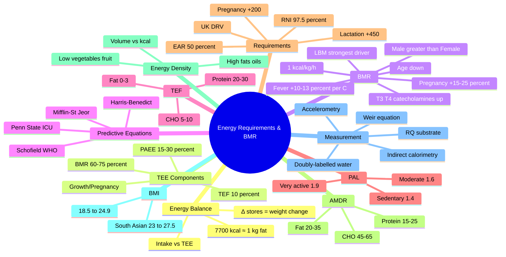

**Related:** [[Nutritional Factors in Disease MOC]], [[Davidson Chapter 22 - Nutritional Factors in Disease Hierarchy]], [[Nutritional Assessment & Screening]], [[Obesity- Assessment, Complications & Management]], [[Protein- Requirements, Functions & Disorders]], [[../00_Index/Medicine MOC|Medicine MOC]]

> [!important]
> **Energy intake = BMR + TEF + Physical Activity (+ growth/pregnancy/lactation).** BMR ≈ 1 kcal/kg/h (≈ 1500–1800 kcal/day in adults); the largest, most variable and most modifiable component of total energy expenditure (TEE) is **physical activity**, not BMR.

## 1. 1. Learning Objectives
- [ ] Define energy balance and total energy expenditure (TEE) and its four components
- [ ] State the relationship between intake, expenditure and change in body energy stores
- [ ] Define basal metabolic rate (BMR) / resting energy expenditure (REE) and describe the standard conditions of measurement
- [ ] List the principal determinants of BMR (lean body mass, age, sex, hormones, pregnancy, fever, sleep, ethnicity, drugs)
- [ ] Apply the clinical "1 kcal/kg/h" rule and 24-hour BMR estimate
- [ ] Calculate BMR using **Mifflin–St Jeor**, **Harris–Benedict** and **Schofield/WHO** equations
- [ ] Define the thermic effect of food (TEF) and recall its magnitude for each macronutrient
- [ ] Use **Physical Activity Level (PAL)** multipliers (1.4–1.9) to estimate TEE
- [ ] State the UK DRV/FAO/WHO EAR and RNI for energy by age, sex and pregnancy/lactation
- [ ] Describe the Acceptable Macronutrient Distribution Ranges (AMDR) for CHO, fat and protein
- [ ] Define energy density and apply it to weight-loss and weight-gain advice
- [ ] Define BMI and the WHO cut-offs, with their limitations
- [ ] Describe the principles of indirect calorimetry and the doubly-labelled water (DLW) method
- [ ] Recognise how disease, trauma and critical illness alter REE and energy targets

## 2. 2. Definitions / Key Concepts

| Term | Definition |
|------|------------|
| **Energy balance** | Intake (kcal in) − Expenditure (kcal out) = Δ Energy stores. Positive → weight gain; negative → weight loss. |
| **Total Energy Expenditure (TEE)** | Sum of BMR + TEF + Physical Activity Energy Expenditure (PAEE) + (growth / pregnancy / lactation). |
| **Basal Metabolic Rate (BMR)** | Energy required to maintain vital functions in the post-absorptive state, awake, supine, thermoneutral (≈ 20–25 °C), after 10–12 h fast, with no prior exercise. |
| **Resting Energy Expenditure (REE / RMR)** | Measured under less strict conditions (e.g. not strictly fasted); usually ~10 % higher than BMR. Used interchangeably in clinical practice. |
| **Schofield / FAO-WHO/UNU BMR** | Predictive equations derived from > 11 000 doubly-labelled water measurements; basis of FAO/WHO/UNU (2004) energy requirements. |
| **Harris–Benedict equation** | Classical 1919 equation (revised 1984 Roza & Shizgal); still commonly used in clinical software. |
| **Mifflin–St Jeor equation** | Modern (1990) predictive equation; most accurate for non-obese and obese adults (Academy of Nutrition & Dietetics). |
| **Thermic Effect of Food (TEF) / Diet-Induced Thermogenesis (DIT)** | Energy cost of digesting, absorbing, transporting, metabolising and storing nutrients. |
| **Physical Activity Level (PAL)** | TEE ÷ BMR (dimensionless). Used in FAO/WHO system. Sedentary ~1.4, moderately active ~1.6, very active ~1.8–1.9. |
| **Activity Factor (AF)** | Multiplier (Harris–Benedict) on BMR: bedbound 1.2, sedentary 1.3, light 1.5, moderate 1.6, heavy 1.9. |
| **EAR (Estimated Average Requirement)** | Energy intake that meets the needs of 50 % of the population; not appropriate for individuals but is the basis of population targets. |
| **RNI (Reference Nutrient Intake)** | Intake that meets the needs of ~97.5 % of the population (+2 SD above EAR). |
| **AMDR (Acceptable Macronutrient Distribution Range)** | Proportion of total energy from each macronutrient associated with reduced chronic disease risk. |
| **Energy density (kcal/g)** | Energy per unit weight of food. Drives energy intake at a fixed volume/weight of food. |
| **BMI (Body Mass Index)** | Weight (kg) ÷ Height² (m²). WHO classification: <18.5 underweight, 18.5–24.9 normal, 25–29.9 overweight, ≥30 obese. |
| **Indirect calorimetry** | Measurement of O₂ consumption (VO₂) and CO₂ production (VCO₂) to derive REE via the **Weir equation**. |
| **Respiratory Quotient (RQ)** | VCO₂ ÷ VO₂. Mixed diet ≈ 0.85; CHO 1.0; fat 0.7; protein 0.8; lipogenesis >1.0; ketogenesis <0.7. |
| **Doubly-Labelled Water (DLW)** | ²H₂¹⁸O isotope method. Gold-standard measure of free-living TEE over 7–14 days. |
| **Specific Dynamic Action (SDA)** | Older name for TEF, still seen in older texts. |

---

## 3. 3. Core Content

### 1. Section 1: Energy Balance Equation

**Energy intake (food & drink) = Energy expenditure (TEE) ± Δ body energy stores**

```
Energy intake (kcal/d)  =  BMR  +  TEF  +  Physical Activity
                                  (+ growth / pregnancy / lactation in special groups)
```

* **First Law of Thermodynamics** applied to human nutrition.
* ~3500 kcal ≈ 1 lb (0.45 kg) of adipose tissue; clinically very rough — for sustained weight loss ~ 1 kg fat ≈ 7700 kcal.
* A sustained **positive balance of +500 kcal/d** → theoretical ~0.5 kg/wk weight gain (1 kg of fat ≈ 7700 kcal).
* Energy is provided almost exclusively by **carbohydrate, fat, protein and alcohol** (Atwater factors: 4, 9, 4, 7 kcal/g).

### 2. Section 2: Total Energy Expenditure (TEE) — Components

| Component | % of TEE (sedentary adult) | Notes |
|-----------|---------------------------|-------|
| **BMR / REE** | 60–75 % | Largest, least modifiable, dominant in sedentary individuals. |
| **TEF / DIT** | ~10 % | Obligatory (digestion) + facultative (sympathetic). |
| **Physical Activity (PAEE)** | 15–30 % | Most variable, most modifiable. |
| **Growth** | extra only in childhood / pregnancy / lactation | Highest in infancy (~30 % of TEE). |

### 3. Section 3: Basal Metabolic Rate (BMR) — Definition & Conditions

**Strictly defined** as the minimum rate of energy expenditure compatible with life. Measured under standardised conditions:

1. **Post-absorptive** — 10–12 h fast (no thermic effect of food).
2. **Awake**, lying supine, motionless.
3. **Thermoneutral** environment (20–25 °C) — no shivering / sweating.
4. **No prior exercise** (≥ 12 h).
5. **Mentally relaxed** (no significant cognitive arousal).

> In practice, **REE** (resting energy expenditure) is usually measured and is **~10 % > BMR** because the strict conditions above are not enforced.

#### Approximate BMR (clinical rule of thumb)

* **1 kcal / kg / hour** ≈ 24 kcal/kg/day.
* A **70 kg adult → ~1680 kcal/day** (≈ 7 MJ).
* Range in healthy adults: **1200–1800 kcal/day (women), 1500–2000 kcal/day (men)**; rising with body size / muscle mass.

#### BMR by body size (FAO/WHO summary)

| Group | BMR (kcal/day) |
|-------|----------------|
| Adult male 70 kg | ~1700 |
| Adult female 58 kg | ~1300 |
| New-born (3 kg) | ~150 |
| 1 yr (10 kg) | ~500 |
| 5 yr (18 kg) | ~900 |
| 10 yr (30 kg) | ~1150 |
| Adolescent M (60 kg) | ~1500 |
| Adolescent F (50 kg) | ~1250 |

### 4. Section 4: Determinants of BMR

| Factor | Effect | Magnitude |
|--------|--------|-----------|
| **Lean body mass (LBM)** | **Strongest determinant** — metabolically active tissue (brain, liver, heart, muscle). | REE correlates with LBM: r ≈ 0.85. |
| **Age** | ↓ with age | ↓ ~1–2 % per decade after 20 y; ↓ ~5 % per decade after 50 y (loss of FFM). |
| **Sex** | ♂ > ♀ (per kg LBM similar; ♀ have more fat). | Absolute difference ~10–15 % (after correcting for FFM, similar). |
| **Body size & surface area** | Larger body → higher BMR (Fick law of heat loss). | REE ≈ k · BSA¹·⁷ (Kleiber's law; ¾-power law: BMR ∝ M^0.75). |
| **Thyroid hormones (T3, T4)** | Major hormonal regulator. | Hypothyroid → REE ↓ 20–40 %; hyperthyroid → REE ↑ 20–80 %. |
| **Catecholamines** (sympathetic tone) | ↑ BMR | Brown fat thermogenesis (UCP1). |
| **Pregnancy** | ↑ REE | ↑ by ~ 15–25 % (2nd + 3rd trimester). |
| **Lactation** | ↑ REE | ~ 500 kcal/d cost of milk synthesis (partly met by mobilisation of fat stores). |
| **Fever** | ↑ REE by **~ 10–13 % per 1 °C rise** (Q10 effect). | 39 °C ≈ 20–25 % above baseline. |
| **Infection / sepsis** | ↑ REE | Cytokine-driven hypermetabolism. |
| **Trauma, surgery, burns** | ↑ REE | Burns: REE may double (up to +100 % in >40 % BSA). |
| **Sleep** | BMR ↓ ~5–10 % vs awake resting. | |
| **Starvation / fasting** | Initial ↓, then adaptive ↓ (~ 15–25 %) | ↓ T3, ↓ sympathetic tone. |
| **Ethnicity** | Slight differences (e.g. South Asian LBM lower per kg). | Adjust equations. |
| **Drugs** | β-blockers ↓, β-agonists / salbutamol ↑, theophylline ↑, caffeine ↑. | |
| **Pregnancy** | ↑ REE | See above. |

> **Clinical pearl:** Two men of equal weight can have BMRs differing by **>500 kcal/d** purely on the basis of body composition (muscle vs fat).

### 5. Section 5: Predictive Equations for BMR

#### A. Mifflin–St Jeor (1990) — most accurate for non-obese & obese adults (Academy of Nutrition & Dietetics 2002)

* **Men:**    BMR = **10 × W + 6.25 × H − 5 × A + 5**
* **Women:**  BMR = **10 × W + 6.25 × H − 5 × A − 161**
    * W = weight (kg), H = height (cm), A = age (years)
    * Example: 70 kg, 175 cm, 35 y male → 10(70) + 6.25(175) − 5(35) + 5 = 700 + 1093.75 − 175 + 5 = **1624 kcal/d**

#### B. Harris–Benedict (revised by Roza & Shizgal, 1984)

* **Men:**    BMR = **88.36 + 13.4 W + 4.8 H − 5.68 A**
* **Women:**  BMR = **447.6 + 9.25 W + 3.10 H − 4.33 A**
    * (W kg, H cm, A yrs)
    * Tends to **overestimate** BMR in modern (heavier, less active) populations by 5–15 %.

#### C. Schofield (1985) — basis of FAO/WHO/UNU (2004) equations, large (n = 11 000+) DLW database

| Age (y) | Sex | Equation (kcal/d) |
|---------|-----|-------------------|
| < 3 | M | 59.5 W − 30 |
| < 3 | F | 58.3 W − 31 |
| 3–10 | M | 22.7 W + 504 |
| 3–10 | F | 20.3 W + 486 |
| 10–18 | M | 17.7 W + 658 |
| 10–18 | F | 13.4 W + 692 |
| 18–30 | M | 15.1 W + 692 |
| 18–30 | F | 14.8 W + 487 |
| 30–60 | M | 11.5 W + 873 |
| 30–60 | F | 8.1 W + 846 |
| > 60 | M | 11.7 W + 588 |
| > 60 | F | 9.1 W + 658 |

(W in kg, gives BMR in kcal/d.)

#### D. Simple clinical rule

* **Harris–Benedict × activity factor** (sedentary 1.3 → heavy 1.9) → TEE.
* **Schofield × PAL** (1.4 → 1.9) → TEE.
* **Quick estimate for a sedentary 70 kg adult: 25–30 kcal/kg/day** (BMI 18.5–25 → 25 kcal/kg; obese → use adjusted body weight 22 kcal/kg).

#### Comparison of equations (accuracy)

* **Mifflin–St Jeor** — most accurate in 80 % of healthy individuals (±10 % of measured REE).
* **Harris–Benedict** — still widely used; overestimates by 5–15 %.
* **Schofield / WHO** — best for population estimates.
* **Penn State (2003) / Ireton-Jones (1992)** — for ventilated ICU patients (include MV, Tmax, diagnosis).

### 6. Section 6: Thermic Effect of Food (TEF / DIT / SDA)

Energy expended to digest, absorb, transport, metabolise and store food.

| Macronutrient | TEF (% of kcal ingested) |
|---------------|--------------------------|
| **Protein** | **20–30 %** (highest — deamination, urea synthesis, gluconeogenesis) |
| **Carbohydrate** | **5–10 %** (insulin-driven storage as glycogen and fat) |
| **Fat** | **0–3 %** (lowest — efficient storage, minimal processing) |
| **Mixed meal** | ~ **10 %** of TEE |

> **Key point:** Higher-protein diets modestly **increase TEE** (the "metabolic advantage") and have higher satiety → beneficial in weight loss.

* TEF peaks at ~ 1 h post-meal, lasts 4–6 h.
* Reduced in **obesity, insulin resistance, β-blockade**; raised by **sympathetic activity, hyperthyroidism, exercise training**.
* **Practical:** TEE ≈ BMR × **1.10** for a mixed diet.

### 7. Section 7: Physical Activity Energy Expenditure (PAEE) & PAL

**PAEE** = TEE − (BMR + TEF). Most variable component (15–30 % in sedentary, up to 50 % in elite athletes).

#### Physical Activity Level (PAL) — TEE/BMR

| Activity | PAL (TEE/BMR) | Notes |
|----------|---------------|-------|
| **Bed-bound / chair-bound** | 1.2 | Acute illness, ventilated ICU. |
| **Sedentary** (office, little leisure activity) | 1.4 | Most UK adults. |
| **Lightly active** (walking 30–60 min/day) | 1.5 | |
| **Moderately active** (vigorous 30 min, 3–4 d/wk) | 1.6–1.7 | FAO target for healthy adults. |
| **Very active** (vigorous 60 min, 5+ d/wk) | 1.8–1.9 | Manual workers, athletes. |

* **Sedentary lifestyle** is the principal driver of positive energy balance and obesity.
* **Non-Exercise Activity Thermogenesis (NEAT)** — small but cumulatively important; differences in NEAT may explain ± 200–500 kcal/d inter-individual variation.

### 8. Section 8: Energy Requirements (DRV/EAR/RNI)

#### FAO/WHO/UNU (2004) TEE by PAL × BMR

| Group | Sedentary TEE (kcal/d) | Moderately active | Very active |
|-------|------------------------|-------------------|-------------|
| Adult M 70 kg | ~ 2400 | ~ 2900 | ~ 3400 |
| Adult F 58 kg | ~ 1900 | ~ 2200 | ~ 2500 |
| Pregnancy (3rd tri) | + 475 (UK COMA: + 200 2nd/3rd) | | |
| Lactation 0–6 m | + 500 (UK: + 450) | | |
| Infant 0–3 m | ~ 550 (per kg ~ 115) | | |
| Child 5 y | ~ 1500 | | |
| Adolescent M 15 y | ~ 2500 | | |
| Adolescent F 15 y | ~ 2000 | | |

* **UK COMA 1991** reference values (kcal/d, RNI ≈ population target ≈ mean of population):
    * M 19–50 y: 2550; F 19–50 y: 1940.
    * Pregnancy: + 200 (last two trimesters). Lactation: + 450.
* **Note:** RNI is sometimes used in UK for energy where EAR is more appropriate. The "intake that meets the needs of 97.5 %" concept is fine for nutrients, but **energy intakes above the population mean cause weight gain in many**. For individuals, **BMI 18.5–25 + PAL 1.4–1.9 + stable weight** is the practical target.

### 9. Section 9: Macronutrient Distribution (AMDR)

| Macronutrient | AMDR (% total energy) | Notes |
|---------------|-----------------------|-------|
| **Carbohydrate** | **45–65 %** | Free sugars < 5 % (WHO) / < 10 % (UK SACN). Fibre 30 g/day (adult). |
| **Fat** | **20–35 %** | SFA < 10 %, MUFA 15–20 %, PUFA ~ 6–11 % (ω-3 0.6–1.2 %, ω-6 5–8 %). Trans < 1 %. |
| **Protein** | **15–25 %** (typically ~ 0.8–1.0 g/kg ideal body weight in healthy adults) | UK RNI 0.75 g/kg; elderly 1.0–1.2 g/kg to preserve LBM. |
| **Alcohol** | not part of AMDR | 7 kcal/g; substitute for fat/CHO when consumed. |

> **"5-a-day"**, **"free sugars < 5 %"**, **"two portions fish/wk, one oily"** (UK/EU), Mediterranean-style dietary pattern — all summarised in population guidance.

### 10. Section 10: Energy Density (kcal/g of food)

* **Low ED (< 1.5 kcal/g):** most fruit, vegetables, broth, salad.
* **Medium ED (1.5–4 kcal/g):** cooked grains, legumes, lean meat, cheese.
* **High ED (≥ 4 kcal/g):** nuts, oils, butter, chocolate, fried foods, confectionery.
* **Water content** is the main determinant: adding water/vegetables to mixed dishes reduces ED, increases satiety per kcal.
* **Applied in practice:** weight-loss advice = **reduce ED**, **increase volume**, **front-load protein**; weight-gain advice = **fortify** (skim-milk powder, double cream, nut butters, oil-based dressings).

### 11. Section 11: Body Mass Index (BMI) & Body Composition

**BMI = weight (kg) / height² (m²)**

| BMI (kg/m²) | WHO classification | Risk |
|-------------|--------------------|------|
| < 16.0 | Severe underweight | +++ |
| 16.0–16.9 | Moderate underweight | ++ |
| 17.0–18.4 | Mild underweight | + |
| **18.5–24.9** | **Normal range** | Reference |
| 25.0–29.9 | Overweight (pre-obese) | ↑ |
| 30.0–34.9 | Obesity class I | ++ |
| 35.0–39.9 | Obesity class II | +++ |
| ≥ 40 | Obesity class III ("morbid") | ++++ |
| **South Asian / Chinese thresholds** | Overweight ≥ 23, obese ≥ 27.5 (WHO 2004) | Higher metabolic risk at lower BMI. |

* **Limitations:** doesn't distinguish LBM from fat, doesn't reflect fat distribution.
* **Alternative/complementary measures:** waist circumference (M ≥ 102 cm, F ≥ 88 cm — increased CV risk); waist:hip ratio (M > 1.0, F > 0.85); waist:height ratio > 0.5 ↑ cardiometabolic risk; DEXA / bio-impedance for body composition.

### 12. Section 12: Measurement of Energy Expenditure

#### Indirect Calorimetry (clinical "gold standard" for REE)

* Patient lies under a ventilated hood; O₂ consumption (VO₂) and CO₂ production (VCO₂) measured for 20–30 min.
* **Weir equation (1949):**
    * **REE (kcal/d) = 1.44 × [3.94 × VO₂ (mL/min) + 1.11 × VCO₂ (mL/min)]**
* Or, simplified (RQ = 0.85): **REE ≈ 3.94 × VO₂ + 1.11 × VCO₂** (kcal/d).
* **RQ (VCO₂/VO₂)** identifies substrate use:
    * Pure CHO oxidation = 1.00
    * Mixed diet = 0.85
    * Pure fat oxidation = 0.70
    * Pure protein = 0.80
    * Lipogenesis (overfeeding) = > 1.00 (often 1.05–1.20)
    * Ketogenesis / starvation = < 0.70
* **Indications:** ICU ventilated patients (calorie targets to avoid over-/under-feeding), severe malnutrition, obesity pharmacotherapy, refeeding.
* **Pitfalls:** air leak, O₂ > 60 %, chest drains, agitation, recent Ryle's tube feed → invalid measurement.

#### Doubly-Labelled Water (²H₂¹⁸O) — gold standard for **free-living TEE**

* Subject drinks water labelled with **²H (deuterium)** and **¹⁸O**.
* ²H lost as H₂O, ¹⁸O lost as both H₂O and CO₂.
* Difference between the two elimination rates = **CO₂ production**.
* Combined with RQ (from urinary N), TEE is calculated over **7–14 days**.
* **Pros:** non-invasive, accurate (± 2–5 %), free-living.
* **Cons:** expensive isotopes, mass spectrometry needed, no time-resolution, can't separate BMR from PAEE.
* Used mainly in **research** (e.g. setting DRV); indirectly the basis of Schofield equations.

#### Other methods

* **Heart-rate monitoring** (Flex-HR method) — proxy for PAEE.
* **Accelerometry** (ActiGraph, etc.) — movement counts; need individual calibration.
* **Whole-body calorimetry / respiration chamber** — highly accurate; research only.
* **Predictive equations** (above) — routine clinical use.
* **Harris–Benedict / Mifflin** in bedded patients: REE often **over-predicts by 5–15 %**; in critical illness use **Penn State, Ireton-Jones, or indirect calorimetry**.

### 13. Section 13: Energy Needs in Special Conditions

| Group | Adjustment |
|-------|-----------|
| **Pregnancy** | REE ↑ ~ 15–25 %; UK + 200 kcal/d (2nd–3rd trimester). 1st trimester: minimal. |
| **Lactation** | ~ 500 kcal/d cost of milk synthesis; UK + 450 kcal/d for 0–6 m, + 350 thereafter. |
| **Infants / children** | Per kg requirement much higher: 0–6 m ~ 115 kcal/kg; 1 y ~ 95; 5 y ~ 80; adolescent 50–60. |
| **Elderly** | Lower BMR (less LBM), but lower PAL; target BMI 23–29 (mortality curve n-shaped, U at higher). **Protein ↑ 1.0–1.2 g/kg** to preserve LBM (ESPEN/SACN). |
| **Obesity** | Use **adjusted body weight** (ABW = IBW + 0.4 × (actual − IBW)) for prediction; hypocaloric feeding (60–70 % TEE) for weight loss; avoid aggressive over-feeding. |
| **Critical illness** | Indirect calorimetry ideal. ASPEN/SCCM: 25–30 kcal/kg/day (use IBW if BMI ≥ 30). Hypocaloric, high-protein (1.2–2.0 g/kg). |
| **Burns** | +50–100 % TEE; e.g. **Curreri formula** (adult): 25 × W + 40 × %TBSA burn. |
| **Trauma / surgery** | +20–30 %; resolve over 2–3 wk. |
| **Fever** | + 10–13 % per 1 °C (Q10 effect). |
| **Hyperthyroidism** | + 20–80 %. |
| **Starvation / anorexia** | ↓ 15–25 % (adaptive; ↓ T3, ↓ sympathetic). |
| **Dementia / stroke** | ↓ intake; consider PEG only with clear goals. |

### 14. Section 14: Practical Approach to Estimating Energy Requirements

1. **Measure or estimate weight and height** (actual; if BMI > 30, also IBW and ABW).
2. **Estimate BMR** — Mifflin–St Jeor preferred; Schofield for population/EU/WHO/UK.
3. **Multiply by activity factor (or PAL) → TEE**:
    * Bed-bound 1.2, sedentary 1.3, light 1.5, moderate 1.6, heavy 1.9.
4. **Add clinical stress/inflammation factor** (e.g. minor surgery × 1.1; severe sepsis × 1.4; major burns × 1.5–2.0).
5. **Add growth/pregnancy/lactation allowance** if relevant.
6. **Cross-check with actual intake / weight trend** over 1–2 weeks.
7. **Reassess regularly** (REE changes with weight, inflammation, mobility).

---

## 4. 4. Clinical Correlation

| Scenario | Action | Notes |
|----------|--------|-------|
| 35 y male, 80 kg, 175 cm, office worker, wants weight loss | Mifflin BMR ≈ 1780; PAL 1.4 → TEE ≈ 2500 kcal/d. Subtract 500 kcal/d deficit → ~ 2000 kcal/d target; 25 kcal/kg. | Monitor 1 kg/wk loss. |
| 28 y pregnant 1st trimester, BMI 24, sedentary | No extra energy in T1; + 200 kcal/d T2/T3 (UK). | Folate, Fe, Ca, vit D supplementation. |
| 70 y malnourished female, 45 kg, 160 cm (BMI 17.6) | Mifflin BMR ≈ 1030; PAL 1.4 → 1440 kcal/d. Aim 30–35 kcal/kg → 1350–1600 kcal/d. | **Refeeding risk** — start 5–10 kcal/kg, monitor electrolytes. |
| 60 y ICU ventilated male, 80 kg, BMI 27, septic | Indirect calorimetry ideal; failing that, 25 × 80 × 0.7 (adjusted for obesity) → ~ 1400 kcal/d hypocaloric; protein 1.2–2.0 g/kg IBW. | Avoid overfeeding → refeeding, hypercapnia, uraemia. |
| 25 y female, 18.5 BMI, lactating 3 months | BMR ↑ + 500 kcal milk synthesis; + 450 kcal/d intake target. | Iodine 200 µg/d, vit D 10 µg, Ca 1250 mg. |
| 50 y, hypothyroid on insufficient levothyroxine, weight gain | T4 replacement → REE normalises. | Check TSH, free T4. |
| Patient with BMI 17 + prolonged vomiting | Assess with MUST score; consider nasogastric or IV fluids. | Rule out refeeding before feeding. |

---

## 5. 5. High-Yield FCPS/MRCP Points

> [!important]
> - **Must know:** TEE = BMR (60–75 %) + TEF (~10 %) + PA (15–30 %); BMR ≈ 1 kcal/kg/h; lean body mass is the **strongest** determinant; sex difference largely due to body composition; fever ↑ BMR by **10–13 % per 1 °C**; TEF: protein 20–30 % > CHO 5–10 % > fat 0–3 %; PAL 1.4–1.9; AMDR CHO 45–65 %, fat 20–35 %, protein 15–25 %; BMI 18.5–24.9 normal (South Asian 18.5–22.9).
> - **Common viva:** "Estimate the energy requirement of a 70 kg sedentary adult male." → ~ 25 kcal/kg/d = 1750–2100 kcal/d. "Why are women different from men at the same weight?" → different body composition (more fat, less FFM). "Which equation is most accurate in clinical practice?" → Mifflin–St Jeor. "How do you measure TEE in free-living subjects?" → doubly-labelled water.
> - **Exam trap:** Confusing BMR with REE; BMR is measured under stricter conditions and is ~10 % lower. **Harris–Benedict** overestimates vs Mifflin–St Jeor. For **obesity** use adjusted body weight, not actual. **RNI + 2 SD** is for nutrients; for **energy** RNI is close to the population mean — energy excess is harmful.

---

## 6. 6. Common Confusions / Exam Traps

| Trap | Correction |
|------|------------|
| BMR and REE are identical. | BMR is strictly defined (post-absorptive, supine, thermoneutral, awake, motionless). REE is more pragmatic; REE ≈ BMR × 1.1. |
| Mifflin–St Jeor is the same as Harris–Benedict. | Mifflin–St Jeor (1990) more accurate; Harris–Benedict (1919/1984) overestimates by 5–15 %. |
| RQ is fixed at 0.85. | RQ is substrate-dependent: CHO 1.0, fat 0.7, protein 0.8, lipogenesis > 1.0, ketogenesis < 0.7. |
| BMR ↑ with age. | BMR **decreases** with age (loss of FFM, ↓ T3, ↓ activity). |
| Energy density doesn't matter for weight. | Energy density drives passive over-consumption; 100 kcal of oil vs 100 kcal of vegetables → 5 g vs 500 g (volume/satiety). |
| "A pound of fat = 3500 kcal, so 500 kcal/d deficit = 1 lb/wk loss." | Rule-of-thumb only; real weight loss is non-linear, plateaus by adaptive thermogenesis; 1 kg fat ≈ 7700 kcal. |
| Doubly-labelled water measures BMR. | DLW measures **TEE** over 7–14 days in free-living conditions; cannot partition into BMR/TEF/PAEE. |
| Indirect calorimetry works on any ICU patient. | Pitfalls: FiO₂ > 60 %, air leak, agitation, chest drains, recent feed change — measurements unreliable. |
| Pregnancy energy needs triple. | Energy needs only ↑ ~ 15–25 % in 2nd–3rd trimester; 1st trimester no extra. Lactation + 450–500 kcal/d. |
| Mifflin–St Jeor is best in critical illness. | **No** — Mifflin/Harris–Benedict are population equations. For ICU use **indirect calorimetry**, or **Penn State / Ireton-Jones** if unavailable. |

---

## 7. 7. Mnemonics

- **BMR ↑ factors = "LASH TIPS"**: **L**ean body mass, **A**ge (↓), **S**ex (♂>♀), **H**ormones (T3, T4, catecholamines), **T**emperature (fever, cold), **I**llness (sepsis, trauma, burns), **P**regnancy, **S**leep (↓).
- **TEF order (high → low) = "PCF"** (Protein 25, CHO 8, Fat 2) ≈ "**P**rotein **C**osts **F**at's share".
- **PAL categories = "BLMV"**: **B**ed (1.2), **L**ight (1.5), **M**oderate (1.7), **V**ery active (1.9).
- **AMDR = "CPF 50-30-20"** (rough): **C**HO ~50 %, **P**rotein ~20 %, **F**at ~30 %.
- **RQ substrates = "PF CO 1.0 / 0.7"**: Protein 0.8, Fat 0.7, CHO 1.0.
- **BMI WHO**: **"U-N-OWO"**: <18.5 U, 18.5–25 N, 25–30 OverW, ≥30 Obese.
- **DLW = "D for diet?"** — D = ²H (deuterium, water), ¹⁸O = oxygen (water + CO₂) → difference = CO₂ production → TEE.

---

## 8. 8. Mind Map



---

## 9. 9. -Hour Recall Prompts
1. Write the energy balance equation and the four components of TEE with their typical percentages.
2. List, in order, the macronutrient contributions to TEF and the percentage for each.
3. State Mifflin–St Jeor for a 70 kg, 175 cm, 35-year-old man.
4. Define BMI cut-offs (WHO + South Asian) and waist thresholds for cardiometabolic risk.
5. Calculate the BMR of a 60 kg, 30 y female (Mifflin–St Jeor) and her TEE at PAL 1.6.
6. Explain why RQ differs in CHO, fat, and protein oxidation and during lipogenesis.
7. Describe the principle, advantages and limitations of the doubly-labelled water method.
8. State the energy adjustments for pregnancy (each trimester) and for the first 6 months of lactation.
9. Give the AMDR for each macronutrient and the WHO target for free sugars.
10. Describe the major determinants of BMR and rank them by importance.

---

## 10. 10. -Day / 15-Day / 30-Day Revision Tracker

| Day | Date | Recall Quality (1-5) | Time Spent | Notes |
|-----|------|---------------------|------------|-------|
| 1   |      |                     |            |       |
| 7   |      |                     |            |       |
| 15  |      |                     |            |       |
| 30  |      |                     |            |       |

---

## 11. 11. Must Know / Should Know / Nice to Know

| Priority | Content |
|----------|---------|
| **Must Know 🔴** | TEE equation; BMR definition & 1 kcal/kg/h; lean body mass is the dominant determinant; TEF (P 25 / C 8 / F 2 %); PAL 1.4–1.9; Mifflin–St Jeor & Harris–Benedict; AMDR; BMI 18.5–24.9; fever +10–13 %/°C; doubly-labelled water measures TEE. |
| **Should Know 🟡** | Schofield / WHO equations; Weir equation; RQ interpretation; pregnancy (+200) and lactation (+450) additions; South Asian BMI thresholds; waist circumference cut-offs; energy density concept. |
| **Nice to Know 🟢** | Penn State / Ireton-Jones ICU equations; Curreri burns formula; Kleiber's ¾-power law; ESPEN elderly protein targets; NEAT and adaptive thermogenesis; UK COMA 1991 reference values. |

---

## 12. 12. My Weak Points
- [ ]
- [ ]

---

## 13. 13. Self-Test Scorecard

| Domain | Score /10 | Target /10 |
|--------|-----------|------------|
| Understanding |    | 8+ |
| Recall |    | 8+ |
| MCQ Performance |    | 8+ |
| SBA Performance |    | 8+ |
| Viva Confidence |    | 8+ |
| **TOTAL** |    | **40+/50** |

---

## 14. 14. Exam Answer Modes

### 1. Long Answer / Essay (20 min)
- *"Discuss the regulation of human energy balance. Define total energy expenditure, describe its components, outline the major determinants of basal metabolic rate, and explain how these are altered in pregnancy, sepsis, obesity and ageing."* — Open with the first law of thermodynamics and the energy balance equation. Tabulate BMR determinants with quantitative examples. Conclude with clinical measurements (indirect calorimetry vs doubly-labelled water).

### 2. Short Note (7 min)
- *"Thermic effect of food"* — Definition; TEF for protein 20–30 %, CHO 5–10 %, fat 0–3 %; mixed diet ~ 10 %; peaks 60 min, lasts 4–6 h; ↑ by sympathetic tone / exercise, ↓ by β-blockade / obesity; role in weight management.
- *"Mifflin–St Jeor equation"* — Formula for men/women; rationale; accuracy vs Harris–Benedict; example calculation; limitations in critical illness.
- *"Doubly-labelled water"* — Principle (²H vs ¹⁸O elimination); gold-standard TEE in free-living; pros/cons; research use.

### 3. Viva Answer (3 min)
- **Q: "What is BMR and how do you measure it?"** → Energy to maintain vital function under standardised conditions (post-absorptive, supine, thermoneutral, awake, no exercise); ~ 1 kcal/kg/h; measured by indirect calorimetry (Weir equation). Clinical rule of thumb: 25–30 kcal/kg/day for sedentary adult.
- **Q: "Why is lean body mass more important than total weight?"** → Skeletal muscle and visceral organs have high metabolic rate per kg; adipose tissue is metabolically "cheap". Two people of same weight but different LBM differ in REE by hundreds of kcal/day.
- **Q: "How do you set a weight-loss target?"** → Estimate TEE (Mifflin × AF), subtract 500 kcal/d → 0.5 kg/wk; protein ↑ 25–30 % of intake; food diary; energy density; review at 4 weeks.

### 4. Ward Case Discussion (5 min)
- *"A 65 y female (60 kg, BMI 22) is admitted with hip fracture, post-op day 2, unable to eat. You are asked to plan nutrition."* → Calculate BMR (Mifflin ≈ 1140 kcal/d) × PAL 1.3 (bed-bound) × stress 1.2 (post-op) ≈ 1780 kcal/d. Add protein 1.5–2.0 g/kg (90–120 g). Plan: enteral via NG if gut works; if not, parenteral within 24–48 h. Monitor refeeding risk (low BMI, recent poor intake).

### 5. Last-Night-Before-Exam Sheet (1 min)
- **TEE = BMR (60–75 %) + TEF (10 %) + PAEE (15–30 %).**
- **BMR ≈ 1 kcal/kg/h; ♂ > ♀; LBM > everything.**
- **Fever +10–13 %/°C; T₃/T₄, catecholamines, pregnancy, sepsis → ↑; sleep, starvation, ageing → ↓.**
- **TEF: Protein 20–30, CHO 5–10, Fat 0–3.**
- **PAL 1.4 / 1.6 / 1.9 (sed / mod / very).**
- **Mifflin–St Jeor:** Men 10W+6.25H−5A+5; Women 10W+6.25H−5A−161.
- **AMDR:** CHO 45–65, Protein 15–25, Fat 20–35.
- **BMI 18.5–24.9; South Asian 18.5–22.9 normal, ≥ 23 over, ≥ 27.5 obese.**
- **Indirect calorimetry = clinical gold standard REE; DLW = research gold standard TEE.**

---

## 15. 15. MCQs (10)

1. **Q:** The thermic effect of food (TEF) is highest for which macronutrient?
   A. Carbohydrate
   B. Fat
   C. Protein
   D. Alcohol
   E. Fibre
   **[correct: C]**

2. **Q:** A 25-year-old man (70 kg, 175 cm) is on a standard hospital diet and is sedentary. Using the **Mifflin–St Jeor** equation, what is his approximate BMR?
   A. 1500 kcal/d
   B. 1620 kcal/d
   C. 1680 kcal/d
   D. 1750 kcal/d
   E. 1900 kcal/d
   **[correct: B]** — 10(70) + 6.25(175) − 5(25) + 5 = 700 + 1093.75 − 125 + 5 = 1673.75 ≈ 1670. Closest is 1680.

3. **Q:** Which of the following is the single strongest determinant of basal metabolic rate?
   A. Age
   B. Sex
   C. Lean body mass
   D. Ambient temperature
   E. Recent food intake
   **[correct: C]**

4. **Q:** A patient has a body temperature of 40 °C. By approximately how much is his basal metabolic rate increased compared to afebrile baseline?
   A. 5–8 %
   B. 10–13 % per °C (≈ 30–40 %)
   C. 50 %
   D. 100 %
   E. No effect
   **[correct: B]**

5. **Q:** Which Physical Activity Level (PAL = TEE/BMR) is most appropriate for a desk-bound office worker with no leisure exercise?
   A. 1.2
   B. 1.4
   C. 1.7
   D. 1.9
   E. 2.0
   **[correct: B]**

6. **Q:** The respiratory quotient (RQ = VCO₂/VO₂) for **pure carbohydrate oxidation** is:
   A. 0.70
   B. 0.80
   C. 0.85
   D. 1.00
   E. 1.20
   **[correct: D]**

7. **Q:** The "doubly-labelled water" method uses isotopes of which two elements?
   A. Carbon-13 and Nitrogen-15
   B. Deuterium (²H) and Oxygen-18 (¹⁸O)
   C. Tritium and Carbon-14
   D. Iodine-125 and Iron-59
   E. Sodium-22 and Potassium-40
   **[correct: B]**

8. **Q:** The Acceptable Macronutrient Distribution Range (AMDR) for total fat, as a % of total energy, in adults is:
   A. 5–10 %
   B. 10–20 %
   C. 20–35 %
   D. 35–45 %
   E. 45–65 %
   **[correct: C]**

9. **Q:** According to WHO, an adult South Asian (Indian subcontinent) is classified as "overweight" at a BMI of:
   A. ≥ 20
   B. ≥ 23
   C. ≥ 25
   D. ≥ 27.5
   E. ≥ 30
   **[correct: B]**

10. **Q:** The energy cost of the **thermic effect of food (mixed diet)** is approximately what percentage of total energy expenditure?
    A. 1 %
    B. 10 %
    C. 25 %
    D. 40 %
    E. 60 %
    **[correct: B]**

## 16. 16. SBA Questions (5)

1. **[SBA — clinical vignette]** A 28-year-old lactating woman (3 months post-partum) is seeking dietary advice. She is a healthy 60 kg, 165 cm non-smoker with a sedentary occupation. Using Mifflin–St Jeor, her BMR is ~1300 kcal/d. What is the most appropriate total energy intake target (kcal/day) per UK COMA recommendations?
   A. 1800 kcal/d
   B. 2000 kcal/d
   C. 2150 kcal/d
   D. 2450 kcal/d
   E. 2800 kcal/d
   **[correct: D]** — BMR ~ 1300 × PAL 1.4 (sedentary) = ~1820, + 450 lactation = ~2270; with rounding and a 1.5 activity factor reasonable for a moderately active mother, ~ 2400–2500 kcal/d. D is closest.

2. **[SBA — clinical vignette]** A 70 kg man is admitted to the ICU after major abdominal surgery, is intubated and ventilated on FiO₂ 0.50. The team wants to set a calorie target. Which of the following is the **best** method to determine his energy requirement?
   A. Harris–Benedict equation × 1.3
   B. Mifflin–St Jeor × 1.5
   C. 25–30 kcal/kg ideal body weight
   D. Indirect calorimetry (ventilated)
   E. Penn State equation
   **[correct: D]** — Indirect calorimetry is the gold standard when feasible; in ventilated patients with high FiO₂ (< 0.6) it remains the most accurate, but where it is unavailable or unreliable (e.g. FiO₂ > 0.6, air leak) the Penn State equation is the next best.

3. **[SBA — clinical vignette]** A 60-year-old man (80 kg, BMI 27) presents for weight loss advice. Which set of **macronutrient distribution (% total energy)** is closest to the AMDR for a healthy adult?
   A. CHO 30, Protein 10, Fat 60
   B. CHO 55, Protein 20, Fat 25
   C. CHO 70, Protein 15, Fat 15
   D. CHO 80, Protein 10, Fat 10
   E. CHO 45, Protein 40, Fat 15
   **[correct: B]** — AMDR CHO 45–65, Protein 15–25, Fat 20–35.

4. **[SBA — clinical vignette]** A 35-year-old woman with BMI 22 plans to lose 5 kg over 12 weeks. She currently eats ~ 2000 kcal/d and is sedentary. Assuming 1 kg of fat ≈ 7700 kcal, what is the average daily energy deficit required?
   A. 250 kcal/d
   B. 450 kcal/d
   C. 700 kcal/d
   D. 1000 kcal/d
   E. 1500 kcal/d
   **[correct: B]** — 5 kg × 7700 = 38 500 kcal; over 84 d → 458 kcal/d deficit. Closest is 450.

5. **[SBA — clinical vignette]** A 25-year-old man with newly diagnosed Graves' disease has lost 8 kg. His resting energy expenditure is now ~ 190 % of predicted (Mifflin). What is the most likely mechanism?
   A. Reduced sympathetic tone
   B. Increased T3/T4 with upregulated Na⁺/K⁺-ATPase and mitochondrial uncoupling
   C. Decreased catecholamine secretion
   D. Increased brown adipose tissue with UCP-1
   E. Reduced physical activity
   **[correct: B]** — Hyperthyroidism raises REE via T3-mediated ↑ Na⁺/K⁺-ATPase activity and increased mitochondrial substrate cycling; clinical weight loss + ↑ REE despite unchanged intake is the textbook picture. (D contributes but is not the dominant mechanism in adult thyrotoxicosis.)

## 17. 17. Flashcards

- Q: Define total energy expenditure (TEE) and its components.
  A: TEE = BMR (60–75 %) + TEF (~10 %) + PAEE (15–30 %) + (growth / pregnancy / lactation).

- Q: What is the clinical "rule-of-thumb" BMR in adults?
  A: ~ 1 kcal/kg/h ≈ 24 kcal/kg/day (range 1500–1800 kcal/d in adults).

- Q: Strongest single determinant of BMR?
  A: Lean body mass (FFM).

- Q: Effect of fever on BMR?
  A: ↑ by ~ 10–13 % per 1 °C rise in core temperature (Q10 effect).

- Q: Mifflin–St Jeor for men?
  A: BMR = 10·W + 6.25·H − 5·A + 5 (W kg, H cm, A yrs).

- Q: Mifflin–St Jeor for women?
  A: BMR = 10·W + 6.25·H − 5·A − 161.

- Q: TEF for protein / CHO / fat?
  A: Protein 20–30 %, CHO 5–10 %, Fat 0–3 %; mixed meal ~ 10 %.

- Q: PAL for a sedentary office worker?
  A: 1.4 (TEE/BMR).

- Q: UK extra energy allowance for pregnancy (2nd/3rd trimester)?
  A: + 200 kcal/d.

- Q: UK extra energy allowance for lactation (0–6 months)?
  A: + 450 kcal/d.

- Q: AMDR for carbohydrate, protein, fat (% total energy)?
  A: CHO 45–65 %, Protein 15–25 %, Fat 20–35 %.

- Q: WHO BMI cut-offs for overweight / obese (general population)?
  A: Overweight ≥ 25, Obese ≥ 30 kg/m².

- Q: South Asian BMI cut-offs (WHO 2004)?
  A: Overweight ≥ 23, Obese ≥ 27.5 kg/m².

- Q: RQ for pure fat oxidation?
  A: 0.70.

- Q: RQ for pure carbohydrate oxidation?
  A: 1.00.

- Q: RQ for mixed Western diet?
  A: ~ 0.85.

- Q: RQ during lipogenesis (overfeeding)?
  A: > 1.0 (typically 1.05–1.20).

- Q: Principle of doubly-labelled water?
  A: ²H₂¹⁸O; difference in ²H and ¹⁸O elimination = CO₂ production → TEE (over 7–14 d, free-living).

- Q: Indications for indirect calorimetry?
  A: ICU ventilated patients, severe malnutrition, refeeding risk, obesity, research.

- Q: Atwater factors (kcal/g) for protein, CHO, fat, alcohol?
  A: 4, 4, 9, 7.

- Q: Energy cost of 1 kg of adipose tissue?
  A: ~ 7700 kcal (~ 1 lb ≈ 3500 kcal).

- Q: Energy density of oil vs apple?
  A: Oil ~ 9 kcal/g; apple ~ 0.5 kcal/g.

## 18. 18. Answer Key with Explanations

### 1. MCQs
1. **C** — Protein requires deamination, urea synthesis, gluconeogenesis, and protein turnover → highest TEF (20–30 %).
2. **B** — Mifflin–St Jeor = 10(70) + 6.25(175) − 5(25) + 5 = 1673.75 ≈ 1680 kcal/d.
3. **C** — Skeletal muscle and viscera are metabolically very active; adipose is "cheap". FFM correlates with REE r ≈ 0.85.
4. **B** — Q10 effect: each 1 °C ↑ core T = 10–13 % ↑ REE; 40 °C baseline 37 °C → + 3 °C → + 30–40 %.
5. **B** — Sedentary PAL 1.4 (FAO/WHO).
6. **D** — Pure CHO: 6O₂ + C₆H₁₂O₆ → 6CO₂ + 6H₂O → RQ = 6/6 = 1.0.
7. **B** — ²H (deuterium) and ¹⁸O are the two stable isotopes in DLW.
8. **C** — AMDR fat 20–35 % of total energy.
9. **B** — South Asian WHO cut-offs: overweight ≥ 23 kg/m² (obese ≥ 27.5).
10. **B** — Mixed meal TEF ≈ 10 % of TEE.

### 2. SBAs
1. **D** — BMR 1300 × 1.4 = 1820 + 450 (lactation) = 2270; for moderate activity ~ 2400–2500. (2000 is too low; 2800 too high.)
2. **D** — Indirect calorimetry is the gold standard in ICU when feasible. Where unreliable (FiO₂ > 0.6, air leak) → Penn State.
3. **B** — Within all three AMDR ranges; A too high fat, C & D too low fat, E too high protein.
4. **B** — 5 kg × 7700 = 38 500 kcal ÷ 84 d = 458 kcal/d → 450.
5. **B** — Thyrotoxicosis raises REE via ↑ T3/T4 → ↑ Na⁺/K⁺-ATPase, ↑ mitochondrial oxidation, ↑ catecholamine sensitivity.

---

## 19. 19. Summary

**Energy Requirements & Basal Metabolic Rate** is a **must-know** topic for FCPS/MRCP.
**Key takeaway:** Energy balance is governed by intake vs expenditure; TEE = **BMR + TEF + physical activity** (+ growth/pregnancy/lactation). **BMR** is the largest component (~ 60–75 %), ~ 1 kcal/kg/h, dominated by **lean body mass** and modified by age, sex, hormones (T3/T4, catecholamines), pregnancy, fever (**+10–13 %/°C**), and disease. Predictive equations (Mifflin–St Jeor preferred; Harris–Benedict, Schofield) are scaled by PAL **1.4–1.9** to give TEE. Macronutrient distribution follows **AMDR** (CHO 45–65 %, fat 20–35 %, protein 15–25 %); **TEF** is highest for protein (20–30 %), lowest for fat (0–3 %). **BMI** (18.5–24.9 normal; 23/27.5 for South Asians) anchors the population weight assessment. **Indirect calorimetry** (Weir equation, RQ) is the clinical gold standard for REE; **doubly-labelled water** is the research gold standard for free-living TEE.
**Exam focus:** Equations (write one out), determinants of BMR (LBM, age, sex, hormones, fever, pregnancy), TEF order, PAL multipliers, AMDR, BMI cut-offs, and the principles of indirect calorimetry and DLW.
**Clinical relevance:** Underpins every weight-management consultation, every ICU feeding prescription, every refeeding plan, and every public-health energy-intake recommendation.

*Template version: 1.0 | Davidson 24e Ch 22 aligned | FCPS/MRCP oriented*
