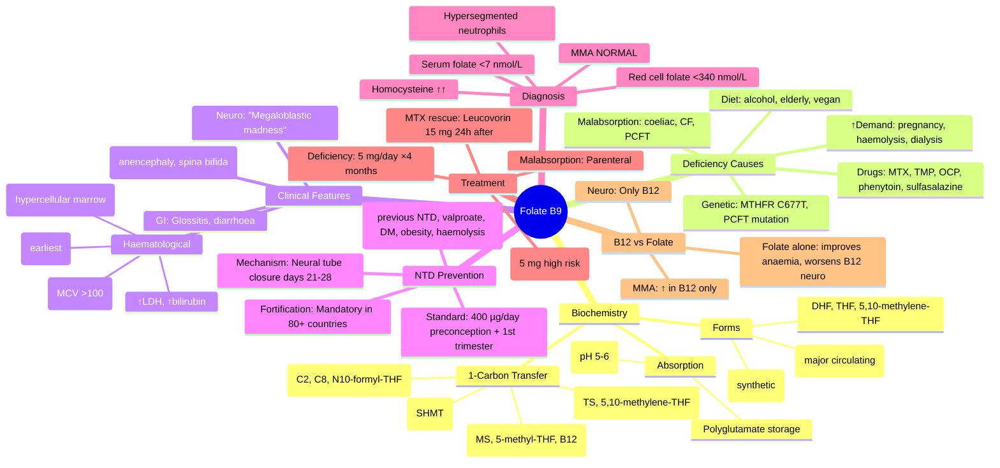

**Related:** [[Nutritional Factors in Disease MOC]], [[Davidson Chapter 22 - Nutritional Factors in Disease Hierarchy]], [[../00_Index/Medicine MOC|Medicine MOC]]

> [!important]
> **Folate (B9) = 1-carbon transfer (DNA synthesis, methylation, AA metabolism); cofactor for thymidylate synthase (dUMP→dTMP); deficiency = megaloblastic anaemia, neutropenia, hypersegmented neutrophils, neural tube defects; methotrexate, trimethoprim, OCP, alcohol deplete; mandatory pre-conception 400 µg/day.**

## 1. 1. Learning Objectives
- [ ] Describe folate forms (folic acid, dihydrofolate DHF, tetrahydrofolate THF, 5,10-methylene-THF, 5-methyl-THF), absorption (jejunum), enterohepatic circulation
- [ ] Explain 1-carbon transfer: serine → glycine (5,10-methylene-THF), dUMP → dTMP (thymidylate synthase), homocysteine → methionine (5-methyl-THF + B12)
- [ ] List deficiency causes: poor diet, malabsorption, drugs (MTX, trimethoprim, OCP, anticonvulsants), alcohol, ↑demand (pregnancy, haemolysis, dialysis)
- [ ] Recognise deficiency: megaloblastic anaemia (macrocytic, MCV >100), hypersegmented neutrophils (5+ lobes), pancytopenia, glossitis, NTD
- [ ] State NTD prevention: 400 µg folic acid/day preconception + 1st trimester; 5 mg/day in previous NTD or on antiepileptics
- [ ] Differentiate folate from B12 deficiency: NORMAL methylmalonic acid in folate; NORMAL neurological in folate (vs subacute combined degeneration in B12)
- [ ] Treatment: oral folic acid 5 mg/day ×4 months; parenteral if malabsorption

## 2. 2. Definitions / Key Concepts

| Term | Definition |
|------|------------|
| **Folate (B9)** | Water-soluble; generic term for vitamer family (folic acid, DHF, THF, 5-methyl-THF, etc.) |
| **Folic Acid** | Synthetic, oxidised form (in supplements, fortified foods); fully bioavailable; converted to THF by DHFR |
| **Tetrahydrofolate (THF)** | Reduced active form; 1-carbon carrier at oxidation states (-COOH, -CHO, -CH₃) attached to N⁵, N¹⁰ |
| **5,10-Methylene-THF** | Coenzyme for thymidylate synthase (dUMP + N⁵,N¹⁰-CH₂-THF → dTMP + DHF) |
| **5-Methyl-THF** | Major circulating form; 1-carbon donor to homocysteine → methionine (B12-dependent methionine synthase) |
| **Thymidylate Synthase (TS)** | dUMP → dTMP; **BLOOD-DEPENDENT RATE LIMITING in DNA synthesis**; targets 5-FU (F → 5-FdUMP binds TS) |
| **Methionine Synthase (MS)** | Homocysteine + 5-methyl-THF → methionine + THF; **B12 (methylcobalamin) cofactor** |
| **Methionine Synthase Reductase (MTRR)** | Regenerates methylcobalamin (methyl-Cbl → SAM cycle) |
| **MTHFR (Methylenetetrahydrofolate Reductase)** | 5,10-methylene-THF → 5-methyl-THF; FAD (B2) cofactor; **C677T polymorphism** (homozygous 10–15%) |
| **Formiminotransferase** | Histidine catabolism; THF + formimino-Glu → N-formimino-THF; deficiency = FIGLU excretion |
| **Megaloblastic Anaemia** | Macrocytic (MCV >100), hypersegmented neutrophils (5+ lobes), pancytopenia, ineffective erythropoiesis; B12/folate deficiency, drugs |
| **Hypersegmented Neutrophils** | ≥5 lobes; **earliest sign of megaloblastic change**; before anaemia |
| **Megaloblastic Madness** | Neuropsychiatric symptoms in severe B12/folate deficiency (more prominent in B12) |
| **Neural Tube Defects (NTD)** | Anencephaly, spina bifida, encephalocoele; **folate-dependent**; prevented by periconception 400 µg/day |
| **Pancytopenia** | ↓RBC, ↓WBC, ↓platelets; megaloblastic = ALL cell lines affected (marrow hypercellular) |
| **Folinic Acid (Leucovorin)** | 5-formyl-THF; reduced form (bypass DHFR); used in MTX rescue, 5-FU enhancement |
| **DHFR (Dihydrofolate Reductase)** | Folic acid → DHF → THF; inhibited by methotrexate, trimethoprim, pyrimethamine, proguanil |

## 3. 3. Core Content

### 1. Section 1: Folate Biochemistry & 1-Carbon Transfer
**Sources:** Green leafy veg (spinach, asparagus, broccoli), legumes, citrus, liver, fortified grains; thermolabile (overcooking destroys 50–90%).
**Absorption:** Jejunum; passive diffusion + carrier-mediated (RFC, PCFT/SLC46A1); monoglutamate form in circulation.
**Reduction:** Folic acid → DHF (DHFR) → THF (DHFR, NADPH); 5-methyl-THF is major dietary form.
**Polyglutamate storage:** THF + 3–6 glutamate residues (γ-linked) → retained in cells; converted to monoglutamate for export.
**Enterohepatic circulation:** Daily biliary excretion (~100 µg) + intestinal reabsorption = significant source.

**1-Carbon Transfer Reactions (THF = universal carrier):**
| Reaction | THF form | Function |
|----------|----------|----------|
| dUMP → dTMP (thymidylate synthase) | 5,10-methylene-THF | **DNA synthesis** |
| Homocysteine → methionine (methionine synthase) | 5-methyl-THF | **Methylation** (SAM cycle) |
| Glycine ↔ serine (SHMT) | 5,10-methylene-THF | AA interconversion |
| Histidine catabolism (FIGLU → glutamate) | 5-formimino-THF | AA catabolism |
| Purine synthesis (C2, C8) | N¹⁰-formyl-THF | **DNA/RNA** |
| Methionine → SAM → methyl transfer | SAM (5-methyl-THF derived) | **Methylation** (DNA, histones, neurotransmitters) |

**Why megaloblastic?** ↓dTMP → ↓DNA synthesis → **nuclear-cytoplasmic asynchrony** (cytoplasm matures normally, nucleus lags) → megaloblastosis; high demand tissues (bone marrow, GI mucosa) most affected.

### 2. Section 2: Folate Deficiency — Causes
| Cause | Mechanism |
|-------|-----------|
| **Poor dietary intake** | Elderly, alcoholics, vegan, anorexia; "tea-and-toast" diet |
| **Malabsorption** | Coeliac, Crohn's, short bowel, bariatric, achlorhydria (PCFT/SLC46A1 needs pH 5–6) |
| **Drugs:** | |
| - Methotrexate (MTX) | DHFR inhibitor; **most potent** (Rheumatology, Oncology) |
| - Trimethoprim (TMP) | Bacterial DHFR (also mammalian at high dose) |
| - Pyrimethamine | DHFR (Toxoplasma, malaria) |
| - OCP | ↓folate absorption, ↑plasma clearance; OCP/HRT users ↓red cell folate |
| - Anticonvulsants | Phenytoin, phenobarbital, carbamazepine → ↑CYP450, ↑folate catabolism |
| - Methotrexate (leucovorin rescue) | Cancer chemotherapy |
| - Sulfasalazine | ↓folate absorption (competitive) |
| **Alcohol** | ↓absorption, ↓hepatic uptake, ↑renal excretion; macrocytosis in alcoholics |
| **↑Demand** | Pregnancy (fetal DNA synthesis), haemolysis (sickle, spherocytosis), dialysis, prematurity |
| **Genetic** | MTHFR C677T (↑homocysteine); PCFT/SLC46A1 (hereditary folate malabsorption) |

### 3. Section 3: Clinical Features
**Haematological:**
- **Megaloblastic anaemia:** Macrocytic (MCV >100, often 110–130), hypersegmented neutrophils (≥5 lobes, earliest sign), oval macrocytes, anisopoikilocytosis, Howell-Jolly bodies
- **Pancytopenia:** ↓RBC, ↓WBC, ↓platelets (marrow hypercellular due to ineffective haematopoiesis)
- **Reticulocytopenia** (low retic); intramedullary haemolysis → ↑LDH, ↑bilirubin (indirect), ↓haptoglobin

**GI:**
- Glossitis (beefy red, magenta tongue)
- Angular cheilosis, stomatitis
- Diarrhoea, malabsorption (small bowel mucosal cells affected)

**Neuropsychiatric (more prominent in B12, but can occur in severe folate):**
- Cognitive decline, memory impairment, "megaloblastic madness"
- Peripheral neuropathy (less than B12)
- Spina bifida / NTD in pregnancy

**Pregnancy:**
- **NTD (neural tube defects):** Anencephaly, spina bifida, encephalocoele
- Folate deficiency → ↓cell migration, failure of neural tube closure (days 21–28 gestation)
- Placental abruption, recurrent miscarriage
- Pre-eclampsia (controversial), IUGR

### 4. Section 4: Neural Tube Defect Prevention
**NTD types:** Anencephaly, spina bifida occulta, meningocoele, meningomyelocoele, encephalocoele; risk factors: previous NTD (10x risk), maternal diabetes, valproate, carbamazepine, folate deficiency.
**Prevention (FSA/ACOG/RCOG guidelines):**
- **All women of childbearing age:** 400 µg/day folic acid
- **Periconception (1 month preconception through 12 weeks gestation):** 400 µg/day minimum
- **Previous NTD or family history:** 5 mg/day
- **On antiepileptics (valproate, carbamazepine, phenobarbital):** 5 mg/day
- **Twins, diabetes, obesity, haemolysis:** 5 mg/day

**Mechanism:** Folate required for DNA synthesis/cell proliferation during neurulation (21–28 days post-conception; often before pregnancy confirmed).

**Fortification:** Mandatory in 80+ countries (US, Canada, UK since 2021: non-wholemeal wheat flour 250 µg/100g). NTD incidence ↓20–50%.

### 5. Section 5: Diagnosis
| Test | Folate Deficiency | B12 Deficiency |
|------|------------------|----------------|
| **Serum folate** | <7 nmol/L (3 µg/L) | Often normal/low |
| **Red cell folate** | <340 nmol/L | Low |
| **Serum B12** | Normal | <150 pmol/L |
| **Homocysteine** | ↑↑ (5–20 µmol/L) | ↑↑ (10–50) |
| **Methylmalonic acid (MMA)** | **Normal** | ↑↑ (>0.4 µmol/L) |
| **MCV** | >100 | >100 |
| **Hypersegmented neutrophils** | Yes | Yes |
| **Neurological signs** | Rare (mild) | Subacute combined degeneration |
| **Response to B12 alone** | None | Improves anaemia only |
| **Response to folate alone** | Improves | Hides B12 (worsens neuro) |

**Key point:** Folate treatment in B12 deficiency improves anaemia but worsens neurological disease (irreversible). **Always check B12 before folate supplementation if deficiency suspected.**

### 6. Section 6: Treatment
| Scenario | Folate Dose | Duration |
|----------|-------------|----------|
| **Deficiency (no malabsorption)** | 5 mg/day PO | 4 months (cover RBC lifespan) |
| **Malabsorption** | 5 mg/day IV/IM | Until cause corrected |
| **Pregnancy (prophylaxis)** | 400 µg/day (high risk 5 mg) | 1 month preconception → 12w gestation |
| **Methotrexate (rheumatology)** | 5 mg/week (timed) | Ongoing; LEUCOVORIN 15 mg 24h after MTX for toxicity |
| **MTX cancer (rescue)** | Leucovorin 15 mg/m² IV/PO | 12–24h after MTX; repeat q6h |
| **5-FU enhancement** | Leucovorin 200 mg/m² + 5-FU | Colorectal cancer |
| **Haemodialysis** | 1–5 mg/day | Ongoing; remove with high-flux HD |
| **Hereditary folate malabsorption (PCFT)** | Parenteral folate (5-formyl-THF) | Lifelong |

## 4. 4. Clinical Correlation

| Scenario | Action | Notes |
|----------|--------|-------|
| 35F, macrocytic anaemia MCV 108, hypersegmented neutrophils | **Check B12 first**; if B12 normal, folate 5 mg/day ×4m; dietary counselling | NEVER give folate before B12 |
| 30F planning pregnancy, on OCP, healthy | **Start folic acid 400 µg/day 1 month before conception**; continue 12w | OCP depletes folate |
| 28F, previous anencephalic foetus | **Folic acid 5 mg/day** periconception + 1st trimester | Previous NTD = 5 mg |
| 50M on MTX for RA, macrocytosis, mouth ulcers | **Folic acid 5 mg/week 24h after MTX**; monitor blood counts; consider leucovorin rescue | MTX = DHFR inhibition |
| 30F on valproate for epilepsy, planning pregnancy | **Folic acid 5 mg/day** pre-conception; valproate is teratogenic (NTD 1–2%); consider alternative AED (lamotrigine, levetiracetam) | Valproate = highest NTD risk of AEDs |
| 70M alcoholic, macrocytosis, hypersegmented neutrophils, B12 normal, folate low | **Folic acid 5 mg/day ×3m**; alcohol cessation; thiamine, multivitamin | Multiple B-vitamin deficiencies |
| 6m infant, seizures, megaloblastic anaemia, ↑homocysteine, normal MMA | **Hereditary folate malabsorption (PCFT)**; parenteral 5-formyl-THF | PCFT/SLC46A1 mutation; pH-sensitive transporter |

## 5. 5. High-Yield FCPS/MRCP Points

> [!important]
> - **Must know:** 1-carbon transfer (dUMP→dTMP = DNA synthesis; homocysteine→methionine = methylation); megaloblastic anaemia (macrocytic, hypersegmented neutrophils); deficiency causes (poor diet, MTX, trimethoprim, OCP, alcohol, pregnancy, haemolysis); NTD prevention 400 µg/day periconception, 5 mg/day if previous NTD/on valproate; **check B12 before folate**; normal MMA in folate deficiency (vs ↑↑ in B12)
> - **Common viva:** 1-carbon reactions; megaloblastic vs non-megaloblastic; B12 vs folate (MMA, neurological); periconception dosing; methotrexate rescue (leucovorin 15 mg); MTHFR C677T
> - **Exam trap:** Giving folate before B12 (worsens neurological); confusing hypersegmented neutrophils with shift left; thinking folate treats B12 neurological; macrocytosis in alcohol without B12/folate deficiency (direct effect)

## 6. 6. Common Confusions / Exam Traps

| Trap | Correction |
|------|------------|
| Give folate for macrocytic anaemia without checking B12 | **Check B12 first**; folate hides B12 anaemia, worsens neurological |
| Homocysteine ↑ in both folate and B12 | **MMA ↑ only in B12** (sensitive/specific for B12) |
| Folate deficiency causes NTD | **Folate PREVENTS NTD**; deficiency increases risk; periconception 400 µg/day |
| Hypersegmented neutrophils = band cells | **Hypersegmented = ≥5 lobes** (earliest sign of megaloblastosis) |
| Methotrexate folate | **MTX = DHFR inhibitor** → functional folate deficiency; LEUCOVORIN (5-formyl-THF) bypasses |
| 5 mg folate for all pregnancy | **400 µg for normal; 5 mg only if previous NTD/anticonvulsants/diabetes/obesity** |
| OCP doesn't affect folate | **OCP ↓folate absorption + ↑plasma clearance**; consider 400 µg supplement |
| Macrocytosis = folate | **Macro ≠ megaloblastic**; alcohol = macrocytosis without megaloblastosis; reticulocytosis |

## 7. 7. Mnemonics

- **1-Carbon reactions:** **DTS = DNA Thymidylate Synthase (5,10-methylene-THF)**; **MS = Methionine Synthase (5-methyl-THF + B12)**
- **Folate forms:** **5-10-5** = **5,10-methylene-THF** (dTMP) ↔ **5-methyl-THF** (methionine)
- **Megaloblastic triad:** **MHH** = **M**acrocytic, **H**ypersegmented neutrophils, **H**ypercellular marrow
- **NTD prevention:** **400-4-12** = 400 µg/day, 1 month before, 12 weeks gestation; **5 mg** if high risk
- **Methotrexate rescue:** **LEUCOVORIN 15 mg** = **L**eucovorin, **E**very **U**ntil, **C**ytes **O**ptimal, **V**ia **O**rally, **R**escue **I**njected, **N**eeded
- **Drug-induced folate deficiency:** **MS-TOP-OCP** = **M**TX, **S**ulfasalazine, **T**rimethoprim, **O**CP, **P**yrimethamine + Anticonvulsants
- **Folate vs B12:** **Hcy in BOTH**; **MMA ONLY in B12**; **NEURO only in B12**
- **Megaloblastic earliest sign:** **H**ypersegmented **N**eutrophils (5+ lobes) before anaemia

## 8. 8. Mind Map

## 9. 9. -Hour Recall Prompts
1. 1-carbon transfer: dUMP→dTMP (5,10-methylene-THF); homocysteine→methionine (5-methyl-THF + B12)
2. Deficiency causes: poor diet, MTX, trimethoprim, OCP, alcohol, haemolysis, pregnancy
3. Megaloblastic anaemia: macrocytic MCV >100, hypersegmented neutrophils (earliest), pancytopenia
4. NTD prevention: 400 µg/day standard, 5 mg if high risk; preconception 1 month
5. Folate vs B12: MMA normal in folate (↑ in B12); neuro only in B12
6. Methotrexate rescue: leucovorin (5-formyl-THF) 15 mg IV/PO 24h after MTX
7. MTHFR C677T: most common folate polymorphism; ↑homocysteine
8. OCP/HRT depletes folate; periconception 400 µg

## 10. 10. -Day / 15-Day / 30-Day Revision Tracker

| Day | Date | Recall Quality (1-5) | Time Spent | Notes |
|-----|------|---------------------|------------|-------|
| 1   |      |                     |            |       |
| 7   |      |                     |            |       |
| 15  |      |                     |            |       |
| 30  |      |                     |            |       |

---

## 11. 11. Must Know / Should Know / Nice to Know

| Priority | Content |
|----------|---------|
| **Must Know 🔴** | 1-carbon transfer (dTMP, methionine); megaloblastic anaemia (macrocytic, hypersegmented neutrophils); deficiency causes (MTX, TMP, OCP, alcohol, pregnancy); NTD prevention (400 µg / 5 mg); check B12 before folate; normal MMA in folate; methotrexate rescue (leucovorin) |
| **Should Know 🟡** | MTHFR C677T; MTRR mutation; OCP folate depletion; fortification programmes; valproate NTD risk; MTHFD1 polymorphisms; absorption (PCFT pH) |
| **Nice to Know 🟢** | 5-Formyl-THF (leucovorin) rescue protocols; polyglutamylation; methyl-trap hypothesis; folate in neurodevelopmental disorders; Hcy-cysteine remethylation genetics |

## 12. 12. My Weak Points
- [ ] MTHFR C677T prevalence by ethnicity
- [ ] Methotrexate rescue dose timing detail
- [ ] PCFT/SLC46A1 hereditary malabsorption

## 13. 13. Self-Test Scorecard

| Domain | Score /10 | Target /10 |
|--------|-----------|------------|
| Understanding |    | 8+ |
| Recall |    | 8+ |
| MCQ Performance |    | 8+ |
| SBA Performance |    | 8+ |
| Viva Confidence |    | 8+ |
| **TOTAL** |    | **40+/50** |

## 14. 14. Exam Answer Modes

### 1. Long Answer / Essay (20 min)
**Topic:** "Folate: biochemistry, deficiency, and clinical significance"
- Biochemistry: 1-carbon transfer (THF cofactor); dUMP→dTMP (TS, 5,10-methylene-THF); homocysteine→methionine (MS, 5-methyl-THF, B12); purine synthesis
- Deficiency: megaloblastic anaemia (MCV >100, hypersegmented neutrophils, pancytopenia); GI (glossitis); NTD in pregnancy
- Causes: poor diet, alcohol, malabsorption, drugs (MTX, TMP, OCP, anticonvulsants), ↑demand
- NTD prevention: 400 µg/day periconception; 5 mg if high risk (previous NTD, valproate, DM)
- Diagnosis: ↓serum/red cell folate, ↑homocysteine, normal MMA; **check B12 first** (folate hides B12)
- Treatment: 5 mg/day ×4 months; leucovorin rescue for MTX toxicity

### 2. Short Note (7 min)
**Topic:** "Folate vs B12 Deficiency"
- **Both:** Macrocytic megaloblastic anaemia, hypersegmented neutrophils, pancytopenia, ↑homocysteine
- **B12 only:** ↑MMA (sensitive/specific); subacute combined degeneration (posterior + lateral columns, peripheral neuropathy, dementia)
- **Folate only:** Risk of NTD; very rare neurological
- **Critical:** Folate treatment in B12 deficiency **worsens** neurological disease (irreversible) despite improving anaemia
- **Practical:** Always check B12 (or co-prescribe B12) when starting folate for macrocytic anaemia

### 3. Viva Answer (3 min)
**Q:** "Why is folate given before conception?"
"A: **Neural tube closure occurs days 21–28 post-conception** — often before pregnancy confirmed. **NTD** (anencephaly, spina bifida) result from failed closure. Folate required for **DNA synthesis/cell proliferation** during neurulation. **400 µg/day from 1 month preconception through 12 weeks gestation; 5 mg if high risk** (previous NTD, valproate, DM, obesity). Fortification programmes ↓NTD 20–50%."

### 4. Ward Case Discussion (5 min)
**Case:** 30F on MTX 15 mg weekly for RA, 6 months, presents with macrocytic anaemia (Hb 9, MCV 110), hypersegmented neutrophils, mouth ulcers. B12 normal.
"Diagnosis: **MTX-induced functional folate deficiency** (DHFR inhibition). Treatment: **Folic acid 5 mg/week 24 hours after MTX** (separate dose to avoid competitive inhibition). Monitor Hb, MCV. Mouth ulcers improve with folate. Alternative: leucovorin 15 mg rescue for severe toxicity."

### 5. Last-Night-Before-Exam Sheet (1 min)
- **1-Carbon transfer:** dUMP→dTMP (TS, 5,10-methylene-THF); Hcy→Met (MS, 5-methyl-THF, B12); purine (C2, C8)
- **Megaloblastic:** Macrocytic, hypersegmented neutrophils (earliest), pancytopenia, ↑LDH
- **Causes:** Diet, alcohol, malabsorption, MTX, TMP, OCP, anticonvulsants, ↑demand
- **NTD prevention:** 400 µg standard / 5 mg high risk; preconception 1 month
- **B12 vs Folate:** MMA ↑ in B12 only; neuro only in B12; **CHECK B12 BEFORE FOLATE**
- **MTX rescue:** Leucovorin (5-formyl-THF) 15 mg 24h after MTX
- **OCP:** ↓folate absorption + ↑plasma clearance; consider 400 µg supplement
- **Fortification:** 80+ countries; ↓NTD 20–50%

## 15. 15. MCQs (10)

1. **Major circulating form of folate:**
   A. Folic acid  
   B. DHF  
   C. THF  
   D. **5-Methyl-THF**  

2. **Folate cofactor for thymidylate synthase (dUMP → dTMP):**
   A. 5-Methyl-THF  
   B. **5,10-Methylene-THF**  
   C. N¹⁰-formyl-THF  
   D. THF  

3. **Neural tube closure occurs:**
   A. Days 7–14 post-conception  
   B. **Days 21–28 post-conception**  
   C. Weeks 8–12 gestation  
   D. Trimester 2  

4. **Standard folic acid dose for NTD prevention (no risk factors):**
   A. 100 µg/day  
   B. **400 µg/day**  
   C. 1 mg/day  
   D. 5 mg/day  

5. **Folic acid dose in women with previous NTD or on valproate:**
   A. 400 µg/day  
   B. 1 mg/day  
   C. **5 mg/day**  
   D. 10 mg/day  

6. **Biochemical marker elevated in BOTH folate and B12 deficiency:**
   A. Methylmalonic acid (MMA)  
   B. **Homocysteine**  
   C. Methylmalonic acid AND homocysteine  
   D. Neither  

7. **Biochemical marker SPECIFIC for B12 deficiency:**
   A. Homocysteine  
   B. **Methylmalonic acid (MMA)**  
   C. Cystathionine  
   D. Methionine  

8. **Methotrexate rescue agent (bypass DHFR):**
   A. Folic acid  
   B. **Folinic acid (leucovorin, 5-formyl-THF)**  
   C. 5-methyl-THF  
   D. Pyridoxine  

9. **Drug causing folate deficiency by ↓absorption + ↑clearance:**
   A. Methotrexate  
   B. Trimethoprim  
   C. **Oral contraceptive pill**  
   D. Phenytoin  

10. **Earliest sign of megaloblastic anaemia:**
    A. Macrocytosis  
    B. **Hypersegmented neutrophils (≥5 lobes)**  
    C. Pancytopenia  
    D. ↑MCV  

## 16. 16. SBA Questions (5)

1. **A 32-year-old woman with previous anencephalic pregnancy is planning another pregnancy. What folate dose should she take periconceptionally?**
   A. 400 µg/day  
   B. 1 mg/day  
   C. **5 mg/day**  
   D. 10 mg/day  
   E. No folate needed  

2. **A 60-year-old man on methotrexate 15 mg weekly for rheumatoid arthritis develops macrocytic anaemia (Hb 9.5, MCV 105), hypersegmented neutrophils, and mouth ulcers. B12 normal. Management?**
   A. Stop methotrexate permanently  
   B. **Folic acid 5 mg/week, taken 24 hours after methotrexate**  
   C. Leucovorin 200 mg IV  
   D. Folic acid 5 mg daily  
   E. Switch to alternative DMARD  

3. **A 28-year-old woman on valproate for epilepsy is planning pregnancy. Folate advice?**
   A. No folate needed  
   B. 400 µg/day throughout pregnancy  
   C. **5 mg/day preconception and 1st trimester; consider AED switch**  
   D. Folic acid 10 mg daily  
   E. Folic acid IV  

4. **A 50-year-old man with macrocytic anaemia (Hb 8.5, MCV 115), hypersegmented neutrophils. B12 is 90 pmol/L (low). Methylmalonic acid 2.5 µmol/L (very high), homocysteine 60 µmol/L. Diagnosis?**
   A. Folate deficiency  
   B. **B12 deficiency**  
   C. Combined folate + B12 deficiency  
   D. Anaemia of chronic disease  
   E. Myelodysplasia  

5. **A 35-year-old woman of childbearing age with no pregnancy plan and on OCP. What dietary supplement should be considered?**
   A. No supplement  
   B. **Folic acid 400 µg/day**  
   C. Iron  
   D. Vitamin D  
   E. Vitamin C  

## 17. 17. Flashcards

- Q: 1-Carbon transfer: dTMP  
  A: **5,10-methylene-THF** (thymidylate synthase, dUMP→dTMP)
- Q: 1-Carbon transfer: Methionine  
  A: **5-methyl-THF** (methionine synthase, Hcy→Met, B12 cofactor)
- Q: Megaloblastic earliest sign  
  A: **Hypersegmented neutrophils (≥5 lobes)** before anaemia
- Q: NTD prevention standard  
  A: **400 µg/day, 1 month preconception → 12 weeks gestation**
- Q: NTD prevention high risk  
  A: **5 mg/day** (previous NTD, valproate, DM, obesity, haemolysis)
- Q: Folate vs B12 MMA  
  A: **MMA NORMAL in folate; ↑↑ in B12** (sensitive/specific)
- Q: Folate vs B12 neuro  
  A: **Neuro only in B12** (SCD); folate hides anaemia, worsens B12 neuro
- Q: MTX rescue  
  A: **Leucovorin 15 mg 24h after MTX** (5-formyl-THF bypasses DHFR)
- Q: Drugs depleting folate  
  A: **MS-TOP-OCP** = MTX, Sulfasalazine, Trimethoprim, OCP, Pyrimethamine + Anticonvulsants
- Q: MTHFR C677T  
  A: **Most common folate polymorphism; ↑homocysteine; risk CVD/stroke**
- Q: Folate excess effect  
  A: **No toxicity** (water-soluble); but may hide B12 deficiency (anaemia correct, neuro progresses)

## 18. 18. Answer Key with Explanations

### 1. MCQs
1. **D** — 5-methyl-THF is the major circulating form; THF accepts one-carbon units at N⁵ or N¹⁰ positions.
2. **B** — 5,10-methylene-THF provides carbon for dUMP → dTMP via thymidylate synthase (rate-limiting DNA synthesis step).
3. **B** — Neural tube closure days 21–28 post-conception (3–4 weeks gestation); before pregnancy often confirmed; hence periconception folate.
4. **B** — Standard 400 µg/day from 1 month preconception through 12 weeks gestation; 5 mg if risk factors.
5. **C** — High risk (previous NTD, valproate/carbamazepine, DM, obesity): 5 mg/day.
6. **B** — Homocysteine ↑ in BOTH folate and B12 deficiency; MMA ↑ ONLY in B12 (key differentiator).
7. **B** — Methylmalonic acid (MMA) is sensitive and specific for B12 deficiency; accumulated due to impaired methylmalonyl-CoA mutase.
8. **B** — Folinic acid (5-formyl-THF, leucovorin) is reduced form; bypasses DHFR block from methotrexate.
9. **C** — OCP decreases folate absorption and increases plasma clearance; contributes to megaloblastic changes.
10. **B** — Hypersegmented neutrophils (≥5 lobes) appear in blood before macrocytosis/anaemia; earliest sign.

### 2. SBAs
1. **C** — Previous NTD = 5 mg/day preconception + 1st trimester; 10x recurrence risk.
2. **B** — MTX-induced folate deficiency: folic acid 5 mg/week 24h after MTX (separate dose to avoid competitive DHFR inhibition); mouth ulcers improve.
3. **C** — Valproate (highest NTD risk of AEDs) + periconception folate 5 mg/day; consider switch to lamotrigine/levetiracetam if planning pregnancy.
4. **B** — Low B12 + ↑↑MMA (specific) + ↑Hcy = B12 deficiency; folate deficiency would have normal MMA.
5. **B** — OCP depletes folate; 400 µg/day periconception recommended for all women of childbearing age (also covers unplanned pregnancy).

## 19. 19. Summary

**Folate (B9)** is a **Must Know 🔴** topic for FCPS/MRCP.
**Key takeaway:** 1-carbon transfer: dUMP→dTMP (DNA synthesis via TS) + homocysteine→methionine (methylation via MS, B12 cofactor). Deficiency = megaloblastic anaemia (macrocytic, hypersegmented neutrophils), glossitis, NTD in pregnancy. Causes: diet, alcohol, MTX, trimethoprim, OCP, anticonvulsants, ↑demand (pregnancy/haemolysis). **NTD prevention: 400 µg/day standard, 5 mg high risk (previous NTD, valproate, DM), periconception 1 month.** **Check B12 before folate** (folate hides B12 anaemia, worsens B12 neuro). Methotrexate rescue: leucovorin 15 mg 24h after.
**Exam focus:** 1-carbon reactions, megaloblastic vs B12 (MMA, neuro), NTD prevention, MTX rescue, MTHFR, OCP effect.
**Clinical relevance:** Universal periconception folate; MTX monitoring; B12 check before folate; OCP counselling.

*Template version: 1.0 | Davidson 24e Ch 22 aligned | FCPS/MRCP oriented*

## PasTest Scenario SBAs (Clinical Vignettes)

> **Auto-generated PasTest/Mediscope-style scenario SBAs** grounded in the authored source. Each scenario tests a real clinical fact (triad, specific sign, contraindication, trial, first-line Rx) extracted from the topic. *Source: Ch 5: Nutritional Factors — Folate (B9)- Anaemia & Neural Tube Defects*

**Q1.** Which of the following features is most specific or characteristic of Folate (B9)- Anaemia & Neural Tube Defects?

  - **A.** MMA ↑ only in B12
  - **B.** A feature common to many acute inflammatory conditions
  - **C.** A non-specific sign that does not localise the diagnosis
  - **D.** An investigation finding rather than a clinical feature

  > **Answer: A** — MMA ↑ only in B12
  >
  > *Source:* first**; folate hides B12 anaemia, worsens neurological |
| Homocysteine ↑ in both folate and B12 | **MMA ↑ only in B12** (sensitive/specific for B12) |
| Folate deficiency causes NTD | **Folate PREVE

