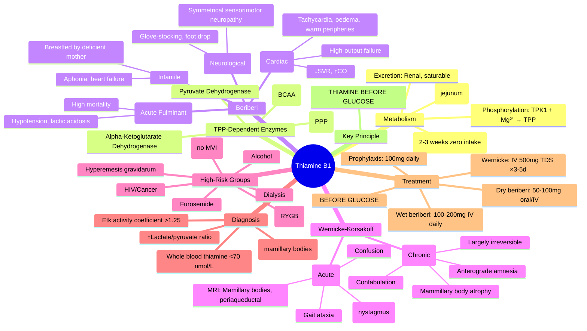

**Related:** [[Nutritional Factors in Disease MOC]], [[Davidson Chapter 22 - Nutritional Factors in Disease Hierarchy]], [[../00_Index/Medicine MOC|Medicine MOC]]

> [!important]
> **Thiamine (B1) = cofactor for pyruvate dehydrogenase, α-ketoglutarate dehydrogenase, transketolase; deficiency = beriberi (wet/dry) + Wernicke-Korsakoff; high-risk: alcoholism, malnutrition, hyperemesis, TPN, bariatric.**

## 1. 1. Learning Objectives
- [ ] Describe thiamine structure, absorption (active transport + passive), phosphorylation to TPP (active cofactor)
- [ ] List TPP-dependent enzymes: pyruvate dehydrogenase, α-ketoglutarate dehydrogenase, transketolase (PPP), branched-chain ketoacid dehydrogenase
- [ ] Explain energy metabolism defect: ↓ATP, ↑lactate, ↑pyruvate, impaired glucose oxidation
- [ ] Differentiate wet beriberi (high-output cardiac failure) vs dry beriberi (peripheral neuropathy)
- [ ] Recognise Wernicke's triad: ophthalmoplegia, ataxia, confusion (+ Korsakoff: anterograde amnesia, confabulation)
- [ ] State treatment: IV thiamine 500 mg TDS ×3–5 days (Wernicke) / 100–200 mg/day (beriberi); give BEFORE glucose
- [ ] Identify high-risk: alcohol, hyperemesis gravidarum, TPN without vitamins, bariatric, dialysis, HIV, cancer

## 2. 2. Definitions / Key Concepts

| Term | Definition |
|------|------------|
| **Thiamine (B1)** | Water-soluble vitamin; pyrimidine + thiazole ring; absorbed jejunum (active transport low dose, passive high dose) |
| **TPP (Thiamine Pyrophosphate)** | Active cofactor (thiamine diphosphate); formed by thiamine pyrophosphokinase (TPK1) in cytosol; Mg²⁺ required |
| **Transketolase** | PPP enzyme; requires TPP; activity in RBCs = functional thiamine status (Etk activity coefficient >1.25 = deficiency) |
| **Pyruvate Dehydrogenase (PDH)** | Pyruvate → acetyl-CoA; TPP + lipoamide + CoA + FAD + NAD⁺; ↑pyruvate → lactate if deficient |
| **α-Ketoglutarate Dehydrogenase** | Krebs cycle; α-KG → succinyl-CoA; TPP-dependent; impaired → ↑α-KG, ↓ATP |
| **Branched-Chain Ketoacid Dehydrogenase** | BCAA catabolism; TPP-dependent; deficiency → maple syrup urine disease |
| **Wet Beriberi** | High-output cardiac failure: tachycardia, oedema, cardiomegaly, warm peripheries, ↑CO, ↓SVR |
| **Dry Beriberi** | Symmetrical sensorimotor polyneuropathy: glove-stocking loss, areflexia, foot drop, wasting |
| **Shoshin Beriberi** | Acute fulminant cardiovascular beriberi: hypotension, metabolic acidosis, oliguria, high mortality |
| **Wernicke's Encephalopathy** | Acute: ophthalmoplegia (nystagmus, lateral gaze palsy), gait ataxia, confusion; MRI: mamillary bodies, periaqueductal |
| **Korsakoff's Syndrome** | Chronic: anterograde amnesia, confabulation, retrograde amnesia; mamillary body atrophy; often irreversible |
| **Wernicke-Korsakoff Syndrome** | Continuum: acute Wernicke → chronic Korsakoff if untreated; treat Wernicke urgently to prevent progression |
| **High-Output Failure** | ↑CO, ↓SVR, warm shock; thiamine deficiency → arteriolar vasodilation (lactate/pyruvate ratio) |
| **Thiamine Responsive Disorders** | Thiamine transporter 2 (SLC19A2) mutation → thiamine-responsive megaloblastic anaemia (TRMA) |

## 3. 3. Core Content

### 1. Section 1: Metabolism & Biochemistry
**Absorption:** Duodenum/jejunum; low concentrations — active transport (SLC19A2, SLC19A3, RFC); high concentrations — passive diffusion; inhibited by alcohol, tea polyphenols, raw fish (thiaminase).
**Phosphorylation:** Thiamine + ATP → TPP (thiamine pyrophosphokinase, TPK1); Mg²⁺ cofactor; occurs in liver, brain, kidney, heart.
**Excretion:** Renal (free thiamine, metabolites); saturable reabsorption; half-life 1–2 weeks; body stores ~30 mg (depleted in 2–3 weeks zero intake).
**TPP-Dependent Enzymes:**
1. **Pyruvate dehydrogenase (PDH):** Pyruvate + NAD⁺ + CoA → acetyl-CoA + NADH + CO₂; links glycolysis to Krebs
2. **α-Ketoglutarate dehydrogenase (α-KGDH):** α-KG + NAD⁺ + CoA → succinyl-CoA + NADH + CO₂; Krebs cycle
3. **Transketolase (TKT):** Pentose phosphate pathway; xylulose-5-P + ribose-5-P ↔ glyceraldehyde-3-P + sedoheptulose-7-P; NADPH + ribose for nucleotides
4. **Branched-chain ketoacid dehydrogenase (BCKDH):** BCAA (leucine, isoleucine, valine) catabolism

### 2. Section 2: Beriberi — Clinical Features
| Type | Features | Pathophysiology |
|------|----------|-----------------|
| **Wet (Cardiac)** | Tachycardia, high-output failure, peripheral oedema (pitting), cardiomegaly, warm peripheries, wide pulse pressure, ↑JVP, gallop rhythm, pleural effusion | ↓ATP in myocardium; arteriolar vasodilation (↑lactate/pyruvate) → ↓SVR → high CO; sodium retention |
| **Dry (Neurological)** | Symmetrical distal sensorimotor polyneuropathy: glove-stocking sensory loss, burning feet, areflexia, foot drop, wrist drop, wasting | Axonal degeneration (↓ATP for axonal transport); posterior column + spinocerebellar involvement |
| **Shoshin (Acute Fulminant)** | Rapid cardiovascular collapse: hypotension, tachycardia, metabolic acidosis (lactic), oliguria, altered mental status, high mortality | Severe myocardial dysfunction + lactic acidosis; requires urgent IV thiamine + supportive |

**Infantile beriberi:** 2–4 months (breastfed by thiamine-deficient mother); aphonia, vomiting, tachycardia, convulsions, heart failure; **acute, fatal if untreated.**

### 3. Section 3: Wernicke-Korsakoff Syndrome
**Wernicke's Triad (classic, only 10–30% have all three):**
1. **Ophthalmoplegia:** Nystagmus (horizontal, gaze-evoked), lateral gaze palsy (abducens), ptosis, conjugate gaze palsy
2. **Gait ataxia:** Broad-based, unsteady, truncal; due to cerebellar vermis + vestibular nuclei involvement
3. **Confusion:** Global confusion, apathy, inattention, disorientation

**MRI findings:** Symmetrical T2/FLAIR hyperintensity in mamillary bodies, periaqueductal grey, medial thalami, floor of 4th ventricle; mammillary body atrophy (chronic).

**Korsakoff's Syndrome:** Anterograde amnesia (cannot form new memories), confabulation (fabricated memories to fill gaps), retrograde amnesia; relative preservation of other cognitive domains; mammillary body atrophy.

**Treatment (Wernicke):**
- **IV thiamine 500 mg TDS ×3–5 days** (UK: Pabrinex 2 pairs TDS = 250 mg thiamine/dose; some guidelines 200 mg TDS)
- **Give BEFORE any glucose** (glucose metabolism consumes residual thiamine → precipitates Wernicke)
- Then oral 100 mg/day maintenance
- Mg²⁺ repletion (cofactor for TPK1)

### 4. Section 4: High-Risk Groups & Causes
| Group | Mechanism |
|-------|-----------|
| **Alcohol use disorder** | ↓Intake, ↓absorption, ↓phosphorylation (liver disease), ↑excretion, ↑demand |
| **Hyperemesis gravidarum** | Prolonged vomiting, nil by mouth, high glucose IV without vitamins |
| **TPN without vitamins** | No thiamine in standard bags; must add multivitamin |
| **Bariatric surgery (RYGB)** | Bypassed duodenum (absorption site), vomiting, restricted intake |
| **Dialysis** | Loss in dialysate, dietary restriction, comorbid illness |
| **HIV / Cancer / Critical illness** | Hypermetabolic, ↓intake, malabsorption |
| **Diuretic use (furosemide)** | ↑Renal thiamine excretion |
| **Raw fish / fermented tea** | Thiaminase (raw fish), anti-thiamine factors (tea polyphenols) |

### 5. Section 5: Diagnosis
**Functional test:** Erythrocyte transketolase activity (Etk); **Etk activity coefficient** = Etk + TPP / Etk baseline; >1.25 = deficiency.
**Direct levels:** Whole blood thiamine (ref 70–180 nmol/L) or plasma (ref 7–30 nmol/L); whole blood more reliable.
**Supportive:** ↑Blood lactate, ↑pyruvate, ↑lactate/pyruvate ratio (>25), metabolic acidosis; ↓branched-chain amino acids.
**MRI:** Mamillary bodies, periaqueductal, medial thalami (Wernicke).

### 6. Section 6: Treatment Protocols
| Condition | Thiamine Dose | Route | Duration |
|-----------|--------------|-------|----------|
| **Wernicke's Encephalopathy** | 500 mg TDS (or 200–250 mg TDS) | IV | 3–5 days, then oral 100 mg/day |
| **Wet Beriberi** | 100–200 mg/day | IV/IM | Until improvement, then oral |
| **Dry Beriberi** | 50–100 mg/day | Oral/IV | Weeks–months (neuropathy slow) |
| **Prophylaxis (High-risk)** | 100 mg/day | IV/PO | During risk period |
| **Infantile Beriberi** | 25–50 mg | IV/IM | Urgent; mother also treated |

**Critical:** **ALWAYS give thiamine BEFORE glucose** in at-risk patients (alcohol, malnutrition, hyperemesis). Glucose → ↑pyruvate → ↑TPP demand → precipitates Wernicke.

## 4. 4. Clinical Correlation

| Scenario | Action | Notes |
|----------|--------|-------|
| 45M, alcohol detox, confusion, nystagmus, ataxia | **IV thiamine 500 mg TDS ×3–5d BEFORE glucose**; Mg²⁺; Pabrinex | Wernicke's; do NOT wait for MRI; treat empirically |
| 30F, hyperemesis 4w, IV dextrose started, now confused | **STOP glucose; IV thiamine 500 mg STAT**; continue TDS; check Mg²⁺ | Glucose precipitated Wernicke; urgent |
| 60M, RYGB 6m ago, vomiting, numb feet, areflexia | **Thiamine 100 mg IV daily ×5d then oral**; check B12, folate, Cu, Fe | Bariatric = multivitamin deficiency screen |
| 8m infant, breastfed, lethargic, tachycardia, oedema | **Thiamine 25 mg IV STAT**; mother also 100 mg/day; echo | Infantile beriberi; maternal deficiency |
| 55M on furosemide 160 mg/day, tachycardia, oedema, ↑lactate | **Thiamine 100 mg IV daily**; check Mg²⁺, K⁺; consider wet beriberi | Furosemide ↑thiamine excretion |
| 70M, TPN 2w, no multivitamin, encephalopathy | **Add MVI to TPN**; IV thiamine 100 mg/day ×5d | TPN without vitamins = beriberi risk |

## 5. 5. High-Yield FCPS/MRCP Points

> [!important]
> - **Must know:** TPP-dependent enzymes (PDH, α-KGDH, transketolase, BCKDH); wet vs dry beriberi; Wernicke triad (ophthalmoplegia, ataxia, confusion); Korsakoff (amnesia, confabulation); **thiamine BEFORE glucose**; IV 500 mg TDS for Wernicke; high-risk: alcohol, hyperemesis, TPN, bariatric, dialysis; MRI: mamillary bodies
> - **Common viva:** Why thiamine before glucose? Wet vs dry beriberi pathophysiology; Wernicke vs Korsakoff; Etk activity coefficient; Shoshin beriberi; alcohol mechanisms; infantile beriberi
> - **Exam trap:** Giving glucose before thiamine in alcoholic; missing Wernicke (only 1/3 have full triad); treating Korsakoff as reversible; using oral thiamine for acute Wernicke; confusing beriberi with Guillain-Barré (reflexes preserved early in GBS)

## 6. 6. Common Confusions / Exam Traps

| Trap | Correction |
|------|------------|
| Glucose first, then thiamine | **Thiamine MUST precede glucose** — glucose consumes residual TPP, precipitates Wernicke |
| Oral thiamine for Wernicke | **IV required** (absorption impaired, urgent); 500 mg TDS ×3–5d |
| Korsakoff reversible | **Largely irreversible**; treat Wernicke URGENTLY to prevent progression |
| All 3 features needed for Wernicke | **Only 10–30% have full triad**; treat on clinical suspicion (2/3 features) |
| Wet beriberi = low-output failure | **HIGH-output failure** (↑CO, ↓SVR, warm peripheries); Shoshin = acute fulminant |
| Thiamine deficiency = only alcohol | **Also: hyperemesis, TPN, bariatric, dialysis, furosemide, HIV, cancer** |
| Beriberi neuropathy = Guillain-Barré | **Beriberi: symmetrical, sensory>motor, gradual; GBS: ascending, areflexia, albuminocytological dissociation** |
| TPP = thiamine monophosphate | **TPP = thiamine diphosphate (pyrophosphate)**; TMP = monophosphate (inactive) |
| Etk coefficient <1.25 = normal | **>1.25 = deficiency** (apoprotein saturation <80%) |
| MRI normal excludes Wernicke | **Early MRI may be normal**; treat clinically; MRI sensitivity ~50% acute |

## 7. 7. Mnemonics

- **TPP enzymes:** **PAT B** = **P**yruvate dehydrogenase, **A**lpha-KGDH, **T**ransketolase, **B**CKDH
- **Beriberi:** **WET = cardiac** (high-output, oedema, warm); **DRY = neuropathy** (glove-stocking, foot drop)
- **Wernicke triad:** **OAC** = **O**phthalmoplegia, **A**taxia, **C**onfusion (classic, but only 1/3 have all)
- **Thiamine before glucose:** **THIAMINE FIRST** — "Don't sweeten the starving brain"
- **High-risk:** **HALT** = **H**yperemesis, **A**lcohol, **L** (TPN/bypass), **T** (diuretics/dialysis)
- **Wernicke MRI:** **MAM** = **M**amillary bodies, **A**queduct (periaqueductal), **M**edial thalami
- **Korsakoff:** **KORS** = **K**orsakoff, **O**perative (amnesia), **R**etrograde, **S** (confabulation)
- **Infantile beriberi:** **INFANT** = **I**nfant, **N**ursing, **F**ulminant, **A**phonia, **N**eonatal, **T**hiamine
- **Treatment dose:** **500 TDS** (Wernicke), **100 DAILY** (beriberi/prophylaxis)

## 8. 8. Mind Map

## 9. 9. -Hour Recall Prompts
1. List 4 TPP-dependent enzymes (PAT B)
2. Contrast wet vs dry beriberi pathophysiology
3. Wernicke triad (OAC); Korsakoff features
4. Why thiamine BEFORE glucose?
5. High-risk groups (HALT)
6. Treatment doses: Wernicke 500mg TDS, beriberi 100-200mg
7. Etk activity coefficient >1.25 = deficiency
8. MRI findings: mamillary bodies, periaqueductal

## 10. 10. -Day / 15-Day / 30-Day Revision Tracker

| Day | Date | Recall Quality (1-5) | Time Spent | Notes |
|-----|------|---------------------|------------|-------|
| 1   |      |                     |            |       |
| 7   |      |                     |            |       |
| 15  |      |                     |            |       |
| 30  |      |                     |            |       |

---

## 11. 11. Must Know / Should Know / Nice to Know

| Priority | Content |
|----------|---------|
| **Must Know 🔴** | TPP enzymes (PDH, α-KGDH, transketolase, BCKDH); wet/dry beriberi; Wernicke triad; Korsakoff amnesia/confabulation; thiamine BEFORE glucose; IV 500mg TDS Wernicke; high-risk groups; Shoshin beriberi |
| **Should Know 🟡** | Etk activity coefficient; infantile beriberi; Mg²⁺ cofactor for TPK1; MRI mamillary bodies; thiamine transporters (SLC19A2/3); thiaminase in raw fish |
| **Nice to Know 🟢** | TRMA (SLC19A2 mutation); genetic beriberi; thiamine in septic shock (CITRIS-AL trial); benfotiamine (lipophilic derivative) for diabetic neuropathy |

## 12. 12. My Weak Points
- [ ] Exact TPK1 kinetic parameters
- [ ] CITRIS-AL trial details (thiamine in septic shock)
- [ ] Benfotiamine pharmacokinetics vs thiamine

## 13. 13. Self-Test Scorecard

| Domain | Score /10 | Target /10 |
|--------|-----------|------------|
| Understanding |    | 8+ |
| Recall |    | 8+ |
| MCQ Performance |    | 8+ |
| SBA Performance |    | 8+ |
| Viva Confidence |    | 8+ |
| **TOTAL** |    | **40+/50** |

## 14. 14. Exam Answer Modes

### 1. Long Answer / Essay (20 min)
**Topic:** "Thiamine deficiency: pathophysiology, clinical manifestations, and management"
- Metabolism: absorption, TPP formation, dependent enzymes
- Energy defect: ↓PDH/α-KGDH → ↑lactate, ↓ATP; PPP defect → ↓NADPH, ↓nucleotides
- Wet beriberi: high-output cardiac failure (vasodilation, ↓SVR, sodium retention)
- Dry beriberi: symmetrical axonal sensorimotor polyneuropathy
- Wernicke-Korsakoff: acute encephalopathy (ophthalmoplegia, ataxia, confusion) → chronic amnestic syndrome
- High-risk: alcohol, hyperemesis, TPN, bariatric, dialysis
- Treatment: Wernicke = IV 500mg TDS ×3–5d BEFORE glucose; beriberi = 100–200mg/day

### 2. Short Note (7 min)
**Topic:** "Wernicke's Encephalopathy"
- Triad: ophthalmoplegia (nystagmus, gaze palsy), gait ataxia (vermis), confusion
- Only 10–30% have full triad — treat on suspicion
- MRI: mamillary bodies, periaqueductal, medial thalami (T2 hyperintensity)
- **Urgent IV thiamine 500 mg TDS ×3–5d BEFORE any glucose**
- Progression to Korsakoff if untreated: anterograde amnesia, confabulation, mammillary atrophy

### 3. Viva Answer (3 min)
**Q:** "Why must thiamine be given before glucose in an alcoholic patient?"
"A: **Glucose metabolism consumes thiamine.** Pyruvate dehydrogenase requires TPP. In thiamine deficiency, giving glucose → ↑pyruvate → ↑TPP demand → precipitates/ worsens Wernicke's encephalopathy. **Always give IV thiamine 500mg STAT before dextrose.**"

### 4. Ward Case Discussion (5 min)
**Case:** 35M, alcohol use disorder, found confused, horizontal nystagmus, broad-based gait. Blood glucose 14 mmol/L.
"Immediate: **IV thiamine 500 mg (Pabrinex) STAT**, then 500 mg TDS ×3–5d. **Hold dextrose** until thiamine given. IV fluids, Mg²⁺ repletion, electrolyte correction. MRI brain for mamillary body signal. Monitor for Korsakoff progression."

### 5. Last-Night-Before-Exam Sheet (1 min)
- **TPP enzymes:** PAT B (PDH, α-KGDH, Transketolase, BCKDH)
- **Wet beriberi:** High-output failure, warm peripheries, oedema
- **Dry beriberi:** Symmetrical sensorimotor neuropathy
- **Wernicke:** OAC (Ophthalmoplegia, Ataxia, Confusion) — treat on suspicion
- **Korsakoff:** Anterograde amnesia, confabulation, irreversible
- **THIAMINE BEFORE GLUCOSE** — always IV 500mg TDS for Wernicke
- **High-risk:** HALT (Hyperemesis, Alcohol, TPN/bypass, Diuretics/dialysis)
- **MRI:** MAM (Mamillary bodies, Aqueduct periaqueductal, Medial thalami)
- **Etk coefficient >1.25 = deficiency**

## 15. 15. MCQs (10)

1. **Active coenzyme form of thiamine:**
   A. Thiamine monophosphate  
   B. **Thiamine pyrophosphate (TPP)**  
   C. Thiamine triphosphate  
   D. Thiamine diphosphate monophosphate  

2. **TPP-dependent enzyme in pentose phosphate pathway:**
   A. Glucose-6-phosphate dehydrogenase  
   B. **Transketolase**  
   C. 6-Phosphogluconate dehydrogenase  
   D. Ribose-5-phosphate isomerase  

3. **Wet beriberi haemodynamics:**
   A. Low CO, high SVR  
   B. **High CO, low SVR**  
   C. Low CO, low SVR  
   D. High CO, high SVR  

4. **Wernicke's triad includes:**
   A. Hemiplegia, aphasia, hemianopia  
   B. **Ophthalmoplegia, ataxia, confusion**  
   C. Seizures, coma, decerebrate posturing  
   D. Tremor, rigidity, bradykinesia  

5. **Korsakoff's syndrome hallmark:**
   A. Retrograde amnesia only  
   B. Global dementia  
   C. **Anterograde amnesia with confabulation**  
   D. Wernicke's aphasia  

6. **Most important principle in treating Wernicke's:**
   A. Give oral thiamine 300 mg/day  
   B. **Give IV thiamine BEFORE glucose**  
   C. MRI confirmation required first  
   D. Treat with benzodiazepines  

7. **High-output cardiac failure in thiamine deficiency is called:**
   A. Dry beriberi  
   B. **Wet beriberi**  
   C. Shoshin beriberi  
   D. Infantile beriberi  

8. **Acute fulminant cardiovascular beriberi with high mortality:**
   A. Dry beriberi  
   B. **Shoshin beriberi**  
   C. Wernicke's  
   D. Korsakoff's  

9. **Erythrocyte transketolase activity coefficient indicating deficiency:**
   A. <1.0  
   B. 1.0–1.15  
   C. **>1.25**  
   D. >2.0  

10. **Thiamine should be given before glucose because:**
    A. Glucose causes hypoglycaemia  
    B. **Glucose metabolism consumes residual TPP, precipitating Wernicke's**  
    C. Glucose inhibits thiamine absorption  
    D. Glucose causes lactic acidosis directly  

## 16. 16. SBA Questions (5)

1. **A 40-year-old man with alcohol use disorder is brought in confused, with horizontal nystagmus and broad-based ataxic gait. Blood glucose 16 mmol/L. Immediate management?**
   A. IV insulin for hyperglycaemia  
   B. **IV thiamine 500 mg STAT, THEN manage glucose; continue 500 mg TDS ×3–5d**  
   C. Oral thiamine 100 mg TDS  
   D. IV dextrose 5% to correct "starvation"  
   E. MRI brain before treatment  

2. **A 28-year-old woman at 10 weeks gestation with hyperemesis gravidarum has received IV dextrose for 3 days. She develops nystagmus and confusion. Next step?**
   A. Continue dextrose, add oral thiamine  
   B. **STOP dextrose; IV thiamine 500 mg STAT; Mg²⁺ repletion; continue TDS ×3–5d**  
   C. CT head urgently  
   D. IV lorazepam for possible withdrawal  
   E. High-dose vitamin B complex oral  

3. **A 55-year-old man 6 months post-RYGB presents with burning feet, glove-stocking sensory loss, and foot drop. Most likely deficiency?**
   A. Vitamin B12  
   B. Copper  
   C. **Thiamine (B1)**  
   D. Vitamin E  
   E. Folate  

4. **A 6-month-old exclusively breastfed infant presents with tachycardia, oedema, cardiomegaly, and aphonia. Mother has poor diet. Diagnosis?**
   A. Viral myocarditis  
   B. **Infantile beriberi**  
   C. Congenital heart disease  
   D. Kawasaki disease  
   E. Sepsis  

5. **A 70-year-old man on high-dose furosemide 160 mg/day for heart failure develops new tachycardia, peripheral oedema, and lactic acidosis. Echocardiogram shows hyperdynamic LV. Likely cause?**
   A. Worsening heart failure  
   B. **Furosemide-induced thiamine deficiency (wet beriberi)**  
   C. Sepsis  
   D. Pulmonary embolism  
   E. Thyrotoxicosis  

## 17. 17. Flashcards

- Q: TPP enzymes  
  A: **PAT B** = **P**yruvate dehydrogenase, **A**lpha-KGDH, **T**ransketolase, **B**CKDH
- Q: Wet beriberi  
  A: **High-output cardiac failure** (↑CO, ↓SVR, warm peripheries, oedema)
- Q: Dry beriberi  
  A: **Symmetrical sensorimotor polyneuropathy** (glove-stocking, foot drop)
- Q: Wernicke triad  
  A: **OAC** = **O**phthalmoplegia, **A**taxia, **C**onfusion
- Q: Korsakoff  
  A: **Anterograde amnesia, confabulation, retrograde amnesia, mammillary atrophy**
- Q: Thiamine before glucose  
  A: **Glucose → ↑pyruvate → ↑TPP demand → precipitates Wernicke**
- Q: Treatment Wernicke  
  A: **IV 500mg TDS ×3–5d BEFORE glucose** (Pabrinex 2 pairs TDS)
- Q: High-risk groups  
  A: **HALT** = **H**yperemesis, **A**lcohol, **L** (TPN/bypass), **T** (diuretics/dialysis)
- Q: Etk coefficient  
  A: **>1.25 = deficiency** (apoprotein saturation <80%)
- Q: MRI Wernicke  
  A: **MAM** = **M**amillary bodies, **A**queduct (periaqueductal), **M**edial thalami
- Q: Shoshin beriberi  
  A: **Acute fulminant cardiovascular beriberi; hypotension, lactic acidosis, high mortality**
- Q: Infantile beriberi  
  A: **2–4m breastfed by deficient mother; aphonia, vomiting, heart failure, fatal if untreated**
- Q: Bariatric thiamine  
  A: **RYGB bypasses duodenum (absorption site); need prophylactic 100mg/day**
- Q: Furosemide interaction  
  A: **↑Renal thiamine excretion → wet beriberi risk**

## 18. 18. Answer Key with Explanations

### 1. MCQs
1. **B** — TPP (thiamine pyrophosphate/diphosphate) is the active coenzyme; monophosphate inactive.
2. **B** — Transketolase is the PPP enzyme requiring TPP; G6PD uses NADP⁺.
3. **B** — Wet beriberi = high-output failure: arteriolar vasodilation → ↓SVR → ↑CO; warm peripheries, oedema.
4. **B** — Classic Wernicke triad: ophthalmoplegia, gait ataxia, confusion (only 10–30% have all three).
5. **C** — Korsakoff: anterograde amnesia (cannot form new memories) + confabulation; mammillary body atrophy.
6. **B** — Critical principle: IV thiamine BEFORE glucose to prevent precipitating Wernicke's.
7. **B** — Wet beriberi = cardiac (high-output); dry = neurological.
8. **B** — Shoshin = acute fulminant cardiovascular beriberi; hypotension, lactic acidosis, high mortality.
9. **C** — Etk activity coefficient (Etk+TPP / Etk baseline) >1.25 indicates deficiency (apoprotein saturation <80%).
10. **B** — Glucose metabolism via PDH consumes TPP; in deficiency, this depletes residual TPP → precipitates Wernicke's.

### 2. SBAs
1. **B** — Wernicke's: IV thiamine 500mg STAT before any glucose; continue TDS ×3–5d. Do not wait for MRI.
2. **B** — Hyperemesis + dextrose → Wernicke's; STOP dextrose, IV thiamine 500mg STAT, Mg²⁺ repletion.
3. **C** — Post-RYGB: bypassed duodenum (thiamine absorption site) + vomiting = thiamine deficiency → dry beriberi.
4. **B** — Infantile beriberi: exclusive breastfeeding by thiamine-deficient mother; aphonia, cardiac failure, tachycardia.
5. **B** — Furosemide ↑renal thiamine excretion → wet beriberi (high-output failure, lactic acidosis, hyperdynamic LV).

## 19. 19. Summary

**Thiamine (B1)** is a **Must Know 🔴** topic for FCPS/MRCP.
**Key takeaway:** TPP cofactor for PDH, α-KGDH, transketolase, BCKDH; deficiency → energy failure (↑lactate, ↓ATP). Wet beriberi = high-output cardiac failure; dry beriberi = symmetrical sensorimotor neuropathy. Wernicke-Korsakoff: acute encephalopathy (ophthalmoplegia, ataxia, confusion) → chronic amnestic syndrome (anterograde amnesia, confabulation). **CRITICAL: Thiamine BEFORE glucose** (IV 500mg TDS ×3–5d). High-risk: alcohol, hyperemesis, TPN, bariatric, dialysis, furosemide. Infantile beriberi in breastfed infants of deficient mothers.
**Exam focus:** TPP enzymes, wet vs dry beriberi, Wernicke triad, Korsakoff, thiamine-glucose rule, treatment doses, high-risk groups.
**Clinical relevance:** Every alcohol detox, hyperemesis, TPN, bariatric patient needs thiamine prophylaxis/treatment.

*Template version: 1.0 | Davidson 24e Ch 22 aligned | FCPS/MRCP oriented*

## PasTest Scenario SBAs (Clinical Vignettes)

> **Auto-generated PasTest/Mediscope-style scenario SBAs** grounded in the authored source. Each scenario tests a real clinical fact (triad, specific sign, contraindication, trial, first-line Rx) extracted from the topic. *Source: Ch 5: Nutritional Factors — Thiamine (B1)- Beriberi & Wernicke-Korsakoff*

**Q1.** Which of the following is characterised by the clinical triad: classic, only 10, 30% have all three?

  - **A.** Thiamine (B1)- Beriberi & Wernicke-Korsakoff
  - **B.** A related condition in the same clinical area
  - **C.** A common mimicker with overlapping features
  - **D.** A complication rather than the underlying disease

  > **Answer: A** — Thiamine (B1)- Beriberi & Wernicke-Korsakoff
  >
  > *Source:* lsions, heart failure; **acute, fatal if untreated.**

### Section 3: Wernicke-Korsakoff Syndrome
**Wernicke's Triad (classic, only 10–30% have all three):**
1

