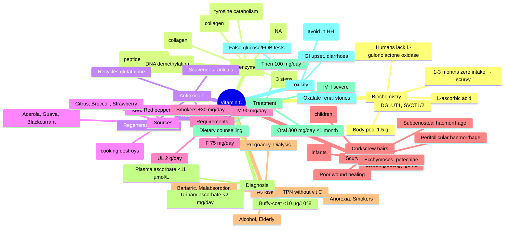

**Related:** [[Nutritional Factors in Disease MOC]], [[Davidson Chapter 22 - Nutritional Factors in Disease Hierarchy]], [[../00_Index/Medicine MOC|Medicine MOC]]

> [!important]
> **Vitamin C (ascorbic acid) = cofactor for prolyl/lysyl hydroxylase (collagen synthesis), dopamine β-hydroxylase (NA), peptidylglycine α-amidating monooxygenase (PAM); antioxidant (regenerates E, glutathione); deficiency = scurvy (bleeding gums, perifollicular haemorrhage, poor wound healing, corkscrew hairs); smokers +30 mg/day.**

## 1. 1. Learning Objectives
- [ ] Describe ascorbic acid structure, sources (fruits/veg, NOT produced endogenously), absorption (DGLUT1/SVCT1, sodium-dependent), renal reabsorption
- [ ] List functions: cofactor for prolyl/lysyl hydroxylase (collagen cross-linking), dopamine β-hydroxylase (NA synthesis), PAM (peptide amidation), carnitine synthesis, Fe³⁺ → Fe²⁺ reduction
- [ ] Recognise scurvy: perifollicular haemorrhages, corkscrew hairs, bleeding/spongy gums, subperiosteal haemorrhages, poor wound healing, ecchymosis, joint effusions
- [ ] Identify at-risk: alcohol, elderly, restrictive diet, "tea-and-toast", anorexia, dialysis, post-bariatric
- [ ] State diagnosis: plasma ascorbate <11 µmol/L; buffy-coat (leucocyte) ascorbate = tissue stores
- [ ] Treatment: oral vitamin C 300 mg/day ×1 month (loading), then 100 mg/day maintenance; parenteral if needed
- [ ] Smoking +30 mg/day requirement; megadose (>1 g/day) → renal stones, GI upset, oxalate

## 2. 2. Definitions / Key Concepts

| Term | Definition |
|------|------------|
| **Ascorbic Acid (Vitamin C)** | Water-soluble; 6-carbon lactone; cofactor for 8 human enzymes; L-gulonate pathway defective in humans (cannot synthesise) |
| **DGLUT1 (Glucose Transporter 1)** | Low-affinity, high-capacity ascorbate transporter; intestinal, RBC uptake |
| **SVCT1 / SVCT2 (Sodium-Ascorbate Cotransporters)** | SLC23A1 (intestine, liver, kidney) / SLC23A2 (brain, adrenal, eye) |
| **Dehydroascorbate (DHA)** | Oxidised form; transported by GLUT1 (intracellular reduction by GSH/NADH) |
| **Prolyl Hydroxylase** | Ascorbate + Fe²⁺ + α-ketoglutarate → hydroxylation of proline in collagen → triple helix stability; deficiency → defective collagen |
| **Lysyl Hydroxylase** | Similar mechanism; hydroxylysine for collagen cross-linking; deficiency → Ehlers-Danlos-like features |
| **Dopamine β-Hydroxylase** | Ascorbate + Cu → dopamine → noradrenaline (chromaffin granules, sympathetic nerve endings) |
| **PAM (Peptidylglycine α-Amidating Monooxygenase)** | Ascorbate + Cu → peptide C-terminal α-amidation (TRH, oxytocin, vasopressin, gastrin, cholecystokinin) |
| **Carnitine Biosynthesis** | Ascorbate + Fe + α-KG hydroxylases → trimethyllysine → carnitine (FA β-oxidation) |
| **TET (Ten-Eleven Translocation) Enzymes** | Ascorbate cofactor for DNA/RNA demethylation; Fe²⁺ regeneration; cancer/stem cell role |
| **Hypoxia-Inducible Factor (HIF)** | Prolyl hydroxylase destabilises HIF-1α in normoxia; ascorbate (recycles Fe²⁺) → ↓HIF-1α (anti-tumour?) |
| **Scurvy** | Frank deficiency (<10 mg/day × 1–3 months); bleeding gums, perifollicular, corkscrew hairs, poor wound healing |
| **Perifollicular Haemorrhage** | Pathognomonic; peribulbar pinpoint haemorrhages; typically lower extremities; "S-curvy sign" |
| **Corkscrew (Swollen) Hairs** | Hyperkeratotic hair follicles; corkscrew/curled; pathognomonic |
| **Subperiosteal Haemorrhage** | Children; pain, swelling, pseudoparalysis; can mimic osteomyelitis/tumour |
| **Scorbutic Rosary** | Costochondral beading in children (similar to rickets but in scurvy) |
| **Sjögren's Syndrome (Not to confuse)** | Sicca syndrome; different entity; coexists with vit C issues? No |
| **Smokers** | ↑Turnover, ↓plasma ascorbate; +30 mg/day; oxidative stress |
| **Haemochromatosis** | Iron overload; vit C ↑Fe absorption (avoid supplementation in HH); antioxidant paradox |

## 3. 3. Core Content

### 1. Section 1: Ascorbic Acid Biochemistry
**Structure:** L-ascorbic acid = 2,3-enediol-L-gulonic acid lactone; reversible oxidation to dehydroascorbate (DHA).
**Synthesis:** Most mammals synthesise from UDP-glucose → L-gulonate → L-gulono-γ-lactone → ascorbate (L-gulonolactone oxidase). **Humans, primates, guinea pigs LACK L-gulonolactone oxidase** (pseudogene) → dietary essential.
**Absorption:** Small intestine; **DGLUT1** (low affinity, high capacity) for DHA; **SVCT1** (SLC23A1) for ascorbate; **dose-dependent passive diffusion** at high dose (>200 mg).
**Tissue distribution:** Adrenal cortex (high), pituitary, brain, eye, liver, kidney, pancreas; **very low in muscle**; total body pool 1.5 g.
**Transport in plasma:** Free ascorbate (saturable).
**Renal handling:** Filtered + reabsorbed (SVCT1, threshold ~85 µmol/L); saturation → oxalate excretion; **megadose → renal oxalate stones**.
**Excretion:** Oxalate (major metabolite), 2,3-diketo-L-gulonate.

### 2. Section 2: 8 Human Enzymes Requiring Ascorbate
1. **Prolyl 3-hydroxylase, Prolyl 4-hydroxylase:** Collagen triple helix stability
2. **Lysyl hydroxylase:** Collagen cross-linking
3. **Dopamine β-hydroxylase:** Dopamine → Noradrenaline
4. **PAM (Peptidylglycine α-amidating monooxygenase):** C-terminal peptide amidation (TRH, oxytocin, AVP, gastrin, CCK)
5. **Trimethyllysine hydroxylase:** Carnitine biosynthesis (FA β-oxidation)
6. **6-N-Trimethyllysine hydroxylase:** Carnitine (alternative pathway)
7. **γ-Butyrobetaine hydroxylase:** Carnitine (final step)
8. **4-Hydroxyphenylpyruvate dioxygenase (4-HPPD):** Tyrosine catabolism; deficiency → tyrosinaemia II (tyrosyluria, palmoplantar keratosis, intellectual disability)

### 3. Section 3: Antioxidant Function
**Direct antioxidant:** Ascorbate + radical (R•) → semidehydroascorbyl radical + RH; regenerates vitamin E (tocopheroxyl radical → tocopherol).
**Glutathione cycle:** Ascorbate + DHA reductase + GSH → regenerate ascorbate from DHA.
**Neutrophil function:** Ascorbate concentrated in neutrophils (mM); protects against ROS; deficiency → impaired chemotaxis, phagocytosis.
**Iron metabolism:** Reduces dietary Fe³⁺ → Fe²⁺ (duodenal DMT1 uptake); also mobilises stored Fe (ferritin → transferrin).
**Cofactor for TET 5-methylcytosine demethylation:** Ascorbate regenerates Fe²⁺ for TET enzymes; DNA/RNA demethylation; epigenetic regulation; cancer/stem cell biology.

### 4. Section 4: Requirements & Sources
**RDA (EFSA 2013 / IOM 2000):**
- Adult male: 90 mg/day
- Adult female: 75 mg/day
- Pregnancy: 85 mg/day (UK 50 mg)
- Lactation: 120 mg/day
- Smokers: +30 mg/day (extra requirement)
- Sepsis/burns/critical illness: ↑dose (200–1000 mg/day, controversial)

**UL:** 2 g/day (renal stones, GI upset, oxalate)
**Sources (mg/100 g):**
- Acerola (1677), Guava (228), Blackcurrant (181), Red pepper (128), Kiwi (93), Strawberry (59), Orange (53), Broccoli (89), Cauliflower (48), Potato (20)
- **Citrus** is the iconic source but many fruits/veg higher
- **Water-soluble, thermolabile:** Overcooking destroys 50–80%
- **Body stores 1.5 g**; deficiency after 1–3 months zero intake

### 5. Section 5: Scurvy — Clinical Features
| Category | Features |
|----------|----------|
| **Cutaneous** | **Perifollicular haemorrhages** (legs); **corkscrew hairs**; hyperkeratosis; ecchymoses; petechiae (especially pressure sites) |
| **Gingival** | **Bleeding, swollen, spongy gums**; gum hypertrophy; loosening of teeth; halitosis |
| **Subperiosteal** | Bone pain, swelling, tenderness (esp. long bones); pseudoparalysis; cortical thinning |
| **Joint** | Effusions (haemarthrosis); myalgia; bone pain |
| **Wound healing** | **Poor wound healing**; scars reopen; keloid formation; surgical dehiscence |
| **Cardiac** | Pericardial effusion; ECG changes (ST, T wave); arrhythmias; hypotension |
| **Constitutional** | Fatigue, weakness, anorexia, weight loss, depression |
| **Anaemia** | Multifactorial: GI bleeding, ↓iron absorption, ↓folate, haemolysis, ACD, sideroblastic (B6) |
| **Children (Barlow's disease)** | Scorbutic rosary (costochondral); pseudoparalysis; tenderness; poor growth |

**Pathophysiology:** ↓Prolyl/lysyl hydroxylase → ↓hydroxyproline/hydroxylysine → defective collagen cross-linking → blood vessel fragility, poor wound healing, gum fragility, bone matrix defects.

### 6. Section 6: At-Risk Groups
| Group | Mechanism |
|-------|-----------|
| **Alcohol / Drug use** | ↓Intake, ↓absorption, lifestyle |
| **Elderly** | "Tea-and-toast" diet, poor intake, smoking history |
| **Anorexia / Bulimia** | Severe restriction |
| **Smokers** | ↑Turnover, ↓plasma; +30 mg/day |
| **Pregnancy/Lactation** | ↑Demand |
| **Malabsorption** | Coeliac, Crohn's, bariatric, Whipple's |
| **Dialysis** | Loss in dialysate |
| **TPN without vitamin C** | Ascorbate 100 mg/day must be added |
| **Scurvy historically** | Sailors, polar explorers, prisoners, refugees |
| **Children (restrictive diet)** | Cow's milk (low vit C), boiled/processed foods |

### 7. Section 7: Diagnosis
| Test | Normal | Deficiency | Notes |
|------|--------|------------|-------|
| **Plasma ascorbate** | 40–80 µmol/L | <11 µmol/L (deficiency) | Acute status; <10 µmol/L = scurvy |
| **Buffy-coat (leucocyte) ascorbate** | 20–50 µg/10⁸ cells | <10 µg/10⁸ | Tissue stores (preferred) |
| **24h urinary ascorbate** | >10 mg/day | <2 mg/day | If normal, scurvy unlikely |
| **Clinical** | — | Perifollicular, corkscrew hairs, gum | Usually sufficient |

### 8. Section 8: Treatment
**Scurvy:**
- **Oral vitamin C 300 mg/day × 1 month** (or 1 g/day × 1 week, then 100 mg/day)
- **IV vitamin C 200 mg/day** if severe/intolerance (rare)
- **Multivitamin** if other deficiencies suspected
- **Dietary counselling** (citrus, peppers, broccoli, kiwi)
- **Smokers:** +30 mg/day ongoing
- **Infant scurvy:** 50–100 mg IV/PO daily

**Toxicity (>1 g/day chronic):**
- **Renal:** Calcium oxalate stones (hyperoxaluria)
- **GI:** Diarrhoea, nausea, abdominal cramps
- **Iron overload:** In haemochromatosis, ↑iron absorption
- **False lab:** Glucose (ascorbate interferes with some assays → falsely low/elevated); faecal occult blood (false negative)
- **Pro-oxidant at high dose?** Theoretical; cancer patients caution
- **Increased risk of cardiovascular events?** Conflicting data

**Therapeutic doses (controversial):**
- **Sepsis (CITRIS-ALI):** No benefit (high-dose IV vit C in ARDS)
- **Common cold prevention:** Modest effect (~0.5–1 day shorter); prophylactic in extreme physical stress
- **Cancer:** IV high-dose controversial (pancreatic); pro-oxidant mechanism
- **Iron deficiency:** Augment iron absorption (co-administer with iron supplements)
- **Scurvy prevention in TPN:** 100 mg/day added

## 4. 4. Clinical Correlation

| Scenario | Action | Notes |
|----------|--------|-------|
| 65M, "tea-and-toast" diet, gum bleeding, perifollicular haemorrhages | **Vitamin C 300 mg/day ×1 month, then 100 mg/day**; dietary counselling | Scurvy; address social isolation |
| 30F, restrictive diet (anorexia), poor wound healing after surgery, corkscrew hairs | **Vitamin C 500 mg IV daily ×5, then oral 200 mg/day**; nutritional rehab | Severe scurvy; refeeding risk |
| 6m infant, cow's milk, irritability, pseudoparalysis, scorbutic rosary | **Vitamin C 100 mg IV, then 50 mg daily**; weaning, citrus/veg | Barlow's disease |
| 50M, smoker (30 pack-years), recurrent gum bleeding, petechiae | **Vitamin C 100 mg/day ongoing**; smoking cessation | Smoker requirement +30 mg/day |
| 70M, haemochromatosis, ↑Fe, on phlebotomy, considering high-dose vit C | **AVOID high-dose vitamin C** (>500 mg) — ↑iron absorption → Fe overload | HH: avoid megadose |
| 80M, post-hip surgery, dehiscence, ↑CRP, marginal nutrition | **Vitamin C 200 mg/day**; protein; wound care | Wound healing support |
| 25F, on OCP, recurrent epistaxis, gum bleeding, plasma ascorbate 15 µmol/L | **Vitamin C 200 mg/day**; dietary improvement | Mild scurvy; smokers/co-factors |

## 5. 5. High-Yield FCPS/MRCP Points

> [!important]
> - **Must know:** Humans cannot synthesise (L-gulonolactone oxidase mutation); functions: prolyl/lysyl hydroxylase (collagen), dopamine β-hydroxylase (NA), PAM (peptide amidation), Fe³⁺ reduction; scurvy signs (perifollicular haemorrhage, corkscrew hairs, bleeding gums, poor wound healing); RDA 90 (M) / 75 (F) mg/day; smokers +30 mg; treatment 300 mg/day ×1 month
> - **Common viva:** Why humans need dietary vit C; scurvy clinical features; smokers requirement; prolyl hydroxylase mechanism; TET enzyme role; renal oxalate stones with megadose; children scurvy (Barlow)
> - **Exam trap:** Confusing scurvy gum bleeding with periodontal disease; missing corkscrew hairs; thinking orange has highest vit C; recommending in haemochromatosis; megadose cancer treatment (controversial)

## 6. 6. Common Confusions / Exam Traps

| Trap | Correction |
|------|------------|
| Citrus = highest vitamin C | **Acerola (1677), Guava (228), Blackcurrant (181) > Orange (53)** |
| All mammals synthesise vit C | **Humans, primates, guinea pigs CANNOT** (L-gulonolactone oxidase defect) |
| Vit C prevents common cold | **Marginal effect** (0.5–1d shorter); modest in extreme stress; not preventive |
| Scurvy only with severe dietary restriction | **Within 1–3 months zero intake**; smokers, elderly, restrictive diets |
| Perifollicular haemorrhages = vasculitis | **Corkscrew hairs + gum bleeding distinguishes scurvy** |
| Vitamin C megadose for cancer | **CITRIS-ALI: no benefit in sepsis; cancer use controversial** |
| Vitamin C ↑Fe absorption in IDA only | **In haemochromatosis, ↑Fe absorption → Fe overload → AVOID** |
| Megadose safe | **UL 2 g/day**; oxalate stones, GI upset, false glucose/FOB tests |

## 7. 7. Mnemonics

- **Vit C = Ascorbic acid (ascorb = against scurvy)**
- **Sources high → low:** **AGBKR** = **A**cerola, **G**uava, **B**lackcurrant, **K**iwi, **R**ed pepper
- **Scurvy triad:** **PGW** = **P**erifollicular, **G**um bleeding, **W**ound healing poor
- **Corkscrew hairs + perifollicular = pathognomonic**
- **RDA:** **90/75** = 90 mg M / 75 mg F; **+30** smokers
- **UL:** **2 g/day** (oxalate stones)
- **Ascorbate enzymes:** **3 H + PAM + DBH + Carnitine + 4HPPD** = 3 hydroxylases (prolyl, lysyl, trimethyllysine) + 3 (PAM, DBH, carnitine) + 4HPPD = 8
- **Scurvy deficiency time:** **1–3 months** (body pool 1.5 g)
- **Subperiosteal haemorrhage** → children → pseudoparalysis, bone pain
- **Scurvy = collagen problem** (defective cross-linking, hydroxyproline/hydroxylysine)

## 8. 8. Mind Map

## 9. 9. -Hour Recall Prompts
1. Humans cannot synthesise vit C (L-gulonolactone oxidase); dietary essential
2. Functions: prolyl/lysyl hydroxylase (collagen), dopamine β-hydroxylase, PAM, carnitine
3. Scurvy triad: perifollicular haemorrhage, corkscrew hairs, bleeding gums
4. RDA 90/75 mg; smokers +30 mg; UL 2 g/day
5. At-risk: alcohol, elderly, restrictive diet, smoking, TPN
6. Treatment: 300 mg/day oral ×1 month
7. Megadose: oxalate stones, GI upset, false glucose
8. TET enzymes: DNA/RNA demethylation (cancer/stem cell role)

## 10. 10. -Day / 15-Day / 30-Day Revision Tracker

| Day | Date | Recall Quality (1-5) | Time Spent | Notes |
|-----|------|---------------------|------------|-------|
| 1   |      |                     |            |       |
| 7   |      |                     |            |       |
| 15  |      |                     |            |       |
| 30  |      |                     |            |       |

---

## 11. 11. Must Know / Should Know / Nice to Know

| Priority | Content |
|----------|---------|
| **Must Know 🔴** | Cannot synthesise (L-gulonolactone oxidase); prolyl/lysyl hydroxylase (collagen); scurvy clinical features (perifollicular, corkscrew, gums, wound healing); RDA 90/75 mg; smokers +30 mg; treatment 300 mg ×1 month; UL 2 g (oxalate) |
| **Should Know 🟡** | 8 enzymes; TET demethylation; carnitine synthesis; PAM peptide amidation; CITRIS-ALI (no benefit in sepsis); subperiosteal haemorrhage; Barlow's disease; iron enhancement (avoid in HH) |
| **Nice to Know 🟢** | Acerola/guava (highest); ascorbate in cancer (controversial); ICU/high-dose vit C; vit C in Charcot-Marie-Tooth (some forms); histamine degradation; nitrosamine reduction |

## 12. 12. My Weak Points
- [ ] TET enzyme mechanism detail
- [ ] CITRIS-ALI trial design
- [ ] High-dose vit C in cancer (Mehlman et al. controversies)

## 13. 13. Self-Test Scorecard

| Domain | Score /10 | Target /10 |
|--------|-----------|------------|
| Understanding |    | 8+ |
| Recall |    | 8+ |
| MCQ Performance |    | 8+ |
| SBA Performance |    | 8+ |
| Viva Confidence |    | 8+ |
| **TOTAL** |    | **40+/50** |

## 14. 14. Exam Answer Modes

### 1. Long Answer / Essay (20 min)
**Topic:** "Vitamin C: biochemistry, deficiency, and management"
- Chemistry: L-ascorbate; humans lack L-gulonolactone oxidase (cannot synthesise)
- Functions: prolyl/lysyl hydroxylase (collagen cross-linking), dopamine β-hydroxylase (NA), PAM (peptide amidation), carnitine synthesis, TET (DNA demethylation)
- Antioxidant: scavenges radicals, regenerates vit E
- Scurvy: perifollicular haemorrhages, corkscrew hairs, bleeding gums, poor wound healing, subperiosteal (children, Barlow)
- RDA 90/75 mg; smokers +30 mg; UL 2 g (oxalate)
- At-risk: alcohol, elderly, restrictive diet, TPN
- Treatment: 300 mg/day oral ×1 month; dietary counselling
- Toxicity: renal oxalate, false glucose/FOB; avoid in HH

### 2. Short Note (7 min)
**Topic:** "Scurvy: Clinical Features and Pathophysiology"
- **Pathophysiology:** ↓Prolyl/lysyl hydroxylase (Fe²⁺ + α-KG + ascorbate) → ↓hydroxyproline/hydroxylysine → defective collagen cross-linking → vessel fragility, poor wound healing, gum fragility
- **Features:** **Perifollicular haemorrhages** (legs), **corkscrew hairs**, **bleeding/spongy gums**, poor wound healing, subperiosteal haemorrhage (children), ecchymoses, joint effusions
- **Children (Barlow's):** Pseudoparalysis, scorbutic rosary, irritability
- **Diagnosis:** Plasma ascorbate <11 µmol/L; clinical response to vitamin C
- **Treatment:** 300 mg/day oral ×1 month; dietary counselling

### 3. Viva Answer (3 min)
**Q:** "Why do humans require dietary vitamin C?"
"A: **Most mammals synthesise L-ascorbic acid from UDP-glucose via L-gulonolactone oxidase** in the liver/kidney. **Humans, primates, and guinea pigs have a non-functional L-gulonolactone oxidase gene** (pseudogene) → cannot synthesise → dietary essential. **RDA 90 mg (M) / 75 mg (F); smokers +30 mg/day** (oxidative stress)."

### 4. Ward Case Discussion (5 min)
**Case:** 70M, recently widowed, "tea-and-toast" diet, presents with gum bleeding, leg petechiae, and corkscrew hairs on abdomen. Plasma ascorbate 8 µmol/L.
"Diagnosis: **Scurvy** (vit C deficiency; 1–3 months inadequate intake). **Treatment: Vitamin C 300 mg PO daily ×1 month**, then 100 mg/day. **Dietary counselling** (citrus, peppers, broccoli, kiwi). **Address social issues** (bereavement, isolation, ability to shop/cook). Smoker status — add +30 mg. **Multivitamin** for other deficiencies (thiamine, folate, B12, Fe)."

### 5. Last-Night-Before-Exam Sheet (1 min)
- **Chemistry:** L-ascorbate; humans lack L-gulonolactone oxidase (cannot synthesise)
- **Functions:** Prolyl/lysyl hydroxylase (collagen), dopamine β-hydroxylase (NA), PAM (peptide amidation), carnitine, TET (DNA demethylation)
- **Scurvy:** Perifollicular haemorrhages, corkscrew hairs, bleeding gums, poor wound healing
- **Children:** Subperiosteal haemorrhage, scorbutic rosary (Barlow's)
- **RDA:** 90/75 mg (M/F); Smokers +30 mg; UL 2 g (oxalate)
- **Sources:** Acerola, Guava, Blackcurrant > Citrus; thermolabile (cooking destroys)
- **Treatment:** 300 mg/day oral ×1 month, then 100 mg/day
- **Toxicity:** Oxalate renal stones, GI upset, false glucose/FOB; **avoid high-dose in haemochromatosis**

## 15. 15. MCQs (10)

1. **Ascorbic acid cofactor for collagen synthesis:**
   A. Dopamine β-hydroxylase  
   B. **Prolyl/lysyl hydroxylase**  
   C. Tryptophan hydroxylase  
   D. Tyrosine hydroxylase  
   E. Phenylalanine hydroxylase  

2. **Pathognomonic skin finding in scurvy:**
   A. Henoch-Schönlein purpura  
   B. **Perifollicular haemorrhages with corkscrew hairs**  
   C. Erythema multiforme  
   D. Pyoderma gangrenosum  
   E. Kaposi sarcoma  

3. **RDA vitamin C for adult male (US/UK):**
   A. 30 mg  
   B. 50 mg  
   C. **90 mg**  
   D. 200 mg  
   E. 500 mg  

4. **Additional vitamin C requirement in smokers:**
   A. 10 mg  
   B. **30 mg**  
   C. 50 mg  
   D. 100 mg  
   E. 200 mg  

5. **Vitamin C deficiency in children (Barlow's disease) features:**
   A. Genu valgum  
   B. **Subperiosteal haemorrhages, scorbutic rosary, pseudoparalysis**  
   C. Craniotabes  
   D. Harrison's groove  
   E. Bowed legs  

6. **Vitamin C megadose (>1 g/day) toxicity:**
   A. Hepatotoxicity  
   B. **Oxalate renal stones, diarrhoea, false glucose/FOB tests**  
   C. Retinotoxicity  
   D. Ototoxicity  
   E. Cardiotoxicity  

7. **Human capability regarding vitamin C synthesis:**
   A. Synthesise from UDP-glucose  
   B. **Cannot synthesise (L-gulonolactone oxidase pseudogene)**  
   C. Synthesise from amino acids  
   D. Convert from vitamin A  
   E. Synthesise gut bacteria-derived  

8. **Vitamin C enhances absorption of:**
   A. Calcium  
   B. **Iron (Fe³⁺ → Fe²⁺)**  
   C. Vitamin D  
   D. Vitamin B12  
   E. Folate  

9. **Cofactor for dopamine β-hydroxylase (dopamine → noradrenaline):**
   A. NAD  
   B. **Ascorbate + Copper**  
   C. FAD  
   D. PLP  
   E. Biotin  

10. **CITRIS-ALI trial finding (high-dose IV vitamin C in sepsis/ARDS):**
    A. Reduced mortality  
    B. Reduced organ failure  
    C. **No benefit (improved SOFA, but no mortality reduction)**  
    D. Increased mortality  
    E. Improved vasopressor requirements  

## 16. 16. SBA Questions (5)

1. **A 60-year-old alcoholic man presents with bleeding, swollen gums, corkscrew hairs on the abdomen, and perifollicular haemorrhages on the lower extremities. Plasma ascorbate 8 µmol/L. Best treatment?**
   A. Fresh frozen plasma  
   B. **Vitamin C 300 mg PO daily ×1 month**  
   C. Vitamin C 1 g IV daily ×3 days  
   D. Vitamin K 10 mg IV  
   E. Iron supplementation  

2. **A 30-year-old woman is being investigated for iron deficiency anaemia. She has heavy menstrual periods and is advised to take iron supplements. What cofactor enhances iron absorption?**
   A. Calcium  
   B. **Vitamin C (ascorbic acid)**  
   C. Vitamin D  
   D. Vitamin B12  
   E. Folate  

3. **A 65-year-old man with hereditary haemochromatosis is considering supplementation with high-dose vitamin C. What is the concern?**
   A. Increased cardiovascular risk  
   B. **Increased iron absorption and tissue iron deposition**  
   C. Increased vitamin A toxicity  
   D. Increased copper absorption  
   E. Decreased folate absorption  

4. **A 50-year-old smoker with gum bleeding and recurrent infections. Smoker (40 pack-years). What is his additional vitamin C requirement beyond the standard RDA?**
   A. 0 mg  
   B. 10 mg  
   C. **30 mg**  
   D. 100 mg  
   E. 200 mg  

5. **A 6-month-old infant on cow's milk (not breastfed) presents with irritability, pseudoparalysis of the leg, painful swelling of the thigh, and scorbutic rosary. Most likely diagnosis?**
   A. Rickets  
   B. **Infantile scurvy (Barlow's disease)**  
   C. Osteomyelitis  
   D. Septic arthritis  
   E. Congenital syphilis  

## 17. 17. Flashcards

- Q: Vit C synthesis in humans  
  A: **CANNOT** synthesise (L-gulonolactone oxidase pseudogene); dietary essential
- Q: Vit C cofactor for collagen  
  A: **Prolyl/lysyl hydroxylase** (Fe²⁺ + α-KG + ascorbate → hydroxylation)
- Q: Scurvy pathognomonic  
  A: **Perifollicular haemorrhages + corkscrew hairs + bleeding gums**
- Q: Vit C RDA (M/F)  
  A: **90/75 mg/day**; Smokers +30 mg/day
- Q: Scurvy deficiency time  
  A: **1–3 months** zero intake (body pool 1.5 g)
- Q: Vit C UL  
  A: **2 g/day** (oxalate renal stones, diarrhoea)
- Q: 8 Vit C enzymes  
  A: **3 hydroxylases (prolyl, lysyl, trimethyllysine) + DBH + PAM + Carnitine + 4HPPD** = 8
- Q: Vit C + iron  
  A: **Reduces Fe³⁺ → Fe²⁺** (enhances duodenal absorption); **AVOID high-dose in HH**
- Q: Children scurvy  
  A: **Barlow's disease: subperiosteal haemorrhage, scorbutic rosary, pseudoparalysis**
- Q: Sources high to low  
  A: **AGBKR** = Acerola, Guava, Blackcurrant, Kiwi, Red pepper > Citrus

## 18. 18. Answer Key with Explanations

### 1. MCQs
1. **B** — Prolyl/lysyl hydroxylase requires ascorbate + Fe²⁺ + α-ketoglutarate; hydroxylates proline/lysine in collagen for triple helix stability.
2. **B** — Perifollicular haemorrhages with corkscrew hairs is pathognomonic for scurvy.
3. **C** — RDA (US/IOM 2000): 90 mg/day for adult males; 75 mg for females.
4. **B** — Smokers have increased turnover and oxidative stress; require +30 mg/day.
5. **B** — Infantile scurvy (Barlow's disease): subperiosteal haemorrhages, painful pseudoparalysis, scorbutic rosary, gingival bleeding.
6. **B** — Megadose toxicity: oxalate renal stones (calcium oxalate), osmotic diarrhoea, false lab values (glucose, faecal occult blood).
7. **B** — Humans have non-functional L-gulonolactone oxidase (pseudogene) → cannot synthesise; dietary essential.
8. **B** — Ascorbate reduces Fe³⁺ to Fe²⁺ → enhanced duodenal absorption via DMT1.
9. **B** — Dopamine β-hydroxylase requires ascorbate + copper; converts dopamine to noradrenaline in chromaffin granules/sympathetic nerves.
10. **C** — CITRIS-ALI: high-dose IV vitamin C in sepsis/ARDS improved SOFA scores but did not reduce mortality or organ failure.

### 2. SBAs
1. **B** — Scurvy (clinical + plasma ascorbate 8 µmol/L): oral vitamin C 300 mg daily ×1 month; dietary counselling.
2. **B** — Vitamin C reduces dietary Fe³⁺ to absorbable Fe²⁺; co-administer with iron supplements for IDA.
3. **B** — Haemochromatosis: avoid high-dose vitamin C (>500 mg) due to increased iron absorption → iron overload/worsening tissue damage.
4. **C** — Smokers require +30 mg/day beyond standard RDA due to increased turnover and oxidative stress.
5. **B** — Barlow's disease: cow's milk low in vit C (and iron); infantile scurvy with subperiosteal haemorrhage, scorbutic rosary, pseudoparalysis.

## 19. 19. Summary

**Vitamin C (Ascorbic Acid)** is a **Must Know 🔴** topic for FCPS/MRCP.
**Key takeaway:** Humans cannot synthesise (L-gulonolactone oxidase mutation); essential for **prolyl/lysyl hydroxylase (collagen)**, dopamine β-hydroxylase (NA), PAM, carnitine, TET. **Scurvy: perifollicular haemorrhage + corkscrew hairs + bleeding gums + poor wound healing.** RDA 90/75 mg; **smokers +30 mg**; UL 2 g (oxalate stones). Children: Barlow's disease (subperiosteal haemorrhage, scorbutic rosary). Treatment: **300 mg/day oral ×1 month.** Avoid high-dose in haemochromatosis (↑Fe absorption). CITRIS-ALI: no benefit in sepsis.
**Exam focus:** 8 enzymes, scurvy clinical features, RDA + smokers, subperiosteal in children, oxalate toxicity, TET demethylation, Fe enhancement.
**Clinical relevance:** Smoker counselling; elderly "tea-and-toast" diet; wound healing support; TPN supplementation; co-administration with iron.

*Template version: 1.0 | Davidson 24e Ch 22 aligned | FCPS/MRCP oriented*
