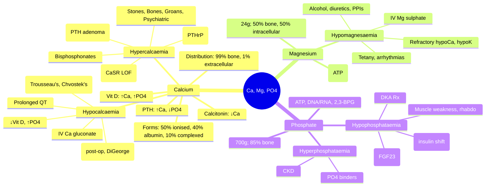

**Related:** [[Nutritional Factors in Disease MOC]], [[Davidson Chapter 22 - Nutritional Factors in Disease Hierarchy]], [[../00_Index/Medicine MOC|Medicine MOC]]

> [!important]
> **Ca²⁺ 1–1.2 kg (99% bone/teeth, 1% extracellular); PTH/Vit D/Calcitonin regulate; Mg²⁺ 24 g (50% bone, 50% intracellular); essential cofactor (ATP, kinases); Phosphate (PO4³⁻) 700 g (85% bone); critical for energy (ATP), DNA/RNA, pH buffering; deficiency: tetany, rickets/osteomalacia, arrhythmias.**

## 1. 1. Learning Objectives
- [ ] Describe calcium distribution (99% bone/teeth, 1% extracellular: 50% ionised, 40% albumin-bound, 10% complexed); RDA 1000 mg adult (1200 mg women 50+)
- [ ] Explain PTH/Vit D/Calcitonin axis: PTH ↑Ca, ↓PO4; Vit D ↑Ca, ↑PO4; Calcitonin ↓Ca
- [ ] Recognise hypocalcaemia: tetany, Chvostek's sign, Trousseau's sign, prolonged QT, seizures; correct with IV calcium gluconate if symptomatic
- [ ] Distinguish hypocalcaemia causes: hypoalbuminaemia (ionised normal), ↓PTH (post-thyroidectomy, DiGeorge), ↓Vit D (CKD, malabsorption), ↑PO4 (CKD), drugs (bisphosphonates, cinacalcet, PPIs)
- [ ] State hypercalcaemia: stones, bones, groans, psychiatric overtones; investigate PTH, then PTHrP, Vit D, malignancy
- [ ] Recognise hypomagnesaemia: neuromuscular (tetany, tremor, seizures), cardiac (arrhythmias, torsades), refractory hypocalcaemia/K+; causes: GI loss, renal, alcohol, drugs (PPIs, diuretics, amphotericin)
- [ ] State hypophosphataemia: muscle weakness, rhabdomyolysis, respiratory failure, ↓ATP, haemolysis, altered mental state; refeeding syndrome

## 2. 2. Definitions / Key Concepts

| Term | Definition |
|------|------------|
| **Calcium (Ca²⁺)** | Most abundant mineral; 1000–1200 g adult (99% bone/teeth, 1% extracellular) |
| **Ionised Ca²⁺ (50%)** | Physiologically active; pH-dependent (acidosis ↑ionised, alkalosis ↓) |
| **Albumin-bound Ca (40%)** | Affected by albumin; correct for hypoalbuminaemia: corrected Ca = measured Ca + 0.02 × (40 - albumin g/L) |
| **Complexed Ca (10%)** | Bound to bicarbonate, citrate, phosphate |
| **PTH (Parathyroid Hormone)** | 84-aa; PTH1R; ↑Ca²⁺ (bone resorption, renal Ca reabsorption, 1α-hydroxylase); ↓PO4 (renal excretion) |
| **Vitamin D (1,25(OH)2D)** | ↑Intestinal Ca/PO4 absorption; bone mineralisation; PTH secretion regulator |
| **Calcitonin** | 32-aa C-cells thyroid; ↓Ca (renal excretion, ↓bone resorption); high Ca trigger |
| **CaSR (Calcium-Sensing Receptor)** | Parathyroid chief cell; ↑Ca → ↓PTH; loss-of-function mutation = Familial Hypocalciuric Hypercalcaemia (FHH) |
| **Trousseau's Sign** | Carpopedal spasm with BP cuff inflated >systolic ×3 min; hypocalcaemia |
| **Chvostek's Sign** | Facial twitch on tap over facial nerve; hypocalcaemia (less specific) |
| **Tetany** | Perioral numbness, carpopedal spasm, laryngospasm, seizures; hypocalcaemia |
| **Hypoparathyroidism** | ↓PTH; post-thyroidectomy, autoimmune, DiGeorge (22q11.2 deletion) |
| **Pseudohypoparathyroidism** | End-organ resistance to PTH (GNAS mutation); Albright's hereditary osteodystrophy (short stature, brachydactyly, round face) |
| **Primary Hyperparathyroidism** | PTH adenoma (80%); hyperCa, hypoPO4, hypercalciuria; stones/bones/groans |
| **Hypercalcaemia of Malignancy** | PTHrP (squamous, renal, breast, ovarian); osteolytic metastases; 1,25(OH)2D (lymphoma) |
| **Hypomagnesaemia** | ↓Mg <0.7 mmol/L; neuromuscular, cardiac, refractory hypoCa/↓K |
| **Hypermagnesaemia** | ↓Neuromuscular (↓DTRs, sedation), cardiac (conduction); renal failure, Mg infusion |
| **Hypophosphataemia** | ↓PO4 <0.8 mmol/L; muscle weakness, rhabdomyolysis, ↓ATP; refeeding, alcohol, DKA Rx |
| **Hyperphosphataemia** | ↑PO4; ectopic calcification, ↓Ca, secondary HPT; CKD, tumour lysis |
| **Hypocalciuric Hypercalcaemia (FHH)** | CaSR loss-of-function; mild hyperCa, low urinary Ca, normal/inappropriately normal PTH; benign |
| **Milk-Alkali Syndrome** | HyperCa + metabolic alkalosis + renal insufficiency; excess Ca carbonate |

## 3. 3. Core Content

### 1. Section 1: Calcium Homeostasis
**Distribution:** 1–1.2 kg adult; **99% bone/teeth** (hydroxyapatite); 1% extracellular.
**Plasma Ca (2.2–2.6 mmol/L = 8.5–10.5 mg/dL):**
- Ionised (50%, 1.1–1.3 mmol/L): Physiologically active
- Albumin-bound (40%): Affected by albumin
- Complexed (10%): Bicarbonate, citrate, phosphate

**Calcium-Sensing Receptor (CaSR):** Parathyroid chief cell; ↓Ca → ↑PTH; ↑Ca → ↓PTH; renal Ca excretion regulated.

**Bone Remodelling:** Osteoclasts (resorption, RANKL/OPG axis) + osteoblasts (formation, BMP, Wnt); coupled process; ↑PTH favours resorption.

**PTH Actions (PTH1R receptor):**
- **Bone:** ↑Resorption (↑RANKL) → ↑Ca, ↑PO4 release
- **Kidney:** ↑Ca reabsorption (DCT); ↓PO4 reabsorption (proximal); ↑1α-hydroxylase → 1,25(OH)2D
- **Net effect:** ↑Ca, ↓PO4, ↑Vit D

**Vit D Actions (1,25(OH)2D via VDR):**
- **Intestine:** ↑TRPV6, calbindin-D9k, PMCA1b → active transcellular Ca absorption
- **Bone:** ↑Mineralisation (if Ca×PO4 adequate), ↑RANKL (long-term resorption)
- **Kidney:** ↑Ca reabsorption (weak)

**Calcitonin Actions (CTR):**
- **Bone:** ↓Resorption (acute)
- **Kidney:** ↑Ca, PO4 excretion
- **Physiological:** Minor; thyroidectomy doesn't disturb Ca (calcitonin not essential)

### 2. Section 2: Hypocalcaemia
**Causes:**
| Category | Examples |
|----------|----------|
| **↓PTH** | Post-thyroidectomy (transient/permanent), autoimmune, DiGeorge (22q11.2), congenital, hypomagnesaemia (functional hypoparathyroidism) |
| **PTH resistance** | Pseudohypoparathyroidism (GNAS, Albright's) |
| **↓Vit D** | Nutritional, malabsorption (coeliac, bariatric), CKD, liver disease (↓25-OH), 1α-hydroxylase deficiency (VDDR I), VDR mutation (VDDR II) |
| **↑PO4** | CKD (PO4-Ca precipitation), tumour lysis, rhabdomyolysis, hypoparathyroidism |
| **Drugs** | Bisphosphonates, denosumab, cinacalcet, PPIs (long-term ↓Ca absorption), foscarnet, pentamidine (↓PTH), citrate (transfusion) |
| **Acute** | Acute pancreatitis (saponification), transfusional citrate, post-parathyroidectomy |

**Clinical Features (acute):**
- **Neuromuscular:** Perioral numbness, paresthesia, carpopedal spasm, laryngospasm, bronchospasm, seizures, Chvostek's, Trousseau's
- **Cardiac:** Prolonged QT, torsades, ↓contractility, heart failure
- **Chronic:** Cataract, basal ganglia calcification, ↓myocardial contractility, dementia, papilloedema, dental hypoplasia

**Diagnosis & Investigation:**
- ↓Total Ca (or ionised); **correct for albumin** (corrected Ca)
- **↓PTH:** Hypoparathyroidism, DiGeorge, post-surgical, hypomagnesaemia
- **↑PTH:** Pseudohypoparathyroidism, ↓Vit D, CKD, PTH resistance
- **Mg²⁺:** Hypomagnesaemia = functional hypoparathyroidism
- **PO4, ALP, Vit D, PTHrP, U&Es, Mg, ECG** (QT)

**Treatment:**
| Setting | Treatment |
|---------|-----------|
| **Severe symptomatic (tetany, seizures, prolonged QT)** | **IV calcium gluconate 10% (1 g = 2.2 mmol Ca²⁺) in 50 mL D5W over 10–20 min**; cardiac monitor; **NOT calcium chloride IV (necrosis if extravasation)** |
| **Mild/asymptomatic** | Oral Ca carbonate 1–2 g/day (40% elemental); **calcium citrate** (better absorption, no acid required) |
| **Hypoparathyroidism** | Ca + active Vit D (calcitriol 0.25–1 µg/day OR alfacalcidol); **lifelong**; target Ca low-normal (~2.0–2.1 mmol/L), 24h urinary Ca <7.5 mmol/24h (avoid hypercalciuria/kidney stones) |
| **Hypomagnesaemia** | Mg replacement first; otherwise PTH won't respond |
| **Chronic kidney disease** | Ca carbonate (also PO4 binder) + calcitriol/alfacalcidol |
| **Pseudohypoparathyroidism** | Same as hypoparathyroidism + calcitriol |

**Monitoring:** Ca²⁺, PO4, Mg, urinary Ca (24h); avoid hypercalciuria (kidney stones, nephrocalcinosis); QT interval.

### 3. Section 3: Hypercalcaemia
**Causes:**
| Category | % | PTH Status | Examples |
|----------|---|------------|----------|
| **Primary hyperparathyroidism** | 50% | ↑PTH | Parathyroid adenoma (80%), hyperplasia (15%), carcinoma (rare) |
| **Malignancy** | 35% | ↓PTH (suppressed) | PTHrP (squamous, renal, breast), osteolytic metastases (breast, myeloma), 1,25(OH)2D (lymphoma) |
| **Vit D intoxication** | <5% | ↓PTH | Excess calcitriol (granulomatous: TB, sarcoid), supplements |
| **Granulomatous** | <5% | ↓PTH | Sarcoid (1α-hydroxylase in macrophages), TB, lymphoma |
| **Endocrine** | <5% | Variable | Thyrotoxicosis (↑bone turnover), adrenal insufficiency, phaeochromocytoma |
| **Drugs** | <5% | ↓PTH | Thiazides (↓Ca excretion), lithium (shifts set-point), vitamin A (↑osteoclast) |
| **FHH** | Rare | Normal/PTH | CaSR loss-of-function; mild; benign |
| **Milk-alkali** | Rare | ↓PTH | Excessive Ca carbonate (antacids) |
| **Immobilisation** | Rare | ↓PTH | Bone resorption (Paget, spinal cord injury) |

**Clinical Features ("Stones, Bones, Groans, Psychiatric Overtones"):**
- **Stones:** Nephrolithiasis (Ca oxalate/PO4); nephrocalcinosis
- **Bones:** Osteitis fibrosa cystica (brown tumours, subperiosteal resorption, salt-and-pepper skull); osteopenia/osteoporosis
- **Groans:** Polyuria (NDI), polydipsia, nausea, vomiting, constipation, peptic ulcers, pancreatitis
- **Psychiatric overtones:** Fatigue, weakness, depression, anxiety, cognitive decline, "moans" (lethargy, coma)
- **Cardiac:** Shortened QT, arrhythmias, hypertension

**Investigation:**
- **PTH:** ↑PTH = primary HPT (adenoma); ↓PTH = non-parathyroid cause (malignancy, Vit D, etc.)
- **PTHrP:** ↑In humoral hypercalcaemia of malignancy (PTHrP, ↑Ca, ↓PTH, ↑urinary cAMP)
- **Vit D (1,25):** ↑In granulomatous (sarcoid, lymphoma), Vit D intoxication
- **Imaging:** DEXA, Sestamibi scan (parathyroid), bone scan, skeletal survey
- **Urinary Ca:** ↑Primary HPT, malignancy; **LOW FHH** (24h Ca <100 mg)
- **PO4:** ↓Primary HPT; variable malignancy

**Treatment:**
| Setting | Treatment |
|---------|-----------|
| **Severe (Ca >3.5 mmol/L or symptomatic)** | **IV NS 0.9% 4–6 L/day** (volume expansion); **furosemide 20–40 mg IV** (after rehydration; calciuresis); consider calcitonin (rapid, tachyphylaxis), bisphosphonates (zoledronate 4 mg IV, onset 2–4 days, duration weeks), denosumab (120 mg SC, refractory malignancy), dialysis |
| **Mild–moderate (Ca <3 mmol/L)** | Hydration, dietary Ca restriction ±, ambulation |
| **Primary HPT definitive** | Parathyroidectomy (MIBI-guided minimally invasive); indications: Ca >1 mg/dL above ULN, osteoporosis, T-score <−2.5, fragility fracture, age <50, renal stones, creatinine clearance <60, bone disease |
| **Malignancy** | Treat underlying; bisphosphonates, denosumab, calcitonin, hydration |
| **Vit D intoxication** | Hydration, furosemide, glucocorticoids (↓1,25 production), bisphosphonates |
| **Sarcoidosis** | Glucocorticoids (↓macrophage 1α-hydroxylase) |
| **Thiazide-induced** | Stop drug; consider thiazide-sparing alternative |
| **FHH** | No treatment; benign |

### 4. Section 4: Magnesium
**Body content:** 24 g (50% bone, 50% intracellular, 1% extracellular); cofactor for **>300 enzymes** (ATP, kinases, ATPases, ion channels).
**Plasma:** 0.7–1.0 mmol/L (2 mg/dL); 30% albumin-bound; **ionised = active form**.
**Absorption:** Small intestine (passive + active); **renal reabsorption 95%** (TAL of loop of Henle, paracellular, claudin-16/19; DCT, TRPM6/7); **no specific regulator**; ↓Mg → ↑reabsorption.

**Causes of Hypomagnesaemia:**
| Category | Examples |
|----------|----------|
| **GI loss** | Diarrhoea, malabsorption, RYGB, IBD, laxative abuse, NG suction, vomiting |
| **Renal loss** | Diuretics (loop, thiazide), hypercalcaemia, hypophosphataemia, Gitelman, Bartter, hyperaldosteronism, **alcohol** (most common) |
| **Drugs** | **PPIs** (long-term; TRPM6 inhibition), aminoglycosides, amphotericin B, cisplatin, ciclosporin, tacrolimus, pentamidine, cetuximab |
| **Endocrine** | Hyperparathyroidism (↓Mg reabsorption), hyperthyroidism, DM (glycosuria) |
| **Diet** | Alcohol, TPN without Mg, protein-calorie malnutrition, elderly |
| **Genetic** | **TRPM6 mutations** (hypomagnesaemia with secondary hypocalcaemia) |

**Clinical Features:**
- **Neuromuscular:** Tetany, tremor, myoclonus, hyperreflexia, seizures, Trousseau's, Chvostek's
- **Cardiac:** Prolonged QT, torsades de pointes, ventricular arrhythmias, atrial fibrillation
- **Refractory hypocalcaemia/hypokalaemia:** ↓PTH secretion + ↓PTH end-organ response; needs Mg replacement first
- **Metabolic:** ↓Ca (functional hypoPTH), ↓K (renal wasting), metabolic alkalosis
- **Other:** Nausea, vomiting, dysphagia, apathy, confusion

**Treatment:**
| Setting | Treatment |
|---------|-----------|
| **Severe (<0.4 mmol/L, symptomatic)** | **IV Mg sulphate 2 g (8 mmol) in 20 mL NS over 20 min** (cardiac monitor); then 5–10 g over 24h |
| **Mild/moderate** | **Oral Mg glycerophosphate, citrate, oxide** (avoid oxide — poor absorption, laxative); 12–24 mmol/day; dose-dependent diarrhoea |
| **Chronic** | Mg 200–400 mg/day (10–20 mmol); titrate to tolerance |
| **Refractory** | Consider amiloride (renal Mg wasting), combination Mg formulations |
| **TPN** | Add 8–12 mmol Mg/day |

### 5. Section 5: Phosphate
**Body content:** 700 g adult (85% bone [hydroxyapatite], 14% intracellular, 1% extracellular); critical for **ATP, DNA/RNA, 2,3-BPG, pH buffering**, cell membranes (PL).
**Plasma:** 0.8–1.5 mmol/L (2.5–4.5 mg/dL); 10–20% protein-bound, 80–90% free.
**Absorption:** Jejunum, ileum; **NaPi-IIb cotransporter** (active, vitamin D-dependent); passive diffusion (minor).
**Renal handling:** 90% reabsorbed (proximal tubule, NaPi-IIa/IIc); **PTH ↓NaPi** (phosphaturia), **FGF23 ↓NaPi** (Klotho-dependent), **Vit D ↑NaPi**.

**Causes of Hypophosphataemia:**
| Category | Examples |
|----------|----------|
| **Intracellular shift** | **Refeeding syndrome** (insulin → PO4 into cells), **DKA treatment** (insulin, ↓K, ↓PO4), respiratory alkalosis (↑pH → intracellular), β-agonists, total parenteral nutrition |
| **↓Intake** | Malnutrition, alcoholism, TPN without PO4, anorexia |
| **GI loss** | Vomiting, NG suction, diarrhoea, malabsorption, vitamin D deficiency |
| **Renal loss** | Hyperparathyroidism (primary/secondary), **FGF23 excess** (X-linked hypophosphataemic rickets XLH, tumour-induced osteomalacia), Fanconi syndrome, DKA (osmotic diuresis), acetazolamide, tenofovir |
| **Vitamin D disorders** | Vit D deficiency, X-linked hypophosphataemic rickets, tumour osteomalacia |
| **Chronic** | Osteomalacia (if prolonged) |

**Clinical Features (acute severe <0.3 mmol/L):**
- **Muscle:** Weakness, rhabdomyolysis, respiratory muscle failure, ventilator weaning failure
- **Cardiac:** ↓Contractility, arrhythmias
- **Hepatic:** ↓ATP → impaired gluconeogenesis, hepatic dysfunction
- **Haematological:** 2,3-BPG ↓ → ↓O₂ delivery, hemolysis
- **Neuro:** Irritability, confusion, seizures, coma, Guillain-Barré-like syndrome
- **Refractory:** Hypoxia despite O₂, unresponsive to inotropes

**Treatment:**
| Setting | Treatment |
|---------|-----------|
| **Severe (<0.3, symptomatic)** | **IV potassium/sodium phosphate** (15–30 mmol over 6–12h); monitor Ca (precipitation); **NOT IV calcium concurrently** |
| **Mild–moderate** | **Oral phosphate** (sodium or potassium phosphate, NeutraPhos) 1–3 g/day in divided doses; **divided doses** (avoid osmotic diarrhoea) |
| **Refeeding** | PO4 before feeding; prophylactic 30–50 mmol/day in TPN |
| **XLH** | Phosphate 30–50 mg/kg/day q4–6h + calcitriol (NOT high-dose vitamin D); **burosumab** (anti-FGF23 mAb) |

**Hyperphosphataemia:**
- **Causes:** CKD (most common), hypoparathyroidism, tumour lysis, rhabdomyolysis, acidosis, vitamin D intoxication
- **Treatment:** PO4 binders (Ca carbonate, Ca acetate, sevelamer, lanthanum) with meals; dietary restriction; dialysis if severe; treat hypocalcaemia

## 4. 4. Clinical Correlation

| Scenario | Action | Notes |
|----------|--------|-------|
| 40F, total thyroidectomy 24h, perioral numbness, carpopedal spasm, prolonged QT | **IV calcium gluconate 10% (1 g in 50 mL D5W over 10 min)**; check Mg; oral Ca + calcitriol | Acute post-op hypocalcaemia; monitor Ca q6h |
| 65M, hyperCa (3.0), fatigue, constipation, ↓PTH, ↑PTHrP, lung mass | **Malignancy**; treat tumour; **IV bisphosphonate (zoledronate) + hydration** | Humoral hyperCal of malignancy |
| 55F, routine Ca 2.8, PTH 80, 24h urinary Ca 10 mmol, MIBI+ parathyroid | **Primary HPT**; parathyroidectomy (criteria met: >1 mg/dL above ULN) | Most common cause hyperCa; MIBI localises |
| 50M, alcohol, tremor, ventricular ectopics, Mg 0.4, K 3.0, Ca 1.8 | **IV Mg sulphate 2 g over 20 min, then 5 g/24h**; replace K; oral Mg maintenance | Hypomagnesaemia + refractory hypocalcaemia/hypokalaemia |
| 60F, anorexic, refeeding day 4, weakness, hypoventilation, PO4 0.2 | **IV phosphate 30 mmol**; thiamine; cardiac monitor; **check K, Mg, Ca** | Refeeding syndrome; intracellular PO4 shift |
| 5m child, seizures, Ca 1.2, PO4 2.5, PTH 200, Mg normal, 25-OH low | **Vit D deficiency** (nutritional); cholecalciferol 50,000 IU weekly ×8w + Ca; check coeliac | Nutritional rickets; high PTH (secondary HPT) |
| 45F, hyperCa (mild), PTH "normal", 24h urinary Ca 1 mmol | **FHH** (Familial Hypocalciuric Hypercalcaemia); CaSR mutation; **no treatment** | Benign; family screening |
| 80M, CKD stage 5, PO4 2.5, Ca 2.0, PTH 800 | **PO4 binders** (sevelamer); calcitriol; treat secondary HPT (cinacalcet) | CKD-MBD; vascular calcification risk |

## 5. 5. High-Yield FCPS/MRCP Points

> [!important]
> - **Must know:** Ca distribution (99% bone, 1% extracellular: 50% ionised, 40% albumin, 10% complexed); PTH ↑Ca, ↓PO4; Vit D ↑Ca, ↑PO4; Calcitonin ↓Ca; hypoCa tetany (Chvostek's, Trousseau's, QT); IV calcium gluconate 10%; hyperCa "stones, bones, groans, psychiatric overtones"; Mg as cofactor (>300 enzymes); hypomagnesaemia = refractory hypoCa/hypoK; PO4 = ATP/DNA/2,3-BPG; refeeding syndrome (insulin shift)
> - **Common viva:** Trousseau's, Chvostek's, QT in hypoCa; PTH vs PTHrP; FHH; primary HPT workup; Mg and refractory hypoCa; refeeding syndrome; XLH (FGF23); CKD-MBD
> - **Exam trap:** Not correcting Ca for albumin; giving IV CaCl (necrosis); treating FHH; not checking Mg in refractory hypoCa; missing refeeding PO4 drop; giving PO4 with IV Ca (precipitation); cinacalcet for CKD

## 6. 6. Common Confusions / Exam Traps

| Trap | Correction |
|------|------------|
| Low total Ca = hypocalcaemia | **Correct for albumin**; ionised Ca is gold standard; hypoalbuminaemia = normal ionised |
| PTH always ↑ with hyperCa | **PTH ↓ in malignancy/Vit D/FHH/sarcoid**; only ↑ in primary HPT/tertiary HPT/lithium/thiazide |
| IV calcium chloride safe | **CaCl causes tissue necrosis if extravasation**; use Ca gluconate IV |
| Hypomagnesaemia = supplement Mg | **Check Ca first; Mg needed for PTH secretion**; refractory hypoCa = give Mg first |
| HyperCa only in primary HPT | **Malignancy 35%, primary HPT 50%, others 15%** (Vit D, sarcoid, drugs, FHH) |
| Refeeding only in starved | **Any malnourished patient (cancer, anorexia, alcohol)**; start feeding slowly, supplement PO4/K/Mg/thiamine |
| PO4 supplement for everyone | **Severe (<0.3) IV; monitor Ca (precipitation)**; oral 1–3 g/day divided |
| Chvostek's specific for hypoCa | **Sensitivity 30–70%**; less specific than Trousseau's |
| Mg deficiency rare | **Common** in alcohol, diuretics, PPIs, DM, post-bariatric, ICU |
| Vit D intoxication causes hyperCa | **Causes both hyperCa and hyperPO4**; PTH suppressed |

## 7. 7. Mnemonics

- **Ca distribution:** **50-40-10** = 50% ionised, 40% albumin, 10% complexed
- **PTH effect:** **PRP** = **P**TH raises **P**lasma **Ca** (lowers **PO4**)
- **Vit D effect:** **Vit D P**hosphorus + **C**alcium ("C + P" both up)
- **Calcitonin:** **C**alcitonin = **C**ounter-calcium (lowers Ca)
- **HyperCa of malignancy:** **PTHrP** (squamous, renal, breast) > osteolytic > 1,25(OH)2D (lymphoma)
- **Stones, bones, groans, psychiatric overtones:** HyperCa clinical
- **Trousseau's:** **BP cuff > systolic ×3 min → carpopedal spasm**
- **Chvostek's:** **T**ap facial nerve → **T**witch
- **Mg signs:** **T**etany, **A**rrythmias, **M**uscle weakness, **H**ypoCa, **H**ypoK = **TAM-HH**
- **HypoPO4:** **M**uscle weakness, **R**habdomyolysis, **H**aemolysis, **A**ltered mental status
- **HypoCa corrected Ca:** +0.02 per 1 g/L below 40 g/L albumin
- **Renal stones:** **Ca oxalate** > **Ca PO4** (alkaline urine) > **uric acid** (acidic)
- **Trousseau vs Chvostek:** Trousseau = **T**ourniquet; Chvostek = **C**heek (facial tap)
- **FHH:** **F**amilial **H**ypocalciuric **H**ypercalcaemia; **CaSR LOF**; benign

## 8. 8. Mind Map

## 9. 9. -Hour Recall Prompts
1. Ca: 99% bone, 50% ionised, 40% albumin, 10% complexed
2. PTH ↑Ca, ↓PO4; Vit D ↑Ca, ↑PO4; Calcitonin ↓Ca
3. Trousseau's (BP cuff), Chvostek's (facial tap), prolonged QT in hypoCa
4. IV Ca gluconate (NOT CaCl - necrosis)
5. HyperCa: Stones, Bones, Groans, Psychiatric overtones
6. Malignancy hyperCa: PTHrP (most); bisphosphonates
7. Mg: alcohol, diuretics, PPIs; refractory hypoCa/hypoK
8. Refeeding: PO4/K/Mg shift with insulin; supplement first

## 10. 10. -Day / 15-Day / 30-Day Revision Tracker

| Day | Date | Recall Quality (1-5) | Time Spent | Notes |
|-----|------|---------------------|------------|-------|
| 1   |      |                     |            |       |
| 7   |      |                     |            |       |
| 15  |      |                     |            |       |
| 30  |      |                     |            |       |

---

## 11. 11. Must Know / Should Know / Nice to Know

| Priority | Content |
|----------|---------|
| **Must Know 🔴** | Ca distribution (50-40-10); PTH/Vit D/Calcitonin axis; hypoCa (tetany, QT, Trousseau's, Chvostek's, post-thyroidectomy, DiGeorge); IV Ca gluconate; hyperCa (stones, bones, groans, psychiatric); primary HPT vs malignancy; FHH; Mg deficiency (alcohol, diuretics, PPIs); refeeding syndrome (PO4 shift) |
| **Should Know 🟡** | CaSR mechanism; DiGeorge (22q11.2); pseudohypoparathyroidism (GNAS, Albright's); hyperCa Rx (bisphosphonates, denosumab, calcitonin); milk-alkali; sarcoidosis; XLH (FGF23); CKD-MBD; hypophosphataemia muscle/respiratory failure |
| **Nice to Know 🟢** | Bisphosphonate osteonecrosis jaw; teriparatide (PTH analogue); cinacalcet (calcimimetic); calcitonin gene-related peptide; FGF23 + Klotho; MEN1 (parathyroid + pancreas + pituitary); tumour-induced osteomalacia |

## 12. 12. My Weak Points
- [ ] CaSR loss-of-function mutations detail
- [ ] Pseudohypoparathyroidism GNAS mutation inheritance
- [ ] Bisphosphonate osteonecrosis risk factors

## 13. 13. Self-Test Scorecard

| Domain | Score /10 | Target /10 |
|--------|-----------|------------|
| Understanding |    | 8+ |
| Recall |    | 8+ |
| MCQ Performance |    | 8+ |
| SBA Performance |    | 8+ |
| Viva Confidence |    | 8+ |
| **TOTAL** |    | **40+/50** |

## 14. 14. Exam Answer Modes

### 1. Long Answer / Essay (20 min)
**Topic:** "Calcium, Magnesium, and Phosphate: homeostasis and disorders"
- Calcium: 99% bone, 50% ionised, 40% albumin, 10% complexed; PTH/Vit D/Calcitonin
- Hypocalcaemia: tetany (Trousseau's, Chvostek's, QT), causes (post-thyroidectomy, DiGeorge, Vit D, hypomagnesaemia), IV Ca gluconate
- Hypercalcaemia: stones, bones, groans, psychiatric; primary HPT (PTH adenoma), malignancy (PTHrP), FHH; bisphosphonates
- Magnesium: 24g body, 300+ enzymes; hypomagnesaemia (alcohol, diuretics, PPIs), refractory hypoCa/hypoK
- Phosphate: ATP, DNA/RNA, 2,3-BPG; refeeding (insulin shift), DKA Rx, XLH (FGF23)

### 2. Short Note (7 min)
**Topic:** "Hypocalcaemia: Causes and Acute Management"
- **Causes:** ↓PTH (post-thyroidectomy, DiGeorge 22q11.2, autoimmune), PTH resistance (pseudohypoparathyroidism), ↓Vit D (nutritional, CKD, malabsorption), ↑PO4 (CKD, hypoparathyroidism), drugs (bisphosphonates, PPIs), pancreatitis, hypomagnesaemia
- **Symptoms:** Perioral numbness, carpopedal spasm (Trousseau's), facial twitch (Chvostek's), prolonged QT, seizures, laryngospasm
- **Acute severe:** IV Ca gluconate 10% (1 g = 2.2 mmol in 50 mL D5W over 10–20 min); cardiac monitor
- **Maintenance:** Oral Ca carbonate/citrate + calcitriol (active Vit D)
- **Magnesium:** Check Mg; if low, replace first (refractory hypoCa)

### 3. Viva Answer (3 min)
**Q:** "Why is magnesium replacement important before correcting calcium?"
"A: **Hypomagnesaemia causes functional hypoparathyroidism** — Mg is required for PTH secretion AND PTH end-organ response. Without Mg, PTH is low or unresponsive, and Ca won't correct despite Ca replacement. **Always check Mg in refractory hypocalcaemia** — particularly in alcohol, diuretic, PPI, post-bariatric patients."

### 4. Ward Case Discussion (5 min)
**Case:** 65M, CKD stage 4, weakness, bone pain, Ca 2.0, PO4 2.2, PTH 600, ALP 350.
"Diagnosis: **CKD-MBD (secondary HPT)**. **Treatment:** PO4 binder (sevelamer) with meals; calcitriol/alfacalcidol (active Vit D — bypass renal 1α-OH); cinacalcet if PTH refractory; avoid hyperCa (vascular calcification risk); DEXA + bone biopsy if unclear; **phosphate target 0.8–1.5 mmol/L**; **PTH target 2–9× ULN** (KDIGO)."

### 5. Last-Night-Before-Exam Sheet (1 min)
- **Ca:** 99% bone; 50% ionised, 40% albumin, 10% complexed
- **PTH:** ↑Ca, ↓PO4; **Vit D:** ↑Ca, ↑PO4; **Calcitonin:** ↓Ca
- **HypoCa:** Trousseau's (BP cuff), Chvostek's (facial), QT, tetany
- **IV Ca gluconate** (NOT CaCl - necrosis)
- **HyperCa:** Stones, Bones, Groans, Psychiatric
- **Malignancy hyperCa:** PTHrP (most common); bisphosphonates (zoledronate)
- **FHH:** CaSR LOF, benign, no treatment
- **Mg:** alcohol, diuretics, PPIs; refractory hypoCa/hypoK
- **PO4:** ATP, DNA, 2,3-BPG; refeeding (insulin shift), DKA Rx, XLH (FGF23)
- **CKD-MBD:** PO4 binders, calcitriol, cinacalcet

## 15. 15. MCQs (10)

1. **Calcium distribution in plasma:**
   A. 70% ionised, 30% albumin-bound  
   B. **50% ionised, 40% albumin-bound, 10% complexed**  
   C. 30% ionised, 60% albumin-bound, 10% complexed  
   D. 90% ionised, 10% albumin-bound  
   E. 40% ionised, 60% albumin-bound  

2. **PTH effect on calcium and phosphate:**
   A. ↑Ca, ↑PO4  
   B. **↑Ca, ↓PO4**  
   C. ↓Ca, ↑PO4  
   D. ↓Ca, ↓PO4  
   E. No effect on either  

3. **Trousseau's sign in hypocalcaemia is:**
   A. Facial twitch on tapping facial nerve  
   B. **Carpopedal spasm with BP cuff inflated >systolic ×3 min**  
   C. Hyperreflexia  
   D. Seizure  
   E. Laryngospasm  

4. **Most common cause of hypercalcaemia of malignancy:**
   A. Osteolytic metastases  
   B. **PTHrP (parathyroid hormone-related peptide)**  
   C. 1,25-dihydroxyvitamin D production (lymphoma)  
   D. Ectopic PTH  
   E. Calcitonin  

5. **Familial Hypocalciuric Hypercalcaemia (FHH) cause:**
   A. Parathyroid adenoma  
   B. **Calcium-sensing receptor (CaSR) loss-of-function**  
   C. PTHrP secretion  
   D. Vitamin D intoxication  
   E. MEN1 mutation  

6. **Hypomagnesaemia commonly causes all EXCEPT:**
   A. Refractory hypocalcaemia  
   B. Refractory hypokalaemia  
   C. **Hypercalcaemia**  
   D. Ventricular arrhythmias (torsades)  
   E. Tetany  

7. **Refeeding syndrome hallmark electrolyte abnormality:**
   A. Hypernatraemia  
   B. **Hypophosphataemia (insulin-driven intracellular shift)**  
   C. Hypercalcaemia  
   D. Hypomagnesaemia  
   E. Hyperphosphataemia  

8. **IV calcium for severe symptomatic hypocalcaemia:**
   A. Calcium chloride 10% 1 g  
   B. **Calcium gluconate 10% 1 g (2.2 mmol) in 50 mL D5W over 10–20 min**  
   C. Calcium chloride 10% rapid push  
   D. Calcium carbonate 1 g PO  
   E. Calcium citrate 1 g IV  

9. **Drug causing hypomagnesaemia via TRPM6 inhibition:**
   A. Loop diuretics  
   B. Thiazides  
   C. **Long-term proton pump inhibitors**  
   D. Aminoglycosides  
   E. ACE inhibitors  

10. **X-linked hypophosphataemic rickets (XLH) mechanism:**
    A. 1α-hydroxylase deficiency  
    B. VDR mutation  
    C. **PHEX mutation → ↑FGF23 → renal phosphate wasting**  
    D. CYP2R1 mutation  
    E. Osteocalcin defect  

## 16. 16. SBA Questions (5)

1. **A 40-year-old woman 24h after total thyroidectomy develops perioral numbness and carpopedal spasm. QT prolonged on ECG. Most appropriate immediate treatment?**
   A. Oral calcium carbonate 1 g  
   B. **IV calcium gluconate 10% 1 g in 50 mL D5W over 10 min**  
   C. IM vitamin D 300,000 IU  
   D. IV calcium chloride 10% push  
   E. Oral calcitriol 0.5 µg  

2. **A 65-year-old man with CKD stage 4 has PO4 2.5 mmol/L, Ca 2.0, PTH 600. Best initial treatment?**
   A. IV calcium gluconate  
   B. **Phosphate binder (sevelamer) + active vitamin D (calcitriol)**  
   C. Parathyroidectomy  
   D. Cinacalcet first-line  
   E. Oral calcium carbonate 1 g TDS  

3. **A 50-year-old alcoholic presents with tremor, ventricular ectopics, Mg 0.3 mmol/L, K 2.8, Ca 1.8 (corrected 2.1). Best initial management?**
   A. IV calcium gluconate only  
   B. **IV magnesium sulphate 2 g over 20 min, then replace K; oral Mg maintenance**  
   C. Oral magnesium oxide  
   D. Calcium + vitamin D supplementation  
   E. Antiarrhythmic (amiodarone)  

4. **A 30-year-old anorexic patient is started on nasogastric feeding. Day 4, she develops muscle weakness, hypoventilation, confusion, PO4 0.2 mmol/L. Diagnosis?**
   A. Wernicke's encephalopathy  
   B. **Refeeding syndrome (severe hypophosphataemia)**  
   C. Hypothyroidism  
   D. Addisonian crisis  
   E. Hypoglycaemia  

5. **A 55-year-old asymptomatic woman has routine Ca 2.7 mmol/L, PTH 80 pg/mL, 24h urinary Ca 1.5 mmol. MIBI scan negative. Diagnosis?**
   A. Primary hyperparathyroidism  
   B. **Familial Hypocalciuric Hypercalcaemia (FHH)**  
   C. Malignancy  
   D. Vitamin D intoxication  
   E. Sarcoidosis  

## 17. 17. Flashcards

- Q: Ca plasma distribution  
  A: **50% ionised, 40% albumin, 10% complexed**
- Q: PTH effects  
  A: **↑Ca, ↓PO4** (bone resorption, renal Ca reabsorption, ↓PO4, ↑Vit D)
- Q: Trousseau's vs Chvostek's  
  A: **Trousseau's = BP cuff → carpopedal spasm; Chvostek's = facial tap → twitch**
- Q: IV Ca for hypocalcaemia  
  A: **Ca gluconate 10% 1 g (2.2 mmol) IV over 10–20 min** (NOT CaCl - necrosis)
- Q: HyperCa of malignancy  
  A: **PTHrP (most common)**, then osteolytic, then 1,25(OH)2D (lymphoma)
- Q: FHH  
  A: **CaSR LOF; mild hyperCa, low urinary Ca, normal PTH; benign**
- Q: Mg deficiency refractory to Ca  
  A: **Mg needed for PTH secretion + response; replace Mg first**
- Q: Refeeding syndrome  
  A: **Insulin shift of PO4/K/Mg into cells; supplement before feeding**
- Q: XLH  
  A: **PHEX → ↑FGF23 → renal PO4 wasting; phosphate + calcitriol / burosumab**
- Q: Primary HPT  
  A: **PTH adenoma (80%); ↑Ca, ↓PO4; parathyroidectomy if symptomatic/bone disease**
- Q: Hypomagnesaemia causes  
  A: **Alcohol, diuretics, PPIs (TRPM6), hypercalcaemia, GI loss, RYGB**
- Q: Calcitonin  
  A: **Minor Ca regulation; C-cells thyroid; ↓bone resorption, renal Ca excretion**

## 18. 18. Answer Key with Explanations

### 1. MCQs
1. **B** — Plasma Ca: 50% ionised (active), 40% albumin-bound, 10% complexed (bicarbonate, citrate, phosphate).
2. **B** — PTH increases Ca (bone resorption, renal Ca reabsorption) and decreases PO4 (renal PO4 excretion).
3. **B** — Trousseau's sign: carpopedal spasm with BP cuff inflated above systolic for 3 minutes; more specific than Chvostek's.
4. **B** — PTHrP is the most common cause of hypercalcaemia of malignancy (squamous cell, renal, breast, ovarian); suppresses PTH.
5. **B** — FHH: CaSR loss-of-function → mild hyperCa, low urinary Ca, normal/inappropriately normal PTH; benign; no treatment.
6. **C** — Hypomagnesaemia: refractory hypoCa (functional hypoPTH), refractory hypoK, arrhythmias, tetany; NOT hyperCa.
7. **B** — Refeeding: insulin-driven intracellular shift of PO4 (also K, Mg); severe hypophosphataemia → muscle weakness, respiratory failure, cardiac dysfunction.
8. **B** — IV Ca gluconate 10% (1 g = 2.2 mmol Ca²⁺) in 50 mL D5W over 10–20 min; Ca chloride causes tissue necrosis if extravasation.
9. **C** — Long-term PPIs: hypomagnesaemia via TRPM6 inhibition (renal Mg reabsorption); also ↓intestinal Mg absorption.
10. **C** — XLH: PHEX mutation → ↑FGF23 → renal phosphate wasting; normal Ca, normal 25(OH)D, low PO4, ↑FGF23; treat with phosphate + calcitriol / burosumab (anti-FGF23).

### 2. SBAs
1. **B** — Acute post-thyroidectomy hypocalcaemia with tetany + prolonged QT: IV Ca gluconate 10% 1 g in 50 mL D5W over 10 min; cardiac monitor.
2. **B** — CKD-MBD with secondary HPT: PO4 binder (sevelamer) + active vitamin D (calcitriol/alfacalcidol); cinacalcet if PTH refractory.
3. **B** — Hypomagnesaemia + refractory hypokalaemia/hypocalcaemia: IV Mg sulphate 2 g over 20 min, then K/Mg replacement; oral Mg maintenance.
4. **B** — Refeeding syndrome: anorexic patient fed via NG; insulin-driven PO4 shift → severe hypophosphataemia (0.2); muscle weakness, hypoventilation; supplement PO4/K/Mg before/during feeding.
5. **B** — FHH: mild hyperCa, normal PTH, very low urinary Ca (24h Ca <2.5 mmol/24h); CaSR loss-of-function; benign; family screening.

## 19. 19. Summary

**Calcium, Magnesium, Phosphate** are **Must Know 🔴** topics for FCPS/MRCP.
**Key takeaway:** Ca 99% bone, plasma 50-40-10 (ionised-albumin-complexed). **PTH ↑Ca, ↓PO4; Vit D ↑Ca, ↑PO4; Calcitonin ↓Ca.** **HypoCa: tetany (Trousseau's BP cuff, Chvostek's facial tap, prolonged QT)**, post-thyroidectomy, DiGeorge, ↓Vit D, hypomagnesaemia; **IV Ca gluconate 10% (NOT CaCl - necrosis)**. **HyperCa: stones, bones, groans, psychiatric overtones**; primary HPT (PTH adenoma) vs malignancy (PTHrP) vs FHH (CaSR LOF, benign). **Mg: alcohol, diuretics, PPIs; refractory hypoCa/hypoK**; IV Mg sulphate 2 g. **PO4: ATP, DNA, 2,3-BPG; refeeding (insulin shift), DKA Rx, XLH (FGF23)**, burosumab.
**Exam focus:** Ca distribution, PTH axis, hypoCa signs, IV Ca gluconate, hyperCa workup, PTHrP, FHH, Mg and refractory hypoCa, refeeding, XLH.
**Clinical relevance:** Post-thyroidectomy monitoring; CKD-MBD; alcohol Mg deficiency; refeeding protocol; PTH adenoma workup.

*Template version: 1.0 | Davidson 24e Ch 22 aligned | FCPS/MRCP oriented*

## PasTest Scenario SBAs (Clinical Vignettes)

> **Auto-generated PasTest/Mediscope-style scenario SBAs** grounded in the authored source. Each scenario tests a real clinical fact (triad, specific sign, contraindication, trial, first-line Rx) extracted from the topic. *Source: Ch 5: Nutritional Factors — Calcium, Magnesium & Phosphate*

**Q1.** Which of the following features is most specific or characteristic of Calcium, Magnesium & Phosphate?

  - **A.** Chvostek's Sign
  - **B.** A feature common to many acute inflammatory conditions
  - **C.** A non-specific sign that does not localise the diagnosis
  - **D.** An investigation finding rather than a clinical feature

  > **Answer: A** — Chvostek's Sign
  >
  > *Source:* | **Trousseau's Sign** | Carpopedal spasm with BP cuff inflated >systolic ×3 min; hypocalcaemia |
| **Chvostek's Sign** | Facial twitch on tap over facial nerve; hypocalcaemia (less specific) |
| **Te

