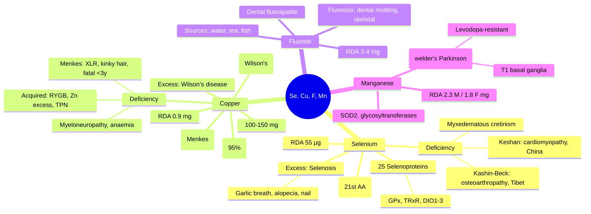

**Related:** [[Nutritional Factors in Disease MOC]], [[Davidson Chapter 22 - Nutritional Factors in Disease Hierarchy]], [[../00_Index/Medicine MOC|Medicine MOC]]

> [!important]
> **Selenium = selenocysteine (21st AA) in 25 selenoproteins (glutathione peroxidases, thioredoxin reductases, deiodinases); deficiency = Keshan disease (cardiomyopathy), Kashin-Beck (osteoarthropathy); Copper = cytochrome c oxidase, SOD1, caeruloplasmin; Wilson's (ATP7B), Menkes (ATP7A); Fluoride = dental/osteoporosis; Manganese = SOD2, glycosyltransferases.**

## 1. 1. Learning Objectives
- [ ] Describe selenium: selenocysteine, selenoproteins (GPx1-4, TRxR, deiodinases), RDA 55 µg, sources (Brazil nuts, organ meats, cereals)
- [ ] Recognise selenium deficiency: Keshan disease (cardiomyopathy in children), Kashin-Beck (endemic osteoarthropathy), reversible myxedematous cretinism, infertility
- [ ] State selenium excess: selenosis (alopecia, nail brittleness, garlic breath, GI upset, peripheral neuropathy); UL 400 µg/day
- [ ] Describe copper metabolism: absorption (DMT1, duodenum), transport (albumin), storage (MT), excretion (biliary)
- [ ] Identify copper deficiency: Menkes (kinky hair, neurodegeneration, hypopigmentation), acquired (bariatric, Zn excess, malabsorption)
- [ ] State copper excess: Wilson's disease (ATP7B), Indian childhood cirrhosis, ICC
- [ ] Explain fluoride: dental enamel fluoridation, anti-cariogenic, bone formation, RDA 3–4 mg, sources (water, tea, fish); toxicity = fluorosis

## 2. 2. Definitions / Key Concepts

| Term | Definition |
|------|------------|
| **Selenocysteine (Sec)** | 21st amino acid; UGA codon; co-translational insertion; selenoprotein active site |
| **Selenoprotein P (SELENOP)** | Plasma carrier (60% plasma Se); also antioxidant; deficiency → Se deficiency |
| **Glutathione Peroxidases (GPx1-4)** | Se-dependent; reduce H₂O₂/lipid peroxides (GPx4 in sperm); deficiency → oxidative stress |
| **Thioredoxin Reductases (TRxR1-3)** | Se-dependent; DNA synthesis, redox signalling |
| **Iodothyronine Deiodinases (DIO1-3)** | Se-dependent; T4 → T3 (DIO1/2) or rT3 (DIO3); cofactor for thyroid hormone metabolism |
| **Keshan Disease** | Endemic cardiomyopathy in children (China, Keshan); responsive to Se; Coxsackie/influenza synergy; congestive cardiomyopathy |
| **Kashin-Beck Disease** | Endemic osteoarthropathy (Tibet, China, Russia); joint enlargement, dwarfism, dystrophy; Se + iodine deficiency |
| **Selenosis** | Se excess; alopecia, nail brittleness, garlic breath (dimethyl selenide), GI upset, paresthesia, peripheral neuropathy |
| **Copper (Cu)** | Trace; 100 mg body; ceruloplasmin (95% plasma Cu), albumin, transcuprein |
| **Cu/Zn-SOD (SOD1)** | Cytosolic superoxide dismutase; Cu + Zn; antioxidant |
| **Cytochrome c Oxidase (CCO)** | Mitochondrial complex IV; Cu + heme a; ATP synthesis |
| **Caeruloplasmin (Cp)** | 95% plasma Cu; ferroxidase (Fe²⁺ → Fe³⁺); acute phase reactant |
| **Menkes Disease (MD)** | X-linked recessive; ATP7A mutation; ↓Cu absorption, ↓Cu transport to brain; kinky hair, neurodegeneration, hypopigmentation; **death by 3y** |
| **ATP7A** | Cu-ATPase; intestinal Cu absorption, blood-brain barrier, placental |
| **ATP7B** | Cu-ATPase; hepatocyte Cu biliary excretion; **Wilson's disease** |
| **Wilson's Disease (WD)** | AR; ATP7B mutation; ↓Cu biliary excretion, ↓ceruloplasmin binding; liver, brain (basal ganglia), eye (Kayser-Fleischer), kidney |
| **Kayser-Fleischer Ring** | Corneal Cu deposition in Descemet's membrane; WD; slit-lamp exam |
| **Fluorosis** | Chronic F excess; dental mottling (mild), skeletal fluorosis (severe; osteosclerosis, calcification) |
| **Manganese (Mn)** | Trace; cofactor (SOD2, arginase, pyruvate carboxylase, glycosyltransferases) |
| **Manganism** | Mn neurotoxicity (welders, miners); Parkinson-like (basal ganglia Mn deposition); chelation (EDTA, PAS) |

## 3. 3. Core Content

### 1. Section 1: Selenium Metabolism
**Forms:** Selenocysteine (Sec, active in selenoproteins); selenomethionine (storage, non-specific incorporation); selenate, selenite (inorganic, supplements).
**Absorption:** Duodenum, jejunum; passive diffusion; selenomethionine absorbed like methionine.
**Transport:** Albumin; **SELENOP** (60% plasma Se); taken up by liver, brain, testes, kidney.
**Excretion:** Urine (trimethylselenonium); exhalation (dimethyl selenide, garlic odour); sweat.
**RDA:** 55 µg/day; UL 400 µg/day; intake varies by soil (China, USA high; Europe low).

**Selenoproteins (25 in humans; key examples):**
- **GPx1-4:** Cytosolic (GPx1), GI (GPx2), plasma (GPx3), phospholipid hydroperoxide (GPx4, sperm)
- **Thioredoxin reductases (TRxR1-3):** Redox regulation
- **Iodothyronine deiodinases (DIO1-3):** T4 activation/inactivation
- **Selenoprotein P (SELENOP):** Plasma transport, antioxidant
- **Selenoprotein K, S, W:** Various functions

**Functions:** Antioxidant (GPx/TRxR); thyroid hormone metabolism (DIO); spermatogenesis (GPx4 in sperm); immunity; reproduction; anti-cancer (↓cancer risk in some).

### 2. Section 2: Selenium Deficiency & Diseases
**Keshan Disease:**
- **Geography:** China (Keshan county, Heilongjiang), Siberia, Africa; **Se-deficient soil**
- **Age:** Children 2–10y, women of childbearing age
- **Pathophysiology:** Coxsackievirus B3/influenza A mutation in Se deficiency → virulent; cardiac antioxidant failure
- **Clinical:** Congestive cardiomyopathy (cardiomegaly, arrhythmias, heart failure); often fatal
- **Prevention:** Se supplementation (sodium selenite 0.5–1 mg/week) dramatically reduces incidence
- **Treatment:** Selenium + cardiac support

**Kashin-Beck Disease:**
- **Geography:** Tibet, China, Siberia, North Korea
- **Age:** Children 5–15y
- **Pathophysiology:** Se + iodine deficiency; possibly Fusarium mycotoxins
- **Clinical:** Symmetrical osteoarthropathy (joint swelling, pain, loss of motion), short stature (dwarfism), dystrophic changes
- **Prevention:** Se + iodine supplementation

**Other Se Deficiency:**
- **Myxedematous (endemic) cretinism:** Se + iodine deficiency; responsive to Se + thyroxine
- **Cardiomyopathy (Western, non-endemic):** Se deficiency post-TPN, HIV, dialysis
- **Sperm motility:** Se supplementation may improve male fertility
- **Cancer:** Observational: ↓Se = ↑cancer risk; SELECT trial: Se ± Vit E no prostate cancer benefit
- **Hashimoto's:** ↓Se activity may worsen; supplementation may ↓TPO Ab (controversial)

### 3. Section 3: Selenium Toxicity (Selenosis)
**Threshold:** UL 400 µg/day (acute: 5 mg/kg)
**Sources:** Brazil nuts (high; up to 1917 µg/nut), supplements, occupational (metal refining)
**Features:** Alopecia, nail brittleness/transverse lines, **garlic breath** (dimethyl selenide), GI upset, peripheral neuropathy, fatigue, dermatitis, garlic sweat, myopathy.

### 4. Section 4: Copper Metabolism
**Body content:** 100–150 mg; liver, brain, heart, kidney.
**Absorption:** Duodenum, proximal jejunum; **DMT1** (Fe²⁺/Cu²⁺ transporter); enterocyte basolateral exporter **ATP7A**; Cu bound to albumin → portal blood.
**Hepatic processing:** Cu → albumin → ceruloplasmin (Cp) → tissue; **ATP7B** exports Cu into bile for excretion; excess → stored as MT.
**Excretion:** **Biliary (80%, faecal)** = main route; urinary (<5%); sweat, menstrual blood, desquamation.
**RDA:** 0.9 mg/day (adult); UL 10 mg/day.

### 5. Section 5: Copper Deficiency
**Causes:**
| Cause | Mechanism |
|-------|-----------|
| **Menkes disease** | ATP7A mutation (XLR); ↓Cu absorption, ↓BBB transport, ↓placental |
| **Acquired malabsorption** | Bariatric (RYGB), IBD, short bowel, CF, celiac |
| **Excess Zn** | Zn induces MT → Cu trapped in enterocyte → ↓Cu absorption (similar to WD Rx mechanism) |
| **Excess iron** | Competes with Cu absorption (DMT1) |
| **TPN without Cu** | Months → deficiency |
| **Penicillamine, trientine** | Chelation (WD Rx) |
| **Premature infants** | ↓Hepatic stores, ↑demand |

**Menkes Disease (MD):**
- **Genetics:** XLR; ATP7A; 1:100,000; males affected
- **Pathophysiology:** ↓Cu absorption, ↓Cu transport to CNS (failing BBB), ↓lysyl oxidase activity (kinky hair), ↓mitochondrial CCO, ↓SOD1
- **Clinical:** 
  - **Hair:** Sparse, brittle, kinky, hypopigmented, "steely" (pili torti on microscopy)
  - **Skin:** Hypopigmentation, lax, "cutis laxa" (↓elastin cross-linking)
  - **CNS:** Progressive neurodegeneration, seizures, hypotonia, MR; **death by 3 years** (without treatment)
  - **Other:** Hypothermia, bone abnormalities (metaphyseal dysplasia, osteoporosis), vascular tortuosity, bladder diverticula
- **Diagnosis:** ↓Cu, ↓Cp, abnormal Cu uptake in fibroblasts; **mutation ATP7A**
- **Treatment:** **Subcutaneous Cu-histidine** (early; before 28d; experimental) — modest neurological benefit; **Cu chloride IV** also used; paroxetine (controversial)

**Acquired Cu deficiency:**
- **Post-bariatric** (RYGB): Cu deficiency in 10–20% within 2 years
- **Hyperzincuria (excess Zn)**: Wilson's Rx, denture cream
- **B12 / Fe / Cu supplementation:** B12 + Fe may not be enough; add Cu
- **TPN:** Add Cu 0.5–1.5 mg/day
- **Clinical:** Myeloneuropathy (similar to B12 — dorsal column), ataxia, peripheral neuropathy, anaemia (Fe-resistant), neutropenia, hyperpigmentation (skin, hair)
- **Differential:** B12 deficiency, Zn excess, severe malabsorption

### 6. Section 6: Wilson's Disease (See also Zinc file)
- AR; ATP7B mutation (chromosome 13); ↓Cu biliary excretion, ↓Cp binding, ↑Cu accumulation
- **Hepatic:** Steatosis → hepatitis → cirrhosis → HCC; acute liver failure
- **Neurological:** Basal ganglia (putamen, globus pallidus, caudate); movement disorders (tremor, dystonia, parkinsonism, choreoathetosis, dysarthria)
- **Psychiatric:** Depression, psychosis, personality change
- **Ocular:** Kayser-Fleischer ring (Descemet's membrane Cu); sunflower cataract
- **Renal:** Fanconi syndrome, nephrolithiasis
- **Haematological:** Haemolytic anaemia (Coombs-negative; free Cu in serum)
- **Treatment:** **Penicillamine** (chelator; first-line for acute neurological), **Trientine** (alternative chelator), **Zinc** (induces MT; maintenance/pregnancy/children), **Liver transplantation** (end-stage)

### 7. Section 7: Copper Excess
**Wilson's disease:** See above
**Indian Childhood Cirrhosis (ICC):** Historically high mortality; infant Cu exposure (vessels, milk); **sporadic ICC** in some populations
**Acute Cu poisoning:** Self-harm (sulphate ingestion); GI bleeding, methaemoglobinaemia, haemolysis, hepatic necrosis, shock
**Chronic Cu excess:** Industrial exposure, contaminated water (Wilson disease carriers, haemochromatosis)

### 8. Section 8: Fluoride
**Sources:** Water (1 ppm optimal), tea (high), fish (with bones), toothpaste (NaF), salt (some countries), supplements
**RDA:** 3 mg (M) / 3 mg (F); UL 10 mg/day
**Functions:**
- **Dental:** Enamel fluorapatite (resistant to acid); anti-cariogenic; ↓demineralisation, ↑remineralisation
- **Bone:** Hydroxyfluoroapatite; ↓osteoclast activity, ↑osteoblast; ↓fracture in optimal range
- **Topical:** Toothpaste, mouthwash, varnish

**Deficiency:** Rare (not essential); ↑dental caries, possibly osteoporosis
**Excess (Fluorosis):**
- **Dental (mild, <4 ppm F):** Mottling, white spots, brown staining; cosmetic
- **Skeletal (chronic, >4 ppm F):** Osteosclerosis (↑trabecular bone), calcification of ligaments, osteophytes, bone pain, ↑fracture risk
- **Severe (industrial):** Crippling fluorosis; vertebrae fusion, nerve compression, disability
- **Acute toxicity:** GI upset, salivation, hyperreflexia, seizures (rare; very high dose)

### 9. Section 9: Manganese
**Sources:** Whole grains, nuts, legumes, tea; absorption 1–5%
**RDA:** 2.3 mg (M) / 1.8 mg (F); UL 11 mg/day
**Functions:** SOD2 (mitochondrial; Mn); pyruvate carboxylase; arginase; glutamine synthetase; glycosyltransferases (proteoglycan synthesis)
**Deficiency (rare):** Bone demineralisation, hair depigmentation, dermatitis, weight loss, hypercholesterolaemia (animals)
**Toxicity (Manganism):**
- **Sources:** Welders (Mn fumes), miners, contaminated water
- **Pathology:** Mn deposition in **basal ganglia** (especially globus pallidus)
- **Clinical:** Parkinson-like — bradykinesia, rigidity, postural instability, dystonia, gait disturbance, neuropsychiatric
- **Diagnosis:** T1-weighted MRI hyperintensity in basal ganglia
- **Treatment:** Stop exposure; chelation (EDTA, PAS, levodopa, trientine); antioxidants
- **Differentiation:** Responds poorly to levodopa; more dystonia; ↑Mn on imaging

## 4. 4. Clinical Correlation

| Scenario | Action | Notes |
|----------|--------|-------|
| 5y child, Keshan county China, heart failure, ↓Se | **Sodium selenite 0.5–1 mg/week**; cardiac support | Keshan disease; Se dramatically improves |
| 12y Tibetan child, joint pain, swollen fingers, dwarfism | **Se + iodine supplementation**; physiotherapy | Kashin-Beck; endemic area |
| 60M, RYGB 3y ago, ataxia, spastic gait, dorsiflexion loss, normal B12 | **Serum Cu, Cp, 24h urinary Cu**; **IV Cu** (if severe) | Cu deficiency myeloneuropathy |
| 30F, Wilson's disease, neurological, started on penicillamine, progressive | **Add Zn 50 mg ×3 (empty stomach)**; consider trientine switch; diet (avoid Cu-rich foods) | WD therapy |
| 5m boy, kinky hair, seizures, hypotonia, ↓Cu, ↓Cp | **ATP7A testing** → Menkes; **Cu-histidine SC** (early); paroxetine; supportive | Menkes; fatal by 3y untreated |
| 65F, dental mottling, well-water area (F 8 ppm) | **Avoid water source**; dental cosmetic Rx; skeletal assessment if symptomatic | Fluorosis (mild) |
| 45M, welder, Parkinson-like, MRI T1 basal ganglia | **Stop Mn exposure**; chelation (EDTA, PAS); trientine | Manganism; levodopa-resistant |
| 50F, RYGB 2y, anaemia not responding to Fe and B12, neutropenia, hyperpigmentation | **Check Cu, Cp**; if low, IV Cu + oral Cu gluconate 2–4 mg/day | Cu deficiency in bariatric |

## 5. 5. High-Yield FCPS/MRCP Points

> [!important]
> - **Must know:** Se = selenocysteine, 25 selenoproteins (GPx, TRxR, DIO); Keshan (cardiomyopathy in children, China) + Kashin-Beck (osteoarthropathy, Tibet); RDA 55 µg; selenosis (garlic breath, alopecia); Cu = 100 mg, caeruloplasmin, ATP7A/ATP7B; Menkes (ATP7A, kinky hair, neurodegeneration, fatal <3y); Wilson's (ATP7B, KF ring, liver/brain); RDA 0.9 mg; F = dental fluorapatide, fluorosis (mottling, skeletal); Mn = SOD2, manganism (Parkinson-like)
> - **Common viva:** Keshan disease, Kashin-Beck, selenosis garlic breath; Menkes disease (ATP7A, kinky hair); Wilson's disease (ATP7B); Cu deficiency in RYGB; fluoride fluorosis; manganism in welders
> - **Exam trap:** Confusing Menkes (XLR) with Wilson's (AR); missing Cu deficiency in RYGB; confusing selenosis with arsenic toxicity; Mn toxicity levodopa-resistant

## 6. 6. Common Confusions / Exam Traps

| Trap | Correction |
|------|------------|
| Menkes = Wilson's | **Menkes: XLR, ATP7A, kinky hair, fatal <3y; Wilson's: AR, ATP7B, liver/brain, treatable** |
| Cu deficiency = bariatric | **ALL bariatric patients need Cu screening** (in addition to Fe, B12, Ca, D) |
| Selenosis = acute toxicity | **Chronic selenosis from supplements/Brazil nuts**; garlic breath (dimethyl selenide) |
| Keshan only in China | **Endemic in Se-deficient areas globally**; sporadic cases in malnourished |
| Manganism = Parkinson's | **Mn: T1 hyperintensity basal ganglia, dystonia prominent, levodopa-resistant** |
| Fluorosis = dental | **Skeletal fluorosis from chronic F excess** (industrial, water >4 ppm) |
| Se supplementation always safe | **UL 400 µg; selenosis**; SELECT trial: Se ± Vit E no cancer benefit |
| Wilson's: penicillamine always first | **Zn maintenance/pregnancy/paediatrics; CHELATE trial Zn non-inferior** |
| Cu/Cp always low in Cu deficiency | **Cp is acute phase reactant** (↑in inflammation); Cp may be normal in Cu deficiency with inflammation |

## 7. 7. Mnemonics

- **Selenoproteins:** **GPx-TRxR-DIO** = **G**lutathione **P**eroxidases, **T**hio**R**edoxin **R**eductases, **D**e**I**O**d**inases
- **Keshan:** **K**eshan = **K**ardiomyopathy; **C**hina, **C**oxsackie, **C**hildren
- **Kashin-Beck:** **K**ashin-Beck = **K**nees (osteoarthropathy); **T**ibet, **C**hildren 5-15y
- **Selenosis:** **G**arlic breath, **A**lopecia, **N**ail brittleness = **GAN**
- **Menkes:** **M**enkes = **M**utation in **ATP7A** = **K**inky **H**air; XLR
- **Wilson's:** **W**ilson's = **ATP7B**; **L**iver, **B**rain, **E**ye, **K**idney, **A**naemia = **LB-EKA**
- **Caeruloplasmin:** **95%** plasma Cu; **C**o**P** Cu; acute phase reactant
- **Fluoride:** **F**or dental **F**luorapatite; **D**oses 1 ppm water
- **Manganism:** **M**anganese = **M**otor (basal ganglia); welder's Parkinson
- **Cu absorption:** **DMT1** (with Fe); **ATP7A** (enterocyte export, menkes); **ATP7B** (hepatocyte biliary, Wilson's)

## 8. 8. Mind Map

## 9. 9. -Hour Recall Prompts
1. Se: selenocysteine, 25 selenoproteins (GPx, TRxR, DIO); RDA 55 µg
2. Keshan: cardiomyopathy in children (China, Coxsackie); Kashin-Beck: osteoarthropathy
3. Selenosis: garlic breath, alopecia, nail brittleness
4. Cu: caeruloplasmin (95%); ATP7A (Menkes), ATP7B (Wilson's)
5. Menkes: XLR, kinky hair, neurodegeneration, fatal <3y
6. Wilson's: AR, KF ring, liver/brain, treatable (penicillamine, Zn, trientine)
7. Cu deficiency in RYGB: myeloneuropathy, anaemia
8. Mn: SOD2; manganism in welders; levodopa-resistant

## 10. 10. -Day / 15-Day / 30-Day Revision Tracker

| Day | Date | Recall Quality (1-5) | Time Spent | Notes |
|-----|------|---------------------|------------|-------|
| 1   |      |                     |            |       |
| 7   |      |                     |            |       |
| 15  |      |                     |            |       |
| 30  |      |                     |            |       |

---

## 11. 11. Must Know / Should Know / Nice to Know

| Priority | Content |
|----------|---------|
| **Must Know 🔴** | Se selenoproteins (GPx, TRxR, DIO); Keshan cardiomyopathy; Kashin-Beck osteoarthropathy; selenosis (garlic breath, alopecia); Cu caeruloplasmin; Menkes (ATP7A, kinky hair, XLR); Wilson's (ATP7B, KF ring); Cu deficiency in RYGB; fluoride fluorosis; Mn manganism |
| **Should Know 🟡** | SELECT trial (Se no prostate cancer benefit); myxedematous cretinism; Cu histidine SC in Menkes; trientine in WD; CHELATE trial; Mn T1 MRI basal ganglia; dental fluorosis; skeletal fluorosis; ICC |
| **Nice to Know 🟢** | Se in Hashimoto's; Se in male fertility; Se in HIV/cancer; paroxetine in Menkes; acute Cu poisoning; Cu in Indian childhood cirrhosis; DMT1 in Cu/Fe absorption; MT in Cu homeostasis |

## 12. 12. My Weak Points
- [ ] Kashin-Beck pathophysiology detail
- [ ] Menkes Cu-histidine dosing
- [ ] Mn chelation specifics

## 13. 13. Self-Test Scorecard

| Domain | Score /10 | Target /10 |
|--------|-----------|------------|
| Understanding |    | 8+ |
| Recall |    | 8+ |
| MCQ Performance |    | 8+ |
| SBA Performance |    | 8+ |
| Viva Confidence |    | 8+ |
| **TOTAL** |    | **40+/50** |

## 14. 14. Exam Answer Modes

### 1. Long Answer / Essay (20 min)
**Topic:** "Selenium, Copper, Fluoride, Manganese: functions, deficiency, and toxicity"
- Se: selenocysteine, 25 selenoproteins (GPx, TRxR, DIO); Keshan (cardiomyopathy in children, China), Kashin-Beck (osteoarthropathy, Tibet); selenosis (garlic breath, alopecia)
- Cu: caeruloplasmin (95%), ATP7A/ATP7B; Menkes (XLR, kinky hair, fatal <3y); Wilson's (AR, liver/brain, KF ring); Cu deficiency in RYGB
- Fluoride: dental fluorapatite, anti-cariogenic; fluorosis (mottling, skeletal)
- Mn: SOD2; manganism in welders; T1 basal ganglia; levodopa-resistant

### 2. Short Note (7 min)
**Topic:** "Menkes Disease"
- XLR; ATP7A mutation; ↓Cu absorption, ↓BBB transport, ↓lysyl oxidase (kinky hair), ↓mitochondrial CCO
- Clinical: Sparse, brittle, kinky hair (pili torti); hypopigmentation; progressive neurodegeneration; seizures; hypotonia; bone abnormalities; **death by 3 years**
- Diagnosis: ↓Cu, ↓Cp, abnormal Cu uptake in fibroblasts, ATP7A mutation
- Treatment: Subcutaneous Cu-histidine (early, <28d, experimental); paroxetine (controversial); supportive

### 3. Viva Answer (3 min)
**Q:** "Differentiate Menkes from Wilson's disease."
"A: **Menkes:** XLR, ATP7A, ↓Cu absorption, kinky hair, neurodegeneration, fatal by 3y; no effective treatment. **Wilson's:** AR, ATP7B, ↓Cu biliary excretion, KF ring, liver cirrhosis + basal ganglia degeneration, treatable (penicillamine, trientine, Zn). Both: ↓Cu transport, but Menkes = systemic deficiency; Wilson's = accumulation."

### 4. Ward Case Discussion (5 min)
**Case:** 50F, RYGB 2y ago, progressive ataxia, dorsal column signs, Fe-resistant anaemia, neutropenia, hyperpigmentation, B12 and folate normal.
"Diagnosis: **Acquired Cu deficiency** post-bariatric. **Check Cu, Cp, 24h urinary Cu**; **IV Cu chloride** (severe); oral Cu gluconate 2–4 mg/day maintenance; monitor Hb, neutropenia. Add multivitamin with Cu, Fe, B12, D, Ca long-term."

### 5. Last-Night-Before-Exam Sheet (1 min)
- **Se:** Selenocysteine; 25 selenoproteins (GPx, TRxR, DIO); Keshan (cardiomyopathy, China, children), Kashin-Beck (osteoarthropathy, Tibet); selenosis (garlic breath, alopecia, nail)
- **Cu:** Caeruloplasmin (95% plasma Cu); ATP7A (Menkes), ATP7B (Wilson's)
- **Menkes:** XLR, ATP7A, kinky hair (pili torti), neurodegeneration, fatal <3y
- **Wilson's:** AR, ATP7B, liver/brain, KF ring, treatable (penicillamine, trientine, Zn)
- **Cu deficiency in RYGB:** Myeloneuropathy, Fe-resistant anaemia, neutropenia
- **Fluorosis:** Dental mottling (mild), skeletal (severe); F in water 1 ppm optimal
- **Mn:** SOD2; manganism in welders (Parkinson-like, levodopa-resistant); T1 MRI basal ganglia
- **Wilson's Rx:** Penicillamine, Trientine, **Zinc (induces MT; maintenance)**

## 15. 15. MCQs (10)

1. **Selenocysteine is the 21st amino acid; key selenoproteins include:**
   A. ALA synthase, ferrochelatase  
   B. **Glutathione peroxidase, thioredoxin reductase, deiodinase**  
   C. Cytochrome P450, ALAD  
   D. Lactase, sucrase  
   E. Hexokinase, glucokinase  

2. **Keshan disease is endemic cardiomyopathy in:**
   A. Africa (malnutrition)  
   B. China (Keshan county, Heilongjiang)  
   C. India (vitamin deficiency)  
   D. South America (altitude)  
   E. Europe (industrial)  

3. **Selenosis clinical features include:**
   A. Blue-grey discolouration  
   B. **Garlic breath, alopecia, nail brittleness**  
   C. Hypothyroidism only  
   D. Rash only  
   E. Foetor hepaticus  

4. **Caeruloplasmin carries what % of plasma copper:**
   A. 5%  
   B. 30%  
   C. 50%  
   D. **95%**  
   E. 100%  

5. **Menkes disease mutation:**
   A. ATP7B  
   B. **ATP7A**  
   C. Cu/Zn-SOD  
   D. Hephaestin  
   E. Cytochrome c oxidase  

6. **Menkes disease hallmark clinical feature:**
   A. KF ring  
   B. **Kinky hair (pili torti) + neurodegeneration**  
   C. Hypopigmented macules  
   D. Blue sclerae  
   E. Coombs-positive haemolysis  

7. **Wilson's disease copper-ATPase:**
   A. ATP7A  
   B. **ATP7B**  
   C. SOD1  
   D. Albumin  
   E. Caeruloplasmin  

8. **Copper deficiency in post-bariatric patients classically causes:**
   A. Megaloblastic anaemia  
   B. **Myeloneuropathy (dorsal column) + Fe-resistant anaemia**  
   C. Hyperparathyroidism  
   D. Adrenal insufficiency  
   E. Pulmonary fibrosis  

9. **Manganism (welder's Parkinson) MRI finding:**
   A. Caudate atrophy  
   B. **T1-weighted hyperintensity in basal ganglia (especially globus pallidus)**  
   C. Substantia nigra hyperintensity  
   D. White matter lesions  
   E. Cerebellar atrophy  

10. **Fluoride toxicity at chronic high water exposure (>4 ppm):**
    A. **Dental mottling, skeletal fluorosis (osteosclerosis, calcification)**  
    B. Acute liver failure  
    C. Hypothyroidism  
    D. Adrenal crisis  
    E. Bone marrow suppression  

## 16. 16. SBA Questions (5)

1. **A 5-month-old boy with kinky hair, hypotonia, seizures, hypopigmentation, ↓Cu, ↓Cp. Most likely diagnosis?**
   A. Kwashiorkor  
   B. **Menkes disease (ATP7A mutation)**  
   C. Wilson's disease (very young)  
   D. Albinism  
   E. Ectodermal dysplasia  

2. **A 25-year-old woman with Wilson's disease, neurological symptoms, started on penicillamine. Best adjunct therapy?**
   A. Vitamin C  
   B. **Zinc 50 mg ×3/day (empty stomach) to induce metallothionein**  
   C. Iron supplementation  
   D. Calcium  
   E. Vitamin E  

3. **A 50-year-old welder presents with bradykinesia, rigidity, dystonia, postural instability. T1-weighted MRI shows hyperintensity in the globus pallidus. Best treatment?**
   A. Levodopa/carbidopa  
   B. **Stop Mn exposure; consider chelation (EDTA, PAS)**  
   C. Anticholinergics  
   D. Dopamine agonists  
   E. Steroids  

4. **A 30-year-old man from Keshan county, China, presents with congestive cardiomyopathy in childhood. Most likely nutritional deficiency?**
   A. Vitamin B1  
   B. **Selenium (Keshan disease)**  
   C. Iodine  
   D. Vitamin D  
   E. Iron  

5. **A 60-year-old woman post-RYGB presents with progressive ataxia, dorsal column signs, Fe-resistant anaemia, neutropenia. B12 normal. Most likely cause?**
   A. Vitamin B12 deficiency  
   B. **Copper deficiency (post-bariatric)**  
   C. Folate deficiency  
   D. Vitamin E deficiency  
   E. Niacin deficiency  

## 17. 17. Flashcards

- Q: Selenoproteins  
  A: **GPx, TRxR, DIO** (deiodinases)
- Q: Keshan disease  
  A: **Endemic cardiomyopathy in children (China); Se + Coxsackie synergy**
- Q: Kashin-Beck disease  
  A: **Endemic osteoarthropathy (Tibet); Se + I deficiency**
- Q: Selenosis features  
  A: **Garlic breath (dimethyl selenide), alopecia, nail brittleness, paresthesia**
- Q: Caeruloplasmin %  
  A: **95%** of plasma Cu
- Q: Menkes gene  
  A: **ATP7A** (XLR); ↓Cu absorption, BBB
- Q: Menkes features  
  A: **Kinky hair (pili torti), neurodegeneration, hypopigmentation, fatal <3y**
- Q: Wilson's gene  
  A: **ATP7B** (AR); ↓Cu biliary excretion
- Q: Wilson's features  
  A: **KF ring, basal ganglia (movement), liver, kidney, Coombs-ve HA**
- Q: Cu deficiency post-bariatric  
  A: **Myeloneuropathy + Fe-resistant anaemia + neutropenia**
- Q: Fluoride functions  
  A: **Dental fluorapatite, anti-cariogenic, bone formation**
- Q: Fluorosis (chronic F excess)  
  A: **Dental mottling (mild), skeletal osteosclerosis + calcification (severe)**
- Q: Manganism  
  A: **Welder's Parkinson; T1 basal ganglia; levodopa-resistant**
- Q: Mn function  
  A: **SOD2 (mitochondrial); pyruvate carboxylase; arginase**

## 18. 18. Answer Key with Explanations

### 1. MCQs
1. **B** — Key selenoproteins: glutathione peroxidases (GPx1-4, antioxidant), thioredoxin reductases (TRxR1-3, redox), iodothyronine deiodinases (DIO1-3, T4→T3).
2. **B** — Keshan disease: endemic cardiomyopathy in children in Keshan county (Heilongjiang, China) and other Se-deficient soil areas; Coxsackie/influenza synergy.
3. **B** — Selenosis: garlic breath (dimethyl selenide), alopecia, nail brittleness, GI upset, paresthesia, peripheral neuropathy.
4. **D** — Caeruloplasmin (Cp) carries 95% of plasma Cu; also ferroxidase (Fe²⁺→Fe³⁺) and acute phase reactant.
5. **B** — Menkes disease: ATP7A mutation; X-linked recessive; ↓Cu absorption and ↓BBB Cu transport.
6. **B** — Menkes hallmark: kinky/brittle hair (pili torti on microscopy) + neurodegeneration; fatal by 3y if untreated.
7. **B** — Wilson's disease: ATP7B mutation; ↓Cu biliary excretion, ↓Cp binding; Cu accumulation in liver, brain, eye (KF ring).
8. **B** — Post-bariatric Cu deficiency: myeloneuropathy (dorsal column signs, similar to B12), Fe-resistant anaemia, neutropenia, hyperpigmentation.
9. **B** — Manganism MRI: T1-weighted hyperintensity in basal ganglia (especially globus pallidus); differentiates from Parkinson's (no specific MRI).
10. **A** — Fluorosis: chronic F excess (water >4 ppm); dental mottling (mild, cosmetic), skeletal fluorosis (severe; osteosclerosis, calcification of ligaments, joint restriction).

### 2. SBAs
1. **B** — Menkes disease: 5-month boy, kinky hair (pili torti), hypotonia, seizures, hypopigmentation, ↓Cu, ↓Cp; XLR ATP7A mutation; fatal by 3y.
2. **B** — Wilson's neurological: penicillamine + Zn (induces metallothionein, blocks Cu absorption; adjuvant/maintenance).
3. **B** — Manganism: welder + Parkinson-like + T1 basal ganglia hyperintensity; stop Mn exposure, consider chelation (EDTA, PAS); levodopa-resistant.
4. **B** — Keshan disease: Se deficiency + Coxsackie synergy → congestive cardiomyopathy in children (Keshan county, China).
5. **B** — Post-bariatric Cu deficiency: myeloneuropathy (dorsal column), Fe-resistant anaemia, neutropenia; B12 normal distinguishes from B12 deficiency.

## 19. 19. Summary

**Selenium, Copper, Fluoride, Manganese** are **Must Know 🔴** topics for FCPS/MRCP.
**Key takeaway:** **Se = selenocysteine, 25 selenoproteins (GPx, TRxR, DIO)**; **Keshan (cardiomyopathy in children, China), Kashin-Beck (osteoarthropathy, Tibet)**; selenosis (garlic breath, alopecia). **Cu = caeruloplasmin (95%)**; **Menkes (ATP7A, XLR, kinky hair, fatal <3y); Wilson's (ATP7B, AR, liver/brain, KF ring)**; Cu deficiency in RYGB (myeloneuropathy, Fe-resistant anaemia). Fluoride = dental fluorapatite, anti-cariogenic, fluorosis (mottling, skeletal). Mn = SOD2; manganism in welders (Parkinson-like, levodopa-resistant).
**Exam focus:** Se selenoproteins, Keshan/Kashin-Beck, selenosis, caeruloplasmin, Menkes vs Wilson's, Cu deficiency, fluoride, manganism.
**Clinical relevance:** RYGB Cu screening; Wilson's monitoring; Se in endemic areas; Mn occupational protection; fluoridation.

*Template version: 1.0 | Davidson 24e Ch 22 aligned | FCPS/MRCP oriented*
