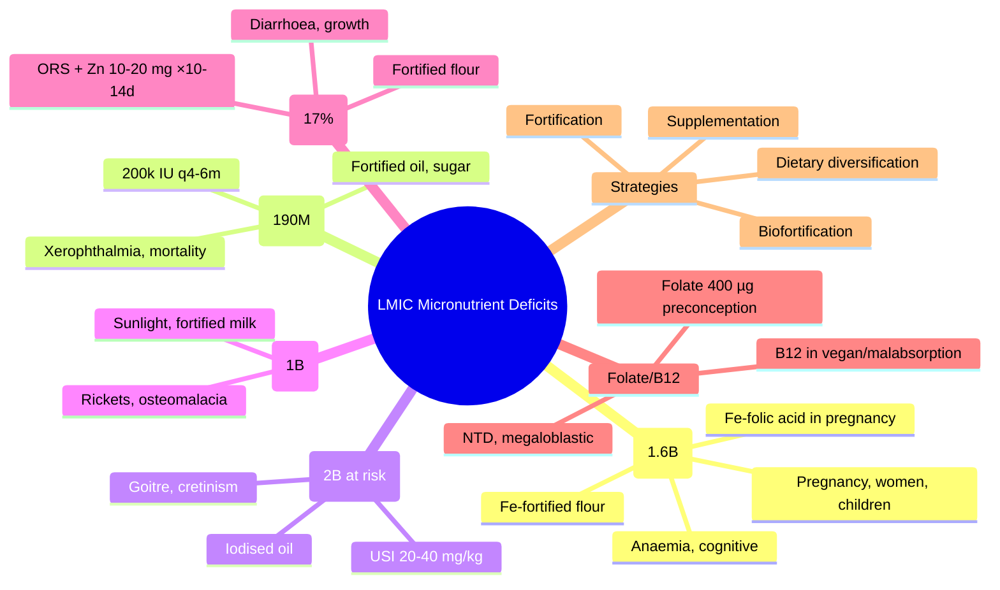

**Related:** [[Nutritional Factors in Disease MOC]], [[Davidson Chapter 22 - Nutritional Factors in Disease Hierarchy]], [[../00_Index/Medicine MOC|Medicine MOC]]

> [!important]
> **Most common LMIC micronutrient deficiencies: Iron (1.6B), Vit A (190M preschool), Iodine (2B at risk), Vit D (1B), Zinc (17% global), Folate, B12; often coexist with PEM ("hidden hunger"); public health interventions: fortification, supplementation, dietary diversification.**

## 1. 1. Learning Objectives
- [ ] Identify most common global micronutrient deficiencies: iron, vit A, iodine, vit D, zinc, folate
- [ ] Describe epidemiology by region: iron most common worldwide, vit A in South Asia/Africa, iodine in mountainous areas
- [ ] Distinguish "hidden hunger" (micronutrient deficiency without overt PEM)
- [ ] State public health interventions: fortification (universal salt iodisation, iron-fortified flour, vitamin A in oil), supplementation (high-dose vit A, iron tablets in pregnancy), dietary diversification
- [ ] Recognise clinical features of each deficiency in LMIC populations
- [ ] Explain interactions: vit A + iron; zinc + vit A; iodine + selenium

## 2. 2. Definitions / Key Concepts

| Term | Definition |
|------|------------|
| **Hidden Hunger** | Micronutrient deficiency without overt clinical signs or classical PEM; affects 2 billion globally |
| **Iron Deficiency (ID)** | Most common globally (~1.6B); IDA most prevalent anaemia; LMIC women, children |
| **Vitamin A Deficiency (VAD)** | 190M preschool children; South Asia, sub-Saharan Africa; night blindness, Bitot's, keratomalacia |
| **Iodine Deficiency Disorders (IDD)** | 2B at risk; mountainous areas, flood plains; goitre, cretinism, hypothyroidism |
| **Vitamin D Deficiency** | 1B globally; South Asia, Middle East, Africa; rickets, osteomalacia |
| **Zinc Deficiency** | 17% global population; diarrhoea, pneumonia, growth failure, immune dysfunction |
| **Folate Deficiency** | Pre-conception; NTD; megaloblastic anaemia |
| **B12 Deficiency** | Strict vegan, malabsorption, elderly; megaloblastic, neuro |
| **Public Health Interventions** | Fortification, supplementation, dietary diversification, education, food security |
| **Universal Salt Iodisation (USI)** | 20–40 mg I/kg salt; 88% global households |
| **Food Fortification** | Adding micronutrients to staple foods; iron-fortified flour, vitamin A in oil, folic acid in wheat |
| **Biofortification** | Plant breeding for higher micronutrients (orange sweet potato, golden rice, Fe beans) |
| **Supplementation Programs** | High-dose vitamin A (6–59m, 200k IU q6m); iron + folic acid (pregnant women); zinc (diarrhoea) |
| **WHO/UNICEF/GAIN** | Global coordination; Scaling Up Nutrition (SUN) movement |

## 3. 3. Core Content

### 1. Section 1: Iron Deficiency (Most Common)
**Epidemiology:** ~1.6B affected; IDA 50% in LMIC children, 40% women; common in Africa, South Asia, preschool, pregnant.
**Consequences:** IDA (↓Hb, cognitive ↓, ↓work productivity), pregnancy complications (low birth weight, prematurity, maternal mortality), child development ↓.
**Populations at risk:** Infants >6m, preschool, adolescents (girls), pregnancy, menstruating women, low-income.
**Public health interventions:**
- **Food fortification:** Iron-fortified wheat flour, rice, salt (NaFeEDTA), condiments (curry powder, fish sauce)
- **Supplementation:** Iron + folic acid tablets for pregnant women (60 mg elemental Fe + 400 µg folic acid daily, 6 months)
- **Biofortification:** Iron-biofortified rice, beans, pearl millet, sweet potato
- **Dietary diversification:** Animal source foods, vitamin C with non-heme iron
- **Public health measures:** Deworming (hookworm reduces Fe absorption), malaria control, family planning

### 2. Section 2: Vitamin A Deficiency
**Epidemiology:** 190M preschool children globally; sub-Saharan Africa, South Asia (highest burden); 5M with xerophthalmia, 350,000 blind annually.
**Consequences:** Xerophthalmia, blindness, increased infection mortality (measles, diarrhoea, pneumonia), anaemia, growth failure.
**Public health interventions:**
- **High-dose vitamin A supplementation (HVAS):** 200,000 IU q4–6m (6–59m; 100,000 <6m); 90% coverage reduces mortality 24%
- **Food fortification:** Vitamin A in oil, sugar, wheat flour, dairy
- **Dietary diversification:** Orange/red fruits/veg (β-carotene), liver, eggs, dairy
- **Measles vaccination** (separate programme)
- **Biofortification:** Golden rice, orange sweet potato

### 3. Section 3: Iodine Deficiency Disorders (IDD)
**Epidemiology:** 2B at risk globally; mountainous (Himalayas, Andes, Alps), flood plains, glaciated; China, India, sub-Saharan Africa
**Consequences:** Goitre, hypothyroidism, cretinism (neurological, myxoedematous), cognitive ↓, growth failure, pregnancy complications
**Public health interventions:**
- **Universal Salt Iodisation (USI):** 20–40 mg iodine/kg salt; 88% global households; 4 USD/person/year
- **Other vehicles:** Iodised water, milk, bread
- **Iodised oil (lipiodol):** IM/oral; 0.5–1 mL; long-acting (2–5 years); for remote areas
- **Monitoring:** Urinary iodine concentration (UIC) in school children; target >100 µg/L

### 4. Section 4: Vitamin D Deficiency
**Epidemiology:** 1B globally; South Asia, Middle East, Africa; all ages; exclusive breastfeeding (UVB + low maternal stores) + covered clothing + dark skin
**Consequences:** Rickets (children), osteomalacia (adults), ↑fracture, secondary HPT, possibly immune/CVD
**Public health interventions:**
- **Food fortification:** Vitamin D in milk, oil, flour (some countries)
- **Supplementation:** High-risk groups (infants, pregnant women, elderly, veiled)
- **Sunlight exposure:** Safe sun (10–15 min, 2–3 times/week; hands, face, arms)
- **Fortified infant formula:** Standard practice

### 5. Section 5: Zinc Deficiency
**Epidemiology:** 17% global; sub-Saharan Africa, South Asia; ~450,000 deaths/year (5% of all child deaths)
**Consequences:** Growth failure, immune dysfunction, ↑diarrhoea/pneumonia, dermatitis, delayed wound healing, hypogonadism
**Public health interventions:**
- **Supplementation with ORS in diarrhoea:** WHO ORS + zinc 10–20 mg/day ×10–14 days
- **Fortification:** Wheat flour, rice, milk, condiments
- **Biofortification:** Zn-biofortified wheat, rice, beans
- **Dietary diversification:** Animal products, legumes (with phytate reduction)

### 6. Section 6: Folate & B12
**Folate:** Pre-conception NTD prevention (400 µg/day); megaloblastic anaemia; fortification (wheat flour with folic acid 154 µg/100g in 80+ countries → NTD ↓20–50%)
**B12:** Strict vegan (infants of vegan mothers), elderly, malabsorption, post-bariatric; clinical features; supplementation 1 mg IM loading + maintenance

### 7. Section 7: Other LMIC Deficiencies
| Deficiency | Region | Public Health Action |
|-----------|--------|---------------------|
| **Selenium** | Keshan (China), Tibet, Russia | Supplementation, fortification (salt) |
| **Copper** | Bariatric, infants (cow's milk) | Multivitamins |
| **Calcium** | Children, pregnant, elderly | Dairy, fortified foods |
| **Magnesium** | Chronic alcoholism, TPN | Oral supplementation |
| **Fluoride** | Deficiency in water (caries); excess in water (fluorosis) | Water fluoridation |
| **Thiamine** | Polished rice diets (beriberi), alcohol | Fortification (rice, wheat) |
| **Niacin** | Maize/sorghum diets (pellagra) | Nixtamalisation, fortification |

### 8. Section 8: Hidden Hunger & Multiple Deficiencies
- Often coexist: Fe + Vit A + I + Zn + Folate in same populations
- "Hidden hunger" — subclinical, no overt PEM
- Worsens with poverty, food insecurity, poor diet diversity
- "Food systems" approach: agriculture, processing, fortification, education
- **1000 days** (pregnancy + 2 years): critical window

### 9. Section 9: Public Health Strategies
**1. Food Fortification (Mass):**
- Universal Salt Iodisation (USI) — 88% global
- Iron-fortified wheat flour (60+ countries)
- Vitamin A-fortified oil, sugar, flour
- Folic acid-fortified wheat flour (mandatory in 80+ countries)
- Vitamin D-fortified milk, oil
- Zinc-fortified flour
- **Coverage:** All population (no compliance needed)

**2. Supplementation (Targeted):**
- Vit A high-dose (6–59m, q4–6m, LMIC)
- Iron + folic acid (pregnant women, daily 6m)
- Zinc (diarrhoea, x10–14 days)
- Calcium (pregnant women, low intake: 1.5–2 g/day, halves pre-eclampsia)
- Multiple micronutrient powders (MNPs, "Sprinkles") for home fortification
- Iodised oil (remote, severe deficiency)

**3. Biofortification:**
- Orange sweet potato (β-carotene)
- Golden rice (β-carotene)
- Fe beans, pearl millet
- Zn wheat, rice, maize
- Cassava (vitamin A, Zn)
- Plant breeding for nutrient density

**4. Dietary Diversification:**
- Animal source foods (Fe, Zn, B12, vit A)
- Pulses, nuts, seeds (Fe, Zn)
- Fruits/veg (vit A, vit C, K, folate)
- Education on balanced diet

**5. Public Health Measures:**
- Deworming (Fe, Zn absorption)
- Malaria control (Fe, anaemia)
- Sanitation (diarrhoea prevention)
- Family planning (maternal nutrition)
- Antenatal care (Fe, folate, Ca)
- Exclusive breastfeeding 0–6m
- Complementary feeding 6–24m

## 4. 4. Clinical Correlation

| Scenario | Public Health Action |
|----------|----------------------|
| Rural India, 30F pregnant, Hb 8.5, vegetarian | Iron + folic acid tablets; deworming; dietary counselling; IV iron if needed |
| Sub-Saharan Africa, 3y child, measles | Vitamin A 200,000 IU day 1, 2, 14; measles vaccination; oral nutrition support |
| Himalayan village, 12y girl, neck swelling, mental retardation | Iodine supplementation; iodised salt programme; treat hypothyroidism |
| Bangladesh, 4y child, recurrent diarrhoea, stunting | Zinc with ORS; deworming; nutrition support; investigate underlying |
| South Asia, 40F, multiple micronutrient deficiency | Multiple micronutrient supplement; dietary diversification; anaemia workup |
| LMIC, 6m child, exclusively breastfed (mother vegan) | B12 supplementation (mother and child); complementary feeding; iron by 6m |
| Sahel, 2y child, bitot's spots | Vitamin A high dose; vit A supplementation; food security, complementary feeding |
| Sub-Saharan Africa, 1y child, zinc deficiency, growth faltering | Zinc supplementation; nutritional support; deworming; complementary feeding |

## 5. 5. High-Yield FCPS/MRCP Points

> [!important]
> - **Must know:** Most common LMIC deficiencies: Iron (1.6B), Vit A (190M children), Iodine (2B at risk), Vit D (1B), Zinc (17%), Folate; public health: fortification, supplementation, dietary diversification; USI 20–40 mg/kg; vit A high dose 200k IU q4–6m; iron + folic acid in pregnancy
> - **Common viva:** Hidden hunger; iron fortification vehicles; vit A mortality benefit; USI programme; ORS+zinc in diarrhoea; iron-folic acid in pregnancy
> - **Exam trap:** Confusing individual vs public health interventions; missing USI coverage; low-dose vs high-dose vit A; iodine as supplement in non-deficient areas

## 6. 6. Common Confusions / Exam Traps

| Trap | Correction |
|------|------------|
| Iron fortification is universal | **Iron fortification of wheat flour (60+ countries)**, NOT universal |
| All LMIC need vit A supplementation | **Vit A HVAS in 6-59m only in high-risk countries** (>5% night blindness) |
| Iodine deficiency = goitre only | **IDD = spectrum** (goitre, cretinism, hypothyroid, cognitive) |
| USI covers 100% | **USI = 88% global households**; 0.05 USD/person/year |
| Biofortification = GM only | **Biofortification = conventional plant breeding for higher nutrients** (orange sweet potato, golden rice) |
| B12 deficiency only in elderly | **Strict vegan infants** (B12-deficient mother) → infantile B12 deficiency |
| NTD = folate only | **NTD prevented by folate 400 µg/day periconception**; valproate + DM = high risk |
| Vit D deficiency only in elderly | **South Asia veiled women + children**; sub-Saharan Africa; ALL ages |
| Calcium only for bone | **Calcium in pregnancy halves pre-eclampsia** (1.5–2 g/day) |
| Multiple micronutrient supplementation always | **MNPs ("Sprinkles") for home fortification of complementary foods** in 6-24m |

## 7. 7. Mnemonics

- **Most common:** **I-V-D-Z-F** = **I**ron (1.6B), **V**it A (190M), **I**odine (2B), **D** vit (1B), **Z**inc (17%), **F**olate
- **Public health interventions:** **F-B-S-D** = **F**ortification, **B**iofortification, **S**upplementation, **D**ietary diversification
- **USI:** 20–40 mg I/kg salt; 88% global
- **Vit A dose:** 200k IU >12m; 100k IU 6–12m; q4–6m
- **Iron + Folic Acid pregnancy:** 60 mg elemental Fe + 400 µg folic acid; daily ×6m
- **Zinc + ORS:** 10-20 mg/day ×10–14 days (childhood diarrhoea)
- **Hidden hunger:** subclinical micronutrient deficiency without overt PEM
- **1000 days:** pregnancy + 2 years (critical window)
- **Biofortification examples:** **O**range sweet potato, **G**olden rice, **F**e beans, **Z**n wheat
- **Folate for NTD:** 400 µg standard; 5 mg high risk (previous NTD, valproate, DM)

## 8. 8. Mind Map

## 9. 9. -Hour Recall Prompts
1. Iron (1.6B), Vit A (190M), Iodine (2B), Vit D (1B), Zinc (17%)
2. USI 20-40 mg I/kg salt; 88% global households
3. Vit A 200k IU q4-6m (>12m); 100k <6m
4. Iron-folic acid in pregnancy: 60 mg Fe + 400 µg folic acid ×6m
5. Zinc + ORS in childhood diarrhoea: 10-20 mg ×10-14d
6. Folate for NTD: 400 µg preconception; 5 mg high risk
7. Hidden hunger: subclinical micronutrient deficiency
8. 1000 days critical window: pregnancy + 2 years

## 10. 10. -Day / 15-Day / 30-Day Revision Tracker

| Day | Date | Recall Quality (1-5) | Time Spent | Notes |
|-----|------|---------------------|------------|-------|
| 1   |      |                     |            |       |
| 7   |      |                     |            |       |
| 15  |      |                     |            |       |
| 30  |      |                     |            |       |

---

## 11. 11. Must Know / Should Know / Nice to Know

| Priority | Content |
|----------|---------|
| **Must Know 🔴** | Iron/Vit A/Iodine/Vit D/Zinc global burden; fortification, supplementation, dietary diversification, biofortification; USI 20-40 mg/kg; vit A 200k IU q4-6m; iron-folic acid in pregnancy 60 mg + 400 µg ×6m; ORS+zinc in diarrhoea; folate 400 µg preconception |
| **Should Know 🟡** | Hidden hunger; 1000 days; biofortification examples (orange sweet potato, golden rice); deworming + Fe; vit A mortality 24%; multiple micronutrient powders (Sprinkles); calcium in pregnancy |
| **Nice to Know 🟢** | SUN movement; GAIN; WHO/UNICEF coordination; biofortification crops; specific country programmes; bariatric Cu/Fe |

## 12. 12. My Weak Points
- [ ] SUN movement history
- [ ] GAIN food fortification
- [ ] Biofortification crop specifics

## 13. 13. Self-Test Scorecard

| Domain | Score /10 | Target /10 |
|--------|-----------|------------|
| Understanding |    | 8+ |
| Recall |    | 8+ |
| MCQ Performance |    | 8+ |
| SBA Performance |    | 8+ |
| Viva Confidence |    | 8+ |
| **TOTAL** |    | **40+/50** |

## 14. 14. Exam Answer Modes

### 1. Long Answer / Essay (20 min)
**Topic:** "Micronutrient deficiencies in LMIC and public health strategies"
- Most common: Iron (1.6B), Vit A (190M), Iodine (2B at risk), Vit D (1B), Zinc (17%), Folate
- Hidden hunger: subclinical micronutrient deficiency without overt PEM; 2B affected
- Public health strategies: fortification (USI, iron-fortified flour, vit A in oil), supplementation (high-dose vit A, iron-folic acid, ORS+zinc), biofortification (orange sweet potato, golden rice), dietary diversification
- USI 20-40 mg I/kg salt; 88% global
- Vit A HVAS 200k IU q4-6m; ↓child mortality 24%
- Iron-folic acid 60 mg + 400 µg daily in pregnancy
- ORS+zinc 10-20 mg ×10-14 days in childhood diarrhoea
- Folate 400 µg preconception (5 mg high risk) for NTD prevention

### 2. Short Note (7 min)
**Topic:** "Universal Salt Iodisation (USI)"
- **Target:** 20–40 mg iodine per kg salt (15–30 ppm tropical; 30–80 ppm temperate)
- **Coverage:** 88% global households (2020); WHO target ≥90%
- **IDD spectrum:** Goitre, hypothyroidism, cretinism (neurological/myxoedematous), cognitive, growth failure
- **Cost:** 0.05 USD/person/year (most cost-effective intervention)
- **Monitoring:** Urinary iodine concentration (UIC) in school children; target >100 µg/L
- **Other vehicles:** Iodised oil (lipiodol) for remote areas (2–5 years)
- **Precautions:** Wolff-Chaikoff in normal (escape), Jod-Basedow in I-deficient with autonomy

### 3. Viva Answer (3 min)
**Q:** "What is hidden hunger and how is it addressed?"
"A: **Hidden hunger = subclinical micronutrient deficiency without overt signs of PEM**; 2 billion globally. Most common: Fe, vit A, I, vit D, Zn. **Public health approach:** 1) **Fortification** (USI 88%, iron-fortified flour, vit A in oil); 2) **Supplementation** (vit A 200k IU q4-6m, iron-folic acid in pregnancy, ORS+zinc); 3) **Biofortification** (orange sweet potato, golden rice, Fe beans); 4) **Dietary diversification** (animal source foods, fruits/veg, education). 1000 days (pregnancy + 2y) critical window."

### 4. Ward Case Discussion (5 min)
**Case:** 30F, rural India, 28 weeks pregnant, Hb 8.5, vegetarian, no iron supplementation.
"Diagnosis: **Iron-deficiency anaemia in pregnancy** (very common LMIC). **Action:** 1) **Iron + folic acid tablets** (60 mg elemental Fe + 400 µg folic acid daily, 6 months or until Hb >11); 2) **Deworming** (albendazole 400 mg, second/third trimester); 3) **Malaria prophylaxis** (endemic area); 4) **Dietary counselling** (Fe-rich foods, vit C for absorption); 5) **Severe anaemia (<7)** consider IV iron or transfusion; 6) **Postpartum** iron for 3 months; 7) **Public health** = fortification of staple foods, sanitation, family planning."

### 5. Last-Night-Before-Exam Sheet (1 min
- **Most common:** Iron 1.6B, Vit A 190M, Iodine 2B, Vit D 1B, Zinc 17%, Folate
- **Hidden hunger:** subclinical micronutrient deficiency (2B globally)
- **USI:** 20-40 mg I/kg salt; 88% global
- **Vit A HVAS:** 200k IU q4-6m (>12m); 100k <6m
- **Iron-folic acid pregnancy:** 60 mg Fe + 400 µg FA daily ×6m
- **ORS+zinc:** 10-20 mg ×10-14d childhood diarrhoea
- **Folate for NTD:** 400 µg preconception; 5 mg high risk
- **Biofortification:** Orange sweet potato, golden rice, Fe beans, Zn wheat
- **Strategies:** Fortification, Biofortification, Supplementation, Dietary diversification
- **1000 days window:** pregnancy + 2y

## 15. 15. MCQs (10)

1. **Most common micronutrient deficiency globally:**
   A. Vitamin A  
   B. **Iron**  
   C. Iodine  
   D. Vitamin D  
   E. Zinc  

2. **Universal Salt Iodisation target iodine content:**
   A. 5 mg/kg salt  
   B. 10 mg/kg  
   C. **20–40 mg/kg**  
   D. 100 mg/kg  
   E. 200 mg/kg  

3. **Vitamin A high-dose supplementation (HVAS) for 12m+ child:**
   A. 50,000 IU single dose  
   B. 100,000 IU single dose  
   C. **200,000 IU day 1, 2, 14 (q4-6m)**  
   D. 500,000 IU weekly  
   E. 1,000,000 IU monthly  

4. **WHO oral rehydration + zinc for childhood diarrhoea:**
   A. ORS only  
   B. **ORS + zinc 10-20 mg/day ×10-14 days**  
   C. Antibiotics  
   D. IV fluids only  
   E. Loperamide  

5. **Iron-folic acid standard dose in pregnancy:**
   A. 30 mg Fe + 200 µg folic acid  
   B. **60 mg Fe + 400 µg folic acid daily ×6 months**  
   C. 100 mg Fe + 1 mg folic acid  
   D. 200 mg Fe + 5 mg folic acid  
   E. No routine supplementation  

6. **Folic acid dose for NTD prevention (standard):**
   A. 100 µg/day  
   B. **400 µg/day preconception**  
   C. 1 mg/day  
   D. 5 mg/day  
   E. 10 mg/day  

7. **Biofortification examples include all EXCEPT:**
   A. **Vitamin C pills**  
   B. Orange sweet potato (β-carotene)  
   C. Golden rice (β-carotene)  
   D. Iron beans  
   E. Zinc wheat  

8. **Most common cause of preventable childhood blindness globally:**
   A. Glaucoma  
   B. **Vitamin A deficiency (xerophthalmia)**  
   C. Measles  
   D. Trachoma  
   E. Onchocerciasis  

9. **Universal Salt Iodisation (USI) global household coverage:**
   A. 50%  
   B. 70%  
   C. **88%**  
   D. 95%  
   E. 100%  

10. **"Hidden hunger" refers to:**
    A. Clinical malnutrition  
    B. **Subclinical micronutrient deficiency without overt PEM**  
    C. Hunger in developing countries  
    D. Famine  
    E. Anorexia nervosa  

## 16. 16. SBA Questions (5)

1. **A 30-year-old pregnant woman in rural India has Hb 8.5, vegetarian, no iron supplementation. Best public health intervention?**
   A. Iron IV infusion  
   B. **Iron-folic acid tablets (60 mg Fe + 400 µg FA daily) + deworming + dietary counselling**  
   C. Blood transfusion  
   D. Vitamin B12 IM  
   E. Folate 5 mg daily  

2. **A 3-year-old child in sub-Saharan Africa presents with measles, fever, cough. Most important micronutrient to give?**
   A. Iron  
   B. **Vitamin A 200,000 IU (day 1, 2, 14)**  
   C. Iodine  
   D. Vitamin D  
   E. Folate  

3. **A 4-year-old child in LMIC has acute watery diarrhoea. WHO-recommended treatment?**
   A. ORS only  
   B. **ORS + zinc 10-20 mg/day ×10-14 days**  
   C. Antibiotics  
   D. Loperamide  
   E. IV fluids  

4. **A 28-year-old woman is planning pregnancy. What supplement should be given preconception for NTD prevention?**
   A. Iron only  
   B. **Folic acid 400 µg/day (5 mg if high risk)**  
   C. Vitamin A  
   D. Iodine  
   E. Vitamin B12  

5. **In which population is universal salt iodisation (USI) most cost-effective?**
   A. North America  
   B. **Endemic iodine-deficient regions (mountainous, flood plains)**  
   C. Coastal urban areas  
   D. High-income countries  
   E. Polar regions  

## 17. 17. Flashcards

- Q: Most common deficiency  
  A: **Iron (1.6B), Vit A (190M children), Iodine (2B at risk), Vit D (1B), Zinc (17%)**
- Q: USI  
  A: **20-40 mg I/kg salt; 88% global households; 0.05 USD/person/year**
- Q: Vit A HVAS  
  A: **200,000 IU day 1, 2, 14 (>12m); 100,000 <6m; q4-6m**
- Q: Iron-folic acid in pregnancy  
  A: **60 mg Fe + 400 µg FA daily ×6 months**
- Q: ORS + zinc in diarrhoea  
  A: **Zinc 10-20 mg/day ×10-14 days** (WHO/UNICEF)
- Q: Folate for NTD  
  A: **400 µg preconception (5 mg high risk: previous NTD, valproate, DM)**
- Q: Hidden hunger  
  A: **Subclinical micronutrient deficiency (2B globally) without overt PEM**
- Q: Biofortification examples  
  A: **O**range sweet potato, **G**olden rice, **F**e beans, **Z**n wheat
- Q: 1000 days  
  A: **Pregnancy + 2 years (critical nutrition window)**
- Q: WHO targets (in LMIC)  
  A: **Vit A coverage ≥80% in 6-59m; USI ≥90% global; Fe-folic acid in pregnancy ≥80%**

## 18. 18. Answer Key with Explanations

### 1. MCQs
1. **B** — Iron deficiency is the most common micronutrient deficiency globally (~1.6B); IDA most prevalent anaemia worldwide.
2. **C** — USI target: 20-40 mg iodine per kg salt (15-30 ppm tropical; 30-80 ppm temperate).
3. **C** — Vit A HVAS: 200,000 IU day 1, 2, 14 (age 12m+); 100,000 IU 6-12m; q4-6m; ↓mortality 24%.
4. **B** — WHO: ORS + zinc 10-20 mg/day ×10-14 days in childhood diarrhoea; ↓duration 25%, ↓subsequent episodes.
5. **B** — Iron-folic acid in pregnancy: 60 mg elemental Fe + 400 µg FA daily ×6 months (WHO/UNICEF).
6. **B** — Folic acid for NTD prevention: 400 µg/day preconception; 5 mg if high risk (previous NTD, valproate, DM).
7. **A** — Biofortification examples: orange sweet potato, golden rice, iron beans, zinc wheat; NOT vitamin C pills (supplementation).
8. **B** — Most common preventable childhood blindness: vitamin A deficiency (xerophthalmia); 350,000 children blind annually.
9. **C** — USI global household coverage: 88% (WHO target ≥90%); 0.05 USD/person/year.
10. **B** — Hidden hunger: subclinical micronutrient deficiency without overt PEM; affects 2 billion globally.

### 2. SBAs
1. **B** — Iron-deficiency anaemia in pregnancy (LMIC): iron-folic acid 60 mg Fe + 400 µg FA daily ×6m + deworming + dietary counselling (Fe + vit C).
2. **B** — Measles in sub-Saharan Africa: vit A 200,000 IU day 1, 2, 14; ↓measles mortality 50%; cornerstone of management.
3. **B** — Childhood acute diarrhoea: ORS + zinc 10-20 mg/day ×10-14 days; WHO/UNICEF protocol; ↓duration, ↓episodes.
4. **B** — NTD prevention: folic acid 400 µg/day preconception (1 month before through 12 weeks gestation); 5 mg if high risk.
5. **B** — USI most cost-effective in endemic iodine-deficient regions (mountainous, flood plains) where IDD prevalent; prevention programme targeting populations at risk.

## 19. 19. Summary

**Micronutrient Deficiencies in LMIC** is a **Must Know 🔴** topic for FCPS/MRCP.
**Key takeaway:** Most common: **Iron (1.6B), Vit A (190M), Iodine (2B at risk), Vit D (1B), Zinc (17%), Folate**. Hidden hunger (subclinical) affects 2 billion. Public health strategies: **F**ortification (USI 88% global, iron-fortified flour, vit A in oil), **B**iofortification (orange sweet potato, golden rice, Fe beans), **S**upplementation (vit A 200k IU q4-6m, iron-folic acid 60 mg + 400 µg ×6m, ORS+zinc 10-20 mg ×10-14d), **D**ietary diversification. **USI 20-40 mg I/kg salt; 88% global.** **Folate 400 µg preconception (5 mg high risk) for NTD prevention.** 1000 days (pregnancy + 2y) critical window.
**Exam focus:** Burden of deficiencies, USI, vit A HVAS, iron-folic acid, ORS+zinc, folate for NTD, public health strategies.
**Clinical relevance:** Global child/maternal health; antenatal micronutrients; community programmes; refugee/emergency nutrition.

*Template version: 1.0 | Davidson 24e Ch 22 aligned | FCPS/MRCP oriented*
