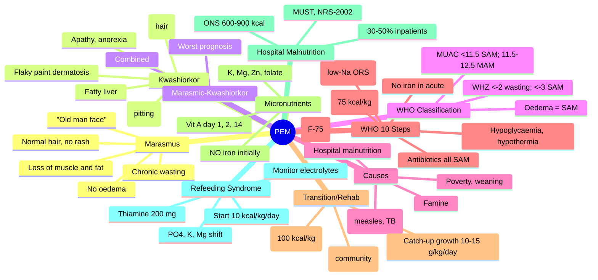

**Related:** [[Nutritional Factors in Disease MOC]], [[Davidson Chapter 22 - Nutritional Factors in Disease Hierarchy]], [[../00_Index/Medicine MOC|Medicine MOC]]

> [!important]
> **PEM spectrum: Marasmus (severe caloric + protein deficiency, wasting, ↓fat/muscle, no oedema) vs Kwashiorkor (relatively more protein deficiency, oedema, fatty liver, skin lesions, alopecia); both = ↓weight-for-height, growth failure; LMIC children 6m–5y; refeeding syndrome risk.**

## 1. 1. Learning Objectives
- [ ] Define PEM: marasmus (chronic severe caloric + protein deficiency) vs kwashiorkor (acute protein deficiency with relatively preserved carbs)
- [ ] Recognise marasmus: severe wasting (↓muscle, ↓fat, "skin and bone"), loss of subcutaneous fat, "old man face", irritability, but no oedema, hair normal
- [ ] Recognise kwashiorkor: **pitting oedema** (feet → face), **flaky paint dermatosis** (hyperpigmented patches → desquamating), **flag sign** hair (alternating bands), **fatty liver** (apolipoprotein B deficiency → ↓VLDL export), apathetic, anorexic
- [ ] Diagnose by anthropometry: weight-for-height (WHZ) <-2 SD = wasting; <-3 SD = severe; height-for-age <-2 SD = stunting; MUAC <11.5 cm = severe acute malnutrition
- [ ] State WHO management: stabilisation (F-75 formula), transition (F-100/RUTF), rehabilitation (catch-up growth, RUTF), follow-up; treat complications (hypoglycaemia, hypothermia, dehydration, infection)
- [ ] Identify causes: poverty, weaning, infections (measles, diarrhoea, TB, HIV), famine, neglect; children 6m–5y vulnerable

## 2. 2. Definitions / Key Concepts

| Term | Definition |
|------|------------|
| **PEM (Protein-Energy Malnutrition)** | Insufficient caloric AND/OR protein intake; spectrum: marasmus–kwashiorkor–mixed |
| **Marasmus (Chronic Wasting)** | Severe caloric + protein deficiency; ↓muscle, ↓fat, "skin and bone"; NO oedema; "old man face" |
| **Kwashiorkor (Acute Protein)** | Relatively more protein deficiency (with carbs); **pitting oedema**, flaky paint dermatosis, flag sign, fatty liver |
| **Marasmic-Kwashiorkor** | Combined; wasting + oedema (most severe; ↑mortality) |
| **WHZ (Weight-for-Height Z-score)** | <-2 SD = wasting; <-3 SD = severe wasting (marasmus) |
| **HAZ (Height-for-Age Z-score)** | <-2 SD = stunting (chronic); <-3 SD = severe stunting |
| **WHZ <−3** | Severe acute malnutrition (SAM) |
| **MUAC (Mid-Upper Arm Circumference)** | 6–59 months: <11.5 cm = SAM; 11.5–12.5 cm = MAM; >12.5 cm = normal |
| **Flaky Paint Dermatosis** | Hyperpigmented, peeling, erosive patches; friction/pressure points; kwashiorkor |
| **Flag Sign** | Alternating bands of pigmented/normal hair; kwashiorkor |
| **Apolipoprotein B Deficiency (Kwashiorkor)** | ↓apoB synthesis → ↓VLDL export → hepatic steatosis (fatty liver) |
| **Oedema (Kwashiorkor)** | Bilateral pitting, starts feet, ascends; spares hands (in severe); differs from cardiac/renal oedema (↓oncotic pressure) |
| **RUTF (Ready-to-Use Therapeutic Food)** | Lipid-based paste (peanut, sugar, milk, micronutrients); F-100 equivalent; community-based SAM treatment |
| **F-75 Formula** | Stabilisation phase; low protein (0.9 g/kg/day), low calories (80 kcal/kg/day); 5–7 days |
| **F-100 Formula** | Rehabilitation phase; high protein (2.5–3.0 g/kg/day), high calories (150–200 kcal/kg/day) |
| **Refeeding Syndrome** | In malnourished when refed (esp. carbohydrates); insulin surge → intracellular shift of PO4, K, Mg; ↓PO4 most dangerous |
| **Cystic Fibrosis (CF) Malnutrition** | Pancreatic insufficiency + ↑energy needs + chronic inflammation; can resemble marasmus |
| **Hospital Malnutrition** | 30–50% of inpatients; sarcopenia, ↓immunity, poor wound healing, ↑LOS, ↑mortality |
| **MUST Score** | Malnutrition Universal Screening Tool; BMI + unplanned weight loss + acute disease effect |
| **NRS-2002** | Nutritional Risk Screening 2002; ESPEN; BMI + weight loss + intake + severity of disease + age |

## 3. 3. Core Content

### 1. Section 1: PEM Spectrum & Definitions
**Marasmus (chronic wasting):**
- **Pathophysiology:** Severe caloric + protein deficiency (chronic); adaptive response to maintain gluconeogenesis from muscle; ↓fat, ↓muscle; **NO oedema**; ↓visceral protein synthesis preserved
- **Onset:** Months–years (chronic)
- **Clinical:**
  - Severe wasting: ↓muscle (temporalis, biceps, gluteal), ↓fat (buccal pad, limb, gluteal)
  - "Skin and bone" appearance, prominent ribs, stick limbs
  - "Old man face" (loss of buccal fat, sunken eyes)
  - **Normal hair**, no skin lesions
  - **Apathetic, irritable, but alert** (preserved mental)
  - Bradycardia, hypotension, hypothermia
  - **NO oedema**, NO fatty liver
  - Hypoglycaemia, hypothermia, infection risk

**Kwashiorkor (acute protein):**
- **Pathophysiology:** Relatively more protein deficiency (with carbs) → ↓albumin → ↓oncotic pressure → oedema; ↓apoB → ↓VLDL → fatty liver; oxidative stress/antioxidant deficiency
- **Onset:** Weeks (acute) — post-weaning, infection, famine
- **Clinical:**
  - **Pitting oedema** (feet → legs → face; ascites, pleural effusion)
  - **Flaky paint dermatosis** (erythematous, hyperpigmented, peeling, erosive; friction/pressure)
  - **Flag sign** (alternating bands of normal/pigmented hair; growth interruption)
  - **Hair:** Sparse, fine, easily pluckable, hypopigmented
  - **Apathetic, lethargic, anorexic** (more than marasmus)
  - **Hepatomegaly** (fatty liver; **steatosis**)
  - Distended abdomen (hepatomegaly + ascites + ↓bowel motility)
  - Diarrhoea (common)

**Marasmic-Kwashiorkor (mixed):** Both wasting AND oedema; most severe; ↑↑mortality.

### 2. Section 2: WHO Classification (6m–59m Children)
| Indicator | Moderate Acute Malnutrition (MAM) | Severe Acute Malnutrition (SAM) |
|-----------|----------------------------------|------------------------------|
| **WHZ** | <-2 to ≥-3 SD | **<-3 SD** |
| **MUAC** | 11.5 to <12.5 cm | **<11.5 cm** |
| **Bilateral pitting oedema** | — | **+ (any grade)** |
| **Visible severe wasting** | — | **+** |

- **Stunting:** HAZ <-2 SD (chronic undernutrition)
- **Wasting:** WHZ <-2 SD (acute)
- **Underweight:** WAZ <-2 SD (combined)

### 3. Section 3: Causes & Risk Factors
| Category | Examples |
|----------|----------|
| **Poverty / Food insecurity** | LMIC, famine, displacement |
| **Weaning** | 6–24m transition; poor weaning food, contamination |
| **Infection** | Diarrhoea, measles, TB, HIV, malaria; ↑catabolism, ↓appetite |
| **Neglect / Maternal** | Orphan, maternal depression, poor feeding |
| **Chronic disease** | CF, IBD, malignancy, cardiac, renal |
| **Hospital malnutrition** | NPO > 5d, ↑requirements, poor intake |
| **Eating disorders** | Anorexia nervosa, ARFID |
| **Elderly** | Poverty, dementia, poor dentition, polypharmacy |
| **Substance** | Alcohol, drugs |

### 4. Section 4: Pathophysiology
**Marasmus:**
- ↓Insulin, ↑glucagon, ↑cortisol (catabolic state)
- **Glycogen depletion** (12-24h); then gluconeogenesis from muscle proteolysis
- ↓Lean body mass, ↓visceral mass
- ↓IgA, ↓T-cell, ↓complement → infection susceptibility
- ↓Cardiac output, ↓renal perfusion, ↓GI motility

**Kwashiorkor:**
- ↓Amino acids → ↓albumin → ↓oncotic pressure → **oedema**
- ↓ApoB → ↓VLDL export → **hepatic steatosis** (fatty liver)
- ↓β-lipoprotein, ↓chylomicrons → ↓fat absorption, ↓fat-soluble vitamins
- **Antioxidant depletion** (Se, Zn, vit E, glutathione) → oxidative stress → **skin lesions**, muscle damage
- ↑AF (aflatoxin), ↑free radical exposure (specific aetiology theory)
- **Inflammation + protein deficiency** (acute on chronic) → kwashiorkor

### 5. Section 5: WHO 10 Steps for Inpatient SAM Management
**Phase 1: Stabilisation (F-75, days 1–7)**

| Step | Action |
|------|--------|
| 1. **Hypoglycaemia** | If glucose <3 mmol/L: 50 mL D10% IV/PO; feed within 30 min |
| 2. **Hypothermia** | Warm room, skin-to-skin, blankets; axillary <35°C |
| 3. **Dehydration** | ReSoMal (low-Na ORS) 5 mL/kg/h ×4–6h (NOT standard ORS — high Na) |
| 4. **Electrolytes** | K (3–4 mmol/kg/day), Mg (0.3–0.6 mmol/kg/day); NO Na supplementation |
| 5. **Infection** | Empirical broad-spectrum antibiotics (e.g., ampicillin + gentamicin) for ALL SAM; malaria test; deworming |
| 6. **Correct micronutrient deficiencies** | Vit A (high dose single), folic acid, zinc, multivitamins; **NO IRON YET** (↓transferrin, infection risk) |
| 7. **Cautious feeding** | **F-75** (low protein 0.9 g/kg, low calories 80 kcal/kg); 2-3 hourly; night feeds; **avoid overfeeding** (refeeding) |
| 8. **Catch-up growth** | (Transition phase — Phase 2) |
| 9. **Sensory stimulation** | Emotional, play, structured environment (long-term impact) |
| 10. **Discharge planning** | After recovery (15% weight gain; WHZ >-2; oedema resolved; immunisations updated; feeding support) |

**Phase 2: Transition + Rehabilitation (F-100/RUTF, weeks 2–6)**
- **Transition (3–5 days):** F-100 OR RUTF; F-100 100 kcal/kg/day
- **Rehabilitation:** F-100 150–220 kcal/kg/day; protein 2.5–3.0 g/kg/day; **RUTF (Plumpy'nut) for community management**
- Target: 10–15 g/kg/day weight gain; WHZ >-2; no oedema ×2 weeks
- Add **iron** after 7–14 days
- **Outpatient/community-based:** WHO-recommended for SAM without complications (>75% of SAM); RUTF weekly/biweekly

### 6. Section 6: Micronutrient Issues in PEM
| Nutrient | Issue | Treatment |
|----------|-------|-----------|
| **Vit A** | Night blindness, ↑mortality, Bitot's, keratomalacia | **High dose 200,000 IU (age 12m+) day 1, 2, 14**; protective against measles mortality |
| **Iron** | Anaemia; AVOID in acute (↓transferrin, infection risk) | Iron only after stabilisation (~7–14 days, with oral Fe + F-100) |
| **Zinc** | Dermatitis, alopecia, immune | F-75/F-100 contain Zn |
| **Folic acid** | Anaemia, deficiency common | 5 mg day 1; ongoing in F-75/F-100 |
| **Vit D, E, K** | Deficient | F-75 contains |
| **Copper, selenium** | Deficient | Multivitamin |
| **Potassium, magnesium** | Deficient (diarrhoea) | K 3–4 mmol/kg/day, Mg 0.3–0.6 mmol/kg/day |

### 7. Section 7: Hospital (Adult) Malnutrition
**Prevalence:** 30–50% inpatients; 70% elderly; ↑LOS, ↑mortality, ↑complications.
**Causes:** ↑Metabolic demand (surgery, trauma, infection), ↓intake (NPO, dysphagia, dementia), malabsorption (IBD, RYGB, radiation).
**Screening tools:**
- **MUST** (UK): BMI + unplanned weight loss + acute disease effect → 0–6
- **NRS-2002** (ESPEN): BMI + weight loss + intake + severity + age ≥70 → 0–7
- **MNA-SF** (elderly): Screening
- **SGA/PG-SGA** (Subjective Global Assessment): Clinical
**Treatment:** Enteral preferred; ONS (oral nutritional supplements) 1.5–2.5 kcal/mL; **NICE: oral sip feeds for malnourished + acutely ill, 300–900 kcal/day, 1st line for 10–14 days**; PN if GI not working.

### 8. Section 8: Refeeding Syndrome (Critical!)
**Definition:** Life-threatening complications when malnourished patient is refed (especially carbohydrates).
**Mechanism:** Refeeding → insulin surge → intracellular shift of **PO4, K, Mg**; ↓ATP, ↓2,3-BPG, cardiac/respiratory failure.
**Risk factors:** BMI <16, >15% weight loss/3m, minimal intake >10d, refeeding syndrome history; low electrolytes.
**Manifestations:**
- **Hypophosphataemia** (hallmark; cardiac, respiratory, rhabdomyolysis)
- Hypokalaemia, hypomagnesaemia
- Fluid overload, cardiac failure
- Hypoglycaemia
- Thiamine deficiency (Wernicke's)
- Delirium
**Prevention:**
- Start at 10 kcal/kg/day (low), increase slowly over 4–7 days
- **Prophylactic thiamine** 200–300 mg IV/PO before feeding
- **Prophylactic PO4, K, Mg** supplements
- Daily monitoring of electrolytes (esp. PO4)
- Cardiac monitor in severe

## 4. 4. Clinical Correlation

| Scenario | Action | Notes |
|----------|--------|-------|
| 18m child, severe wasting, no oedema, weight-for-height <-3 SD | **Marasmus (SAM uncomplicated)**; community RUTF; if complications → inpatient F-75 | Most SAM now community-managed |
| 2y child, pitting oedema, flaky paint rash, hepatomegaly, flag sign | **Kwashiorkor (SAM complicated)**; inpatient; F-75 stabilisation; treat complications | ↑mortality; micronutrient issues |
| 60M, alcohol, BMI 16, admitted with pneumonia | **Hospital malnutrition; high refeeding risk**; start at 10 kcal/kg/day; thiamine 200 mg IV before feeding; monitor PO4, K, Mg | Refeeding syndrome prevention |
| 70F, hip fracture, BMI 19, weight loss 10% in 6m | **MUST 2**; oral nutritional supplements (sip feeds) 600–900 kcal/day | NICE: 1st line 10–14 days |
| 30F, anorexia nervosa, BMI 14, hypophosphataemia day 4 refeeding | **Severe refeeding risk**; thiamine + K/PO4/Mg; cardiac monitor; slow refeeding | Anorexia = highest refeeding risk |
| 5m child, marasmus + pneumonia + diarrhoea | **Inpatient SAM with complications**; F-75; antibiotics; ReSoMal for dehydration | WHO 10 steps |
| 4y child, stunting (height-for-age <-2), not wasted | **Chronic undernutrition**; long-term food security, sanitation, deworming; education | Chronic; HAZ intervention |

## 5. 5. High-Yield FCPS/MRCP Points

> [!important]
> - **Must know:** Marasmus (wasting, no oedema) vs Kwashiorkor (oedema, dermatosis, flag sign, fatty liver); WHO classification (WHZ, MUAC); F-75 stabilisation, F-100/RUTF rehabilitation; 10 steps; vit A (day 1, 2, 14); NO iron in acute; refeeding syndrome (PO4, K, Mg shift)
> - **Common viva:** Marasmus vs kwashiorkor features; WHZ/MUAC cutoffs; F-75 vs F-100; when to give iron; refeeding syndrome; thiamine before feeding; oedema in kwashiorkor
> - **Exam trap:** Giving iron in acute SAM; using standard ORS (high Na); high-calorie feeding initially; missing complications (hypoglycaemia, hypothermia); kwashiorkor = 'wet' PEM

## 6. 6. Common Confusions / Exam Traps

| Trap | Correction |
|------|------------|
| Marasmus = 'wet' PEM | **Marasmus = 'dry' PEM (no oedema); Kwashiorkor = 'wet' (oedema)** |
| Iron always given in anaemia | **NO iron in acute SAM** (↓transferrin, infection risk); wait 7–14 days |
| Standard ORS for dehydration | **ReSoMal** (low-Na ORS); standard ORS too high Na in SAM |
| High-calorie feeding initially | **F-75 low calorie 80 kcal/kg → slowly increase** (refeeding prevention) |
| Oedema = heart/renal | **Kwashiorkor: ↓albumin → ↓oncotic → oedema** (not cardiac/renal) |
| Kwashiorkor = chronic | **ACUTE on chronic** (weeks); post-weaning, infection, famine |
| All SAM inpatient | **>75% community-managed with RUTF**; only complications inpatient |
| Refeeding = refeed fast | **Refeeding SYNDROME = refeed slowly (10 kcal/kg/day), monitor PO4** |
| Vit A in measles | **Yes** (200,000 IU day 1, 2, 14); ↓measles mortality 50% |
| TPN = high risk refeeding | **Start at 10 kcal/kg/day, increase gradually; thiamine 200 mg IV** |

## 7. 7. Mnemonics

- **Marasmus vs Kwashiorkor:** **M = Muscle (no oedema), K = Kwashiorkor (Kidney/Plasma protein ↓ → K wets/oedema)**
- **Marasmus:** **M**arasmus = **M**alnutrition of **M**uscle; "**M**arasmus = **M**arasmus (all from 'Mar-' = 'wasting')" — **No oedema, No fat, No rash, Normal hair**
- **Kwashiorkor:** **K**washiorkor = **K**ey features: **O**edema, **D**ermatosis (flaky paint), **F**atty liver, **F**lag hair, **A**pathy, **A**norexia
- **WHZ cutoffs:** **<-2 wasting, <-3 severe wasting (SAM)**
- **MUAC cutoffs:** **<11.5 SAM, 11.5–12.5 MAM, >12.5 normal**
- **10 Steps (initial):** **H**ypo, **H**ypoT, **D**ehydration, **E**lectrolytes, **I**nfection, **M**icronutrients, **F**eeding, **C**atch-up, **S**timulation, **D**ischarge
- **F-75 vs F-100:** **F-75 = Stabilise (75 kcal/dL; 0.9 g protein); F-100 = Rehabilitate (100 kcal/dL; 2.5–3 g protein)**
- **Refeeding prevention:** **Thiamine 200 mg, K/PO4/Mg supplements, 10 kcal/kg/day start, monitor**
- **SAM = must be admitted if:** **<6m, oedema, complications (hypogly, hypothermia, infection, dehydration, severe anaemia)**
- **Vit A schedule:** **Day 1, 2, 14**; <6m: 100,000 IU; 6–12m: 200,000 IU; >12m: 200,000 IU
- **Hospital malnutrition:** **30–50%** inpatients; MUST/NRS-2002 screening; oral supplements 1st line

## 8. 8. Mind Map

## 9. 9. -Hour Recall Prompts
1. Marasmus: wasting, NO oedema, "old man face", normal hair
2. Kwashiorkor: oedema, flaky paint, flag sign, fatty liver, apathy
3. SAM criteria: WHZ <-3, OR MUAC <11.5, OR oedema
4. F-75 stabilisation (0.9 g protein, 80 kcal/kg) → F-100 rehab (2.5–3 g protein, 150–200 kcal/kg)
5. 10 steps: Hypo, HypoT, Dehydration, Electrolytes, Infection, Micronutrients, Feeding, Catch-up, Stimulation, Discharge
6. Vit A 200k IU day 1, 2, 14; NO iron in acute
7. Refeeding syndrome: PO4/K/Mg shift; thiamine 200 mg IV; start 10 kcal/kg
8. RUTF (Plumpy'nut) community-based SAM

## 10. 10. -Day / 15-Day / 30-Day Revision Tracker

| Day | Date | Recall Quality (1-5) | Time Spent | Notes |
|-----|------|---------------------|------------|-------|
| 1   |      |                     |            |       |
| 7   |      |                     |            |       |
| 15  |      |                     |            |       |
| 30  |      |                     |            |       |

---

## 11. 11. Must Know / Should Know / Nice to Know

| Priority | Content |
|----------|---------|
| **Must Know 🔴** | Marasmus vs Kwashiorkor; WHZ/MUAC SAM criteria; F-75/F-100/RUTF; WHO 10 steps; vit A day 1, 2, 14; NO iron in acute; refeeding syndrome (PO4/K/Mg shift, thiamine); oedema in kwashiorkor (↓albumin); fatty liver (↓apoB → ↓VLDL) |
| **Should Know 🟡** | Marasmic-kwashiorkor; WHZ cutoffs; ReSoMal (low-Na ORS); K/Mg supplementation; community RUTF for uncomplicated SAM; Hospital malnutrition (MUST, NRS-2002, ONS); NICE 10–14 day trial of ONS; CF malnutrition |
| **Nice to Know 🟢** | 10-step WHO protocol detail; appetite test (RUTF for community); catch-up growth kinetics; HIV/TB malnutrition overlap; aflatoxin theory of kwashiorkor; antioxidant depletion |

## 12. 12. My Weak Points
- [ ] ReSoMal composition vs ORS
- [ ] MUAC age-specific cutoffs
- [ ] Appetite test criteria for community management

## 13. 13. Self-Test Scorecard

| Domain | Score /10 | Target /10 |
|--------|-----------|------------|
| Understanding |    | 8+ |
| Recall |    | 8+ |
| MCQ Performance |    | 8+ |
| SBA Performance |    | 8+ |
| Viva Confidence |    | 8+ |
| **TOTAL** |    | **40+/50** |

## 14. 14. Exam Answer Modes

### 1. Long Answer / Essay (20 min)
**Topic:** "PEM: spectrum, clinical features, and management"
- Marasmus: chronic caloric + protein deficiency, wasting, no oedema, "old man face", normal hair, bradycardia
- Kwashiorkor: acute protein deficiency, pitting oedema, flaky paint dermatosis, flag sign, fatty liver (↓apoB), apathy, anorexia
- WHO classification: WHZ <-2 wasting, <-3 SAM; MUAC <11.5 SAM; oedema = SAM
- Causes: poverty, weaning, infection (measles, TB, HIV), famine
- WHO 10 steps: stabilisation (F-75 80 kcal/kg, 0.9 g protein); 1) hypogly, 2) hypothermia, 3) dehydration (ReSoMal), 4) electrolytes, 5) infection (antibiotics), 6) micronutrients (vit A day 1, 2, 14; NO iron), 7) feeding, 8) catch-up, 9) stimulation, 10) discharge
- Transition F-100 150 kcal/kg; RUTF community
- Refeeding syndrome: PO4/K/Mg shift; thiamine 200 mg; start 10 kcal/kg

### 2. Short Note (7 min)
**Topic:** "Kwashiorkor vs Marasmus"
| Feature | Marasmus | Kwashiorkor |
|---------|----------|-------------|
| Onset | Chronic (months-years) | Acute (weeks) |
| Calorie + Protein | Both ↓ | Protein > Calorie |
| **Oedema** | **NO** | **YES** |
| **Subcutaneous fat** | **↓↓** | Normal/mild ↓ |
| **Muscle** | **↓↓** | Mild ↓ |
| **Hair** | Normal | Flag sign, hypopigmented |
| **Skin** | Normal | Flaky paint dermatosis |
| **Liver** | Normal | **Fatty liver** (↓apoB) |
| Mental | Apathetic, irritable | **More apathetic, anorexic** |
| Albumin | Normal/mild ↓ | **↓↓** |
| Prognosis | Better | Worse |

### 3. Viva Answer (3 min)
**Q:** "Why is oedema present in kwashiorkor but not marasmus?"
"A: **Kwashiorkor: relatively more protein deficiency** (with carbs). ↓Amino acids → ↓albumin synthesis → ↓oncotic pressure → **pitting oedema**. Also ↓apoB → ↓VLDL export → **hepatic steatosis** (fatty liver). Kwashiorkor often post-weaning (acute) when child gets starchy pap but insufficient protein. **Marasmus: chronic caloric + protein deficiency; body adapts with catabolism; no hypoalbuminaemia, no oedema**."

### 4. Ward Case Discussion (5 min)
**Case:** 2y child, Marasmic-Kwashiorkor (wasting + oedema), pneumonia, hypoglycaemia 2.5 mmol/L, hypothermic 34°C.
"Emergency management: 1) **Hypoglycaemia**: 50 mL D10% IV/PO; feed within 30 min. 2) **Hypothermia**: warm room, blankets, skin-to-skin. 3) **Antibiotics**: ampicillin + gentamicin. 4) **F-75** 80 kcal/kg/day; **ReSoMal** (not standard ORS) for dehydration. 5) **Vit A 200k IU** (single dose). 6) **NO iron** in acute phase. 7) Monitor electrolytes (PO4, K, Mg). 8) F-100 transition day 4–7; RUTF for catch-up. **10% mortality; watch for refeeding syndrome.**"

### 5. Last-Night-Before-Exam Sheet (1 min)
- **Marasmus:** Chronic wasting, no oedema, "old man face", muscle/fat ↓
- **Kwashiorkor:** Acute protein deficiency, oedema, flaky paint, flag sign, fatty liver
- **SAM criteria:** WHZ <-3, OR MUAC <11.5, OR bilateral pitting oedema
- **F-75 (stabilise):** 80 kcal/kg, 0.9 g protein; **F-100 (rehab):** 150-200 kcal/kg, 2.5-3 g protein
- **RUTF (Plumpy'nut):** community-based SAM
- **10 steps:** Hypoglycaemia, Hypothermia, Dehydration (ReSoMal), Electrolytes, Infection, Micronutrients (vit A day 1, 2, 14), Feeding, Catch-up, Stimulation, Discharge
- **Vit A:** 200k IU day 1, 2, 14 (measles, xerophthalmia)
- **NO IRON in acute SAM** (↓transferrin, infection)
- **Refeeding syndrome:** PO4/K/Mg shift; thiamine 200 mg; start 10 kcal/kg
- **MUST/NRS-2002:** Hospital malnutrition screening

## 15. 15. MCQs (10)

1. **Marasmus vs Kwashiorkor: key distinguishing feature:**
   A. Marasmus = oedema  
   B. **Kwashiorkor = oedema, fatty liver, flaky paint dermatosis**  
   C. Marasmus = flag sign  
   D. Kwashiorkor = severe wasting only  
   E. Marasmus = hepatomegaly  

2. **SAM diagnostic criteria (WHO) in 6m–5y children include all EXCEPT:**
   A. WHZ <-3  
   B. MUAC <11.5 cm  
   C. Bilateral pitting oedema  
   D. **Height-for-age <-2 SD**  

3. **F-75 formula composition:**
   A. 100 kcal/kg, 2.5 g protein/kg  
   B. **80 kcal/kg, 0.9 g protein/kg (stabilisation)**  
   C. 150 kcal/kg, 3 g protein/kg  
   D. 50 kcal/kg, 0.5 g protein/kg  
   E. 200 kcal/kg, 4 g protein/kg  

4. **F-100 formula used in:**
   A. Stabilisation phase  
   B. **Rehabilitation phase (catch-up growth)**  
   C. Discharge phase  
   D. Acute hypoglycaemia  
   E. Refeeding syndrome  

5. **Iron in SAM:**
   A. Give immediately in acute phase  
   B. Give with antibiotics always  
   C. **Avoid in acute phase (↓transferrin, infection); wait 7-14 days**  
   D. Give IV always  
   E. High-dose oral 200 mg/day  

6. **Vitamin A high-dose regimen in measles:**
   A. 100,000 IU day 1 only  
   B. **200,000 IU day 1, 2, 14 (age 12m+)**  
   C. 500,000 IU weekly  
   D. 50,000 IU daily ×7 days  
   E. 100,000 IU day 1, 7, 14  

7. **ReSoMal (low-Na ORS) used in SAM because:**
   A. Higher K content  
   B. Lower osmolarity  
   C. **Standard ORS too high Na; risk of hyperNa in malnourished**  
   D. Lower glucose  
   E. Better taste compliance  

8. **RUTF (Ready-to-Use Therapeutic Food) for:**
   A. Inpatient SAM only  
   B. Stabilisation phase only  
   C. **Community-based management of uncomplicated SAM**  
   D. Acute dehydration  
   E. Refeeding syndrome only  

9. **Refeeding syndrome first electrolyte to drop:**
   A. Sodium  
   B. Calcium  
   C. **Phosphate (PO4)** (intracellular shift with insulin)  
   D. Chloride  
   E. Bicarbonate  

10. **Thiamine prophylaxis in refeeding/malnutrition:**
    A. 50 mg IV  
    B. 100 mg PO  
    C. **200–300 mg IV/PO before feeding**  
    D. 500 mg IM  
    E. Not required  

## 16. 16. SBA Questions (5)

1. **A 2-year-old child with severe wasting (WHZ <-3), NO oedema, normal hair, alert but irritable. Most likely diagnosis?**
   A. Kwashiorkor  
   B. **Marasmus (chronic wasting, no oedema, preserved mental, normal hair)**  
   C. Marasmic-kwashiorkor  
   D. Severe acute malnutrition with oedema  
   E. Chronic stunting  

2. **A 3-year-old child with pitting oedema feet, hepatomegaly, flaky paint dermatosis, flag sign hair, apathy. WHZ <-3, MUAC <11.5. WHO 10-step management initial stabilisation formula?**
   A. F-100 (150 kcal/kg)  
   B. **F-75 (80 kcal/kg, 0.9 g protein) for days 1-7 stabilisation**  
   C. Standard ORS  
   D. High-protein diet 5 g/kg/day  
   E. TPN  

3. **A 65-year-old malnourished alcoholic, BMI 16, admitted with pneumonia. On day 3 of refeeding, develops weakness, hypoventilation, PO4 0.2. Diagnosis?**
   A. Hypokalaemic periodic paralysis  
   B. **Refeeding syndrome (hypophosphataemia)**  
   C. Wernicke's encephalopathy  
   D. Alcoholic ketoacidosis  
   E. Diabetic ketoacidosis  

4. **In acute SAM, iron supplementation should be:**
   A. Started immediately with high dose  
   B. Started with high dose orally  
   C. **Avoided initially (↓transferrin, infection risk); started 7-14 days after stabilisation**  
   D. Given IV  
   E. Only with antibiotics  

5. **A 6-month-old infant with breast milk failure, weight-for-height <-3, no oedema, no complications, alert. Best management?**
   A. Inpatient F-75  
   B. **Community-based RUTF (no complications)**  
   C. F-100 inpatient  
   D. TPN  
   E. NG tube feeding only  

## 17. 17. Flashcards

- Q: Marasmus features  
  A: **Chronic wasting, no oedema, "old man face", loss muscle/fat, normal hair, alert**
- Q: Kwashiorkor features  
  A: **Oedema, flaky paint, flag sign, fatty liver (↓apoB), apathy, anorexia**
- Q: SAM WHO criteria  
  A: **WHZ <-3 OR MUAC <11.5 OR bilateral pitting oedema**
- Q: F-75  
  A: **Stabilisation: 80 kcal/kg, 0.9 g protein/kg, days 1-7**
- Q: F-100  
  A: **Rehabilitation: 150-200 kcal/kg, 2.5-3 g protein/kg**
- Q: RUTF  
  A: **Ready-to-Use Therapeutic Food (Plumpy'nut); community-based SAM**
- Q: Vit A in SAM/measles  
  A: **200,000 IU day 1, 2, 14** (age 12m+); 100,000 IU <6m
- Q: Iron in SAM  
  A: **AVOID acute phase (↓transferrin, infection risk); 7-14 days after**
- Q: 10 steps  
  A: **Hypogly, HypoT, Dehydration, Electrolytes, Infection, Micronutrients, Feeding, Catch-up, Stimulation, Discharge**
- Q: ReSoMal  
  A: **Low-Na ORS for SAM dehydration (standard ORS too high Na)**
- Q: Refeeding syndrome  
  A: **PO4, K, Mg shift (insulin); thiamine 200 mg; start 10 kcal/kg/day**
- Q: MUAC cutoffs  
  A: **<11.5 SAM, 11.5-12.5 MAM, >12.5 normal (6-59m children)**
- Q: Appetite test  
  A: **RUTF offered; eats >50% = community-based; eats <50% = inpatient**

## 18. 18. Answer Key with Explanations

### 1. MCQs
1. **B** — Kwashiorkor hallmarks: oedema (↓albumin), flaky paint dermatosis, flag sign, fatty liver (↓apoB → ↓VLDL export).
2. **D** — SAM criteria: WHZ <-3, MUAC <11.5 cm, OR bilateral pitting oedema; HAZ <-2 SD = stunting (chronic, not acute).
3. **B** — F-75 stabilisation: 80 kcal/kg/day, 0.9 g protein/kg/day, 5–7 days; F-100 = 150–200 kcal/kg, 2.5–3 g protein.
4. **B** — F-100 = rehabilitation phase (catch-up growth); F-75 = stabilisation.
5. **C** — Iron in acute SAM: AVOID (↓transferrin, infection risk); start 7–14 days after stabilisation with F-100.
6. **B** — Vit A in measles/SAM: 200,000 IU single dose day 1, 2, 14 (age 12m+); 100,000 IU <6m; ↓measles mortality 50%.
7. **C** — ReSoMal: low-Na ORS for SAM dehydration; standard ORS high Na risks hypernatraemia in malnourished.
8. **C** — RUTF (Plumpy'nut): community-based management of uncomplicated SAM; WHO 2007+ protocol.
9. **C** — Refeeding syndrome: insulin surge → intracellular shift of PO4 (and K, Mg); hypophosphataemia = first and most dangerous.
10. **C** — Thiamine 200–300 mg IV/PO before feeding in malnutrition; prevents Wernicke's; critical in alcohol + malnourished.

### 2. SBAs
1. **B** — Marasmus: chronic wasting, no oedema, "old man face", loss of muscle and fat, normal hair, alert but irritable.
2. **B** — SAM (kwashiorkor features): F-75 stabilisation (80 kcal/kg, 0.9 g protein/kg) for days 1–7; transition to F-100 day 4–7.
3. **B** — Refeeding syndrome: malnourished alcoholic, day 3 refeeding, hypophosphataemia (PO4 0.2), muscle weakness, hypoventilation; insulin-driven PO4 shift.
4. **C** — Iron in acute SAM: avoid (↓transferrin = infection risk); start 7–14 days after stabilisation when F-100/iron can be added safely.
5. **B** — SAM uncomplicated (no oedema, no complications, alert): community-based RUTF; >75% of SAM now community-managed.

## 19. 19. Summary

**Protein-Energy Malnutrition (PEM)** is a **Must Know 🔴** topic for FCPS/MRCP.
**Key takeaway:** Marasmus = chronic wasting, no oedema, "old man face", normal hair; Kwashiorkor = acute protein, oedema, flaky paint, flag sign, fatty liver (↓apoB). WHO SAM: WHZ <-3, MUAC <11.5, or oedema. **10 steps: F-75 stabilisation (80 kcal/kg, 0.9 g protein) → F-100 rehabilitation (150–200 kcal/kg, 2.5–3 g protein); RUTF community**. **Vit A 200k IU day 1, 2, 14; NO iron acute**. ReSoMal (low-Na ORS). Refeeding syndrome: **PO4/K/Mg shift, thiamine 200 mg, start 10 kcal/kg/day**.
**Exam focus:** Marasmus vs kwashiorkor, SAM criteria, F-75 vs F-100, vit A schedule, NO iron acute, refeeding, 10 steps.
**Clinical relevance:** Global child health; hospital malnutrition screening (MUST, NRS-2002); refeeding in critical care; community-based management.

*Template version: 1.0 | Davidson 24e Ch 22 aligned | FCPS/MRCP oriented*
