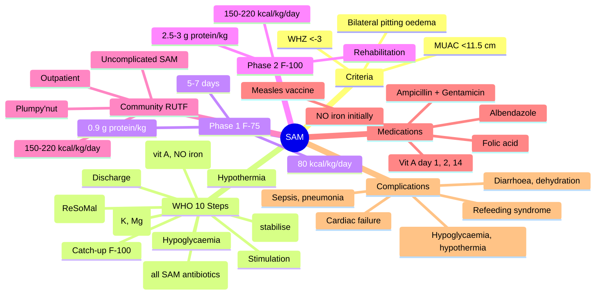

**Related:** [[Nutritional Factors in Disease MOC]], [[Davidson Chapter 22 - Nutritional Factors in Disease Hierarchy]], [[../00_Index/Medicine MOC|Medicine MOC]]

> [!important]
> **SAM: WHZ <-3, MUAC <11.5 cm, OR bilateral pitting oedema; ~14 million children 6–59m globally; WHO 10-step management (stabilisation F-75 → transition F-100/RUTF → rehabilitation); 75% community-based with RUTF; 10–20% mortality untreated, 5% with proper treatment; high-risk for vitamin A deficiency, infections, refeeding.**

## 1. 1. Learning Objectives
- [ ] Define SAM: WHZ <-3, MUAC <11.5 cm, OR bilateral pitting oedema in 6m–5y children
- [ ] List WHO 10 steps: hypoglycaemia, hypothermia, dehydration (ReSoMal), electrolytes (K, Mg), infection (antibiotics for ALL), micronutrients (vit A, NO iron acute), feeding (F-75), catch-up (F-100), stimulation, discharge
- [ ] Differentiate inpatient vs outpatient: complications (medical, oedema, no appetite, weight <4 kg, age <6m) → inpatient; uncomplicated → community RUTF
- [ ] State F-75: stabilisation (low protein 0.9 g/kg, low calories 80 kcal/kg); F-100: rehabilitation (high protein 2.5–3 g/kg, high calories 150–200 kcal/kg)
- [ ] Describe complications: hypoglycaemia, hypothermia, infection (TB, HIV, pneumonia, diarrhoea), severe anaemia, electrolyte imbalances
- [ ] Recognise RUTF (Ready-to-Use Therapeutic Food, Plumpy'nut): peanut-based, calorie-dense, long shelf life, community-based management

## 2. 2. Definitions / Key Concepts

| Term | Definition |
|------|------------|
| **SAM (Severe Acute Malnutrition)** | WHZ <-3, MUAC <11.5 cm, OR bilateral pitting oedema |
| **MAM (Moderate)** | WHZ <-2 to ≥-3, MUAC 11.5–12.5 cm |
| **WHZ (Weight-for-Height Z-score)** | <-2 wasting; <-3 severe wasting (SAM) |
| **MUAC (Mid-Upper Arm Circumference)** | 6–59m: <11.5 cm SAM, 11.5–12.5 cm MAM |
| **RUTF (Ready-to-Use Therapeutic Food)** | Peanut-based, milk powder, sugar, oil, vitamins; 500 kcal/92 g sachet; Plumpy'nut |
| **F-75 Formula** | Stabilisation: 75 kcal/dL, 0.9 g protein/100 mL; days 1–7 |
| **F-100 Formula** | Rehabilitation: 100 kcal/dL, 2.5 g protein/100 mL; days 4–26+ |
| **ReSoMal (Rehydration Solution for Malnutrition)** | Low-Na ORS for SAM; K 40 mmol/L, Na 45 mmol/L, glucose 125 mmol/L |
| **Appetite Test** | RUTF offered; eats >50% = community; <50% = inpatient |
| **10 Steps (WHO)** | Standardised management protocol (1999, updated) |
| **Relactation** | Breastfeeding support during recovery |
| **CVD (Cardiovascular Disease) of SAM** | ↓Cardiac output, ↓renal perfusion, ↓muscle tone; cautious fluid |
| **Recovery (Cure)** | WHZ >-2 OR MUAC >12.5 cm AND oedema free ×2 weeks |
| **Defaulting** | Absent for 2 consecutive visits; intensive follow-up |
| **Failed Response** | No weight gain by day 14 OR oedema not resolved by day 14 OR weight loss after initial gain |

## 3. 3. Core Content

### 1. Section 1: WHO 10 Steps for Inpatient SAM Management
**Phase 1: Stabilisation (Days 1–7; F-75)**
**1. Treat/Prevent Hypoglycaemia** (blood glucose <3 mmol/L)
- Symptomatic: 5 mL/kg D10% IV or D10% NG tube
- Asymptomatic: feed immediately, F-75 every 2–3 h
- If blood glucose <3: monitor every 30 min
- If persistent: 50 mL D10% bolus + maintenance

**2. Treat/Prevent Hypothermia** (axillary <35°C or rectal <35.5°C)
- Rewarming: skin-to-skin, warm blankets, hats
- Hot water bottles (carefully)
- Warm room (>25°C)
- Treat sepsis if present (often coexisting)

**3. Treat/Prevent Dehydration**
- **ReSoMal (low-Na ORS):** 5 mL/kg/h oral/NG over 4–6 h, then 5–10 mL/kg/h (replacement + maintenance)
- **NOT standard ORS** (high Na, risks hypernatraemia in SAM)
- **Drip only if shock** (cautious; Ringer's lactate 15 mL/kg/h; reassess)
- Reassess every 30 min; reclassify dehydration status
- **Avoid:** iv dextrose 5% (hypoNa), blood/plasma in absence of shock

**4. Correct Electrolyte Imbalance**
- **Potassium:** 3–4 mmol/kg/day (F-75 already supplemented)
- **Magnesium:** 0.3–0.6 mmol/kg/day
- **Na:** AVOID Na supplementation (already retained)
- Even with normal serum K/Mg, intracellular depletion exists

**5. Treat/Prevent Infection**
- **Empirical antibiotics for ALL** (even if asymptomatic) — silent sepsis common
- **First-line:** Ampicillin (50 mg/kg q6h) + Gentamicin (5 mg/kg/day) ×7–10 days
- **Alternative:** Ceftriaxone 50–100 mg/kg/day IV/IM ×10 days
- Add **metronidazole** if diarrhoea (amoebiasis, giardia)
- **Malaria test** (RDT/smear); treat if positive
- **Deworming:** Albendazole/mebendazole after day 7
- **TB screening:** Clinical + IGRA/GeneXpert (HIV endemic)

**6. Correct Micronutrient Deficiencies**
- **Vit A:** Day 1, 2, 14 (high dose; 200,000 IU if >12m, 100,000 if 6–12m)
- **Folic acid:** 5 mg day 1; 1 mg daily
- **Multivitamin:** daily; F-75 contains
- **Zinc:** 2 mg/kg/day (in F-75)
- **NO IRON** in acute phase (↓transferrin, free Fe → infection) — start day 7–14 with F-100

**7. Cautious Feeding (F-75)**
- **F-75** = 80–100 kcal/kg/day, 0.9–1.2 g protein/kg/day
- **Frequency:** Every 2–3 hours (8–12 feeds/day, including night)
- **Mode:** NG tube if <80% intake
- **Avoid overfeeding** → refeeding syndrome
- **Transition criteria:** appetite returns, oedema resolving, no infections

**8. Achieve Catch-up Growth (Transition + Rehabilitation)**
- **Transition (days 4–7):** F-100 (or RUTF), 100–135 kcal/kg/day
- **Rehabilitation:** F-100 150–220 kcal/kg/day, 2.5–3.0 g protein/kg/day
- **RUTF (Plumpy'nut) 150–220 kcal/kg/day**
- Target weight gain: 10–15 g/kg/day
- **Iron** now added (F-100 contains)

**9. Provide Sensory Stimulation and Emotional Support**
- Play, structured environment, parental involvement
- Critical for neurodevelopmental recovery (long-term)
- Mitigate post-discharge sequelae

**10. Prepare for Discharge and Follow-up**
- Criteria: WHZ >-2 OR MUAC >12.5 cm, oedema free ×2 weeks, immunisations updated, mother/caregiver trained, food security ensured
- **RUTF** for home (1–2 sachets/day × 2–3 months)
- **Follow-up:** 2 weeks, 1 month, 3 months, 6 months
- **Relapse prevention:** Continued feeding, immunisations, vitamin A every 6 months

### 2. Section 2: Phase 2 Transition
- When appetite returns (days 4–7) and oedema resolving
- **F-100 or RUTF**
- 100–135 kcal/kg/day (transition)
- 150–220 kcal/kg/day (rehabilitation)
- Iron added

### 3. Section 3: Community-Based Management (CMAM)
**Uncomplicated SAM** (>75% of SAM cases): Appetite present, no medical complications, alert
- **Outpatient RUTF programme** (since WHO 2007)
- Weekly or biweekly clinic visits
- RUTF 150–220 kcal/kg/day (~1 sachet per 5 kg body weight/day)
- Routine medications: amoxicillin (broad-spectrum), albendazole, vit A, measles vaccination
- Failure criteria: weight loss ×2 visits, no weight gain ×2 visits, oedema not resolved
- **Defaulting:** 2 consecutive missed visits

**CMAM Advantages:**
- Coverage ↑ (esp. rural)
- ↓Hospitalisation cost
- Family intact
- ↓Hospital-acquired infection

### 4. Section 4: Recovery & Discharge Criteria
- **Recovery (Cure):** WHZ >-2 OR MUAC >12.5 cm AND oedema free ×2 weeks
- **Mortality:** ~10–20% untreated, 5% with WHO protocol
- **Average length of stay:** 3–6 weeks (inpatient)
- **Transfer criteria** between phases: Appetite + no complications
- **Discharge** with RUTF, food security, immunisation, family education, follow-up

### 5. Section 5: Pharmacological Protocol Summary
| Drug | Dose | Timing | Purpose |
|------|------|--------|---------|
| **Amoxicillin** | 50 mg/kg q6h (oral) | All SAM (inpatient + outpatient) | Antibiotic |
| **Gentamicin** | 5 mg/kg/day IM | Inpatient (or ceftriaxone) | Antibiotic |
| **Vitamin A** | 200,000 IU (12m+), 100,000 (6–12m) | Day 1, 2, 14 | Xerophthalmia, mortality |
| **Folic acid** | 5 mg day 1, 1 mg daily | Day 1+ | Anaemia |
| **Albendazole** | 400 mg (2–5y), 200 mg (1–2y) | After day 7 | Deworming |
| **Measles vaccine** | Single dose | After recovery (or day 7+) | Immunisation |
| **Iron** | 3–6 mg/kg elemental | After day 7 (with F-100) | Anaemia (NOT acute) |
| **Potassium** | 3–4 mmol/kg/day | Throughout | K replacement |
| **Magnesium** | 0.3–0.6 mmol/kg/day | Throughout | Mg replacement |
| **RUTF** | 150–220 kcal/kg/day | Stabilisation phase exit onward | Catch-up growth |

### 6. Section 6: Complications of SAM
| Complication | Signs | Action |
|--------------|-------|--------|
| **Hypoglycaemia** | <3 mmol/L; lethargy, seizures | D10% IV/NG, feed within 30 min |
| **Hypothermia** | <35°C | Warm room, blankets, skin-to-skin |
| **Severe anaemia** | Hb <40 g/L (with symptoms) | Blood transfusion (cautious) 10–15 mL/kg over 4 h |
| **Septicaemia/Shock** | ↓BP, cap refill >3s, cold, lethargy | Ringer's lactate 15 mL/kg/h; antibiotics; consider inotropes |
| **Pneumonia** | Tachypnoea, retractions, crepitations | Antibiotics, oxygen |
| **Severe diarrhoea** | With dehydration | ReSoMal; antibiotics |
| **TB/HIV** | Wasting, chronic cough, lymphadenopathy | Screening, treatment |
| **Cardiac failure (refeeding)** | Tachycardia, hepatomegaly, oedema, gallop | Slow/stop feeding; furosemide; cautious |
| **Skin lesions (kwashiorkor)** | Flaky paint | Topical care, F-75, K/Zn |
| **Hypokalaemia** | Weakness, ileus, U waves | K 3–4 mmol/kg/day |
| **Refeeding syndrome** | Hypophosphataemia, cardiac | Thiamine, slow feed, monitor |

## 4. 4. Clinical Correlation

| Scenario | Action | Notes |
|----------|--------|-------|
| 18m child, WHZ <-3, MUAC <11.5, no oedema, no complications, alert | **Community-based RUTF** (Plumpy'nut); amoxicillin; albendazole; vit A; follow-up | >75% SAM uncomplicated |
| 2y child, WHZ <-3, oedema, pneumonia | **Inpatient**: F-75 stabilisation; antibiotics (ampicillin + gentamicin); oxygen; ReSoMal if dehydration; vit A | Complicated SAM |
| 6m child, WHZ <-3, refusing to eat, hypoglycaemia | **Inpatient F-75**; NG feeding; D10% bolus; ampicillin + gentamicin; vit A | Appetite test failed |
| 30m child, recovered from SAM, oedema free ×2 weeks, WHZ >-2 | **Discharge with RUTF**; food security; immunisations; follow-up at 2w, 1m, 3m, 6m | Cure criteria met |
| 4y child, SAM, HIV+, TB | **Inpatient SAM**; TB treatment (RHE); ART; OI prophylaxis (cotrimoxazole); RUTF continuation | HIV-TB co-infection |
| 18m child, SAM, day 5 of F-75, no improvement, oedema increasing | **Failed response**; reconsider: inadequate feeding, infection (TB, HIV, parasites), re-feeding wrong formula, electrolytes (K, Mg), missed diagnosis | Review protocol |

## 5. 5. High-Yield FCPS/MRCP Points

> [!important]
> - **Must know:** SAM criteria (WHZ <-3, MUAC <11.5, OR oedema); 10 steps; F-75 (stabilisation: 80 kcal/kg, 0.9 g protein); F-100 (rehab: 150–200 kcal/kg, 2.5–3 g protein); RUTF (Plumpy'nut, community); vit A 200k IU day 1, 2, 14; NO iron acute; antibiotics for ALL SAM; ReSoMal (low-Na ORS); thiamine before feeding
> - **Common viva:** SAM criteria; 10 steps; F-75 vs F-100; community-based RUTF; vit A timing; no iron acute; when to admit vs outpatient; ReSoMal vs ORS
> - **Exam trap:** Giving iron in acute; standard ORS; high-calorie feed initially; missing complications; forgetting amoxicillin; no antibiotics for "well" SAM

## 6. 6. Common Confusions / Exam Traps

| Trap | Correction |
|------|------------|
| Iron always in anaemia | **NO iron in acute SAM** (↓transferrin, infection); wait 7–14 days |
| Standard ORS for dehydration | **ReSoMal** (low Na); standard ORS too high Na → hyperNa |
| All SAM inpatient | **>75% community-based** with RUTF; only complicated inpatient |
| Same formula throughout | **F-75 stabilisation (days 1–7) → F-100/RUTF rehabilitation (days 4–26+)** |
| Antibiotics only if sick | **ALL SAM get empirical antibiotics** (silent sepsis) |
| High-calorie from day 1 | **F-75 = 80 kcal/kg/day** (low); increases slowly (refeeding) |
| Vit A single dose | **Day 1, 2, 14** (3 doses total) |
| Vitamin A given with measles | **Yes** (200k IU; ↓mortality 50%) |
| Kwashiorkor = less severe | **Highest mortality** (especially marasmic-kwashiorkor) |
| SAM recovery = "fixed" | **Long-term neurodevelopmental risks**; stimulation, follow-up |

## 7. 7. Mnemonics

- **SAM criteria:** **WHZ <-3 OR MUAC <11.5 OR oedema**
- **10 steps:** **H-H-D-E-I-M-F-C-S-D** = **H**ypoglycaemia, **H**ypothermia, **D**ehydration (ReSoMal), **E**lectrolytes, **I**nfection (all SAM), **M**icronutrients (vit A, NO iron), **F**eeding F-75, **C**atch-up F-100, **S**timulation, **D**ischarge
- **F-75:** 75 kcal/dL, 0.9 g protein, 5–7 days stabilisation
- **F-100:** 100 kcal/dL, 2.5 g protein, rehabilitation
- **RUTF:** **R**eady to **U**se, **T**herapeutic **F**ood; community; Plumpy'nut
- **ReSoMal:** **R**ehydration **S**olution for **Mal**nutrition; low Na, high K
- **Vit A schedule:** **Day 1, 2, 14**
- **NO iron:** Acute SAM; start day 7–14 with F-100
- **Empirical antibiotics:** ALL SAM inpatient; ampicillin + gentamicin

## 8. 8. Mind Map

## 9. 9. -Hour Recall Prompts
1. SAM criteria: WHZ <-3 OR MUAC <11.5 OR bilateral pitting oedema
2. WHO 10 steps: H-H-D-E-I-M-F-C-S-D
3. F-75 stabilisation: 80 kcal/kg, 0.9 g protein, 5-7 days
4. F-100 rehabilitation: 150-220 kcal/kg, 2.5-3 g protein
5. RUTF: Plumpy'nut, community, uncomplicated SAM
6. Vit A 200k IU day 1, 2, 14; NO iron acute; antibiotics ALL SAM
7. ReSoMal (low-Na ORS); thiamine before feeding
8. Community >75% SAM; RUTF weekly visits; cure = WHZ >-2 AND oedema free ×2 weeks

## 10. 10. -Day / 15-Day / 30-Day Revision Tracker

| Day | Date | Recall Quality (1-5) | Time Spent | Notes |
|-----|------|---------------------|------------|-------|
| 1   |      |                     |            |       |
| 7   |      |                     |            |       |
| 15  |      |                     |            |       |
| 30  |      |                     |            |       |

---

## 11. 11. Must Know / Should Know / Nice to Know

| Priority | Content |
|----------|---------|
| **Must Know 🔴** | SAM criteria; WHO 10 steps; F-75 vs F-100 composition; RUTF for uncomplicated SAM; vit A day 1, 2, 14; NO iron acute; antibiotics for ALL SAM; ReSoMal (low-Na); thiamine before feeding; community-based management (>75% SAM); complications (hypoglycaemia, hypothermia, sepsis) |
| **Should Know 🟡** | Appetite test; phase 1 vs phase 2 timing; recovery/cure criteria; failed response evaluation; HIV/TB co-infection management; severe anaemia transfusion; cardiac failure; F-100 iron; defaulting criteria; follow-up schedule |
| **Nice to Know 🟢** | CMAM history; WHO 1999 protocol evolution; F-75/F-100 composition details; pHOENIX trial; CMV in SAM; catch-up growth kinetics; immunisation catch-up |

## 12. 12. My Weak Points
- [ ] F-75 vs F-100 specific macronutrient content
- [ ] ReSoMal exact composition
- [ ] Appetite test sensitivity/specificity

## 13. 13. Self-Test Scorecard

| Domain | Score /10 | Target /10 |
|--------|-----------|------------|
| Understanding |    | 8+ |
| Recall |    | 8+ |
| MCQ Performance |    | 8+ |
| SBA Performance |    | 8+ |
| Viva Confidence |    | 8+ |
| **TOTAL** |    | **40+/50** |

## 14. 14. Exam Answer Modes

### 1. Long Answer / Essay (20 min)
**Topic:** "Severe acute malnutrition: WHO 10-step management"
- SAM criteria: WHZ <-3, MUAC <11.5 cm, OR bilateral pitting oedema
- Phase 1 stabilisation (F-75, days 1–7):
  1. Hypoglycaemia (D10% if glucose <3)
  2. Hypothermia (warm room, skin-to-skin)
  3. Dehydration (ReSoMal 5 mL/kg/h, not standard ORS)
  4. Electrolytes (K 3–4, Mg 0.3–0.6 mmol/kg/day; NO Na supplementation)
  5. Infection (empirical ampicillin + gentamicin for ALL SAM)
  6. Micronutrients (vit A day 1, 2, 14; folic acid; multivitamin; NO iron acute)
  7. Cautious feeding (F-75 80 kcal/kg, 0.9 g protein/kg, every 2–3 h)
- Phase 2 transition (days 4–7) → rehabilitation (F-100 150–220 kcal/kg, 2.5–3 g protein/kg, iron added)
- RUTF (Plumpy'nut) for community-based management of uncomplicated SAM
- Complications: hypoglycaemia, hypothermia, sepsis, refeeding syndrome, cardiac failure

### 2. Short Note (7 min)
**Topic:** "F-75 vs F-100 in SAM Management"
| Feature | F-75 | F-100 |
|---------|------|-------|
| Phase | Stabilisation (days 1–7) | Rehabilitation (days 4–26+) |
| Calories | 80–100 kcal/kg/day | 150–220 kcal/kg/day |
| Protein | 0.9–1.2 g/kg/day | 2.5–3.0 g/kg/day |
| Iron | **NO** | **YES** (start day 7–14) |
| Frequency | Every 2–3 h | Every 4 h |
| Route | NG if intake <80% | Oral/RUTF |

### 3. Viva Answer (3 min)
**Q:** "Why is iron contraindicated in acute SAM?"
"A: **Iron is a growth factor for bacteria** (siderophilic pathogens). In acute SAM, **transferrin is depleted** → free Fe available → bacterial proliferation. **Iron supplementation in acute phase → ↑infection risk, mortality**. WHO protocol: **wait 7–14 days** until infection treated, appetite returns, anaemia treated, AND F-100 (with iron) initiated."

### 4. Ward Case Discussion (5 min)
**Case:** 18m child, WHZ <-3, MUAC <11.5, no oedema, alert, eating well, no infections, mother willing for community management.
"Uncomplicated SAM: community-based RUTF. 1. **RUTF 150–220 kcal/kg/day** (1 sachet per 5 kg/day); 2. **Routine medications** (amoxicillin ×5 days, albendazole day 7, vit A day 1 + day 2 + day 14, measles vaccine if >9m); 3. **Weekly clinic visits**; 4. **Mother education** (feeding, hygiene, RUTF storage); 5. **Continue breastfeeding**; 6. **Discharge** when WHZ >-2 AND oedema free ×2 weeks."

### 5. Last-Night-Before-Exam Sheet (1 min)
- **SAM criteria:** WHZ <-3 OR MUAC <11.5 OR oedema
- **10 steps:** **H**ypogly, **H**ypoT, **D**ehydration (ReSoMal), **E**lectrolytes (K, Mg), **I**nfection (all SAM), **M**icronutrients (vit A day 1, 2, 14; NO iron), **F**eeding F-75, **C**atch-up F-100, **S**timulation, **D**ischarge
- **F-75:** 80 kcal/kg, 0.9 g protein, 5-7 days stabilisation
- **F-100:** 150-220 kcal/kg, 2.5-3 g protein, rehabilitation, IRON added
- **RUTF (Plumpy'nut):** Community; >75% SAM uncomplicated
- **Antibiotics:** ALL SAM (ampicillin + gentamicin)
- **Vit A:** 200k IU day 1, 2, 14 (>12m)
- **NO iron acute:** Wait 7-14 days
- **ReSoMal:** Low-Na ORS for SAM dehydration
- **Cure:** WHZ >-2 AND oedema free ×2 weeks

## 15. 15. MCQs (10)

1. **SAM diagnostic criteria (WHO) in 6m–59m children include all EXCEPT:**
   A. WHZ <-3  
   B. MUAC <11.5 cm  
   C. Bilateral pitting oedema  
   D. **Visible severe wasting with MUAC <12.5 cm**  
   E. **All of the above are correct**  

2. **F-75 stabilisation formula composition:**
   A. 100 kcal/kg, 2.5 g protein/kg  
   B. **80 kcal/kg, 0.9 g protein/kg (days 1–7)**  
   C. 150 kcal/kg, 3 g protein/kg  
   D. 50 kcal/kg, 0.5 g protein/kg  
   E. 200 kcal/kg, 4 g protein/kg  

3. **F-100 rehabilitation formula composition:**
   A. 80 kcal/kg, 0.9 g protein/kg  
   B. **150–220 kcal/kg, 2.5–3 g protein/kg (days 4–26+)**  
   C. 50 kcal/kg, 0.5 g protein/kg  
   D. 100 kcal/kg, 1 g protein/kg  
   E. 250 kcal/kg, 5 g protein/kg  

4. **RUTF (Ready-to-Use Therapeutic Food):**
   A. Inpatient SAM only  
   B. Stabilisation phase only  
   C. **Community-based management of uncomplicated SAM (Plumpy'nut)**  
   D. Acute dehydration only  
   E. Refeeding syndrome only  

5. **ReSoMal (Rehydration Solution for Malnutrition) used in SAM because:**
   A. Higher K content  
   B. Lower osmolarity  
   C. **Standard ORS too high Na; risks hypernatraemia in malnourished**  
   D. Lower glucose  
   E. Better taste compliance  

6. **Iron in acute SAM:**
   A. Give immediately  
   B. **AVOID in acute phase (↓transferrin, infection); start 7–14 days after stabilisation**  
   C. High-dose IV  
   D. With antibiotics  
   E. Daily for 1 month  

7. **Vitamin A high-dose regimen in SAM:**
   A. 100,000 IU day 1 only  
   B. **200,000 IU day 1, 2, 14 (age 12m+)**  
   C. 500,000 IU weekly  
   D. 50,000 IU daily ×7 days  
   E. 100,000 IU day 1, 7, 14  

8. **Empirical antibiotics in SAM:**
   A. Only if febrile  
   B. Only if chest signs  
   C. **All SAM (silent sepsis common); ampicillin + gentamicin**  
   D. Only on admission  
   E. Only on culture results  

9. **SAM cure criteria:**
   A. WHZ >-1 OR MUAC >12 cm  
   B. **WHZ >-2 OR MUAC >12.5 cm AND oedema free ×2 weeks**  
   C. Weight gain only  
   D. No complications only  
   E. Appetite normal only  

10. **RUTF vs F-100 — community SAM advantage of RUTF:**
    A. Lower calories  
    B. Higher protein  
    C. **Long shelf life, doesn't need preparation, family-based care, no refrigeration**  
    D. More iron  
    E. More vitamins  

## 16. 16. SBA Questions (5)

1. **A 3-year-old child with bilateral pitting oedema, WHZ <-3, MUAC 10.5, no medical complications, alert, eating. Best management?**
   A. Inpatient F-75  
   B. **Community-based RUTF (uncomplicated SAM despite oedema, alert, eating)**  
   C. F-100 inpatient  
   D. TPN  
   E. NG tube feeding only  

2. **A 2-year-old child with SAM, pneumonia, hypoglycaemia 2.5 mmol/L, lethargic. Most appropriate immediate management?**
   A. **D10% IV 5 mL/kg + antibiotics + F-75 + vit A + monitoring**  
   B. F-100 immediately  
   C. RUTF outpatient  
   D. IV iron  
   E. NS bolus 20 mL/kg  

3. **A 9-month-old SAM child with persistent oedema on day 14 of treatment. Action?**
   A. Stop treatment  
   B. **Investigate for failed response (TB, HIV, electrolyte imbalance, inadequate feeding)**  
   C. Increase to F-100 only  
   D. Add iron  
   E. Add RUTF  

4. **A 2-year-old SAM child with shock (lethargic, cap refill 5s, BP 60/40). Best initial fluid?**
   A. NS bolus 20 mL/kg rapidly  
   B. **Ringer's lactate 15 mL/kg/h; reassess; consider inotropes; broad-spectrum antibiotics**  
   C. Dextrose 5%  
   D. D10% only  
   E. ReSoMal 5 mL/kg/h  

5. **A 5-year-old child with SAM, no oedema, alert, eating, no complications. Best management?**
   A. Inpatient F-75  
   B. **Community-based RUTF (outpatient management)**  
   C. F-100 inpatient  
   D. TPN  
   E. NG tube  

## 17. 17. Flashcards

- Q: SAM criteria  
  A: **WHZ <-3 OR MUAC <11.5 cm OR bilateral pitting oedema (6-59m)**
- Q: WHO 10 steps mnemonic  
  A: **H-H-D-E-I-M-F-C-S-D** = Hypo, HypoT, Dehydration, Electrolytes, Infection, Micronutrients, Feeding F-75, Catch-up F-100, Stimulation, Discharge
- Q: F-75 composition  
  A: **80 kcal/kg/day, 0.9 g protein/kg/day, 5-7 days stabilisation**
- Q: F-100 composition  
  A: **150-220 kcal/kg/day, 2.5-3 g protein/kg/day, rehabilitation, IRON added**
- Q: RUTF  
  A: **Plumpy'nut; community SAM; 150-220 kcal/kg/day; long shelf life**
- Q: ReSoMal  
  A: **Low-Na ORS for SAM dehydration (Na 45, K 40 mmol/L)**
- Q: Vit A schedule  
  A: **200,000 IU day 1, 2, 14 (>12m); 100,000 IU (6-12m)**
- Q: Iron in SAM  
  A: **AVOID acute phase (↓transferrin, infection); start 7-14 days**
- Q: Antibiotics in SAM  
  A: **ALL SAM (silent sepsis); ampicillin + gentamicin**
- Q: Cure criteria  
  A: **WHZ >-2 OR MUAC >12.5 cm AND oedema free ×2 weeks**
- Q: Appetite test  
  A: **RUTF offered; eats >50% = community; <50% = inpatient**
- Q: Empirical antibiotics  
  A: **Ampicillin 50 mg/kg q6h + Gentamicin 5 mg/kg/day ×7-10 days**
- Q: ReSoMal vs ORS  
  A: **ReSoMal: Na 45, K 40, glucose 125; ORS: Na 75, K 20, glucose 75**
- Q: Phase 1 duration  
  A: **5-7 days F-75** (stabilisation)
- Q: Phase 2 transition criteria  
  A: **Appetite returns, oedema resolving, no infections**

## 18. 18. Answer Key with Explanations

### 1. MCQs
1. **D** — All of the above are correct: WHZ <-3, MUAC <11.5 cm, bilateral pitting oedema are the WHO SAM criteria.
2. **B** — F-75 stabilisation: 80 kcal/kg/day, 0.9 g protein/kg/day, 5–7 days; F-100 = rehabilitation.
3. **B** — F-100 rehabilitation: 150–220 kcal/kg/day, 2.5–3 g protein/kg/day, days 4–26+; includes iron.
4. **C** — RUTF (Plumpy'nut): community-based management of uncomplicated SAM; >75% of SAM.
5. **C** — ReSoMal: low-Na ORS for SAM dehydration; standard ORS high Na risks hypernatraemia in malnourished.
6. **B** — Iron in acute SAM: AVOID (↓transferrin, free Fe → infection); start 7–14 days after stabilisation with F-100.
7. **B** — Vit A in SAM: 200,000 IU day 1, 2, 14 (age 12m+); ↓measles mortality 50%; treats xerophthalmia.
8. **C** — Antibiotics in SAM: ALL SAM (silent sepsis common); ampicillin + gentamicin ×7–10 days.
9. **B** — SAM cure: WHZ >-2 OR MUAC >12.5 cm AND oedema free ×2 weeks.
10. **C** — RUTF advantage: long shelf life, no preparation, family-based care, no refrigeration; community management.

### 2. SBAs
1. **B** — SAM (oedema, WHZ <-3, MUAC 10.5) but uncomplicated (alert, eating, no complications): community-based RUTF.
2. **A** — SAM + pneumonia + hypoglycaemia: D10% 5 mL/kg + antibiotics (ampicillin + gentamicin) + F-75 + vit A + monitoring.
3. **B** — Failed response: persistent oedema on day 14; investigate (TB, HIV, electrolyte imbalance, inadequate feeding).
4. **B** — SAM + shock: cautious Ringer's lactate 15 mL/kg/h (not aggressive NS); reassess; antibiotics; consider inotropes.
5. **B** — SAM uncomplicated (5y, no oedema, alert, eating): community-based RUTF (outpatient).

## 19. 19. Summary

**Severe Acute Malnutrition (SAM)** is a **Must Know 🔴** topic for FCPS/MRCP.
**Key takeaway:** SAM = WHZ <-3, MUAC <11.5 cm, OR bilateral pitting oedema. WHO 10 steps: 1) Hypoglycaemia (D10%), 2) Hypothermia, 3) Dehydration (ReSoMal), 4) Electrolytes (K, Mg, NO Na), 5) Infection (ampicillin + gentamicin ALL SAM), 6) Micronutrients (vit A day 1, 2, 14; **NO iron acute**), 7) Feeding (F-75 80 kcal/kg, 0.9 g protein, 5–7 days), 8) Catch-up (F-100 150–220 kcal/kg, 2.5–3 g protein, IRON), 9) Stimulation, 10) Discharge. **RUTF (Plumpy'nut) for community-based >75% SAM.** Cure = WHZ >-2 AND oedema free ×2 weeks.
**Exam focus:** SAM criteria, 10 steps, F-75 vs F-100, vit A schedule, NO iron, antibiotics all SAM, ReSoMal, community management.
**Clinical relevance:** Global child health (14M children SAM); WHO 10-step protocol; community-based management expansion; HIV/TB co-infection.

*Template version: 1.0 | Davidson 24e Ch 22 aligned | FCPS/MRCP oriented*
