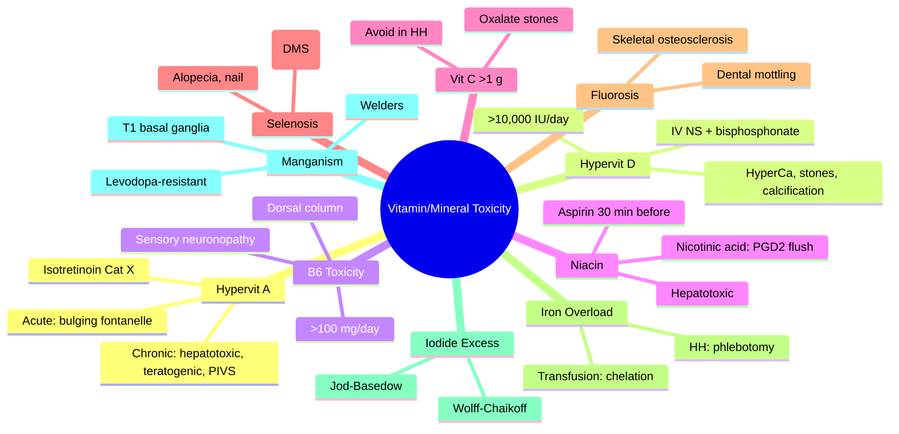

**Related:** [[Nutritional Factors in Disease MOC]], [[Davidson Chapter 22 - Nutritional Factors in Disease Hierarchy]], [[../00_Index/Medicine MOC|Medicine MOC]]

> [!important]
> **Hypervitaminosis: Vit A (teratogenic, hepatotoxic, ↑ICP); Vit D (hypercalcaemia, stones); Vit B6 (sensory neuronopathy >100 mg/day chronic); Vit C (oxalate renal stones >1 g/day); Vit B3 (niacin flush); Selenosis (garlic breath, alopecia); Iron overload (HH, transfusions); Iodide excess (Wolff-Chaikoff); Fluorosis (skeletal/dental).**

## 1. 1. Learning Objectives
- [ ] Identify hypervitaminosis A: acute (bulging fontanelle, ↑ICP), chronic (teratogenicity Category X, hepatotoxicity, hyperostosis, alopecia)
- [ ] State hypervitaminosis D: hypercalcaemia (Ca >3.5), stones, nephrocalcinosis, polyuria, nausea; threshold >10,000 IU/day chronic
- [ ] Recognise vitamin B6 (pyridoxine) toxicity: sensory neuronopathy (dorsal column) at >100 mg/day chronic; reversible on cessation
- [ ] Describe niacin excess: flushing (PGD2), hepatotoxicity (time-release), hyperglycaemia, hyperuricaemia
- [ ] State vitamin C megadose: oxalate renal stones, diarrhoea, false glucose/FOB; avoid in haemochromatosis
- [ ] Recognise selenosis: garlic breath (dimethyl selenide), alopecia, nail brittleness
- [ ] Identify fluorosis: dental mottling (mild), skeletal fluorosis (severe; osteosclerosis, calcification)
- [ ] State iron overload: hereditary (HFE C282Y), transfusional (thalassaemia, MDS), iatrogenic; phlebotomy, chelation

## 2. 2. Definitions / Key Concepts

| Term | Definition |
|------|------------|
| **Hypervitaminosis A** | Chronic excess (>10x RDA); acute toxic dose >100x single; teratogenic; hepatotoxic; hyperostosis |
| **Acute Vit A Toxicity** | Single dose >300,000 IU; nausea, vomiting, headache, bulging fontanelle (infants), ↑ICP |
| **Chronic Vit A Toxicity** | >25,000 IU/day ×months; dry skin, alopecia, hepatomegaly, hyperostosis, teratogenicity |
| **Isotretinoin (13-cis-RA)** | Severe acne; Category X teratogen; iPledge programme |
| **Hypervitaminosis D** | Chronic >10,000 IU/day; hyperCa, hypercalciuria, stones, nephrocalcinosis, metastatic calcification |
| **Vitamin B6 (Pyridoxine) Toxicity** | Sensory neuronopathy (dorsal column); >100 mg/day chronic; reversible 6–24 months |
| **Niacin (Vit B3) Excess** | Nicotinic acid: flushing (PGD2), pruritus; hepatotoxicity (time-release); hyperglycaemia, hyperuricaemia |
| **Hypervitaminosis C** | >1 g/day chronic; oxalate renal stones, osmotic diarrhoea; false glucose/FOB; avoid in HH |
| **Selenosis** | Chronic >400 µg/day; garlic breath (dimethyl selenide), alopecia, nail brittleness, paresthesia |
| **Fluorosis** | Chronic F excess (>4 ppm water); dental mottling (mild), skeletal osteosclerosis (severe) |
| **Iron Overload** | HH (HFE C282Y), transfusion (thalassaemia, MDS, sickle), iatrogenic; phlebotomy, chelation (deferasirox) |
| **Iodine Excess (Wolff-Chaikoff)** | Chronic excess → organification block; escape normal, sustained in autoimmune |
| **Manganese (Mn) Excess (Manganism)** | Welders/miners; Parkinson-like; T1 basal ganglia hyperintensity; levodopa-resistant |
| **Copper Excess** | Wilson's disease (ATP7B); ICC (historical) |
| **Selenium Excess** | Se >400 µg/day; garlic breath, alopecia, paresthesia |

## 3. 3. Core Content

### 1. Section 1: Hypervitaminosis A
**Acute Toxicity (single dose >100,000 IU):**
- Nausea, vomiting, anorexia
- Severe headache
- Blurred vision, diplopia (VI nerve palsy from ↑ICP)
- Bulging fontanelle (infants)
- Drowsiness, irritability
- Skin desquamation (later)

**Chronic Toxicity (>10,000 IU/day months; >10x RDA):**
- **Dry, scaly, pruritic skin** (xerosis; cheilosis; eczema)
- **Alopecia**
- **Hepatomegaly, splenomegaly** (hepatic fibrosis, cirrhosis, portal HTN)
- **Hyperostosis** (long bones, periosteal calcification, bone pain)
- **Arthralgia, myalgia**
- **Pseudotumor cerebri (PIVS)** — ↑ICP without mass; papilloedema, headache, VI palsy
- **Teratogenicity:** Isotretinoin (13-cis-RA) Category X; HOX gene dysregulation; **craniofacial, cardiac, thymic, CNS** abnormalities
- **Hypercalcaemia** (rare; bone resorption)

**iPledge Programme:** Isotretinoin teratogenicity prevention; 2 negative pregnancy tests + 2 contraception methods.

**Treatment:** Stop Vit A; supportive; mannitol/PB for PIVS; vitamin K if coagulopathy; teratogenic warnings.

**Sources of Excess:** Arctic explorers (polar bear liver = toxic doses), supplements (>10x RDA), megavitamin therapy, isotretinoin (acne), tretinoin (APL).

### 2. Section 2: Hypervitaminosis D
**Threshold:** Chronic >10,000 IU/day; toxic levels 25(OH)D >150 ng/mL (>375 nmol/L).
**Mechanism:** ↑Ca × PO4 → ectopic calcification, hypercalcaemia, renal damage.

**Clinical:**
- **Hypercalcaemia** (Ca >3 mmol/L): nausea, vomiting, polyuria, polydipsia, dehydration, constipation
- **Nephrolithiasis** (Ca oxalate/PO4), nephrocalcinosis
- **Vascular calcification**, cardiac
- **Bone pain** (hyperostosis)
- **Pancreatitis** (acute)
- **Hypertension**, arrhythmias (short QT)
- **Cognitive:** Confusion, lethargy, coma

**Treatment:** Stop D; IV NS hydration (3–4 L/day); furosemide after rehydration; bisphosphonates (pamidronate/zoledronate); glucocorticoids (granulomatous); haemodialysis.

**Causes:** Excess supplementation, fortified foods, milk (accidental overfortification), granulomatous disease (sarcoid), topical calcipotriol (psoriasis).

### 3. Section 3: Vitamin B6 (Pyridoxine) Toxicity
**Threshold:** >100 mg/day chronic; typically >500 mg/day; >2 g single dose.
**Mechanism:** Direct toxicity to dorsal root ganglia; large sensory fibre degeneration.
**Risk:** Megavitamin therapy, "natural" supplements, INH adjunct (high dose), isoniazid prophylaxis doses should be lower (10–25 mg/day).

**Clinical (Sensory Neuronopathy):**
- Loss of vibration and position sense (dorsal column)
- Sensory ataxia (positive Romberg)
- Pseudoathetosis (sensory loss → spontaneous movements)
- **Preserved motor** (no weakness, no UMN signs)
- **Burning feet** paradoxically
- Absent sensory potentials on NCS
- **Reversible** on stopping (6–24 months, may be incomplete)

### 4. Section 4: Niacin (Vit B3) Excess
**Nicotinic Acid Toxicity (Therapeutic Doses 1.5–3 g/day):**
- **Cutaneous flushing** (PGD2 via GPER109A on Langerhans cells); face, neck, trunk; warmth, pruritus, urticaria
- Tachyphylaxis with continued use
- **Aspirin 325 mg 30 min before** reduces flushing (PGD2 inhibition)
- Laropiprant (PGD2 antagonist) — withdrawn
- **Hepatotoxicity:** Time-release > immediate-release; cholestatic, transaminitis; weekly LFTs initially
- **Hyperglycaemia** (↑insulin resistance)
- **Hyperuricaemia** (↓renal urate excretion) → gout
- **GI upset**, dyspepsia

**Nicotinamide (Niacinamide):** No flush; no lipid effect; safe in high dose; used for pellagra, actinic keratosis prevention.

**Avoid in:** Active liver disease, severe gout, peptic ulcer, hyperuricaemia.

### 5. Section 5: Hypervitaminosis C (Ascorbate)
**Threshold:** >1 g/day chronic (UL 2 g/day).
**Effects:**
- **Oxalate renal stones** (calcium oxalate; hyperoxaluria)
- **Osmotic diarrhoea** (>1 g single dose)
- **Nausea, abdominal cramps**
- **False lab tests:** Glucose (false low), faecal occult blood (false negative), uric acid
- **Iron overload** (in haemochromatosis); ↑Fe absorption
- **Pro-oxidant at very high dose** (>5 g); theoretical cancer promotion
- **Rebound scurvy** on cessation (high dose → ↑catabolism; rapid stop → deficiency)

**Cautions:** Avoid high-dose in haemochromatosis; ↑stones in hyperoxaluria history.

### 6. Section 6: Other Vitamin Toxicities

| Vitamin | Toxic Effects | Notes |
|---------|---------------|-------|
| **Vit E** | High-dose (>400 IU/day): ↑haemorrhagic stroke, ↑mortality (meta-analysis), ↑prostate cancer (SELECT) | Avoid high-dose in anticoagulated, smokers |
| **Vit K** | Synthetic K3 (menadione): haemolysis, kernicterus (infants) | K1 and K2 safe; not used clinically |
| **Thiamine** | Very safe (water-soluble); no known toxicity |  |
| **Riboflavin** | Bright yellow urine (harmless cosmetic) |  |
| **B12** | No known toxicity (water-soluble) | Acne, rosacea (rare) |
| **Folate** | Masks B12 deficiency (hides anaemia, worsens B12 neuro); UL 1 mg | Check B12 before folate |
| **Biotin** | Lab interference (TSH, troponin, β-hCG) at high dose | "Biotin interference" warning |

### 7. Section 7: Selenosis (Selenium Excess)
**Threshold:** >400 µg/day chronic; acute 5 mg/kg.
**Sources:** Brazil nuts (up to 1917 µg/nut), supplements, metal refining.
**Clinical:**
- **Garlic breath** (dimethyl selenide exhalation)
- **Alopecia**
- **Nail brittleness** (transverse lines, Beau's lines)
- Paresthesia, peripheral neuropathy
- GI upset, diarrhoea
- Skin rash, dermatitis
- **Garlic sweat**

**Treatment:** Stop exposure; supportive; chelation not effective; resolution 1–2 months.

### 8. Section 8: Iron Overload
**Causes:**
- **Hereditary Haemochromatosis (HH):** HFE C282Y/H63D; TSAT >45%, ferritin ↑↑
- **Secondary:** Chronic transfusions (thalassaemia major, sickle, MDS, dialysis), ineffective erythropoiesis
- **Iatrogenic:** Excess IV iron (rare, but ↑with chronic use)
- **African iron overload:** Dietary + genetic

**Complications:** Cirrhosis, HCC, cardiomyopathy, DM ("bronze diabetes"), hypogonadism, arthropathy, infections (Listeria, Yersinia, Vibrio vulnificus).

**Treatment:**
- **Therapeutic phlebotomy** (1 unit 450 mL weekly; 250 mg Fe per unit) until ferritin <50 µg/L; lifelong if HFE C282Y
- **Iron chelation** (if phlebotomy contraindicated — anaemia, cardiac disease): deferasirox 20–30 mg/kg/day, deferoxamine (SC/IV), deferiprone
- **Low-iron diet** (limit red meat, vitamin C, raw shellfish; tea/coffee inhibit)
- **HCC surveillance** (US + AFP q6m if cirrhotic)

### 9. Section 9: Iodide Excess
**Wolff-Chaikoff Effect:** Chronic excess → organification block (TPO inhibition) → transient hypothyroidism; **escape** in 24-48h (normal thyroid); **sustained** in autoimmune (Hashimoto).
**Jod-Basedow:** Excess in I-deficient subject with autonomy (multinodular, Graves) → hyperthyroidism.

**Sources:** Amiodarone (37% I), iodinated contrast, kelp, Lugol's solution, seaweed.
**Pregnancy:** Maternal excess → foetal goitre, neonatal hypothyroidism.

### 10. Section 10: Manganese Excess (Manganism)
**Sources:** Welders (Mn fumes), miners, contaminated water.
**Pathology:** Basal ganglia Mn deposition (globus pallidus).
**Clinical:** Parkinson-like (bradykinesia, rigidity, postural instability, dystonia), neuropsychiatric.
**MRI:** T1-weighted hyperintensity in basal ganglia.
**Treatment:** Stop exposure; chelation (EDTA, PAS); trientine; levodopa-resistant.

### 11. Section 11: Fluoride Excess (Fluorosis)
**Sources:** Drinking water (>4 ppm), industrial exposure, supplements, toothpaste (children).
**Dental (mild, <4 ppm):** Mottling, white spots, brown staining.
**Skeletal (severe, chronic >4 ppm):** Osteosclerosis, calcification of ligaments, osteophytes, bone pain, joint restriction, crippling deformity, nerve compression.
**Acute toxicity:** GI upset, salivation, hyperreflexia, seizures (very high dose).

### 12. Section 12: Trace Element Toxicities Summary

| Element | UL | Toxicity | Management |
|---------|-----|---------|------------|
| **Iron** | 45 mg/day | Haemochromatosis, IV iron excess | Phlebotomy, deferasirox |
| **Zinc** | 40 mg/day | Cu deficiency, sideroblastic, ↓immune | Stop Zn, supplement Cu |
| **Iodine** | 1100 µg/day | Wolff-Chaikoff, Jod-Basedow, neonatal goitre | Stop iodine, levothyroxine if hypothyroid |
| **Selenium** | 400 µg/day | Selenosis (garlic breath, alopecia, paresthesia) | Stop, supportive |
| **Copper** | 10 mg/day | Wilson's disease, ICC | Penicillamine, trientine, Zn |
| **Fluoride** | 10 mg/day | Fluorosis (dental, skeletal) | Avoid source, supportive |
| **Manganese** | 11 mg/day | Manganism (Parkinson-like) | Stop exposure, chelation |
| **Selenium** | 400 µg/day | Selenosis | Stop, supportive |
| **Calcium** | 2000–2500 mg/day | Milk-alkali, stones, hyperCa | Hydration, bisphosphonate |
| **Magnesium** | 350 mg (supplement) | Hypermagnesaemia (renal failure, laxative excess) | Ca gluconate IV |

## 4. 4. Clinical Correlation

| Scenario | Action | Notes |
|----------|--------|-------|
| 5y child, accidental Vit A overdose (10x dose), bulging fontanelle, vomiting | **Stop Vit A**; mannitol if ↑ICP severe; supportive; monitor LFT | Acute hypervit A |
| 30F, isotretinoin for acne, planning pregnancy | **STOP immediately** (Category X); 2 contraception methods; iPledge; pregnancy test; switch to topical | Teratogenicity weeks 3–8 |
| 65F, vit D 50,000 IU daily ×2y, hypercalcaemia 3.2, stones | **Stop Vit D**; IV NS + furosemide; bisphosphonate; monitor Ca/Cr | Chronic hypervit D; nephrocalcinosis risk |
| 40F, pyridoxine 500 mg ×2y for PMS, sensory ataxia | **Stop pyridoxine**; monitor recovery 6-24 months; B12 and neuropathy workup | Sensory neuronopathy |
| 55M, niacin 2 g for hyperlipidaemia, flushing, transaminitis | **Aspirin 30 min before** OR switch to extended-release with monitoring; check LFT weekly | PGD2-mediated; hepatotoxicity |
| 70M, HH on phlebotomy, ferritin stable at 200, takes 50 mg iron daily | **Stop iron** (contraindicated in HH); phlebotomy continues; HCC surveillance | Iron in HH worsens overload |
| 35F, welder, Parkinson-like, T1 basal ganglia | **Stop Mn exposure**; chelation (EDTA, PAS, trientine); levodopa-poor response | Manganism |
| 50F, fluorosis, drinking water 6 ppm | **Change water source**; consider dental cosmetic; skeletal survey if symptomatic | Public health intervention |

## 5. 5. High-Yield FCPS/MRCP Points

> [!important]
> - **Must know:** Hypervit A (teratogenic Category X, hepatotoxic, PIVS); Hypervit D (hyperCa, stones, >10k IU); Pyridoxine >100 mg sensory neuronopathy; Niacin (flushing PGD2, hepatotoxicity); Vit C oxalate stones; Selenosis (garlic breath); Fluorosis (dental mottling, skeletal osteosclerosis); Iron overload (HH phlebotomy, transfusion chelation)
> - **Common viva:** Isotretinoin teratogenicity; Vit D toxicity mechanism; Pyridoxine sensory neuropathy; Niacin flush (aspirin, laropiprant withdrawn); Selenosis garlic breath; HH phlebotomy; Fluorosis water levels
> - **Exam trap:** Giving iron in HH; giving folate before B12; not recognising hypervit A; missing Selenosis; niacin vs nicotinamide

## 6. 6. Common Confusions / Exam Traps

| Trap | Correction |
|------|------------|
| All hypervit A is acute | **Chronic: >10x RDA ×months; teratogenic, hepatotoxic, PIVS, hyperostosis** |
| Niacin = nicotinamide toxicity | **Nicotinic acid: flushing, hepatotoxic; Nicotinamide: no flush, no lipid effect, no toxicity** |
| B6 megadose safe | **>100 mg/day chronic → sensory neuronopathy** (dorsal column) |
| Vit C always protective | **>1 g/day → oxalate stones, false glucose, avoid in HH** |
| Iron in HH beneficial | **CONTRAINDICATED in HH**; phlebotomy only |
| Fluorosis = dental only | **Skeletal fluorosis with osteosclerosis + calcification** (chronic high F) |
| Mn excess = same as PD | **Manganism: dystonia prominent, levodopa-resistant, T1 MRI basal ganglia** |
| Selenosis = rare | **Brazil nuts (high Se), supplements, occupational**; garlic breath |

## 7. 7. Mnemonics

- **Hypervit A:** **C**raniofacial, **C**ardiac, **C**NS, **T**hymic teratogenicity (Cat X)
- **Acute vit A:** **B**ulging fontanelle, **H**eadache, **V**omiting; **PIVS** (↑ICP)
- **Hypervit D:** **HyperCa** → **S**tones, **B**ones, **G**roans, **P**sychiatric
- **Pyridoxine toxicity:** **S**ensory **N**euronopathy **D**orsal **C**olumn (SND); >100 mg/day
- **Niacin flush:** **PGD2** via **G**PER109A; **A**spirin 30 min before
- **Selenosis:** **G**arlic breath, **A**lopecia, **N**ail brittleness = **GAN**
- **Vit C excess:** **O**xalate, **D**iarrhoea, **F**alse glucose, **H**aemochromatosis (avoid) = **ODFH**
- **Iron overload Rx:** **P**hlebotomy (HH) + **C**helation (transfusion, deferasirox)
- **HyperCa management:** **C**alcitonin, **B**isphosphonate, **D**ialysis, **H**ydration
- **Vit B6 megadose** = **S**low **N**erve **D**amage (dorsal column)
- **Manganism:** **M**an**G**anese = **G**lobus **P**allidus; T1 MRI

## 8. 8. Mind Map

## 9. 9. -Hour Recall Prompts
1. Hypervit A: Category X teratogen (HOX genes); PIVS; hepatotoxic; hyperostosis
2. Hypervit D: >10,000 IU/day; hyperCa, stones, calcification
3. B6 toxicity: >100 mg/day; sensory neuronopathy (dorsal column)
4. Niacin flush: PGD2, GPER109A; aspirin 30 min before
5. Selenosis: garlic breath, alopecia, nail brittleness
6. Vit C excess: oxalate stones, avoid in HH
7. Iron overload: HH phlebotomy; transfusion chelation (deferasirox)
8. Fluorosis: dental mottling (mild), skeletal osteosclerosis (severe)

## 10. 10. -Day / 15-Day / 30-Day Revision Tracker

| Day | Date | Recall Quality (1-5) | Time Spent | Notes |
|-----|------|---------------------|------------|-------|
| 1   |      |                     |            |       |
| 7   |      |                     |            |       |
| 15  |      |                     |            |       |
| 30  |      |                     |            |       |

---

## 11. 11. Must Know / Should Know / Nice to Know

| Priority | Content |
|----------|---------|
| **Must Know 🔴** | Hypervit A (teratogenic Cat X, hepatotoxic, PIVS, hyperostosis); Hypervit D (hyperCa, >10k IU); B6 sensory neuronopathy >100 mg; Niacin flush (PGD2, aspirin); Selenosis (garlic breath); Vit C oxalate; Iron overload (HH phlebotomy); Fluorosis (skeletal) |
| **Should Know 🟡** | Iodide Wolff-Chaikoff; Manganism (welders, T1 MRI); Vit E ↑mortality/SELECT; biotin interference; vit K3 (menadione) toxicity; laropiprant withdrawn; iPledge isotretinoin |
| **Nice to Know 🟢** | Megavitamin therapy; teratogenic window weeks 3-8; HOX gene dysregulation; iPledge specifics; HFCS/Se in agriculture |

## 12. 12. My Weak Points
- [ ] Isotretinoin iPledge specifics
- [ ] Manganism chelation protocols
- [ ] Biotin lab interference

## 13. 13. Self-Test Scorecard

| Domain | Score /10 | Target /10 |
|--------|-----------|------------|
| Understanding |    | 8+ |
| Recall |    | 8+ |
| MCQ Performance |    | 8+ |
| SBA Performance |    | 8+ |
| Viva Confidence |    | 8+ |
| **TOTAL** |    | **40+/50** |

## 14. 14. Exam Answer Modes

### 1. Long Answer / Essay (20 min)
**Topic:** "Hypervitaminosis and trace element toxicity"
- Hypervit A: acute (bulging fontanelle, ↑ICP) and chronic (teratogenic Cat X, hepatotoxic, PIVS, hyperostosis); iPledge for isotretinoin
- Hypervit D: >10,000 IU/day chronic; hyperCa, stones, nephrocalcinosis, vascular calcification; IV NS + bisphosphonate
- Pyridoxine: >100 mg/day chronic; sensory neuronopathy (dorsal column); reversible
- Niacin: nicotinic acid flush (PGD2); hepatotoxic (time-release); aspirin 30 min before
- Selenosis: garlic breath, alopecia, nail
- Vit C >1 g: oxalate stones, avoid in HH
- Iron overload: HH phlebotomy; transfusion chelation
- Fluorosis: dental mottling, skeletal osteosclerosis

### 2. Short Note (7 min)
**Topic:** "Isotretinoin Teratogenicity and iPledge"
- Category X teratogen; HOX gene dysregulation
- **Critical window: weeks 3–8 gestation**
- **Defects:** Craniofacial, cardiac (conotruncal), thymic, CNS
- **iPledge Programme:** 2 negative pregnancy tests + 2 contraception methods (barrier + hormonal) for 1 month before, during, and 1 month after treatment
- Avoid in pregnancy, breastfeeding, severe liver disease
- Side effects: cheilitis, dry skin, ↑TG, ↑LFT, mood changes (depression, suicidality), pseudotumor cerebri (PIVS)
- Monitor: LFT, lipids, pregnancy tests monthly

### 3. Viva Answer (3 min)
**Q:** "How do you manage hypervitaminosis D?"
"A: **Stop vitamin D immediately**. IV NS hydration (3–4 L/day) — volume expansion; **furosemide 40–80 mg IV** after rehydration (calciuresis). **Bisphosphonates** (pamidronate 60–90 mg IV or zoledronate 4 mg IV) for severe hyperCa. **Glucocorticoids** (prednisolone 40 mg/day) in granulomatous disease (↓1α-hydroxylase in macrophages). **Haemodialysis** if renal failure or refractory. Monitor Ca, Cr, 25(OH)D."

### 4. Ward Case Discussion (5 min)
**Case:** 30F, 2 years on isotretinoin for severe cystic acne, planning pregnancy.
"STOP isotretinoin (Category X teratogen). **Teratogenic window: weeks 3–8 gestation**; HOX gene dysregulation → craniofacial, cardiac, thymic, CNS defects. **iPledge programme:** 2 negative pregnancy tests + 2 contraception methods (e.g., hormonal + barrier) before, during, and 1 month after treatment. **Switch to alternative acne treatment** (topical retinoid Category C; topical benzoyl peroxide; erythromycin). Counsel: NO pregnancy for 1 month after stopping."

### 5. Last-Night-Before-Exam Sheet (1 min)
- **Hypervit A:** Teratogenic Cat X (HOX); hepatotoxic; PIVS; hyperostosis
- **Hypervit D:** >10k IU/day; hyperCa, stones, calcification; IV NS + bisphosphonate
- **B6 toxicity:** >100 mg/day; sensory neuronopathy (dorsal column)
- **Niacin:** Nicotinic acid flush (PGD2); aspirin 30 min before; hepatotoxic
- **Selenosis:** Garlic breath (DMS), alopecia, nail
- **Vit C excess:** Oxalate stones, avoid in HH
- **Iron overload:** HH phlebotomy; transfusion chelation (deferasirox)
- **Fluorosis:** Dental mottling (mild), skeletal osteosclerosis (severe)
- **Iodide excess:** Wolff-Chaikoff (organification block), Jod-Basedow (hyperthyroid)
- **Manganism:** Welders; T1 basal ganglia; levodopa-resistant
- **Biotin interference:** Lab assays at high dose

## 15. 15. MCQs (10)

1. **Isotretinoin pregnancy risk:**
   A. Category A  
   B. Category B  
   C. Category C  
   D. **Category X (teratogenic)**  
   E. Safe in pregnancy  

2. **Vitamin A critical teratogenic window:**
   A. Weeks 1–2  
   B. **Weeks 3–8 (neural crest, organogenesis)**  
   C. Weeks 12–16  
   D. Weeks 20–24  
   E. Trimester 3  

3. **Hypervitaminosis D threshold for toxicity:**
   A. >2,000 IU/day  
   B. >4,000 IU/day  
   C. **>10,000 IU/day chronic**  
   D. >25,000 IU/day  
   E. >50,000 IU/day  

4. **Pyridoxine (B6) sensory neuronopathy threshold:**
   A. >25 mg/day  
   B. >50 mg/day  
   C. **>100 mg/day chronic**  
   D. >500 mg/day  
   E. >5 g/day  

5. **Niacin flushing mechanism:**
   A. Histamine  
   B. **Prostaglandin D2 (PGD2) via GPER109A on Langerhans cells**  
   C. Bradykinin  
   D. Serotonin  
   E. CGRP  

6. **Aspirin timing for niacin flushing prevention:**
   A. 5 min before  
   B. **30 min before**  
   C. 1 hour before  
   D. With niacin  
   E. After flushing starts  

7. **Selenosis clinical feature (most specific):**
   A. Hair loss  
   B. Nail brittleness  
   C. **Garlic breath (dimethyl selenide)**  
   D. GI upset  
   E. Skin rash  

8. **Vitamin C megadose (>1 g/day) complications include all EXCEPT:**
   A. Oxalate renal stones  
   B. Diarrhoea  
   C. False lab values  
   D. **Vitamin A toxicity**  
   E. Iron overload in haemochromatosis  

9. **Iron overload treatment in hereditary haemochromatosis:**
   A. Iron supplementation  
   B. **Therapeutic phlebotomy (1 unit weekly until ferritin <50)**  
   C. Deferasirox  
   D. Erythropoietin  
   E. Hydroxyurea  

10. **Skeletal fluorosis radiological finding:**
    A. Osteoporosis  
    B. **Osteosclerosis, calcification of ligaments, osteophytes**  
    C. Osteomalacia  
    D. Avascular necrosis  
    E. Stress fracture  

## 16. 16. SBA Questions (5)

1. **A 32-year-old woman on isotretinoin for severe acne becomes pregnant (6 weeks). Most appropriate action?**
   A. Continue isotretinoin until second trimester  
   B. **Stop isotretinoin immediately; refer for fetal anomaly scan; counsel teratogenicity**  
   C. Switch to topical retinoid  
   D. Add high-dose folate  
   E. Continue with monitoring  

2. **A 70-year-old woman takes vitamin D 100,000 IU weekly for 6 months. Now has Ca 3.2, confusion, polyuria. Most appropriate management?**
   A. Continue vitamin D, hydrate  
   B. **Stop vitamin D; IV NS hydration; furosemide after rehydration; bisphosphonate; consider calcitonin**  
   C. Add calcitonin only  
   D. Loop diuretic alone  
   E. Wait for resolution  

3. **A 50-year-old woman takes pyridoxine 500 mg daily for "premenstrual syndrome" for 3 years. She develops loss of vibration sense, sensory ataxia, and absent sensory NCS. Diagnosis?**
   A. Multiple sclerosis  
   B. **Pyridoxine-induced sensory neuronopathy**  
   C. Diabetic neuropathy  
   D. Syringomyelia  
   E. Vitamin B12 deficiency  

4. **A 45-year-old man on niacin extended-release 2 g/day for hyperlipidaemia develops flushing and pruritus. Best prophylaxis?**
   A. H1 antihistamine  
   B. **Aspirin 325 mg 30 min before niacin**  
   C. Corticosteroid  
   D. Switch to nicotinamide  
   E. Reduce dose to 100 mg  

5. **A 60-year-old welder presents with bradykinesia, rigidity, postural instability, dystonia. T1 MRI shows hyperintensity in globus pallidus. Diagnosis and treatment?**
   A. Parkinson's disease; levodopa  
   B. **Manganism; stop exposure; consider chelation (EDTA, PAS); levodopa-resistant**  
   C. Wilson's disease; penicillamine  
   D. Essential tremor; propranolol  
   E. Huntington's disease; tetrabenazine  

## 17. 17. Flashcards

- Q: Hypervit A  
  A: **Teratogenic Cat X, hepatotoxic, PIVS, hyperostosis; weeks 3-8 teratogenic**
- Q: Hypervit D  
  A: **>10,000 IU/day; hyperCa, stones, calcification; IV NS + bisphosphonate**
- Q: B6 toxicity  
  A: **>100 mg/day; sensory neuronopathy (dorsal column); reversible**
- Q: Niacin flush  
  A: **PGD2 via GPER109A; aspirin 325 mg 30 min before; laropiprant withdrawn**
- Q: Selenosis  
  A: **Garlic breath (DMS), alopecia, nail; Brazil nuts/supplements**
- Q: Vit C >1 g  
  A: **Oxalate stones, diarrhoea, false glucose; avoid in HH**
- Q: Iron overload Rx  
  A: **HH: phlebotomy (1 unit weekly until ferritin <50); transfusion: deferasirox**
- Q: Fluorosis  
  A: **Dental mottling (mild), skeletal osteosclerosis (severe); >4 ppm water**
- Q: Wolff-Chaikoff  
  A: **I excess → organification block → hypothyroid; escape in normal**
- Q: Manganism  
  A: **Welders; T1 basal ganglia; dystonia, levodopa-resistant**
- Q: Biotin interference  
  A: **Lab assays (TSH, troponin, β-hCG) at high dose**
- Q: Isotretinoin  
  A: **Cat X; iPledge; 2 preg tests + 2 contraception; HOX genes; weeks 3-8**

## 18. 18. Answer Key with Explanations

### 1. MCQs
1. **D** — Isotretinoin Category X teratogen; iPledge programme mandatory; HOX gene dysregulation.
2. **B** — Critical teratogenic window: weeks 3–8 (neural crest migration, organogenesis); HOX gene dysregulation.
3. **C** — Hypervit D threshold: >10,000 IU/day chronic; toxic level 25(OH)D >150 ng/mL; hyperCa, stones, calcification.
4. **C** — B6 sensory neuronopathy: >100 mg/day chronic; dorsal column degeneration; reversible 6–24 months.
5. **B** — Niacin flush: prostaglandin D2 (PGD2) via GPER109A receptor on Langerhans cells; cutaneous vasodilation.
6. **B** — Aspirin 325 mg 30 min before niacin blocks PGD2 synthesis; reduces flushing.
7. **C** — Selenosis: garlic breath from dimethyl selenide (DMS) exhalation; most specific feature.
8. **D** — Vit C megadose: oxalate stones, diarrhoea, false glucose, avoid in HH; NOT vit A toxicity.
9. **B** — HH treatment: therapeutic phlebotomy (1 unit 450 mL weekly; 250 mg Fe/unit) until ferritin <50; lifelong if HFE C282Y.
10. **B** — Skeletal fluorosis: osteosclerosis, calcification of ligaments, osteophytes; >4 ppm water chronic exposure.

### 2. SBAs
1. **B** — Isotretinoin + pregnancy: STOP immediately (Cat X); teratogenic window weeks 3-8 (currently 6w); refer fetal anomaly scan; counsel.
2. **B** — Hypervit D toxicity: stop D; IV NS hydration; furosemide after rehydration; bisphosphonate; consider calcitonin.
3. **B** — Pyridoxine-induced sensory neuronopathy: chronic 500 mg × 3 years; loss of vibration, sensory ataxia, absent sensory NCS; reversible on cessation.
4. **B** — Niacin flush prophylaxis: aspirin 325 mg 30 min before; blocks PGD2 synthesis; laropiprant withdrawn.
5. **B** — Manganism (welder): Parkinson-like + T1 MRI hyperintensity in globus pallidus; stop exposure + chelation (EDTA, PAS); levodopa-resistant.

## 19. 19. Summary

**Vitamin & Mineral Toxicity (Hypervitaminosis)** is a **Must Know 🔴** topic for FCPS/MRCP.
**Key takeaway:** **Hypervit A (Category X teratogenic, hepatotoxic, PIVS)**; **Hypervit D (>10,000 IU/day, hyperCa, stones)**; **B6 (sensory neuronopathy >100 mg/day)**; **Niacin (PGD2 flush, aspirin 30 min before)**; **Selenosis (garlic breath, alopecia)**; **Vit C (oxalate stones, avoid in HH)**; **Iron overload (HH phlebotomy, transfusion chelation)**; **Fluorosis (dental/skeletal)**; **Iodide (Wolff-Chaikoff, Jod-Basedow)**; **Manganism (welders, T1 MRI, levodopa-resistant)**; **Biotin (lab interference)**.
**Exam focus:** Isotretinoin Cat X teratogenicity (weeks 3–8), hypervit D management (IV NS + bisphosphonate), B6 dorsal column neuropathy, niacin flush mechanism, selenosis garlic breath, iron overload Rx.
**Clinical relevance:** Acne Rx counselling, vit D supplementation safety, megavitamin therapy risks, occupational health (welder's manganism, fluorosis in endemic areas).

*Template version: 1.0 | Davidson 24e Ch 22 aligned | FCPS/MRCP oriented*
