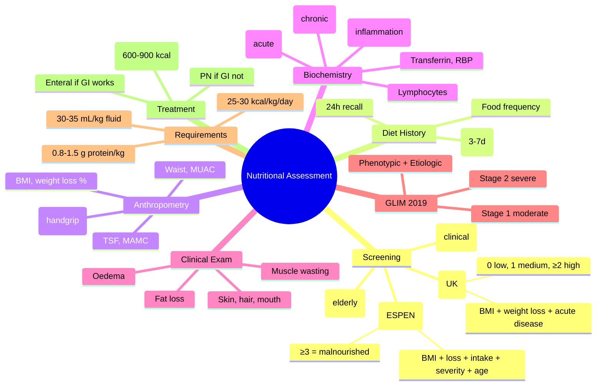

**Related:** [[Nutritional Factors in Disease MOC]], [[Davidson Chapter 22 - Nutritional Factors in Disease Hierarchy]], [[../00_Index/Medicine MOC|Medicine MOC]]

> [!important]
> **30–50% inpatients malnourished; MUST (UK) and NRS-2002 (ESPEN) screening at admission; SGA/PG-SGA clinical assessment; diet history + anthropometry + biochemistry + clinical exam; BMI <18.5 malnourished, <16 severe; weight loss >10%/6m significant; oral nutritional supplements (ONS) 1st line for malnourished inpatients.**

## 1. 1. Learning Objectives
- [ ] Perform nutritional screening at admission: MUST (UK) or NRS-2002 (ESPEN); MNA-SF for elderly; SGA/PG-SGA clinical
- [ ] Take diet history: 24h recall, food frequency, food diary; macronutrient assessment
- [ ] Measure anthropometry: BMI, weight loss, MUAC, waist circumference, triceps skinfold, handgrip strength
- [ ] Interpret biochemistry: albumin (chronic marker, not acute), prealbumin/transthyretin (acute), transferrin, retinol binding protein, CRP
- [ ] Recognise clinical signs of malnutrition: muscle wasting, fat loss, oedema, skin changes, hair changes
- [ ] Estimate energy/protein requirements: Harris-Benedict, Schofield, ESPEN; 25–30 kcal/kg/day; 1.0–1.5 g protein/kg/day
- [ ] Treat: oral nutritional supplements 1st line (NICE 10–14 days); enteral if GI works; parenteral if not

## 2. 2. Definitions / Key Concepts

| Term | Definition |
|------|------------|
| **Malnutrition** | State of nutrition in which deficiency/excess/imbalance of energy/protein/nutrients causes measurable adverse effects on body form/function/clinical outcome |
| **Malnutrition Universal Screening Tool (MUST)** | UK 5-step: BMI + unplanned weight loss + acute disease effect; 0 (low) / 1 (medium) / ≥2 (high) |
| **Nutritional Risk Screening 2002 (NRS-2002)** | ESPEN; BMI + weight loss + intake + severity + age ≥70; ≥3 = malnourished |
| **Malnutrition Universal Screening (MNA-SF)** | Elderly screening (≥65y); 6 items; <7 = malnourished |
| **Subjective Global Assessment (SGA)** | Clinical; weight, intake, GI symptoms, functional capacity, physical exam; A (well), B (moderate), C (severe) |
| **Patient-Generated SGA (PG-SGA)** | Patient + clinician; for oncology; numerical score |
| **BMI (Body Mass Index)** | Weight (kg) / Height² (m²); <16 severe, <18.5 underweight, 18.5–24.9 normal, 25–29.9 overweight, ≥30 obese |
| **Ideal Body Weight (IBW)** | Devine formula: M 50 kg + 2.3 kg per inch >5ft; F 45.5 kg + 2.3 kg per inch >5ft |
| **Unintentional Weight Loss** | >10% in 6m or >5% in 1m = significant; >20% in 3m = severe |
| **Triceps Skinfold Thickness (TSF)** | Subcutaneous fat measure; 50th percentile ~12 mm (men), 16 mm (women); <5th percentile = depleted |
| **Mid-Upper Arm Circumference (MUAC)** | Children 6-59m: <11.5 cm = SAM; adults: <22 cm (men), <19 cm (women) = malnourished |
| **Handgrip Strength (HGS)** | Muscle function; correlates with nutritional status; reduced in malnutrition |
| **Harris-Benedict Equation** | REE (kcal/day) = M: 66.5 + 13.8×W + 5×H − 6.8×A; F: 655 + 9.6×W + 1.8×H − 4.7×A |
| **Schofield Equation** | More accurate for different ages; based on FFm |
| **ESPEN (European Society Clinical Nutrition)** | Guidelines for nutritional screening, assessment, support |
| **ASPEN (American Society Parenteral Enteral Nutrition)** | A.S.P.E.N. guidelines; SGA, NRS-2002 |
| **BAPEN** | British Association Parenteral Enteral Nutrition; MUST tool; "MUST" report |
| **ESPEN Diagnostic Criteria (2015)** | 2 options: BMI <18.5 OR combined weight loss + low BMI/fat-free mass; severity grading |
| **GLIM (Global Leadership Initiative on Malnutrition) 2019** | International consensus: Phenotypic (weight loss, BMI, muscle mass) + Etiologic (intake, inflammation); 1 + 1 = malnutrition |

## 3. 3. Core Content

### 1. Section 1: Nutritional Screening (At Admission)
**MUST (UK; BAPEN):**
| Step | Component | Score |
|------|-----------|-------|
| 1 | **BMI** | >20 = 0; 18.5–20 = 1; <18.5 = 2 |
| 2 | **Unplanned weight loss in 3–6m** | <5% = 0; 5–10% = 1; >10% = 2 |
| 3 | **Acute disease effect** (no nutritional intake >5 days) | +2 |
| 4 | **Total** | 0 = low; 1 = medium; ≥2 = high |

**Actions:**
- 0: Routine care, repeat weekly
- 1: Observe, food chart, repeat weekly
- ≥2: Treat (ONS, refer dietitian)

**NRS-2002 (ESPEN):**
| Component | Score |
|-----------|-------|
| **BMI** (<18.5 = 3) | 0–3 |
| **Weight loss** (>5% in 3m = 1, 2 = 2, 3 = 3) | 0–3 |
| **Intake reduction** (50–75% = 1, 25–50% = 2, 0–25% = 3) | 0–3 |
| **Severity of disease** (e.g., hip fracture = 1, stroke = 2, ICU = 3) | 0–3 |
| **Age ≥70** | +1 |
| **Total ≥3** = malnourished (refer to dietitian, nutritional support) |

**MNA-SF (Elderly, ≥65y):**
- 6 items: ↓Food intake; Weight loss; Mobility; Psychological stress/acute disease; Neuropsychological problems; BMI
- 0–7: malnourished
- 8–11: at risk
- 12–14: normal

### 2. Section 2: Nutritional Assessment
**Diet History:**
- **24-hour recall** (cross-sectional; quick; recall bias)
- **Food Frequency Questionnaire (FFQ):** Long-term; portion sizes
- **Food diary** (3-7 days; gold standard but burdensome)
- **Diet history (DH):** Comprehensive interview; supplements, allergies, religious/cultural

**Anthropometry:**
- **Weight, height, BMI** (most useful for population; less useful for fluid shifts, ascites, oedema)
- **Waist circumference:** M >102 cm, F >88 cm (obesity cut-offs)
- **Waist:Hip ratio:** M >0.9, F >0.85 (abdominal obesity)
- **MUAC:** Children (<11.5 SAM); adults (M <22, F <19 = malnourished)
- **TSF (triceps skinfold):** Subcutaneous fat; <5th percentile = depleted
- **Mid-arm muscle circumference (MAMC):** Muscle mass estimate
- **Handgrip strength (HGS):** Functional; correlates with nutritional status; bedside; useful for monitoring

**Biochemistry:**
| Marker | Half-life | Significance | Limitations |
|--------|-----------|---------------|-------------|
| **Serum albumin** | 18–20 days | Chronic malnutrition; prognostic | ↓in inflammation, liver disease, nephrotic, fluid shifts; **NOT reliable in acute** |
| **Prealbumin (transthyretin)** | 2–3 days | Acute malnutrition; short-term | ↓in inflammation, liver disease; useful for monitoring |
| **Transferrin** | 8–10 days | Fe status; protein | ↓inflammation, Fe deficiency, liver disease |
| **Retinol Binding Protein (RBP)** | 12h | Acute malnutrition | Vitamin A status dependent |
| **Lymphocyte count** | | Immune function | ↓in malnutrition; non-specific |
| **CRP** | Acute phase | Inflammation (informs albumin) | ↑inflammation → ↓albumin (irrespective of nutrition) |

**Clinical Examination:**
- **Muscle wasting** (temporalis, biceps, gluteal, quadriceps, interossei)
- **Subcutaneous fat loss** (buccal pad, limb, gluteal)
- **Skin:** Dry, scaly, pigmented, flaky paint (kwashiorkor), easy bruising
- **Hair:** Sparse, dyspigmented, flag sign, easy plucking
- **Mouth:** Cheilosis, glossitis, gingival bleeding, angular stomatitis
- **Eyes:** Bitot's spots, keratomalacia, night blindness
- **Nails:** Koilonychia, brittle, Beau's lines
- **Bones:** Craniotabes, rosary, bone pain
- **Oedema:** Pitting (kwashiorkor, hypoalbuminaemia)
- **Cognitive:** Apathy, irritability, dementia
- **Cardiac:** Bradycardia, hypotension, ↓mass (marasmus)

### 3. Section 3: Requirements Calculation
**Energy (Total Energy Expenditure, TEE = BMR + TEF + PA + growth):**
- **Harris-Benedict (kcal/day):**
  - M: 66.5 + 13.8 × weight (kg) + 5.0 × height (cm) − 6.8 × age (years)
  - F: 655 + 9.6 × weight (kg) + 1.8 × height (cm) − 4.7 × age (years)
- **Schofield** (more accurate, age-specific)
- **Activity factor:** Bed-bound 1.2, ambulatory 1.3, active 1.5
- **Stress factor:** Mild 1.0, moderate 1.25, severe 1.5, very severe 2.0

**Practical:**
- Healthy adult: **25–30 kcal/kg/day** (BMR × activity)
- Malnourished (rehabilitation): **35–45 kcal/kg/day**
- Critical illness: **25–30 kcal/kg/day** (permissive underfeeding early)
- Elderly: 25–30 kcal/kg/day (less than younger adults)
- Obese (BMI >30): use adjusted weight (IBW + 0.4 × actual − IBW) for 22–25 kcal/kg/day

**Protein:**
- Healthy adult: 0.8 g/kg/day
- Older (≥65y): 1.0–1.2 g/kg/day
- Critical illness: 1.2–1.5 g/kg/day (up to 2.0 g/kg burns)
- Renal failure (pre-dialysis): 0.6–0.8 g/kg/day; dialysis 1.0–1.2 g/kg/day
- Hepatic encephalopathy: 0.5–1.0 g/kg/day (acute); 1.2–1.5 chronic
- Pregnancy/lactation: 1.0–1.5 g/kg/day

**Fluid:** 30–35 mL/kg/day (30 if non-ambulatory; 35 if active)

### 4. Section 4: GLIM Diagnostic Criteria (2019)
**International consensus (ASPEN, ESPEN, FELANPE, PENSA):**
**Step 1: Phenotypic Criteria (≥1):**
- Unintentional weight loss (>5% within 6m, or >10% beyond 6m)
- Low BMI (age-adjusted: <20 if <70y, <22 if ≥70y [Asian: <18.5 if <70y, <20 if ≥70y])
- Reduced muscle mass (DEXA, BIA, MUAC, physical exam)

**Step 2: Etiologic Criteria (≥1):**
- ↓Food intake (≤50% of requirements >1 week, or any reduction >2 weeks, or chronic GI disorders)
- Inflammation (acute disease/injury, chronic disease)

**Diagnosis:** ≥1 Phenotypic + ≥1 Etiologic = **Malnutrition**
**Severity:**
- Stage 1 (Moderate): weight loss 5–10% in 6m, BMI <20 (or <18.5 Asian)
- Stage 2 (Severe): weight loss >10% in 6m, BMI <18.5 (or <17 Asian), reduced muscle mass

### 5. Section 5: Treatment Algorithm
| Level | Indication | Action |
|-------|-----------|--------|
| **Food first** | All can eat/drink | Dietary advice, fortified foods |
| **Oral Nutritional Supplements (ONS)** | Malnutrition + can swallow + GI works | Sip feeds 600–900 kcal/day; 10–14 day trial (NICE) |
| **Enteral tube feeding** | Can swallow but inadequate intake OR dysphagia (stroke, PD) | NG tube (short term <4 weeks), PEG/PEJ (long term) |
| **Parenteral nutrition (PN)** | GI not working (ileus, obstruction, severe malabsorption, post-op) | Central line; daily monitoring |

**NICE Guidelines (CG32):**
- Screen on admission (MUST/NRS-2002)
- ONS 600–900 kcal/day for malnourished (10–14 days) before considering other routes
- Enteral if GI works but oral inadequate
- PN if GI doesn't work

## 4. 4. Clinical Correlation

| Scenario | Action | Notes |
|----------|--------|-------|
| 75F, hip fracture, BMI 19, weight loss 10% in 3m | **MUST 2 (high)**; ONS 600–900 kcal/day; dietitian; vitamin D | NICE; 1st line oral |
| 60F, post-stroke, dysphagia, BMI 22, no oral intake | **NG tube feeding** (NGT short-term); 25–30 kcal/kg | If <4 weeks NG, longer consider PEG |
| 70M, post-bowel surgery, ileus, no GI function | **Parenteral nutrition (PN)**; central line; daily electrolytes; thiamine | Refeeding risk; start slowly |
| 50F, malnutrition, BMI 17, anxious about diet | **Dietitian**; ONS 2x daily (600–900 kcal); sip feeds; food 1st | NICE 10–14 day trial |
| 30F, cancer cachexia, BMI 18, weight loss 15% | **PG-SGA**; nutritional support; treat underlying; consider ONS + appetite stimulants (mirtazapine, megestrol) | Cancer cachexia; inflammatory |
| 80M, post-MI, BMI 17, ↑CRP, fluid shifts | **NRS-2002**; albumin NOT reliable; clinical assessment; ONS 600–900 kcal | Albumin affected by inflammation |

## 5. 5. High-Yield FCPS/MRCP Points

> [!important]
> - **Must know:** MUST (UK) and NRS-2002 (ESPEN) screening; 24h recall, FFQ, food diary; BMI <18.5 malnourished, <16 severe; unintentional weight loss >10%/6m significant; MUAC, TSF, HGS; albumin (chronic), prealbumin (acute); GLIM criteria 2019; requirements 25–30 kcal/kg/day, 0.8–1.5 g protein/kg; ONS 1st line
> - **Common viva:** MUST scoring, NRS-2002, GLIM criteria, ESPEN vs ASPEN, SGA/PG-SGA, anthropometry, biochemistry limitations, energy requirements, ONS NICE
> - **Exam trap:** Albumin in acute illness (unreliable); BMI in fluid overload/ascites; weight loss % calculation; requirements in obesity/elderly

## 6. 6. Common Confusions / Exam Traps

| Trap | Correction |
|------|------------|
| Albumin = nutritional status | **Chronic marker, not acute**; ↓in inflammation, liver, renal, fluid shifts; use prealbumin or clinical assessment |
| BMI = nutrition | **BMI unreliable in ascites/oedema/amputation**; clinical assessment; waist circumference for adiposity |
| Weight loss % always interpretable | **Differentiate intentional vs unintentional**; unintentional = clinical concern |
| MUST/NRS-2002 equivalent | **MUST = UK; NRS-2002 = Europe**; both validated; pick one and use consistently |
| Catching up on weight is easy | **Catch-up requires ↑↑ calories and protein**; 35–45 kcal/kg/day + 2.0 g protein/kg + resistance exercise |
| Elderly have lower requirements | **Elderly 1.0–1.2 g protein/kg/day** (NOT lower than younger); sarcopenia prevention |
| Obese patients don't need nutrition | **Obesity ≠ nutritional adequacy**; cachexia, sarcopenia in obesity; need assessment |

## 7. 7. Mnemonics

- **MUST:** **M**alnutrition **U**niversal **S**creening **T**ool; 5 steps (BMI + weight loss + acute disease)
- **NRS-2002:** **N**utritional **R**isk **S**creening; **2002** (ESPEN); 5 components + age
- **GLIM 2019:** **G**lobal **L**eadership **I**nitiative on **M**alnutrition; 2-step (Phenotypic + Etiologic)
- **Anthropometry:** **BMI, MUAC, TSF, MAMC, HGS, waist**
- **Biochemistry:** **A**lbumin (chronic), **P**realbumin (acute), **T**ransferrin, **R**BP, **L**ymphocyte, **C**RP
- **Requirements:** **25–30 kcal/kg/day**; **0.8–1.5 g protein/kg**
- **ONS first:** **600–900 kcal/day × 10–14 days** (NICE)
- **Fluids:** **30–35 mL/kg/day**
- **SGA = clinical assessment**; PG-SGA = cancer
- **BMI cut-offs:** **<16 severe, <18.5 under, 18.5–24.9 normal, 25–29.9 over, ≥30 obese**
- **Energy 4 factors:** **BMR + TEF + PA + growth** (Harris-Benedict × activity × stress)

## 8. 8. Mind Map

## 9. 9. -Hour Recall Prompts
1. MUST scoring: BMI + weight loss + acute disease; 0 low, 1 medium, ≥2 high
2. NRS-2002: 5 components; ≥3 = malnourished
3. BMI: <16 severe, <18.5 under, 25-29.9 over, ≥30 obese
4. Unintentional weight loss >10%/6m = significant
5. Albumin chronic, prealbumin acute
6. Anthropometry: BMI, MUAC, TSF, MAMC, HGS
7. GLIM 2019: Phenotypic (weight loss, BMI, muscle mass) + Etiologic (intake, inflammation)
8. Energy 25-30 kcal/kg, protein 0.8-1.5 g/kg, fluid 30-35 mL/kg

## 10. 10. -Day / 15-Day / 30-Day Revision Tracker

| Day | Date | Recall Quality (1-5) | Time Spent | Notes |
|-----|------|---------------------|------------|-------|
| 1   |      |                     |            |       |
| 7   |      |                     |            |       |
| 15  |      |                     |            |       |
| 30  |      |                     |            |       |

---

## 11. 11. Must Know / Should Know / Nice to Know

| Priority | Content |
|----------|---------|
| **Must Know 🔴** | MUST, NRS-2002, MNA-SF; SGA/PG-SFA; anthropometry (BMI, MUAC, TSF, HGS); biochemistry (albumin, prealbumin, CRP); GLIM 2019; requirements (25-30 kcal/kg, 0.8-1.5 g protein); ONS first line; enteral then parenteral |
| **Should Know 🟡** | Harris-Benedict, Schofield equations; activity/stress factors; 24h recall, FFQ, food diary; ideal body weight (Devine); ESPEN vs ASPEN; BAPEN; diet history; elderly assessment |
| **Nice to Know 🟢** | BIA (bioelectrical impedance); DEXA; MRI/CT muscle mass; phase angle; specific nutrient functional tests (e.g., thiamine transketolase) |

## 12. 12. My Weak Points
- [ ] Schofield equation specifics
- [ ] Adjusted body weight for obesity
- [ ] Phase angle in BIA

## 13. 13. Self-Test Scorecard

| Domain | Score /10 | Target /10 |
|--------|-----------|------------|
| Understanding |    | 8+ |
| Recall |    | 8+ |
| MCQ Performance |    | 8+ |
| SBA Performance |    | 8+ |
| Viva Confidence |    | 8+ |
| **TOTAL** |    | **40+/50** |

## 14. 14. Exam Answer Modes

### 1. Long Answer / Essay (20 min)
**Topic:** "Nutritional assessment and screening in clinical practice"
- Screening at admission: MUST (UK; 5 steps: BMI + weight loss + acute disease; 0/1/≥2) and NRS-2002 (ESPEN; ≥3 malnourished)
- MNA-SF elderly
- Diet history: 24h recall, FFQ, food diary
- Anthropometry: BMI (limitations in fluid shifts, ascites, elderly), waist, MUAC, TSF, MAMC, HGS
- Biochemistry: albumin (chronic, not acute), prealbumin (acute), transferrin, RBP, CRP
- Clinical: muscle wasting, fat loss, skin, hair, mouth, oedema
- GLIM 2019: Phenotypic (weight loss, BMI, muscle mass) + Etiologic (intake, inflammation)
- Requirements: 25-30 kcal/kg/day, 0.8-1.5 g protein/kg/day
- Treatment: ONS 1st (NICE 10-14 day trial 600-900 kcal); enteral if GI works; PN if not

### 2. Short Note (7 min)
**Topic:** "MUST Score for Nutritional Screening"
- **Step 1: BMI** (>20 = 0; 18.5-20 = 1; <18.5 = 2)
- **Step 2: Unplanned weight loss in 3-6m** (<5% = 0; 5-10% = 1; >10% = 2)
- **Step 3: Acute disease effect** (no nutritional intake >5d = +2)
- **Total:**
  - **0: Low risk** — routine care, repeat weekly
  - **1: Medium risk** — observe, food chart, document
  - **≥2: High risk** — refer dietitian, ONS 600-900 kcal/day, treat

### 3. Viva Answer (3 min)
**Q:** "Why is albumin unreliable in acute illness?"
"A: **Albumin is a chronic marker** (half-life 18-20 days). In acute illness, ↓albumin from **inflammation** (capillary leak, ↓hepatic synthesis, negative acute phase reactant), **liver disease** (↓synthesis), **renal losses** (nephrotic), **fluid shifts** (haemodilution), not just malnutrition. **Use prealbumin** (half-life 2-3 days) or **clinical assessment** (SGA, PG-SGA) for acute. CRP helps interpret albumin (CRP ↑ + albumin ↓ = inflammation, not nutrition)."

### 4. Ward Case Discussion (5 min)
**Case:** 75F, post-hip fracture, BMI 19, weight loss 10% in 3m, takes no supplements.
"**MUST Score:** BMI 19 (1) + weight loss 10% (2) = 3 (**High risk**). **Action: 1) NICE: ONS 600-900 kcal/day × 10-14 days** as first line; 2) **Dietitian referral**; 3) **Vitamin D + Ca** (post-fracture, age, weight loss); 4) **Multivitamin**; 5) **Food chart** to monitor intake; 6) **Reassess at 10-14 days**; 7) Consider enteral if oral inadequate; 8) **Physiotherapy, fall prevention**; 9) **Optimise oral intake** (small frequent meals, energy-dense)."

### 5. Last-Night-Before-Exam Sheet (1 min
- **MUST (UK):** BMI + weight loss + acute disease; 0 low, 1 medium, ≥2 high
- **NRS-2002 (ESPEN):** BMI + loss + intake + severity + age ≥70; ≥3 = malnourished
- **MNA-SF:** Elderly 6 items; <7 malnourished
- **SGA/PG-SGA:** Clinical assessment
- **Anthropometry:** BMI, MUAC, TSF, MAMC, HGS, waist
- **Biochemistry:** **A**lbumin (chronic), **P**realbumin (acute), **C**RP
- **GLIM 2019:** Phenotypic (weight loss, BMI, muscle mass) + Etiologic (intake, inflammation)
- **Requirements:** 25-30 kcal/kg/day, 0.8-1.5 g protein/kg, 30-35 mL/kg
- **BMI cut-offs:** <16 severe, <18.5 under, 25-29.9 over, ≥30 obese
- **ONS 1st line:** 600-900 kcal × 10-14 days (NICE)
- **Enteral if GI works; PN if not**

## 15. 15. MCQs (10)

1. **MUST score (UK) components include all EXCEPT:**
   A. BMI  
   B. Unplanned weight loss  
   C. Acute disease effect  
   D. **Serum albumin**  

2. **NRS-2002 score for malnutrition:**
   A. ≥1  
   B. **≥3**  
   C. ≥5  
   D. ≥7  
   E. ≥10  

3. **BMI cut-off for underweight in adults:**
   A. <20  
   B. **<18.5**  
   C. <17  
   D. <16  
   E. <15  

4. **Unintentional weight loss percentage considered significant:**
   A. >5% in 1 month OR >10% in 6 months  
   B. >10% in 1 month  
   C. >15% in 1 month  
   D. >20% in 6 months  
   E. >25% in 1 year  

5. **Prealbumin (transthyretin) is the preferred marker of:**
   A. Chronic malnutrition  
   B. **Acute malnutrition (short half-life 2-3 days)**  
   C. Liver function  
   D. Renal function  
   E. Iron status  

6. **GLIM criteria 2019 require:**
   A. Just BMI  
   B. Just weight loss  
   C. **≥1 Phenotypic + ≥1 Etiologic criterion**  
   D. Just albumin  
   E. Just intake reduction  

7. **Energy requirement for healthy adult:**
   A. 15–20 kcal/kg/day  
   B. **25–30 kcal/kg/day**  
   C. 35–40 kcal/kg/day  
   D. 50–60 kcal/kg/day  
   E. 75 kcal/kg/day  

8. **Protein requirement for healthy adult (vs elderly 1.0-1.2 g/kg):**
   A. 0.5 g/kg/day  
   B. **0.8 g/kg/day**  
   C. 1.5 g/kg/day  
   D. 2.0 g/kg/day  
   E. 2.5 g/kg/day  

9. **NICE recommendation for ONS in malnourished inpatients:**
   A. 100–200 kcal/day for 1 week  
   B. 300–500 kcal/day for 5 days  
   C. **600–900 kcal/day for 10–14 days**  
   D. 1500 kcal/day for 1 month  
   E. 2000+ kcal/day indefinite  

10. **Albumin as nutritional marker limitation:**
    A. Affected by renal disease only  
    B. Affected by hepatic disease only  
    C. **Chronic marker; not reliable in acute inflammation (negative acute phase reactant)**  
    D. Half-life 2-3 days  
    E. Direct measure of nutrition  

## 16. 16. SBA Questions (5)

1. **A 75-year-old patient is admitted with hip fracture, BMI 19, 10% weight loss in 3 months. Most appropriate first-line nutritional management?**
   A. IV fluids only  
   B. **Oral nutritional supplements 600-900 kcal/day ×10-14 days (NICE)**  
   C. PEG tube  
   D. TPN  
   E. NGT  

2. **A 60-year-old man with no oral intake for 7 days post-bowel surgery. BMI 22. Most appropriate next step?**
   A. Continue NPO  
   B. **Parenteral nutrition (PN) via central line; start slowly, monitor refeeding**  
   C. NG tube  
   D. Standard NS fluids  
   E. TPN immediately at full rate  

3. **A 50-year-old man with severe malnutrition, BMI 16, admitted to ICU. On day 3 of feeding, develops hypophosphataemia (0.3), weakness, hypoventilation. Most appropriate management?**
   A. Increase feeding rate  
   B. **IV phosphate replacement; thiamine; continue feeding at low rate; cardiac monitor**  
   C. Stop feeding  
   D. TPN only  
   E. Iron infusion  

4. **A 70-year-old man with no oral intake for 10 days, BMI 17. Most appropriate prophylactic supplement?**
   A. Iron  
   B. **Thiamine 200 mg IV before feeding; multivitamin; slow feed (10 kcal/kg/day)**  
   C. Vitamin C 5 g  
   D. Vitamin D 5000 IU  
   E. Folate 1 mg  

5. **A 30-year-old woman with BMI 14 (severe malnutrition) is being refed. Which monitoring parameter is most important in the first 3 days?**
   A. Daily weight  
   B. **Daily serum phosphate (and K, Mg) for refeeding syndrome**  
   C. Daily Hb  
   D. Daily albumin  
   E. Daily urea and creatinine  

## 17. 17. Flashcards

- Q: MUST score  
  A: **BMI + weight loss + acute disease; 0 low, 1 medium, ≥2 high**
- Q: NRS-2002  
  A: **ESPEN; BMI + loss + intake + severity + age; ≥3 = malnourished**
- Q: MNA-SF  
  A: **Elderly 6 items; <7 malnourished**
- Q: BMI cut-offs  
  A: **<16 severe, <18.5 under, 18.5-24.9 normal, 25-29.9 over, ≥30 obese**
- Q: Albumin  
  A: **Chronic marker; NOT reliable in acute (negative APR); half-life 18-20 days**
- Q: Prealbumin  
  A: **Acute marker; half-life 2-3 days; monitor intervention**
- Q: GLIM 2019  
  A: **Phenotypic (weight loss, BMI, muscle mass) + Etiologic (intake, inflammation)**
- Q: Requirements  
  A: **25-30 kcal/kg/day, 0.8-1.5 g protein/kg, 30-35 mL/kg fluid**
- Q: NICE ONS  
  A: **600-900 kcal/day ×10-14 days (1st line for malnourished inpatients)**
- Q: Anthropometry  
  A: **BMI, MUAC, TSF, MAMC, HGS, waist circumference**
- Q: SGA/PG-SGA  
  A: **SGA = clinical (well/moderate/severe); PG-SGA = cancer (numerical)**
- Q: Energy factors  
  A: **BMR (Harris-Benedict) × Activity (1.2-1.5) × Stress (1.0-2.0)**

## 18. 18. Answer Key with Explanations

### 1. MCQs
1. **D** — MUST: BMI + unplanned weight loss + acute disease effect; NOT serum albumin.
2. **B** — NRS-2002: ≥3 = malnourished; ESPEN guideline.
3. **B** — BMI <18.5 = underweight; <16 = severe thinness; <17 = moderate.
4. **A** — Unintentional weight loss >5% in 1 month OR >10% in 6 months is significant.
5. **B** — Prealbumin: acute malnutrition marker (half-life 2-3 days); albumin is chronic (18-20 days).
6. **C** — GLIM 2019: ≥1 Phenotypic + ≥1 Etiologic criterion for malnutrition diagnosis.
7. **B** — Healthy adult energy requirement: 25-30 kcal/kg/day; higher in rehabilitation, illness.
8. **B** — Healthy adult protein: 0.8 g/kg/day; elderly 1.0-1.2 g/kg/day; critical illness 1.2-1.5.
9. **C** — NICE: ONS 600-900 kcal/day × 10-14 days as first-line for malnourished inpatients before considering enteral/parenteral.
10. **C** — Albumin: chronic marker (half-life 18-20 days), negative acute phase reactant; affected by inflammation, liver, renal, fluid shifts; not reliable in acute illness.

### 2. SBAs
1. **B** — Post-hip fracture, malnourished (MUST 3 high risk): NICE ONS 600-900 kcal/day × 10-14 days first line; dietitian referral; vitamin D, Ca.
2. **B** — No oral intake >7 days post-op, GI not working: PN via central line; start slowly, monitor refeeding, thiamine.
3. **B** — Refeeding syndrome: severe hypoPO4, weakness, hypoventilation; IV PO4, thiamine, continue low-rate feeding, cardiac monitor.
4. **B** — High refeeding risk (no intake >10 days, BMI 17): thiamine 200 mg IV before feeding, slow start (10 kcal/kg), electrolyte monitoring.
5. **B** — Refeeding monitoring: daily phosphate (and K, Mg) for first 3-7 days; critical for refeeding syndrome detection.

## 19. 19. Summary

**Nutritional Assessment & Screening** is a **Must Know 🔴** topic for FCPS/MRCP.
**Key takeaway:** **MUST (UK) and NRS-2002 (ESPEN)** at admission; SGA/PG-SGA clinical; anthropometry (BMI, MUAC, TSF, MAMC, HGS); biochemistry (albumin chronic, prealbumin acute); **GLIM 2019 (Phenotypic + Etiologic)**; requirements 25-30 kcal/kg, 0.8-1.5 g protein/kg, 30-35 mL/kg fluid; **ONS 600-900 kcal × 10-14 days** (NICE) first line; enteral if GI works; PN if not.
**Exam focus:** MUST/NRS-2002 scoring, BMI cut-offs, weight loss significance, albumin limitations, GLIM criteria, energy/protein requirements, ONS, anthropometry, biochemistry.
**Clinical relevance:** Every inpatient, post-op, chronic disease, elderly, surgical; cancer; prehabilitation.

*Template version: 1.0 | Davidson 24e Ch 22 aligned | FCPS/MRCP oriented*
