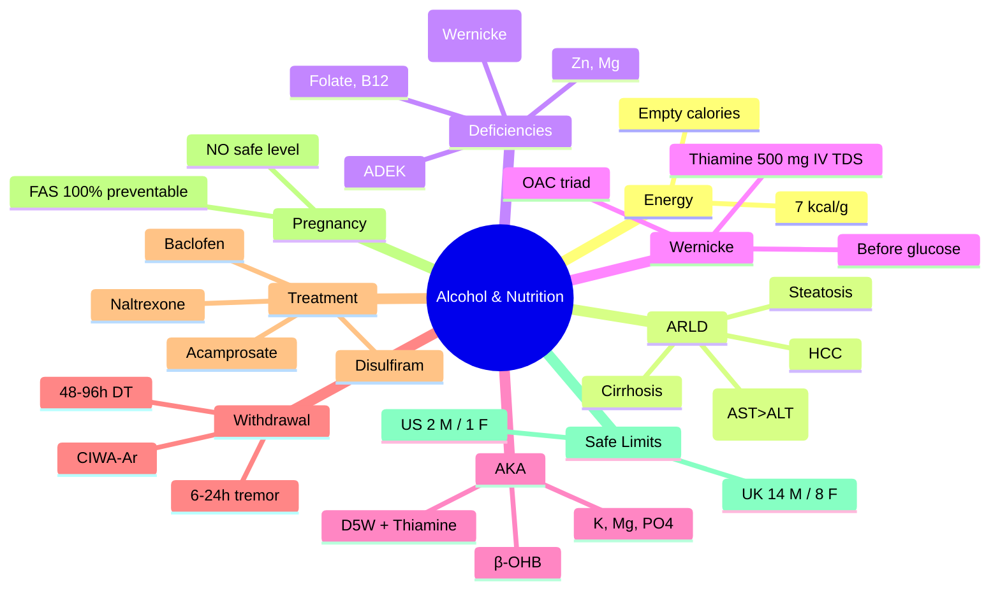

**Related:** [[Nutritional Factors in Disease MOC]], [[Davidson Chapter 22 - Nutritional Factors in Disease Hierarchy]], [[../00_Index/Medicine MOC|Medicine MOC]]

> [!important]
> **Alcohol = 7 kcal/g (empty calories); alcohol-related liver disease (ARLD): steatosis → hepatitis → cirrhosis → HCC; deficiencies: thiamine (Wernicke), B12, folate, vit A/D/K, Zn, Mg; refeeding; safe limits: ≤14 u/wk M, ≤8 u/wk F (UK 2016); pregnancy: 0 alcohol.**

## 1. 1. Learning Objectives
- [ ] Define alcohol energy: 7 kcal/g (empty calories); 1 unit = 8 g (UK) or 10 g (WHO)
- [ ] State ARLD spectrum: steatosis (reversible) → alcoholic hepatitis (Mallory bodies, neutrophils, AST>ALT ratio >2) → cirrhosis → HCC
- [ ] Recognise nutritional deficiencies: thiamine (Wernicke-Korsakoff), B12, folate, fat-soluble vitamins (A, D, E, K), Zn, Mg, Fe
- [ ] State refeeding risk in alcoholics: high risk; thiamine BEFORE feeding; monitor PO4/K/Mg
- [ ] State safe limits: UK CMOs (2016): ≤14 units/week M, ≤8 F; US: ≤2 drinks/day M, ≤1 F
- [ ] Describe alcohol effects on weight: obesity paradox, lean mass loss, sarcopenia
- [ ] Identify Wernicke encephalopathy triad: ophthalmoplegia, ataxia, confusion; thiamine 500 mg IV TDS ×3-5 days BEFORE glucose

## 2. 2. Definitions / Key Concepts

| Term | Definition |
|------|------------|
| **Alcohol Unit (UK)** | 10 mL = 8 g ethanol; 1 standard drink = 1 unit |
| **Alcohol Unit (US)** | 14 g ethanol; "standard drink" 12 oz beer, 5 oz wine, 1.5 oz spirits |
| **WHO Unit** | 10 g ethanol |
| **Energy Density** | 7 kcal/g (alcohol); empty calories |
| **ALD (Alcoholic Liver Disease)** | Spectrum: steatosis, hepatitis, cirrhosis, HCC |
| **NAFLD vs ARLD** | NAFLD = metabolic (insulin resistance, obesity); ARLD = alcohol |
| **Steatosis (Fatty Liver)** | First stage; reversible; triglyceride accumulation in hepatocytes; 90% of heavy drinkers |
| **Alcoholic Hepatitis (AH)** | Acute inflammatory; Mallory-Denk bodies, neutrophils, ballooning; AST:ALT >2; Maddrey's DF |
| **Maddrey's Discriminant Function (MDF)** | Score for AH severity; MDF ≥32 = severe; corticosteroid Rx |
| **Cirrhosis** | Fibrosis + regenerative nodules; end-stage; portal HTN, ascites, varices, HCC |
| **Wernicke Encephalopathy** | Thiamine deficiency; ophthalmoplegia, ataxia, confusion; IV thiamine 500 mg TDS ×3-5d BEFORE glucose |
| **Korsakoff Syndrome** | Chronic anterograde amnesia, confabulation; mammillary body atrophy; often irreversible |
| **WKS (Wernicke-Korsakoff Syndrome)** | Continuum; chronic alcohol use; thiamine deficiency |
| **Alcoholic Ketoacidosis** | Recent heavy drinking + vomiting + starvation; ↑NADH/NAD ratio; ketones (β-hydroxybutyrate); anion gap metabolic acidosis; treat with dextrose + thiamine |
| **Alcohol Withdrawal** | 6-24h tremor, anxiety; 12-48h seizures; 48-96h DT (delirium tremens) |
| **CAGE Questionnaire** | Cut down, Annoyed, Guilty, Eye-opener; 2/4 = positive (screening) |
| **AUDIT (Alcohol Use Disorders Identification Test)** | WHO; 10 items; score 0-40; ≥8 = hazardous drinking |
| **SMAST / AUDIT-C** | Shorter screening |
| **Disulfiram** | Aldehyde dehydrogenase inhibitor; aversion therapy; flushing, headache, nausea |
| **Naltrexone** | μ-opioid antagonist; ↓alcohol craving; hepatotoxic (monitor LFT) |
| **Acamprosate** | NMDA antagonist; ↓craving; safe in liver disease; 6-month course |
| **Baclofen** | GABA-B agonist; ↓alcohol craving; safe in cirrhosis (randomised trial) |
| **CIWA-Ar** | Clinical Institute Withdrawal Assessment for Alcohol; 10 items; score-guided benzodiazepine |
| **Lille Score** | AH response to 7-day corticosteroids; predicts survival |
| **MELD Score** | Model End-Stage Liver Disease; severity of cirrhosis; transplant listing |
| **Empty Calories** | Energy without nutrients (alcohol, refined sugar) |
| **FAS (Foetal Alcohol Syndrome)** | Craniofacial abnormalities, growth restriction, neurodevelopmental; 100% preventable |
| **ARBD (Alcohol-Related Neurodevelopmental Disorder)** | Less severe than FAS; cognitive/behavioural issues |
| **Safe Limits (UK CMOs 2016)** | ≤14 units/wk M, ≤8 F; if drinking, spread over 3+ days; alcohol-free days |

## 3. 3. Core Content

### 1. Section 1: Energy & Macronutrient Effects
**Energy:**
- 7 kcal/g (second only to fat at 9 kcal/g); "empty calories"
- 1 unit (UK) = 8 g = 56 kcal
- 25 units/week = 1400 kcal/week (≈ 1.4 kg/week potential weight gain if not compensated)

**Metabolic Effects:**
- **Carbohydrate:** ↓gluconeogenesis (lactate → glucose blocked); **hypoglycaemia** in fasting/starvation
- **Fat:** ↑hepatic fatty acid synthesis (↑NADH); ↑VLDL; ↑triglycerides; alcohol-induced hypertriglyceridaemia
- **Protein:** ↓albumin synthesis (nutritional + cirrhosis); muscle wasting (sarcopenia); ↑urea
- **Micronutrients:** ↓thiamine (B1), ↓B12, ↓folate, ↓fat-soluble vitamins (A, D, E, K), ↓Zn, ↓Mg, ↓Fe, ↓Se, ↓Cu (binding)

### 2. Section 2: Alcoholic Liver Disease (ALD/ARLD)
**Spectrum:**
1. **Steatosis (Fatty Liver):** 90% of heavy drinkers; reversible; triglycerides in hepatocytes; macrovesicular; ↑GGT, ↑ALT/AST (mild); 4-6 weeks to resolve with abstinence
2. **Alcoholic Steatohepatitis (ASH/AH):** Steatosis + inflammation + hepatocyte injury; **Mallory-Denk bodies** (eosinophilic intracytoplasmic inclusions), neutrophils, ballooning degeneration, pericellular fibrosis; AST:ALT **>2** (mnemonic "A**S**T = **S**cotch, A**L**T = **L**ager"); ↑GGT, ↑bilirubin; MDF score for severity
3. **Cirrhosis:** Fibrosis + regenerative nodules; end-stage; portal HTN (varices, ascites, splenomegaly), synthetic dysfunction (↓albumin, ↑INR), hepatocellular failure (jaundice, encephalopathy, ascites); ↑HCC risk
4. **HCC (Hepatocellular Carcinoma):** Cirrhosis → HCC; surveillance with 6-monthly US + AFP

**Maddrey's Discriminant Function (MDF):**
- MDF = 4.6 × (PT - control PT) + serum bilirubin (mg/dL)
- **MDF ≥32 = severe AH**; consider corticosteroids (prednisolone 40 mg ×28 days, with Lille score at day 7)
- **Lille Score:** Response to corticosteroids; predicts 6-month survival

**Management:**
- **Abstinence** (cornerstone)
- **Nutritional support** (ESPEN: 35-40 kcal/kg, 1.2-1.5 g protein/kg, frequent meals, nocturnal snack)
- **Thiamine 200 mg IV/PO before feeding**
- **Corticosteroids** (MDF ≥32; prednisolone 40 mg ×28d, taper)
- **Pentoxifylline** (controversial; anti-TNF; MDF ≥32, contraindicated to steroids)
- **N-acetylcysteine** (with steroids in severe AH; NAC + steroid)
- **Liver transplant** (end-stage; requires 6 months abstinence typically)

### 3. Section 3: Nutritional Deficiencies
| Deficiency | Mechanism | Clinical |
|-----------|-----------|----------|
| **Thiamine (B1)** | ↓Intake, ↓absorption, ↓hepatic storage; ↑demand (alcohol metabolism) | **Wernicke** (ophthalmoplegia, ataxia, confusion); **Korsakoff** (amnesia, confabulation); **Beriberi** (wet = CCF, dry = neuropathy) |
| **Folate** | ↓Intake, ↓absorption, alcohol inhibits absorption | Macrocytic anaemia; ↑homocysteine |
| **B12** | ↓Intake, ↓absorption (pancreatic insufficiency, ileal) | Macrocytic anaemia; neuropathy |
| **Vitamin A** | ↓Intake, ↓absorption, ↓mobilisation (RBP ↓) | Night blindness; ↑infection; poor wound healing |
| **Vitamin D** | ↓Sun exposure, ↓intake, ↓absorption | Osteomalacia; osteoporosis; fracture |
| **Vitamin E** | ↓Intake, ↓absorption | Neuropathy; ataxia |
| **Vitamin K** | ↓Intake, ↓synthesis (gut flora), ↓absorption | Coagulopathy (↑INR); bleeding |
| **Zinc** | ↓Intake, ↓absorption, ↑urinary loss | Dermatitis, alopecia, immune dysfunction, hypogonadism, taste loss |
| **Magnesium** | ↓Intake, ↑urinary loss, ↓absorption | Refractory hypokalaemia, hypocalcaemia; arrhythmias |
| **Iron** | GI bleeding (varices, gastritis); ↓intake | IDA |
| **Selenium** | ↓Intake | Cardiomyopathy (Keshan) |

### 4. Section 4: Alcoholic Ketoacidosis (AKA)
**Pathophysiology:**
- Heavy drinking + vomiting + starvation
- ↑NADH/NAD ratio (alcohol metabolism)
- Acetate (from ethanol) → acetyl-CoA; but **gluconeogenesis impaired** (lactate, alanine not converted)
- β-hydroxybutyrate (predominant) and acetoacetate accumulation
- **Anion gap metabolic acidosis**
- **Glucose** may be low/normal/high (especially if drinking sweet mixers)

**Clinical:**
- Recent heavy drinking; nausea/vomiting; abdominal pain
- Tachypnoea (Kussmaul); dehydration; ↓Na (pseudohyponatraemia)
- **Anion gap metabolic acidosis** with **ketosis** (β-OHB predominant)
- **Wide osmolar gap** (if methanol/ethylene glycol co-ingestion)
- Glucose variable (often low in starved)

**Treatment:**
- **Dextrose 5% IV** (corrects NADH/NAD; inhibits ketogenesis; provides glucose)
- **Thiamine 200 mg IV** BEFORE glucose (Wernicke's prevention)
- **IV NS** (rehydration)
- **Electrolyte replacement** (K, Mg, PO4)
- **Avoid insulin** (DKA mimic; but glucose usually not high)
- **Avoid bicarbonate** (paradoxical CSF acidosis; hypokalaemia)
- **Watch for withdrawal** (CIWA-Ar; benzodiazepines)
- Short course (12-24h); resolves quickly

### 5. Section 5: Alcohol Withdrawal & Treatment
**Timeline:**
- **6-24h:** Tremor, anxiety, GI upset, headache, diaphoresis, palpitations
- **12-48h:** Alcoholic hallucinosis (visual, tactile, auditory); seizures (generalised tonic-clonic)
- **48-96h:** **Delirium tremens (DT):** confusion, agitation, tremor, autonomic instability (↑HR, ↑BP, ↑temp), diaphoresis, hallucinations, seizures; mortality 5-15% untreated

**CIWA-Ar (Clinical Institute Withdrawal Assessment for Alcohol):**
- 10 items: nausea/vomiting, tremor, paroxysmal sweats, anxiety, agitation, tactile disturbances, auditory disturbances, visual disturbances, headache, orientation
- Score 0-67; <8 = mild; 8-15 = moderate; 16-20 = severe; >20 = very severe
- Score-guided treatment: benzodiazepines

**Treatment:**
- **Benzodiazepines** (lorazepam, diazepam, chlordiazepoxide); symptom-triggered (CIWA-Ar) or fixed dose
- **Thiamine 200 mg IV/PO** BEFORE glucose (Wernicke's prevention)
- **Electrolyte correction** (K, Mg, PO4)
- **Supportive care** (fluids, monitoring)
- **ICU admission** for DT/severe
- **Anticonvulsants** (benzodiazepines; phenytoin ineffective)

### 6. Section 6: Nutritional Management in Alcoholism
**ESPEN Guidelines:**
- **Energy:** 35-40 kcal/kg/day
- **Protein:** 1.2-1.5 g/kg/day
- **Frequent meals** (4-6/day) + **nocturnal snack** (↓catabolism)
- **Thiamine** (before any glucose)
- **Multivitamin + minerals** (Zn, Mg, B12, folate)
- **Fat-soluble vitamins** (A, D, E, K) if cholestasis
- **Sodium restriction** in ascites
- **Fluid restriction** in hyponatraemia (cirrhosis)

**Parenteral Nutrition in Severe ALD:**
- Severe malnutrition unable to eat
- Use cautiously (worsens encephalopathy, infection, fluid overload)

### 7. Section 7: Foetal Alcohol Syndrome (FAS)
**Criteria:**
- Maternal alcohol exposure during pregnancy
- **Craniofacial:** smooth philtrum, thin vermillion border, small palpebral fissures, midface hypoplasia
- **Growth restriction** (height, weight <10th percentile)
- **CNS:** microcephaly, intellectual disability, behavioural problems

**ARBD (Alcohol-Related Neurodevelopmental Disorder):** Less severe; cognitive/ behavioural issues without full FAS features

**Prevention:** 100% preventable; **NO safe level** of alcohol in pregnancy; especially 1st trimester critical

### 8. Section 8: Long-term Complications
| System | Complication |
|--------|--------------|
| **Liver** | Steatosis, hepatitis, cirrhosis, HCC |
| **CNS** | WKS, cerebellar degeneration, central pontine myelinolysis, peripheral neuropathy |
| **CV** | Dilated cardiomyopathy, ↑BP, ↑TG |
| **GI** | Gastritis, pancreatitis, malnutrition |
| **Haem** | Macrocytosis (B12/folate), sideroblastic anaemia, ↓platelets |
| **MSK** | Osteoporosis, fractures, myopathy |
| **Endo** | Hypoglycaemia, ↓T3/T4 (sick euthyroid), hypogonadism |
| **Immune** | ↑Infection risk (pneumonia, TB) |
| **Cancer** | Mouth, throat, oesophagus, larynx, liver, breast, colorectal (all ↑ with alcohol) |
| **Psych** | Depression, anxiety, suicide, Korsakoff, alcohol use disorder (AUD) |

### 9. Section 9: Treatment of Alcohol Use Disorder (AUD)
**Psychosocial:**
- **Brief intervention** (motivational interviewing)
- **CBT, motivational enhancement, 12-step (AA)**
- **Family therapy** (spouse, children)
- **Residential rehab** (severe)

**Pharmacotherapy:**
| Drug | Mechanism | Notes |
|------|-----------|-------|
| **Naltrexone** | μ-opioid antagonist; ↓craving, ↓reward | Hepatotoxic (monitor LFT); 50 mg PO daily or 380 mg IM monthly |
| **Acamprosate** | NMDA antagonist; ↓craving; safe in liver disease | 666 mg TDS PO; 6-month course; not metabolised by liver |
| **Disulfiram** | Aldehyde dehydrogenase inhibitor; aversion | Disulfiram-ethanol reaction (severe flushing, headache, vomiting); compliance issue |
| **Baclofen** | GABA-B agonist; ↓craving; safe in cirrhosis | 10-30 mg TDS; RCT in cirrhosis (Addolorato) |
| **Nalmefene** | μ-opioid antagonist; PRN | As-needed (target reduction) |
| **Gabapentin** | α2δ Ca channel; off-label | ↓insomnia, anxiety |

## 4. 4. Clinical Correlation

| Scenario | Action | Notes |
|----------|--------|-------|
| 45M, alcohol, confusion, ophthalmoplegia, ataxia | **Wernicke encephalopathy**; **IV thiamine 500 mg TDS ×3-5 days BEFORE glucose**; consider WKS | Thiamine first |
| 50M, alcohol, vomiting, Kussmaul, HCO3 10, ketones, glucose 4 | **Alcoholic ketoacidosis**; D5W + NS + thiamine IV 200 mg; K, Mg, PO4 replacement; CIWA-Ar monitoring | AKA; not DKA |
| 60M, alcohol, jaundice, AST 200, ALT 80, AST:ALT 2.5, PT 22s, bilirubin 8 | **Alcoholic hepatitis**; MDF = 4.6×(22-13) + 8 = 4.6×9 + 8 = 49 (severe); consider prednisolone 40 mg ×28d; Lille at day 7; abstinence; nutrition | AH; severe MDF |
| 35F, 20w pregnancy, 4 units/day | **Alcohol cessation**; FAS risk; midwife, addiction services, social work; **NO SAFE LEVEL in pregnancy**; thiamine, folate | FAS prevention |
| 50M, alcohol, tremor, anxiety, last drink 12h ago | **Alcohol withdrawal**; CIWA-Ar score; lorazepam 2-4 mg q15 min; thiamine IV 200 mg; electrolytes | Withdrawal scoring |
| 55M, alcohol, BMI 18, malnutrition, refuses food | **Refeeding risk**; thiamine IV 200 mg; start 10-15 kcal/kg; monitor PO4/K/Mg; nutrition support | Refeeding |
| 60M, cirrhosis, ascites, Na 128, BMI 22 | **Na restriction <2 g/day; fluid restriction 1-1.5 L**; albumin 20 g/L paracentesis if tense; lactulose; rifaximin; midodrine; nutrition 35-40 kcal/kg | Decompensated cirrhosis |

## 5. 5. High-Yield FCPS/MRCP Points

> [!important]
> - **Must know:** Alcohol 7 kcal/g; ARLD spectrum (steatosis → hepatitis → cirrhosis); AST:ALT >2 in AH; Mallory-Denk bodies; Wernicke triad (ophthalmoplegia, ataxia, confusion); thiamine 500 mg IV BEFORE glucose; AKA (D5W + thiamine); safe limits (UK 14 M/8 F); CIWA-Ar; refeeding risk; alcohol + pregnancy NO safe level
> - **Common viva:** Wernicke Rx, AKA treatment, AST:ALT ratio, MDF score, alcohol withdrawal, CIWA-Ar, refeeding prevention, alcohol + pregnancy, AUDIT screening, naltrexone vs acamprosate
> - **Exam trap:** Giving glucose before thiamine in alcoholics; missing refeeding risk; AH treated without abstinence; recommending alcohol for "cardiovascular" benefit; missing FAS risk

## 6. 6. Common Confusions / Exam Traps

| Trap | Correction |
|------|------------|
| Alcohol = nutrition | **Alcohol has empty calories (7 kcal/g); no protein, vitamins, minerals** |
| AST/ALT in alcohol | **AST:ALT >2** (Scotch:Lager mnemonic); transaminases rarely >500 |
| Wernicke classic triad | **Only 10-30% have full triad**; treat on clinical suspicion |
| Glucose for confused alcoholic | **Thiamine FIRST**; glucose depletes residual thiamine → Wernicke |
| AKA = DKA | **AKA: glucose low/normal; AG metabolic acidosis; β-OHB predominant**; D5W + thiamine |
| Naltrexone in cirrhosis | **Hepatotoxic; monitor LFT**; acamprosate or baclofen safer |
| Disulfiram for all | **Aversion; compliance issue; severe reactions**; not first-line |
| Alcohol cardioprotective | **No safe level (WHO); ↑cancer risk; ↑HTN, AF, cardiomyopathy** |
| Safe limit in pregnancy | **0 alcohol**; especially 1st trimester; FAS 100% preventable |
| Stop drinking suddenly = no risk | **Withdrawal 6-24h; DT 48-96h; can be fatal** |

## 7. 7. Mnemonics

- **ALD spectrum:** **S**teatosis → **S**teato**H**epatitis (AH) → **C**irrhosis → **H**CC = **SSCH**
- **AST:ALT in alcohol:** **A**ST = **S**cotch (whisky); **A**LT = **L**ager (beer); AST > ALT (>2) in alcohol
- **Wernicke triad:** **O**phthalmoplegia, **A**taxia, **C**onfusion = **OAC**
- **Wernicke Rx:** **Thiamine 500 mg IV TDS ×3-5 days BEFORE glucose** (Pabrinex 2 pairs)
- **Safe limits (UK 2016):** **14 M, 8 F** units/week; alcohol-free days
- **CIWA-Ar:** 10 items; **score-guided benzodiazepines**
- **AKA Rx:** **D5W + Thiamine + NS + K/Mg/PO4** (D5NS TKP)
- **Naltrexone:** μ-opioid antagonist; monitor LFT (hepatotoxic)
- **Acamprosate:** NMDA antagonist; safe in liver; 666 mg TDS
- **Disulfiram:** Aversion; disulfiram-ethanol reaction
- **Baclofen:** GABA-B; safe in cirrhosis
- **Alcohol unit (UK):** 10 mL = 8 g
- **Alcohol kcal:** **7 kcal/g** (second to fat at 9)
- **AH treatment:** Prednisolone 40 mg ×28d; MDF ≥32; Lille day 7
- **Thiamine ALWAYS BEFORE glucose in alcoholics**

## 8. 8. Mind Map

## 9. 9. -Hour Recall Prompts
1. Alcohol: 7 kcal/g; empty calories
2. ARLD: steatosis → AH → cirrhosis → HCC
3. AST:ALT >2 in AH (Scotch:Lager)
4. Wernicke triad: OAC (ophthalmoplegia, ataxia, confusion)
5. Wernicke Rx: thiamine 500 mg IV TDS ×3-5d BEFORE glucose
6. AKA: D5W + thiamine; β-OHB; AG metabolic acidosis
7. Withdrawal: 6-24h tremor, 12-48h seizures, 48-96h DT
8. Safe limits: UK 14 M / 8 F units/week; pregnancy 0

## 10. 10. -Day / 15-Day / 30-Day Revision Tracker

| Day | Date | Recall Quality (1-5) | Time Spent | Notes |
|-----|------|---------------------|------------|-------|
| 1   |      |                     |            |       |
| 7   |      |                     |            |       |
| 15  |      |                     |            |       |
| 30  |      |                     |            |       |

---

## 11. 11. Must Know / Should Know / Nice to Know

| Priority | Content |
|----------|---------|
| **Must Know 🔴** | Alcohol 7 kcal/g; ARLD spectrum; AST:ALT >2; Mallory-Denk; Wernicke (OAC, thiamine 500 IV TDS); AKA (D5W + thiamine); CIWA-Ar; withdrawal timeline; MDF score; prednisolone AH; refeeding; safe limits (UK 14/8); pregnancy 0 |
| **Should Know 🟡** | Lille score; ESPEN cirrhosis nutrition (35-40 kcal/kg, 1.2-1.5 g protein, nocturnal snack); Lille; AUDIT; CAGE; naltrexone/acamprosate/baclofen/disulfiram; FAS features; pentoxifylline; NAC + steroid in severe AH |
| **Nice to Know 🟢** | Gut-liver axis; microbiome in ALD; liver transplant rules; granulocytic defaecation; ceroid-laden macrophages; ASH vs NASH histology |

## 12. 12. My Weak Points
- [ ] MDF calculation
- [ ] Lille score specifics
- [ ] Disulfiram-ethanol reaction details

## 13. 13. Self-Test Scorecard

| Domain | Score /10 | Target /10 |
|--------|-----------|------------|
| Understanding |    | 8+ |
| Recall |    | 8+ |
| MCQ Performance |    | 8+ |
| SBA Performance |    | 8+ |
| Viva Confidence |    | 8+ |
| **TOTAL** |    | **40+/50** |

## 14. 14. Exam Answer Modes

### 1. Long Answer / Essay (20 min)
**Topic:** "Alcohol-related nutritional deficiencies and management"
- Alcohol 7 kcal/g (empty calories); contributes to obesity paradox + sarcopenia
- **Thiamine (B1):** ↓intake, ↓absorption, ↓hepatic storage; ↑demand; **Wernicke-Korsakoff syndrome**; thiamine 500 mg IV TDS ×3-5 days BEFORE glucose
- **Folate, B12:** Macrocytic anaemia; alcohol inhibits folate absorption
- **Fat-soluble vitamins (A, D, E, K):** ↓intake, ↓absorption (bile); vitamin D deficiency common
- **Zinc, Mg:** Dermatitis, hypogonadism, refractory hypokalaemia/hypocalcaemia
- **Refeeding syndrome:** High risk; thiamine 200 mg IV before feeding; start 10-15 kcal/kg; monitor PO4/K/Mg
- **AKA:** D5W + thiamine; β-OHB; anion gap metabolic acidosis
- **ARLD spectrum:** Steatosis → AH (AST>ALT, MDF) → cirrhosis → HCC
- **Treatment:** Naltrexone (monitor LFT), acamprosate (safe in liver), baclofen (safe in cirrhosis)
- **Pregnancy:** NO safe level; FAS 100% preventable

### 2. Short Note (7 min)
**Topic:** "Wernicke-Korsakoff Syndrome"
- **Acute Wernicke:** Triad = ophthalmoplegia (nystagmus, lateral gaze palsy), ataxia, confusion; only 10-30% have full triad
- **MRI:** Mamillary body, periaqueductal, medial thalami hyperintensity
- **Korsakoff:** Anterograde amnesia, confabulation, mammillary body atrophy; often irreversible
- **Cause:** Thiamine (B1) deficiency; alcohol (most common), malnutrition, hyperemesis, bariatric
- **Treatment:** **IV Thiamine 500 mg TDS ×3-5 days** (Pabrinex 2 pairs); 200-300 mg IV before any glucose
- **Prevention:** Thiamine 200 mg IV/PO before feeding in alcoholics

### 3. Viva Answer (3 min)
**Q:** "How do you manage Wernicke encephalopathy?"
"A: **Wernicke: thiamine 500 mg IV TDS ×3-5 days** (Pabrinex 2 pairs TDS); then 200 mg PO daily. **ALWAYS before any glucose** (glucose depletes residual thiamine, worsens Wernicke). Continue for 5-7 days; convert to oral. **Thiamine BEFORE refeeding** in malnourished. **Add magnesium** (cofactor). **Treat precipitants** (infection, dehydration). Investigate for **Korsakoff** (anterograde amnesia, confabulation) if persistent — often irreversible."

### 4. Ward Case Discussion (5 min)
**Case:** 55M, alcohol use disorder, vomiting, abdominal pain, glucose 5, HCO3 12, anion gap 24, ketones 4+, AST 150, ALT 80, K 3.2.
"Diagnosis: **Alcoholic ketoacidosis + alcohol withdrawal risk**. **Action: 1) D5W or D5NS** (corrects NADH/NAD, inhibits ketogenesis, provides glucose); 2) **Thiamine 200 mg IV** BEFORE glucose; 3) **IV NS** for volume (1-1.5 L); 4) **K, Mg, PO4 replacement** (K 3.2 — IV KCl); 5) **CIWA-Ar monitoring** every 4h; 6) **Lorazepam** if withdrawal (CIWA-Ar >8); 7) **Avoid insulin** (not DKA); 8) **Avoid bicarbonate** (paradoxical CSF acidosis); 9) **Investigate** (amylase, lipase, abdominal US); 10) **Disulfiram caution** (compliance); 11) **Long-term:** naltrexone/acamprosate; 12) **Nutrition** (35-40 kcal/kg, 1.2-1.5 g protein, thiamine, multivitamin)."

### 5. Last-Night-Before-Exam Sheet (1 min
- **Alcohol: 7 kcal/g (empty calories)**
- **ARLD:** Steatosis → AH (AST:ALT >2) → cirrhosis → HCC
- **Mallory-Denk bodies** in AH
- **MDF ≥32** = severe AH; prednisolone 40 mg ×28d
- **Wernicke triad:** OAC (ophthalmoplegia, ataxia, confusion)
- **Thiamine 500 mg IV TDS ×3-5d BEFORE glucose**
- **AKA:** D5W + thiamine; β-OHB; AG metabolic acidosis
- **Withdrawal:** 6-24h tremor, 12-48h seizures, 48-96h DT
- **CIWA-Ar** score-guided benzodiazepines
- **Safe limits:** UK 14 M / 8 F units/wk; pregnancy 0
- **Treatment:** Naltrexone, Acamprosate, Baclofen, Disulfiram
- **Refeeding:** Thiamine 200 mg IV; start 10-15 kcal/kg
- **FAS:** 100% preventable; NO safe level in pregnancy

## 15. 15. MCQs (10)

1. **Alcohol energy content:**
   A. 4 kcal/g  
   B. 5 kcal/g  
   C. **7 kcal/g**  
   D. 9 kcal/g  
   E. 11 kcal/g  

2. **AST:ALT ratio characteristic of alcoholic hepatitis:**
   A. <1  
   B. =1  
   C. **>2**  
   D. >5  
   E. <0.5  

3. **Maddrey's Discriminant Function (MDF) severe threshold:**
   A. ≥16  
   B. ≥24  
   C. **≥32**  
   C. ≥50  
   E. ≥100  

4. **Wernicke encephalopathy triad (classic):**
   A. Dementia, seizures, coma  
   B. **Ophthalmoplegia, ataxia, confusion**  
   C. Tremor, rigidity, bradykinesia  
   D. Hallucinations, delusions, paranoia  
   E. Hemiplegia, aphasia, hemianopia  

5. **First-line treatment of Wernicke encephalopathy:**
   A. IV dextrose first, then thiamine  
   B. **IV thiamine 500 mg TDS ×3-5 days BEFORE glucose**  
   C. Oral thiamine 100 mg daily  
   D. Steroids  
   E. Anticonvulsants  

6. **Alcoholic ketoacidosis (AKA) treatment:**
   A. IV insulin + dextrose  
   B. **D5W + thiamine IV + NS + K, Mg, PO4**  
   C. Sodium bicarbonate  
   D. IV insulin only  
   E. TPN  

7. **Alcohol withdrawal timeline (delirium tremens):**
   A. 6-12h  
   B. 12-24h  
   C. 24-48h  
   D. **48-96h**  
   E. 5-7 days  

8. **Safe alcohol limits (UK CMOs 2016) per week:**
   A. 7 units M, 5 F  
   B. **14 units M, 8 F**  
   C. 21 units M, 14 F  
   D. 28 units M, 21 F  
   E. No limit  

9. **Foetal Alcohol Syndrome (FAS) is:**
   A. 50% preventable  
   B. 75% preventable  
   C. **100% preventable (no safe level in pregnancy)**  
   D. Genetic  
   E. Treatable with folate  

10. **Pharmacotherapy for alcohol use disorder:**
    A. Naltrexone (μ-opioid antagonist; monitor LFT)  
    B. Acamprosate (NMDA antagonist; safe in liver)  
    C. Baclofen (GABA-B; safe in cirrhosis)  
    D. Disulfiram (aversion; compliance issue)  
    E. **All of the above**  

## 16. 16. SBA Questions (5)

1. **A 50-year-old man with chronic alcoholism, confusion, ophthalmoplegia, ataxic gait. Most appropriate management?**
   A. IV dextrose first  
   B. **IV thiamine 500 mg TDS ×3-5 days BEFORE any glucose; consider Wernicke-Korsakoff syndrome**  
   C. Oral thiamine 100 mg  
   D. MRI brain  
   E. Sedation  

2. **A 55-year-old alcoholic with vomiting, Kussmaul breathing, HCO3 12, anion gap 24, ketones positive, glucose 4.5. Most likely diagnosis and treatment?**
   A. DKA; insulin  
   B. **Alcoholic ketoacidosis; D5W + IV thiamine 200 mg + NS + K, Mg, PO4**  
   C. Lactic acidosis; bicarbonate  
   D. Renal failure; dialysis  
   E. TPN  

3. **A 60-year-old man with chronic alcohol use, jaundice, AST 250, ALT 100, PT 18s, bilirubin 6, MDF 36. Best treatment?**
   A. No treatment  
   B. **Prednisolone 40 mg daily ×28 days (MDF ≥32); Lille score at day 7**  
   C. Pentoxifylline only  
   D. TPN  
   E. NAC alone  

4. **A 45-year-old alcoholic, BMI 18, malnourished, starting refeeding. Day 3, hypophosphataemia 0.2, weakness, hypoventilation. Most likely cause?**
   A. Wernicke's encephalopathy  
   B. **Refeeding syndrome (PO4/K/Mg intracellular shift with insulin)**  
   C. Hypoglycaemia  
   D. Alcohol withdrawal  
   E. Sepsis  

5. **A 35-year-old pregnant woman, 12 weeks gestation, drinking 6 units/day. Best advice?**
   A. Reduce to 2 units/day  
   B. Reduce to 4 units/day  
   C. **Complete abstinence (FAS 100% preventable, no safe level)**  
   D. Continue as is  
   E. Switch to wine  

## 17. 17. Flashcards

- Q: Alcohol energy  
  A: **7 kcal/g** (empty calories)
- Q: ARLD spectrum  
  A: **Steatosis → AH → cirrhosis → HCC**
- Q: AST:ALT in alcohol  
  A: **AST:ALT >2** (Scotch > Lager)
- Q: Mallory-Denk bodies  
  A: **Eosinophilic intracytoplasmic inclusions** in AH
- Q: Wernicke triad  
  A: **Ophthalmoplegia, Ataxia, Confusion** (OAC)
- Q: Wernicke Rx  
  A: **IV Thiamine 500 mg TDS ×3-5 days BEFORE glucose** (Pabrinex 2 pairs)
- Q: AKA Rx  
  A: **D5W + Thiamine IV + NS + K/Mg/PO4**
- Q: Withdrawal timeline  
  A: **6-24h tremor, 12-48h seizures, 48-96h DT**
- Q: CIWA-Ar  
  A: **10 items; score-guided benzodiazepines**
- Q: Safe limits (UK 2016)  
  A: **14 units/week M, 8 F**; alcohol-free days
- Q: Pregnancy  
  A: **0 alcohol**; FAS 100% preventable
- Q: MDF severe threshold  
  A: **≥32**; prednisolone 40 mg ×28d; Lille day 7
- Q: Naltrexone  
  A: **μ-opioid antagonist**; monitor LFT (hepatotoxic)
- Q: Acamprosate  
  A: **NMDA antagonist**; safe in liver; 666 mg TDS; 6-month
- Q: Disulfiram  
  A: **Aldehyde dehydrogenase inhibitor**; aversion; severe reaction

## 18. 18. Answer Key with Explanations

### 1. MCQs
1. **C** — Alcohol 7 kcal/g; second only to fat (9 kcal/g); "empty calories" (no nutrients).
2. **C** — AST:ALT >2 in alcoholic hepatitis (mnemonic: AST = Scotch, ALT = Lager).
3. **C** — MDF ≥32 = severe alcoholic hepatitis; consider prednisolone 40 mg ×28 days; Lille score at day 7.
4. **B** — Wernicke triad (classic): ophthalmoplegia, ataxia, confusion; only 10-30% have all three.
5. **B** — Wernicke Rx: IV thiamine 500 mg TDS ×3-5 days BEFORE any glucose (glucose depletes residual thiamine, worsens Wernicke).
6. **B** — AKA: D5W (corrects NADH/NAD, inhibits ketogenesis) + thiamine 200 mg IV (before glucose) + NS (volume) + K/Mg/PO4 replacement.
7. **D** — Alcohol withdrawal DT: 48-96 hours after last drink; confusion, agitation, autonomic instability, seizures.
8. **B** — UK CMOs (2016) safe limits: ≤14 units/week for men, ≤8 units/week for women; alcohol-free days.
9. **C** — FAS: 100% preventable; NO safe alcohol level in pregnancy; especially 1st trimester.
10. **E** — AUD pharmacotherapy: Naltrexone, Acamprosate, Baclofen, Disulfiram (all used; selection based on patient/liver).

### 2. SBAs
1. **B** — Wernicke (OAC): IV thiamine 500 mg TDS ×3-5 days BEFORE glucose; WKS consideration.
2. **B** — Alcoholic with vomiting, Kussmaul, AG metabolic acidosis, glucose 4.5: AKA; D5W + thiamine + NS + K/Mg/PO4 (NOT DKA, NOT insulin).
3. **B** — AH with MDF 36 (≥32 severe): prednisolone 40 mg ×28 days; Lille score at day 7 to assess response.
4. **B** — Refeeding syndrome: malnourished alcoholic, day 3 refeeding, hypophosphataemia 0.2, weakness, hypoventilation; insulin-driven PO4 shift.
5. **C** — Pregnancy + alcohol: complete abstinence (FAS 100% preventable); no safe level; midwifery, addiction services, social work.

## 19. 19. Summary

**Alcohol & Nutrition** is a **Must Know 🔴** topic for FCPS/MRCP.
**Key takeaway:** **Alcohol 7 kcal/g (empty calories).** **ARLD: Steatosis → AH (AST:ALT >2, Mallory-Denk) → Cirrhosis → HCC; MDF ≥32 = severe, prednisolone 40 mg ×28d, Lille day 7.** **Wernicke triad (OAC) = ophthalmoplegia, ataxia, confusion; thiamine 500 mg IV TDS ×3-5d BEFORE glucose.** **AKA: D5W + thiamine; β-OHB; AG metabolic acidosis.** **Withdrawal: 6-24h tremor, 12-48h seizures, 48-96h DT; CIWA-Ar.** **Safe limits: UK 14 M/8 F units/wk; pregnancy 0 alcohol (FAS 100% preventable).** **Treatment: naltrexone (monitor LFT), acamprosate (safe in liver), baclofen (safe in cirrhosis), disulfiram (aversion).** **Refeeding: thiamine 200 mg IV, start 10-15 kcal/kg.**
**Exam focus:** Wernicke Rx, AKA, AST:ALT, MDF, withdrawal, CIWA-Ar, refeeding, safe limits, pregnancy.
**Clinical relevance:** ED, ICU, liver clinics, addiction services, antenatal, public health.

*Template version: 1.0 | Davidson 24e Ch 22 aligned | FCPS/MRCP oriented*
