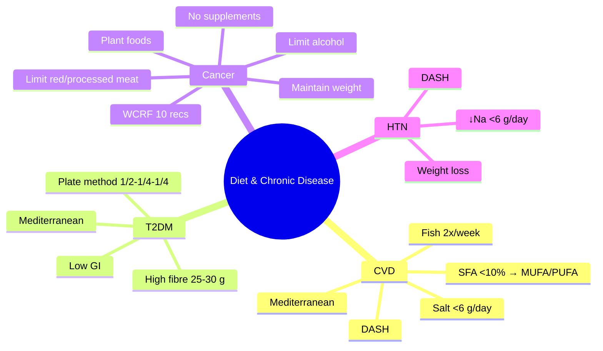

**Related:** [[Nutritional Factors in Disease MOC]], [[Davidson Chapter 22 - Nutritional Factors in Disease Hierarchy]], [[../00_Index/Medicine MOC|Medicine MOC]]

> [!important]
> **CVD: Mediterranean diet (best evidence, ↓CVD 30%); DASH for hypertension; ↓salt <6 g/day; replace SFA with MUFA/PUFA; fish 2x/week. T2DM: plate method, carb counting, fibre 25-30 g, low GI. Cancer: WCRF/AICR — maintain healthy weight, exercise, plant foods, limit red/processed meat, alcohol, salt; NO supplements for prevention; mammography, colonoscopy screening.**

## 1. 1. Learning Objectives
- [ ] State Mediterranean diet benefits: ↓CVD 30% (PREDIMED), ↓stroke, ↓diabetes, ↓cognitive decline; olive oil, nuts, fish, vegetables
- [ ] Define DASH diet for hypertension: rich in fruits/veg/low-fat dairy, low SFA, ↓Na; ↓BP 5-10 mmHg
- [ ] State dietary recommendations for CVD: ↓SFA, replace with MUFA/PUFA; ↑fish 2x/week (ω-3); ↓trans; salt <6 g/day; Mediterranean or DASH
- [ ] Recognise dietary recommendations for T2DM: plate method, carb counting, high fibre, low GI, Mediterranean; ONS diabetic
- [ ] State WCRF/AICR cancer prevention: maintain healthy weight, exercise, plant foods, limit red/processed meat (<500 g/week red, avoid processed), alcohol, salt; NO supplements
- [ ] Identify specific diet-cancer links: processed meat (CRC), aflatoxin (HCC), alcohol (multiple), salt (GC), obesity (multiple)

## 2. 2. Definitions / Key Concepts

| Term | Definition |
|------|------------|
| **Mediterranean Diet** | Olive oil (MUFA), nuts, fish, vegetables, fruits, whole grains, legumes, moderate red wine, ↓red meat |
| **DASH Diet** | Dietary Approaches to Stop Hypertension; high fruits/veg/low-fat dairy; ↓SFA/cholesterol; low Na |
| **Plant-Based Diet** | Vegetarian/vegan; whole foods, legumes, nuts; flexitarian; ↓CVD, T2DM, obesity |
| **Mediterranean-DASH Intervention for Neurodegenerative Delay (MIND)** | Hybrid for brain health; leafy greens, berries, nuts, fish, olive oil |
| **Portfolio Diet** | Plant sterols 2 g, viscous fibre 10 g, soy 25 g, nuts 45 g = ↓LDL 30% |
| **SFA (Saturated Fatty Acids)** | ↑LDL; replace with MUFA (olive oil), PUFA (fish, nuts, soy) |
| **MUFA (Monounsaturated FAs)** | Olive oil, avocado, nuts; ↓LDL; cardioprotective |
| **PUFA (Polyunsaturated FAs)** | ω-3 (fish, flax), ω-6 (vegetable oils); cardioprotective |
| **Trans Fats** | ↑LDL, ↓HDL; industrial = bad; ruminant (CLA) = less harmful |
| **Wholegrains** | ↓CVD, T2DM, CRC; bran, germ, endosperm intact |
| **Glycaemic Index (GI)** | Glucose response; high GI (white bread, sugar) = rapid spike; low GI (oats, lentils) = slower |
| **Glycaemic Load (GL)** | GI × carb(g)/100 |
| **Sodium (Na⁺)** | Target <2 g/day (<5 g salt); ↓BP; JNC-8/SPRINT <130/80 |
| **Portfolio Diet LDL ↓** | Plant sterols, viscous fibre, soy, nuts = ↓LDL 30% |
| **WCRF (World Cancer Research Fund) / AICR** | 10 cancer prevention recommendations |
| **Processed Meat** | WHO Group 1 carcinogen; CRC RR 1.18 per 50 g/day |
| **Red Meat** | Probable carcinogen (Group 2A); CRC RR 1.17 per 100 g/day |
| **Alcohol** | Multiple cancers; Group 1; dose-response |
| **Aflatoxin (Aspergillus flavus)** | HCC; contaminated peanuts, grains; HBV cofactor |
| **Salt (NaCl)** | Gastric cancer (H. pylori cofactor); China, Japan |
| **BMI Cut-offs** | Overweight 25-29.9, obese ≥30 (Asian: 23, 27.5) |

## 3. 3. Core Content

### 1. Section 1: Mediterranean Diet
**Components:**
- **Olive oil** (extra virgin; MUFA oleic acid; polyphenols); primary fat
- **Nuts** (15-30 g/day; almonds, walnuts, hazelnuts; tree nuts > peanuts)
- **Vegetables** (≥3 servings/day; variety)
- **Fruits** (≥2 servings/day; variety)
- **Whole grains** (wholemeal bread, brown rice, oats; ≥3 servings/day)
- **Legumes** (beans, lentils, chickpeas; ≥3 servings/week)
- **Fish** (≥2 servings/week; oily fish omega-3; baked/grilled not fried)
- **Moderate dairy** (yoghurt, cheese; low-fat)
- **Poultry, eggs** (moderate)
- **Red meat** (limit; <2 servings/week)
- **Red wine** (1-2 glasses/day with meals; moderate; not for all)
- **Herbs, spices** (instead of salt)

**Evidence (PREDIMED, PREDIMED-PLUS):**
- ↓Major CV events 30% (MI, stroke, CV death)
- ↓Stroke 40%
- ↓T2DM 30-50%
- ↓Cognitive decline, dementia (PREDIMED-PLUS, MIND)
- ↓Cancer (breast, colorectal, prostate)
- ↓Mortality (CVD, cancer, all-cause)

**Mechanisms:** Anti-inflammatory, antioxidant, ↑HDL, ↓LDL oxidation, ↑NO, ↓insulin resistance, ↓endothelial dysfunction, gut microbiome.

### 2. Section 2: DASH Diet
**Components:**
- High **fruits/vegetables** (4-5 servings/day each)
- **Whole grains** (6-8 servings/day)
- **Low-fat dairy** (2-3 servings/day; calcium, K, Mg)
- **Nuts, legumes** (4-5 servings/week)
- **Lean protein** (fish, poultry, beans; limit red meat)
- **Low SFA, cholesterol**
- Low **sodium** (2.3-1.5 g/day; DASH-sodium)

**Effects:**
- ↓SBP 5-10 mmHg (HTN)
- ↓Stroke risk
- ↓CV events
- Calcium, K, Mg contribute to BP effect
- Combined with weight loss, exercise: synergistic

### 3. Section 3: CVD Dietary Recommendations
**ESC/EAS 2021 + AHA/ACC:**
- **Saturated fat** <10% calories (5-6% if hyperlipidaemia); replace with MUFA/PUFA
- **Trans fat** <1% (avoid industrial)
- **PUFA** (ω-3): 2 servings fish/week; 1 g/day EPA+DHA supplements (post-MI)
- **Fruit/veg** ≥5 servings/day
- **Whole grains** ≥3 servings/day
- **Nuts** 30 g/day (unsalted)
- **Legumes** ≥3 servings/week
- **Salt** <5-6 g/day (<2.3 g Na)
- **Sugar** <10% calories (5% ideal)
- **Alcohol** <14 units/week (M); <8 (F)
- **Mediterranean or DASH** recommended

**Specific Conditions:**
- **Hypercholesterolaemia:** ↓SFA, ↑fibre, plant sterols (2 g), soy, nuts; portfolio diet ↓LDL 30%
- **HTN:** DASH + ↓Na; ↑K, Ca, Mg; ↓alcohol
- **Post-MI:** Mediterranean; ω-3 supplementation (REDUCE-IT icosapent ethyl 4 g/day for high TG)
- **Heart failure:** ↓Na (2 g/day); fluid restriction (1.5-2 L/day); weight monitoring

### 4. Section 4: T2DM Dietary Recommendations
**ADA/EASD 2022:**
- **Plate method:** 1/2 non-starchy veg, 1/4 lean protein, 1/4 complex CHO
- **Mediterranean** (best evidence for CV outcomes)
- **Low-GI, high-fibre** (25-30 g/day)
- **Carb counting** (1 unit = 10-15 g CHO; insulin:CHO ratio)
- **Total CHO** individualised; avoid refined sugar; complex CHO preferred
- **Protein:** 15-20% calories; ↑in sarcopenia/CKD
- **Fat:** MUFA-rich; ↓SFA; ↑PUFA (fish)
- **Sugar:** Avoid sugary drinks; limit added sugar
- **Alcohol:** Limited (with food; risk of hypoglycaemia with insulin/sulphonylureas)
- **Sodium:** ↓Na if HTN
- **Glycaemic load** (GL) preferred over GI alone
- **Diabetic ONS:** Low-GI, high-fibre, MUFA-rich; reduce postprandial spike

### 5. Section 5: Cancer Prevention (WCRF/AICR 2018)
**10 Recommendations:**
1. **Maintain healthy weight** (BMI 18.5-24.9)
2. **Be physically active** (150-300 min/wk moderate)
3. **Eat whole grains, vegetables, fruit, beans** (≥30 g/day fibre; ≥5 portions fruit/veg)
4. **Limit "fast foods" and processed food** (high SFA, sugar, refined grains)
5. **Limit red and processed meat** (red <350-500 g/week cooked; minimal processed)
6. **Limit sugar-sweetened drinks**
7. **Limit alcohol** (≤1 drink/day women; ≤2 men; ideally none)
8. **Don't rely on supplements** (food first; supplements not for cancer prevention; specific populations excepted)
9. **Breastfeed** (if possible; ↓breast cancer)
10. **After cancer diagnosis:** Follow these recommendations (better outcomes)

**Plus (post-2018):**
- **Limit salt** (preserve vegetables; ↓stomach cancer)
- **Avoid mouldy grains/cereals** (aflatoxin → HCC)

**Specific Cancer-Diet Links:**
| Cancer | Dietary Risk Factor |
|--------|---------------------|
| **Colorectal** | Processed meat (WHO Group 1), red meat, alcohol, obesity, low fibre, low Ca, low dairy |
| **Breast (postmenopausal)** | Alcohol, obesity, sedentary, hormone replacement |
| **Endometrial** | Obesity, oestrogen, sedentary |
| **Oesophageal (adenocarcinoma)** | Obesity, GERD, Barrett's |
| **Stomach (gastric)** | Salt, smoked/pickled food, H. pylori, aflatoxin (rare) |
| **Hepatocellular** | Aflatoxin (peanuts, grains), alcohol, obesity (NAFLD), HBV/HCV |
| **Pancreas** | Smoking, obesity, chronic pancreatitis, T2DM |
| **Oesophageal (SCC)** | Alcohol, smoking, hot beverages, achalasia |
| **Renal** | Obesity, smoking, hypertension |
| **Prostate** | Lycopene (?), dairy (high Ca?), obesity (aggressive) |
| **Bladder** | Smoking, occupational (aromatic amines) |

### 6. Section 6: Kidney Stones & Other
**Kidney Stones:**
- **Calcium oxalate (most):** ↓Na, ↓animal protein, ↑fluids (>2.5 L/day), normal Ca (↓Ca → ↓oxalate binding → ↑stones)
- **Uric acid:** ↓purine (red meat, seafood), ↓alcohol, urine alkalinisation (citrate)
- **Cystine:** ↑fluids, urine alkalinisation, D-penicillamine/tiopronin
- **Struvite (urease-producing organisms):** Antibiotics, urinary drainage

**Hypertension:** DASH + ↓Na + weight loss + exercise + ↓alcohol

**Dyslipidaemia:** ↓SFA, trans, cholesterol; ↑fibre, plant sterols, nuts, fish, soy; ↓refined carb

**Gout:** ↓purine (red meat, seafood, alcohol—especially beer); ↓fructose; ↑cherries; weight loss; urine alkalinisation

**Diverticular Disease:** High-fibre; plant foods; red meat associated; no nuts/seeds restriction

**Constipation:** ↑fluid, fibre, exercise; stool softener if necessary

## 4. 4. Clinical Correlation

| Scenario | Action | Notes |
|----------|--------|-------|
| 50M, post-MI, LDL 3.2, on statin | **Mediterranean diet**; ↑fish 2x/week, olive oil, nuts; 30 g fibre; ↓SFA; omega-3 (REDUCE-IT) | Secondary prevention |
| 65F, HTN 150/95, BMI 32 | **DASH diet**; ↓Na <6 g/day; weight loss 5-10%; exercise; ↓alcohol | DASH + lifestyle |
| 55M, T2DM, HbA1c 8.5%, BMI 30 | **Mediterranean diet**; plate method; carb counting; 25 g fibre; low GI; diabetic ONS | Best evidence |
| 40F, FH of breast cancer, BMI 26 | **Maintain healthy weight**; exercise 150-300 min/wk; Mediterranean; ↓alcohol; breastfeeding (if applicable) | WCRF prevention |
| 60M, CRC survivor | **↑Fibre, plant foods; ↓red/processed meat; maintain weight; exercise**; colonoscopy surveillance | WCRF post-diagnosis |
| 50M, recurrent calcium oxalate stones | **↓Na, ↓animal protein, ↑fluids >2.5 L/day, normal Ca, ↓oxalate (spinach, nuts, chocolate)** | Ca oxalate stones |

## 5. 5. High-Yield FCPS/MRCP Points

> [!important]
> - **Must know:** Mediterranean diet (↓CVD 30%, PREDIMED); DASH (↓BP 5-10 mmHg); ↓SFA, replace with MUFA/PUFA; fish 2x/week; salt <6 g/day; T2DM plate method + Mediterranean + fibre; WCRF cancer prevention (10 recommendations); processed meat Group 1; alcohol + smoking multiple cancers
> - **Common viva:** Mediterranean diet benefits; DASH for HTN; WCRF cancer recommendations; processed meat and CRC; salt and gastric cancer; T2DM plate method; portfolio diet
> - **Exam trap:** Recommending supplements for cancer prevention; thinking vitamin C prevents cancer; not restricting processed meat; missing alcohol in cancer risk

## 6. 6. Common Confusions / Exam Traps

| Trap | Correction |
|------|------------|
| Mediterranean = weight loss | **Mediterranean = healthy diet; not specifically weight loss**; combined with calorie deficit |
| DASH for everyone | **DASH primarily for HTN**; benefits others; standard low-Na diet for general |
| Red wine cardioprotective | **Moderate may be cardioprotective; but alcoholic; any alcohol = cancer risk; WHO no safe level** |
| Supplements prevent cancer | **NO; WCRF: "Don't rely on supplements"; specific populations only** (e.g., vitamin D elderly) |
| Plant-based = vegan | **Plant-based spectrum**: vegan, vegetarian, flexitarian, pescatarian |
| Processed meat only in summer | **Processed meat (WHO Group 1):** hot dogs, bacon, ham, salami; any amount ↑CRC |
| Salt only affects BP | **Salt: BP, gastric cancer, kidney stones, osteoporosis, obesity (sugar-salt-fat)** |
| Sugar causes diabetes | **Type 1: autoimmune; T2DM: complex (insulin resistance); high sugar contributes to weight gain, indirect** |
| Vitamin C cures cancer | **NO; high-dose may interfere with chemo/radiotherapy** |

## 7. 7. Mnemonics

- **Mediterranean diet:** **O**live oil, **N**uts, **V**eg, **F**ruit, **W**hole grains, **L**egumes, **F**ish, **M**oderate red wine = **ONVFWLF-M**
- **DASH for HTN:** ↓**D**ASH (sodium) **A**nd **S**top **H**ypertension = ↓Na + ↑K, Ca, Mg
- **T2DM plate:** **1/2** veg, **1/4** protein, **1/4** complex CHO
- **SFA → MUFA:** Replace **M**eats with **M**editerranean (olive oil, nuts)
- **Processed meat:** WHO **Group 1 carcinogen** (CRC)
- **WCRF 10 recommendations:** **Weight, **W**orkout, **W**hole grains/veg, **L**imit fast food/red/processed, **L**imit SSB, **L**imit alcohol, **N**o supplements, **B**reastfeed
- **Cancer-diet links:** **CRC** = processed meat; **BC** = alcohol, obesity; **Gastric** = salt, H. pylori; **HCC** = aflatoxin, alcohol, NAFLD
- **Salt <6 g/day** (5 g WHO target)
- **SFA <10% calories** (5-6% if hyperlipidaemia)
- **Fibre 25-30 g/day** (↑gut health, ↓CVD, ↓CRC)
- **Fish 2x/week** (ω-3)

## 8. 8. Mind Map

## 9. 9. -Hour Recall Prompts
1. Mediterranean: olive oil, nuts, veg, fruit, whole grains, fish, moderate wine; ↓CVD 30%
2. DASH: fruits/veg, low-fat dairy, ↓Na; ↓BP 5-10 mmHg
3. SFA <10% → MUFA (olive oil) / PUFA (fish, nuts)
4. Salt <6 g/day; fish 2x/week; fibre 25-30 g
5. T2DM plate method 1/2-1/4-1/4
6. WCRF: weight, exercise, plant foods, limit processed meat, alcohol
7. Processed meat (WHO Group 1) and CRC
8. Alcohol = multiple cancers (no safe level)

## 10. 10. -Day / 15-Day / 30-Day Revision Tracker

| Day | Date | Recall Quality (1-5) | Time Spent | Notes |
|-----|------|---------------------|------------|-------|
| 1   |      |                     |            |       |
| 7   |      |                     |            |       |
| 15  |      |                     |            |       |
| 30  |      |                     |            |       |

---

## 11. 11. Must Know / Should Know / Nice to Know

| Priority | Content |
|----------|---------|
| **Must Know 🔴** | Mediterranean (PREDIMED), DASH; SFA <10%, salt <6 g, fish 2x/wk, fibre 25-30 g; T2DM plate method; WCRF 10 recommendations; processed meat Group 1; alcohol + smoking + cancers |
| **Should Know 🟡** | Portfolio diet ↓LDL 30%; MIND diet (brain); ↓SFA + trans; Mediterranean-PLUS; vegetarian/flexitarian; calcium oxalate stones; salt and gastric cancer; aflatoxin and HCC; aflatoxin + HBV |
| **Nice to Know 🟢** | Planetary health diet (EAT-Lancet); omega-3 in post-MI; Mediterranean alcohol debate; specific antioxidants and cancer; microbiome in cancer; intermittent fasting |

## 12. 12. My Weak Points
- [ ] PREDIMED-PLUS findings detail
- [ ] EAT-Lancet planetary health
- [ ] Specific cancer-diet dose-response

## 13. 13. Self-Test Scorecard

| Domain | Score /10 | Target /10 |
|--------|-----------|------------|
| Understanding |    | 8+ |
| Recall |    | 8+ |
| MCQ Performance |    | 8+ |
| SBA Performance |    | 8+ |
| Viva Confidence |    | 8+ |
| **TOTAL** |    | **40+/50** |

## 14. 14. Exam Answer Modes

### 1. Long Answer / Essay (20 min)
**Topic:** "Diet in prevention of cardiovascular disease, diabetes, and cancer"
- **CVD:** Mediterranean (PREDIMED, ↓30%); DASH (HTN); SFA <10% → MUFA (olive oil)/PUFA (fish); salt <6 g; fish 2x/week; fibre 25-30 g
- **T2DM:** Plate method 1/2-1/4-1/4; Mediterranean; high fibre; low GI; carb counting
- **Cancer (WCRF 10 recommendations):** maintain healthy weight; exercise; plant foods; limit red (<500 g/week)/processed meat; limit alcohol; no supplements; breastfeeding
- **Specific:** processed meat (WHO Group 1, CRC); alcohol (multiple); salt (gastric); aflatoxin (HCC); obesity (BC, endometrial, CRC, kidney)

### 2. Short Note (7 min)
**Topic:** "WCRF/AICR Cancer Prevention Recommendations"
1. Maintain healthy weight (BMI 18.5-24.9)
2. Be physically active (150-300 min/wk)
3. Whole grains, vegetables, fruit, beans (≥30 g fibre)
4. Limit fast foods, processed food
5. Limit red meat (<500 g/week cooked), avoid processed
6. Limit sugar-sweetened drinks
7. Limit alcohol (ideally none)
8. Don't rely on supplements
9. Breastfeed (↓breast cancer)
10. After cancer: follow recommendations

### 3. Viva Answer (3 min)
**Q:** "What is the best dietary pattern for cardiovascular prevention?"
"A: **Mediterranean diet** (best evidence: PREDIMED trial ↓30% major CV events, ↓stroke 40%). Components: extra virgin olive oil (primary fat), nuts 30 g/day, vegetables ≥3 servings, fruits ≥2, whole grains, legumes ≥3/week, fish ≥2/week, moderate red wine, ↓red meat, herbs/spices. **Mechanisms:** anti-inflammatory, antioxidant, ↑HDL, ↓LDL oxidation, ↑NO, ↓insulin resistance, ↓endothelial dysfunction. **Combined with:** exercise, weight control, ↓salt <6 g, ↓SFA <10%, smoking cessation."

### 4. Ward Case Discussion (5 min)
**Case:** 50M, post-MI on atorvastatin, BMI 28, T2DM (HbA1c 7.8%), HTN 140/85, LDL 2.8.
"**Action: 1) Mediterranean diet** (PREDIMED); 2) Olive oil (EVOO) as primary fat; 3) **Fish ≥2x/week** (oily: salmon, mackerel); 4) **Nuts 30 g/day**; 5) **Vegetables 3+ servings**; 6) **Fruits 2+ servings**; 7) **Whole grains, legumes 3+ servings/week**; 8) **↓Red meat**; 9) **↓SFA <10%**; 10) **Salt <6 g/day**; 11) **↓Alcohol**; 12) **Exercise 150-300 min/week**; 13) **Weight loss 5-10%**; 14) **Diabetic ONS** if needed; 15) **T2DM plate method**, fibre 25-30 g, low GI; 16) **DASH** for HTN; 17) **Smoking cessation** (if applicable); 18) **Multidisciplinary** (cardiologist, dietitian, diabetologist, GP)."

### 5. Last-Night-Before-Exam Sheet (1 min
- **Mediterranean:** EVOO, nuts, veg, fish, moderate wine; PREDIMED ↓CVD 30%
- **DASH:** fruits/veg, low-fat dairy, ↓Na; ↓BP 5-10 mmHg
- **SFA <10%** → replace with MUFA/PUFA
- **Salt <6 g/day; Fish 2x/week; Fibre 25-30 g/day**
- **T2DM plate method:** 1/2 veg, 1/4 protein, 1/4 complex CHO; Mediterranean best
- **WCRF 10 recs:** weight, exercise, plant foods, ↓red/processed meat, ↓alcohol, NO supplements
- **Processed meat (Group 1):** CRC
- **Alcohol:** Multiple cancers (no safe level)
- **Salt:** BP, gastric cancer
- **Aflatoxin:** HCC (peanuts, grains)
- **Obesity:** ↑BC, endometrial, CRC, kidney

## 15. 15. MCQs (10)

1. **Mediterranean diet in PREDIMED trial reduced major cardiovascular events by:**
   A. 5%  
   B. 10%  
   C. **30%**  
   D. 50%  
   E. 70%  

2. **DASH diet primarily targets:**
   A. Diabetes  
   B. **Hypertension (↓SBP 5-10 mmHg)**  
   C. Cancer  
   D. Obesity  
   E. Kidney stones  

3. **Recommended SFA intake (% calories) for general population:**
   A. <5%  
   B. **<10%**  
   C. <15%  
   D. <20%  
   E. <25%  

4. **T2DM plate method recommended proportions:**
   A. 1/4 veg, 1/4 protein, 1/2 carb  
   B. **1/2 veg, 1/4 protein, 1/4 complex carb**  
   C. 1/3 each  
   D. 2/3 protein  
   E. 1/2 fruit, 1/2 protein  

5. **Processed meat classified by WHO as:**
   A. Group 4 (probably not carcinogenic)  
   B. Group 2A (probably carcinogenic)  
   C. **Group 1 (carcinogenic to humans)**  
   D. Group 3 (not classifiable)  
   E. Not evaluated  

6. **WCRF cancer prevention recommendation regarding supplements:**
   A. Vitamin C daily for prevention  
   B. **Don't rely on supplements for cancer prevention**  
   C. Multivitamin daily  
   D. Vitamin D 2000 IU daily  
   E. Selenium for prostate cancer  

7. **Salt intake recommendation for HTN prevention:**
   A. <12 g/day  
   B. <10 g/day  
   C. **<6 g/day (WHO 5 g)**  
   D. <3 g/day  
   E. <1 g/day  

8. **Aflatoxin (Aspergillus flavus) associated cancer:**
   A. Colorectal  
   B. **Hepatocellular**  
   C. Gastric  
   D. Breast  
   E. Oesophageal  

9. **Best dietary pattern for T2DM cardiovascular outcomes:**
   A. Low-fat  
   B. **Mediterranean**  
   C. High-protein  
   D. Low-CHO  
   E. Vegetarian only  

10. **Portfolio diet components reduce LDL by:**
    A. 5%  
    B. 10%  
    C. **30% (plant sterols + viscous fibre + soy + nuts)**  
    D. 50%  
    E. 70%  

## 16. 16. SBA Questions (5)

1. **A 50-year-old man post-MI on statin, BMI 28, T2DM. Best dietary recommendation?**
   A. Low-fat diet  
   B. **Mediterranean diet (PREDIMED: ↓30% major CV events)**  
   C. High-protein  
   D. Vegetarian only  
   E. Low-CHO  

2. **A 65-year-old woman with HTN 150/95, BMI 30, no DM. Best first-line dietary approach?**
   A. Mediterranean  
   B. **DASH diet + ↓Na <6 g/day; weight loss 5-10%**  
   C. Low-fat  
   D. Low-CHO  
   E. Portfolio  

3. **A 60-year-old man, CRC survivor, BMI 26. Best WCRF cancer prevention recommendation?**
   A. Vitamin C daily  
   B. **Maintain healthy weight; exercise 150-300 min/wk; ↑plant foods; limit red/processed meat; ↓alcohol**  
   C. High-protein diet  
   D. Vitamin D 5000 IU  
   E. Selenium  

4. **A 40-year-old with family history of breast cancer, BMI 25. Best WCRF primary prevention?**
   A. Vitamin C  
   B. **Maintain healthy weight; exercise; ↓alcohol; plant-based diet**  
   C. Selenium  
   D. Low-fat only  
   E. Soy protein (controversial)  

5. **A 55-year-old with recurrent calcium oxalate kidney stones. Best dietary advice?**
   A. ↓fluid, ↑Ca, ↑Na, ↓protein  
   B. **↑Fluids >2.5 L/day, ↓Na, ↓animal protein, normal Ca, ↓oxalate (spinach, nuts)**  
   C. High-protein, low-CHO  
   D. Vegetarian only  
   E. Low-Ca, low-fluid  

## 17. 17. Flashcards

- Q: Mediterranean diet benefits  
  A: **PREDIMED: ↓30% major CV events, ↓stroke 40%**; EVOO, nuts, fish, veg
- Q: DASH diet  
  A: **Hypertension**; ↓SBP 5-10 mmHg; fruits/veg/low-fat dairy; ↓Na
- Q: SFA recommendation  
  A: **<10% calories** (5-6% if hyperlipidaemia); replace with MUFA/PUFA
- Q: Salt recommendation  
  A: **<6 g/day (WHO 5 g)**; ↓BP, ↓gastric cancer
- Q: Fish recommendation  
  A: **≥2 servings/week**; oily fish (omega-3)
- Q: Fibre recommendation  
  A: **25-30 g/day**; ↓CVD, ↓CRC, ↓T2DM
- Q: T2DM plate method  
  A: **1/2 non-starchy veg, 1/4 lean protein, 1/4 complex CHO**
- Q: WCRF 10 recs (key)  
  A: **Weight, exercise, plant foods, ↓red/processed, ↓alcohol, NO supplements**
- Q: Processed meat cancer risk  
  A: **WHO Group 1 carcinogen**; CRC; ↑RR 1.18 per 50 g/day
- Q: Aflatoxin cancer  
  A: **HCC** (hepatocellular); peanuts, grains; cofactor with HBV
- Q: Salt cancer  
  A: **Gastric**; H. pylori cofactor; China, Japan
- Q: Mediterranean diet (PREDIMED)  
  A: **EVOO + nuts; ↓CVD 30%; ↓stroke 40%; ↓T2DM 30-50%**

## 18. 18. Answer Key with Explanations

### 1. MCQs
1. **C** — PREDIMED trial: Mediterranean diet ↓30% major CV events (MI, stroke, CV death); ↓stroke 40%.
2. **B** — DASH diet primarily targets hypertension; ↓SBP 5-10 mmHg; high fruits/veg/low-fat dairy; ↓Na.
3. **B** — SFA recommendation: <10% calories (5-6% if hyperlipidaemia); replace with MUFA/PUFA.
4. **B** — T2DM plate method: 1/2 non-starchy veg, 1/4 lean protein, 1/4 complex CHO (American Diabetes Association).
5. **C** — Processed meat: WHO Group 1 carcinogen (CRC; ↑RR 1.18 per 50 g/day).
6. **B** — WCRF cancer prevention: "Don't rely on supplements for cancer prevention"; specific populations only.
7. **C** — Salt intake: <6 g/day (WHO target 5 g); ↓BP, ↓gastric cancer.
8. **B** — Aflatoxin (Aspergillus flavus): HCC (hepatocellular); contaminated peanuts, grains; cofactor with HBV.
9. **B** — Mediterranean diet: best evidence for T2DM cardiovascular outcomes; PREDIMED.
10. **C** — Portfolio diet ↓LDL 30%: plant sterols 2 g, viscous fibre 10 g, soy 25 g, nuts 45 g.

### 2. SBAs
1. **B** — Post-MI, T2DM: Mediterranean diet (PREDIMED ↓30% major CV events).
2. **B** — HTN 150/95, BMI 30: DASH diet + ↓Na <6 g/day; weight loss 5-10%; combined effect ↓BP 10-15 mmHg.
3. **B** — CRC survivor: WCRF 10 recommendations: maintain weight; exercise 150-300 min/wk; ↑plant foods; limit red/processed meat; ↓alcohol.
4. **B** — FH breast cancer, BMI 25: maintain healthy weight; exercise; ↓alcohol; plant-based diet.
5. **B** — Calcium oxalate stones: ↑fluids >2.5 L/day, ↓Na, ↓animal protein, normal Ca (↓Ca → ↓oxalate binding → ↑stones), ↓oxalate (spinach, nuts, chocolate).

## 19. 19. Summary

**Diet & Chronic Disease** is a **Must Know 🔴** topic for FCPS/MRCP.
**Key takeaway:** **Mediterranean diet (PREDIMED ↓CVD 30%)** is the best evidence for CVD prevention; **DASH for HTN** (↓BP 5-10 mmHg); SFA <10%, salt <6 g/day, fish 2x/week, fibre 25-30 g/day. **T2DM plate method 1/2-1/4-1/4** + Mediterranean + fibre. **WCRF 10 cancer recommendations:** weight, exercise, plant foods, ↓red/processed meat, ↓alcohol, NO supplements. **Processed meat (WHO Group 1) → CRC; alcohol → multiple cancers; salt → gastric; aflatoxin → HCC.**
**Exam focus:** Mediterranean evidence, DASH, SFA/salt, T2DM plate, WCRF recs, processed meat, alcohol/cancer link, salt/gastric, aflatoxin/HCC.
**Clinical relevance:** Every chronic disease management; primary prevention; post-MI/diagnosis nutrition; population health.

*Template version: 1.0 | Davidson 24e Ch 22 aligned | FCPS/MRCP oriented*
