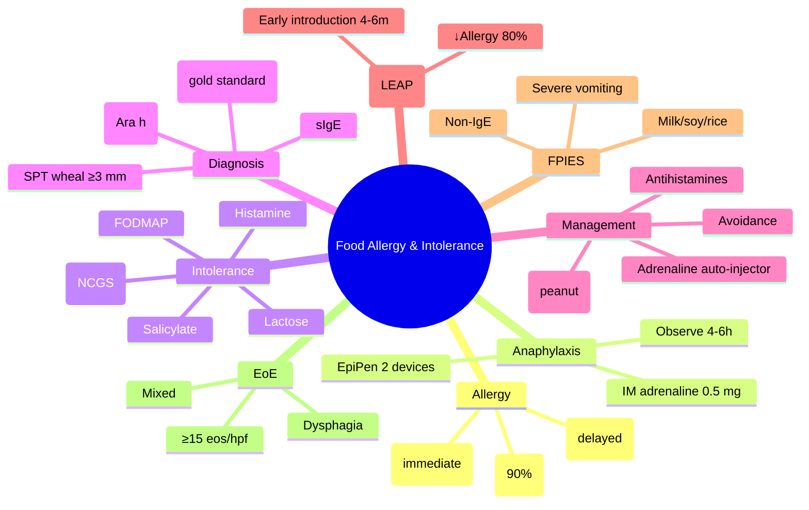

**Related:** [[Nutritional Factors in Disease MOC]], [[Davidson Chapter 22 - Nutritional Factors in Disease Hierarchy]], [[../00_Index/Medicine MOC|Medicine MOC]]

> [!important]
> **Food allergy = IgE-mediated (immediate, anaphylaxis) or non-IgE (delayed); common: milk, egg, peanut, tree nut, soy, wheat, fish, shellfish (8 foods = 90%); Food intolerance = non-immunological (lactose, FODMAP, histamine, gluten, additives); management: avoidance, epinephrine auto-injector, oral immunotherapy (peanut).**

## 1. 1. Learning Objectives
- [ ] Define food allergy: IgE-mediated (immediate, Type I hypersensitivity, anaphylaxis) vs non-IgE/cell-mediated (delayed, FPIES, EoE)
- [ ] State 8 most common food allergens (90%): milk, egg, peanut, tree nut, soy, wheat, fish, shellfish; plus sesame
- [ ] Recognise IgE-mediated allergy: urticaria, angioedema, anaphylaxis, oral allergy syndrome; skin prick test, specific IgE
- [ ] Describe food intolerance: lactose (lactase deficiency), FODMAP (IBS), histamine, gluten (coeliac), food additives
- [ ] Diagnose: detailed history, food diary, elimination diet, skin prick test, specific IgE, component-resolved diagnostics, oral food challenge (gold standard)
- [ ] Treat: avoidance, epinephrine auto-injector (anaphylaxis), oral immunotherapy (peanut, OIT), antihistamines (mild), dietary management (lactose, FODMAP)

## 2. 2. Definitions / Key Concepts

| Term | Definition |
|------|------------|
| **Food Allergy** | Adverse immune response to food; IgE, non-IgE, or mixed |
| **IgE-Mediated Allergy (Type I)** | Immediate (<2 h); urticaria, angioedema, anaphylaxis; SPT, sIgE positive |
| **Non-IgE / Cell-Mediated (Type IV)** | Delayed (4-72 h); FPIES, EoE, proctocolitis; patch test |
| **Mixed (IgE + Non-IgE)** | Atopic dermatitis, EoE |
| **Food Anaphylaxis** | Acute, severe, multi-system; hypotension, bronchospasm, urticaria; emergency |
| **Oral Allergy Syndrome (OAS)** | Pollen-food cross-reactivity; raw fruit/veg; mild oropharyngeal itching |
| **Food-Dependent Exercise-Induced Anaphylaxis (FDEIA)** | Anaphylaxis only with exercise + food (wheat, shellfish) |
| **α-Gal Syndrome (Mammalian Meat Allergy)** | Tick bite (lone star) → IgE to galactose-α-1,3-galactose → delayed anaphylaxis to red meat (3-6 h) |
| **Latex-Food Syndrome** | Latex (Hevea) cross-reactivity with banana, avocado, kiwi, chestnut |
| **Food Protein-Induced Enterocolitis Syndrome (FPIES)** | Non-IgE; infants; severe vomiting, lethargy, hypotension (shock); milk, soy, rice, oats |
| **Eosinophilic Oesophagitis (EoE)** | Mixed IgE/non-IgE; chronic dysphagia, food impaction, oesophageal eosinophils ≥15/hpf |
| **Coeliac Disease** | Gluten (gliadin) → autoimmune enteropathy; villous atrophy; IgA anti-tTG, EMA |
| **Lactose Intolerance** | ↓Lactase; fermentation; bloating, flatulence, diarrhoea; primary (Asian, African), secondary (GI disease) |
| **FODMAPs** | Fermentable Oligo-, Di-, Monosaccharides and Polyols; trigger IBS; low-FODMAP diet |
| **Histamine Intolerance** | DAO deficiency; fermented foods, aged cheese, wine; flushing, headache, GI |
| **Gluten Sensitivity (NCGS)** | Non-coeliac; wheat/rye/barley; symptoms without coeliac; overlap with IBS |
| **Salicylate Sensitivity** | NSAIDs, fruits, vegetables; asthma, urticaria, GI |
| **Elimination Diet** | Remove suspected foods; reintroduce sequentially; gold standard for food intolerance |
| **Oral Immunotherapy (OIT)** | Gradual ↑exposure to allergen; ↑threshold; desensitisation; peanut OIT (Palforzia) |
| **Skin Prick Test (SPT)** | Wheal ≥3 mm = positive; commercial extracts + fresh (OAS) |
| **Specific IgE (sIgE)** | Serum IgE to allergen; CAP-FEIA; quantitative |
| **Component-Resolved Diagnostics (CRD)** | Individual allergen proteins; Ara h 1/2/3 (peanut severe); cross-reactivity prediction |

## 3. 3. Core Content

### 1. Section 1: Food Allergy (Immunological)
**Mechanism (IgE-Mediated, Type I):**
- Sensitisation: First exposure → Th2 → IgE to allergen epitopes
- IgE binds mast cell FcεRI receptors
- Re-exposure → cross-linking → mast cell degranulation
- Mediators: histamine, tryptase, leukotrienes, prostaglandins, cytokines
- **Onset: <2 hours** (often <30 min); can be minutes

**Common Allergens (8 major = 90%):**
1. **Cow's milk** (most common in children)
2. **Egg** (esp. egg white; ovomucoid resistant)
3. **Peanut** (severe; lifelong; Ara h 1/2/3)
4. **Tree nut** (almond, walnut, hazelnut, cashew, pistachio; severe)
5. **Soy**
6. **Wheat** (omega-5 gliadin; lipid transfer protein; coeliac = gluten)
7. **Fish** (parvalbumin; cross-reactive)
8. **Shellfish** (crustaceans: shrimp, crab, lobster; tropomyosin)

Plus **sesame** (new major allergen; US 2023 FDA labelling).

**Conditions:**
| Condition | Mechanism | Age | Triggers | Features |
|-----------|-----------|-----|----------|----------|
| **IgE-mediated allergy** | IgE Type I | All | 8 allergens | Urticaria, angioedema, anaphylaxis |
| **OAS (Pollen-food)** | Cross-reactivity | Adults | Raw fruit/veg (apple, peach, celery) | Oropharyngeal itching; mild |
| **FPIES** | Non-IgE (T cell) | Infants 2-7m | Milk, soy, rice, oats | Severe vomiting, lethargy, shock; delayed (1-4h) |
| **EoE** | Mixed | Children/adults | Milk, wheat, egg, soy, peanut, fish | Chronic dysphagia, food impaction |
| **Food-induced proctocolitis** | Non-IgE | Infants | Milk | Blood in stool; benign |
| **Food-induced enteropathy** | Non-IgE | Infants | Milk, soy, wheat, egg | Diarrhoea, villous atrophy (transient) |
| **Heiner syndrome** | Non-IgE (immune complex) | Infants | Cow's milk | Pulmonary haemosiderosis, IDA, recurrent pneumonia |
| **FDEIA** | IgE + exercise | All | Wheat, shellfish, celery | Anaphylaxis only with exercise |
| **α-Gal syndrome** | IgE to galactose-α-1,3-gal | Adult | Red meat, gelatin | Delayed (3-6 h) anaphylaxis; tick bite (lone star) |

### 2. Section 2: Anaphylaxis Management
**Recognition (WAO 2020):**
- **Acute onset** (minutes to hours)
- **Skin/mucosal** (urticaria, angioedema, flushing)
- **PLUS ≥1 of:**
  - **Respiratory:** dyspnoea, wheeze, stridor, hypoxia
  - **Cardiovascular:** ↓BP, syncope, incontinence
  - **Severe GI:** crampy abdominal pain, vomiting
- **Post-exposure** to known/likely allergen

**Treatment:**
- **IM Adrenaline (Epinephrine) 0.5 mg (1:1000) into anterolateral thigh** (adult); repeat every 5-15 min if needed
- **IV access, supine, leg elevation** (NOT sitting up; risk of empty ventricle)
- **High-flow O₂**, airway management
- **IV fluid bolus** (crystalloid 1-2 L; 20 mL/kg in paediatrics)
- **Nebulised salbutamol** (bronchospasm)
- **IV hydrocortisone** 200 mg (delayed, ↓biphasic)
- **IV chlorpheniramine** 10 mg (supportive)
- **Adrenaline infusion** if refractory
- **Cardiac arrest:** standard ALS; IV adrenaline 1 mg q3-5 min
- **Glucagon** if β-blocker (refractory hypotension)
- **Observe 4-6h** (biphasic 1-72 h)
- **Discharge:** Adrenaline auto-injector (EpiPen, Jext); allergy referral; action plan

### 3. Section 3: Food Intolerance (Non-Immunological)
| Type | Cause | Symptoms | Management |
|------|-------|----------|------------|
| **Lactose** | ↓Lactase (primary Asian, African; secondary GI disease) | Bloating, flatulence, diarrhoea, cramps; 30 min-2h | ↓Lactose; lactose-free milk; lactase supplements |
| **Fructose** | ↓Fructose transporter; malabsorption | Bloating, diarrhoea | ↓Fructose, sorbitol; limit fruit juices, HFCS |
| **FODMAP** | Fermentable carbs; IBS overlap | Bloating, gas, altered bowels | Low-FODMAP diet (elimination 4-6w, reintroduction) |
| **Histamine** | ↓DAO; histamine-rich foods | Flushing, headache, GI, rhinitis, urticaria | ↓Histamine-rich foods; DAO supplements (controversial) |
| **Salicylate** | Aspirin, fruit, vegetables | Asthma, urticaria, GI, anaphylactoid | ↓Salicylate; aspirin avoidance |
| **Gluten (NCGS)** | Wheat, rye, barley; non-coeliac | IBS-like; fatigue; foggy brain | ↓Gluten; not coeliac, not allergy |
| **Food additives** | Sulphites, MSG, benzoates, colours | Asthma, urticaria, behaviour | Avoidance; controversial |
| **Amines (Tyramine)** | Aged cheese, wine, fermented | Migraine, BP changes | ↓Tyramine (MAOI users especially) |

**FODMAPs:**
- **Fermentable:** reach colon undigested, gas, water secretion
- **High-FODMAP foods:** apple, pear, mango, watermelon, honey, onion, garlic, wheat, legumes, milk, soft cheese, artificial sweeteners (sorbitol, mannitol)
- **Low-FODMAP:** banana, blueberry, orange, carrots, cucumber, lettuce, rice, oats, lactose-free dairy, hard cheese

**Low-FODMAP Diet:**
- **Phase 1 (elimination):** 4-6 weeks strict
- **Phase 2 (reintroduction):** Sequential; one FODMAP group at a time; 3 days
- **Phase 3 (personalisation):** Long-term; tolerate well-tolerated groups

### 4. Section 4: Diagnosis of Food Allergy
**History:** Reaction timing, type, severity, triggers, associated factors (exercise, alcohol), reproduction with re-exposure, atopy history
**Skin Prick Test (SPT):**
- Commercial extracts + fresh food (OAS)
- **Wheal ≥3 mm = positive**
- Negative predictive value 95%; positive predictive value ~50%
- Stop antihistamines 5-7 days before
- Fresh food (prick-prick) more sensitive

**Specific IgE (sIgE):**
- Quantitative (CAP-FEIA); not affected by antihistamines
- Decision points (95% PPV):
  - Egg 7 kU/L, Milk 15 kU/L, Peanut 14 kU/L, Fish 20 kU/L

**Component-Resolved Diagnostics (CRD):**
- Individual allergen proteins
- **Ara h 1/2/3 (peanut severe)** vs **Ara h 8 (cross-reactive, mild)**
- Predicts severity and tolerance
- Helps risk stratify

**Oral Food Challenge (OFC):**
- **Gold standard** for diagnosis
- Supervised, double-blind, placebo-controlled
- Graded doses; emergency preparedness
- Distinguishes true allergy from sensitisation (positive SPT/sIgE)

**Elimination Diet (Intolerance):**
- 2-6 weeks strict elimination
- Reintroduce one food at a time ×3 days
- Symptom diary; identify triggers
- For food intolerance (not allergy)

### 5. Section 5: Management of Food Allergy
**Avoidance:**
- Read labels (EU/FDA allergen labelling)
- Cross-contact prevention (separate cooking, utensils)
- Restaurant awareness
- School/employer notification
- Travel planning (EpiPen, translations)

**Emergency:**
- **Adrenaline auto-injector (EpiPen, Jext, Emerade)**
- **2 devices** (one in date, one backup)
- Action plan
- Wear medical alert jewellery

**Pharmacotherapy:**
- **Antihistamines** (cetirizine, loratadine; H1 blockers; mild)
- **Adrenaline** (anaphylaxis; IM; auto-injector)
- **Corticosteroids** (delayed; ↓biphasic; severe)
- **Leukotriene receptor antagonists** (montelukast; adjunct)
- **Omalizumab** (anti-IgE; chronic urticaria; food allergy desensitisation adjunct)
- **Dupilumab** (EoE; anti-IL-4/13)

**Oral Immunotherapy (OIT):**
- **Palforzia (peanut OIT)** (FDA 2020, EMA 2021); children 4-17
- Gradual ↑doses; daily; ↑threshold
- Risk: anaphylaxis, eosinophilic oesophagitis
- Not cure; ongoing dosing
- **Sublingual (SLIT), Epicutaneous (EPIT, Viaskin)** in trials
- Milk, egg, wheat OIT in trials

**Prevention:**
- **LEAP study (2015):** Early peanut introduction (4-6 months) ↓peanut allergy 80% in high-risk infants
- **EAT trial (2016):** Early allergenic food introduction (4-6 months) supported
- Guidelines: introduce allergenic foods at 4-6 months (after weaning); high-risk (eczema) early supervised
- Avoid unnecessary maternal diet restriction in pregnancy/lactation
- Breastfeeding benefits (controversial for allergy prevention)

**Natural History:**
- Milk, egg, soy, wheat: 80% tolerance by 5-6y
- Peanut, tree nut, fish, shellfish: 10-20% tolerance; often lifelong
- Sesame: 20-30% tolerance

## 4. 4. Clinical Correlation

| Scenario | Action | Notes |
|----------|--------|-------|
| 5y child, peanut exposure, urticaria, wheeze | **IM adrenaline 0.5 mg STAT**; high-flow O2; IV access; IV fluids; IV hydrocortisone 200 mg; observe 4-6h; EpiPen; allergy referral | Anaphylaxis |
| 25F, milk ingestion, bloating, diarrhoea, no anaphylaxis | **Suspect lactose intolerance**; trial of lactose-free milk; lactase supplements; hydrogen breath test | Lactose intolerance |
| 30F, peanut SPT positive, never had reaction; sIgE 5 kU/L | **Component-resolved diagnostics (Ara h 1/2/3)**; OFC if equivocal; counsel re: avoidance | Sensitisation vs allergy |
| 18m infant, milk exposure, severe vomiting 2h later, lethargy | **FPIES**; hospital admission; IV fluids; ondansetron; future strict avoidance; resolves by 3-5y | FPIES |
| 35M, abdominal pain, bloating, alternating bowels, no red flags | **Low-FODMAP diet (4-6w elimination, then reintroduction)**; dietitian; consider food diary | IBS / FODMAP |
| 4y child, severe eczema, egg SPT positive, never ingested | **Allergy referral; supervised food challenge (OFC); OIT if persistent** | Egg allergy, possible OIT |

## 5. 5. High-Yield FCPS/MRCP Points

> [!important]
> - **Must know:** 8 allergens (90%): milk, egg, peanut, tree nut, soy, wheat, fish, shellfish; IgE (immediate, anaphylaxis) vs non-IgE (FPIES, EoE); anaphylaxis Rx (IM adrenaline 0.5 mg); EpiPen; SPT wheal ≥3 mm; OFC gold standard; OIT peanut; FODMAP; lactose intolerance; LEAP (early peanut)
> - **Common viva:** Anaphylaxis management; SPT vs sIgE; FPIES vs IgE; FODMAP; OIT; LEAP; CRD (Ara h); mast cell tryptase
> - **Exam trap:** Treating anaphylaxis with antihistamines only; missing biphasic reaction; delayed onset of FPIES; restricting diet without diagnosis

## 6. 6. Common Confusions / Exam Traps

| Trap | Correction |
|------|------------|
| Antihistamines for anaphylaxis | **IM Adrenaline FIRST**; antihistamines supportive only |
| SPT false positive = allergy | **SPT 50% PPV; OFC gold standard**; sensitisation common |
| FPIES = IgE allergy | **FPIES = non-IgE; delayed (1-4h); severe vomiting, shock** |
| Lactose intolerance = milk allergy | **Intolerance (no IgE); abdominal symptoms; anaphylaxis absent** |
| Coeliac = wheat allergy | **Coeliac = autoimmune (anti-tTG); gluten; different mechanism** |
| EpiPen single dose enough | **2 EpiPens**; biphasic 1-72h; observe 4-6h |
| Avoid allergenic foods in pregnancy | **LEAP: EARLY introduction** ↓allergy; avoid unnecessary restriction |
| Lactose-free milk adequate | **Lactose-free**; Ca, vit D supplement if avoiding dairy |

## 7. 7. Mnemonics

- **8 allergens (90%):** **M**ilk, **E**gg, **P**eanut, **T**ree nut, **S**oy, **W**heat, **F**ish, **S**hellfish = **MEPT-SWFS**; + Sesame
- **Anaphylaxis Rx:** **A**drenaline IM **0.5 mg** (1:1000) anterolateral thigh; **A**irway; **F**luids IV; **H**ydrocortisone 200 mg; **C**hlorpheniramine 10 mg
- **SPT wheal ≥3 mm = positive**
- **IgE immediate <2 h; non-IgE delayed 4-72 h**
- **FPIES:** **F**ood **P**rotein **I**nduced **E**ntero**C**olitis **S**yndrome; non-IgE; **2 h**; severe vomiting
- **OAS:** Pollen-food; raw fruit/veg; oropharyngeal itching
- **α-Gal:** **T**ick bite → delayed red meat (3-6 h)
- **FODMAPs:** **F**ructans, **O**ligosaccharides, **D**isaccharides (lactose), **M**onosaccharides (fructose), **A**nd **P**olyols
- **OIT:** **P**alforzia peanut; ↑threshold; daily
- **LEAP study (2015):** **E**arly peanut at **4-6 m**onths **↓80% allergy** in high-risk
- **Lactose intolerance:** **A**sian, **A**frican, **S**outh American; **D**airy **A**void; Ca supplement

## 8. 8. Mind Map

## 9. 9. -Hour Recall Prompts
1. 8 allergens (90%): milk, egg, peanut, tree nut, soy, wheat, fish, shellfish + sesame
2. Anaphylaxis Rx: IM adrenaline 0.5 mg; EpiPen 2 devices; observe 4-6h
3. SPT wheal ≥3 mm; sIgE; OFC gold standard
4. IgE immediate <2h; non-IgE delayed (FPIES 2h, EoE chronic)
5. FODMAP diet: 4-6w elimination, then reintroduction
6. Lactose intolerance: Asian/African; dairy avoid; Ca supplement
7. OIT (Palforzia peanut); ↑threshold; daily dosing
8. LEAP (2015): early peanut 4-6m ↓80% allergy in high-risk infants

## 10. 10. -Day / 15-Day / 30-Day Revision Tracker

| Day | Date | Recall Quality (1-5) | Time Spent | Notes |
|-----|------|---------------------|------------|-------|
| 1   |      |                     |            |       |
| 7   |      |                     |            |       |
| 15  |      |                     |            |       |
| 30  |      |                     |            |       |

---

## 11. 11. Must Know / Should Know / Nice to Know

| Priority | Content |
|----------|---------|
| **Must Know 🔴** | 8 allergens; IgE vs non-IgE; anaphylaxis (IM adrenaline); EpiPen; SPT ≥3 mm; OFC gold standard; FPIES; FODMAP; lactose intolerance; LEAP (early peanut); OIT |
| **Should Know 🟡** | OAS, FDEIA, α-Gal; EoE; CRD (Ara h); EAT trial; natural history; antihistamines; omalizumab; dupilumab; salbutamol/aminophylline; biphasic |
| **Nice to Know 🟢** | SLIT, EPIT (Viaskin); specific allergen immunotherapy; co-factor anaphylaxis; NSAID-exacerbated respiratory disease (NERD); allergen component Ara h 8 (Bet v 1 cross-reactivity) |

## 12. 12. My Weak Points
- [ ] FPIES specifics
- [ ] EoE diagnostic criteria
- [ ] α-Gal mechanism

## 13. 13. Self-Test Scorecard

| Domain | Score /10 | Target /10 |
|--------|-----------|------------|
| Understanding |    | 8+ |
| Recall |    | 8+ |
| MCQ Performance |    | 8+ |
| SBA Performance |    | 8+ |
| Viva Confidence |    | 8+ |
| **TOTAL** |    | **40+/50** |

## 14. 14. Exam Answer Modes

### 1. Long Answer / Essay (20 min)
**Topic:** "Food allergy: types, diagnosis, and management"
- 8 allergens (90%): milk, egg, peanut, tree nut, soy, wheat, fish, shellfish + sesame
- IgE (immediate, Type I): urticaria, angioedema, anaphylaxis (<2h); SPT, sIgE
- Non-IgE (delayed): FPIES (infants, severe vomiting 2h, shock), EoE (chronic dysphagia, food impaction)
- Anaphylaxis Rx: IM adrenaline 0.5 mg (1:1000) anterolateral thigh; high-flow O₂; IV fluids; IV hydrocortisone 200 mg; IV chlorpheniramine 10 mg; observe 4-6h; 2 EpiPens
- Diagnosis: history, SPT (wheal ≥3 mm), sIgE, component-resolved diagnostics (Ara h 1/2/3 = severe peanut), OFC (gold standard)
- Management: avoidance, 2 EpiPens, action plan, OIT (Palforzia peanut)
- Prevention: LEAP study (2015) — early peanut introduction at 4-6m ↓80% peanut allergy in high-risk infants
- EoE diagnosis: ≥15 eos/hpf; food allergens; PPIs, swallowed steroids

### 2. Short Note (7 min)
**Topic:** "Anaphylaxis Management"
- **IM Adrenaline (Epinephrine) 0.5 mg (1:1000)** into anterolateral thigh; repeat every 5-15 min if needed
- **IV access, supine, leg elevation** (NOT sitting up; risk of empty ventricle)
- **High-flow O₂**, airway management
- **IV fluid bolus** (1-2 L; 20 mL/kg paediatrics)
- **Nebulised salbutamol** (bronchospasm)
- **IV hydrocortisone 200 mg** (delayed; ↓biphasic)
- **IV chlorpheniramine 10 mg** (supportive)
- **Adrenaline infusion** if refractory
- **Glucagon** if β-blocker (refractory hypotension)
- **Observe 4-6h** (biphasic 1-72h)
- **Discharge:** 2 EpiPens; action plan; allergy referral

### 3. Viva Answer (3 min)
**Q:** "How do you differentiate IgE from non-IgE food allergy?"
"A: **IgE-mediated (Type I, immediate):** onset <2h (often <30 min); urticaria, angioedema, anaphylaxis, oral allergy syndrome, vomiting; SPT positive, specific IgE elevated; can progress to anaphylaxis. **Non-IgE / cell-mediated (Type IV, delayed):** onset 4-72h; FPIES (severe vomiting, shock 1-4h after food), EoE (chronic dysphagia, food impaction), proctocolitis (blood in stool), enteropathy (villous atrophy); SPT negative, patch test may help; no anaphylaxis typically. **Mixed:** atopic dermatitis, EoE. Diagnosis: history + SPT/sIgE; OFC gold standard."

### 4. Ward Case Discussion (5 min)
**Case:** 30F, peanut ingestion, generalised urticaria, facial swelling, wheeze, SBP 90 mmHg.
"Diagnosis: **Anaphylaxis to peanut**. **Action: 1) IM Adrenaline 0.5 mg (1:1000) STAT into anterolateral thigh** (repeat every 5-15 min). 2) **High-flow O₂**, supine, leg elevation. 3) **IV access, IV NS bolus 1-2 L** (20 mL/kg if needed). 4) **Nebulised salbutamol** (bronchospasm). 5) **IV hydrocortisone 200 mg** (delayed; ↓biphasic). 6) **IV chlorpheniramine 10 mg** (supportive). 7) **Observe 4-6h** (biphasic 1-72h). 8) **Discharge:** 2 EpiPens; action plan; allergy referral; CRD (Ara h 1/2/3); consider OIT (Palforzia). 9) **Strict peanut avoidance; food labelling; cross-contact; school/workplace notification.**"

### 5. Last-Night-Before-Exam Sheet (1 min
- **8 allergens (90%):** Milk, Egg, Peanut, Tree nut, Soy, Wheat, Fish, Shellfish + Sesame = **MEPT-SWFS**
- **Anaphylaxis Rx:** IM Adrenaline 0.5 mg (1:1000) anterolateral thigh; IV fluids; hydrocortisone 200 mg; observe 4-6h; **2 EpiPens**
- **SPT wheal ≥3 mm = positive**; OFC gold standard
- **IgE immediate <2h; non-IgE delayed**
- **FPIES:** Non-IgE; infants; 2h; severe vomiting
- **FODMAPs:** Fructans, Oligo, Di, Mono, A+P
- **LEAP (2015):** Early peanut 4-6m ↓80% allergy
- **OIT:** Palforzia peanut; ↑threshold; daily
- **CRD:** Ara h 1/2/3 = severe peanut
- **Lactose:** Asian/African; dairy avoid; Ca supplement

## 15. 15. MCQs (10)

1. **8 common food allergens (90%) include all EXCEPT:**
   A. Milk  
   B. Egg  
   C. **Strawberry**  
   D. Peanut  
   E. Wheat  

2. **First-line treatment for anaphylaxis:**
   A. IV hydrocortisone  
   B. IV chlorpheniramine  
   C. **IM adrenaline (epinephrine) 0.5 mg (1:1000) anterolateral thigh**  
   D. IV fluids  
   E. Nebulised salbutamol  

3. **SPT wheal diameter considered positive:**
   A. ≥1 mm  
   B. ≥2 mm  
   C. **≥3 mm**  
   D. ≥5 mm  
   E. ≥10 mm  

4. **Gold standard for food allergy diagnosis:**
   A. Skin prick test  
   B. Specific IgE  
   C. Component-resolved diagnostics  
   D. **Oral food challenge (OFC)**  
   E. Elimination diet  

5. **FPIES is:**
   A. IgE-mediated allergy  
   B. **Non-IgE-mediated cell-mediated (delayed severe vomiting in infants)**  
   C. Eosinophilic oesophagitis  
   D. Lactose intolerance  
   E. Coeliac disease  

6. **LEAP study 2015 found early peanut introduction at 4-6 months reduced peanut allergy by:**
   A. 20%  
   B. 50%  
   C. **80%**  
   D. 95%  
   E. 0% (no effect)  

7. **Lactose intolerance is most common in:**
   A. Northern Europeans  
   B. **Asian, African, South American populations**  
   C. Mediterranean  
   D. North American  
   E. Australian  

8. **EoE (Eosinophilic Oesophagitis) diagnostic criterion:**
   A. ≥5 eos/hpf  
   B. **≥15 eos/hpf**  
   C. ≥30 eos/hpf  
   D. ≥50 eos/hpf  
   E. ≥100 eos/hpf  

9. **α-Gal syndrome (mammalian meat allergy) caused by:**
   A. Cat bite  
   B. **Tick bite (lone star tick, Amblyomma americanum)**  
   C. Mosquito bite  
   D. Bee sting  
   E. Shellfish exposure  

10. **FODMAPs include:**
    A. Fibre, oils, dairy, alcohol, milk, apples, pears  
    B. **Fermentable Oligo-, Di-, Monosaccharides and Polyols**  
    C. Fats, Oils, Dairy, Alcohol, Milk, Apples, Pears  
    D. Fast Oxidative Digestion And Metabolism of Plant foods  
    E. Fish, Oils, Dairy, Alcohol, Milk, Apples, Pears  

## 16. 16. SBA Questions (5)

1. **A 5-year-old child with peanut ingestion, generalised urticaria, wheeze, hypotension 80/50 mmHg. Most appropriate immediate management?**
   A. IV hydrocortisone  
   B. **IM adrenaline 0.5 mg (1:1000) anterolateral thigh STAT; then IV fluids, O2, hydrocortisone**  
   C. Oral antihistamine  
   D. Wait and observe  
   E. IV fluids only  

2. **A 25-year-old woman with milk ingestion, bloating, flatulence, diarrhoea, no anaphylaxis. Most likely diagnosis?**
   A. Cow's milk allergy  
   B. **Lactose intolerance (primary, Asian descent, no IgE, abdominal symptoms)**  
   C. Coeliac disease  
   D. IBD  
   E. Eosinophilic oesophagitis  

3. **An 18-month-old infant with severe vomiting 2 hours after milk ingestion, lethargy, hypotension. Diagnosis?**
   A. IgE-mediated milk allergy  
   B. **Food protein-induced enterocolitis syndrome (FPIES, non-IgE, milk)**  
   C. Lactose intolerance  
   D. Coeliac  
   E. Rotavirus gastroenteritis  

4. **A 4-month-old high-risk infant (severe eczema) - peanut introduction recommendation?**
   A. Avoid peanut for 3 years  
   B. **Early peanut introduction at 4-6 months (LEAP study, ↓80% allergy)**  
   C. Wait until 5 years  
   D. SPT before introduction  
   E. Maternal avoidance  

5. **A 30-year-old with abdominal pain, bloating, alternating bowels, no red flags, 6 weeks low-FODMAP diet improves symptoms. Next step?**
   A. Lifelong low-FODMAP  
   B. **Reintroduction phase: systematically reintroduce FODMAP groups to identify triggers; personalise long-term diet**  
   C. No further intervention  
   D. Gluten-free diet  
   E. Lactose-free diet only  

## 17. 17. Flashcards

- Q: 8 allergens (90%)  
  A: **MEPT-SWFS** = Milk, Egg, Peanut, Tree nut, Soy, Wheat, Fish, Shellfish (+Sesame)
- Q: Anaphylaxis Rx  
  A: **IM Adrenaline 0.5 mg (1:1000) anterolateral thigh**; IV fluids; hydrocortisone 200 mg; observe 4-6h
- Q: SPT positive  
  A: **Wheal ≥3 mm** at 15 min
- Q: OFC  
  A: **Oral Food Challenge** (gold standard); double-blind placebo-controlled
- Q: FPIES  
  A: **Non-IgE**; infants 2-7m; severe vomiting 1-4h; shock; milk/soy/rice
- Q: LEAP  
  A: **L**earning **E**arly **A**bout **P**eanut (2015); early 4-6m ↓80% allergy high-risk
- Q: FODMAPs  
  A: **F**ermentable **O**ligo-, **D**i-, **M**onosaccharides **A**nd **P**olyols
- Q: EoE diagnosis  
  A: **≥15 eos/hpf** oesophageal biopsy
- Q: α-Gal  
  A: **Tick bite** (lone star); delayed red meat (3-6h)
- Q: OIT (peanut)  
  A: **Palforzia**; ↑threshold; daily dosing; not cure
- Q: FODMAP low  
  A: **Banana, blueberry, orange, carrots, cucumber, lettuce, rice, oats, lactose-free dairy, hard cheese**
- Q: Lactose intolerance  
  A: **Asian, African, South American**; ↓lactase; Ca supplement
- Q: OAS  
  A: **Pollen-food cross-reactivity**; raw fruit/veg; oropharyngeal itching

## 18. 18. Answer Key with Explanations

### 1. MCQs
1. **C** — Strawberry is not in the 8 most common allergens; 8 allergens = milk, egg, peanut, tree nut, soy, wheat, fish, shellfish (+ sesame).
2. **C** — Anaphylaxis first-line: IM adrenaline 0.5 mg (1:1000) anterolateral thigh; repeat every 5-15 min if needed.
3. **C** — SPT wheal ≥3 mm at 15 min = positive; compared to negative control.
4. **D** — OFC (Oral Food Challenge) is gold standard for food allergy diagnosis; double-blind, placebo-controlled; supervised.
5. **B** — FPIES: non-IgE, cell-mediated, delayed severe vomiting (1-4h), shock in infants; milk, soy, rice, oats.
6. **C** — LEAP study (2015): early peanut introduction at 4-6 months in high-risk infants ↓80% peanut allergy.
7. **B** — Lactose intolerance most common in Asian, African, South American populations (primary adult lactase deficiency).
8. **B** — EoE diagnostic criterion: ≥15 eosinophils per high-power field (eos/hpf) in oesophageal biopsy.
9. **B** — α-Gal syndrome: tick bite (lone star tick, Amblyomma americanum) → IgE to galactose-α-1,3-galactose → delayed anaphylaxis to red meat.
10. **B** — FODMAPs: Fermentable Oligo-, Di-, Monosaccharides And Polyols.

### 2. SBAs
1. **B** — Peanut anaphylaxis (urticaria, wheeze, hypotension): IM adrenaline 0.5 mg (1:1000) STAT anterolateral thigh; IV fluids, O2, hydrocortisone 200 mg.
2. **B** — Milk with bloating, flatulence, diarrhoea, no anaphylaxis: lactose intolerance (Asian, ↓lactase, no IgE); hydrogen breath test.
3. **B** — 18m infant + severe vomiting 2h after milk + lethargy + hypotension: FPIES (non-IgE, milk, severe vomiting, shock).
4. **B** — 4m high-risk infant (severe eczema): early peanut introduction 4-6m per LEAP study ↓80% peanut allergy.
5. **B** — IBS/FODMAP, 6w elimination improved symptoms: reintroduction phase — systematically reintroduce FODMAP groups to identify triggers; personalise long-term diet.

## 19. 19. Summary

**Food Allergy & Intolerance** is a **Must Know 🔴** topic for FCPS/MRCP.
**Key takeaway:** 8 allergens (90%): **MEPT-SWFS** + Sesame. **Anaphylaxis Rx: IM Adrenaline 0.5 mg (1:1000) anterolateral thigh**; observe 4-6h; 2 EpiPens. **SPT wheal ≥3 mm; OFC gold standard.** IgE (immediate <2h) vs non-IgE (delayed; FPIES 2h, EoE chronic). **LEAP (2015): early peanut 4-6m ↓80% allergy in high-risk.** **OIT (Palforzia peanut)** ↑threshold. **FODMAP** 4-6w elimination then reintroduction. **Lactose intolerance** common in Asian/African; dairy avoid + Ca.
**Exam focus:** Anaphylaxis Rx, 8 allergens, SPT/OFC, FPIES, FODMAP, LEAP, OIT, EpiPen, EoE.
**Clinical relevance:** Emergency departments, allergy clinics, paediatric, food labelling, schools, restaurants.

*Template version: 1.0 | Davidson 24e Ch 22 aligned | FCPS/MRCP oriented*
