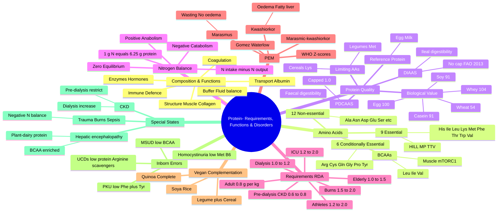

# Protein- Requirements, Functions & Disorders

**Related:** [[Nutritional Factors in Disease MOC]], [[Davidson Chapter 22 - Nutritional Factors in Disease Hierarchy]], [[Protein-Energy Malnutrition (Marasmus & Kwashiorkor)]], [[../00_Index/Medicine MOC|Medicine MOC]]

> [!important]
> **Proteins supply 9 essential + 9 conditionally essential amino acids, yield 4 kcal/g, contain ~16% nitrogen (6.25 g protein per 1 g N), and require 0.8 g/kg/day in healthy adults (more in illness, CKD, hepatic disease, or specialised diets).**

## 1. Learning Objectives
- [ ] List the 9 essential and 6 conditionally essential amino acids and their key metabolic roles
- [ ] Define biological value, PDCAAS, DIAAS, and reference protein; rank common food proteins
- [ ] Perform a nitrogen balance calculation using the 6.25 g protein : 1 g N factor
- [ ] State protein RDA for healthy adults, elderly, athletes, and critically ill patients
- [ ] Differentiate kwashiorkor, marasmus, and intermediate forms of PEM
- [ ] Apply the principles of vegan protein complementation to a practical diet plan
- [ ] Describe the clinical features and dietary management of PKU, MSUD, homocystinuria, and urea cycle disorders
- [ ] Prescribe appropriate protein intake in chronic kidney disease, dialysis, and hepatic encephalopathy
- [ ] Explain why severe trauma, burns, and sepsis produce a negative nitrogen balance
- [ ] Recognise branched-chain amino acid (BCAA) metabolism and its relevance to hepatic encephalopathy and MSUD

## 2. Definitions / Key Concepts

| Term | Definition |
|------|------------|
| **Amino acid** | Organic molecule with an amino (–NH₂) and carboxyl (–COOH) group joined to a side chain (R); the building block of proteins |
| **Essential amino acid (EAA)** | Cannot be synthesised de novo by humans in adequate amounts and must be obtained from diet (9 in adults) |
| **Conditionally essential AA** | Synthesised normally, but become essential under specific physiological or pathological conditions (prematurity, illness, critical illness) |
| **Non-essential AA** | Synthesised endogenously from keto-acids and a source of amino nitrogen (12) |
| **Limiting amino acid** | The essential AA in a food protein present in lowest proportion relative to human requirement, restricting its net utilisation |
| **Biological value (BV)** | Proportion of absorbed protein retained (utilised) for growth/maintenance; egg white = 100 (reference) |
| **Net Protein Utilisation (NPU)** | Proportion of ingested protein retained = digestibility × BV |
| **PDCAAS** | Protein Digestibility-Corrected Amino Acid Score; based on human AA requirements (2–5 y); capped at 1.00; replaced by DIAAS |
| **DIAAS** | Digestible Indispensable Amino Acid Score; uses ileal digestibility in pigs; no upper cap; current FAO standard |
| **Reference protein** | A protein with AA profile meeting 100% of human requirements at every age (egg, cow's milk, beef) |
| **Nitrogen balance (N₂ bal)** | N intake − N output (urine + faeces + skin + miscellaneous); zero = equilibrium, +ve = anabolism, −ve = catabolism |
| **Lean Body Mass (LBM)** | Body mass minus fat mass; rich in protein; ~12–15% of LBM is protein |
| **Sarcopenia** | Age-related loss of muscle mass, strength, and function; associated with inadequate protein intake |
| **BCAA** | Branched-chain amino acids: leucine, isoleucine, valine; metabolised primarily in muscle |
| **Aminoacidopathy** | Inborn error of amino acid metabolism (e.g., PKU, MSUD, homocystinuria, tyrosinaemia) |
| **Hyperammonaemia** | Elevated blood ammonia, often from urea cycle defects or hepatic failure; neurotoxic |
| **Reference protein intake (RPI)** | The amount of dietary protein needed to meet the requirement of 97.5% of the population |

## 3. Core Content

### Section 1: Structure, Composition & Functions of Protein

**Elemental composition** — C 50–55%, H 6–7%, O 22%, N ~16% (range 13–19%). The nitrogen content is exploited for Kjeldahl analysis. **Conversion factor: 1 g N ≡ 6.25 g protein** (used for mixed diets; 5.4 for plant proteins, 6.38 for milk, 5.93 for wheat, 5.7 for rice).

**Energy yield:** 4 kcal/g (17 kJ/g) by Atwater factor, but metabolically less efficient than CHO/lipid because of urea synthesis cost (~1 kcal/g of energy lost in urea excretion).

**Functional roles of body protein (~10–12 kg in a 70 kg adult):**
1. **Structural** — collagen, elastin, keratin, muscle (actin, myosin)
2. **Enzymatic** — all enzymes are proteins
3. **Hormonal** — insulin, GH, glucagon
4. **Transport** — albumin (drugs, bilirubin, Ca²⁺, free fatty acids), transferrin, ceruloplasmin, lipoproteins
5. **Defence** — immunoglobulins, complement, cytokines, acute-phase reactants
6. **Contraction** — actin/myosin
7. **Buffer** — plasma and intracellular proteins
8. **Storage** — ferritin (Fe), caeruloplasmin (Cu), vitellogenin
9. **Coagulation & fibrinolysis** — fibrinogen, all clotting factors (except factor IV = Ca²⁺, factor VIII = vWF)
10. **Receptors & signalling** — membrane receptors, G-proteins
11. **Oxygen transport** — haemoglobin, myoglobin
12. **Fluid & electrolyte balance** — oncotic pressure of albumin (colloid osmotic pressure)

### Section 2: Amino Acid Classification

**Total 20 proteinogenic AAs** (some classifications count 21 with selenocysteine).

#### 2.1 Essential Amino Acids (9 in adults)

The 9 indispensable AAs that **must be supplied by the diet** because they cannot be synthesised at all, or not in adequate amounts:

| AA | One-letter | Special notes |
|------|----|------|
| **H**istidine | H | Essential in infants; semi-essential in adults (deficiency causes anaemia in uraemia) |
| **I**soleucine | I | BCAA, ketogenic + glucogenic |
| **L**eucine | L | BCAA, purely ketogenic; key mTORC1 activator (anabolic signalling) |
| **L**ysine | L | Purely ketogenic; first limiting AA in wheat |
| **M**ethionine | M | Contains sulphur; methyl donor (→ SAM); precursor of cysteine |
| **P**henylalanine | P | Purely ketogenic; precursor of tyrosine (and melanin, dopamine, NE, epi, T3/T4) |
| **T**hreonine | T | Both hydroxyl and methyl group; mucin synthesis |
| **T**ryptophan | T | Precursor of serotonin, melatonin, niacin (B3); 60 mg Trp → 1 mg niacin |
| **V**aline | V | BCAA, glucogenic |

**Easy mnemonic:** "**HILL MP TTV**" or "**PVT TIM HALL**" — **P**he, **V**al, **T**hr, **T**rp, **I**le, **M**et, **H**is, **A**rg*, **L**eu, **L**ys (*Arg is conditionally essential).

#### 2.2 Conditionally Essential Amino Acids (6, sometimes listed as 6–9)

Become essential when endogenous synthesis is insufficient:

| AA | Condition making it essential |
|------|-------------------------------|
| **Arginine** | Prematurity, sepsis, trauma, burns, urea cycle disorders |
| **Cysteine** | Prematurity (lacks cystathionase), liver disease, homocystinuria |
| **Glutamine** | Critical illness, mucositis, post-op, bone-marrow transplant; major fuel for enterocytes & immune cells |
| **Glycine** | Prematurity, rapid growth, severe trauma |
| **Proline** | Prematurity, severe catabolic states, burns |
| **Tyrosine** | PKU (cannot convert Phe → Tyr), prematurity, liver/renal failure |

#### 2.3 Non-Essential (Dispensable) Amino Acids — 12

Alanine, Asparagine, Aspartate, Glutamate, Serine, Selenocysteine, Pyrrolysine (rare). Plus the 6 conditionally essential AAs above are also considered "non-essential" in the healthy adult.

**Glucogenic vs Ketogenic vs Mixed:**
- **Purely glucogenic (8):** Ala, Arg, Asn, Asp, Cys, Gln, Gly, His, Pro, Ser, Trp, Val (note Val is glucogenic BCAA)
- **Purely ketogenic (2):** Leu, Lys
- **Both (mixed) (5):** Ile, Phe, Trp, Tyr, Thr (Trp & Tyr largely ketogenic)

### Section 3: Protein Quality — Biological Value, PDCAAS, DIAAS

#### 3.1 Biological Value (BV)

**Definition:** % of **absorbed** protein retained (utilised) by the body.

**BV = (N retained / N absorbed) × 100**

Higher BV = better complement of EAAs relative to human need and better digestibility.

| Source | Biological Value (BV) |
|--------|----------------------|
| Whey protein | **104** (highest practical) |
| Egg (whole) | **100** (classical reference) |
| Cow's milk | 91 |
| Casein | 91 |
| Soybean | 91 |
| Beef / fish | 80 |
| Rice | 83 |
| Wheat | 54–65 |
| Beans (legumes) | 58–74 |
| Gelatin | 0 (lacks Trp, low in many EAAs) |

**Key concept:** Egg = 100, Whey > 100, Plant proteins generally lower (limiting in Lys or Met or Thr).

#### 3.2 Net Protein Utilisation (NPU)

**NPU = (N retained / N intake) × 100** (combines digestibility + BV)

#### 3.3 Protein Efficiency Ratio (PER)

**Weight gain of growing rat ÷ weight of protein consumed** — older method, less physiological, still on some food labels.

#### 3.4 PDCAAS (Protein Digestibility-Corrected Amino Acid Score)

**Used by US FDA / FAO/WHO 1991.**

- Score based on the **most limiting indispensable AA** vs. the 2–5 y human AA requirement pattern
- Multiplied by faecal (true) digestibility
- **Capped at 1.00** (100%) — problem: doesn't differentiate superior proteins
- Example values (older data): whey 1.00, casein 1.00, soy 1.00, wheat 0.42, pea 0.89

#### 3.5 DIAAS (Digestible Indispensable Amino Acid Score) — **current gold standard**

**Introduced by FAO 2013.**

- Uses **ileal** (not faecal) digestibility in growing pig or human
- Score reflects digestibility up to terminal ileum
- **No upper cap** — superior proteins can score > 1.0
- Three reference patterns (infant, child 0.5–3 y, older child/adult)
- Example DIAAS values: whey ~1.09, milk 1.18, egg 1.13, soy ~0.90, pea 0.82, wheat 0.40–0.77

**Comparison: PDCAAS vs DIAAS**

| Feature | PDCAAS | DIAAS |
|---------|--------|-------|
| Digestibility used | Faecal | Ileal (more accurate) |
| Upper cap | Yes (1.0) | No |
| Reference AA pattern | 2–5 y child | Infant / child / adult |
| Preferred by | FDA | FAO |

#### 3.6 Reference Protein

A protein whose digestibility is high and whose amino acid profile meets 100% of human requirements with no deficiency or excess. **Egg, cow's milk, beef, fish, whey** are reference proteins.

#### 3.7 Limiting Amino Acid in Plant Proteins (Vegan Complementation)

| Plant protein | Limiting EAA |
|---------------|--------------|
| **Cereals (wheat, rice, corn)** | **Lysine** (1st limiting); also Thr (rice) |
| **Legumes (beans, lentils, peas)** | **Methionine** (1st limiting); Cys (soya) |
| **Nuts & seeds** | Lysine |
| **Soya** | Methionine (but better than most legumes) |
| **Quinoa, amaranth, buckwheat** | Complete! Excellent vegan sources |

**Complementation principle:** Combining cereals (Lys-low) + legumes (Met-low) gives a complete protein. Examples: rice + dal (Indian), beans + tortilla (Latin American), hummus (chickpea + wheat), tofu + rice.

### Section 4: Nitrogen Balance

**Nitrogen Balance (N₂ bal) = N intake − N output**

- **N output** = urinary N (mostly urea) + faecal N + skin N (sweat, hair, nails) + miscellaneous (menstrual, seminal)
- Urinary urea N is the largest component (~80–90% of urinary N)

**Conversion: 1 g dietary protein ≈ 16% N → 1 g protein contains 0.16 g N**
- **∴ 1 g N ≡ 6.25 g protein (mixed diet)**
- Specific factors: milk 6.38, egg 6.25, meat 5.93, wheat 5.83, rice 5.95, soy 5.71

**Clinical states of N balance:**

| State | Intake vs Output | Implication |
|-------|------------------|-------------|
| **Zero N balance** | Intake = output | Healthy adult at maintenance |
| **Positive N balance** | Intake > output | Growth, pregnancy, recovery, anabolic states, post-exercise |
| **Negative N balance** | Intake < output | Catabolism: trauma, burns, sepsis, fasting, hyperthyroid, PEM |

**Typical urinary urea N excretion:** ~10–15 g N/day on a normal diet (≈ 60–95 g protein catabolism/day if no intake).

**Worked example:**
- Patient consumes 80 g protein/day → N intake = 80/6.25 = 12.8 g N
- 24-h urinary urea = 240 mmol, urinary N from urea = 240 × 0.028 ≈ 6.7 g
- Faecal N ≈ 1.0 g; skin/misc ≈ 0.5 g
- N output = 6.7 + 1.0 + 0.5 = 8.2 g
- N balance = 12.8 − 8.2 = **+4.6 g (positive, anabolic)**

### Section 5: Protein Requirements (RDA & Beyond)

**Recommended Daily Allowance (RDA) for protein in healthy adults (FAO/WHO/UNU 2007; IOM 2005):**
- **0.83 g/kg/day** (FAO) = **0.8 g/kg/day** (rounded, IOM)
- Assumes high-quality (complete) protein and normal energy intake
- Expressed as **RDA + 2 SD** to cover 97.5% of population

**AMDR (Acceptable Macronutrient Distribution Range):** 10–35% of total energy from protein.

**Special groups — protein needs vary substantially:**

| Group | Recommended g/kg/day | Notes |
|-------|----------------------|-------|
| **Healthy adult (19–50 y)** | **0.8** | Maintenance |
| **Pregnancy (2nd/3rd trimester)** | 1.1 (IOM) / +25 g/day | Foetal growth |
| **Lactation** | 1.3 / +19 g/day | Milk synthesis |
| **Infants 0–6 m** | 1.52 (AI) | Breast milk (1.0–1.5 g/kg/d typical intake) |
| **Infants 7–12 m** | 1.2 | |
| **Children 1–3 y** | 1.05 | |
| **Adolescents 14–18 y** | 0.85 | Growth |
| **Elderly (>65 y)** | **1.0–1.5** | Sarcopenia prevention; 25–30 g/meal of high-quality |
| **Endurance athletes** | **1.2–1.4** | |
| **Strength / resistance athletes** | **1.6–2.0** (up to 2.2 in hypocaloric) | Muscle protein synthesis |
| **Critical illness (ICU)** | **1.2–2.0** (ASPEN/ESPEN 1.3–2.0) | Hypercatabolism; ESPEN 1.3 g/kg/d general; 1.5–2.0 in severe burns |
| **Major burns** | **1.5–2.0** (some 2.0–2.5) | Highest catabolism |
| **Severe trauma / sepsis** | **1.5–2.0** | |
| **Pre-dialysis CKD (3–5, not on RRT)** | **0.6–0.8** (or 0.55–0.6 with keto-acid analogues) | Slow progression |
| **Haemodialysis** | **1.0–1.2** | Replace dialysate losses |
| **CAPD / APD (peritoneal)** | **1.0–1.2** | |
| **CRRT / SLED** | up to 1.5–1.7 | |
| **Hepatic encephalopathy** | 0.5–1.5 (individualise) | Often 0.5–1.0; **BCAA-enriched** formulas |
| **Acute renal failure, non-catabolic** | 0.6–0.8 | |
| **Pancreatitis (mild)** | 1.0–1.5 | |
| **Short-bowel / malabsorption** | 1.5 | |

**Clinical rules of thumb:**
- A 70 kg adult → **56 g/day** (0.8 g/kg)
- 80 kg bodybuilder → **128–160 g/day** (1.6–2.0 g/kg)
- Bed-ridden elderly 60 kg → **60–90 g/day** (1.0–1.5 g/kg)
- ICU patient 80 kg → **104–160 g/day** (1.3–2.0 g/kg)

### Section 6: Protein-Energy Malnutrition (PEM)

PEM spectrum — see [[Protein-Energy Malnutrition (Marasmus & Kwashiorkor)]] for full detail. Quick reference:

| Feature | Marasmus | Kwashiorkor | Marasmic-kwashiorkor |
|---------|----------|-------------|----------------------|
| **Deficiency** | Total energy + protein | Protein predominant (relative) | Both |
| **Age** | < 18 m (weanling) | 1–4 y (post-weaning) | Mixed |
| **Wasting** | Severe (↓ muscle + fat) | Present | Severe wasting + oedema |
| **Oedema** | Absent | **Present** (pitting, often pedal → face) | Present |
| **Hepatomegaly** | Absent | **Fatty liver** (apoprotein ↓ → VLDL export ↓) | Variable |
| **Skin/hair** | Normal | Flaky paint dermatosis, sparse hypopigmented hair, flag sign | Mixed |
| **Subcutaneous fat** | Absent | May be preserved | Absent |
| **Serum albumin** | Low-normal | **Very low** (< 25 g/L) | Low |
| **Mood** | Alert, voracious | Miserable, apathetic, anorexic | Apathetic |
| **Mortality** | Lower (chronic adaptation) | **Higher** (acute metabolic decompensation) | Highest |
| **Management** | Slow refeed, F-75 → F-100 | F-75 → F-100; treat infection, **do not** give high-protein acutely | Combined |

**WHO classification (Z-scores, weight-for-height):**
- **Mild malnutrition:** -1 to -2 SD
- **Moderate acute malnutrition (MAM):** -2 to -3 SD (also mid-upper arm circumference MUAC 11.5–12.5 cm)
- **Severe acute malnutrition (SAM):** < -3 SD OR MUAC < 11.5 cm OR bilateral pitting oedema
- **Gomez classification** (weight-for-age): mild 75–90%, moderate 60–74%, severe < 60%
- **Waterlow classification** (chronic): wasting (low weight-for-height) vs. stunting (low height-for-age)

**Why kwashiorkor has a fatty liver:** Deficient apoB synthesis (lack of apoprotein B-100) → failure of VLDL assembly/secretion from liver → triglycerides accumulate. Oedema is partly from hypoalbuminaemia but additionally from oxidative damage ("free radical" theory) and aflatoxin hypotheses.

### Section 7: Vegan Protein Complementation

Because individual plant proteins are "incomplete" (low in one or more EAAs), combining two or more plant sources **at the same meal or within 24 h** gives a complete protein with all EAAs at adequate levels.

| Complementary pair | Limiting AAs covered | Example dishes |
|--------------------|---------------------|----------------|
| **Legumes + cereals** | Legume adds Lys, cereal adds Met | Rice + dal; beans + tortilla; lentil soup + bread; tofu + rice |
| **Legumes + nuts/seeds** | Nut adds Met; legume adds Lys | Hummus + sesame; bean + walnut salad |
| **Legumes + dairy** (for lacto-ovo) | Lys + Met | Lentils + milk/yogurt/cheese |
| **Soya + rice** | Near-perfect match | Tofu stir-fry with rice |
| **Soya + wheat** | Lys + Met | Soya chunks in chapatti |
| **Soya + corn** | Lys + Trp | Tofu tacos |
| **Peanut + wheat** | Lys + Met | Peanut butter sandwich |
| **Soya alone** | Adequate, but not "complete" for infants (Met) | Tofu, tempeh, edamame |
| **Quinoa, amaranth, buckwheat, hempseed** | **Complete** | No need to complement |
| **Spirulina, chlorella** | Complete, high in Lys | Single-source supplement |

**Old myth busted:** It is **not** necessary to combine complementary proteins at the same meal — daily intake is sufficient (concept of mutual supplementation over the day), but same-meal combining is more efficient and prudent in vulnerable groups (infants, pregnancy, athletes).

### Section 8: Branched-Chain Amino Acids (BCAAs)

The three BCAAs are **leucine, isoleucine, valine** — so named because of a branched aliphatic side chain.

**Distinctive metabolism:**
- Transaminated primarily in **skeletal muscle** (not liver) by **branched-chain amino-acid transaminase (BCAT)**.
- Decarboxylated by the **branched-chain α-keto acid dehydrogenase (BCKDH) complex** in muscle, adipose, kidney, brain.
- Genetic deficiency of BCKDH = **Maple Syrup Urine Disease (MSUD)**.

**Leucine is the major anabolic signal:**
- Stimulates **mTORC1** (mechanistic target of rapamycin complex 1)
- Promotes muscle protein synthesis (MPS) and inhibits proteolysis
- Adequate leucine per meal: ~2.5–3.0 g to maximally stimulate MPS in older adults
- Whey protein (≈ 11–14% Leu) is rich in leucine

**Clinical uses / controversies:**
- **Hepatic encephalopathy:** BCAA-enriched formulae (high Leu, low aromatic AAs Phe, Tyr, Trp) — rationale: the failing liver cannot clear aromatic AAs that compete with BCAAs for transport across the blood–brain barrier. Reducing aromatic AAs and supplementing BCAAs may improve encephalopathy. **Evidence: mixed, may reduce recurrence; not a primary therapy.**
- **Sports nutrition:** BCAA supplementation modestly reduces muscle soreness and may attenuate central fatigue (Trp → serotonin); however, **whole protein (whey) > free BCAA** because whey supplies all EAAs.
- **Cirrhosis / sarcopenia:** BCAA supplementation (oral 12–14 g/day) may improve muscle mass and event-free survival in decompensated cirrhosis (Yoshida, Muto 2011; ESPEN guidelines 2019 weak-positive).
- **MSUD** — see below: BCAAs (especially Leu) are neurotoxic and must be restricted.

### Section 9: Inborn Errors of Amino Acid Metabolism

#### 9.1 Phenylketonuria (PKU)
- **Defect:** Phenylalanine hydroxylase (PAH) deficiency; rarely BH₄ cofactor deficiency
- **Gene:** PAH (chr 12); AR; incidence ~1:10,000–15,000 live births
- **Pathology:** Phe accumulates → neurotoxic; Tyr becomes conditionally essential (cannot be made from Phe)
- **Clinical:** Intellectual disability, microcephaly, seizures, eczema, fair skin/hair (↓ melanin), musty/mousy body odour
- **Screening:** Newborn heel-prick (Guthrie) at day 3–5
- **Treatment:**
  - **Low-Phe diet** (restrict high-Phe foods: meat, fish, eggs, cheese, nuts, aspartame)
  - **Phe-free, Tyr-supplemented** AA formulas (e.g., XPhe products)
  - **BH₄ (sapropterin) responsive** in ~25–50% (mild)
  - Large neutral amino acids (LNAAs) supplementation in adolescents
  - Goal: plasma Phe 120–360 µmol/L (children), 120–600 µmol/L (adults)
- **Maternal PKU syndrome:** Uncontrolled maternal Phe → foetal microcephaly, cardiac defects, IUGR; preconception control is critical.

#### 9.2 Maple Syrup Urine Disease (MSUD)
- **Defect:** Branched-chain α-keto acid dehydrogenase (BCKDH) complex deficiency
- **Substrate accumulation:** Leu, Ile, Val, α-ketoisocaproate, α-keto-β-methylvalerate, α-ketoisovalerate
- **Clinical:** Poor feeding, vomiting, lethargy, hypertonia, opisthotonus, seizures, **characteristic sweet/maple-syrup odour of urine** (from sotolone), coma; untreated → death in 1st weeks
- **Forms:** Classic (severe, neonatal), intermediate, intermittent, thiamine-responsive
- **Treatment:** **Restrict BCAAs** (especially Leu — most neurotoxic), provide BCAA-free formula, aggressive management of acute decompensation (IV glucose + insulin, BCAA-free TPN, haemodialysis), liver transplantation for classic form
- **Monitoring:** Plasma Leu, Ile, Val; keep Leu < 1000 µmol/L

#### 9.3 Homocystinuria (Classical)
- **Defect:** Cystathionine β-synthase (CBS) deficiency (most common); also methionine synthase, MTHFR
- **Accumulation:** Homocysteine, methionine
- **Clinical:** Marfanoid habitus (tall, long limbs, arachnodactyly), **lens subluxation downward** (vs Marfan upward!), intellectual disability, thrombosis (DVT, stroke, MI), osteoporosis, fair complexion
- **Treatment:**
  - **Pyridoxine (B6) trial** — ~50% of CBS-deficient patients are B6-responsive
  - **Low-Met, Cys-supplemented** diet
  - Betaine (trimethylglycine) — remethylates Hcy → Met
  - Folate, B12, B6 supplementation
  - Aspirin/anticoagulation for thrombosis

#### 9.4 Urea Cycle Disorders (UCDs)
- **Defect:** Any of the 6 enzymes of the urea cycle — **CPS1, OTC, ASS (citrullinaemia), ASL (argininosuccinic aciduria), arginase, N-acetylglutamate synthase**
- Most common: **OTC deficiency** (X-linked) — ~1:14,000
- **Pathology:** Failure to convert NH₃ → urea → **hyperammonaemia** → cerebral oedema, neurotoxicity
- **Clinical:** Neonatal lethargy, vomiting, tachypnoea (respiratory alkalosis!), seizures, coma; later-onset forms triggered by catabolism, high-protein meal, infection
- **Treatment:**
  - **Dietary protein restriction** (0.5–1.0 g/kg/day acutely; build up gradually)
  - **Arginine supplementation** (essential in most UCDs except arginase deficiency)
  - **Sodium benzoate + sodium phenylbutyrate/phenylacetate** — nitrogen scavengers (divert N to alternative excretion pathways: hippurate + phenylacetyl-glutamine)
  - **Acute hyperammonaemia:** stop protein intake, IV glucose + lipids, sodium benzoate/phenylbutyrate, **haemodialysis** (NH₃ > 500 µmol/L or rapidly rising)
  - **L-carnitine** if secondary deficiency
  - Liver transplantation for severe forms
  - **Avoid valproate** (inhibits CPS)

### Section 10: Protein in Special Clinical States

#### 10.1 Negative Nitrogen Balance in Trauma / Burns / Sepsis

- **Stress response:** Counter-regulatory hormones (cortisol, catecholamines, glucagon) + cytokines (TNF-α, IL-1, IL-6) → increased proteolysis, gluconeogenesis, acute-phase protein synthesis, insulin resistance
- Net result: **catabolism of skeletal muscle → negative N balance** despite adequate intake
- **Magnitude (g N lost/day):** Simple surgery 12–24 g; severe trauma 20–30 g; major burns 30–50 g; sepsis 20–40 g
- **Burns-specific:** Curling's ulcer risk; **hypermetabolism up to 2× BMR**; protein needs **1.5–2.0 g/kg** (up to 2.5 in massive burns)
- **Goals of nutrition support:** Limit catabolism, support wound healing, immune function, preserve LBM
- Continuous feeding > bolus (better N balance)

#### 10.2 Protein in Chronic Kidney Disease (CKD)

| Stage | eGFR | Protein intake (g/kg/day) |
|-------|------|--------------------------|
| CKD 1–2 (no nephrotic syndrome) | > 60 | 0.8–1.0 |
| CKD 3–5 (pre-dialysis) | < 60 | **0.6–0.8** (or 0.55–0.6 with keto-analogues) |
| Haemodialysis | < 15 (on HD) | **1.0–1.2** (replaces dialytic losses + catabolism) |
| CAPD/APD | on PD | **1.0–1.2** (replaces peritoneal losses) |
| CRRT | ICU | 1.5–1.7 (max) |
| Nephrotic syndrome | — | 0.8 + 1 g per g urinary protein (some guidelines 0.8–1.0) |

- **Rationale for low-protein pre-dialysis diet:** reduces uraemic toxin generation, slows progression (esp. with keto-analogues), reduces hyperphosphataemia
- **Caution:** Avoid malnutrition; must monitor nPCR (normalised protein catabolic rate) and dietary review
- **Keto-analogues (ketoacids):** Nitrogen-free analogues of EAAs; provide carbon skeleton but recycle N → urea → ammonia, reducing urea generation

#### 10.3 Protein in Hepatic Disease

- Mild liver disease: 1.0–1.2 g/kg
- Compensated cirrhosis: 1.0–1.5 g/kg (do not over-restrict; worsen sarcopenia)
- **Hepatic encephalopathy (HE):** restrict to **0.5–1.0 g/kg/day**; **plant-based / dairy protein preferred** (more BCAA, less aromatic AA; higher fibre → ↓ NH₃ absorption); BCAA-enriched formulae (HE/HE-FP) may help in chronic HE
- Acute liver failure: 0.5–1.0 g/kg, with adequate calories (35–40 kcal/kg)

#### 10.4 Protein in Other States
- **Diabetes mellitus:** 0.8–1.0 g/kg; avoid excess (renal protection incipient CKD)
- **Obesity (bariatric):** 1.0–1.5 g/kg ideal body weight; **60–80 g/day minimum** after sleeve gastrectomy/RYGB to preserve LBM
- **Pregnancy:** 1.1 g/kg + 25 g/day (esp. 2nd–3rd trimester)
- **Lactation:** 1.3 g/kg + 19 g/day
- **Wound healing / pressure ulcers:** 1.2–1.5 g/kg; arginine (17–24 g/day) and glutamine may aid
- **Haemodialysis (older adult):** 1.2 g/kg to compensate catabolism

### Section 11: Assessment of Protein Status

| Method | What it measures | Caveats |
|--------|------------------|---------|
| **Serum albumin** | Slow-turnover (t₂ ~ 20 d); falls in chronic PEM, inflammation, liver disease, nephrotic syndrome | Half-life too long to detect acute changes; **negative acute-phase reactant** |
| **Prealbumin (transthyretin)** | Faster turnover (t₂ ~ 2 d) | Also negative acute-phase reactant; better for tracking recent changes |
| **Retinol-binding protein (RBP)** | t₂ ~ 12 h | Urinary losses in renal failure, ↑ in renal disease |
| **24-h urinary urea N** | Reflects catabolism | Used in N balance studies |
| **3-methylhistidine** | Specific myofibrillar protein breakdown marker | Research use |
| **Anthropometry** — triceps skinfold, mid-arm circumference, hand-grip strength | Lean & fat mass | Operator-dependent |
| **DEXA** | Body composition (lean/fat/bone) | Gold standard non-invasive |
| **Bioelectrical impedance (BIA)** | Lean mass, total body water | Hydration-dependent |
| **Subjective Global Assessment (SGA)** | Bedside, integrated | Operator-dependent |
| **nPCR** (Kt/V in HD patients) | Dialysis-related catabolism | Renal-specific |

### Section 12: Excess Protein — Is It Harmful?

- **Healthy kidneys:** No evidence that high protein (2–3 g/kg/d) causes CKD in healthy people; renal hyperfiltration reversible
- **Pre-existing CKD:** May accelerate progression → protein restriction as above
- **Calcium balance:** High animal protein increases calciuria (acid load) → potential bone loss if chronic; not conclusive
- **Cancer risk:** Some data for colorectal cancer with very high red/processed meat intake (IARC 2A), not pure protein
- **Ketogenic diets:** Safe short term; long-term data limited
- **Maximum tolerated:** ~2.5 g/kg/d in healthy adult (beyond this → no benefit, GI upset)

## 4. Clinical Correlation

| Scenario | Action | Notes |
|----------|--------|-------|
| 70 kg adult with stable CKD-3 (eGFR 45) | 0.6–0.8 g/kg protein/day = 42–56 g; consider keto-analogue supplementation | Monitor eGFR, bicarbonate, nPCR, nutritional status |
| 60 kg elderly with sarcopenia and recent fall | 1.2–1.5 g/kg/day, 25–30 g protein/meal, resistance exercise | Leucine 2.5–3 g/meal (whey) |
| 80 kg ICU patient, septic shock, on noradrenaline, day 5 | Start enteral feeding within 24–48 h, 1.2–2.0 g/kg/day (1.3 ESPEN); reach 80% target by 7–10 days | Add fish oil/arginine if surgical |
| 24-year-old vegan, weight 55 kg, pregnant 20 w | 1.1 g/kg + 25 g/day; advise legumes + cereals complementation; check B12, Fe, Zn, vitamin D | Use soya, quinoa; supplement B12 |
| 5-day-old neonate, Guthrie test positive (Phe 1200 µmol/L) | Urgent referral, start Phe-restricted Tyr-supplemented formula, breast milk in measured amounts, monitor plasma Phe weekly | Prevent neurotoxicity |
| 4-day-old neonate, lethargic, refusing feeds, sweet-smelling urine | Send plasma AA, urine organic acids; stop protein intake, IV 10% dextrose, BCAA-free TPN, prepare for dialysis | MSUD acute decompensation |
| 70-year-old cirrhotic with ascites and grade 2 HE | 0.8–1.0 g/kg/day of plant-dairy protein; BCAA-enriched formula; lactulose + rifaximin | Avoid prolonged severe restriction (sarcopenia) |
| 25-year-old athlete, 90 kg, resistance training, off-season | 1.6–2.2 g/kg/day, evenly distributed (4 × 0.4 g/kg), 0.4 g/kg/dose post-training | Whey or milk-based; high leucine |
| 70 kg patient, 40% burns, day 2 post-admission | 1.5–2.0 g/kg/day (some 2.0–2.5), high-energy 35–40 kcal/kg; nasoenteric feeding started early; monitor glucose, electrolytes | Glutamine 0.3–0.5 g/kg/day IV (controversial but ESPEN 2009) |
| 3-month-old, breast-fed, but mother has PKU poorly controlled | Counsel on maternal PKU, ensure Phe 120–360 μmol/L throughout pregnancy | Preconception control critical |

## 5. High-Yield FCPS/MRCP Points

> [!important]
> - **Must know:**
>   - The 9 essential AAs (HILL, MP, TTV) and the 6 conditionally essential AAs
>   - 1 g N ≡ 6.25 g protein (mixed diet) — used for every N-balance calculation
>   - RDA 0.8 g/kg/day adult; 1.0–1.5 elderly; 1.2–2.0 athletes; 1.2–2.0 critical illness; 0.6–0.8 pre-dialysis CKD
>   - Egg BV 100, whey 104, casein 91, soy 91
>   - PDCAAS capped at 1.0 (FDA); DIAAS uses ileal digestibility, no cap (FAO 2013)
>   - Kwashiorkor = protein deficiency with oedema, fatty liver, dermatosis; Marasmus = total energy deficiency with wasting
>   - Marasmus preserves alertness; kwashiorkor presents with apathy and anorexia
>   - Vegan complementation: legume + cereal (or nut/seed)
>   - PKU: low Phe, supplement Tyr; maternal PKU → foetal abnormalities
>   - MSUD: BCAA restriction; sweet-smelling urine (sotolone)
>   - Homocystinuria: lens subluxation **downward** (Marfan upward); low-Met diet, B6 trial, betaine
>   - UCDs: low-protein, arginine, sodium benzoate/phenylbutyrate, haemodialysis
>   - **BCAA** (Leu, Ile, Val) — metabolised in muscle; Leu activates mTORC1 → MPS
> - **Common viva:**
>   - "Explain nitrogen balance" — define, give equation, examples
>   - "Differences between PDCAAS and DIAAS"
>   - "How would you feed a critically ill burns patient?"
>   - "Plan a vegan diet that meets all amino acid needs"
>   - "Differentiate kwashiorkor and marasmus clinically"
>   - "Newborn screening positive for PKU — what next?"
> - **Exam trap:**
>   - PDCAAS vs DIAAS — DIAAS has no upper cap, uses ileal digestibility
>   - Lens subluxation in homocystinuria is **downward** (Marfan = upward)
>   - Lysine is the limiting AA in wheat; methionine in legumes
>   - Kwashiorkor can occur in **marasmic** children if given CHO without protein
>   - Negative N balance is normal in early feeding of malnutrition → re-feed gradually

## 6. Common Confusions / Exam Traps

| Trap | Correction |
|------|------------|
| All 20 AAs are essential | Only 9 essential in adults (HILL, MP, TTV); 12 are non-essential (or conditionally essential) |
| Whey BV is 100, the highest | Whey 104 > egg 100; casein 91 |
| PDCAAS can exceed 1.0 | No — capped at 1.0; DIAAS can exceed 1.0 |
| DIAAS uses faecal digestibility | No — uses **ileal** digestibility |
| Plant proteins are inferior | With **complementation**, plant proteins can meet all AA needs; quinoa/some others are complete |
| Kwashiorkor is just protein deficiency | It is more than that — oxidative stress, antioxidant depletion, free radical injury are implicated; oedema is multifactorial, not only hypoalbuminaemia |
| Marasmic children need immediate high-protein feeding | Start with F-75 (low-protein, low-fat) and feed gradually; high protein in F-100 only after stabilisation — risk of refeeding syndrome and "overshoot" deaths |
| BCAA supplementation builds muscle | **Whole protein > free BCAA** because all EAAs are required; BCAA alone does not maximally stimulate MPS |
| BCAA helpful in all liver disease | BCAA may help chronic HE; not routinely recommended in all cirrhotics |
| All uraemic patients need low-protein diet | Only **pre-dialysis**; once on haemodialysis/CAPD, increase to 1.0–1.2 g/kg |
| All PEM patients need micronutrients first | All severe malnutrition (SAM) gets **broad-spectrum** micronutrient + empiric antibiotics; vitamin A, folic acid, zinc, copper, iron (only after infection cleared) |
| Urea cycle disorder — give more protein to build muscle | No — restrict protein acutely, give nitrogen scavengers, supplement arginine |
| High protein damages normal kidneys | No strong evidence in healthy people |
| Phenylalanine is not an essential AA in PKU | It is **always** essential; in PKU it must be supplied in **strictly limited** amounts (e.g., 200–500 mg/day) |
| Energy from protein is 4 kcal/g and 100% used | ~1 kcal/g lost in urea synthesis; net usable ≈ 3 kcal/g |

## 7. Mnemonics

- **Essential AAs — "PVT TIM HALL"** (Phenylalanine, Valine, Threonine, Tryptophan, Isoleucine, Methionine, Histidine, **A**rg, Leucine, Lysine) or **"HILL MP TTV"** or **"LIMA TANK"** (Lys, Ile, Met, Arg, Thr, Asp... — variant)
- **BCAAs — "LIV"** (Leucine, Isoleucine, Valine) — "LIVe muscle"
- **Limiting AA in cereals = Lysine; in legumes = Methionine** — "Cereals cry Lys, legumes lack Met"
- **PDCAAS vs DIAAS** — **P**DCAAS = **P**oop (faecal); **D**IAAS = **D**own to **i**leum
- **Conversion 1 g N ≡ 6.25 g protein** — "**6**-point-**25**" (and the protein calorie is **4** kcal/g)
- **Urea cycle 6 enzymes:** **"C-O-A-A-A-N"** — **C**PS1, **O**TC, **A**SS, **A**SL, **A**rginase, **N**-acetylglutamate synthase
- **Kwashiorkor vs Marasmus** — "**K**wash = **K**idney/oedema (protein loss), Marasmus = Muscles (wasted)"
- **MSUD** — "**M**aple **S**yrup **U**rine **D**isease = decrease BCKDH = increase BCAA"

## 8. Mind Map

## 9. -Hour Recall Prompts

1. List the 9 essential amino acids and indicate which are BCAAs.
2. What is the conversion factor between protein and nitrogen? Give two exceptions.
3. Define biological value, PDCAAS, and DIAAS. Why was DIAAS introduced?
4. What is the RDA of protein for (a) a healthy adult, (b) an elderly person, (c) an athlete, (d) a pre-dialysis CKD patient, (e) a burns patient?
5. Differentiate kwashiorkor and marasmus in 5 lines.
6. Name the limiting amino acid in wheat and in legumes. Give a complementary combination.
7. Outline the management of a child with classic PKU.
8. What is the acute treatment of hyperammonaemia in a urea cycle disorder?
9. How do BCAAs (especially leucine) signal anabolism?
10. List 4 clinical states producing negative nitrogen balance and the protein needs in each.

## 10. -Day / 15-Day / 30-Day Revision Tracker

| Day | Date | Recall Quality (1-5) | Time Spent | Notes |
|-----|------|---------------------|------------|-------|
| 1   |      |                     |            |       |
| 7   |      |                     |            |       |
| 15  |      |                     |            |       |
| 30  |      |                     |            |       |

---

## 11. Must Know / Should Know / Nice to Know

| Priority | Content |
|----------|---------|
| **Must Know 🔴** | 9 essential AAs + 6 conditionally essential; 6.25 g protein per g N; RDA 0.8 g/kg/d; BV/PDCAAS/DIAAS basics; kwashiorkor vs marasmus; PKU/MSUD/homocystinuria/UCD principles; protein in CKD and HE; BCAA (LIV) and leucine mTORC1 |
| **Should Know 🟡** | Vegan complementation; limiting AAs in cereals/legumes; specific protein intakes in athletes/elderly/ICU/burns; apoB → fatty liver; nPCR/albumin/prealbumin markers; refeeding risk in PEM; F-75/F-100; SAM WHO criteria; BH4 in PKU; sapropterin; betaine in homocystinuria; sodium benzoate/phenylbutyrate in UCD |
| **Nice to Know 🟢** | DIAAS ileal pig model details; anabolic resistance in elderly; leucine threshold per meal; ASMS, MSUD thiamine-responsive; large-neutral amino acids (LNAA); maternal PKU syndrome specifics; keto-analogues in CKD; Yoshida BCAA cirrhosis trials; Curling's ulcer in burns |

## 12. My Weak Points
- [ ]
- [ ]

## 13. Self-Test Scorecard

| Domain | Score /10 | Target /10 |
|--------|-----------|------------|
| Understanding |    | 8+ |
| Recall |    | 8+ |
| MCQ Performance |    | 8+ |
| SBA Performance |    | 8+ |
| Viva Confidence |    | 8+ |
| **TOTAL** |    | **40+/50** |

## 14. Exam Answer Modes

### Long Answer / Essay (20 min)
- Discuss the classification, biological value, and assessment of protein quality. Add a note on the protein requirements of vulnerable groups (elderly, athletes, critically ill, CKD, hepatic disease).

### Short Note (7 min)
- Nitrogen balance: definition, equation, calculation, clinical states.
- Differentiate kwashiorkor and marasmus.
- Protein requirements in chronic kidney disease.
- Essential vs non-essential amino acids.
- BCAA metabolism and clinical relevance.
- Management of PKU.

### Viva Answer (3 min)
- "What is the conversion factor between dietary protein and nitrogen, and how is it used in clinical practice?"
- "What are the BCAAs and what is their special role?"
- "Why does kwashiorkor cause a fatty liver?"
- "How would you manage a neonate with maple syrup urine disease?"

### Ward Case Discussion (5 min)
- 65-year-old man, decompensated cirrhosis, BMI 19, ascites, grade 2 HE → diet plan: 1.0–1.2 g/kg plant-dairy protein, BCAA-enriched formula, lactulose, rifaximin, daily weights, electrolytes.
- 30-year-old with PKU, planning pregnancy → preconception Phe control 120–360 µmol/L, Tyr-supplemented AA formula, low-Phe diet, MDT follow-up.
- 80 kg bodybuilder, vegan → 1.6 g/kg protein, legumes + soya + rice + quinoa, B12 supplement, monitor Fe and Zn.

### Last-Night-Before-Exam Sheet (1 min)
- 9 EAAs (HILL MP TTV) | 6 Conditionally essential (Arg, Cys, Gln, Gly, Pro, Tyr)
- BCAA = LIV → muscle, mTORC1, Leu = anabolic signal
- 1 g N = 6.25 g protein
- BV: Whey 104 > Egg 100 > Casein 91 > Soy 91 > Wheat ~60
- PDCAAS = faecal, cap 1.0; DIAAS = ileal, no cap (FAO 2013)
- RDA: 0.8 adult; 1.0–1.5 elderly; 1.2–2.0 athlete; 1.2–2.0 ICU/burns; 0.6–0.8 pre-dialysis; 1.0–1.2 dialysis
- Kwashiorkor: oedema + fatty liver; Marasmus: wasting, no oedema
- PEM: F-75 → F-100; empiric antibiotics; do not high-protein acutely
- Vegan complement: legume + cereal (Lys + Met)
- PKU: low-Phe, +Tyr, BH4 trial; maternal PKU
- MSUD: low BCAA, sweet urine (sotolone), BCKDH deficiency
- Homocystinuria: ↓ lens subluxation, ↓ Met, B6, betaine
- UCD: low protein, arginine, Na-benzoate + Na-phenylbutyrate, dialysis
- CKD: pre-dialysis 0.6–0.8; on dialysis 1.0–1.2
- HE: BCAA-enriched, plant-dairy protein
- Trauma/burns/sepsis: ↑↑ catabolism, need 1.5–2.0 g/kg

## 15. MCQs (10)

1. **Q:** Which of the following is the nitrogen-to-protein conversion factor used for a mixed diet?
   A. 5.7
   B. 6.0
   C. 6.25
   D. 6.38
   E. 5.83

2. **Q:** A 70-kg healthy adult should consume a minimum of how much protein per day to meet the RDA?
   A. 40 g
   B. 50 g
   C. 56 g
   D. 70 g
   E. 80 g

3. **Q:** Which of the following proteins has the highest biological value (BV)?
   A. Egg white
   B. Wheat gluten
   C. Whey
   D. Casein
   E. Soya

4. **Q:** The protein digestibility-corrected amino acid score (PDCAAS) differs from the digestible indispensable amino acid score (DIAAS) in that:
   A. DIAAS uses faecal digestibility; PDCAAS uses ileal digestibility
   B. DIAAS has no upper cap; PDCAAS is capped at 1.0
   C. DIAAS is the older method
   D. PDCAAS is preferred by FAO
   E. DIAAS is for adults only

5. **Q:** A 6-month-old child presents with bilateral pitting oedema, sparse hypopigmented hair, fatty liver, and serum albumin of 18 g/L. The most likely diagnosis is:
   A. Marasmus
   B. Kwashiorkor
   C. Rickets
   D. Scurvy
   E. Pellagra

6. **Q:** In which of the following conditions is dietary protein restriction NOT appropriate?
   A. Pre-dialysis chronic kidney disease
   B. Patient on chronic haemodialysis
   C. Acute hepatic encephalopathy
   D. Decompensated urea cycle disorder
   E. Maple syrup urine disease

7. **Q:** A 25-year-old vegan with iron-deficiency anaemia reports his typical meal. Which complementary protein combination is most appropriate?
   A. Wheat + milk
   B. Lentils + rice
   C. Egg + bread
   D. Fish + rice
   E. Chicken + potato

8. **Q:** The branched-chain amino acids include:
   A. Lysine, methionine, threonine
   B. Leucine, isoleucine, valine
   C. Tyrosine, tryptophan, phenylalanine
   D. Histidine, arginine, lysine
   E. Glycine, proline, alanine

9. **Q:** Which amino acid becomes conditionally essential in phenylketonuria (PKU)?
   A. Leucine
   B. Tryptophan
   C. Tyrosine
   D. Cysteine
   E. Glutamine

10. **Q:** In a patient with 60% total body surface area burns, the most appropriate daily protein intake is:
    A. 0.8 g/kg
    B. 1.0 g/kg
    C. 1.2 g/kg
    D. 1.5–2.0 g/kg
    E. 2.5–3.0 g/kg

## 16. SBA Questions (5)

1. **A 4-day-old neonate develops poor feeding, lethargy, and a sweet/maple-syrup odour of the urine. Plasma amino acid chromatography is most likely to show markedly elevated:**
   A. Phenylalanine and tyrosine
   B. Leucine, isoleucine, and valine
   C. Methionine and homocysteine
   D. Citrulline and arginine
   E. Ornithine and glutamine

2. **A 23-year-old woman with classical homocystinuria (cystathionine β-synthase deficiency) presents with marfanoid habitus and downward lens subluxation. The first-line dietary and pharmacologic regimen is:**
   A. Low-phenylalanine, tyrosine-supplemented diet
   B. Low-methionine, cysteine-supplemented diet + pyridoxine trial + betaine
   C. BCAA-restricted diet
   D. Low-protein diet with arginine
   E. Low-tyrosine, phenylalanine-supplemented diet

3. **A 70-kg patient with stage 4 chronic kidney disease (eGFR 22) but not yet on dialysis asks about protein intake. The most appropriate recommendation is:**
   A. 1.2–1.4 g/kg/day
   B. 0.6–0.8 g/kg/day
   C. 0.3 g/kg/day
   D. 1.5 g/kg/day
   E. 2.0 g/kg/day

4. **A patient with decompensated liver cirrhosis and recurrent grade 2–3 hepatic encephalopathy is on lactulose and rifaximin. The most appropriate dietary protein prescription is:**
   A. 0 g/kg (zero protein)
   B. 0.5 g/kg (severe restriction)
   C. 0.8–1.0 g/kg of plant-dairy/BCAA-enriched protein
   D. 1.6 g/kg
   E. 2.0 g/kg

5. **A 60-kg malnourished elderly patient with a recent fall and reduced muscle mass is being planned for rehabilitation. In addition to resistance exercise, the recommended daily protein intake is:**
   A. 0.6 g/kg
   B. 0.8 g/kg
   C. 1.0–1.5 g/kg, distributed across meals (25–30 g/meal with 2.5–3 g leucine)
   D. 2.5 g/kg
   E. 3.0 g/kg

## 17. Flashcards

- Q: What is the conversion factor of dietary protein to nitrogen for a mixed diet?
  A: 1 g N ≡ 6.25 g protein (used in Kjeldahl analysis and N balance). Milk 6.38; wheat 5.83; rice 5.95; soy 5.71; egg 6.25.
- Q: How many essential amino acids are there in adults? List them.
  A: 9. Histidine, Isoleucine, Leucine, Lysine, Methionine, Phenylalanine, Threonine, Tryptophan, Valine.
- Q: List the 6 conditionally essential amino acids.
  A: Arginine, Cysteine, Glutamine, Glycine, Proline, Tyrosine.
- Q: What are the BCAAs and where are they primarily metabolised?
  A: Leucine, Isoleucine, Valine — metabolised mainly in skeletal muscle by BCAT.
- Q: What is the role of leucine in muscle?
  A: Activates mTORC1 → ↑ muscle protein synthesis, ↓ proteolysis.
- Q: What is biological value (BV) and the reference standard?
  A: % of absorbed protein retained. Reference = 100. Egg 100, Whey 104, Casein 91, Soy 91, Wheat 54.
- Q: Difference between PDCAAS and DIAAS?
  A: PDCAAS uses faecal digestibility, capped at 1.0 (FDA). DIAAS uses ileal digestibility, no cap, can exceed 1.0 (FAO 2013).
- Q: Limiting amino acid in wheat? In legumes?
  A: Wheat → Lysine. Legumes → Methionine.
- Q: What does the F-75 formula provide vs F-100 in SAM management?
  A: F-75 = 75 kcal/100 mL, 0.9 g protein/100 mL (stabilisation). F-100 = 100 kcal/100 mL, 2.9 g protein/100 mL (rehabilitation).
- Q: Why does kwashiorkor cause a fatty liver?
  A: ApoB-100 deficiency (↓ apoprotein synthesis) → failure of VLDL assembly/secretion → triglycerides accumulate.
- Q: Name 4 clinical states producing negative nitrogen balance.
  A: Trauma, burns, sepsis, prolonged fasting/hyperthyroidism/advanced cancer.
- Q: What is the daily protein RDA in (a) healthy adult, (b) elderly (>65 y), (c) athlete, (d) pre-dialysis CKD, (e) maintenance haemodialysis?
  A: 0.8; 1.0–1.5; 1.2–2.0; 0.6–0.8; 1.0–1.2 g/kg/day.
- Q: What is the goal plasma Phe level in classical PKU (children)?
  A: 120–360 µmol/L (2–6 mg/dL).
- Q: What is the enzyme defect in classic MSUD?
  A: Branched-chain α-keto acid dehydrogenase (BCKDH) complex.
- Q: What is the direction of lens subluxation in homocystinuria?
  A: **Downward** (Marfan = upward).
- Q: Name the 6 enzymes of the urea cycle.
  A: CPS1, OTC, ASS, ASL, Arginase, N-acetylglutamate synthase.
- Q: What are the two nitrogen-scavenger drugs used in acute hyperammonaemia?
  A: Sodium benzoate (→ hippurate) and sodium phenylbutyrate/phenylacetate (→ phenylacetyl-glutamine).
- Q: Why are BCAA-enriched formulae used in hepatic encephalopathy?
  A: They reduce aromatic AA (Phe, Tyr, Trp) competition at the blood–brain barrier; decrease brain false neurotransmitters; may improve mental status and reduce recurrence.
- Q: What is the energy yield of protein per gram?
  A: 4 kcal/g (17 kJ/g) gross, but ~3 kcal/g net (≈ 1 kcal lost in urea synthesis).
- Q: What is the limiting AA in egg compared with human requirement?
  A: None — egg is the classical reference (no limiting AA); slightly low in tryptophan by modern standards but otherwise complete.

## 18. Answer Key with Explanations

### MCQs
1. **C** — Mixed-diet Kjeldahl factor is 6.25 (based on 16% N content). Specific food factors differ.
2. **C** — 0.8 × 70 = 56 g. Easy arithmetic exam question.
3. **C** — Whey 104; egg 100; casein 91; soy 91; wheat 54. Whey has the highest BV in practice.
4. **B** — DIAAS uses ileal (not faecal) digestibility, has no upper cap, and is the current FAO standard. (A is reversed; C and D are wrong; E is wrong.)
5. **B** — Oedema, fatty liver, sparse hair, hypoalbuminaemia = kwashiorkor. Marasmus has no oedema.
6. **B** — Once on chronic haemodialysis, protein INCREASES to 1.0–1.2 g/kg to replace dialytic losses.
7. **B** — Lentils (legume — limiting Met) + rice (cereal — limiting Lys) are mutually complementary.
8. **B** — LIV = Leucine, Isoleucine, Valine.
9. **C** — Tyrosine cannot be made from Phe in PKU → becomes conditionally essential.
10. **D** — Major burns need 1.5–2.0 g/kg (some protocols 2.0–2.5). Higher than 2.5 g/kg has no added benefit and is not routinely recommended.

### SBAs
1. **B** — MSUD with BCKDH deficiency → accumulation of Leu, Ile, Val. Sweet odour is from sotolone (from α-ketoacids).
2. **B** — CBS deficiency → low-methionine, high-cysteine, B6 trial (50% responsive), betaine to remethylate Hcy.
3. **B** — Pre-dialysis CKD: 0.6–0.8 g/kg/day. Once on dialysis, increase to 1.0–1.2 g/kg.
4. **C** — HE management: 0.8–1.0 g/kg of plant-dairy/BCAA-enriched protein; not zero protein (worsens sarcopenia).
5. **C** — Elderly with sarcopenia: 1.0–1.5 g/kg, 25–30 g protein/meal with 2.5–3 g leucine, plus resistance exercise.

## 19. Summary

**Protein — Requirements, Functions & Disorders** is a **high-priority 🔴** topic for FCPS/MRCP.
**Key takeaway:** Know the 9 essential AAs, the 6.25 g protein per g N conversion, protein quality scores (BV, PDCAAS, DIAAS), the RDA across populations, the difference between kwashiorkor and marasmus, and the dietary management of PKU, MSUD, homocystinuria, urea cycle disorders, CKD, and hepatic encephalopathy.
**Exam focus:** N balance calculations, BV/PDCAAS/DIAAS comparisons, complementary plant proteins, BCAA metabolism, inborn errors, protein needs in CKD/dialysis/burns/ICU/elderly.
**Clinical relevance:** Every hospital day — surgical, ICU, medical, paediatric, obstetric, geriatric — has a protein prescription decision. Mastery prevents refeeding syndrome, optimises recovery, and avoids PEM in vulnerable groups.

---

*Template version: 1.0 | Davidson 24e Ch 22 aligned | FCPS/MRCP oriented | Status: complete*
