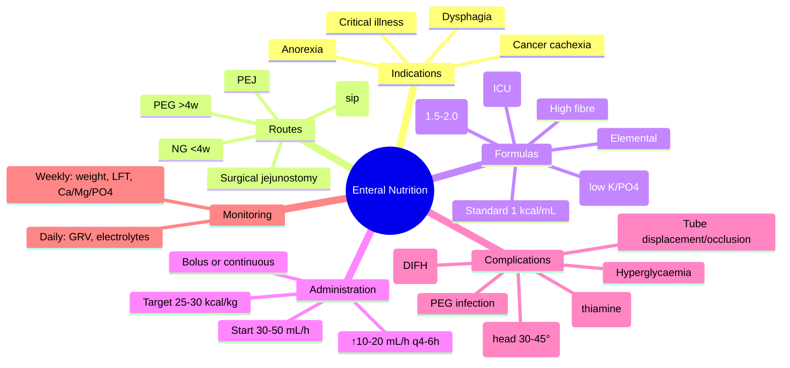

# Enteral Nutrition- Indications, Routes & Complications

**Related:** [[Nutritional Factors in Disease MOC]], [[Davidson Chapter 22 - Nutritional Factors in Disease Hierarchy]], [[../00_Index/Medicine MOC|Medicine MOC]]

> [!important]
> **Enteral = feeding into GI tract (oral sip feeds, NG, PEG, PEJ, jejunostomy); preferred over PN if GI works; "if the gut works, use it"; risk of aspiration (pulmonary), refeeding syndrome, displacement; assess every 24h; minimal handling.**

## 1. Learning Objectives
- [ ] Define enteral nutrition (EN): delivery of nutrients into GI tract via tube/oral sip feeds
- [ ] List indications: dysphagia (stroke, PD, motor neurone), severe anorexia, head/neck/oesophageal cancer, malabsorption (rare), critical illness (early EN), hypermetabolic states
- [ ] Differentiate routes: oral sip feeds (ONS), NG tube (<4 weeks), PEG/PEJ (>4 weeks), jejunostomy (post-op)
- [ ] State contraindications: complete intestinal obstruction, severe ileus, high-output fistula, severe GI ischaemia, intractable vomiting, severe malabsorption
- [ ] Identify complications: aspiration (pulmonary), refeeding syndrome, tube displacement/occlusion, diarrhoea (rapid delivery, sorbitol, lactose), constipation, metabolic (hyperglycaemia, electrolyte disturbance)
- [ ] Recognise management: head elevation 30–45°, check residuals, GRV monitoring, daily electrolytes, prokinetics

## 2. Definitions / Key Concepts

| Term | Definition |
|------|------------|
| **Enteral Nutrition (EN)** | Delivery of nutrients into GI tract via tube/oral sip feeds |
| **ONS (Oral Nutritional Supplements)** | Sip feeds, fortified drinks; 1st line for malnutrition with functioning GI |
| **NG Tube (NGT)** | Nasogastric; short-term (<4 weeks); standard for inpatients; risk of displacement, aspiration |
| **PEG (Percutaneous Endoscopic Gastrostomy)** | Endoscopic placement; long-term (>4 weeks); dysphagia, MND, head/neck cancer |
| **PEJ (Percutaneous Endoscopic Jejunostomy)** | Jejunal placement via PEG; bypasses stomach; ↑aspiration risk feeding |
| **Surgical Jejunostomy** | Open/laparoscopic jejunostomy; post-op upper GI surgery |
| **RIG (Radiologically Inserted Gastrostomy)** | Radiological placement; alternative to PEG |
| **GRV (Gastric Residual Volume)** | Aspirate via NG to assess gastric emptying; <500 mL acceptable; >500 mL consider hold |
| **Aspiration** | Gastric contents → lung; pneumonia; highest risk in ↓conscious, supine, large GRV |
| **Refeeding Syndrome** | PO4/K/Mg shift, thiamine, cardiac; high risk in malnutrition |
| **Bolus vs Continuous** | Bolus: 200-400 mL over 15-30 min q4-6h; Continuous: 24h pump (ICU, post-op) |
| **Hyperosmolar Formula** | High calorie (1.5-2.0 kcal/mL); use in fluid restriction; risk of osmotic diarrhoea |

## 3. Core Content

### Section 1: Indications & Contraindications
**Indications:**
- Dysphagia (stroke, Parkinson's, MND, MS, head/neck Ca, oesophageal Ca)
- Anorexia (cancer cachexia, depression, elderly, anorexia nervosa)
- Hypermetabolic/critical illness (trauma, burns, sepsis)
- Pre-op nutrition support (severe malnutrition)
- GI disorders: short bowel (post-feed), Crohn's (gut rest, IBD), radiation enteritis, fistulae (low output, distal)
- Pancreatitis (enteral if tolerated, jejunostomy)
- Severe neurological disability (CP, severe dementia)

**Contraindications:**
- Complete intestinal obstruction
- Severe ileus (paralytic or mechanical)
- High-output enteric fistula (>500 mL/day)
- Severe GI ischaemia
- Intractable vomiting
- Severe GI bleeding
- Perforation
- Necrotising enterocolitis (neonates)

**ESPEN Guidelines:** "If the gut works, use it"; preferred over PN in most cases.

### Section 2: Routes & Selection
| Route | Duration | Indication | Advantages | Disadvantages |
|-------|----------|-----------|------------|---------------|
| **ONS (oral sip feeds)** | All | 1st line for malnourished; functional swallowing | Non-invasive; preserves oral feeding; patient control | Compliance; taste fatigue |
| **NG tube** | <4 weeks | Short-term; peri-op; ICU; reversible cause | Bedside insertion; bolus feeding possible; easy removal | Displacement, aspiration, sinusitis, ↓comfort |
| **PEG** | >4 weeks | Long-term dysphagia (stroke, MND, head/neck Ca) | Cosmetic; stable; bolus feeding | Insertion complications (peritonitis, buried bumper); infection |
| **PEJ** | >4 weeks | Aspiration risk + long-term; failed PEG | ↓Aspiration; bypass stomach | Diarrhoea; more technical |
| **RIG** | >4 weeks | Alternative to PEG (failed/surgically difficult) | Less invasive; no endoscopy | Pneumoperitoneum; misplacement |
| **Surgical jejunostomy** | >4 weeks | Post-op upper GI (oesophagectomy, Whipple) | Direct jejunal access; ↓aspiration | Surgical complications; leakage |

**NGT Selection:**
- Fine-bore (8-10 Fr) for feeding; wide-bore (12-14 Fr) for drainage only
- Length: NEX (nares-earlobe-xiphoid) ~50-60 cm; confirm by pH <5.5 or chest X-ray (tip below GE junction, above pylorus)

**PEG Selection:**
- Pull-through (Gauderer); Push (Sacks-Vine); introducer method
- Check position at 24h before use (if unsure)
- Buried bumper syndrome (PEG too tight); peristomal infection

### Section 3: Standard Formulas
| Type | kcal/mL | Protein | Indications |
|------|---------|---------|-------------|
| **Standard polymeric** | 1.0 | 4 g/100 mL (15-20% calories) | Most patients; intact GI |
| **High protein** | 1.0-1.5 | 6-8 g/100 mL | Critical illness, wounds, pressure ulcers |
| **High energy (1.5)** | 1.5 | 6 g/100 mL | Fluid restriction, vol. intolerance |
| **High energy (2.0)** | 2.0 | 8-9 g/100 mL | Severe fluid restriction, liver failure (ascites) |
| **High fibre** | 1.0-1.5 | 4-6 g/100 mL | Constipation, glucose control |
| **Renal (low K/PO4)** | 1.5-2.0 | 4-5 g/100 mL | CKD/ESRD predialysis |
| **Pulmonary (low CHO)** | 1.5 | 5-6 g/100 mL | COPD, CO2 retainers (Resp quotient ↓) |
| **Elemental / Semi-elemental** | 1.0-1.5 | Peptides/AA | Malabsorption, IBD, short bowel, pancreatic insufficiency |
| **Immune-modulating** | 1.0-1.5 | +arginine, glutamine, ω-3, nucleotides | Critical illness, post-op (controversial) |

### Section 4: Administration
**Initiation:**
- Start at 30-50 mL/h (or 20-25 kcal/h)
- Increase by 10-20 mL/h every 4-6h to target
- Target: 25-30 kcal/kg/day (well-nourished) or 35-45 kcal/kg/day (malnourished, catch-up)
- Protein: 1.2-1.5 g/kg/day (critical illness); 2.0-2.5 g/kg/day (severe burns/trauma)
- Fluid: 30-35 mL/kg/day (additional free water if needed)

**Bolus vs Continuous:**
- **Bolus:** 200-400 mL over 15-30 min, 4-6x/day (4-5 hours apart); mimics meals; for stable patients, PEG, ambulatory
- **Continuous:** 24h pump infusion; better tolerance in critical illness, post-op, ileus, hyperglycaemia
- **Cyclic:** 8-12h overnight; daytime oral + night feed (PEG transition)

**Monitoring:**
- **Daily:** Fluid balance, electrolytes (Na, K, Cl, HCO3, urea, Cr, glucose), GRV (NG), abdominal exam
- **Weekly:** Weight, anthropometry, LFTs, Ca, Mg, PO4, trace elements (if long-term)
- **Tolerance:** GRV <500 mL, no abdominal distension, no vomiting, BMs normal

### Section 5: Complications & Management
| Complication | Cause | Management |
|--------------|-------|------------|
| **Aspiration (pulmonary)** | Tube displacement, supine, large GRV, ↓conscious | Head elevation 30-45°; check tube position; ↓infusion rate; prokinetics; consider post-pyloric feeding |
| **Refeeding syndrome** | Malnutrition + feeding (carbs) | Thiamine 200 mg IV before feed; start 10 kcal/kg/day; monitor PO4, K, Mg daily |
| **Diarrhoea** | Rapid delivery, hyperosmolar, sorbitol, lactose (rare), antibiotics, C. difficile, hypoalbuminaemia | Slow rate; fibre; loperamide; rule out C. difficile; consider peptide formula |
| **Constipation** | Inadequate fibre, dehydration, opioids, immobility | Fibre formula; hydration; laxatives |
| **Nausea/vomiting** | Rapid delivery, GRV, smell, drug-induced | Slow rate; prokinetics (metoclopramide, domperidone); antiemetics |
| **Aspiration pneumonitis** | Gastric contents → lung | Stop feed; suction; antibiotics; CXR |
| **Tube displacement** | Coughing, vomiting, conscious patient | Reinsert; confirm position (pH/X-ray) |
| **Tube occlusion** | Inadequate flushing, drug interactions | Flush before/after; use liquid meds; pancreatic enzyme for clog |
| **Hyperglycaemia** | Stress, high CHO load, DM, steroids | Insulin; ↓infusion rate; diabetic formula (lower CHO) |
| **Refeeding electrolyte disturbance** | PO4/K/Mg shift | See refeeding syndrome |
| **Overfeeding** | Excessive calories | Reduce to measured energy expenditure |
| **PEG site infection** | Skin contamination | Topical/oral antibiotics; remove if severe |
| **Buried Bumper Syndrome** | PEG too tight; internal flange embedded in gastric wall | Endoscopic removal; revision |

## 4. Clinical Correlation

| Scenario | Action | Notes |
|----------|--------|-------|
| 70F, post-stroke, dysphagia, BMI 19 | **NG tube feeding** (<4 weeks) then PEG if persistent; head elevation 30-45°; 25-30 kcal/kg | Stroke + dysphagia |
| 55M, MND, dysphagia, BMI 22, deteriorating | **PEG** (long-term; >4 weeks); dietitian; speech therapy | MND; progressive |
| 80M, dementia, dysphagia, recurrent aspiration | **PEG controversial in advanced dementia**; careful discussion with family; comfort feeding | Shared decision-making |
| 65F, post-oesophagectomy, jejunostomy | **Surgical jejunostomy**; continuous feeding; low-fat formula | Jejunal access; ↓aspiration |
| 70M, severe stroke, NG, GRV 600 mL | **Hold feed; prokinetic; consider post-pyloric (jejunal)** | Aspiration risk |
| 60M, malnourished, TPN for 10d, refeeding | **Stop TPN; thiamine 200 mg IV; start at 10 kcal/kg/day; monitor PO4** | Refeeding |
| 50M, head/neck Ca, chemoradiation, dysphagia | **Prophylactic PEG before treatment**; ONS; monitor weight | Pre-treatment planning |

## 5. High-Yield FCPS/MRCP Points

> [!important]
> - **Must know:** EN preferred over PN if GI works; indications (dysphagia, anorexia, cancer, critical illness); routes (ONS, NG <4w, PEG/PEJ >4w); complications (aspiration, refeeding, diarrhoea, hyperglycaemia); monitoring (GRV, electrolytes, head elevation 30-45°)
> - **Common viva:** Indications for EN vs PN; NG vs PEG; aspiration prevention; refeeding; GRV monitoring; PEG in dementia ethics; high protein in critical illness; fibre formula
> - **Exam trap:** Using PN when GI works; not elevating head 30-45°; ignoring refeeding; giving high calorie too fast; PEG in advanced dementia without discussion

## 6. Common Confusions / Exam Traps

| Trap | Correction |
|------|------------|
| EN for all malnourished | **ONS 1st**; EN if can't swallow/insufficient |
| PN better than EN | **EN preferred** (if GI works); cheaper, ↓infection, ↓complications |
| GRV <500 mL = OK; >500 mL = hold | **Variable; some guidelines >200-500 mL hold**; trends important |
| PEG for dementia = automatic | **Advanced dementia: PEG does NOT improve outcomes**; comfort feeding |
| EN = no risk of malnutrition | **Complications common**: aspiration, refeeding, displacement, metabolic |
| Standard formula for everyone | **High protein (critical illness), fibre (constipation), renal (low K/PO4), pulmonary (low CHO)** |
| Enteral gives all nutrition | **Need vitamins (B12, thiamine, vit K after antibiotics); trace elements (Zn, Se) in long-term** |
| Bolus = always | **Continuous in critical illness, post-op, ileus, hyperglycaemia** |

## 7. Mnemonics

- **"If the gut works, use it"** = EN > PN
- **Routes:** **ONS** (sip) → **NG** (<4w) → **PEG/PEJ** (>4w)
- **Head elevation:** **30–45°** for NG feeding
- **GRV threshold:** **<500 mL OK** (trend important)
- **Aspiration risks:** **D**isplacement, **S**upine, **L**arge GRV, **↓**conscious = **DSL**
- **Diarrhoea causes:** **D**rug (sorbitol/lactose/abx), **I**nfection (C. diff), **F**ormula (hyperosmolar, lactose), **H**ypoalbuminaemia = **DIFH**
- **Refeeding prevention:** **T**hiamine 200 mg, **M**onitor PO4/K/Mg, **S**low feed (10 kcal/kg)
- **PEG in dementia:** **No** (advanced) — comfort feeding preferred
- **Standard formula:** 1 kcal/mL, 4 g protein/100 mL
- **High protein:** 6-8 g/100 mL (ICU, wounds)
- **Continuous vs Bolus:** ICU = continuous; PEG = bolus
- **Cyclic:** Day oral + night PEG; transition
- **TPN ↔ EN:** PN only if GI doesn't work

## 8. Mind Map

## 9. -Hour Recall Prompts
1. Indications: dysphagia, anorexia, critical illness, cancer, pre-op
2. Routes: ONS, NG <4w, PEG/PEJ >4w, surgical jejunostomy
3. EN > PN if GI works ("if the gut works, use it")
4. Aspiration prevention: head elevation 30-45°, GRV <500 mL
5. Refeeding: thiamine 200 mg IV before feed, start 10 kcal/kg, monitor PO4/K/Mg
6. Diarrhoea: DIFH (Drug, Infection, Formula, Hypoalbuminaemia)
7. PEG in advanced dementia: no outcome benefit; comfort feeding
8. Standard formula 1 kcal/mL, 4 g protein/100 mL; high protein for ICU

## 10. -Day / 15-Day / 30-Day Revision Tracker

| Day | Date | Recall Quality (1-5) | Time Spent | Notes |
|-----|------|---------------------|------------|-------|
| 1   |      |                     |            |       |
| 7   |      |                     |            |       |
| 15  |      |                     |            |       |
| 30  |      |                     |            |       |

---

## 11. Must Know / Should Know / Nice to Know

| Priority | Content |
|----------|---------|
| **Must Know 🔴** | EN preferred over PN; indications (dysphagia, anorexia, critical illness, cancer); routes (ONS, NG <4w, PEG >4w); complications (aspiration, refeeding, diarrhoea); monitoring (GRV, electrolytes, head 30-45°); standard formula 1 kcal/mL |
| **Should Know 🟡** | Bolus vs continuous; formula types (high protein, fibre, renal, pulmonary); PEG in dementia; jejunostomy post-op; refeeding prevention; prokinetics |
| **Nice to Know 🟢** | RIG placement; buried bumper; immune-modulating formulas; specific elemental formulas; HEN (Home Enteral Nutrition) |

## 12. My Weak Points
- [ ] Specific formula compositions
- [ ] PEG insertion complications
- [ ] GRV threshold evidence

## 13. Self-Test Scorecard

| Domain | Score /10 | Target /10 |
|--------|-----------|------------|
| Understanding |    | 8+ |
| Recall |    | 8+ |
| MCQ Performance |    | 8+ |
| SBA Performance |    | 8+ |
| Viva Confidence |    | 8+ |
| **TOTAL** |    | **40+/50** |

## 14. Exam Answer Modes

### Long Answer / Essay (20 min)
**Topic:** "Enteral nutrition: indications, routes, and complications"
- EN = delivery into GI tract (ONS, NG, PEG, PEJ, jejunostomy); preferred over PN if GI works
- Indications: dysphagia (stroke, MND, PD, head/neck Ca), anorexia (cancer cachexia), critical illness, pre-op optimisation, GI disorders
- Routes: ONS (sip feeds) 1st line; NG tube <4 weeks; PEG/PEJ >4 weeks; surgical jejunostomy post-upper GI surgery
- Formula selection: standard 1 kcal/mL, 4 g protein/100 mL; high protein (ICU), high energy (fluid restriction), fibre (constipation), renal (CKD), pulmonary (COPD)
- Complications: aspiration (pneumonia, head elevation 30-45°, GRV monitoring, post-pyloric), refeeding (thiamine, slow start, monitor PO4/K/Mg), diarrhoea (DIFH: Drug/Infection/Formula/Hypoalbuminaemia), tube displacement/occlusion, hyperglycaemia, PEG site infection/buried bumper
- Monitoring: daily GRV, electrolytes, fluid balance; weekly weight, LFT, Ca, Mg, PO4

### Short Note (7 min)
**Topic:** "NG Tube Feeding Protocol"
- **Indication:** Short-term <4 weeks; peri-op; ICU; reversible dysphagia
- **Insertion:** NEX length 50-60 cm; confirm pH <5.5 or chest X-ray
- **Start:** 30-50 mL/h, increase 10-20 mL/h q4-6h
- **Target:** 25-30 kcal/kg/day; 1.2-1.5 g protein/kg
- **Bolus vs Continuous:** Stable = bolus 200-400 mL q4-6h; ICU = continuous 24h
- **Aspiration prevention:** Head 30-45°; GRV <500 mL
- **Complications:** Aspiration, refeeding, diarrhoea, displacement, occlusion

### Viva Answer (3 min)
**Q:** "Why is EN preferred over PN?"
"A: **'If the gut works, use it.'** EN preserves gut integrity, ↓bacterial translocation, ↓infections (line sepsis with PN), cheaper, safer, easier. **PN reserved for: GI not working** (ileus, obstruction, severe malabsorption, ischaemia, perforation, intractable vomiting, severe bleeding). Even small amounts of EN (trophic feeding 10-20 mL/h) preserve gut mucosa."

### Ward Case Discussion (5 min)
**Case:** 70F, post-stroke, dysphagia, BMI 19, MUST 3 (high risk).
"**Action: 1) NG tube insertion** (NEX, pH/X-ray confirm). 2) **Head elevation 30-45°** during feeding. 3) **Start ONS or NG feeds** at 30 mL/h, increase to 25-30 kcal/kg/day. 4) **Thiamine 200 mg IV before feeding** (refeeding prevention). 5) **Daily electrolytes** (PO4, K, Mg). 6) **If dysphagia >4 weeks** → consider PEG. 7) **Speech and language therapy** for swallow assessment. 8) **Aspiration precautions**: oral care, head elevation. 9) **Dietitian + swallow therapy**. 10) **Vitamin D, Ca, multivitamin** supplementation."

### Last-Night-Before-Exam Sheet (1 min)
- **"If the gut works, use it"** = EN > PN
- **Routes:** ONS → NG <4w → PEG/PEJ >4w → jejunostomy
- **Head elevation 30-45°** for NG feeding
- **GRV <500 mL** OK; trend important
- **Aspiration:** displacement, supine, large GRV, ↓conscious
- **Refeeding prevention:** thiamine 200 mg IV before feed; start 10 kcal/kg; PO4/K/Mg daily
- **Diarrhoea:** DIFH (Drug, Infection, Formula, Hypoalbuminaemia)
- **Standard formula:** 1 kcal/mL, 4 g protein/100 mL
- **High protein:** ICU, wounds, burns
- **PEG in advanced dementia:** No outcome benefit; comfort feeding
- **Bolus vs Continuous:** PEG = bolus; ICU = continuous
- **Daily monitoring:** GRV, electrolytes, fluid balance

## 15. MCQs (10)

1. **Preferred feeding route if GI tract is functional:**
   A. Total parenteral nutrition (TPN)  
   B. **Enteral nutrition (EN)**  
   C. Peripheral parenteral nutrition (PPN)  
   D. Hypodermoclysis  
   E. Rectal feeding  

2. **NG tube feeding is typically used for:**
   A. Lifelong nutrition  
   B. **Short-term (<4 weeks) nutrition support**  
   C. Long-term (>4 weeks) dysphagia  
   D. Severe diarrhoea  
   E. Aspiration pneumonia prevention  

3. **PEG is preferred over NG tube for:**
   A. Acute stroke  
   B. ICU patients  
   C. **Long-term feeding (>4 weeks) in stable patients**  
   D. Perioperative nutrition  
   E. Reversible dysphagia  

4. **Aspiration prevention during NG feeding:**
   A. Supine position  
   B. **Head elevation 30-45° during and 1 hour after feeding**  
   C. Bolus feeding 500 mL  
   D. NGT suction during feed  
   E. Stop feed for 4 hours daily  

5. **Gastric Residual Volume (GRV) threshold to consider holding feeding:**
   A. >100 mL  
   B. >250 mL  
   C. >500 mL  
   D. >1000 mL  
   E. GRV not used anymore  

6. **Refeeding syndrome prevention in malnourished patients starting enteral nutrition:**
   A. High protein formula  
   B. **Thiamine 200 mg IV before feeding; start at 10 kcal/kg/day; monitor PO4/K/Mg daily**  
   C. Bolus feeding 500 mL  
   D. Standard feeding from day 1  
   E. No special precautions  

7. **PEG placement in advanced dementia:**
   A. Always recommended  
   B. **No outcome benefit; comfort feeding preferred; shared decision-making**  
   C. Required for all  
   D. Mandatory for nutrition  
   E. Reduces aspiration pneumonia  

8. **Standard polymeric enteral formula composition:**
   A. 0.5 kcal/mL, 2 g protein/100 mL  
   B. **1.0 kcal/mL, 4 g protein/100 mL**  
   C. 2.0 kcal/mL, 8 g protein/100 mL  
   D. 1.5 kcal/mL, 1 g protein/100 mL  
   E. 1.0 kcal/mL, 8 g protein/100 mL  

9. **Bolus vs continuous enteral feeding in ICU:**
   A. Bolus always  
   B. **Continuous preferred (24h pump)**  
   C. Both equivalent  
   D. Bolus only if stable  
   E. Continuous only for gastroparesis  

10. **NG tube position confirmation (gold standard):**
    A. pH <7.0 (acidic)  
    B. **pH <5.5 (acidic gastric aspirate) or chest X-ray (tip below GE junction)**  
    C. Auscultation of air  
    D. Bubbling in water  
    E. Patient sensation  

## 16. SBA Questions (5)

1. **A 65-year-old man with MND, dysphagia, BMI 22, deteriorating oral intake. Most appropriate long-term nutrition support?**
   A. NG tube  
   B. **PEG (long-term >4 weeks, stable)**  
   C. TPN  
   D. ONS only  
   E. NG + bolus feeding  

2. **A 70-year-old post-stroke patient with NG feed, develops fever, productive cough, CXR shows right lower lobe consolidation. Most likely cause?**
   A. Pneumonia  
   B. **Aspiration pneumonia (NG feeding related)**  
   C. Pulmonary embolism  
   D. Fluid overload  
   E. Atelectasis  

3. **A malnourished elderly patient starts NG feeding. After 3 days, develops weakness, hypoventilation, PO4 0.2. Next step?**
   A. Increase feeding rate  
   B. **IV phosphate replacement; continue feeding at low rate; thiamine IV; cardiac monitor**  
   C. Stop feeding  
   D. Add insulin  
   E. Switch to TPN  

4. **A 60-year-old with severe acute pancreatitis, ileus, no oral intake 5 days. Most appropriate nutrition?**
   A. High calorie oral  
   B. **TPN (GI not working); consider early enteral (jejunal) if tolerated**  
   C. NG tube  
   D. PEG  
   E. ONS  

5. **A 70-year-old man on NG feeding, GRV 600 mL, abdominal distension. Next step?**
   A. Continue feeding  
   B. **Hold feed; check position; prokinetic (metoclopramide); consider post-pyloric feeding**  
   C. Increase rate  
   D. Add laxative  
   E. Switch to TPN  

## 17. Flashcards

- Q: EN vs PN  
  A: **"If gut works, use it"** = EN > PN (cheaper, ↓infection, gut integrity)
- Q: Routes  
  A: **ONS → NG <4w → PEG/PEJ >4w → jejunostomy**
- Q: Aspiration prevention  
  A: **Head 30-45°**; GRV <500 mL; prokinetics; post-pyloric
- Q: NG confirmation  
  A: **pH <5.5 (acidic)** or **chest X-ray** (tip below GE junction)
- Q: Refeeding prevention  
  A: **Thiamine 200 mg IV; start 10 kcal/kg; PO4/K/Mg daily**
- Q: Diarrhoea  
  A: **DIFH** = **D**rug, **I**nfection (C. diff), **F**ormula (hyperosmolar), **H**ypoalbuminaemia
- Q: PEG in dementia  
  A: **No outcome benefit** in advanced dementia; comfort feeding; shared decision
- Q: Standard formula  
  A: **1 kcal/mL, 4 g protein/100 mL**
- Q: High protein formula  
  A: **6-8 g protein/100 mL**; ICU, burns, wounds
- Q: Bolus vs continuous  
  A: **Bolus = PEG/ambulatory; Continuous = ICU/post-op**
- Q: GRV threshold  
  A: **<500 mL OK** (some guidelines 200-500 mL hold); trend
- Q: NEX length  
  A: **50-60 cm** (nares-earlobe-xiphoid)
- Q: Refeeding electrolyte  
  A: **PO4** first to drop (most depleted)
- Q: Aspiration risks  
  A: **D**isplacement, **S**upine, **L**arge GRV, **↓**conscious

## 18. Answer Key with Explanations

### MCQs
1. **B** — Enteral nutrition (EN) preferred over PN when GI tract is functional ("if the gut works, use it"); ↓infections, cheaper, preserves gut integrity.
2. **B** — NG tube for short-term (<4 weeks); PEG for long-term (>4 weeks).
3. **C** — PEG for long-term feeding (>4 weeks) in stable patients; MND, head/neck Ca, chronic dysphagia.
4. **B** — Aspiration prevention: head elevation 30-45° during and 1 hour after feeding; GRV monitoring.
5. **C** — GRV >500 mL (with trend and clinical correlation) consider holding feeding; some guidelines use 200-500 mL.
6. **B** — Refeeding prevention: thiamine 200 mg IV before feeding; start at 10 kcal/kg/day; monitor PO4/K/Mg daily.
7. **B** — PEG in advanced dementia: no outcome benefit; comfort feeding preferred; shared decision-making.
8. **B** — Standard polymeric formula: 1.0 kcal/mL, 4 g protein/100 mL (15-20% calories).
9. **B** — Continuous preferred in ICU (24h pump) for tolerance and glycaemic control; bolus for stable/ambulatory.
10. **B** — NG position: pH <5.5 (acidic gastric) or chest X-ray (tip below GE junction); auscultation unreliable.

### SBAs
1. **B** — MND, dysphagia, BMI 22: PEG (long-term >4 weeks, stable); dietitian; speech therapy; MND progression.
2. **B** — NG feeding + fever + productive cough + CXR consolidation: aspiration pneumonia (NG feeding related); head elevation, oral care, suction.
3. **B** — Refeeding syndrome: severe hypoPO4, weakness, hypoventilation; IV PO4 replacement; thiamine IV; continue feeding at low rate; cardiac monitor.
4. **B** — Severe acute pancreatitis + ileus + no oral intake 5 days: GI not working; TPN (with electrolyte monitoring); consider early enteral (jejunal) if tolerated.
5. **B** — NG feeding + GRV 600 mL + abdominal distension: hold feed; check NG position; prokinetic (metoclopramide); consider post-pyloric feeding (jejunostomy or PEJ).

## 19. Summary

**Enteral Nutrition** is a **Must Know 🔴** topic for FCPS/MRCP.
**Key takeaway:** "If the gut works, use it" — EN > PN. **Routes: ONS → NG <4w → PEG/PEJ >4w → jejunostomy.** Standard formula 1 kcal/mL, 4 g protein/100 mL. **Aspiration prevention: head 30-45°, GRV <500 mL.** Refeeding prevention: **thiamine 200 mg IV before feed, start 10 kcal/kg, monitor PO4/K/Mg daily.** Diarrhoea: DIFH (Drug/Infection/Formula/Hypoalbuminaemia). PEG in advanced dementia: no benefit. Bolus for PEG/ambulatory; continuous for ICU.
**Exam focus:** Routes, indications, contraindications, complications (aspiration, refeeding, diarrhoea), monitoring, PEG ethics, formulas.
**Clinical relevance:** Stroke, MND, cancer, ICU, post-op, dysphagia management.

*Template version: 1.0 | Davidson 24e Ch 22 aligned | FCPS/MRCP oriented*
