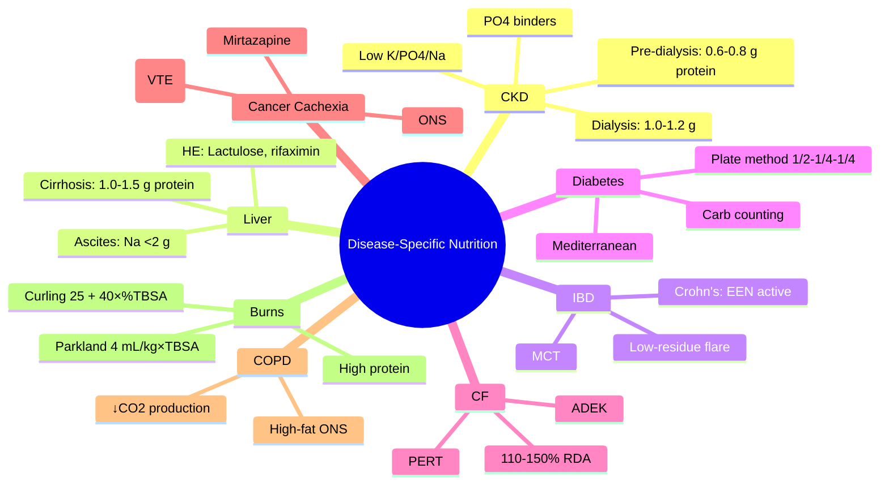

# Nutrition in Specific Conditions

**Related:** [[Nutritional Factors in Disease MOC]], [[Davidson Chapter 22 - Nutritional Factors in Disease Hierarchy]], [[../00_Index/Medicine MOC|Medicine MOC]]

> [!important]
> **Disease-specific nutrition: renal (low K/PO4/Na, controlled protein pre-dialysis, ↑protein dialysis), liver (↓Na, ↑CHO, BCAA, fluid restriction ascites), IBD (low-fibre acute, MCT), diabetes (carb counting, plate method, ↓glycaemic load), CF (high calorie, pancreatic enzymes, fat-soluble vitamins), cancer cachexia (ONS, mirtazapine), COPD (↑calories, ↓CHO if CO2 retainers), burns (hypermetabolic, ↑↑protein).**

## 1. Learning Objectives
- [ ] State renal disease nutrition: CKD pre-dialysis (0.6-0.8 g protein/kg, low K/PO4/Na), dialysis (1.0-1.2 g/kg)
- [ ] Describe liver disease nutrition: cirrhosis (↑CHO, 1.0-1.5 g protein/kg if no encephalopathy; 0.5-1.0 g acute encephalopathy, BCAA)
- [ ] Recognise IBD nutrition: Crohn's (enteral preferred, low-fibre acute, elemental/semi-elemental); UC; MCT in chylous ascites
- [ ] Identify diabetes nutrition: carb counting, plate method, ↓glycaemic load, fibre, low GI; ONS diabetic
- [ ] State CF nutrition: high calories (110-150% RDA), pancreatic enzymes (lipase/amylase/protease), fat-soluble vitamins (ADEK)
- [ ] Describe cancer cachexia: ↑calories, ONS, mirtazapine (appetite, depression), megestrol acetate, mTOR considerations
- [ ] COPD: ↑calories (hypermetabolic), ↓CHO if CO2 retainers, screen for malnutrition, ONS
- [ ] Burns: hypermetabolic (Curling formula), ↑↑protein (1.5-2 g/kg), fluid resuscitation (Parkland formula), vitamin A/C/E

## 2. Definitions / Key Concepts

| Term | Definition |
|------|------------|
| **CKD (Chronic Kidney Disease)** | Stages 1-5 by GFR; Stage 5 (dialysis); nutrition: low protein, low K/PO4/Na pre-dialysis; ↑protein dialysis |
| **BCAA (Branched-Chain Amino Acids)** | Leu, Ile, Val; supplementation in HE - debated |
| **MCT (Medium-Chain Triglycerides)** | C6-C12; portal absorption (no chylomicrons); chylous ascites, fat malabsorption |
| **Hepatic Encephalopathy (HE)** | ↓LOC, asterixis, ↑NH3; protein restriction controversial; treat precipitants |
| **Crohn's Disease** | Transmural inflammation; terminal ileum common; B12, Fe, Ca, vit D deficiencies |
| **Pancreatic Enzyme Replacement (PERT)** | Lipase 25,000-75,000 U/meal; amylase/protease; CF, chronic pancreatitis |
| **Cancer Cachexia** | Anorexia, weight loss, muscle wasting, inflammation; inflammatory (IL-6, TNF-α) |
| **Megestrol Acetate** | Appetite stimulant; orexigenic; caution thromboembolism, adrenal suppression |
| **Mirtazapine** | Antidepressant; appetite stimulant (5-HT2/3 antagonism); ↑serotonin; ↓nausea |
| **Hypermetabolic State** | ↑BMR, ↑protein catabolism; burns, trauma, sepsis, post-op |
| **Curling Formula** | Energy for burns: 25 kcal/kg + 40 kcal/% burn (TBSA) (daily) |
| **Parkland Formula** | Fluid for burns: 4 mL × kg × % TBSA (Ringer's lactate); 1/2 in first 8h, 1/2 in next 16h |
| **Hypercapnic Respiratory Failure** | CO2 retention (COPD); ↓CHO formula (lower RQ, less CO2 produced) |
| **ω-3 Fatty Acids (Fish Oil)** | Anti-inflammatory; cancer cachexia (with EPA), COPD, IBD |

## 3. Core Content

### Section 1: Renal Disease (CKD)
**Pre-dialysis (Stages 3-5 not on dialysis):**
- **Energy:** 30-35 kcal/kg/day (IBW)
- **Protein:** **0.6-0.8 g/kg/day** (low protein) — reduces GFR decline; with keto-acid analogues
- **Sodium:** <2.3 g/day (<100 mmol); fluid restriction if oedema
- **Potassium:** <2.4 g/day (<60 mmol); avoid high-K foods (banana, orange, tomato, avocado, potatoes)
- **Phosphate:** 800-1000 mg/day; phosphate binders (calcium carbonate, sevelamer)
- **Ca, Vit D:** monitor; Ca carbonate as PO4 binder; calcitriol/alfacalcidol for SHPT
- **Iron:** CKD anaemia; IV iron (HDU), ESA (epoetin, darbepoetin)
- **Avoid:** Star fruit (neurotoxin in CKD), grapefruit (CYP interaction with statins)

**Dialysis (HD/PD):**
- **Energy:** 30-35 kcal/kg/day
- **Protein:** **1.0-1.2 g/kg/day** (HD); 1.2-1.5 (PD — protein loss in dialysate)
- **Sodium:** <2.3 g/day; **fluid restriction** (1-1.5 L/day if anuric)
- **K, PO4:** Restrict; high-flux HD may allow more liberal
- **Vit D, Ca, PTH:** Calcitriol, paricalcitol; parathyroidectomy if refractory
- **Vitamins:** Water-soluble (B-complex, C); **avoid high vit A** (retention); **vitamin D per SHPT**

### Section 2: Liver Disease
**Cirrhosis (compensated):**
- **Energy:** 35-40 kcal/kg/day (IBW); high if malnourished
- **Protein:** 1.0-1.5 g/kg/day (preserves muscle; avoid over-restriction)
- **Carbohydrate:** 50-60% calories; complex CHOs preferred
- **Fat:** 25-30% calories; MCT supplementation
- **Sodium:** <2 g/day (ascites); fluid restriction if Na <125 mmol/L
- **Vitamins:** B-complex (especially thiamine), K (if cholestasis), D, E
- **Branched-Chain Amino Acids (BCAA):** May help HE; reduce muscle catabolism

**Hepatic Encephalopathy (HE):**
- Acute HE: temporary protein restriction 0.5-1.0 g/kg/day ×48h; then re-increase
- Chronic HE: 1.0-1.5 g/kg/day (NOT chronically restricted)
- Lactulose (acidify colon, ↓NH3 absorption)
- Rifaximin (antibiotic, ↓NH3-producing bacteria)
- Avoid constipation
- Treat precipitants (infection, GI bleed, hypokalaemia, sedatives)

**Cholestasis (PBC, PSC):**
- **MCT supplementation** (portal absorption, no chylomicrons)
- Fat-soluble vitamin supplementation (A, D, E, K — IM if severe cholestasis)
- Ursodeoxycholic acid (UDCA; 13-15 mg/kg/day in PBC)

### Section 3: Inflammatory Bowel Disease (IBD)
**Crohn's Disease:**
- Active flare: low-residue, low-fibre diet; high-protein; **elemental or semi-elemental formula** (enteral preferred)
- Maintenance: balanced diet; high-protein; identify triggers; B12 if terminal ileal disease
- Elemental: ~10% of acute Crohn's; **exclusive enteral nutrition (EEN) can induce remission** in adults/children
- Avoid NSAIDs, smoking, triggers

**Ulcerative Colitis:**
- Active: low-residue; avoid spicy, high-fibre, dairy (if intolerant)
- Maintenance: balanced; probiotics (VSL#3, E. coli Nissle 1917)

**Malabsorption:**
- MCT supplementation (chylous ascites, short bowel, chronic pancreatitis)
- B12 (terminal ileum, ileal resection)
- Iron, calcium, vitamin D, zinc, magnesium
- Pancreatic enzymes (CF, chronic pancreatitis, pancreatic resection)

### Section 4: Diabetes Mellitus
**Type 1 DM:**
- Insulin matching; carb counting; 1 unit per 10-15 g CHO
- Basal-bolus regimen; insulin:CHO ratio
- Continuous glucose monitoring (CGM)
- Mixed meals; fat delay absorption

**Type 2 DM:**
- Plate method: 1/2 non-starchy veg, 1/4 protein, 1/4 complex carb
- Carb counting; high fibre (25-30 g/day); low GI foods
- Mediterranean diet (best evidence for CV outcomes)
- ONS diabetic (lower CHO, higher MUFA, fibre); reduces postprandial spike
- Avoid sugary drinks; alcohol with carbs

**Diabetic Coma/DKA:** D5W added to IV fluids when glucose <14 mmol/L; continue insulin; replace K; phosphate if <0.3

### Section 5: Cystic Fibrosis (CF)
- **Energy:** 110-150% RDA (hypermetabolic; chronic inflammation; work of breathing)
- **Protein:** 1.5-2 g/kg/day
- **Fat:** 35-40% (high); pancreatic enzymes
- **Pancreatic Enzyme Replacement Therapy (PERT):** Lipase 25,000-75,000 U/meal, 10,000-25,000 U/snack; amylase, protease
- **Fat-soluble vitamins:** ADEK daily (water-miscible in pancreatic insufficiency)
- **Salt:** Extra in hot weather/sweat (CF salt loss)
- **Iron, Ca, Zn:** Monitor
- **CFTR modulators:** Improve nutrition, lung function; elexacaftor/tezacaftor/ivacaftor (Trikafta)

### Section 6: Cancer Cachexia
- **Energy:** ↑30-50% above normal; high-protein (1.5-2 g/kg)
- **ONS:** High-energy, high-protein; sip feeds 600-900 kcal/day
- **Appetite stimulants:** **Mirtazapine 15-30 mg nocte** (antidepressant + appetite); **megestrol acetate 160 mg/day** (orexigenic; thromboembolism risk)
- **Anabolic agents:** Limited; oxandrolone (caution liver)
- **ω-3 fatty acids (EPA):** 1-2 g/day; may improve lean body mass
- **Vitamins/minerals:** Standard supplementation; no high-dose
- **Symptom management:** Nausea (antiemetics), taste changes, mucositis (soft diet, cold foods), early satiety (small frequent meals)
- **Enteral/parenteral:** If GI works, EN preferred; PN if EN impossible; palliative may use home TPN

### Section 7: COPD / Respiratory Disease
- **Screening:** Malnutrition common (20-50%); exacerbation ↑requirements
- **Energy:** 30-35 kcal/kg/day (hypermetabolic; ↑work of breathing)
- **Protein:** 1.2-1.5 g/kg/day (sarcopenia, ↑catabolism)
- **CHO:** Moderate (high CHO → ↑CO2 production → worsens hypercapnia); use **fat-rich formula** (high lipid, low CHO; ↓RQ 0.7 vs 1.0)
- **ONS:** High-energy, high-protein, high-fat (PULMOCARE-type); reduce exacerbations, improve QoL
- **Rehabilitation:** Pulmonary rehab; resistance training; combined with nutrition

### Section 8: Burns
- **Energy:** Curling formula: 25 kcal/kg + 40 kcal/% burn TBSA (daily)
- Or Schofield × stress factor 1.5-2.0
- **Protein:** 1.5-2 g/kg/day (↑catabolism; muscle preservation)
- **Arginine, glutamine:** Supplementation debated; immune-modulating
- **Vitamin A, C, E:** Antioxidant support
- **Trace elements:** Zn, Cu, Se (wound healing)
- **Fluid:** Parkland formula: 4 mL × kg × % TBSA (Ringer's lactate); 1/2 first 8h, 1/2 next 16h
- **Monitoring:** Daily weight, fluid balance, electrolytes
- **Hypermetabolic phase:** Days 1-7 (ebb), then 7-21 (flow), then recovery
- **Anabolic window:** Days 7-14 (BB ↑)

### Section 9: Critical Illness / ICU
- **Early EN (within 24-48h):** Preferred if stable; trophic 10-20 mL/h initially
- **Permissive underfeeding** (Trophic): 20-30% calories × 5-7 days; full after stabilisation
- **Tight glucose control:** 6-10 mmol/L; insulin protocol
- **Protein:** 1.2-2.0 g/kg/day (↑catabolism; early high protein may worsen)
- **Avoid overfeeding:** Hyperglycaemia, hypercapnia, lipogenesis
- **Supplemental PN:** After 7-10 days if EN inadequate
- **Immunonutrition:** Arginine, glutamine, ω-3, nucleotides (controversial; mortality benefit in meta-analyses limited)

## 4. Clinical Correlation

| Scenario | Action | Notes |
|----------|--------|-------|
| 60M, CKD stage 4, eGFR 22, ↑K, ↑PO4 | **0.6-0.8 g protein/kg, low K/PO4/Na, PO4 binder, sevelamer**; avoid star fruit | Pre-dialysis |
| 55F, dialysis, dialysis protein 1.2 g/kg | **1.0-1.2 g protein/kg, low K/PO4/Na; vit D analog; EPO** | Dialysis |
| 50M, cirrhosis, ascites, no HE | **35-40 kcal/kg, 1.0-1.5 g protein/kg, Na <2 g/day, fluid restriction**; lactulose if HE | Liver disease |
| 30F, Crohn's flare, active disease | **Low-residue, high-protein, elemental EN (EEN)**; consider NG feeding; add B12 if terminal ileum | Crohn's |
| 55M, T2DM, BMI 32, post-MI | **Mediterranean diet; plate method; ONS diabetic; carb counting**; monitor postprandial | Diabetes |
| 25F, CF, BMI 18, recurrent infections | **110-150% RDA; PERT (lipase); ADEK daily; high-energy ONS; CFTR modulators** | CF |
| 65M, lung cancer, weight loss 20% | **High-energy ONS; mirtazapine 15 mg nocte; megestrol if needed; small frequent meals** | Cancer cachexia |
| 50M, COPD, BMI 19, CO2 retainer | **High-fat ONS (PULMOCARE-type); screen for malnutrition; pulmonary rehab** | COPD |
| 30F, 40% TBSA burns, day 2 | **Parkland fluid resuscitation; high-protein; Curling calories; A/C/E vitamins; Zn** | Burns |
| 65M, ICU, post-op day 1, ventilated | **Trophic EN 10-20 mL/h; permissive underfeeding; tight glucose control; head 30-45°** | ICU |

## 5. High-Yield FCPS/MRCP Points

> [!important]
> - **Must know:** CKD pre-dialysis (0.6-0.8 g protein) vs dialysis (1.0-1.2 g); liver disease (35-40 kcal/kg, 1.0-1.5 g protein, Na <2 g); IBD (EEN in Crohn's); diabetes (plate method, Mediterranean); CF (high calories, PERT, ADEK); cancer cachexia (ONS, mirtazapine, megestrol); COPD (high-fat ONS); burns (Curling + Parkland)
> - **Common viva:** CKD nutrition by stage; cirrhosis protein/HE; EEN in Crohn's; CF pancreatic enzymes; mirtazapine vs megestrol; Curling formula; Parkland formula
> - **Exam trap:** Over-restricting protein in cirrhosis chronic; giving PPN/TPN when GI works; missing K/PO4 in CKD; megesterol thromboembolism; mirtazapine sedation

## 6. Common Confusions / Exam Traps

| Trap | Correction |
|------|------------|
| All CKD restrict protein | **Pre-dialysis 0.6-0.8 g; DIALYSIS 1.0-1.2 g** (higher!) |
| HE = chronic protein restriction | **Acute HE: temp restrict; Chronic HE: 1.0-1.5 g/kg** (NOT chronic restriction) |
| Cirrhosis = low protein | **1.0-1.5 g/kg if no HE; preserves muscle; BCAA controversial** |
| EEN in all IBD | **EEN effective in Crohn's** (especially children); less in UC |
| Diabetes = sugar restriction only | **Carb control + fibre + Mediterranean + plate method** |
| CF = just pancreatic enzymes | **High calories 110-150% RDA; ADEK; salt in heat; CFTR modulators** |
| Megestrol safe | **Thromboembolism risk**; adrenal suppression; oedema |
| Burns fluid 4 mL/kg × TBSA = total | **Parkland: 4 mL × kg × TBSA = total; 1/2 first 8h, 1/2 next 16h** |
| COPD need high CHO | **High fat ONS** (PULMOCARE); ↓CO2 production |
| BCAA always in HE | **Debated**; may help; not first-line |

## 7. Mnemonics

- **CKD pre-dialysis:** **0.6-0.8 protein, low K/PO4/Na; PO4 binders, vit D analogs**
- **CKD dialysis:** **1.0-1.2 protein** (higher), fluid restriction
- **Cirrhosis:** **35-40 kcal/kg; 1.0-1.5 g protein if no HE; Na <2 g ascites; MCT**
- **HE acute:** Lactulose, rifaximin, **temp protein 0.5-1.0 g/kg**; chronic = 1.0-1.5
- **Crohn's active:** Low-residue, high-protein, **EEN (elemental/semi-elemental)**
- **CF:** **110-150% RDA; PERT 25-75k U lipase/meal; ADEK**
- **Cancer cachexia:** **ONS + mirtazapine + megestrol** (caution VTE)
- **COPD:** **High-fat ONS (low CHO)**; ↓CO2 production
- **Burns:** **Parkland 4 mL/kg × TBSA** (1/2 first 8h); **Curling 25 + 40 × %TBSA**
- **Diabetes:** **Plate method 1/2-1/4-1/4**; Mediterranean; carb counting
- **Star fruit in CKD = neurotoxic**; **BCAA in HE = debated**

## 8. Mind Map

## 9. -Hour Recall Prompts
1. CKD pre-dialysis: 0.6-0.8 g protein; dialysis 1.0-1.2 g
2. Cirrhosis: 35-40 kcal/kg, 1.0-1.5 g protein, Na <2 g ascites
3. HE: Lactulose, rifaximin, BCAA debated
4. Crohn's active: EEN, low-residue, high-protein
5. CF: 110-150% RDA, PERT 25-75k U lipase, ADEK
6. Cancer cachexia: ONS, mirtazapine, megestrol (VTE risk)
7. COPD: High-fat ONS, ↓CO2 production
8. Burns: Parkland 4 mL/kg×TBSA, Curling 25 + 40×%TBSA

## 10. -Day / 15-Day / 30-Day Revision Tracker

| Day | Date | Recall Quality (1-5) | Time Spent | Notes |
|-----|------|---------------------|------------|-------|
| 1   |      |                     |            |       |
| 7   |      |                     |            |       |
| 15  |      |                     |            |       |
| 30  |      |                     |            |       |

---

## 11. Must Know / Should Know / Nice to Know

| Priority | Content |
|----------|---------|
| **Must Know 🔴** | CKD by stage (pre-dialysis vs dialysis protein); cirrhosis (1.0-1.5 g, Na <2 g); HE (lactulose, rifaximin, BCAA debated); Crohn's (EEN); CF (110-150% RDA, PERT, ADEK); cancer cachexia (ONS, mirtazapine, megestrol); COPD (high-fat ONS); burns (Curling + Parkland) |
| **Should Know 🟡** | Diabetic plate method, Mediterranean; MCT in cholestasis; star fruit neurotoxic; PERT dosing; mirtazapine vs megestrol mechanism; immunonutrition in critical illness; pulmonary formula composition |
| **Nice to Know 🟢** | CFTR modulators; cachexia cytokine profile; eicosapentaenoic acid (EPA) trials; gut microbiome in IBD; specific commercial formulas (PULMOCARE, Peptamen) |

## 12. My Weak Points
- [ ] PERT dose calculation
- [ ] Curling formula variants
- [ ] Megestrol mechanism of action

## 13. Self-Test Scorecard

| Domain | Score /10 | Target /10 |
|--------|-----------|------------|
| Understanding |    | 8+ |
| Recall |    | 8+ |
| MCQ Performance |    | 8+ |
| SBA Performance |    | 8+ |
| Viva Confidence |    | 8+ |
| **TOTAL** |    | **40+/50** |

## 14. Exam Answer Modes

### Long Answer / Essay (20 min)
**Topic:** "Disease-specific nutrition: renal, liver, COPD, burns, cancer"
- **CKD:** Pre-dialysis 0.6-0.8 g protein/kg, low K/PO4/Na; dialysis 1.0-1.2 g (higher); PO4 binders, vit D analogs
- **Liver:** Cirrhosis 1.0-1.5 g protein/kg (NOT chronic restriction); Na <2 g ascites; HE: lactulose + rifaximin; BCAA debated
- **COPD:** High-fat ONS (low CHO, ↓RQ, ↓CO2 production); screening for malnutrition; pulmonary rehab
- **Burns:** Parkland fluid 4 mL/kg × TBSA (1/2 first 8h); Curling calories 25 + 40×%TBSA; high protein 1.5-2 g/kg; A/C/E vitamins
- **Cancer cachexia:** ONS 600-900 kcal; mirtazapine 15-30 mg nocte; megestrol 160 mg (VTE risk); ω-3 EPA
- **CF:** 110-150% RDA; PERT 25-75k U lipase/meal; ADEK

### Short Note (7 min)
**Topic:** "Burns Nutrition and Fluid Resuscitation"
- **Parkland formula (fluid):** 4 mL × body weight (kg) × %TBSA burn (Ringer's lactate); 1/2 in first 8h, 1/2 in next 16h from burn time
- **Curling formula (calories):** Daily = 25 kcal/kg + 40 kcal/%TBSA burn
- **Protein:** 1.5-2 g/kg/day (hypermetabolic, muscle preservation)
- **Vitamins:** A, C, E (antioxidant, wound healing)
- **Trace elements:** Zn, Cu, Se
- **Hypermetabolic phase:** Days 1-7 (ebb), 7-21 (flow), then recovery
- **Arginine, glutamine:** Controversial; immune-modulating

### Viva Answer (3 min)
**Q:** "Why is protein restriction different in pre-dialysis vs dialysis CKD?"
"A: **Pre-dialysis CKD (Stages 3-5, not on dialysis):** Protein restriction 0.6-0.8 g/kg/day; reduces nitrogenous waste accumulation, slows GFR decline, ↓uraemia. **Dialysis (HD/PD):** ↑Protein to 1.0-1.2 g/kg/day (HD) or 1.2-1.5 g/kg (PD) because **dialysis removes protein** (especially PD) and dialysis patients are often catabolic/inflammatory. Restriction on dialysis would cause muscle wasting and malnutrition. **Always individualise based on stage, nutritional status, and dialysis modality.**"

### Ward Case Discussion (5 min)
**Case:** 55F, cirrhosis, ascites, BMI 22, no HE.
"Diagnosis: Decompensated cirrhosis. **Action: 1) Energy 35-40 kcal/kg/day** (IBW); 2) **Protein 1.0-1.5 g/kg/day** (NOT chronic restriction); 3) **Sodium <2 g/day** (ascites); 4) **Fluid restriction** if Na <125; 5) **Lactulose** if HE; 6) **MCT supplementation** (cholestasis); 7) **Vitamins A, D, E, K** (fat-soluble); 8) **BCAA** controversial; 9) **Avoid alcohol**; 10) **Monitor for SBP** (paracentesis, prophylactic norfloxacin, albumin); 11) **Screen for HCC** (US + AFP q6m if cirrhotic)."

### Last-Night-Before-Exam Sheet (1 min
- **CKD pre-dialysis:** 0.6-0.8 g protein; **Dialysis: 1.0-1.2 g** (higher)
- **CKD:** low K/PO4/Na; PO4 binders; vit D analogs; EPO
- **Cirrhosis:** 35-40 kcal/kg, 1.0-1.5 g protein (NOT chronic restriction), Na <2 g ascites
- **HE:** Lactulose, rifaximin, BCAA debated
- **Crohn's:** EEN active, low-residue, high-protein
- **CF:** 110-150% RDA, PERT 25-75k U lipase/meal, ADEK
- **Cancer cachexia:** ONS, mirtazapine 15-30 mg nocte, megestrol 160 mg (VTE)
- **COPD:** High-fat ONS (↓CO2), screening
- **Burns:** Parkland 4 mL/kg×TBSA (1/2 first 8h); Curling 25+40×%TBSA
- **Diabetes:** Plate method 1/2-1/4-1/4; Mediterranean

## 15. MCQs (10)

1. **Protein requirement in CKD pre-dialysis (Stages 3-5):**
   A. 0.5 g/kg/day  
   B. **0.6-0.8 g/kg/day**  
   C. 1.0-1.2 g/kg/day  
   D. 1.5 g/kg/day  
   E. 2.0 g/kg/day  

2. **Protein requirement in dialysis (HD):**
   A. 0.5 g/kg/day  
   B. 0.8 g/kg/day  
   C. **1.0-1.2 g/kg/day**  
   D. 1.5 g/kg/day  
   E. 2.0 g/kg/day  

3. **Cirrhosis (compensated, no HE) protein requirement:**
   A. 0.5 g/kg/day  
   B. 0.8 g/kg/day  
   C. **1.0-1.5 g/kg/day**  
   D. 2.0 g/kg/day  
   E. 3.0 g/kg/day  

4. **Hepatic encephalopathy acute management includes:**
   A. Chronic protein restriction 0.5 g/kg  
   B. **Lactulose, rifaximin; temporary protein restriction then re-increase**  
   C. High protein  
   D. TPN  
   E. BCAA only  

5. **Cystic Fibrosis nutritional management:**
   A. Standard calories, low fat  
   B. **High calories 110-150% RDA, pancreatic enzymes, fat-soluble vitamins (ADEK)**  
   C. Low fat, MCT only  
   D. TPN from infancy  
   E. Low protein  

6. **Cancer cachexia treatment:**
   A. Low protein  
   B. Standard calories  
   C. **ONS, mirtazapine 15-30 mg nocte, megestrol 160 mg (VTE risk)**  
   D. TPN  
   E. Steroids  

7. **COPD high-fat ONS rationale:**
   A. High energy  
   B. **Lower respiratory quotient (RQ 0.7 vs 1.0 for CHO) → less CO2 production → better for CO2 retainers**  
   C. Better taste  
   D. Easier absorption  
   E. Vitamin content  

8. **Burns Parkland formula:**
   A. 2 mL × kg × %TBSA  
   B. **4 mL × kg × %TBSA (Ringer's lactate; 1/2 first 8h, 1/2 next 16h)**  
   C. 6 mL × kg × %TBSA  
   D. 8 mL × kg × %TBSA  
   E. 10 mL × kg × %TBSA  

9. **Curling formula (burns calories):**
   A. 15 kcal/kg + 20 kcal/%TBSA  
   B. 20 kcal/kg + 30 kcal/%TBSA  
   C. **25 kcal/kg + 40 kcal/%TBSA**  
   D. 35 kcal/kg + 50 kcal/%TBSA  
   E. 50 kcal/kg + 100 kcal/%TBSA  

10. **Elemental enteral nutrition (EEN) effective in:**
    A. Ulcerative colitis  
    B. **Crohn's disease (acute, especially children; can induce remission)**  
    C. IBS  
    D. Coeliac disease  
    E. Colorectal cancer  

## 16. SBA Questions (5)

1. **A 60-year-old man with CKD stage 4 (eGFR 22) has K 5.5, PO4 2.0. Best dietary advice?**
   A. High protein  
   B. **Low protein (0.6-0.8 g/kg), low K, low PO4, PO4 binder (sevelamer)**  
   C. High calorie  
   D. High fibre  
   E. No restriction  

2. **A 55-year-old man with cirrhosis, ascites, BMI 22, no HE. Best nutrition?**
   A. Protein restriction 0.5 g/kg, low fat, free fluids  
   B. **35-40 kcal/kg, 1.0-1.5 g protein/kg, Na <2 g/day, fluid restriction**  
   C. TPN  
   D. Standard diet  
   E. Low calorie  

3. **A 25-year-old with CF, BMI 18, recurrent infections. Best management?**
   A. Standard diet  
   B. **High calories 110-150% RDA, PERT 25,000-75,000 U lipase/meal, ADEK vitamins, CFTR modulators**  
   C. Low fat  
   D. TPN  
   E. Vegetarian  

4. **A 70-year-old man with lung cancer, weight loss 20%, BMI 19, depression. Best management?**
   A. Steroids only  
   B. **ONS high-energy + mirtazapine 15 mg nocte (appetite, depression) ± megestrol**  
   C. TPN only  
   D. Low fat diet  
   E. NG tube  

5. **A 30-year-old with 40% TBSA burns, day 2. Best fluid management?**
   A. NS 100 mL/h  
   B. **Parkland: 4 mL × kg × 40% TBSA (Ringer's lactate); 1/2 first 8h, 1/2 next 16h**  
   C. D5W  
   D. Dextrose-saline  
   E. Colloid  

## 17. Flashcards

- Q: CKD pre-dialysis protein  
  A: **0.6-0.8 g/kg/day** (low protein)
- Q: CKD dialysis protein  
  A: **1.0-1.2 g/kg/day** (HD) / 1.2-1.5 (PD)
- Q: Cirrhosis protein  
  A: **1.0-1.5 g/kg/day** (NOT chronic restriction)
- Q: HE Rx  
  A: **L**actulose, **R**ifaximin; temp protein restriction in acute
- Q: Crohn's active  
  A: **EEN** (elemental/semi-elemental); low-residue
- Q: CF PERT  
  A: **25,000-75,000 U lipase/meal, 10,000-25,000 U/snack; ADEK**
- Q: Cancer cachexia  
  A: **ONS + mirtazapine 15-30 mg nocte + megestrol 160 mg (VTE risk)**
- Q: COPD ONS  
  A: **High-fat, low CHO** (↓RQ, ↓CO2 production)
- Q: Burns Parkland  
  A: **4 mL × kg × %TBSA** (Ringer's lactate; 1/2 first 8h, 1/2 next 16h)
- Q: Burns Curling  
  A: **25 kcal/kg + 40 kcal/%TBSA** (daily)
- Q: BCAA in HE  
  A: **Debated**; may help; not first-line
- Q: Megestrol adverse  
  A: **VTE** (thromboembolism), adrenal suppression, oedema, ↓libido
- Q: Mirtazapine benefit  
  A: **Antidepressant + appetite stimulant + ↓nausea** (5-HT2/3 antagonism); sedation; weight gain

## 18. Answer Key with Explanations

### MCQs
1. **B** — CKD pre-dialysis (Stages 3-5, not on dialysis): protein restriction 0.6-0.8 g/kg/day; reduces nitrogenous waste, slows GFR decline.
2. **C** — Dialysis: ↑protein 1.0-1.2 g/kg/day (HD) or 1.2-1.5 (PD) because dialysis removes protein; restriction would cause malnutrition.
3. **C** — Cirrhosis (compensated, no HE): 1.0-1.5 g protein/kg; preserves muscle; not chronically restricted.
4. **B** — HE acute: lactulose (acidify colon, ↓NH3 absorption), rifaximin (antibiotic, ↓NH3-producing bacteria); temporary protein restriction 0.5-1.0 g/kg ×48h, then re-increase.
5. **B** — CF: high calories 110-150% RDA (hypermetabolic), PERT (lipase 25-75k U/meal), ADEK vitamins (water-miscible).
6. **C** — Cancer cachexia: ONS high-energy, mirtazapine 15-30 mg nocte (antidepressant + appetite), megestrol acetate 160 mg (orexigenic, VTE risk).
7. **B** — COPD high-fat ONS: lower RQ (0.7 for fat vs 1.0 for CHO) → less CO2 production; beneficial for CO2 retainers (hypercapnic respiratory failure).
8. **B** — Parkland formula: 4 mL × kg × %TBSA (Ringer's lactate); 1/2 in first 8h from burn time, 1/2 in next 16h.
9. **C** — Curling formula: 25 kcal/kg + 40 kcal/%TBSA (daily energy needs for burns).
10. **B** — EEN effective in Crohn's disease (especially children); can induce remission; less evidence in UC.

### SBAs
1. **B** — CKD stage 4 with hyperkalaemia and hyperphosphataemia: low protein (0.6-0.8 g/kg), low K, low PO4, PO4 binder (sevelamer).
2. **B** — Cirrhosis with ascites, no HE: 35-40 kcal/kg, 1.0-1.5 g protein/kg, Na <2 g/day, fluid restriction; NOT chronic protein restriction.
3. **B** — CF with malnutrition: high calories 110-150% RDA, PERT 25-75k U lipase/meal, ADEK vitamins, CFTR modulators (Trikafta).
4. **B** — Cancer cachexia with depression: ONS high-energy + mirtazapine 15 mg nocte (antidepressant + appetite stimulant) ± megestrol acetate.
5. **B** — 40% TBSA burns, day 2: Parkland formula 4 mL × kg × 40% TBSA (Ringer's lactate); 1/2 in first 8h, 1/2 in next 16h from burn time.

## 19. Summary

**Nutrition in Specific Conditions** is a **Must Know 🔴** topic for FCPS/MRCP.
**Key takeaway:** **CKD: pre-dialysis 0.6-0.8 g protein; dialysis 1.0-1.2 g; low K/PO4/Na.** **Cirrhosis: 35-40 kcal/kg, 1.0-1.5 g protein (NOT chronic restriction), Na <2 g ascites, lactulose/rifaximin for HE, BCAA debated.** **Crohn's: EEN active, low-residue.** **CF: 110-150% RDA, PERT 25-75k U lipase/meal, ADEK.** **Cancer cachexia: ONS, mirtazapine 15-30 mg nocte, megestrol 160 mg (VTE risk).** **COPD: high-fat ONS (↓RQ, ↓CO2).** **Burns: Parkland 4 mL/kg×TBSA, Curling 25+40×%TBSA, high protein 1.5-2 g/kg.** **Diabetes: plate method, Mediterranean diet.**
**Exam focus:** CKD by stage, cirrhosis protein, HE management, EEN Crohn's, CF PERT, cancer cachexia, COPD ONS, burns formulas.
**Clinical relevance:** Every chronic disease management; pre-op optimisation; ICU nutrition; community programmes.

*Template version: 1.0 | Davidson 24e Ch 22 aligned | FCPS/MRCP oriented*
