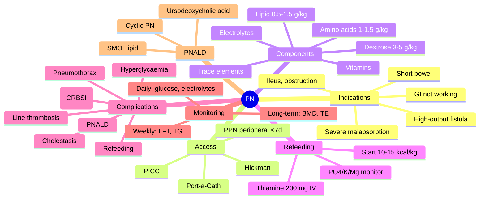

# Parenteral Nutrition- Indications, Access & Complications

**Related:** [[Nutritional Factors in Disease MOC]], [[Davidson Chapter 22 - Nutritional Factors in Disease Hierarchy]], [[../00_Index/Medicine MOC|Medicine MOC]]

> [!important]
> **PN = IV nutrition when GI not working (ileus, obstruction, perforation, severe malabsorption); peripheral (PPN) <7 days short-term, central (TPN) >7 days long-term; refeeding syndrome risk; complications: line sepsis, metabolic (hyperglycaemia, electrolytes), liver disease, refeeding; daily monitoring.**

## 1. Learning Objectives
- [ ] Define parenteral nutrition (PN): IV delivery of nutrients bypassing GI tract; TPN (central) vs PPN (peripheral)
- [ ] List indications: GI not working (ileus, obstruction, perforation, severe malabsorption, ischaemia, intractable vomiting, high-output fistula, short bowel)
- [ ] Differentiate TPN vs PPN: central (hyperosmolar >800 mOsm/L) vs peripheral (≤800 mOsm/L); PPN <7 days, TPN long-term
- [ ] State access: PICC, Hickman, Port-a-Cath (long-term), subclavian/jugular (acute)
- [ ] Identify complications: line sepsis, refeeding syndrome, hyperglycaemia, electrolytes, liver disease (PNALD), cholestasis, line thrombosis, pneumothorax
- [ ] Recognise monitoring: daily electrolytes, glucose, fluid balance, weekly LFT, TG, trace elements; line care
- [ ] State PN components: amino acids, dextrose (carbohydrate), lipid emulsion (Intralipid/SMOFlipid), electrolytes, trace elements, vitamins

## 2. Definitions / Key Concepts

| Term | Definition |
|------|------------|
| **Parenteral Nutrition (PN)** | IV delivery of nutrients bypassing GI; TPN (central) or PPN (peripheral) |
| **TPN (Total Parenteral Nutrition)** | Central line; hyperosmolar (>800 mOsm/L); long-term >7 days; complete nutrition |
| **PPN (Peripheral Parenteral Nutrition)** | Peripheral vein; ≤800 mOsm/L; short-term <7 days; limited calories |
| **PICC (Peripherally Inserted Central Catheter)** | Long-term; upper arm; tip in SVC; common for TPN |
| **Hickman/Broviac** | Tunneled central line; long-term (months) |
| **Port-a-Cath** | Totally implantable; long-term (months-years) |
| **Tunneled line** | Subcutaneous tunnel; ↓infection vs non-tunneled |
| **Refeeding Syndrome** | Malnutrition + feeding → insulin → PO4/K/Mg shift; cardiac/respiratory |
| **PNALD (PN-Associated Liver Disease)** | Steatosis, cholestasis, fibrosis; long-term PN; ↑risk with lipid, sepsis |
| **Intestinal Failure-Associated Liver Disease (IFALD)** | Pediatric term; cholestasis in short bowel |
| **Catheter-Related Bloodstream Infection (CRBSI)** | Line sepsis; fever + same organism from peripheral + line; S. aureus, S. epidermidis, Candida, Gram-negatives |
| **Hyperglycaemia** | Common; stress + dextrose; target 6-10 mmol/L |
| **Hypophosphataemia** | Refeeding, glucose, insulin; cardiac, respiratory |
| **Refeeding Mnemonic** | PO4, K, Mg, Ca, Na; thiamine, multivitamin |
| **Three-in-One (TNA) Admixture** | Amino acids + dextrose + lipid in one bag; vs two-in-one (no lipid) |
| **Lipid Emulsion** | Soya (Intralipid 20%, 10%), SMOFlipid (SMO), olive oil, fish oil; 1-2 g/kg/day |

## 3. Core Content

### Section 1: Indications & Contraindications
**Indications (GI not working):**
- Short bowel syndrome (post-massive resection; >2-3 m)
- High-output enteric fistula (>500 mL/day)
- Severe ileus (post-op, Ogilvie, opiates)
- Complete intestinal obstruction
- Severe GI ischaemia / necrotising enterocolitis
- Intestinal perforation
- Intractable vomiting
- Severe malabsorption (radiation enteritis, severe Crohn's)
- High-output enterocutaneous fistula
- Acute severe pancreatitis (if enteral not tolerated)
- **Peri-op:** Severe malnutrition + unable to feed enterally for >7 days

**Contraindications:**
- Functional/working GI tract
- Curable underlying cause
- Patient/family refusal
- End-of-life (palliative)
- Severe haemodynamic instability (initial phase)
- Severe coagulopathy (insertion risk; consider correction)

**ESPEN:** "If GI works, use it"; PN only if EN impossible for >5-7 days; "5-day rule."

### Section 2: Access
| Access | Site | Duration | Use |
|--------|------|----------|-----|
| **PPN (peripheral)** | Hand/arm veins | <7 days | Short-term, low osmolar |
| **PICC** | Upper arm; tip SVC | Weeks-months | TPN, antibiotics, chemo |
| **Hickman/Broviac** | Tunneled central; exit chest | Months | Long-term TPN, oncology |
| **Port-a-Cath** | Subcutaneous; chest | Months-years | Long-term, intermittent |
| **Subclavian CVC** | Subclavian vein; tip SVC | Days-weeks | Acute ICU, short-term |
| **Internal Jugular CVC** | IJV; tip SVC | Days-weeks | Acute ICU |
| **Femoral CVC** | Femoral vein; tip IVC | Days | Last resort (infection risk) |

**Insertion (CVC):** Strict aseptic technique; ultrasound guidance; confirm position (chest X-ray, tip at SVC-RA junction); document.

### Section 3: PN Composition
**Standard PN Bag (1 L all-in-one TNA):**
| Component | Amount | Notes |
|-----------|--------|-------|
| **Amino acids** | 1.0-1.5 g/kg/day | Crystalline AA; essential + non-essential; specific formulations (renal, hepatic) |
| **Dextrose (50%)** | 3-5 g/kg/day | Provides ~50-60% non-protein calories; monitor hyperglycaemia |
| **Lipid emulsion (20%)** | 0.5-1.5 g/kg/day | 20-30% non-protein calories; SMOFlipid preferred (less IFALD); max 0.15 g/kg/h |
| **Total calories** | 25-30 kcal/kg/day | 1.0 g protein = 4 kcal; 1.0 g dextrose = 3.4 kcal; 1.0 g lipid = 9 kcal |
| **Electrolytes** | Na 80-150 mmol/day, K 60-100, Mg 8-12, Ca 5-10, PO4 15-30 | Daily adjustment |
| **Trace elements** | Additrace; Zn, Cu, Se, Mn | Essential; Cu ↑ in cholestasis |
| **Vitamins** | Vitlipid + Soluvit; A, D, E, K, B-complex, C | Daily; vit K missing in some formulations |

**Calorie Calculation:**
- Non-protein calories: dextrose (3.4 kcal/g) + lipid (9 kcal/g)
- Total calories: non-protein + protein (4 kcal/g)
- Dextrose:Lipid ratio: 60-70:30-40
- Calorie:Nitrogen ratio: 130-150 kcal/g N (1 g protein = 0.16 g N)

**Refeeding Protocol:**
- Start at 10-15 kcal/kg/day (low)
- Thiamine 200 mg IV before start
- Supplement PO4, K, Mg
- Daily electrolytes
- Increase over 4-7 days

### Section 4: Complications & Management
| Complication | Cause | Management |
|--------------|-------|------------|
| **Refeeding syndrome** | Malnutrition + feeding (insulin shift PO4/K/Mg) | Thiamine 200 mg IV; start 10-15 kcal/kg; supplement PO4/K/Mg; daily labs; cardiac monitor |
| **Hyperglycaemia** | Stress + dextrose; most common | Insulin sliding scale; target 6-10 mmol/L; ↓dextrose; consider lipid ↑% |
| **Refeeding electrolyte** | PO4/K/Mg shift | IV replacement; monitor daily |
| **Line sepsis (CRBSI)** | Catheter colonisation; S. aureus, CoNS, Candida, Gram-neg | Aseptic insertion; line care; consider line change; antibiotics |
| **PNALD (Liver disease)** | Steatosis, cholestasis, fibrosis | SMOFlipid (less phytosterols); cyclic PN; avoid overfeeding; ursodeoxycholic acid (cholestasis); reduce lipid if severe |
| **Cholestasis (long-term)** | ↓Enteral stimulation, ↑biliary sludge | Enteral stimulation; ursodeoxycholic acid |
| **Line thrombosis** | Fibrin sheath, clot | Anticoagulation (heparin, warfarin); line removal if needed |
| **Pneumothorax** | Subclavian insertion | Chest X-ray post-insertion; chest drain if symptomatic |
| **Air embolism** | Insertion, line disconnection | Trendelenburg, occlusion, aspiration |
| **Wernicke's** | Thiamine deficiency | Thiamine 200 mg IV before feeding |
| **Trace element deficiency** | Long-term PN without TE | Add Additrace; Zn essential |
| **Carnitine deficiency** | Long-term PN without carnitine | Carnitine supplementation |
| **Metabolic bone disease** | Aluminium, vit D deficiency | Monitor vit D, Ca, PTH; bone density |

**Hyperglycaemia Target:** 6-10 mmol/L (permissive in critical care; BG 4-10 mmol/L); insulin sliding scale; consider insulin infusion.

### Section 5: Monitoring
**Daily:**
- Fluid balance, weight (after initial fluid shifts)
- Blood glucose (q4-6h, then daily)
- U&Es (Na, K, Cl, HCO3, urea, Cr)
- Ca, Mg, PO4
- LFTs
- Capillary glucose monitoring
- Line site examination
- Tolerance (nausea, distension)

**Weekly:**
- Full LFTs, ALP, GGT
- Triglycerides (lipid tolerance)
- Trace elements, vitamins (long-term)
- Pre-albumin (nutritional response)
- Line infection markers (WBC, CRP)

**Long-term:**
- Bone density (BMD)
- Liver ultrasound (PNALD)
- Trace elements (Zn, Se, Cu)

### Section 6: Peripheral vs Central PN
| Feature | PPN | TPN (Central) |
|---------|-----|---------------|
| **Osmolality** | ≤800 mOsm/L | >800 mOsm/L |
| **Access** | Peripheral vein | Central vein (PICC, Hickman) |
| **Duration** | <7 days | >7 days |
| **Calories** | Limited (600-1500 kcal/day) | Full (25-30 kcal/kg) |
| **Dextrose** | 5-10% final | 20-30% final |
| **Amino acids** | 2-3% | 5-10% |
| **Lipid** | Required (calories) | Optional (often 3-in-1) |
| **Complications** | Thrombophlebitis (osmolarity) | Line sepsis, pneumothorax |
| **Indications** | Short-term, can't central | Long-term |

## 4. Clinical Correlation

| Scenario | Action | Notes |
|----------|--------|-------|
| 65M, post-bowel surgery, ileus, no oral 7 days | **TPN via PICC; start 10-15 kcal/kg; refeeding prophylaxis**; daily electrolytes | Most common inpatient |
| 50F, short bowel (post-massive resection) | **Long-term home TPN (HPN); SMOFlipid; cyclical infusion; trace elements, vitamins** | Home PN programme |
| 70F, severe acute pancreatitis, no oral 10d, ileus | **TPN via central**; consider early jejunal EN if tolerated; monitor TG | Pancreatitis |
| 60F, Crohn's flare, severe malnutrition, no PO tolerance | **TPN pre-op optimisation ×2-3 weeks**; correct electrolytes; thiamine | Pre-op nutrition |
| 75M, line sepsis (fever, rigors, line tip culture + same organism) | **Remove line; blood cultures; empirical vancomycin ± antipseudomonal; switch to alternative access after clearance** | CRBSI |
| 80M, long-term TPN (1y), cholestasis, fibrosis | **SMOFlipid; cyclic PN (12h); ursodeoxycholic acid; minimise lipid; intestinal transplant assessment** | PNALD/IFALD |
| 50F, malnutrition, starting TPN, hypophosphataemia day 3 | **IV PO4; ↓TPN rate; thiamine 200 mg IV; cardiac monitor** | Refeeding |

## 5. High-Yield FCPS/MRCP Points

> [!important]
> - **Must know:** PN if GI not working; TPN central long-term, PPN peripheral short-term; PN components (AA, dextrose, lipid, electrolytes, vitamins, trace elements); refeeding (thiamine, 10-15 kcal/kg, monitor PO4/K/Mg); complications (line sepsis, hyperglycaemia, PNALD, refeeding)
> - **Common viva:** Indications for PN (GI not working); TPN vs PPN; refeeding prevention; CRBSI management; PNALD prevention (SMOFlipid, cyclic); home PN; PN composition
> - **Exam trap:** Giving PN when GI works; missing refeeding; hyperglycaemia management; line sepsis without line change

## 6. Common Confusions / Exam Traps

| Trap | Correction |
|------|------------|
| PN for all malnourished | **PN if GI not working; EN preferred** ("if the gut works, use it") |
| PPN for long-term | **PPN <7 days; TPN (central) for >7 days** |
| Start PN at full rate | **Start 10-15 kcal/kg; thiamine 200 mg; monitor PO4/K/Mg** (refeeding) |
| No lipid needed | **20-30% non-protein calories from lipid**; SMOFlipid preferred (↓IFALD) |
| Hyperglycaemia: stop feed | **Insulin sliding scale; target 6-10 mmol/L;** consider ↓dextrose; ↑lipid % |
| Line sepsis: antibiotics only | **CRBSI: remove line (S. aureus, Candida, Gram-neg);** alternative access; antibiotics |
| Trace elements optional | **Additrace daily in long-term PN**; Cu ↑ in cholestasis |
| All PN patients need lipids | **Avoid lipid in severe hyperTG, egg allergy (rare), severe liver failure** |

## 7. Mnemonics

- **"If gut works, use it"** = EN > PN
- **TPN central; PPN peripheral** (<7d, ≤800 mOsm/L)
- **Indications:** **G**I not working (**I**leus, **O**bstruction, **P**erforation, **I**sch, **F**istula, **V**omit, **M**alabs, **S**hort bowel) = **GIOPIF VMS**
- **PN components:** **ADL ETV** = **A**mino acids, **D**extrose, **L**ipid, **E**lectrolytes, **T**race elements, **V**itamins
- **Refeeding:** **T**hiamine 200 mg IV; **P**O4/K/Mg monitor; **S**tart 10-15 kcal/kg; **C**ardiac monitor
- **Calorie:** 25-30 kcal/kg; protein 1.0-1.5 g/kg
- **CRBSI:** fever + same organism peripheral + line; S. aureus, CoNS, Candida
- **PNALD prevention:** **SMOFlipid** (↓phytosterols); **Cyclic PN** (12h); avoid overfeeding
- **Lipid:** 20% Intralipid; 1-2 g/kg/day; max 0.15 g/kg/h
- **PICC vs Hickman vs Port:** all central; PICC weeks-months, Hickman months, Port months-years
- **Hyperglycaemia target:** 6-10 mmol/L; insulin sliding scale

## 8. Mind Map

## 9. -Hour Recall Prompts
1. PN if GI not working; TPN central, PPN peripheral
2. PN components: AA, dextrose, lipid, electrolytes, TE, vitamins
3. Refeeding: thiamine 200 mg IV; start 10-15 kcal/kg; monitor PO4/K/Mg
4. Hyperglycaemia: insulin, target 6-10 mmol/L
5. CRBSI: line removal, blood culture, antibiotics
6. PNALD: SMOFlipid, cyclic PN, ursodeoxycholic acid
7. PPN ≤800 mOsm/L, <7 days; TPN (central) for >7 days
8. Lipid 1-2 g/kg/day; 20% Intralipid; max 0.15 g/kg/h

## 10. -Day / 15-Day / 30-Day Revision Tracker

| Day | Date | Recall Quality (1-5) | Time Spent | Notes |
|-----|------|---------------------|------------|-------|
| 1   |      |                     |            |       |
| 7   |      |                     |            |       |
| 15  |      |                     |            |       |
| 30  |      |                     |            |       |

---

## 11. Must Know / Should Know / Nice to Know

| Priority | Content |
|----------|---------|
| **Must Know 🔴** | PN if GI not working; TPN central long-term, PPN peripheral <7d; PN components (AA, dextrose, lipid, electrolytes, TE, vitamins); refeeding prevention; complications (hyperglycaemia, CRBSI, PNALD); monitoring; line care |
| **Should Know 🟡** | TNA vs 2-in-1 admixture; SMOFlipid; PNALD management; cholestasis; home PN (HPN); Wernicke's; trace element deficiency; carnitine; BMD monitoring |
| **Nice to Know 🟢** | Intestinal transplantation; specific AA formulations (renal, hepatic); in-line filters; insulin protocols; nutrition teams |

## 12. My Weak Points
- [ ] TNA admixture composition
- [ ] SMOFlipid vs Intralipid mechanism
- [ ] Home PN protocols

## 13. Self-Test Scorecard

| Domain | Score /10 | Target /10 |
|--------|-----------|------------|
| Understanding |    | 8+ |
| Recall |    | 8+ |
| MCQ Performance |    | 8+ |
| SBA Performance |    | 8+ |
| Viva Confidence |    | 8+ |
| **TOTAL** |    | **40+/50** |

## 14. Exam Answer Modes

### Long Answer / Essay (20 min)
**Topic:** "Parenteral nutrition: indications, access, components, and complications"
- Indications: GI not working (ileus, obstruction, perforation, severe malabsorption, ischaemia, short bowel, high-output fistula)
- ESPEN "if the gut works, use it"; PN only if EN impossible for >5-7 days
- Access: PICC, Hickman, Port-a-Cath (long-term), subclavian/IJV (acute), PPN (peripheral, <7d)
- Components: amino acids 1.0-1.5 g/kg, dextrose 3-5 g/kg, lipid 0.5-1.5 g/kg (SMOFlipid preferred), electrolytes, trace elements, vitamins
- 25-30 kcal/kg/day; 1.0-1.5 g protein/kg
- Refeeding: thiamine 200 mg IV before start; 10-15 kcal/kg initially; daily PO4/K/Mg; cardiac monitor
- Complications: refeeding, hyperglycaemia, CRBSI (line removal + antibiotics), PNALD (SMOFlipid, cyclic, ursodeoxycholic acid), line thrombosis, pneumothorax
- Monitoring: daily glucose/electrolytes; weekly LFT, TG, pre-albumin; long-term BMD, trace elements

### Short Note (7 min)
**Topic:** "Refeeding Syndrome Prevention in TPN"
- Risk: BMI <16, weight loss >15%/3m, NPO >10d
- Thiamine 200 mg IV/PO BEFORE starting
- Start 10-15 kcal/kg/day
- Supplement PO4, K, Mg prophylactically
- Daily electrolytes (PO4, K, Mg, Ca)
- Cardiac monitor (telemetry)
- Increase gradually over 4-7 days
- Insulin shift → intracellular PO4, K, Mg, water

### Viva Answer (3 min)
**Q:** "When would you choose TPN over enteral nutrition?"
"A: **TPN when GI tract is not working**: complete intestinal obstruction, severe ileus, perforation, severe GI ischaemia, high-output enteric fistula (>500 mL/day), intractable vomiting, severe malabsorption, short bowel syndrome (early). ESPEN: **PN only if EN impossible for >5-7 days**. PPN <7 days (≤800 mOsm/L, peripheral); TPN (central) for long-term."

### Ward Case Discussion (5 min)
**Case:** 65M, post-bowel surgery, ileus, no oral 7 days, BMI 18.
"**Action: 1) TPN via PICC line** (central; long-term; ≥7 days). 2) **Thiamine 200 mg IV before starting** (refeeding prevention). 3) **Start 10-15 kcal/kg/day** (refeeding prophylaxis). 4) **Daily electrolytes** (PO4, K, Mg, Ca). 5) **Add Additrace + vitamins** (trace elements). 6) **Monitor glucose q4-6h** (hyperglycaemia risk). 7) **Daily LFTs, weekly TG**. 8) **Reassess GI function** daily; transition to EN when ileus resolves."

### Last-Night-Before-Exam Sheet (1 min
- **"If gut works, use it"** = EN > PN
- **TPN central, PPN peripheral** (<7d, ≤800 mOsm/L)
- **PN components:** AA, dextrose, lipid, electrolytes, TE, vitamins
- **Refeeding:** thiamine 200 mg IV, start 10-15 kcal/kg, monitor PO4/K/Mg
- **Hyperglycaemia:** insulin, target 6-10 mmol/L
- **CRBSI:** line removal, blood culture, antibiotics
- **PNALD:** SMOFlipid, cyclic PN, ursodeoxycholic acid
- **Lipid:** 20% Intralipid, 1-2 g/kg/day, max 0.15 g/kg/h
- **Indications:** GI not working (ileus, obstruction, perforation, ischaemia, short bowel)
- **Calorie:** 25-30 kcal/kg/day; protein 1.0-1.5 g/kg
- **Line care:** aseptic, dedicated lumen, no blood sampling, weekly dressing

## 15. MCQs (10)

1. **Parenteral nutrition is indicated when:**
   A. Patient is malnourished  
   B. **GI tract is not working (ileus, obstruction, severe malabsorption)**  
   C. Patient refuses to eat  
   D. Patient has dysphagia  
   E. Patient has dementia  

2. **TPN vs PPN difference:**
   A. TPN for short-term, PPN for long-term  
   B. **TPN via central vein (hyperosmolar >800 mOsm/L); PPN peripheral (≤800 mOsm/L) <7 days**  
   C. TPN only at home, PPN only in hospital  
   D. TPN requires surgery, PPN does not  
   E. TPN for adults, PPN for children  

3. **First electrolyte to drop in refeeding syndrome:**
   A. Sodium  
   B. **Phosphate (PO4)**  
   C. Calcium  
   D. Chloride  
   E. Bicarbonate  

4. **Lipid emulsion in PN provides what % of non-protein calories:**
   A. 0%  
   B. 10-20%  
   C. **20-30%**  
   D. 50-60%  
   E. 80-100%  

5. **Most common complication of TPN:**
   A. Refeeding syndrome  
   B. **Hyperglycaemia**  
   C. CRBSI  
   D. PNALD  
   E. Wernicke's  

6. **Thiamine prophylaxis in refeeding/malnutrition:**
   A. 50 mg IV  
   B. 100 mg PO  
   C. **200-300 mg IV/PO BEFORE feeding**  
   D. 500 mg IM  
   E. Not required  

7. **PNALD (PN-Associated Liver Disease) prevention:**
   A. High lipid  
   B. **SMOFlipid (↓phytosterols), cyclic PN, avoid overfeeding, ursodeoxycholic acid**  
   C. Dextrose increase  
   D. PN ≤7 days always  
   E. TPN only overnight  

8. **CRBSI management:**
   A. Antibiotics only  
   B. **Line removal + blood cultures + empirical antibiotics; alternative access after clearance**  
   C. Anticoagulation  
   D. Line flush  
   E. Watch and wait  

9. **PPN maximum osmolality:**
   A. 200 mOsm/L  
   B. 400 mOsm/L  
   C. **800 mOsm/L**  
   D. 1500 mOsm/L  
   E. 3000 mOsm/L  

10. **Energy calculation: 1 g dextrose = ? kcal:**
    A. 2 kcal  
    B. **3.4 kcal**  
    C. 4 kcal  
    D. 7 kcal  
    E. 9 kcal  

## 16. SBA Questions (5)

1. **A 65-year-old man, post-bowel surgery, ileus, no oral intake 7 days, BMI 18. Most appropriate next step?**
   A. Continue NPO with IV fluids only  
   B. **TPN via PICC; thiamine 200 mg IV before starting; refeeding prophylaxis; daily electrolytes**  
   C. NG tube feeding  
   D. PEG tube  
   E. ONS high protein  

2. **A 70-year-old malnourished patient on TPN develops hyperglycaemia 18 mmol/L. Most appropriate management?**
   A. Stop TPN immediately  
   B. **Insulin sliding scale; target 6-10 mmol/L; consider ↓dextrose; ↑lipid %**  
   C. Add insulin to PN bag only  
   D. Switch to D5W  
   E. Wait and monitor  

3. **A 50-year-old man on home TPN for 1 year (short bowel) develops cholestasis, elevated LFTs. Next step?**
   A. Stop TPN  
   B. **SMOFlipid; cyclic PN (12h overnight); ursodeoxycholic acid; minimise lipid; consider intestinal transplant**  
   C. Increase lipid  
   D. IV antibiotics  
   E. Steroids  

4. **A 65-year-old with central line TPN develops fever, rigors, line tip culture positive for S. aureus. Most appropriate next step?**
   A. Antibiotics only  
   B. **Remove central line; blood cultures; vancomycin; alternative access after culture clearance**  
   C. Add heparin to TPN  
   D. Anticoagulation  
   E. Steroids  

5. **A malnourished patient on TPN, day 3, develops weakness, hypoventilation, PO4 0.2. Best management?**
   A. Increase TPN rate  
   B. **IV phosphate replacement; ↓TPN rate; thiamine IV; cardiac monitor**  
   C. Stop TPN  
   D. Add insulin  
   E. Iron infusion  

## 17. Flashcards

- Q: PN indication  
  A: **GI not working** (ileus, obstruction, perforation, severe malabsorption, ischaemia, short bowel)
- Q: TPN vs PPN  
  A: **TPN central (hyperosmolar >800 mOsm/L, >7d); PPN peripheral (≤800 mOsm/L, <7d)**
- Q: PN components  
  A: **A**mino acids, **D**extrose, **L**ipid, **E**lectrolytes, **T**race elements, **V**itamins
- Q: Refeeding prevention  
  A: **T**hiamine 200 mg IV, start 10-15 kcal/kg, monitor PO4/K/Mg, cardiac monitor
- Q: First electrolyte drop (refeeding)  
  A: **PO4** (phosphate)
- Q: CRBSI  
  A: **Line removal + blood cultures + empirical antibiotics** (S. aureus, CoNS, Candida)
- Q: PNALD prevention  
  A: **SMOFlipid, cyclic PN, avoid overfeeding, ursodeoxycholic acid**
- Q: Hyperglycaemia target  
  A: **6-10 mmol/L**; insulin sliding scale
- Q: Lipid dose  
  A: **1-2 g/kg/day**; 20% Intralipid; max 0.15 g/kg/h
- Q: PPN osmolality limit  
  A: **800 mOsm/L** (peripheral vein tolerance)
- Q: Calorie calculations  
  A: **Dextrose 3.4 kcal/g, Lipid 9 kcal/g, Protein 4 kcal/g**
- Q: Access options  
  A: **PPN (peripheral <7d), PICC, Hickman, Port-a-Cath** (all central for long-term)
- Q: Thiamine dose (malnutrition)  
  A: **200-300 mg IV/PO before feeding** (Wernicke's prevention)

## 18. Answer Key with Explanations

### MCQs
1. **B** — PN if GI not working (ileus, obstruction, perforation, severe malabsorption, ischaemia, short bowel, high-output fistula); EN preferred if GI works.
2. **B** — TPN (central, hyperosmolar >800 mOsm/L, long-term); PPN (peripheral, ≤800 mOsm/L, <7 days).
3. **B** — Phosphate (PO4) first to drop in refeeding; most depleted intracellular.
4. **C** — Lipid 20-30% of non-protein calories; dextrose 70-80%; provides essential fatty acids and concentrated calories.
5. **B** — Most common complication of TPN: hyperglycaemia; insulin management.
6. **C** — Thiamine 200-300 mg IV/PO BEFORE feeding; Wernicke's prevention in malnourished.
7. **B** — PNALD prevention: SMOFlipid (↓phytosterols), cyclic PN, avoid overfeeding, ursodeoxycholic acid.
8. **B** — CRBSI management: line removal (S. aureus, Candida) + blood cultures + empirical antibiotics; alternative access after culture clearance.
9. **C** — PPN maximum osmolality: 800 mOsm/L (peripheral vein tolerance); higher osmolarity → thrombophlebitis.
10. **B** — 1 g dextrose = 3.4 kcal; 1 g lipid = 9 kcal; 1 g protein = 4 kcal.

### SBAs
1. **B** — Post-bowel surgery, ileus, no oral 7 days, BMI 18: TPN via PICC; thiamine 200 mg IV before starting; refeeding prophylaxis; daily electrolytes.
2. **B** — Hyperglycaemia 18 mmol/L on TPN: insulin sliding scale; target 6-10 mmol/L; consider ↓dextrose, ↑lipid %; don't stop TPN.
3. **B** — PNALD/IFALD in long-term TPN: SMOFlipid (↓phytosterols), cyclic PN (12h overnight), ursodeoxycholic acid, minimise lipid, consider intestinal transplant.
4. **B** — CRBSI with S. aureus: REMOVE line; blood cultures; vancomycin; alternative access after culture clearance (don't try to salvage with antibiotics).
5. **B** — Refeeding syndrome: severe hypoPO4, weakness, hypoventilation day 3: IV PO4 replacement; ↓TPN rate; thiamine IV; cardiac monitor.

## 19. Summary

**Parenteral Nutrition** is a **Must Know 🔴** topic for FCPS/MRCP.
**Key takeaway:** "If the gut works, use it" — PN only when GI not working (ileus, obstruction, perforation, severe malabsorption, ischaemia, short bowel). **TPN central long-term (>7d, hyperosmolar >800 mOsm/L); PPN peripheral short-term (<7d, ≤800 mOsm/L).** Components: amino acids, dextrose, lipid, electrolytes, trace elements, vitamins. **Refeeding: thiamine 200 mg IV before start, 10-15 kcal/kg, daily PO4/K/Mg, cardiac monitor.** Complications: refeeding, hyperglycaemia (insulin, target 6-10), CRBSI (line removal + antibiotics), PNALD (SMOFlipid, cyclic, ursodeoxycholic acid).
**Exam focus:** Indications, TPN vs PPN, refeeding, CRBSI, PNALD, monitoring, lipid dose.
**Clinical relevance:** Post-op nutrition, intestinal failure, short bowel, acute pancreatitis, severe IBD.

*Template version: 1.0 | Davidson 24e Ch 22 aligned | FCPS/MRCP oriented*
