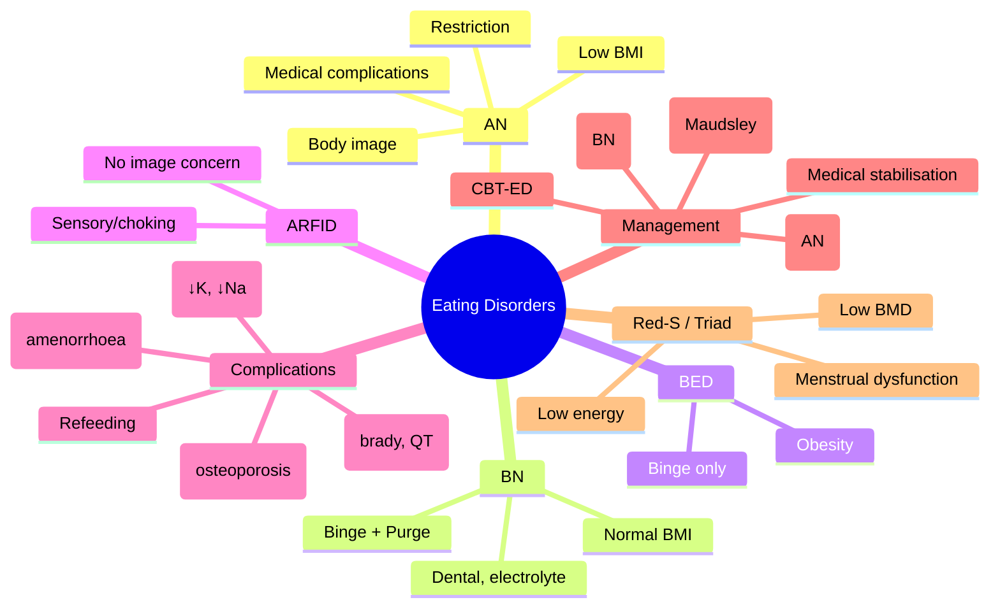

# Eating Disorders- Anorexia, Bulimia & Binge Eating

**Related:** [[Nutritional Factors in Disease MOC]], [[Davidson Chapter 22 - Nutritional Factors in Disease Hierarchy]], [[../00_Index/Medicine MOC|Medicine MOC]]

> [!important]
> **Anorexia nervosa (AN): BMI <18.5, restriction, body image distortion, ↑exercise; Bulimia nervosa (BN): binge + purge (vomiting/laxative), normal weight often; BED: binge without purge; medical complications: cardiac, electrolyte, bone, refeeding risk; F > M (10×); CBT + family-based therapy (Maudsley); medical stabilisation for medical instability.**

## 1. Learning Objectives
- [ ] Define AN: restriction, BMI <18.5, body image distortion, fear of fatness; atypical AN (normal BMI)
- [ ] Define BN: binge + compensatory (vomiting, laxatives, exercise), normal weight often
- [ ] Define BED: binge without compensatory behaviours; associated with obesity
- [ ] State medical complications: cardiac (bradycardia, hypotension, QT, arrhythmia), electrolytes (hypokalaemia, hyponatraemia), bone (osteoporosis), endocrine (amenorrhoea, low T3), refeeding
- [ ] State criteria: DSM-5 AN (BMI cut-offs by age; amenorrhoea removed), BN (≥1/week ×3 months), BED (≥1/week ×3 months)
- [ ] Apply management: medical stabilisation (BMI <13, electrolytes), CBT (BN, BED), FBT-Maudsley (AN children), SSRI (fluoxetine BN, depression)
- [ ] Recognise "Female Athlete Triad" / "RED-S": low energy, menstrual dysfunction, low bone density

## 2. Definitions / Key Concepts

| Term | Definition |
|------|------------|
| **Anorexia Nervosa (AN)** | Restriction; intense fear of fatness; body image distortion; BMI <18.5 (DSM-5 by age) |
| **Atypical AN** | Restriction; body image distortion; BMI ≥18.5 (post-DSM-5) |
| **Bulimia Nervosa (BN)** | Binge + compensatory (vomiting, laxatives, exercise, fasting); normal BMI often |
| **Binge Eating Disorder (BED)** | Binge without compensatory; associated with obesity |
| **Rumination Disorder** | Repeated regurgitation; not medical/GI cause |
| **ARFID (Avoidant Restrictive Food Intake Disorder)** | Restriction without body image concern; sensory, fear of choking, low appetite |
| **DSM-5 Criteria (AN)** | Restriction; fear of fatness; body image disturbance; significantly low weight |
| **DSM-5 (BN)** | Binge + compensatory ≥1/week ×3 months; self-evaluation unduly influenced by body shape |
| **DSM-5 (BED)** | Binge ≥1/week ×3 months; marked distress; no compensatory |
| **Binge Episode** | Eating in discrete period (≤2 h) abnormally large amount; sense of loss of control |
| **Purging** | Vomiting, laxatives, diuretics, enemas, exercise, fasting |
| **Maudsley Family-Based Therapy (FBT)** | Family-based; AN children/adolescents; empowers parents to support recovery |
| **CBT-ED (Enhanced)** | Cognitive behavioural therapy for ED; gold standard for BN, BED |
| **SSRI (Fluoxetine 60 mg)** | FDA-approved for BN; not AN (alone) |
| **Refeeding Syndrome** | High risk; start slowly (10 kcal/kg); thiamine; monitor PO4/K/Mg |
| **Female Athlete Triad / RED-S** | Low energy (with/without disordered eating), menstrual dysfunction, low BMD |
| **Purging Complications** | Parotid enlargement, dental erosion, electrolyte (↓K, ↓Na, ↓Cl), Russell's sign, oesophageal/gastric perforation |
| **MARSIPAN (UK)** | Management of Really Sick Patients with AN; medical stabilisation criteria |

## 3. Core Content

### Section 1: Anorexia Nervosa (AN)
**DSM-5 Criteria:**
1. Restriction of energy intake → significantly low body weight
2. Intense fear of gaining weight or becoming fat
3. Body image disturbance

**Subtypes:**
- **Restricting:** No binge/purge
- **Binge-purge:** Binges or purges (vomiting, laxatives, diuretics)

**Epidemiology:** F:M 10:1; onset 12-25y; prevalence 0.5-1%; mortality 5-10% (highest of psychiatric disorders)

**Medical Complications:**
| System | Features |
|--------|----------|
| **Cardiovascular** | Bradycardia (40-60), hypotension, ↓cardiac mass, mitral valve prolapse, QT prolongation, arrhythmias, sudden death |
| **Haematological** | Anaemia, leukopenia, thrombocytopenia |
| **Endocrine** | **Amenorrhoea** (low GnRH → low LH/FSH → low oestrogen), ↓T3 (sick euthyroid), ↑cortisol, ↓testosterone, ↓fertility |
| **Musculoskeletal** | Osteoporosis, stress fractures, sarcopenia |
| **Renal** | ↓GFR, prerenal AKI, nephrolithiasis |
| **GI** | Delayed gastric emptying, constipation, bloating |
| **Skin** | Lanugo, dry skin, carotenoderma (orange), acrocyanosis |
| **Dental** | Erosion (purge) |
| **Neuropsychiatric** | Depression, anxiety, OCD, cognitive impairment |

### Section 2: Bulimia Nervosa (BN)
**DSM-5:** Binges + compensatory ≥1/week ×3 months; self-evaluation unduly influenced by body shape

**Features:** Normal or overweight BMI (often BMI 20-25); F:M 10:1; onset 18-25y; prevalence 1-2%

**Medical Complications (Purging):**
- **Electrolyte:** Hypokalaemia (vomiting, laxatives), hyponatraemia, hypochloraemia, metabolic alkalosis (vomiting), acidosis (laxatives)
- **Cardiac:** QT prolongation (hypoK), arrhythmias, cardiomyopathy (ipecac, laxatives)
- **GI:** Parotid enlargement, dental erosion (perimolysis), Russell's sign (knuckle calluses), Mallory-Weiss tear, oesophageal perforation, gastric dilatation
- **Renal:** Hypokalaemic nephropathy, renal calculi

**Differentiate from AN:** Normal weight, no amenorrhoea criterion (DSM-5), binges + purges present.

### Section 3: Binge Eating Disorder (BED)
**DSM-5:** Binges ≥1/week ×3 months; marked distress; NO compensatory behaviours
- Most common ED (1-3% prevalence); associated with obesity
- Emotional eating; loss of control
- Co-morbid: depression, anxiety, metabolic syndrome

**Treatment:** CBT-ED (gold standard); SSRI (fluoxetine); lisdexamfetamine (FDA-approved); topiramate (off-label)

### Section 4: Other EDs
- **ARFID (Avoidant Restrictive Food Intake Disorder):** Restriction without body image concern; sensory issues, fear of choking, low appetite; children; failure to thrive
- **Rumination:** Repeated regurgitation; not medical/GI cause; behavioural therapy
- **Pica:** Eating non-nutritive substances (clay, paint, ice); pregnancy, children, iron deficiency
- **Atypical AN:** Restriction + body image but normal BMI; DSM-5 addition
- **Night Eating Syndrome:** Evening hyperphagia; insomnia; obesity; non-DSM
- **Diabulimia:** T1DM + ED; insulin omission for weight loss; ↑DKA, complications

### Section 5: Female Athlete Triad / RED-S
**Female Athlete Triad (now subsumed by RED-S):**
1. **Low energy availability** (with or without ED)
2. **Menstrual dysfunction** (amenorrhoea, oligomenorrhoea)
3. **Low bone mineral density** (osteoporosis, stress fractures)

**RED-S (Relative Energy Deficiency in Sport, IOC 2014):** Broader; both sexes; includes menstrual function, bone health, immune, cardiovascular, performance, psychological, gastrointestinal.

**Management:**
- **↑Energy intake / ↓energy expenditure** (↑food or ↓exercise)
- Calcium 1300 mg, vit D 600-800 IU
- **Combined OCP** controversial (oestrogen may not help BMD without adequate nutrition)
- Multidisciplinary: physician, dietitian, psychiatrist, coach, family
- Return-to-play criteria (BSG, IOC)

### Section 6: Management
**Step 1: Medical Stabilisation** (BMI <13, severe electrolyte, bradycardia <40, hypotension SBP <90, QTc >0.45)
- Inpatient medical stabilisation (MARSIPAN criteria)
- TPN or NG (only if necessary; avoid coercion)
- Thiamine 200 mg IV before feeding
- Refeeding syndrome prevention (start 10 kcal/kg)
- Electrolyte replacement (K, Mg, PO4)
- Cardiac monitor
- Medical monitoring (HR, BP, ECG, weight, electrolytes)
- **MARSIPAN Red Flags:** BMI <13, ↓HR, ↓BP, electrolytes, syncope, ↓temp

**Step 2: Nutritional Rehabilitation**
- Start at 10-20 kcal/kg/day (low)
- Increase gradually; target weight gain 0.5-1 kg/week
- Dietitian; structured meal plan
- Family-based for children (FBT)

**Step 3: Psychotherapy**
- **CBT-ED (Enhanced):** BN, BED (gold standard)
- **Maudsley FBT:** Children/adolescents AN
- **EFT (Emotion-Focused Therapy):** AN
- **DBT:** Borderline personality + ED
- **SSC (Specialist Supportive Clinical Management):** AN
- **Group therapy:** CBT-ED, body image

**Step 4: Pharmacotherapy**
- **Fluoxetine 60 mg/day:** FDA-approved for BN; reduces binge/purge
- **Olanzapine 2.5-10 mg:** Weight gain in AN; off-label
- **Aripiprazole:** ED trials; off-label
- **Lisdexamfetamine (Vyvanse):** FDA-approved for BED
- **Topiramate:** BED, BN; off-label

### Section 7: Refeeding Syndrome in AN
- **High risk:** BMI <13, weight loss >15%/3m, no intake >10d
- **Start 10-15 kcal/kg/day**; thiamine 200 mg IV
- Daily electrolytes (PO4, K, Mg)
- Cardiac monitor
- **Avoid overfeeding**: ↓PO4, hypokalaemia, hypomagnesaemia, fluid overload
- Increase gradually; aim 0.5-1 kg/week

## 4. Clinical Correlation

| Scenario | Action | Notes |
|----------|--------|-------|
| 18F, BMI 14, bradycardia 38, K 2.8, refuses to eat | **MARSIPAN red flag**; medical stabilisation; NG/NG if needed; thiamine 200 mg; cardiac monitor; refeeding prevention | Severe AN |
| 25F, BMI 22, normal weight, purges 5x/week, Russell's sign | **CBT-ED (gold standard); fluoxetine 60 mg/day**; electrolyte check | Bulimia nervosa |
| 40F, BMI 35, binges 4x/week, no compensation | **CBT-ED; lisdexamfetamine 50-70 mg/day; fluoxetine** | BED with obesity |
| 16F, BMI 16, AN restricting type, family supportive | **Maudsley FBT (family-based, gold standard for AN adolescent)**; medical monitoring; refeeding prevention | FBT empowers parents |
| 22F, athlete, amenorrhoea, stress fracture, low BMI | **RED-S**; ↑energy intake or ↓training; calcium 1300 mg, vit D 800 IU; multidisciplinary | Triad/RED-S |
| 28F, T1DM, BMI 19, HbA1c 11%, recurrent DKA, low food intake | **Diabulimia**; insulin omission suspected; CBT-ED; medical stabilisation; psychiatric assessment | T1DM + ED |

## 5. High-Yield FCPS/MRCP Points

> [!important]
> - **Must know:** AN (restriction, body image, BMI <18.5, medical complications); BN (binge + purge, normal BMI); BED (binge, no purge, obesity); CBT-ED for BN/BED; FBT for AN adolescent; MARSIPAN red flags (BMI <13, bradycardia, electrolytes); refeeding syndrome; SSRI fluoxetine 60 mg for BN
> - **Common viva:** AN vs BN vs BED; DSM-5 criteria; medical complications; MARSIPAN red flags; refeeding prevention; FBT; CBT-ED; SSRIs; female athlete triad/RED-S
> - **Exam trap:** Missing low BMI normal in BN; confusing BED with BN (no purge); not recognising MARSIPAN; using SSRI for AN alone; missing refeeding risk

## 6. Common Confusions / Exam Traps

| Trap | Correction |
|------|------------|
| AN = thin | **Atypical AN normal BMI**; restriction + body image concern |
| BN = underweight | **BN normal/overweight**; binge + purge |
| BED = purging | **BED = binge WITHOUT purge**; obesity association |
| SSRI for AN | **Fluoxetine 60 mg for BN**; SSRI alone not effective in AN |
| Refeeding fast | **Start 10-15 kcal/kg; thiamine 200 mg IV; monitor** |
| B12 deficiency in AN | **B12 actually normal; nutritional anaemia, Fe deficiency** |
| FBT for adults | **FBT for children/adolescents**; CBT-ED for adults |
| MARSIPAN = nutrition only | **MARSIPAN = medical stabilisation**; BMI <13, electrolytes, cardiac |
| T1DM + ED = diabulimia | **Insulin omission for weight loss**; medical + psychiatric |

## 7. Mnemonics

- **AN = Restriction + fear + image distortion + low weight**
- **BN = Binge + Purge + normal weight** (often)
- **BED = Binge + NO Purge + obesity** (associated)
- **MARSIPAN red flags:** **BMI <13, Bradycardia <40, ↓BP, ↓K, ↓PO4, ↓temp, syncope, ↓glucose**
- **BN medical complications:** **P**arotid, **D**ental, **R**ussell's sign, **E**lectrolyte, **K**nuckle, **A**rrhythmia, **M**allory-Weiss
- **AN endocrine:** **AMENORRHOEA** (low GnRH), ↓T3, ↑cortisol
- **Treatment:** **C**BT-ED (BN, BED), **F**BT (AN adolescent), **F**luoxetine 60 mg (BN), **O**lanzapine (AN weight gain)
- **Refeeding:** **T**hiamine 200 mg IV; **P**O4/K/Mg monitor; **S**tart 10-15 kcal/kg
- **ARFID:** No body image concern; sensory/choking/low appetite
- **Diabulimia:** T1DM + insulin omission; DKA

## 8. Mind Map

## 9. -Hour Recall Prompts
1. AN: restriction + body image + low BMI; F:M 10:1; mortality 5-10%
2. BN: binge + purge + normal BMI; dental, parotid, Russell's sign, ↓K
3. BED: binge without purge; obesity; CBT-ED + lisdexamfetamine
4. MARSIPAN: BMI <13, bradycardia <40, ↓BP, electrolytes
5. Refeeding: thiamine 200 mg IV, start 10-15 kcal/kg, monitor PO4/K/Mg
6. FBT (Maudsley) for AN adolescent; CBT-ED for BN/BED
7. Fluoxetine 60 mg for BN (not AN alone)
8. RED-S / Triad: low energy, menstrual dysfunction, low BMD

## 10. -Day / 15-Day / 30-Day Revision Tracker

| Day | Date | Recall Quality (1-5) | Time Spent | Notes |
|-----|------|---------------------|------------|-------|
| 1   |      |                     |            |       |
| 7   |      |                     |            |       |
| 15  |      |                     |            |       |
| 30  |      |                     |            |       |

---

## 11. Must Know / Should Know / Nice to Know

| Priority | Content |
|----------|---------|
| **Must Know 🔴** | AN/BN/BED definitions, DSM-5; medical complications (cardiac, electrolytes, endocrine, bone); MARSIPAN red flags; refeeding prevention; FBT (adolescent AN); CBT-ED (BN, BED); fluoxetine 60 mg for BN; olanzapine for AN; RED-S/female athlete triad |
| **Should Know 🟡** | Atypical AN, ARFID, pica, rumination; diabulimia; lisdexamfetamine; olanzapine mechanism; SSC, DBT; return-to-play criteria |
| **Nice to Know 🟢** | First Man (Beattie); Karen Carpenter; IOC RED-S criteria; HEEADSSS assessment; setmelanotide (rare) |

## 12. My Weak Points
- [ ] MARSIPAN specific criteria
- [ ] Female athlete triad vs RED-S distinction
- [ ] Diabulimia recognition

## 13. Self-Test Scorecard

| Domain | Score /10 | Target /10 |
|--------|-----------|------------|
| Understanding |    | 8+ |
| Recall |    | 8+ |
| MCQ Performance |    | 8+ |
| SBA Performance |    | 8+ |
| Viva Confidence |    | 8+ |
| **TOTAL** |    | **40+/50** |

## 14. Exam Answer Modes

### Long Answer / Essay (20 min)
**Topic:** "Eating disorders: AN, BN, BED — clinical features, complications, management"
- AN: restriction, body image distortion, low BMI; F:M 10:1; mortality 5-10%; amenorrhoea (low GnRH); cardiac (bradycardia, QT), osteoporosis
- BN: binge + compensatory (vomiting, laxatives, exercise); normal/overweight BMI; dental, parotid, Russell's sign, hypokalaemia
- BED: binge without compensation; obesity association; CBT-ED + lisdexamfetamine
- Medical complications: cardiovascular, electrolyte, bone, endocrine, GI, neuropsychiatric
- MARSIPAN red flags: BMI <13, bradycardia <40, ↓BP, ↓K, ↓PO4
- Refeeding: thiamine 200 mg IV before feeding; start 10-15 kcal/kg; daily PO4/K/Mg
- Treatment: medical stabilisation; CBT-ED (BN/BED); FBT-Maudsley (AN adolescent); fluoxetine 60 mg BN; olanzapine AN
- RED-S / Female Athlete Triad: low energy, menstrual dysfunction, low BMD

### Short Note (7 min)
**Topic:** "MARSIPAN Red Flags for Medical Stabilisation"
- **BMI <13** (severe AN)
- **Bradycardia** <40 bpm
- **Hypotension** SBP <90 mmHg
- **Hypothermia** <35°C
- **Hypokalaemia** <3.0 mmol/L
- **Hypophosphataemia** <0.8 mmol/L (refeeding)
- **Hypoglycaemia**
- **Syncope**
- **QTc prolongation** >0.45s
- **Liver dysfunction**
- **Suicidality**

### Viva Answer (3 min)
**Q:** "Differentiate anorexia nervosa from bulimia nervosa."
"A: **AN:** Restriction + body image distortion + low BMI (<18.5); primary symptom is restriction; subtypes: restricting or binge-purge; medical complications severe (cardiac, bone, amenorrhoea); mortality 5-10%. **BN:** Binge + compensatory (vomiting, laxatives, exercise, fasting) + normal/overweight BMI; primary symptom is binge-purge cycle; purging complications (dental, parotid, Russell's sign, hypokalaemia). Both: F:M 10:1, young women. AN: SSRIs alone not effective; FBT for adolescent. BN: fluoxetine 60 mg (FDA-approved); CBT-ED gold standard."

### Ward Case Discussion (5 min)
**Case:** 18F, BMI 14, bradycardia 38, K 2.8, refuses to eat, exercises excessively.
"Diagnosis: **Severe AN; MARSIPAN red flags**. **Action: 1) Medical stabilisation** (inpatient; medical/psychiatric); 2) **Cardiac monitor**; 3) **Refeeding:** thiamine 200 mg IV BEFORE feeding; start 10-15 kcal/kg/day; supplement PO4/K/Mg; 4) **Electrolyte replacement** (K 2.8 = urgent IV); 5) **Multidisciplinary** (psychiatrist, dietitian, family, GP); 6) **NG/NG only if necessary** (avoid coercion); 7) **CBT-ED + FBT** (family therapy for adolescent); 8) **Olanzapine 2.5-5 mg** for weight gain; 9) **Monitor** weight, electrolytes, ECG, mental state; 10) **Avoid exercise** initially; 11) **Screen for BED** (BED in families)."

### Last-Night-Before-Exam Sheet (1 min
- **AN:** Restriction + body image + BMI <18.5; F:M 10:1; mortality 5-10%
- **BN:** Binge + purge + normal BMI; dental, parotid, Russell's sign
- **BED:** Binge without purge; obesity; CBT-ED + lisdexamfetamine
- **MARSIPAN:** BMI <13, bradycardia <40, ↓BP, ↓K, ↓PO4, syncope
- **Refeeding:** Thiamine 200 mg IV; start 10-15 kcal/kg; monitor PO4/K/Mg
- **FBT (Maudsley):** AN adolescent; family-based
- **CBT-ED:** Gold standard BN, BED
- **Fluoxetine 60 mg:** BN (FDA-approved)
- **Olanzapine:** AN (weight gain)
- **RED-S / Triad:** Low energy, menstrual dysfunction, low BMD
- **ARFID:** No body image concern; sensory/choking

## 15. MCQs (10)

1. **Anorexia nervosa cardinal features include:**
   A. Binge eating, no compensation  
   B. **Restriction, fear of fatness, body image distortion, low weight**  
   C. Binge + purge, normal weight  
   D. Restriction, normal weight, no body image concern  
   E. Restriction, low weight, ↑exercise without image concern  

2. **Bulimia nervosa is characterised by:**
   A. BMI <18.5  
   B. Restriction only  
   C. **Binge + compensatory behaviours (vomiting, laxatives, exercise) at least once weekly ×3 months**  
   D. Binge without compensation  
   E. ↑appetite, ↑weight  

3. **Binge eating disorder (BED) is distinguished from BN by:**
   A. BMI ≥30  
   B. Comorbid obesity  
   C. **Absence of compensatory behaviours**  
   D. ↑frequency of binges  
   E. Earlier onset  

4. **Cardinal medical complication of anorexia nervosa:**
   A. Diabetes  
   B. **Amenorrhoea (low GnRH) and osteoporosis**  
   C. Hyperthyroidism  
   D. Hyperkalaemia  
   E. Hypertension  

5. **Russell's sign (knuckle calluses) is associated with:**
   A. Anorexia nervosa (restricting)  
   B. **Bulimia nervosa (purging)**  
   C. BED  
   D. Diabulimia  
   E. ARFID  

6. **MARSIPAN red flag for medical stabilisation:**
   A. BMI <18.5  
   B. **BMI <13 (or rapid weight loss, bradycardia, ↓K, ↓PO4, ↓BP, ↓temp, syncope)**  
   C. BMI <25  
   D. BMI <30  
   E. BMI <40  

7. **Refeeding syndrome prevention in AN:**
   A. High calorie from day 1  
   B. **Thiamine 200 mg IV before feeding; start 10-15 kcal/kg; daily PO4/K/Mg**  
   C. NG tube always  
   D. TPN preferred  
   E. No electrolyte monitoring  

8. **Pharmacotherapy: Fluoxetine 60 mg/day is FDA-approved for:**
   A. Anorexia nervosa  
   B. **Bulimia nervosa**  
   C. Binge eating disorder  
   D. ARFID  
   E. Atypical AN  

9. **Family-Based Therapy (Maudsley FBT) is gold standard for:**
   A. BN  
   B. BED  
   C. **Anorexia nervosa (children/adolescents)**  
   D. ARFID  
   E. All eating disorders  

10. **Female athlete triad / RED-S includes all EXCEPT:**
    A. Low energy availability  
    B. Menstrual dysfunction  
    C. Low bone density  
    D. **Hyperandrogenism**  

## 16. SBA Questions (5)

1. **A 18-year-old woman, BMI 14, bradycardia 38, K 2.8, refuses to eat. Best next step?**
   A. Outpatient therapy only  
   B. **MARSIPAN medical stabilisation; refeeding prevention (thiamine 200 mg IV, start 10-15 kcal/kg); cardiac monitor; multidisciplinary**  
   C. Immediate NG tube without consent  
   D. CBT-ED only  
   E. Bariatric surgery  

2. **A 25-year-old woman, BMI 22, normal weight, purges 5x/week, Russell's sign, parotid enlargement, K 3.0. Diagnosis?**
   A. Anorexia nervosa  
   B. **Bulimia nervosa (binge + purge, normal weight, purging complications)**  
   C. BED  
   D. ARFID  
   E. Atypical AN  

3. **A 16-year-old, BMI 17, AN restricting, family supportive. Best initial therapy?**
   A. CBT-ED alone  
   B. **Maudsley Family-Based Therapy (FBT; gold standard for AN adolescent)**  
   C. Fluoxetine  
   D. Olanzapine only  
   E. Bariatric surgery  

4. **A 28-year-old T1DM, HbA1c 11%, recurrent DKA, low food intake, BMI 19, suspected insulin omission. Diagnosis?**
   A. Anorexia nervosa  
   B. Bulimia nervosa  
   C. **Diabulimia (T1DM + insulin omission for weight loss)**  
   D. BED  
   E. ARFID  

5. **A 22-year-old female athlete, amenorrhoea, stress fracture, low BMI, ↓energy intake. Best management?**
   A. OCP only  
   B. **RED-S: ↑energy intake or ↓training; calcium 1300 mg, vit D 800 IU; multidisciplinary**  
   C. TPN  
   D. Bariatric surgery  
   E. Steroid therapy  

## 17. Flashcards

- Q: AN  
  A: **Restriction + body image + low BMI; F:M 10:1; mortality 5-10%**
- Q: BN  
  A: **Binge + purge + normal BMI; dental, parotid, Russell's sign, ↓K**
- Q: BED  
  A: **Binge without purge; obesity; CBT-ED + lisdexamfetamine**
- Q: ARFID  
  A: **No body image concern; sensory/choking/low appetite**
- Q: MARSIPAN red flags  
  A: **BMI <13, bradycardia <40, ↓BP, ↓K, ↓PO4, ↓temp, syncope, QTc ↑**
- Q: Refeeding  
  A: **Thiamine 200 mg IV; start 10-15 kcal/kg; daily PO4/K/Mg**
- Q: Fluoxetine 60 mg  
  A: **FDA-approved for BN** (not AN alone)
- Q: FBT (Maudsley)  
  A: **Gold standard AN children/adolescents**
- Q: Olanzapine  
  A: **AN weight gain (off-label)**
- Q: RED-S / Triad  
  A: **Low energy, menstrual dysfunction, low BMD** (athletes)
- Q: Diabulimia  
  A: **T1DM + insulin omission for weight loss**
- Q: BN medical complications  
  A: **P**arotid, **D**ental, **R**ussell's, **E**lectrolyte, **K**nuckle, **A**rrhythmia, **M**allory-Weiss

## 18. Answer Key with Explanations

### MCQs
1. **B** — AN cardinal features: restriction, fear of fatness, body image distortion, low weight (BMI <18.5).
2. **C** — BN: binge + compensatory (vomiting, laxatives, exercise) ≥1/week ×3 months; normal weight often.
3. **C** — BED distinguished from BN: absence of compensatory behaviours; binge without purge.
4. **B** — AN medical complications: amenorrhoea (low GnRH → low LH/FSH → low oestrogen) and osteoporosis (low oestrogen + low Ca/vit D); cardiac (bradycardia, QT).
5. **B** — Russell's sign (knuckle calluses) associated with BN purging (induced vomiting).
6. **B** — MARSIPAN red flags: BMI <13, bradycardia <40, ↓BP, ↓K, ↓PO4, ↓temp, syncope, QTc ↑.
7. **B** — Refeeding prevention: thiamine 200 mg IV before feeding; start 10-15 kcal/kg; daily PO4/K/Mg.
8. **B** — Fluoxetine 60 mg FDA-approved for BN; reduces binge-purge cycles.
9. **C** — Maudsley FBT gold standard for AN children/adolescents; family-based, empowers parents.
10. **D** — Female athlete triad / RED-S: low energy, menstrual dysfunction, low BMD; NOT hyperandrogenism.

### SBAs
1. **B** — Severe AN, MARSIPAN red flags (BMI 14, brady 38, K 2.8): medical stabilisation; refeeding prevention (thiamine, start 10-15 kcal/kg, monitor); cardiac monitor; multidisciplinary.
2. **B** — Normal weight, binge + purge, Russell's, parotid, K 3.0: bulimia nervosa; CBT-ED + fluoxetine.
3. **B** — AN adolescent (16y) with family supportive: Maudsley FBT (family-based) is gold standard.
4. **C** — T1DM + insulin omission + recurrent DKA: diabulimia; insulin omission for weight loss; medical + psychiatric.
5. **B** — Female athlete with amenorrhoea, stress fracture, low BMI, ↓energy: RED-S; ↑energy or ↓training; calcium, vit D; multidisciplinary.

## 19. Summary

**Eating Disorders** is a **Must Know 🔴** topic for FCPS/MRCP.
**Key takeaway:** **AN: restriction + body image + low BMI; F:M 10:1; mortality 5-10%. BN: binge + purge + normal BMI; dental, parotid, Russell's sign, ↓K. BED: binge without purge; obesity.** **Medical complications: cardiac, electrolyte, bone, endocrine, GI.** **MARSIPAN red flags: BMI <13, bradycardia <40, ↓BP, ↓K, ↓PO4, syncope.** **Refeeding: thiamine 200 mg IV, start 10-15 kcal/kg, daily PO4/K/Mg.** **Treatment: CBT-ED (BN, BED), FBT-Maudsley (AN adolescent), fluoxetine 60 mg (BN), olanzapine (AN).** **RED-S: low energy, menstrual dysfunction, low BMD.**
**Exam focus:** AN/BN/BED, MARSIPAN, refeeding, FBT, CBT-ED, SSRIs, RED-S, medical complications.
**Clinical relevance:** MARSIPAN protocol; refeeding in critical care; primary care screening; multidisciplinary teams.

*Template version: 1.0 | Davidson 24e Ch 22 aligned | FCPS/MRCP oriented*
