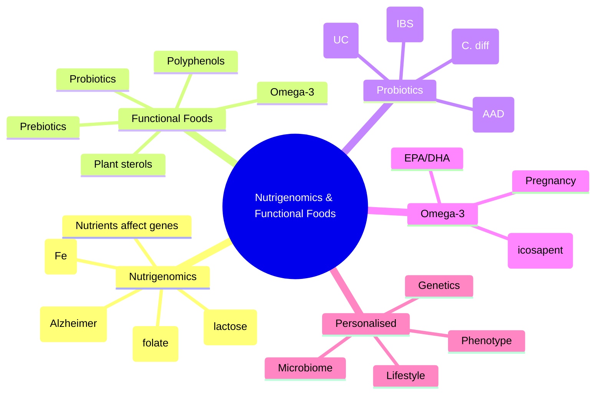

# Nutrigenomics & Functional Foods

**Related:** [[Nutritional Factors in Disease MOC]], [[Davidson Chapter 22 - Nutritional Factors in Disease Hierarchy]], [[../00_Index/Medicine MOC|Medicine MOC]]

> [!important]
> **Nutrigenomics = gene-nutrient interactions (e.g., MTHFR C677T folate, lactase persistence, haemochromatosis HFE); Functional foods = health benefits beyond nutrition (probiotics, prebiotics, omega-3, plant sterols, polyphenols); personalised nutrition by genetics/microbiome; probiotics for AAD, C. difficile, IBS.**

## 1. Learning Objectives
- [ ] Define nutrigenomics: gene-nutrient interactions affecting individual response to diet
- [ ] Recognise key nutrigenomic examples: MTHFR C677T (folate), MTHFD1, lactase persistence (LCT), HFE C282Y (haemochromatosis), APOE4 (Alzheimer), CYP1A2 (caffeine)
- [ ] Define functional foods: foods/ingredients with health benefits beyond basic nutrition
- [ ] State functional food categories: probiotics, prebiotics, synbiotics, omega-3 PUFA, plant sterols/stanols, polyphenols, fibre, vitamins/minerals
- [ ] Recognise evidence: probiotics (AAD, C. difficile, IBS); omega-3 (CVD, pregnancy); plant sterols (↓LDL); polyphenols (Mediterranean)
- [ ] State personalised nutrition: genetics + microbiome + phenotype; nutrigenetic testing (limited clinical use)
- [ ] Define nutrigenetics vs nutrigenomics: nutrigenetics = how genes affect nutrient response; nutrigenomics = how nutrients affect gene expression

## 2. Definitions / Key Concepts

| Term | Definition |
|------|------------|
| **Nutrigenomics** | Study of how nutrients affect gene expression (mRNA, protein, metabolites) |
| **Nutrigenetics** | Study of how genetic variation affects individual response to nutrients |
| **Personalised Nutrition** | Tailored dietary advice based on genetics, microbiome, phenotype, lifestyle |
| **Functional Food** | Food/ingredient providing health benefit beyond basic nutrition (probiotics, omega-3, plant sterols) |
| **Nutraceutical** | Functional food component isolated and sold as supplement (e.g., fish oil capsules) |
| **Probiotic** | Live microorganisms (Lactobacillus, Bifidobacterium) that confer health benefit; adequate amounts |
| **Prebiotic** | Non-digestible food ingredient (FOS, GOS, inulin) that stimulates growth of beneficial gut bacteria |
| **Synbiotic** | Probiotic + prebiotic combination |
| **Postbiotic** | Bioactive compounds produced by probiotics (SCFA, bacteriocins, peptides) |
| **Methylenetetrahydrofolate Reductase (MTHFR)** | Enzyme: 5,10-methylene-THF → 5-methyl-THF; C677T polymorphism (↓activity) → ↑homocysteine; needs folate |
| **Lactase Persistence (LCT)** | C/T-13910 polymorphism; T = lactase persists (Northern European); C = adult hypolactasia |
| **HFE (Haemochromatosis)** | C282Y mutation → ↓hepcidin → Fe overload; avoid iron supplements |
| **APOE (Apolipoprotein E)** | APOE4 = ↑Alzheimer risk, ↑LDL; APOE2 = protective, but ↑type III hyperlipidaemia |
| **CYP1A2 (Cytochrome P450)** | Caffeine metabolism; *1A/*1F = fast; *1A/*1A = slow (CYP1A2 slow metaboliser) |
| **MTHFD1 G1958A** | Folate metabolism; A allele = ↑risk of NTD, CVD |
| **FUT2 (Secretor Status)** | Determines ABO antigens in secretions; B allele = non-secretor; affects gut microbiome, B12 |
| **APOA2 (Saturated Fat Response)** | T allele (TT) = ↑BMI with high SFA; CC = no effect |
| **TCN2 (Transcobalamin II)** | B12 transport; some variants affect B12 status |
| **Gut Microbiome** | 10¹⁴ bacteria; influences metabolism, immunity, inflammation; diet shapes composition |
| **SCFA (Short-Chain Fatty Acids)** | Acetate, propionate, butyrate; from fibre fermentation; ↓inflammation, gut health |
| **Planetary Health Diet (EAT-Lancet)** | Flexitarian; ↓CVD, ↓environmental impact; red meat <14 g/day |
| **Plant Sterols/Stanols** | ↓LDL 7-10% at 2 g/day; competitive inhibition of cholesterol absorption |
| **Polyphenols** | Flavonoids, lignans, stilbenes; antioxidants, anti-inflammatory |
| **Resveratrol** | Red wine, grapes, peanuts; SIRT1 activator; cardioprotective (controversial) |
| **Omega-3 PUFA** | EPA, DHA (fish); ALA (flax, chia); cardiovascular, neuroprotection, anti-inflammatory |
| **Lycopene** | Tomatoes, watermelon; antioxidant; prostate cancer prevention |
| **Curcumin** | Turmeric; anti-inflammatory (NF-κB, COX-2 inhibition); bioavailability issues |
| **Sulforaphane** | Cruciferous vegetables; Nrf2 activator; antioxidant, anti-cancer |
| **EGCG (Epigallocatechin Gallate)** | Green tea; antioxidant; cardioprotective, anti-cancer |
| **Vitamin D Receptor (VDR)** | Genetic variation affects response to vitamin D supplementation |

## 3. Core Content

### Section 1: Nutrigenomics & Nutrigenetics
**Definitions:**
- **Nutrigenomics:** How nutrients affect gene expression
- **Nutrigenetics:** How genes affect nutrient response
- **Personalised nutrition:** Integration of genetic, microbiome, phenotypic data for individualised diet

**Key Examples:**

| Gene/Nutrient | Effect | Clinical |
|----------------|--------|----------|
| **MTHFR C677T** | TT genotype: ↓enzyme activity (70%); ↑homocysteine | Folate supplementation 800 µg-1 mg/day (especially in pregnancy); methylfolate preferred |
| **MTHFR A1298C** | Compound heterozygote C677T/A1298C: severe | Folate supplementation |
| **Lactase Persistence (LCT)** | T-13910 (C/T): T = lactase persists; C = adult hypolactasia | Population-specific (Northern European 90% persistent; Asian, African 10-30%) |
| **HFE C282Y** | Homozygous: ↓hepcidin → Fe overload | Avoid iron supplements; phlebotomy if HH |
| **HFE H63D** | Compound heterozygote C282Y/H63D: mild Fe overload | Monitor |
| **APOE4** | ↑Alzheimer risk (3-15x); ↑LDL; ↓response to statins | Mediterranean diet; cognitive screening; aggressive CVD prevention |
| **CYP1A2 *1F** | Fast metaboliser; caffeine metabolised quickly | Tolerates caffeine; less CVD risk with coffee |
| **CYP1A2 *1A** | Slow metaboliser; caffeine slow clearance | Limit caffeine; may ↑CVD risk with high intake |
| **MTHFD1 G1958A** | Folate metabolism; A = ↑NTD, CVD | Folate supplementation |
| **FUT2 (Secretor)** | Non-secretor (B): ↑vitamin B12 deficiency, different microbiome | Monitor B12 |
| **APOA2** | T allele (TT): ↑BMI with high SFA | Limit SFA intake |
| **TCN2** | B12 transport variants | Monitor B12; supplement if low |
| **VDR (Vitamin D Receptor)** | BsmI, FokI, TaqI, ApaI | Variable response to vit D; some need more supplementation |
| **CYP2R1** | 25-hydroxylase variant | Lower 25(OH)D; need more vit D |
| **CYP24A1** | 24-hydroxylase (catabolism) | Increased catabolism in some variants |
| **APOC3** | Variant affects TG response to diet; Mediterranean diet | Personalised diet |

### Section 2: Functional Foods Categories
| Category | Examples | Mechanism | Evidence |
|----------|----------|-----------|----------|
| **Probiotics** | Lactobacillus, Bifidobacterium, Saccharomyces | Restore microbiome; antimicrobial peptides; immune modulation | AAD, C. difficile, IBS, pouchitis |
| **Prebiotics** | FOS, GOS, inulin, resistant starch | Stimulate beneficial bacteria; SCFA production | IBS, colon health, calcium absorption |
| **Synbiotics** | Probiotic + prebiotic | Synergistic | IBS, UC, post-antibiotic |
| **Omega-3 PUFA** | Fish oil (EPA, DHA); flax, chia (ALA) | ↓Triglycerides, anti-inflammatory, antiplatelet, membrane fluidity | CVD (REDUCE-IT), pregnancy, RA, depression |
| **Plant sterols/stanols** | Margarine (Benecol), supplements | Competitive inhibition of cholesterol absorption | ↓LDL 7-10% (2 g/day) |
| **Polyphenols** | Flavonoids, resveratrol, EGCG, quercetin, anthocyanins | Antioxidant, anti-inflammatory, NO, microbiome | CVD, neuroprotection, anti-cancer |
| **Dietary fibre** | Soluble (β-glucan, psyllium, pectin) | ↓LDL, ↓glucose, SCFA, gut health | CVD, T2DM, IBS, CRC |
| **Phytosterols** | Sitosterol, campesterol, stigmasterol | ↓Cholesterol absorption | ↓LDL |
| **Soy protein** | Isoflavones (genistein, daidzein) | Phytoestrogen, ↓LDL | CVD, menopausal symptoms |
| **Lycopene** | Tomatoes, watermelon | Antioxidant | Prostate cancer (some evidence) |
| **Curcumin** | Turmeric | Anti-inflammatory (NF-κB, COX-2); Nrf2 | RA, IBD, cancer (bioavailability issue) |
| **Sulforaphane** | Broccoli sprouts | Nrf2 activator; anti-cancer | Cancer prevention |
| **EGCG** | Green tea | Antioxidant; ↓COX-2; ↑AMPK | CVD, cancer, metabolic |

### Section 3: Probiotics — Evidence
**Established Indications:**
- **Antibiotic-associated diarrhoea (AAD):** Saccharomyces boulardii, Lactobacillus rhamnosus GG; ↓risk 50%
- **Clostridioides difficile:** S. boulardii, L. rhamnosus GG; adjunct to vancomycin; ↓recurrence
- **Acute infectious diarrhoea:** L. rhamnosus GG, S. boulardii; ↓duration ~1 day
- **Pouchitis:** VSL#3 (high-dose multi-strain)
- **Ulcerative colitis (mild-moderate):** VSL#3, E. coli Nissle 1917; maintenance
- **IBS:** Bifidobacterium infantis 35624, B. lactis; some symptom benefit
- **NEC (preterm infants):** Probiotics ↓NEC (Bifidobacterium); controversy
- **Hepatic encephalopathy:** Not standard; some benefit

**Common Probiotic Strains:**
- **Lactobacillus rhamnosus GG (LGG):** AAD, acute diarrhoea
- **Saccharomyces boulardii:** AAD, C. difficile
- **Bifidobacterium infantis 35624:** IBS
- **VSL#3 (multi-strain, high dose):** UC, pouchitis
- **E. coli Nissle 1917 (Mutaflor):** UC maintenance
- **Lactobacillus reuteri DSM 17938:** Infant colic, AAD
- **Bifidobacterium longum 35624:** IBS
- **Saccharomyces boulardii CNCM I-745:** AAD, C. difficile
- **Lactobacillus plantarum 299v:** IBS

**Safety:**
- Generally safe
- Caution: immunocompromised, central line, short bowel, critically ill (rare sepsis, fungemia)
- S. boulardii: avoid in central lines (fungemia risk)

### Section 4: Omega-3 PUFA
**Sources:**
- **EPA, DHA:** Oily fish (salmon, mackerel, sardines); fish oil supplements
- **ALA:** Flax, chia, hemp, walnuts; converted to EPA/DHA (~5-10% efficiency)

**Evidence:**
- **CVD (REDUCE-IT):** Icosapent ethyl 4 g/day + statin ↓CVD events 25% (TG >1.5 mmol/L, ASCVD or DM)
- **Pregnancy:** DHA 200-300 mg/day (foetal brain development; ACOG)
- **RA:** ↓pain, ↓NSAID use
- **Pregnancy (preterm):** ↓preterm birth (Cochrane)
- **Cognition:** Mixed; no clear benefit in normal adults; may help in MCI
- **Dry eye (DREAM trial):** ω-3 may not help (or modest benefit)
- **Depression:** Some benefit (adjunct); mixed evidence

**Dose:**
- 1 g/day EPA+DHA for general health
- 2-4 g/day for hypertriglyceridaemia
- Icosapent ethyl 4 g/day for ASCVD with hypertriglyceridaemia (REDUCE-IT)
- 200-300 mg DHA in pregnancy

**Cautions:**
- Antiplatelet effect (high dose with anticoagulants)
- Fishy burp; GI upset
- Heavy metal contamination (mercury, PCBs) — choose quality
- Vitamin A toxicity in polar bear/whale liver

### Section 5: Personalised Nutrition
**Layers:**
1. **Genetic:** MTHFR, HFE, APOE, LCT (limited clinical use)
2. **Microbiome:** Composition, function (Metagenomics, 16S rRNA)
3. **Phenotype:** Metabolomics (lipids, amino acids), proteomics
4. **Lifestyle:** Diet diary, exercise, sleep, stress
5. **Clinical:** Disease, medications, age, sex

**Applications:**
- **Direct-to-consumer genetic testing** (e.g., 23andMe, Ancestry): APOE, MTHFR, LCT; not always evidence-based
- **Microbiome testing:** Research; not standard clinical
- **Continuous glucose monitoring (CGM):** Personalised nutrition in T2DM/prediabetes
- **Mediterranean diet** (best evidence regardless of genetics)
- **BANT (British Association for Nutrition and Lifestyle Medicine)** registered nutritionists

### Section 6: Clinical Applications
**Cardiovascular Disease:**
- **Mediterranean diet** (best evidence)
- **Plant sterols** ↓LDL 7-10% (2 g/day)
- **Omega-3 (REDUCE-IT)** in ASCVD with hypertriglyceridaemia
- **Soluble fibre** (psyllium, β-glucan) ↓LDL 5-10%
- **Soy protein** ↓LDL 4-5%
- **Nuts** 30 g/day ↓CVD 30%

**Diabetes:**
- **Low-GI, high-fibre** (25-30 g/day)
- **Mediterranean diet** (best evidence for CV outcomes)
- **Prebiotic fibre** (inulin, β-glucan) for glycaemic control
- **Cinnamon** (Ceylon; modest HbA1c effect)
- **Vinegar** (pre-meal; ↓postprandial glucose)

**Cancer Prevention:**
- **WCRF recommendations** (weight, exercise, plant foods)
- **Cruciferous vegetables** (sulforaphane; Nrf2)
- **Tomatoes/lycopene** (prostate)
- **Green tea** (EGCG)
- **Avoid** processed meat, alcohol, aflatoxin

**GI Health:**
- **Probiotics** for AAD, IBS, UC, pouchitis
- **Prebiotics** (FOS, GOS) for IBS, constipation
- **Synbiotics** in UC maintenance
- **Avoid** FODMAPs in IBS

**Inflammation/Autoimmune:**
- **Mediterranean diet** ↓inflammatory markers
- **Omega-3** in RA, IBD
- **Turmeric (curcumin)** (bioavailability)
- **Pre/probiotics** in IBD

**Cognitive Function:**
- **MIND diet** (Mediterranean-DASH Intervention for Neurodegenerative Delay)
- **Mediterranean** ↓cognitive decline
- **Fish** (omega-3) for brain
- **B vitamins** (B12, folate, B6); ↓homocysteine

## 4. Clinical Correlation

| Scenario | Action | Notes |
|----------|--------|-------|
| 60M, ASCVD, on statin, TG 2.5, LDL 1.8 | **Icosapent ethyl 4 g/day** (REDUCE-IT) + Mediterranean diet | Hypertriglyceridaemia in ASCVD |
| 30F, 2-week antibiotic course, develops diarrhoea | **S. boulardii 250-500 mg/day during antibiotics + 1 week after** | AAD prevention |
| 70F, recurrent C. difficile, on vancomycin taper | **S. boulardii + LGG adjunct**; consider FMT if recurrent | C. difficile prevention |
| 50M, MTHFR C677T homozygous, ↑homocysteine, depression | **Methylfolate 15 mg/day**; check B12, B6, B12 | MTHFR + hyperhomocysteinaemia |
| 45F, post-RYGB, ↓Hb, microcytic, normal ferritin | **Consider HFE C282Y testing** if HH risk; family screening | HH screening |
| 35F, IBS, bloating, low-FODMAP partial response | **Probiotic (B. infantis 35624 or VSL#3)**; consider prebiotic | IBS management |
| 40F, RR 200, 35 wk pregnant, vegetarian | **DHA 200-300 mg/day**; B12, iron, folate | Pregnancy nutrition |

## 5. High-Yield FCPS/MRCP Points

> [!important]
> - **Must know:** Nutrigenetics (genes affect response) vs nutrigenomics (nutrients affect genes); key examples: MTHFR C677T (folate), LCT (lactose), HFE C282Y (Fe), APOE4 (Alzheimer); functional foods (probiotics, omega-3, plant sterols, polyphenols); probiotics for AAD, C. difficile, IBS; icosapent ethyl 4 g for ASCVD with hypertriglyceridaemia (REDUCE-IT)
> - **Common viva:** Probiotic strains and indications; omega-3 evidence; plant sterol mechanism; MTHFR management; functional food categories; personalised nutrition
> - **Exam trap:** Probiotic choice (strain matters); confusing nutrigenetics/nutrigenomics; not checking MTHFR in hyperhomocysteinaemia; recommending supplements without evidence

## 6. Common Confusions / Exam Traps

| Trap | Correction |
|------|------------|
| Probiotics all same | **Strain matters**: LGG for AAD, S. boulardii for C. diff, B. infantis for IBS |
| Omega-3 prevents CVD | **REDUCE-IT specific (icosapent ethyl 4 g); STRENGTH/VITAL no benefit** |
| Plant sterols replace statins | **Adjunct** ↓LDL 7-10%; not substitute for statin |
| MTHFR + depression → L-methylfolate | **Severe MTHFR + hyperhomocysteinaemia; counsel** |
| S. boulardii safe always | **Avoid in central lines, immunocompromised** (fungemia) |
| Mediterranean diet not "functional food" | **Includes functional food components** (EVOO, fish, nuts, polyphenols) |
| Genetics → personalised diet | **Limited clinical use**; Mediterranean works for all; PREDIMED all subgroups |
| Curcumin cures inflammation | **Bioavailability issue**; modest evidence; piperine enhances absorption |
| Resveratrol = red wine = CVD | **Controversial**; alcohol cancer risk; pure resveratrol benefits unclear |
| Vitamin D supplementation universal | **VDR/CYP2R1/CYP24A1 variants**; tailored |

## 7. Mnemonics

- **Nutrigenomics vs Nutrigenetics:** **N**utrients → **G**enes (nutrigenomics); **G**enes → **N**utrients (nutrigenetics)
- **MTHFR:** **M**ethylenetetrahydrofolate **R**eductase; C677T TT = severe; needs folate
- **HFE:** **H**FE **C**282Y = **C**irrhosis from **Fe**; avoid supplements
- **APOE4:** **A**lzheimer, **P**ostmenopausal **O**besity, **E**levated LDL
- **Probiotic strain:** **LGG** (AAD), **S. boulardii** (C. diff), **B. infantis** (IBS), **VSL#3** (UC/pouchitis)
- **Omega-3 (REDUCE-IT):** **I**cosapent **4 g/day**; ASCVD + hyperTG
- **Plant sterols:** **2 g/day ↓LDL 7-10%**; competitive cholesterol absorption inhibitor
- **Functional foods:** **P**re/pro/**S**ynbiotic, **O**mega-3, **P**lant sterols, **P**olyphenols, **F**ibre
- **MIND diet:** **M**editerranean-**D**ASH **I**ntervention for **N**euro**D**egenerative **D**elay
- **Prebiotic:** **F**OS, **G**OS, **I**nulin, **R**esistant starch
- **Probiotic risk:** **S**epsis (immunocompromised), **F**ungemia (S. boulardii + central line)
- **Personalised nutrition layers:** **G**enetics, **M**icrobiome, **P**henotype, **L**ifestyle, **C**linical

## 8. Mind Map

## 9. -Hour Recall Prompts
1. Nutrigenomics: nutrients affect genes; Nutrigenetics: genes affect nutrients
2. MTHFR C677T: methylfolate; LCT: lactase persistence; HFE C282Y: Fe overload
3. Functional foods: probiotics, prebiotics, omega-3, plant sterols, polyphenols, fibre
4. Probiotic strains: LGG (AAD), S. boulardii (C. diff), B. infantis (IBS), VSL#3 (UC)
5. REDUCE-IT: icosapent ethyl 4 g/day for ASCVD + hypertriglyceridaemia
6. Plant sterols 2 g/day ↓LDL 7-10%
7. Mediterranean diet: best evidence for personalised nutrition
8. SCFA from fibre: gut health, anti-inflammatory

## 10. -Day / 15-Day / 30-Day Revision Tracker

| Day | Date | Recall Quality (1-5) | Time Spent | Notes |
|-----|------|---------------------|------------|-------|
| 1   |      |                     |            |       |
| 7   |      |                     |            |       |
| 15  |      |                     |            |       |
| 30  |      |                     |            |       |

---

## 11. Must Know / Should Know / Nice to Know

| Priority | Content |
|----------|---------|
| **Must Know 🔴** | Nutrigenetics/nutrigenomics; MTHFR C677T, LCT, HFE, APOE; functional foods categories; probiotic strains and indications (LGG, S. boulardii, B. infantis, VSL#3); omega-3 (REDUCE-IT, pregnancy); plant sterols ↓LDL 7-10%; polyphenols |
| **Should Know 🟡** | CYP1A2 (caffeine); MTHFD1; FUT2 (secretor); APOA2 (saturated fat); VDR variants; prebiotic types; synbiotic; postbiotic; resveratrol controversy; MIND diet; turmeric; sulforaphane |
| **Nice to Know 🟢** | Direct-to-consumer genetic testing limitations; microbiome testing; CGM personalisation; EAT-Lancet planetary health diet; specific carotenoids; polyphenols mechanism |

## 12. My Weak Points
- [ ] Probiotic strain specifics
- [ ] REDUCE-IT trial design
- [ ] MTHFR management detail

## 13. Self-Test Scorecard

| Domain | Score /10 | Target /10 |
|--------|-----------|------------|
| Understanding |    | 8+ |
| Recall |    | 8+ |
| MCQ Performance |    | 8+ |
| SBA Performance |    | 8+ |
| Viva Confidence |    | 8+ |
| **TOTAL** |    | **40+/50** |

## 14. Exam Answer Modes

### Long Answer / Essay (20 min)
**Topic:** "Nutrigenomics and functional foods in clinical practice"
- Nutrigenomics: nutrients affect gene expression; Nutrigenetics: genes affect nutrient response
- Examples: MTHFR C677T (folate metabolism, hyperhomocysteinaemia), LCT (lactose persistence), HFE C282Y (Fe overload, HH), APOE4 (Alzheimer risk, lipid response)
- Functional food categories: probiotics, prebiotics, synbiotics, omega-3, plant sterols, polyphenols, fibre
- Probiotic strain matters: LGG (AAD), S. boulardii (C. difficile), B. infantis (IBS), VSL#3 (UC)
- Omega-3: REDUCE-IT icosapent ethyl 4 g/day (ASCVD + hypertriglyceridaemia); pregnancy 200-300 mg DHA
- Plant sterols 2 g/day ↓LDL 7-10% (competitive cholesterol absorption inhibitor)
- Personalised nutrition: genetics + microbiome + phenotype; Mediterranean best evidence regardless of genetics

### Short Note (7 min)
**Topic:** "Probiotics in Clinical Practice"
| Strain | Indication |
|--------|-----------|
| **Lactobacillus rhamnosus GG (LGG)** | AAD, acute infectious diarrhoea |
| **Saccharomyces boulardii** | AAD, C. difficile prevention (avoid central line) |
| **Bifidobacterium infantis 35624** | IBS |
| **VSL#3** (multi-strain, high-dose) | UC, pouchitis |
| **E. coli Nissle 1917** | UC maintenance |
| **Lactobacillus reuteri DSM 17938** | Infant colic |
| **Bifidobacterium longum** | IBS |

### Viva Answer (3 min)
**Q:** "Differentiate nutrigenomics from nutrigenetics."
"A: **Nutrigenomics:** How nutrients affect gene expression (e.g., fish oil ↑PPAR-α → ↑β-oxidation; vitamin D binds VDR → gene transcription). **Nutrigenetics:** How genetic variation affects individual response to nutrients (e.g., MTHFR C677T TT → ↑homocysteine → need folate; APOE4 → ↑Alzheimer risk, ↓statin response; LCT C/T-13910 → lactase persistence; HFE C282Y → Fe overload). **Personalised nutrition:** Integration of genetics, microbiome, phenotype, lifestyle for individualised diet."

### Ward Case Discussion (5 min)
**Case:** 65M, ASCVD, on statin, TG 2.8 mmol/L, LDL 1.6 mmol/L, HbA1c 5.9%, on metformin.
"**Action: 1) Icosapent ethyl 2 g BD** (REDUCE-IT: 4 g/day; ASCVD + hypertriglyceridaemia); 2) **Mediterranean diet**; 3) **Plant sterols 2 g/day** (Benecol; ↓LDL adjunct); 4) **Soluble fibre** (psyllium, oats; ↓LDL); 5) **Nuts 30 g/day**; 6) **Omega-3** (already); 7) **Diabetes control** (HbA1c target <7%); 8) **Weight loss** if overweight; 9) **Exercise** 150 min/wk; 10) **Monitor**: lipid panel q3-6m, TG, LFT, INR (with warfarin)."

### Last-Night-Before-Exam Sheet (1 min
- **Nutrigenomics:** Nutrients → genes; **Nutrigenetics:** Genes → nutrients
- **MTHFR C677T:** Folate metabolism; methylfolate supplement
- **HFE C282Y:** Fe overload (HH); avoid supplements
- **LCT:** Lactase persistence (C/T-13910)
- **APOE4:** Alzheimer, ↑LDL
- **Functional foods:** Pro/pre/synbiotic, Omega-3, Plant sterols, Polyphenols, Fibre
- **Probiotic strains:** LGG (AAD), S. boulardii (C. diff), B. infantis (IBS), VSL#3 (UC)
- **REDUCE-IT:** Icosapent ethyl 4 g/day; ASCVD + hypertriglyceridaemia
- **Plant sterols:** 2 g/day ↓LDL 7-10%
- **Personalised nutrition:** Genetics + Microbiome + Phenotype + Lifestyle
- **Mediterranean diet:** Best evidence for all; regardless of genetics

## 15. MCQs (10)

1. **Nutrigenetics is the study of:**
   A. How nutrients affect gene expression  
   B. **How genetic variation affects individual response to nutrients**  
   C. How genes affect metabolism exclusively  
   D. How diet affects the microbiome  
   E. How food affects brain function  

2. **MTHFR C677T TT genotype requires:**
   A. Vitamin B12 supplementation  
   B. **Folate (or methylfolate) supplementation**  
   C. Iron restriction  
   D. Calcium supplementation  
   E. Vitamin C supplementation  

3. **HFE C282Y homozygous causes:**
   A. Wilson's disease  
   B. **Hereditary haemochromatosis (iron overload)**  
   C. Cystic fibrosis  
   D. Phenylketonuria  
   E. α1-antitrypsin deficiency  

4. **Established probiotic for antibiotic-associated diarrhoea (AAD) prevention:**
   A. Escherichia coli Nissle  
   B. VSL#3  
   C. **Saccharomyces boulardii OR Lactobacillus rhamnosus GG**  
   D. Bifidobacterium infantis 35624  
   E. Lactobacillus reuteri  

5. **REDUCE-IT trial: icosapent ethyl 4 g/day in:**
   A. Heart failure  
   B. Atrial fibrillation  
   C. **ASCVD with hypertriglyceridaemia (already on statin)**  
   D. Acute MI  
   E. Hypertension  

6. **Plant sterols (2 g/day) reduce LDL by approximately:**
   A. 1-2%  
   B. **7-10%**  
   C. 20-30%  
   D. 40-50%  
   E. 50-70%  

7. **APOE4 carriers are at increased risk for:**
   A. Cardiovascular disease only  
   B. **Alzheimer's disease and elevated LDL**  
   C. Stroke only  
   D. Venous thromboembolism  
   E. Cancer  

8. **Prebiotic fibre fermentation produces:**
   A. Long-chain fatty acids  
   B. **Short-chain fatty acids (acetate, propionate, butyrate)**  
   C. Ketones  
   D. Triglycerides  
   D. Cholesterol  

9. **Functional foods include all EXCEPT:**
   A. Probiotics  
   B. Prebiotics  
   C. **Refined sugar**  
   D. Omega-3 PUFA  
   E. Plant sterols  

10. **Mediterranean diet is best described as:**
    A. **An evidence-based dietary pattern with health benefits beyond basic nutrition**  
    B. Weight loss diet  
    C. Low-fat diet  
    D. Low-CHO diet  
    E. Vegetarian diet  

## 16. SBA Questions (5)

1. **A 50-year-old man with MTHFR C677T TT, hyperhomocysteinaemia, depression. Best management?**
   A. SSRI only  
   B. **Methylfolate 15 mg/day + B12, B6; check homocysteine response; consider antidepressant**  
   C. Vitamin C  
   D. Iron restriction  
   E. Folate 1 mg (synthetic)  

2. **A 60-year-old man with ASCVD on statin, TG 2.5, LDL 1.6. Best evidence-based omega-3?**
   A. Fish 2x/week  
   B. **Icosapent ethyl 4 g/day (REDUCE-IT)**  
   C. Mixed EPA/DHA supplement  
   D. ALA supplementation  
   E. No omega-3  

3. **A 30-year-old on broad-spectrum antibiotics develops diarrhoea. Best probiotic?**
   A. VSL#3  
   B. Bifidobacterium infantis  
   C. **Saccharomyces boulardii 250-500 mg/day during antibiotics + 1 week after (avoid if central line)**  
   D. Lactobacillus reuteri  
   E. E. coli Nissle  

4. **A 40-year-old with C282Y homozygous, ferritin 800, transferrin saturation 65%. Best management?**
   A. Iron supplementation  
   B. **Therapeutic phlebotomy (1 unit weekly until ferritin <50)**  
   C. Avoid phlebotomy  
   D. Vitamin C  
   E. EPO  

5. **A 50-year-old with elevated LDL (4.5) prefers dietary approach. Most effective functional food?**
   A. Probiotics  
   B. **Plant sterols 2 g/day (↓LDL 7-10%) + soluble fibre (psyllium, oats)**  
   C. Curcumin  
   D. Green tea  
   E. Resveratrol  

## 17. Flashcards

- Q: Nutrigenetics  
  A: **Genes affect nutrient response** (MTHFR, HFE, APOE, LCT)
- Q: Nutrigenomics  
  A: **Nutrients affect gene expression** (VDR, PPAR-α)
- Q: MTHFR C677T TT  
  A: **Folate/methylfolate supplementation** (↑homocysteine)
- Q: HFE C282Y  
  A: **Fe overload (HH)**; avoid supplements
- Q: APOE4  
  A: **Alzheimer risk** (3-15x); ↑LDL
- Q: LCT (lactase)  
  A: **C/T-13910**; T = persistent (Northern European)
- Q: Probiotic for AAD  
  A: **S. boulardii OR LGG**
- Q: Probiotic for C. diff  
  A: **S. boulardii + LGG adjunct** to vancomycin
- Q: Probiotic for UC/pouchitis  
  A: **VSL#3** (multi-strain, high-dose)
- Q: Probiotic for IBS  
  A: **B. infantis 35624**
- Q: REDUCE-IT  
  A: **Icosapent ethyl 4 g/day**; ASCVD + hypertriglyceridaemia
- Q: Plant sterols  
  A: **2 g/day ↓LDL 7-10%**; competitive cholesterol absorption
- Q: SCFA  
  A: **A**cetate, **P**ropionate, **B**utyrate; from fibre fermentation
- Q: Prebiotic examples  
  A: **FOS, GOS, inulin, resistant starch**

## 18. Answer Key with Explanations

### MCQs
1. **B** — Nutrigenetics: how genetic variation affects individual response to nutrients (e.g., MTHFR, LCT, HFE).
2. **B** — MTHFR C677T TT: ↓enzyme activity (70%); ↑homocysteine; folate/methylfolate supplementation required.
3. **B** — HFE C282Y homozygous: ↓hepcidin → Fe overload → hereditary haemochromatosis.
4. **C** — AAD prevention: S. boulardii OR LGG; evidence from RCTs.
5. **C** — REDUCE-IT: icosapent ethyl 4 g/day in ASCVD with hypertriglyceridaemia (already on statin); ↓CVD events 25%.
6. **B** — Plant sterols 2 g/day: ↓LDL 7-10% (competitive cholesterol absorption inhibitor).
7. **B** — APOE4: ↑Alzheimer risk (3-15x), ↑LDL, ↓statin response; cognitive screening, aggressive CVD prevention.
8. **B** — Prebiotic fibre fermentation produces SCFA: acetate, propionate, butyrate; gut health, anti-inflammatory, energy.
9. **C** — Functional foods: probiotics, prebiotics, omega-3, plant sterols, polyphenols, fibre; NOT refined sugar.
10. **A** — Mediterranean diet: evidence-based dietary pattern with health benefits beyond basic nutrition; best for personalised nutrition.

### SBAs
1. **B** — MTHFR C677T TT + hyperhomocysteinaemia + depression: methylfolate 15 mg/day + B12, B6; homocysteine response; consider antidepressant.
2. **B** — ASCVD on statin, TG 2.5, LDL 1.6: icosapent ethyl 4 g/day (REDUCE-IT); mixed EPA/DHA no benefit (STRENGTH, VITAL).
3. **C** — AAD prevention: S. boulardii 250-500 mg/day during antibiotics + 1 week after; avoid if central line (fungemia risk).
4. **B** — HH (C282Y homozygous, ferritin 800, TSAT 65%): therapeutic phlebotomy 1 unit weekly until ferritin <50; iron supplementation CONTRAINDICATED.
5. **B** — Elevated LDL dietary approach: plant sterols 2 g/day (↓LDL 7-10%) + soluble fibre (psyllium, oats).

## 19. Summary

**Nutrigenomics & Functional Foods** is a **Must Know 🔴** topic for FCPS/MRCP.
**Key takeaway:** **Nutrigenetics = genes affect nutrients; Nutrigenomics = nutrients affect genes.** Key examples: **MTHFR C677T (folate)**, **LCT (lactose)**, **HFE C282Y (Fe overload)**, **APOE4 (Alzheimer, LDL)**. Functional foods: **probiotics, prebiotics, omega-3, plant sterols, polyphenols, fibre.** Probiotic strain matters: **LGG (AAD), S. boulardii (C. diff), B. infantis (IBS), VSL#3 (UC)**. **REDUCE-IT: icosapent ethyl 4 g/day (ASCVD + hypertriglyceridaemia)**. **Plant sterols 2 g/day ↓LDL 7-10%**. Personalised nutrition: genetics + microbiome + phenotype; **Mediterranean best evidence regardless of genetics**.
**Exam focus:** Probiotic strain specificity, REDUCE-IT, plant sterols, MTHFR, HFE, APOE, functional food categories, personalised nutrition.
**Clinical relevance:** AAD prevention, hypertriglyceridaemia, HH screening, MTHFR testing, hyperhomocysteinaemia, IBS, UC.

*Template version: 1.0 | Davidson 24e Ch 22 aligned | FCPS/MRCP oriented*
