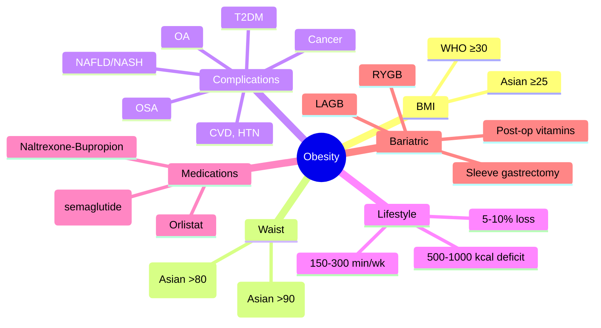

# Obesity- Assessment, Complications & Management

**Related:** [[Nutritional Factors in Disease MOC]], [[Davidson Chapter 22 - Nutritional Factors in Disease Hierarchy]], [[../00_Index/Medicine MOC|Medicine MOC]]

> [!important]
> **Obesity = BMI ≥30 (WHO); Asian ≥25; visceral adiposity (waist >94 cm M / >80 cm F); complications: T2DM, CVD, NAFLD, OSA, OA, cancers; management: lifestyle (500-1000 kcal deficit, 150 min exercise), medications (orlistat, semaglutide, bupropion-naltrexone), bariatric surgery (BMI ≥40 or ≥35 with comorbidity).**

## 1. Learning Objectives
- [ ] Define obesity: WHO BMI ≥30; Asian BMI ≥25; visceral adiposity by waist (M >102, F >88; Asian M >90, F >80)
- [ ] Recognise complications: T2DM, CVD, NAFLD/NASH, OSA, OA, cancer (endometrial, breast, colon), depression, infertility
- [ ] State assessment: BMI, waist, waist:hip, body composition (BIA), Edmonton/Stunkard classification, eating disorder screen
- [ ] Apply lifestyle interventions: 500-1000 kcal/day deficit; 5-10% weight loss; 150-300 min/week exercise
- [ ] Describe medications: orlistat (Pancreatic lipase inhibitor), semaglutide 2.4 mg (GLP-1 agonist), liraglutide, naltrexone-bupropion (Mysimba), phentermine-topiramate
- [ ] State bariatric surgery indications: BMI ≥40 (or ≥35 with comorbidity), BMI ≥30 with T2DM (some guidelines); Roux-en-Y gastric bypass (RYGB), sleeve gastrectomy (SG), adjustable gastric band (LAGB)

## 2. Definitions / Key Concepts

| Term | Definition |
|------|------------|
| **BMI (Body Mass Index)** | Weight (kg) / Height² (m²) |
| **WHO BMI cut-offs** | <18.5 underweight; 18.5-24.9 normal; 25-29.9 overweight; 30-34.9 class I; 35-39.9 class II; ≥40 class III (morbid) |
| **Asian BMI cut-offs** | <18.5 under; 18.5-22.9 normal; 23-27.5 overweight; ≥27.5 obese (lower due to ↑metabolic risk) |
| **Waist Circumference** | M >102 cm (Asian >90); F >88 cm (Asian >80) = visceral obesity |
| **Waist:Hip Ratio** | M >0.9; F >0.85 (abdominal obesity) |
| **Adipocyte Biology** | ↑Fat storage → hypertrophy; ↑inflammation (TNF-α, IL-6); adiponectin ↓; leptin resistance |
| **NAFLD** | Non-alcoholic fatty liver disease; steatosis; progression to NASH, fibrosis, cirrhosis, HCC |
| **NASH** | Non-alcoholic steatohepatitis; steatosis + inflammation + hepatocyte injury |
| **MHO** | Metabolically healthy obesity; absence of metabolic complications (controversial) |
| **Metabolic Syndrome (IDF 2006)** | Central obesity (waist) + 2 of: TG ≥1.7, HDL low (M <1.0, F <1.3), BP ≥130/85, FPG ≥5.6, or Rx |
| **Bariatric Surgery** | RYGB (gold standard), SG (most common), LAGB, BPD/DS |
| **GLP-1 Receptor Agonist (Semaglutide, Liraglutide)** | Incretin; ↓glucagon, ↓gastric emptying, ↑satiety; weight loss 5-15% (semaglutide 15-20%) |
| **Orlistat** | Pancreatic lipase inhibitor; ↓fat absorption 30%; modest weight loss; GI side effects (oily stool) |
| **Naltrexone-Bupropion (Mysimba)** | ↓food reward; weight loss 5-10% |
| **Binge Eating Disorder (BED)** | Recurrent binge eating without compensatory behaviours; common in obesity |
| **Y-Y Gastric Bypass (RYGB)** | Biliopancreatic + alimentary limb; ~70% EWL; gold standard; resolves T2DM 80% |
| **Sleeve Gastrectomy (SG)** | Gastric volume ↓; ~60% EWL; most common; less malabsorption |
| **Adjustable Gastric Band (LAGB)** | Restrictive; ~50% EWL; less common; adjustable, reversible |
| **Excess Weight Loss (%EWL)** | (Weight lost / excess weight) × 100; success = ≥50% EWL |

## 3. Core Content

### Section 1: Assessment
**Anthropometry:**
- **BMI** (WHO; Asian); weight, height
- **Waist** (visceral adiposity); M >102 (Asian >90); F >88 (Asian >80)
- **Waist:Hip ratio**; M >0.9; F >0.85
- **Neck circumference** (OSA risk); M >40 cm; F >36 cm
- **Body composition** (BIA, DEXA): fat mass, lean mass, body fat %
- **Skinfold thickness** (less accurate in obesity)

**Classification:**
- WHO: <18.5 underweight; 18.5-24.9 normal; 25-29.9 overweight; 30+ obese
- Asian: 18.5-22.9 normal; 23-27.5 overweight; ≥27.5 obese
- Edmonton (severity scale)
- STOP-BANG (OSA screening)

**Co-morbidity Screening:**
- T2DM: HbA1c, fasting glucose, OGTT
- Dyslipidaemia: TC, LDL, HDL, TG
- Hypertension: BP, ABPM
- NAFLD: LFTs, ultrasound, FibroScan
- OSA: STOP-BANG, Epworth Sleepiness Scale
- CVD risk: ASCVD calculator, QRISK3
- Depression/anxiety (PHQ-9, GAD-7)
- Eating disorder screen (SCOFF, EAT-26)
- Infertility, PCOS (women)
- Low testosterone (men)
- Cancer screening (endometrial, breast, colon, prostate)

### Section 2: Complications (Obesity Comorbidities)
**Metabolic:**
- **T2DM** (RR 10-30×); insulin resistance
- **Dyslipidaemia:** ↑TG, ↓HDL, ↑small dense LDL
- **Hypertension** (RR 2-6×)
- **Metabolic syndrome** (30%)
- **Hyperuricaemia, gout**

**Cardiovascular:**
- **Coronary artery disease** (RR 2-3×)
- **Heart failure** (preserved EF — HFpEF)
- **Atrial fibrillation**
- **Stroke** (ischaemic)
- **Venous thromboembolism** (DVT/PE)

**Respiratory:**
- **Obstructive sleep apnoea (OSA):** 40-70% of morbidly obese
- **Obesity hypoventilation syndrome (OHS):** BMI ≥40, ↑PaCO2, sleep-disordered breathing
- **Asthma** (worse control)
- **PE** (↑risk)

**GI/Hepatic:**
- **NAFLD** (~70%); NASH (20%); cirrhosis, HCC
- **Gallstones** (cholesterol; ↑risk with rapid weight loss)
- **GERD**
- **Pancreatitis** (gallstones, hypertriglyceridaemia)

**Musculoskeletal:**
- **Osteoarthritis** (knees, hips)
- **Gout**
- **Back pain**
- **Sarcopenic obesity** (loss of lean mass in elderly)

**Reproductive:**
- **Women:** PCOS, infertility, gestational DM, pre-eclampsia, miscarriage
- **Men:** Hypogonadism, infertility, ↓testosterone

**Cancer:**
- Endometrial (RR 2-7×), breast (postmenopausal), colon, oesophageal, kidney, liver, pancreas, gallbladder, ovarian

**Psychosocial:**
- **Depression, anxiety** (bidirectional)
- **Binge eating disorder** (BED)
- **Stigma, discrimination**
- **↑Risk suicide**

**Renal:**
- **CKD, FSGS, nephrolithiasis**

**Skin:**
- **Acanthosis nigricans** (insulin resistance)
- **Striae, intertrigo, lymphoedema**
- **Cellulitis, erysipelas**

### Section 3: Management Algorithm
| Step | Indication | Action |
|------|-----------|--------|
| **1. Lifestyle** | All | Calorie restriction 500-1000 kcal/day; balanced diet (Mediterranean); 150-300 min/wk exercise; behavioural therapy |
| **2. Pharmacotherapy** | BMI ≥30 OR ≥27 with comorbidity | Orlistat, semaglutide, liraglutide, naltrexone-bupropion, phentermine-topiramate |
| **3. Bariatric Surgery** | BMI ≥40 (Asian ≥37.5), OR ≥35 with comorbidity (Asian ≥32.5), OR ≥30 with T2DM (some) | RYGB, SG, LAGB, BPD/DS |
| **4. Maintenance** | All post-loss | Long-term follow-up; diet; exercise; medication; consider surgery |

### Section 4: Lifestyle Interventions
**Diet:**
- **Calorie deficit 500-1000 kcal/day** → 0.5-1 kg/week loss
- **Macronutrient distribution:** Mediterranean (40% CHO, 30% protein, 30% fat); low-fat; low-CHO; intermittent fasting
- **Behavioural:** Self-monitoring, goal-setting, problem-solving
- **Very low-calorie diets (VLCD):** 800 kcal/day; rapid loss; medical supervision; risk of gallstones
- **Plate method:** 1/2 vegetables, 1/4 protein, 1/4 complex CHO
- **Avoid:** Crash diets, fad diets, restrictive; focus on sustainable change

**Physical Activity:**
- **Aerobic:** 150-300 min/week moderate (walking, cycling, swimming)
- **Resistance:** 2-3 days/week (preserves lean mass)
- **Behavioural:** Pedometer, exercise buddy, scheduled
- **Start low, build up** (avoid injury)
- **Sitting time:** Reduce (≥7 hr/day = ↑mortality)

**Behavioural Therapy:**
- **CBT (Cognitive Behavioural Therapy):** Self-monitoring, stimulus control, problem-solving
- **Motivational interviewing**
- **Group support:** Weight Watchers, NHS programmes
- **Apps, wearables**

### Section 5: Pharmacotherapy
| Drug | Mechanism | Weight Loss | Notes |
|------|-----------|-------------|-------|
| **Orlistat (Xenical, Alli)** | Pancreatic lipase inhibitor | 3-5 kg (12 wk) | ↓Fat absorption 30%; GI side effects (oily stool, flatulence); multivitamin 2h apart; OTC 60 mg (Alli), Rx 120 mg |
| **Liraglutide (Saxenda 3 mg)** | GLP-1 receptor agonist | 5-8% | Daily SC; nausea (transient); pancreatitis; thyroid C-cell risk (avoid in MEN2) |
| **Semaglutide (Wegovy 2.4 mg)** | GLP-1 RA (long-acting) | 15-20% | Weekly SC; cardiovascular benefit (SELECT); T2DM benefit; STEP trials; expensive; shortage |
| **Tirzepatide (Mounjaro 15 mg)** | GIP/GLP-1 dual agonist | 20-25% | Weekly SC; SURMOUNT trials; T2DM; obesity approval |
| **Naltrexone-Bupropion (Mysimba)** | ↓Food reward, ↓appetite | 5-10% | Naltrexone (μ-opioid antagonist) + bupropion (NDRI); nausea, ↑BP; contraindicated in seizures, ↑ICP |
| **Phentermine-Topiramate (Qsymia)** | Sympathomimetic + anticonvulsant | 10-15% | Phentermine (anorectic) + topiramate (↓appetite); teratogenic (topiramate); CVD risk |
| **Bupropion (Zyban, off-label)** | NDRI | 3-5% | Monotherapy; contraindicated seizures, eating disorders |
| **Setmelanotide (Imcivree)** | MC4R agonist | 10-15% | Specific for POMC, LEPR, PCSK1 deficiency; rare genetic obesity |

### Section 6: Bariatric Surgery
**Indications (NICE):**
- BMI ≥40 (Asian ≥37.5)
- BMI 35-39.9 (Asian 32.5-37.5) with significant comorbidity (T2DM, HTN, OSA, NAFLD)
- BMI 30-34.9 (Asian 27.5-32.5) with T2DM (some)
- Failed conservative management (≥6 months)

**Procedures:**
| Procedure | %EWL | Mechanism | Comorbidities Resolved |
|-----------|-------|-----------|------------------------|
| **Roux-en-Y Gastric Bypass (RYGB)** | 60-80% | Restrictive + malabsorptive; small gastric pouch + Y-limb | T2DM 80%, HTN, OSA, dyslipidaemia |
| **Sleeve Gastrectomy (SG)** | 50-70% | Restrictive; ~75% stomach removed | T2DM 60-70%, HTN, OSA |
| **Adjustable Gastric Band (LAGB)** | 40-55% | Restrictive; inflatable band | Less comorbidity resolution; reversible |
| **BPD-DS (Biliopancreatic Diversion-Duodenal Switch)** | 70-90% | Malabsorptive | Most weight loss; most malabsorption; protein/vitamin deficiency |

**Complications:**
- **Early:** Anastomotic leak, bleeding, DVT/PE, infection, dumping syndrome (RYGB)
- **Late:** Stomal stenosis, marginal ulcer, gallstones, malnutrition (B12, Fe, Ca, D, protein), dumping
- **Re-operation:** 10-20% lifetime risk
- **Dumping:** Early (15-30 min; osmotic) vs Late (1-3 h; hypoglycaemia)
- **Wernicke, neuropathy** (B1, B12, Cu)

**Post-op Management:**
- **Lifelong multivitamins, B12, Fe, Ca, vit D**
- **B1, B12, B6, folate supplementation**
- **Quarterly + annual blood tests**
- **Pregnancy: avoid 12-18 months post-op** (malabsorption)
- **Dumping syndrome management:** Small meals, low simple carb, protein-rich

### Section 7: Special Considerations
- **MHO (Metabolically Healthy Obesity):** 10-30%; may not be "healthy" long-term; monitor for complications
- **Sarcopenic Obesity:** Loss of lean mass with obesity; resistance training + protein; elderly
- **Childhood Obesity:** Earlier = higher CV risk; family-based intervention; surgery rare (<18y)
- **PCOS + Obesity:** Weight loss improves ovulation, insulin; metformin; liraglutide
- **OSA + Obesity:** CPAP + weight loss; bariatric surgery improves OSA
- **NAFLD + Obesity:** Weight loss ≥10% improves fibrosis; lifestyle + pioglitazone/Vitamin E (NASH)

## 4. Clinical Correlation

| Scenario | Action | Notes |
|----------|--------|-------|
| 45M, BMI 34, T2DM, HTN, OSA | **Lifestyle + GLP-1 (semaglutide 2.4 mg) or bariatric surgery if BMI ≥35**; screen NAFLD | Multidisciplinary |
| 35F, BMI 42, T2DM, infertility | **Bariatric surgery (RYGB or SG)**; pre-op optimisation; b12, iron | Morbid obesity; T2DM |
| 55F, BMI 32, OA knees, NAFLD | **Lifestyle + orlistat 120 mg TDS**; Mediterranean; exercise | Moderate obesity |
| 30F, BMI 28, BED, depression | **CBT; mirtazapine 15 mg**; lifestyle; avoid bariatric (BED worse) | Mental health |
| 65F, BMI 36, post-MI, frailty, sarcopenia | **Protein 1.2-1.5 g/kg; resistance training; cautious weight loss** | Sarcopenic obesity |
| 50M, BMI 41, OSA (CPAP), NASH | **Bariatric surgery (SG)**; CPAP continues; screen HCC; lifestyle | Comorbidities |
| 25F, BMI 38, T2DM, failed lifestyle, medication | **Bariatric surgery**; post-op lifelong vitamins | NICE criteria met |

## 5. High-Yield FCPS/MRCP Points

> [!important]
> - **Must know:** WHO BMI ≥30 obesity (Asian ≥25); waist M >102 (Asian >90), F >88 (Asian >80); complications (T2DM, CVD, NAFLD, OSA, OA, cancer); lifestyle (500-1000 kcal deficit, 150-300 min/wk); medications (orlistat, semaglutide, naltrexone-bupropion); bariatric indications (BMI ≥40, ≥35 comorbidity); RYGB/SG types
> - **Common viva:** BMI cut-offs, waist criteria, complications, lifestyle, orlistat mechanism, GLP-1 RA, bariatric indications, post-op nutrition, dumping syndrome
> - **Exam trap:** Using BMI in athletes/muscle; not screening for OSA; missing B12 deficiency post-RYGB; thinking MHO is safe

## 6. Common Confusions / Exam Traps

| Trap | Correction |
|------|------------|
| BMI = adiposity | **BMI doesn't distinguish muscle vs fat**; use waist (visceral), body composition (BIA) |
| All obesity same | **MHO vs metabolically unhealthy**; complications vary |
| Orlistat safe | **GI side effects** (oily stool); vit deficiency (A, D, E, K); multivitamin 2h apart |
| Semaglutide for T2DM only | **Obesity (Wegovy 2.4 mg)** different dose; T2DM (Ozempic 0.5-2 mg) |
| Bariatric = cosmetic | **Medical procedure**; mortality benefit; comorbidity resolution; long-term monitoring |
| RYGB = SG | **RYGB = bypass + malabsorption**; **SG = restrictive only**; RYGB higher weight loss, more complications |
| BED = anorexia | **BED = binge without compensation**; common in obesity; bariatric may worsen |
| MHO = benign | **Not benign long-term**; monitor for metabolic complications |

## 7. Mnemonics

- **BMI cut-offs:** **25 overweight, 30 obese, 40 morbid**; Asian **23, 27.5**
- **Waist cut-offs:** M **>102** (Asian **>90**), F **>88** (Asian **>80**)
- **Complications:** **D**iabetes, **C**VD, **NAFLD**, **OSA**, **OA**, **C**ancer, **PCOS**, **D**epression = **DCNA-OCD**
- **Lifestyle:** **500-1000 kcal deficit; 5-10% loss; 150-300 min/wk**
- **Orlistat:** **O**ily **S**tool (lipase inhibition); multivitamin 2h apart
- **GLP-1:** **S**emaglutide **W**eekly **2.4 mg** → **15-20% loss**; nausea
- **Bariatric surgery:** **R**YGB **G**old **S**tandard; **S**leeve **M**ost **C**ommon
- **Indications:** **BMI ≥40 (Asian ≥37.5)** or **≥35 (≥32.5) + comorbidity**
- **Post-op nutrition:** **Lifelong B12, Fe, Ca, vit D, multivitamin**
- **Dumping:** **E**arly 30 min (osmotic); **L**ate 3h (hypoglycaemia)
- **MHO:** M**etabolically **H**ealthy **O**besity (transient, monitor)
- **Sarcopenic obesity:** Loss of lean mass; resistance exercise; protein 1.2-1.5 g/kg

## 8. Mind Map

## 9. -Hour Recall Prompts
1. BMI: WHO ≥30, Asian ≥25; waist M >102 (Asian >90), F >88 (Asian >80)
2. Complications: T2DM, CVD, NAFLD, OSA, OA, cancer
3. Lifestyle: 500-1000 kcal deficit, 5-10% loss, 150-300 min/wk
4. Orlistat: lipase inhibitor; GI side effects; multivitamin 2h apart
5. Semaglutide 2.4 mg: 15-20% weight loss; weekly SC
6. Bariatric: BMI ≥40, ≥35 comorbidity; RYGB gold standard
7. RYGB vs SG: RYGB = bypass + malabsorption; SG = restrictive
8. Post-op nutrition: lifelong B12, Fe, Ca, vit D, multivitamin

## 10. -Day / 15-Day / 30-Day Revision Tracker

| Day | Date | Recall Quality (1-5) | Time Spent | Notes |
|-----|------|---------------------|------------|-------|
| 1   |      |                     |            |       |
| 7   |      |                     |            |       |
| 15  |      |                     |            |       |
| 30  |      |                     |            |       |

---

## 11. Must Know / Should Know / Nice to Know

| Priority | Content |
|----------|---------|
| **Must Know 🔴** | BMI/WHO, Asian cut-offs; waist criteria; complications; lifestyle (500-1000 kcal, 150-300 min/wk); orlistat, semaglutide, naltrexone-bupropion; bariatric indications; RYGB/SG types; post-op nutrition |
| **Should Know 🟡** | MHO, sarcopenic obesity; NAFLD/NASH; OSA screening (STOP-BANG); phentermine-topiramate; tirzepatide; setmelanotide (genetic); RYGB 80% T2DM resolution; B12/Fe post-op; dumping |
| **Nice to Know 🟢** | GLP-1 mechanism; microbiota in obesity; setmelanotide (POMC deficiency); BPD-DS; preconception delay 12-18 months; SET/SURMOUNT trials; bariatric endoscopy |

## 12. My Weak Points
- [ ] GLP-1 RA mechanism detail
- [ ] Tirzepatide dual GIP/GLP-1 agonist
- [ ] BPD-DS specifics

## 13. Self-Test Scorecard

| Domain | Score /10 | Target /10 |
|--------|-----------|------------|
| Understanding |    | 8+ |
| Recall |    | 8+ |
| MCQ Performance |    | 8+ |
| SBA Performance |    | 8+ |
| Viva Confidence |    | 8+ |
| **TOTAL** |    | **40+/50** |

## 14. Exam Answer Modes

### Long Answer / Essay (20 min)
**Topic:** "Obesity: assessment, complications, and management"
- BMI (WHO ≥30, Asian ≥25); waist criteria (M >102/Asian >90, F >88/Asian >80)
- Complications: T2DM, CVD, NAFLD, OSA, OA, cancer, PCOS, depression
- Lifestyle: 500-1000 kcal deficit, 5-10% loss, 150-300 min/wk; behavioural therapy
- Medications: orlistat (lipase inhibitor, 3-5 kg), semaglutide 2.4 mg (GLP-1, 15-20%), naltrexone-bupropion (5-10%), phentermine-topiramate
- Bariatric surgery: BMI ≥40 or ≥35 comorbidity; RYGB (gold standard, 70% EWL, T2DM 80%) vs SG (most common, 60% EWL)
- Post-op: lifelong multivitamins, B12, Fe, Ca, vit D; quarterly + annual monitoring; dumping syndrome management

### Short Note (7 min)
**Topic:** "Bariatric Surgery: RYGB vs Sleeve Gastrectomy"
| Feature | RYGB | Sleeve Gastrectomy |
|---------|------|-------------------|
| **Type** | Restrictive + malabsorptive | Restrictive only |
| **%EWL** | 60-80% | 50-70% |
| **Anatomy** | Small gastric pouch + Y-limb | ~75% stomach removed |
| **T2DM resolution** | 80% | 60-70% |
| **Complications** | Anastomotic leak, marginal ulcer, dumping, malnutrition | Leak, reflux (late) |
| **Reversibility** | Difficult | Not reversible |
| **Nutrient def** | B12, Fe, Ca, D, protein | Less malabsorption |

### Viva Answer (3 min)
**Q:** "Compare bariatric surgery options."
"A: **RYGB (Roux-en-Y Gastric Bypass):** Restrictive + malabsorptive; small gastric pouch + Y-limb; **60-80% EWL**; **T2DM resolution 80%**; more complications (anastomotic leak, marginal ulcer, dumping, malnutrition); more nutrient deficiency. **Sleeve Gastrectomy (SG):** Restrictive only; ~75% stomach removed; **50-70% EWL**; **T2DM 60-70%**; less malabsorption; reflux risk. **LAGB:** Restrictive, adjustable, reversible; less weight loss, less comorbidity resolution. **BPD-DS:** Most weight loss; most malabsorption; reserved for super-obesity."

### Ward Case Discussion (5 min)
**Case:** 40F, BMI 41, T2DM (HbA1c 8.5%), HTN, OSA on CPAP, NASH.
"Diagnosis: **Morbid obesity with multiple comorbidities**. **Action: 1) Multidisciplinary team** (endocrinologist, bariatric surgeon, dietitian, psychologist). 2) **Lifestyle:** calorie deficit, 5-10% loss target. 3) **Medications:** GLP-1 (semaglutide 2.4 mg) or consideration for bariatric. 4) **Bariatric surgery candidate** (BMI ≥40 OR ≥35 with comorbidity): RYGB or SG; **RYGB best for T2DM** (80% resolution). 5) **Pre-op:** sleep study optimisation (CPAP), T2DM control, NASH monitoring, vitamin D, B12. 6) **Post-op:** lifelong multivitamins, B12, Fe, Ca, vit D; quarterly bloods. 7) **Screen for BED** before surgery (relative contraindication). 8) **Pregnancy** delay 12-18 months post-op."

### Last-Night-Before-Exam Sheet (1 min
- **BMI:** WHO ≥30, Asian ≥25; class I 30-34.9, II 35-39.9, III ≥40
- **Waist:** M >102 (Asian >90), F >88 (Asian >80) = visceral obesity
- **Complications:** T2DM, CVD, NAFLD, OSA, OA, cancer
- **Lifestyle:** 500-1000 kcal deficit, 5-10% loss, 150-300 min/wk
- **Orlistat:** Lipase inhibitor; GI side effects; multivitamin 2h apart
- **Semaglutide 2.4 mg:** GLP-1, weekly SC, 15-20% weight loss
- **Bariatric:** BMI ≥40 or ≥35 comorbidity; RYGB (gold standard, 70% EWL) vs SG (most common, 60% EWL)
- **Post-op:** Lifelong B12, Fe, Ca, vit D, multivitamins; dumping syndrome (early osmotic, late hypoglycaemia)
- **Pregnancy:** Delay 12-18 months post-op
- **MHO:** Not benign; monitor

## 15. MCQs (10)

1. **WHO obesity classification (BMI):**
   A. ≥25  
   B. **≥30**  
   C. ≥35  
   D. ≥40  
   E. ≥45  

2. **Asian BMI cut-off for obesity:**
   A. ≥23  
   B. ≥25  
   C. **≥27.5**  
   D. ≥30  
   E. ≥35  

3. **Waist circumference cut-off for visceral obesity in European men:**
   A. >88 cm  
   B. >94 cm  
   C. **>102 cm**  
   D. >110 cm  
   E. >120 cm  

4. **Orlistat mechanism of action:**
   A. Appetite suppressant (serotonergic)  
   B. **Pancreatic lipase inhibitor (↓fat absorption 30%)**  
   C. GLP-1 receptor agonist  
   D. Norepinephrine reuptake inhibitor  
   E. Endocannabinoid antagonist  

5. **Semaglutide 2.4 mg (Wegovy) for obesity achieves:**
   A. 5-8% weight loss  
   B. 10-12% weight loss  
   C. **15-20% weight loss**  
   D. 25-30% weight loss  
   E. 30-40% weight loss  

6. **Bariatric surgery NICE indication:**
   A. **BMI ≥40 (or ≥35 with significant comorbidity)**  
   B. BMI ≥30 alone  
   C. BMI ≥25 with comorbidity  
   D. Any BMI with T2DM  
   E. BMI ≥50 only  

7. **T2DM resolution after Roux-en-Y Gastric Bypass (RYGB):**
   A. 20-30%  
   B. 40-50%  
   C. 60-70%  
   D. **~80%**  
   E. 95%  

8. **Dumping syndrome early (15-30 min after meal) mechanism:**
   A. Reactive hypoglycaemia  
   B. **Osmotic fluid shifts into small bowel (hyperosmolar food)**  
   C. Bacterial overgrowth  
   D. Bile acid malabsorption  
   E. Hypergastrinaemia  

9. **Post-bariatric surgery pregnancy recommendation:**
   A. Immediate  
   B. 6 months post-op  
   C. **12-18 months post-op** (avoid malabsorption)  
   D. 5 years post-op  
   E. Never pregnant  

10. **Asian waist circumference cut-off for visceral obesity (women):**
    A. >70 cm  
    B. **>80 cm**  
    C. >88 cm  
    D. >94 cm  
    E. >100 cm  

## 16. SBA Questions (5)

1. **A 45-year-old man, BMI 38, T2DM (HbA1c 8.5%), HTN, OSA on CPAP, NASH. Failed lifestyle. Best next step?**
   A. Orlistat  
   B. Semaglutide 2.4 mg  
   C. **Bariatric surgery (RYGB or SG; BMI ≥35 + comorbidity)**  
   D. Phentermine  
   E. Continue lifestyle only  

2. **A 35-year-old woman, BMI 42, T2DM, infertility, NASH. Best management?**
   A. Orlistat only  
   B. Semaglutide 2.4 mg  
   C. **Bariatric surgery (RYGB preferred for T2DM and fertility)**  
   D. Low-fat diet only  
   E. Metformin only  

3. **A 55-year-old, BMI 32, knee OA, NAFLD, otherwise well. Best first-line?**
   A. Bariatric surgery  
   B. **Lifestyle + orlistat or GLP-1; bariatric if BMI ≥35 with comorbidity**  
   C. TPN  
   D. NG tube feeding  
   E. TPN  

4. **A 40-year-old, post-RYGB 3 months ago, presents with fatigue, pallor, MCV 105. Most likely cause?**
   A. Iron deficiency  
   B. **Vitamin B12 deficiency (RYGB malabsorption)**  
   C. Folate deficiency  
   D. Hypothyroidism  
   E. Anaemia of chronic disease  

5. **A 45-year-old, BMI 35, T2DM, considering bariatric surgery. Best procedure for T2DM?**
   A. Adjustable gastric band (LAGB)  
   B. **Roux-en-Y Gastric Bypass (RYGB) - 80% T2DM resolution**  
   C. Sleeve gastrectomy (SG)  
   D. Intragastric balloon  
   E. Endoscopic sleeve  

## 17. Flashcards

- Q: BMI cut-offs  
  A: **WHO: ≥30 obese; Asian: ≥27.5 obese**; class III (morbid) ≥40
- Q: Waist criteria  
  A: **M >102 cm (Asian >90); F >88 cm (Asian >80)**
- Q: Lifestyle intervention  
  A: **500-1000 kcal deficit, 5-10% loss, 150-300 min/wk**
- Q: Orlistat mechanism  
  A: **Pancreatic lipase inhibitor; ↓fat absorption 30%; oily stool**
- Q: Semaglutide 2.4 mg  
  A: **GLP-1 RA; weekly SC; 15-20% weight loss; SELECT trial CV benefit**
- Q: Bariatric indications  
  A: **BMI ≥40 OR ≥35 + comorbidity (Asian: 37.5/32.5)**
- Q: RYGB vs SG  
  A: **RYGB: 60-80% EWL, T2DM 80%; SG: 50-70% EWL, T2DM 60-70%**
- Q: Post-op supplements  
  A: **Lifelong B12, Fe, Ca, vit D, multivitamin; quarterly + annual bloods**
- Q: Dumping syndrome  
  A: **Early 30 min (osmotic); Late 3h (hypoglycaemia)**
- Q: Pregnancy after bariatric  
  A: **Delay 12-18 months** (avoid malabsorption)
- Q: Complications of obesity  
  A: **T2DM, CVD, NAFLD, OSA, OA, cancer, PCOS, depression**

## 18. Answer Key with Explanations

### MCQs
1. **B** — WHO obesity: BMI ≥30 (25-29.9 overweight; 30-34.9 class I; 35-39.9 class II; ≥40 class III/morbid).
2. **C** — Asian BMI obesity: ≥27.5 (lower cut-offs due to ↑metabolic risk at lower BMI).
3. **C** — European waist: M >102 cm; Asian >90 cm; F >88 cm (Asian >80 cm).
4. **B** — Orlistat: pancreatic lipase inhibitor; ↓fat absorption 30%; GI side effects (oily stool); multivitamin 2h apart.
5. **C** — Semaglutide 2.4 mg (Wegovy) achieves 15-20% weight loss; STEP trials; CV benefit (SELECT).
6. **A** — Bariatric surgery NICE: BMI ≥40 OR ≥35 (Asian 37.5/32.5) with significant comorbidity.
7. **D** — RYGB achieves ~80% T2DM resolution (vs 60-70% for SG); mechanism: bypass of duodenum, ↓incretin, weight loss.
8. **B** — Dumping syndrome early (15-30 min): osmotic fluid shifts into small bowel (hyperosmolar food) → abdominal pain, diarrhoea, tachycardia.
9. **C** — Pregnancy after bariatric: delay 12-18 months post-op (avoid nutritional deficiencies, rapid weight loss).
10. **B** — Asian waist: F >80 cm (vs >88 European); M >90 cm (vs >102 European).

### SBAs
1. **C** — BMI 38 + T2DM + HTN + OSA + NASH: bariatric surgery (RYGB or SG); RYGB best for T2DM.
2. **C** — BMI 42 + T2DM + infertility + NASH: bariatric surgery (RYGB preferred for T2DM resolution and fertility).
3. **B** — BMI 32 + knee OA + NAFLD: lifestyle + orlistat/GLP-1; bariatric if BMI ≥35 with comorbidity (current is 32, may benefit from lifestyle + medication first).
4. **B** — Post-RYGB 3 months, fatigue, pallor, MCV 105: B12 deficiency (RYGB malabsorption; bypass of intrinsic factor binding site in terminal ileum/duodenum).
5. **B** — BMI 35, T2DM, considering bariatric: RYGB (Roux-en-Y) preferred for T2DM (~80% resolution) vs SG (60-70%).

## 19. Summary

**Obesity** is a **Must Know 🔴** topic for FCPS/MRCP.
**Key takeaway:** WHO BMI ≥30, Asian ≥25; waist M >102 (Asian >90), F >88 (Asian >80). **Complications: T2DM, CVD, NAFLD, OSA, OA, cancer, PCOS, depression.** **Lifestyle: 500-1000 kcal deficit, 5-10% loss, 150-300 min/wk.** Medications: **orlistat** (lipase inhibitor), **semaglutide 2.4 mg** (GLP-1, 15-20% loss), **naltrexone-bupropion, tirzepatide (20-25%)**. **Bariatric: BMI ≥40 or ≥35 comorbidity; RYGB (gold standard, 70% EWL, T2DM 80%) vs SG (most common, 60% EWL).** Post-op: lifelong B12, Fe, Ca, vit D; pregnancy delay 12-18 months.
**Exam focus:** BMI/waist, complications, lifestyle, medications (orlistat, semaglutide), bariatric indications, RYGB vs SG, post-op nutrition.
**Clinical relevance:** Global epidemic; chronic disease management; pre-op optimisation; long-term follow-up.

*Template version: 1.0 | Davidson 24e Ch 22 aligned | FCPS/MRCP oriented*
