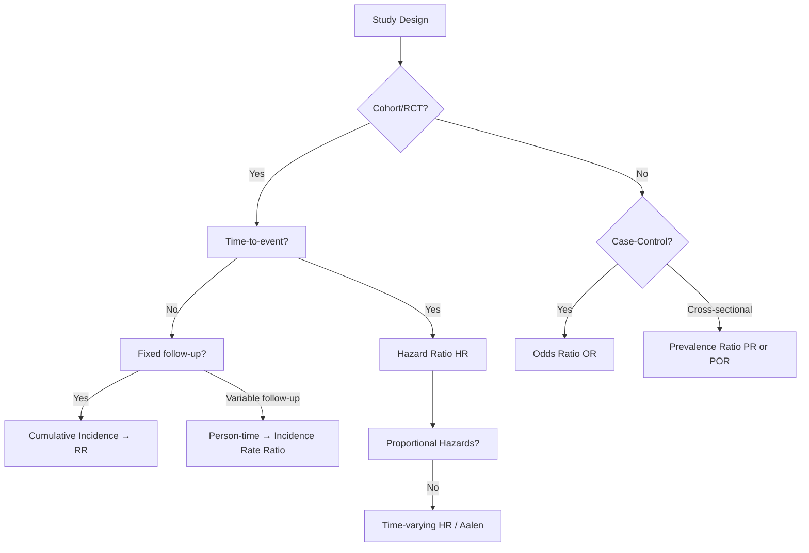

## 1. 1. Learning Objectives
By the end of this note you should be able to:
- [ ] Calculate and interpret Relative Risk (RR), Odds Ratio (OR), Hazard Ratio (HR)
- [ ] Calculate Attributable Risk (AR), Attributable Risk Percent (AR%), Population AR (PAR), PAR%
- [ ] Distinguish when to use RR vs OR vs HR
- [ ] Convert OR to RR when outcome is common (Zhang & Yu method)
- [ ] Interpret 95% CI crossing 1.0 (non-significant) vs not crossing (significant)

---

## 2. 2. Definition & Epidemiology

| Measure | Formula | When Used | Range |
|---------|---------|-----------|-------|
| **Relative Risk (RR)** | CIₑ / CIᵤ or IRₑ / IRᵤ | Cohort, RCT, cross-sectional (PR) | 0 – ∞ |
| **Odds Ratio (OR)** | (a×d)/(b×c) | Case-control, logistic regression, cross-sectional (POR) | 0 – ∞ |
| **Hazard Ratio (HR)** | h₁(t)/h₀(t) | Cox regression, survival analysis, time-to-event | 0 – ∞ |
| **Attributable Risk (AR)** | CIₑ – CIᵤ | Public health impact, absolute excess risk | -1 – +1 |
| **AR%** | (CIₑ – CIᵤ) / CIₑ × 100 | Proportion of exposed cases due to exposure | 0 – 100% |
| **Population AR (PAR)** | CIₚ – CIᵤ | Cases in population due to exposure | -1 – +1 |
| **PAR%** | (CIₚ – CIᵤ) / CIₚ × 100 | Proportion of all cases due to exposure | 0 – 100% |

**Notation:** CIₑ = cumulative incidence in exposed; CIᵤ = cumulative incidence in unexposed; CIₚ = cumulative incidence in total population; a,b,c,d = 2×2 table cells (a=exposed cases, b=exposed non-cases, c=unexposed cases, d=unexposed non-cases).

---

## 3. 3. Clinical Features / Presentation
*Methodological concept - see 2×2 table applications below.*

---

## 4. 4. Classification / Types of Association Measures

| Category | Measures | Study Design | Interpretation |
|----------|----------|--------------|----------------|
| **Risk Ratios** | RR, Risk Difference (RD=AR) | Cohort, RCT, cross-sectional | RR=1 no association; >1 risk factor; <1 protective |
| **Odds Ratios** | OR, Por | Case-control, cross-sectional, logistic regression | OR≈RR if outcome rare (<10%); otherwise OR>RR if RR>1 |
| **Rate Ratios** | HR, IRR | Survival, Poisson regression, person-time cohorts | HR = instantaneous risk ratio; assumes proportional hazards |
| **Absolute Measures** | AR, AR%, PAR, PAR%, NNT, NNH | All (complement to relative) | NNT=1/AR; NNH=1/|AR| for harm; policy-relevant |
| **Prevalence Measures** | Prevalence Ratio (PR), Prevalence OR (POR) | Cross-sectional | PR≈RR if duration similar; POR≈PR if rare |

---

## 5. 5. Diagnosis & Investigations (2×2 Table Framework)

```
                    Disease+
                    Disease-
          Exposed+      a           b          a+b
          Exposed-      c           d          c+d
                        a+c         b+d        n=a+b+c+d
```

**Key Calculations:**
- RR = [a/(a+b)] / [c/(c+d)]
- OR = (a×d) / (b×c)
- AR = a/(a+b) – c/(c+d)
- AR% = AR / [a/(a+b)] × 100
- Population incidence = (a+c)/n
- PAR = (a+c)/n – c/(c+d)
- PAR% = PAR / [(a+c)/n] × 100

**Mermaid: RR vs OR vs HR Decision Flow**


---

## 6. 6. Differential Diagnosis (Methodological Confusions)

| Confusion | Clarification |
|-----------|---------------|
| **RR vs OR** | OR = RR only when outcome rare (<10%) in BOTH groups. If outcome common, OR overestimates RR (if RR>1) or underestimates (if RR<1). Convert: RR = OR / [(1-P₀) + (P₀×OR)] where P₀ = risk in unexposed. |
| **HR vs RR** | HR = instantaneous risk ratio (time-varying); RR = cumulative risk ratio over entire follow-up. HR assumes proportional hazards. If PH violated, HR not constant. |
| **AR vs RR** | RR = relative (ratio); AR = absolute (difference). RR=2 could mean 2% vs 1% (AR=1%) or 80% vs 40% (AR=40%) - vastly different public health impact. |
| **PAR vs AR** | AR = excess risk in exposed; PAR = excess risk in whole population. PAR depends on exposure prevalence. PAR% = PAR / total incidence. |
| **NNT from RR** | NNT = 1 / (CER × (1-RRR)) where CER = control event rate, RRR = 1-RR. Cannot calculate NNT from RR alone! |

---

## 7. 7. Management (Interpretation & Application)

| Scenario | Correct Measure | Reasoning |
|----------|----------------|-----------|
| **RCT binary outcome** | RR (or RD/AR) | Direct risk comparison; intuitive for patients |
| **RCT time-to-event** | HR | Censoring, variable follow-up; Cox model |
| **Case-control** | OR | Cannot calculate incidence; OR unbiased estimator of RR if rare |
| **Cross-sectional** | PR or POR | Prevalence not incidence; PR if common, POR if rare |
| **Public policy** | PAR%, NNT | Absolute impact; resource allocation |
| **Patient counselling** | AR, NNT | "Your risk increases from 4% to 8%" vs "doubles" |
| **Meta-analysis** | OR (often) | Case-control only provide OR; convert if needed |

**Number Needed to Treat/Harm:**
```
NNT = 1 / |Control Event Rate – Treatment Event Rate| = 1 / |AR|
NNH = 1 / |AR| for adverse effects
```

---

## 8. 8. FCPS/MRCP High-Yield Summary (BULLET TABLE)

| Topic | Key Points |
|-------|------------|
| **RR interpretation** | RR=1.5: exposed 50% more likely; RR=0.5: 50% less likely (protective) |
| **OR ≠ RR when common** | If outcome >10% in controls, OR overstates RR. Example: 40% vs 20% → RR=2.0, OR=2.67 |
| **HR assumption** | Proportional hazards: HR constant over time. Check with log-log plots / Schoenfeld residuals |
| **AR% = (RR-1)/RR × 100** | AR% only depends on RR, not baseline risk! E.g., RR=2 → AR%=50% always |
| **PAR% = Pₑ × (RR-1) / [1 + Pₑ×(RR-1)]** | Pₑ = exposure prevalence in population. High Pₑ + high RR → high PAR% |
| **NNT from RCT** | NNT = 1 / (CER × RRR). RRR = 1-RR. E.g., CER=10%, RR=0.8 → ARR=2% → NNT=50 |
| **CI crossing 1.0** | 95% CI for RR/OR/HR including 1.0 = not statistically significant (p>0.05) |
| **RR 0.75 with CI 0.6–0.95** | Significant protection; NNT depends on baseline risk |

---

## 9. 9. Viva Questions (MRCP PACES / FCPS)

| Question | Expected Answer |
|----------|-----------------|
| **A cohort study finds OR=3.0 for smoking and lung cancer. Outcome is common (20% in non-smokers). What is approximate RR?** | Use Zhang & Yu: RR = OR / [(1-P₀) + P₀×OR] = 3.0 / [0.8 + 0.2×3] = 3.0 / 1.4 ≈ 2.14. OR overestimates RR. |
| **RCT: 10% event rate control, 7% treatment. Calculate RR, ARR, NNT.** | RR=0.7; ARR=3%; NNT=33. RRR=30%. |
| **Case-control: 80 cases, 120 controls. 60 cases exposed, 40 controls exposed. Calculate OR.** | OR = (60×80)/(20×60) = 4800/1200 = 4.0. |
| **What is Population Attributable Risk %? How does it differ from AR%?** | PAR% = proportion of ALL cases in population due to exposure. AR% = proportion of EXPOSED cases due to exposure. PAR% depends on exposure prevalence; AR% does not. |
| **When would HR ≠ RR in a trial?** | When hazards not proportional (crossing survival curves), or when follow-up incomplete and risks change over time. HR is instantaneous; RR is cumulative. |
| **A study reports RR=0.5 (95% CI 0.3–0.9). Is it significant? Interpret.** | CI excludes 1.0 → statistically significant (p<0.05). 50% relative risk reduction. True effect likely 10-70% reduction. |
| **If exposure prevalence is 50% and RR=2, what is PAR%?** | PAR% = 0.5×(2-1)/[1+0.5×(2-1)] = 0.5/1.5 = 33.3%. |
| **Why use absolute measures (AR, NNT) for clinical decisions?** | RR can be misleading: RR=2 for 0.1%→0.2% (AR=0.1%, NNT=1000) vs 40%→80% (AR=40%, NNT=2.5). Same RR, vastly different clinical impact. |

---

## 10. 10. Confusions & Mnemonics

| Confusion | Clarification |
|-----------|---------------|
| **Case-control gives OR not RR** | Cannot calculate incidence in case-control; OR is unbiased RR estimator ONLY if disease rare (<10%) |
| **Cross-sectional gives PR/POR** | Measures prevalence not incidence; PR overestimates RR if duration differs between groups |
| **Cox model HR** | Assumes proportional hazards; if violated, use time-varying coefficients or stratified Cox |
| **NNT needs baseline risk** | Cannot derive NNT from RR alone; need control event rate (CER) |

**Mnemonic: AR PAR NNT**
- **A**bsolute **R**isk = Risk difference
- **P**opulation **A**ttributable **R**isk = population impact
- **N**umber **N**eeded to **T**reat = 1/AR (clinical utility)

**Mnemonic: RROR-HR**
- **R**R = **R**isk **R**atio (Cohort/RCT)
- **O**R = **O**dds **R**atio (Case-control)
- **H**R = **H**azard **R**atio (Survival/Cox)

**Mnemonic: RARE DISEASE → OR≈RR**
- **R**are
- **A**nd
- **R**easonably
- **E**venly distributed → **OR ≈ RR**

---

## 11. 11. Mind Map

```mermaid
mindmap
  root((Measures of Association))
    Relative
      RR
        Cohort RCT
        CI or IR ratio
      HR
        Cox survival
        Proportional hazards
      PR POR
        Cross-sectional
    Odds
      OR
        Case-control
        Logistic regression
      POR
        Cross-section prevalence
    Absolute
      AR AR%
        Exposed group
        (RR-1)/RR
      PAR PAR%
        Whole population
        Depends on P_exposure
      NNT NNH
        1/|AR|
        Clinical decisions
    Conversions
      OR to RR
      Zhang-Yu formula
      RR=OR/[(1-P0)+P0×OR]
```

---

## 12. 12. One-Page Revision Card

| Domain | Key Points |
|--------|------------|
| **RR** | CIₑ/CIᵤ or IRₑ/IRᵤ. Cohort, RCT. RR=1 no assoc. |
| **OR** | (a×d)/(b×c). Case-control, logistic. ≈RR if rare. |
| **HR** | h₁(t)/h₀(t). Cox model. PH assumption critical. |
| **AR** | CIₑ – CIᵤ. Absolute excess risk in exposed. |
| **AR%** | (RR-1)/RR × 100. Fraction exposed cases due to exposure. |
| **PAR** | CIₚ – CIᵤ. Population excess risk. |
| **PAR%** | Pₑ×(RR-1)/[1+Pₑ×(RR-1)]. Fraction ALL cases due to exposure. |
| **NNT** | 1/AR = 1/(CER×RRR). Need baseline risk. |
| **OR→RR** | RR = OR / [(1-P₀) + P₀×OR]. P₀ = unexposed risk. |
| **Significance** | 95% CI excludes 1.0 = significant. |

---

## 13. 13. Spaced Repetition Trackers

| Review Interval | Date Completed | Confidence (1-5) | Notes |
|-----------------|----------------|------------------|-------|
| 24 hours | | | |
| 7 days | | | |
| 15 days | | | |
| 30 days | | | |
| 90 days | | | |

---

## 14. 14. Self-Test Scorecard

| Section | Score /5 | Last Attempt |
|---------|----------|--------------|
| RR/OR/HR Definitions | | |
| 2×2 Table Calculations | | |
| AR/AR%/PAR/PAR% | | |
| NNT from RCT Data | | |
| OR→RR Conversion | | |
| CI Interpretation | | |
| Viva Questions | | |
| Mnemonics | | |

---

## 15. 15. Local Navigation

- **Parent Heading**: [[../Population Health and Epidemiology|Population Health and Epidemiology]]
- **Chapter Map**: [[../Population Health and Epidemiology Hierarchy|Hierarchy]]
- **Chapter MOC**: [[../Population Health and Epidemiology MOC|MOC]]
- **Related**: [[Measures of Disease Frequency (Incidence, Prevalence, Rates).md]], [[Bias, Confounding, Effect Modification.md]], [[Study Designs (Descriptive, Analytical, Experimental).md]]

---

#medicine #population-health #epidemiology #davidson #fcps #mrcp
