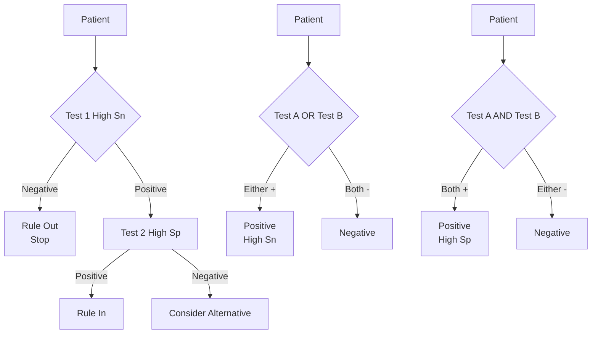

## 1. 1. Learning Objectives
By the end of this note you should be able to:
- [ ] Calculate and interpret sensitivity, specificity, PPV, NPV, likelihood ratios
- [ ] Apply Bayes theorem: pre-test probability → post-test probability using LRs
- [ ] Interpret ROC curve and AUC; choose optimal cut-point
- [ ] Distinguish validity (accuracy) vs reliability (precision/reproducibility)
- [ ] Apply to screening vs diagnostic test scenarios

---

## 2. 2. Definition & Epidemiology

| Metric | Formula | Interpretation | Range |
|--------|---------|----------------|-------|
| **Sensitivity (Sn)** | TP / (TP + FN) | Proportion of TRUE DISEASE correctly identified | 0–1 (100%) |
| **Specificity (Sp)** | TN / (TN + FP) | Proportion of TRUE NON-DISEASE correctly identified | 0–1 (100%) |
| **PPV** | TP / (TP + FP) | Probability disease GIVEN positive test | 0–1 |
| **NPV** | TN / (TN + FN) | Probability no disease GIVEN negative test | 0–1 |
| **LR+** | Sn / (1 – Sp) | How much odds of disease increase with +test | 0–∞ |
| **LR-** | (1 – Sn) / Sp | How much odds of disease decrease with -test | 0–∞ |
| **Accuracy** | (TP + TN) / Total | Overall correctness | 0–1 |
| **Youden Index** | Sn + Sp – 1 | Overall test performance (max at optimal cut-point) | -1 to +1 |

**2×2 Table:**
```
                    Disease+ (Gold Standard)
                    Disease-
          Test+      TP           FP          TP+FP
          Test-      FN           TN          FN+TN
                        TP+FN        FP+TN       Total
```

---

## 3. 3. Clinical Features / Presentation
*Methodological concept - see calculation examples and Bayes application below.*

---

## 4. 4. Classification / Test Characteristics by Purpose

| Test Purpose | Priority | Key Metric | Typical Values |
|--------------|----------|------------|----------------|
| **Screening** | High Sensitivity | Sn (rule OUT: SnNout) | Sn >95%, Sp moderate |
| **Confirmatory** | High Specificity | Sp (rule IN: SpPin) | Sp >95%, Sn moderate |
| **Diagnostic** | Balance | LR+, LR-, AUC | LR+ >10, LR- <0.1 |
| **Monitoring** | Reliability | ICC, CV, LoA | ICC >0.8, CV <10% |

**SnNout / SpPin:**
- **SnNout**: High Sensitivity → Negative test rules OUT disease (few false negatives)
- **SpPin**: High Specificity → Positive test rules IN disease (few false positives)

---

## 5. 5. Diagnosis & Investigations (Calculation & Bayes)

**Prevalence Impact on PPV/NPV:**
```
PPV = (Sn × Prev) / [Sn × Prev + (1-Sp) × (1-Prev)]
NPV = (Sp × (1-Prev)) / [(1-Sn) × Prev + Sp × (1-Prev)]
```

**Example: Sn=90%, Sp=95%, Prev=1%**
```
PPV = (0.9×0.01) / (0.9×0.01 + 0.05×0.99) = 0.009 / 0.0585 ≈ 15.4%
NPV = (0.95×0.99) / (0.1×0.01 + 0.95×0.99) = 0.9405 / 0.9415 ≈ 99.9%
```

**Bayes via Likelihood Ratios (Fagan's Nomogram):**
```
Pre-test odds = Pre-test prob / (1 – Pre-test prob)
Post-test odds = Pre-test odds × LR
Post-test prob = Post-test odds / (1 + Post-test odds)
```

**Mermaid: Bayes Flow**
```mermaid
flowchart LR
    A[Pre-test Probability\n(Prevalence/Clinical Suspicion)] --> B[Likelihood Ratio\nLR+ or LR-]
    B --> C[Post-test Odds = Pre-test Odds × LR]
    C --> D[Post-test Probability]
    style A fill:#bbf,stroke:#333
    style D fill:#bfb,stroke:#333
```

**ROC Curve & AUC:**
- **ROC**: Plot Sensitivity (y) vs 1-Specificity (x) across all cut-points
- **AUC**: Area Under Curve; 0.5 = useless, 0.7-0.8 = acceptable, 0.8-0.9 = excellent, >0.9 = outstanding
- **Optimal Cut-point**: Youden Index (Sn+Sp-1) maximum, or closest to (0,1), or cost-based

---

## 6. 6. Differential Diagnosis (Validity vs Reliability)

| Concept | Definition | Assessment |
|---------|------------|------------|
| **Validity (Accuracy)** | Does test measure what it claims? | Sensitivity, Specificity, PPV, NPV, AUC vs gold standard |
| **Reliability (Precision)** | Does test give consistent results? | ICC, Kappa, Cronbach's α, CV, Bland-Altman LoA |
| **Internal Validity** | Correct for study population | Bias control, confounding adjustment |
| **External Validity** | Generalisability to other populations | Representativeness, transportability |

**Reliability Metrics:**

| Type | Metric | Interpretation |
|------|--------|----------------|
| **Inter-rater** | Cohen's κ (categorical), ICC (continuous) | κ<0.2 poor, 0.2-0.4 fair, 0.4-0.6 moderate, 0.6-0.8 good, >0.8 excellent |
| **Intra-rater** | Same rater, repeat | Same metrics |
| **Test-retest** | Same subject, time interval | ICC, CV |
| **Internal Consistency** | Multi-item scale | Cronbach's α >0.7 acceptable, >0.9 may indicate redundancy |

**Bland-Altman (Continuous Variables):**
- Plot difference vs mean of two measurements
- **Bias** = mean difference
- **Limits of Agreement** = bias ± 1.96 SD of differences
- 95% of differences should lie within LoA

---

## 7. 7. Management (Test Selection & Interpretation)

| Scenario | Approach |
|----------|----------|
| **Rule OUT (screening)** | High Sn test; negative → disease unlikely (NPV high if prevalence low) |
| **Rule IN (confirm)** | High Sp test; positive → disease likely (PPV high if prevalence moderate-high) |
| **Diagnostic pathway** | High Sn test first (rule out), then high Sp test (rule in) |
| **Sequential testing** | Post-test prob of test 1 = pre-test prob of test 2 |
| **Parallel testing** | Either test positive = positive (↑Sn, ↓Sp) |
| **Series testing** | Both tests positive = positive (↑Sp, ↓Sn) |

**Mermaid: Sequential vs Parallel**


---

## 8. 8. FCPS/MRCP High-Yield Summary (BULLET TABLE)

| Topic | Key Points |
|-------|------------|
| **Sn/Sp fixed** | Test characteristics; do NOT change with prevalence |
| **PPV/NPV vary** | Depend critically on PREVALENCE (pre-test probability) |
| **Low prevalence → Low PPV** | Even excellent test: 1% prev, Sn95%/Sp95% → PPV=16% |
| **High prevalence → High PPV** | 50% prev, same test → PPV=95% |
| **LR+ >10** | Large increase in probability (rule IN) |
| **LR- <0.1** | Large decrease in probability (rule OUT) |
| **LR 0.5-2** | Minimal change; test not useful |
| **AUC 0.5** | No discrimination (diagonal line) |
| **AUC 1.0** | Perfect test |

---

## 9. 9. Viva Questions (MRCP PACES / FCPS)

| Question | Expected Answer |
|----------|-----------------|
| **Test has Sn 90%, Sp 95%. Disease prevalence 1%. What is PPV? NPV?** | PPV = 15.4%, NPV = 99.9%. Calculation: PPV = (0.9×0.01)/[(0.9×0.01)+(0.05×0.99)]. |
| **Same test, prevalence 30%. Now PPV?** | PPV = (0.9×0.3)/[(0.9×0.3)+(0.05×0.7)] = 0.27/0.305 ≈ 88.5%. PPV increases with prevalence. |
| **What is LR+? LR-? Interpret.** | LR+ = 0.9/0.05 = 18 (strong rule IN). LR- = 0.1/0.95 = 0.105 (moderate rule OUT). |
| **Pre-test prob 20%, LR+ 18. Post-test prob?** | Pre-test odds = 0.2/0.8 = 0.25. Post-test odds = 0.25 × 18 = 4.5. Post-test prob = 4.5/5.5 = 81.8%. |
| **Difference between validity and reliability?** | Validity = accuracy (does it measure truth? Sn/Sp). Reliability = precision (consistent? ICC/Kappa). |
| **Kappa 0.6 means?** | Good agreement. <0.2 poor, 0.2-0.4 fair, 0.4-0.6 moderate, 0.6-0.8 good, >0.8 excellent. |
| **What is AUC? What does 0.75 mean?** | Area under ROC curve. 0.75 = acceptable discrimination; 75% chance that random diseased has higher test value than random non-diseased. |
| **How choose optimal cut-point on ROC?** | Youden Index (Sn+Sp-1) max. Or closest to top-left (0,1). Or cost-minimising if FP/FN costs known. |
| **Serial vs Parallel testing - which increases Sn? Which increases Sp?** | Parallel (either +) → ↑Sn, ↓Sp. Series (both +) → ↑Sp, ↓Sn. |

---

## 10. 10. Confusions & Mnemonics

| Confusion | Clarification |
|-----------|---------------|
| **PPV/NPV vs Sn/Sp** | Sn/Sp are test properties (fixed). PPV/NPV depend on PREVALENCE. |
| **LR+ vs LR-** | LR+ = Sn/(1-Sp) for positive test. LR- = (1-Sn)/Sp for negative test. |
| **Pre-test prob ≠ Prevalence** | Pre-test prob = clinician's estimate for THIS patient. Prevalence = population average. Use pre-test prob for Bayes. |
| **Kappa vs % Agreement** | Kappa corrects for chance agreement. % agreement overestimates reliability. |
| **Screening vs Diagnostic** | Screening: asymptomatic, high Sn. Diagnostic: symptomatic, high Sp. |

**Mnemonic: SENSITIVITY = SnNout**
- **S**ensitivity
- **N**egative test
- **N**egates (rules) **O**ut

**Mnemonic: SPECIFICITY = SpPin**
- **S**pecificity
- **P**ositive test
- **P**ositive (rules) **I**n

**Mnemonic: PREVALENCE IMPACT**
- **P**revalence **L**ow → **P**PV **L**ow
- **P**revalence **H**igh → **P**PV **H**igh

**Mnemonic: LIKELIHOOD RATIOS**
- **LR+** = **L**arge **R**ise (rule in) = Sn/(1-Sp)
- **LR-** = **L**arge **R**eduction (rule out) = (1-Sn)/Sp
- **LR 1** = **U**seless

**Mnemonic: RELIABILITY TYPES**
- **I**nter-rater (between people)
- **I**ntra-rater (same person)
- **T**est-retest (over time)
- **I**nternal consistency (items)

---

## 11. 11. Mind Map

```mermaid
mindmap
  root((Diagnostic Accuracy))
    Validity
      Sensitivity/Specificity
        SnNout / SpPin
        Fixed for test
      PPV/NPV
        Depend on prevalence
        Bayes theorem
      Likelihood Ratios
        LR+ = Sn/(1-Sp)
        LR- = (1-Sn)/Sp
        Fagan nomogram
      ROC/AUC
        AUC 0.5-1.0
        Youden cut-point
    Reliability
      Inter-rater (Kappa/ICC)
      Intra-rater
      Test-retest
      Internal consistency (Cronbach α)
      Bland-Altman LoA
    Application
      Screening (High Sn)
      Diagnostic (High Sp)
      Sequential (Sn then Sp)
      Parallel vs Series
```

---

## 12. 12. One-Page Revision Card

| Domain | Key Points |
|--------|------------|
| **Sensitivity** | TP/(TP+FN). Rule OUT if high (SnNout). |
| **Specificity** | TN/(TN+FP). Rule IN if high (SpPin). |
| **PPV** | TP/(TP+FP). Increases with prevalence. |
| **NPV** | TN/(TN+FN). Decreases with prevalence. |
| **LR+** | Sn/(1-Sp). >10 strong rule IN. |
| **LR-** | (1-Sn)/Sp. <0.1 strong rule OUT. |
| **Pre-test → Post-test** | Odds × LR. Prob = Odds/(1+Odds). |
| **AUC** | 0.5 useless, 0.7-0.8 acceptable, 0.8-0.9 excellent, >0.9 outstanding. |
| **Kappa** | <0.2 poor, 0.4-0.6 moderate, 0.6-0.8 good, >0.8 excellent. |
| **Screening** | High Sn. Diagnostic: High Sp. |

---

## 13. 13. Spaced Repetition Trackers

| Review Interval | Date Completed | Confidence (1-5) | Notes |
|-----------------|----------------|------------------|-------|
| 24 hours | | | |
| 7 days | | | |
| 15 days | | | |
| 30 days | | | |
| 90 days | | | |

---

## 14. 14. Self-Test Scorecard

| Section | Score /5 | Last Attempt |
|---------|----------|--------------|
| Sn/Sp/PPV/NPV Calculations | | |
| Bayes Theorem / LR | | |
| Prevalence Impact on PPV | | |
| ROC/AUC Interpretation | | |
| Validity vs Reliability | | |
| Kappa/ICC | | |
| Sequential/Parallel Testing | | |
| Viva Questions | | |
| Mnemonics | | |

---

## 15. 15. Local Navigation

- **Parent Heading**: [[../Population Health and Epidemiology|Population Health and Epidemiology]]
- **Chapter Map**: [[../Population Health and Epidemiology Hierarchy|Hierarchy]]
- **Chapter MOC**: [[../Population Health and Epidemiology MOC|MOC]]
- **Related**: [[Screening (Wilson-Jungner Criteria, Programs, Ethics).md]], [[Study Designs (Descriptive, Analytical, Experimental).md]], [[Measures of Disease Frequency (Incidence, Prevalence, Rates).md]]

---

#medicine #population-health #epidemiology #davidson #fcps #mrcp
