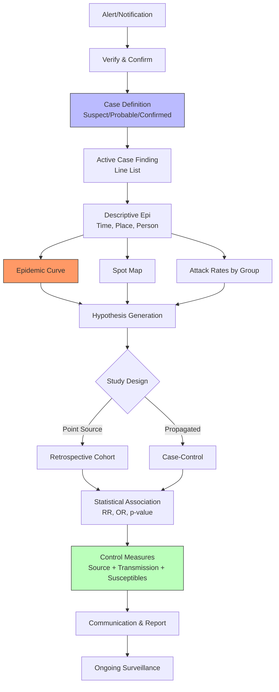
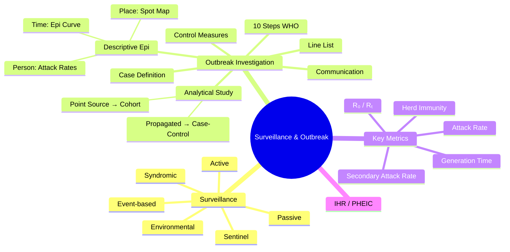

## 1. 1. Learning Objectives
By the end of this note you should be able to:
- [ ] Describe surveillance types: passive, active, sentinel, syndromic, event-based
- [ ] Apply WHO 10-step outbreak investigation framework
- [ ] Interpret epidemic curves: point source, propagated, continuous
- [ ] Calculate attack rates, secondary attack rates, R0, generation time
- [ ] Define PHEIC and IHR (2005) core capacities
- [ ] Distinguish isolation, quarantine, contact tracing

---

## 2. 2. Definition & Epidemiology

| Concept | Definition |
|---------|------------|
| **Surveillance** | Ongoing systematic collection, analysis, interpretation, dissemination of health data for action |
| **Outbreak** | Occurrence of cases in excess of expected in defined community/area/season |
| **Epidemic** | Widespread outbreak affecting large population |
| **Pandemic** | Epidemic spreading across countries/continents |
| **Endemic** | Constant presence at baseline level in geographic area |
| **R₀ (Basic Reproduction Number)** | Average secondary cases from 1 infectious in fully susceptible population |
| **Rₜ (Effective R)** | Average secondary cases at time t (with immunity/interventions) |
| **Generation Time** | Time between infection of infector and infectee |
| **Serial Interval** | Time between symptom onset in infector and infectee |

---

## 3. 3. Clinical Features / Presentation
*Methodological process - see outbreak steps and surveillance types below.*

---

## 4. 4. Classification / Surveillance Types

| Type | Description | Example | Pros/Cons |
|------|-------------|---------|-----------|
| **Passive** | Routine reporting from providers (mandatory/voluntary) | Notifiable diseases, cancer registry | Low cost, but incomplete, delayed, biased |
| **Active** | Health dept proactively contacts sources | Ebola contact tracing, AFP surveillance | Complete, timely; resource-intensive |
| **Sentinel** | Selected representative sites report | GP influenza sentinel, HIV sentinel | Detailed, timely; may not be representative |
| **Syndromic** | Pre-diagnostic data (symptoms, codes) | A&E chief complaint, NHS 111, OTC sales | Real-time, non-specific; early warning |
| **Event-based** | Unstructured info (media, rumors, social) | GPHIN, ProMED, HealthMap | Very early; unverified, noisy |
| **Environmental** | Pathogens in environment | Wastewater SARS-CoV-2, polio sewage | Population-level, non-invasive; no clinical data |

**Surveillance Attributes (CDC Updated Guidelines):**
- **Simplicity, Flexibility, Data Quality, Acceptability, Sensitivity, PVP, Representativeness, Timeliness, Stability**

---

## 5. 5. Diagnosis & Investigations (Outbreak Investigation)

**WHO 10-Step Outbreak Investigation:**
| Step | Action |
|------|--------|
| **1. Prepare** | Team, resources, PPE, communication plan |
| **2. Verify Diagnosis** | Confirm cases (lab/clinical), confirm outbreak (>expected) |
| **3. Case Definition** | Standardised: clinical + lab + time + place + person (suspect/probable/confirmed) |
| **4. Find Cases** | Active search: line lists, contact tracing, record review, media alerts |
| **5. Descriptive Epidemiology** | Time (epi curve), Place (spot map), Person (attack rates by age/sex/risk) |
| **6. Develop Hypotheses** | Agent, source, transmission route, risk factors |
| **7. Test Hypotheses** | Analytical study: cohort (point source) or case-control (propagated) |
| **8. Implement Control** | Source control, transmission interruption, protect susceptibles |
| **9. Communicate** | Outbreak report, public alerts, stakeholder briefings |
| **10. Maintain Surveillance** | Monitor control effectiveness, detect resurgence |

**Mermaid: Outbreak Investigation Flow**

**Epidemic Curve Patterns:**
| Pattern | Transmission | Example |
|---------|--------------|---------|
| **Point Source** | Single exposure, sharp peak, rapid decline | Foodborne (salmonella at wedding) |
| **Continuous Common Source** | Ongoing exposure, plateau | Contaminated water supply |
| **Propagated** | Person-to-person, serial peaks (generations) | Influenza, measles, COVID-19 |

**Key Calculations:**
- **Attack Rate** = Cases / Population at risk (in outbreak)
- **Secondary Attack Rate** = Secondary cases / Susceptible contacts (measures transmissibility)
- **R₀** = β × c × D (transmissibility × contact rate × duration infectious)
- **Herd Immunity Threshold** = 1 – 1/R₀

---

## 6. 6. Differential Diagnosis (Surveillance/Outbreak Confusions)

| Confusion | Clarification |
|-----------|---------------|
| **Surveillance vs Outbreak Investigation** | Surveillance = ongoing monitoring. Outbreak investigation = acute response to signal. |
| **Case Definition Levels** | Suspect (clinical), Probable (clinical + epi link), Confirmed (lab). Balance sensitivity (suspect) vs specificity (confirmed). |
| **Passive vs Active Surveillance** | Passive = await reports. Active = seek reports. Active more complete but costly. |
| **Epidemic Curve vs Time Series** | Epi curve = cases by time of onset (bars). Time series = continuous data points. |
| **R₀ vs Rₜ** | R₀ = theoretical, fully susceptible. Rₜ = real-time, with immunity/control. |
| **Isolation vs Quarantine** | Isolation = separates SICK (confirmed). Quarantine = separates EXPOSED (contacts). |

---

## 7. 7. Management (Control Measures)

| Target | Measures |
|--------|----------|
| **Source Control** | Case isolation, treatment, culling (animals), recall (food), water treatment |
| **Transmission Interruption** | PPE, hygiene, ventilation, vector control, safe sex, needle exchange, distancing |
| **Protect Susceptibles** | Vaccination (ring, mass), PEP (HIV, rabies), prophylaxis (malaria), immunoglobulin |
| **Administrative** | Travel restrictions, school closure, event cancellation, contact tracing, quarantine |

**Contact Tracing:**
- **Contact**: Person with exposure to confirmed case during infectious period
- **High-risk**: Household, healthcare, close proximity >15 min
- **Actions**: Quarantine, monitoring (symptoms), testing, vaccination/PEP if available

---

## 8. 8. FCPS/MRCP High-Yield Summary (BULLET TABLE)

| Topic | Key Points |
|-------|------------|
| **Surveillance Purpose** | Information for ACTION (not just data collection) |
| **Passive Surveillance** | Routine, low cost, incomplete (notifiable diseases) |
| **Active Surveillance** | Proactive, complete, resource-intensive (AFP, Ebola) |
| **Sentinel Surveillance** | Representative sites, detailed data (flu GP network) |
| **Syndromic Surveillance** | Pre-diagnostic, real-time, early warning (A&E, NHS 111) |
| **Case Definition** | Suspect/Probable/Confirmed; standardised; changes as outbreak evolves |
| **Epidemic Curve** | Point source (sharp), Continuous (plateau), Propagated (serial peaks) |
| **Outbreak Study** | Point source → Retrospective Cohort. Propagated → Case-Control |
| **R₀** | >1 = epidemic potential. Measles 12-18, COVID 2-3 (original), Flu 1.3 |
| **Herd Immunity** | 1 - 1/R₀. Measles 92-95%, COVID 50-67% (original) |
| **PHEIC** | Public Health Emergency of International Concern (IHR 2005) |

---

## 9. 9. Viva Questions (MRCP PACES / FCPS)

| Question | Expected Answer |
|----------|-----------------|
| **List the 10 steps of outbreak investigation.** | 1) Prepare, 2) Verify diagnosis, 3) Case definition, 4) Find cases, 5) Descriptive epi (time/place/person), 6) Hypotheses, 7) Test hypotheses (analytical study), 8) Control measures, 9) Communicate, 10) Ongoing surveillance. |
| **Difference between passive and active surveillance?** | Passive: routine provider reporting (low cost, incomplete). Active: health dept seeks data (complete, timely, costly). |
| **What is a case definition? Why standardise?** | Standard criteria (clinical+lab+time+place+person) for suspect/probable/confirmed. Ensures consistency, comparability, valid attack rates. |
| **Describe three epidemic curve patterns.** | Point source: single exposure, sharp peak. Continuous common source: ongoing exposure, plateau. Propagated: person-to-person, serial peaks (generations). |
| **Point source outbreak: which analytical study?** | Retrospective cohort (defined exposed group, calculate attack rates by exposure). |
| **Propagated outbreak: which analytical study?** | Case-control (cases vs controls, compare exposures). |
| **What is R₀? What does R₀ > 1 mean?** | Basic reproduction number: average secondary cases from 1 infectious in fully susceptible population. R₀ > 1 = each case generates >1 new case → epidemic potential. |
| **Herd immunity threshold formula? Calculate for R₀=3.** | 1 - 1/R₀ = 1 - 1/3 = 66.7%. |
| **Isolation vs quarantine?** | Isolation: separates sick/confirmed cases. Quarantine: separates exposed contacts (not yet ill). |
| **What is PHEIC? Who declares?** | Public Health Emergency of International Concern. WHO Director-General declares based on IHR Emergency Committee advice. |

---

## 10. 10. Confusions & Mnemonics

| Confusion | Clarification |
|-----------|---------------|
| **Line List** | One row per case: ID, demographics, clinical, exposure, outcome. Essential for descriptive epi. |
| **Attack Rate vs Incidence** | Attack rate = outbreak cumulative incidence in defined population over short period. |
| **Secondary Attack Rate** | Measures transmissibility in close contacts. High SAR = high transmissibility. |
| **Generation Time vs Serial Interval** | Generation = infection to infection. Serial = symptom to symptom. Serial ≈ Generation + incubation difference. |

**Mnemonic: OUTBREAK STEPS (10)**
- **O**utbreak team **P**repare
- **U**rgent **V**erify diagnosis
- **T**hink **C**ase definition
- **B**e **F**inding cases
- **R**ecord **D**escriptive epi
- **E**xplore **H**ypotheses
- **A**nalyse **T**est hypotheses
- **K**ontrol **M**easures

**Mnemonic: EPIDEMIC CURVES**
- **E**xplosive peak = **P**oint source
- **P**lateau = **C**ontinuous source
- **S**erial **P**eaks = **P**ropagated

**Mnemonic: SURVEILLANCE TYPES (PASS-SE)**
- **P**assive (routine)
- **A**ctive (proactive)
- **S**entinel (selected sites)
- **S**yndromic (pre-diagnostic)
- **E**vent-based (media/rumors)

**Mnemonic: ISOLATION vs QUARANTINE**
- **I**solation = **I**ll (sick, confirmed)
- **Q**uarantine = **Q**uestionable (exposed, not yet ill)

**Mnemonic: R-ZERO FORMULA**
- **R**₀ = **β** (transmissibility) × **c** (contacts) × **D** (duration)
- **H**erd **I**mmunity = **1 - 1/R₀**

---

## 11. 11. Mind Map

---

## 12. 12. One-Page Revision Card

| Domain | Key Points |
|--------|------------|
| **Surveillance** | Passive, Active, Sentinel, Syndromic, Event-based |
| **Outbreak Steps** | 10-step WHO: Prepare → Verify → Define → Find → Describe → Hypothesis → Test → Control → Communicate → Monitor |
| **Case Definition** | Suspect / Probable / Confirmed (standardised) |
| **Epi Curve** | Point (sharp), Continuous (plateau), Propagated (serial peaks) |
| **Study Design** | Point source → Cohort; Propagated → Case-Control |
| **Attack Rate** | Cases / At-risk in outbreak |
| **SAR** | Secondary cases / Susceptible contacts |
| **R₀** | β × c × D. >1 = epidemic |
| **Herd Immunity** | 1 - 1/R₀ |
| **Isolation/Quarantine** | Ill vs Exposed |
| **PHEIC** | WHO DG declares (IHR 2005) |

---

## 13. 13. Spaced Repetition Trackers

| Review Interval | Date Completed | Confidence (1-5) | Notes |
|-----------------|----------------|------------------|-------|
| 24 hours | | | |
| 7 days | | | |
| 15 days | | | |
| 30 days | | | |
| 90 days | | | |

---

## 14. 14. Self-Test Scorecard

| Section | Score /5 | Last Attempt |
|---------|----------|--------------|
| Surveillance Types | | |
| 10-Step Outbreak | | |
| Epidemic Curve Patterns | | |
| Cohort vs Case-Control | | |
| R₀ / SAR Calculations | | |
| Control Measures | | |
| IHR / PHEIC | | |
| Viva Questions | | |
| Mnemonics | | |

---

## 15. 15. Local Navigation

- **Parent Heading**: [[../Population Health and Epidemiology|Population Health and Epidemiology]]
- **Chapter Map**: [[../Population Health and Epidemiology Hierarchy|Hierarchy]]
- **Chapter MOC**: [[../Population Health and Epidemiology MOC|MOC]]
- **Related**: [[Notifiable Diseases & International Health Regulations.md]], [[Immunisation & Vaccination Programs.md]], [[Infectious Disease Epidemiology.md]]

---

#medicine #population-health #epidemiology #davidson #fcps #mrcp
