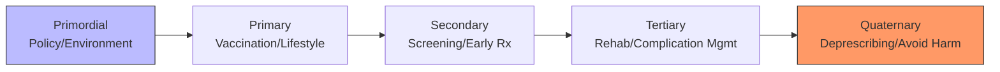
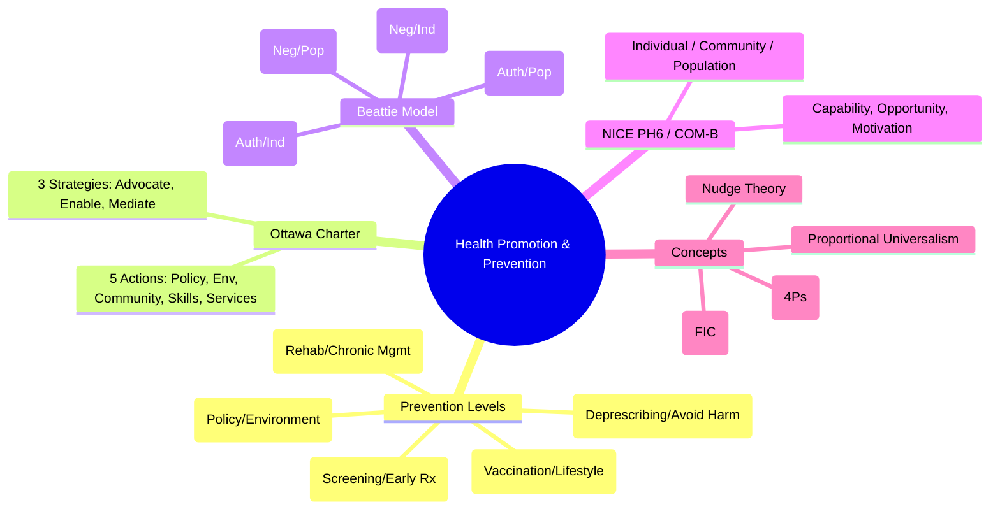

## 1. 1. Learning Objectives
By the end of this note you should be able to:
- [ ] Define and distinguish primary, secondary, tertiary, quaternary prevention
- [ ] Describe Ottawa Charter 5 action areas and 3 strategies
- [ ] Apply Beattie's model: health persuasion, legislative action, personal counselling, community development
- [ ] Explain NICE behaviour change: individual, community, population approaches
- [ ] Distinguish health promotion vs health education vs disease prevention
- [ ] Apply health literacy, social marketing, nudge theory, COM-B

---

## 2. 2. Definition & Epidemiology

| Concept | Definition |
|---------|------------|
| **Health Promotion** | Process of enabling people to increase control over, and improve, their health (Ottawa 1986) |
| **Disease Prevention** | Specific interventions to avoid disease onset or progression |
| **Primary Prevention** | Prevent disease BEFORE onset (reduce incidence) |
| **Secondary Prevention** | Early detection + intervention to halt progression (reduce prevalence/severity) |
| **Tertiary Prevention** | Reduce complications/disability from established disease (improve quality of life) |
| **Quaternary Prevention** | Protect from overmedicalisation/iatrogenic harm (avoid unnecessary interventions) |

---

## 3. 3. Clinical Features / Presentation
*Conceptual framework - see prevention examples by disease below.*

---

## 4. 4. Classification / Prevention Levels with Examples

| Level | Timing | Target | Examples |
|-------|--------|--------|----------|
| **Primordial** | Before risk factors emerge | Society/policy | Healthy urban design, trans fat bans, smoke-free laws, education |
| **Primary** | Before disease onset | At-risk / General | Vaccination, smoking cessation, healthy diet, exercise, fluoridation, condom use |
| **Secondary** | Early asymptomatic disease | Screen-detected | Screening (breast, cervical, bowel), BP/cholesterol checks, diabetic eye, pre-DM intervention |
| **Tertiary** | Established disease | Patients | Cardiac rehab, stroke rehab, diabetic foot care, CKD management, palliative care |
| **Quaternary** | Risk of overmedicalisation | Patients/providers | Deprescribing, avoiding defensive medicine, shared decision-making, Choosing Wisely |

**Mermaid: Prevention Spectrum**


---

## 5. 5. Diagnosis & Investigations (Frameworks & Models)

**Ottawa Charter (1986) - 5 Action Areas:**
| Area | Description |
|------|-------------|
| **1. Build Healthy Public Policy** | Legislation, fiscal measures, organisational change (tax, regulation, planning) |
| **2. Create Supportive Environments** | Physical/social environments enabling health (housing, transport, workplaces) |
| **3. Strengthen Community Action** | Empower communities, participation, ownership (community development) |
| **4. Develop Personal Skills** | Health education, life skills, literacy (individual empowerment) |
| **5. Reorient Health Services** | Shift from curative to preventive, primary care, health promotion in clinical settings |

**Ottawa Charter - 3 Strategies:**
- **Advocate** for health (political commitment)
- **Enable** equity (reduce disparities)
- **Mediate** between sectors (health + other sectors)

**Beattie's Model (4 Quadrants):**
| Quadrant | Approach | Focus | Example |
|----------|----------|-------|---------|
| **Health Persuasion** | Authoritative, top-down | Individual | Media campaigns, brief advice, nudges |
| **Legislative Action** | Authoritative, top-down | Population | Smoking ban, sugar tax, seatbelt law |
| **Personal Counselling** | Negotiated, bottom-up | Individual | Motivational interviewing, CBT, coaching |
| **Community Development** | Negotiated, bottom-up | Population | Peer support, community gardens, health champions |

**NICE Behaviour Change (PH6):**
- **Individual**: Brief advice, MI, CBT, digital interventions
- **Community**: Peer support, community champions, asset-based
- **Population**: Mass media, social marketing, fiscal/regulatory, environmental design

**COM-B Model (Michie):**
- **C**apability (Physical, Psychological)
- **O**pportunity (Social, Physical environment)
- **M**otivation (Reflective, Automatic)
→ **B**ehaviour

---

## 6. 6. Differential Diagnosis (Concept Confusions)

| Confusion | Clarification |
|-----------|---------------|
| **Health Promotion vs Disease Prevention** | Health promotion = broader, positive (enabling control). Disease prevention = specific, negative (avoiding disease). Overlap: vaccination is both. |
| **Primary vs Primordial** | Primordial = prevent risk factors from emerging (societal). Primary = prevent disease in those with/without risk factors. |
| **Secondary vs Screening** | Screening = tool for secondary prevention. Secondary prevention = early detection + intervention. |
| **Tertiary vs Rehabilitation** | Rehabilitation = key component of tertiary. Tertiary also includes chronic disease management, palliative care. |
| **Quaternary Prevention** | Newer concept: protecting patients from unnecessary medical interventions, overdiagnosis, overtreatment. |
| **Health Education vs Health Promotion** | Health education = information/knowledge. Health promotion = includes education PLUS policy, environment, empowerment. |

---

## 7. 7. Management (Implementation & Evaluation)

**Logic Model for Health Promotion:**
```
Inputs → Activities → Outputs → Outcomes (Short/Med/Long) → Impact
```

**Evaluation Types:**
| Type | Question | Example |
|------|----------|---------|
| **Process** | Was it delivered as planned? | Reach, fidelity, dose, satisfaction |
| **Impact** | Immediate effects? | Knowledge, attitudes, behaviour change |
| **Outcome** | Long-term health effects? | Incidence, mortality, QALYs, equity |
| **Economic** | Cost-effectiveness? | Cost per QALY, SROI |

**Equity in Health Promotion:**
- **Proportionate Universalism** (Marmot): Universal actions, scale/intensity proportionate to need
- **Targeted vs Universal**: Targeted = efficient but stigmatising; Universal = equitable but costly
- **Health Literacy**: Functional, Interactive, Critical (Nutbeam)

---

## 8. 8. FCPS/MRCP High-Yield Summary (BULLET TABLE)

| Topic | Key Points |
|-------|------------|
| **Primordial Prevention** | Prevent risk factor emergence (policy, environment). Trans fat ban, urban planning. |
| **Primary Prevention** | Vaccination, lifestyle, pre-exposure prophylaxis. Reduces INCIDENCE. |
| **Secondary Prevention** | Screening, early detection, early treatment. Reduces PREVALENCE/SEVERITY. |
| **Tertiary Prevention** | Rehab, chronic disease mgmt, palliative. Reduces COMPLICATIONS/DISABILITY. |
| **Quaternary Prevention** | Avoid overmedicalisation, deprescribing, Choosing Wisely. |
| **Ottawa Charter** | 5 Actions: Policy, Environment, Community, Skills, Services. 3 Strategies: Advocate, Enable, Mediate. |
| **Beattie's Model** | 4 quadrants: Persuasion, Legislation, Counselling, Community Development. |
| **NICE PH6** | Individual, Community, Population approaches. COM-B for diagnosis. |
| **Health Literacy** | Functional (read), Interactive (communicate), Critical (analyse). |
| **Social Marketing** | 4 Ps: Product, Price, Place, Promotion. Behaviour change focus. |

---

## 9. 9. Viva Questions (MRCP PACES / FCPS)

| Question | Expected Answer |
|----------|-----------------|
| **Define primary, secondary, tertiary prevention with examples.** | Primary: before onset (vaccination, smoking cessation). Secondary: early detection/screening (mammography, BP check). Tertiary: reduce complications (cardiac rehab, diabetic foot care). |
| **What is quaternary prevention?** | Protecting patients from overmedicalisation, overtreatment, iatrogenic harm. Deprescribing, shared decision-making, Choosing Wisely. |
| **Ottawa Charter 5 action areas?** | 1) Build healthy public policy, 2) Create supportive environments, 3) Strengthen community action, 4) Develop personal skills, 5) Reorient health services. |
| **Ottawa Charter 3 strategies?** | Advocate (political), Enable (equity), Mediate (cross-sector). |
| **Beattie's model - 4 quadrants?** | Authoritative top-down: Health Persuasion (individual), Legislative Action (population). Negotiated bottom-up: Personal Counselling (individual), Community Development (population). |
| **COM-B model components?** | Capability (Physical/Psychological), Opportunity (Social/Physical), Motivation (Reflective/Automatic) → Behaviour. |
| **Primordial vs Primary prevention?** | Primordial: prevent risk factors emerging (societal policy). Primary: prevent disease in at-risk individuals (vaccination, lifestyle). |
| **Health promotion vs health education?** | Health education = knowledge transfer. Health promotion = education + policy + environment + empowerment (Ottawa). |
| **Proportionate universalism?** | Universal services for all, but scale/intensity proportionate to disadvantage (Marmot). Reduces gradient, not just gap. |
| **Social marketing 4 Ps?** | Product (behaviour), Price (cost/barriers), Place (access), Promotion (communication). |

---

## 10. 10. Confusions & Mnemonics

| Confusion | Clarification |
|-----------|---------------|
| **Prevention levels = temporal** | Primordial → Primary → Secondary → Tertiary → Quaternary (chronological) |
| **Beattie axes** | X-axis: Authoritative ↔ Negotiated. Y-axis: Individual ↔ Population. |
| **Nudge Theory** | Libertarian paternalism: choice architecture alters behaviour without restricting options. |
| **SROI** | Social Return on Investment: monetises social/environmental outcomes. |

**Mnemonic: PREVENTION LEVELS (PSTQ)**
- **P**rimordial (Policy before risk)
- **S**econdary (Screening early)
- **T**ertiary (Treatment complications)
- **Q**uaternary (Quality/avoid harm)
- *Primary = Prevention before disease*

**Mnemonic: OTTAWA 5 ACTIONS (BCESS)**
- **B**uild **H**ealthy **P**olicy
- **C**reate **S**upportive **E**nvironments
- **S**trengthen **C**ommunity **A**ction
- **D**evelop **P**ersonal **S**kills
- **R**eorient **H**ealth **S**ervices

**Mnemonic: BEATTIE QUADRANTS**
- **A**uthoritative **P**opulation = **L**egislation
- **A**uthoritative **I**ndividual = **P**ersuasion
- **N**egotiated **P**opulation = **C**ommunity **D**evelopment
- **N**egotiated **I**ndividual = **C**ounselling

**Mnemonic: COM-B**
- **C**apability (Can I?)
- **O**pportunity (Do I have chance?)
- **M**otivation (Do I want to?)
→ **B**ehaviour

**Mnemonic: HEALTH LITERACY (FIC)**
- **F**unctional (Read/understand)
- **I**nteractive (Communicate/act)
- **C**ritical (Analyse/empower)

---

## 11. 11. Mind Map



---

## 12. 12. One-Page Revision Card

| Domain | Key Points |
|--------|------------|
| **Primordial** | Prevent risk emergence (policy, env) |
| **Primary** | Prevent onset (vaccines, lifestyle) |
| **Secondary** | Early detect + treat (screening) |
| **Tertiary** | Rehab, complication mgmt |
| **Quaternary** | Avoid overmedicalisation |
| **Ottawa 5** | Policy, Environment, Community, Skills, Services |
| **Ottawa 3** | Advocate, Enable, Mediate |
| **Beattie** | Auth/Ind=Persuasion, Auth/Pop=Legislation, Neg/Ind=Counselling, Neg/Pop=Community Dev |
| **COM-B** | Capability, Opportunity, Motivation → Behaviour |
| **Proportional Universalism** | Universal + proportionate to need |

---

## 13. 13. Spaced Repetition Trackers

| Review Interval | Date Completed | Confidence (1-5) | Notes |
|-----------------|----------------|------------------|-------|
| 24 hours | | | |
| 7 days | | | |
| 15 days | | | |
| 30 days | | | |
| 90 days | | | |

---

## 14. 14. Self-Test Scorecard

| Section | Score /5 | Last Attempt |
|---------|----------|--------------|
| Prevention Levels | | |
| Ottawa Charter | | |
| Beattie Model | | |
| COM-B / NICE PH6 | | |
| Health Literacy | | |
| Quaternary Prevention | | |
| Equity Concepts | | |
| Viva Questions | | |
| Mnemonics | | |

---

## 15. 15. Local Navigation

- **Parent Heading**: [[../Population Health and Epidemiology|Population Health and Epidemiology]]
- **Chapter Map**: [[../Population Health and Epidemiology Hierarchy|Hierarchy]]
- **Chapter MOC**: [[../Population Health and Epidemiology MOC|MOC]]
- **Related**: [[Screening (Wilson-Jungner Criteria, Programs, Ethics).md]], [[Immunisation & Vaccination Programs.md]], [[Health Needs Assessment.md]]

---

#medicine #population-health #epidemiology #davidson #fcps #mrcp
