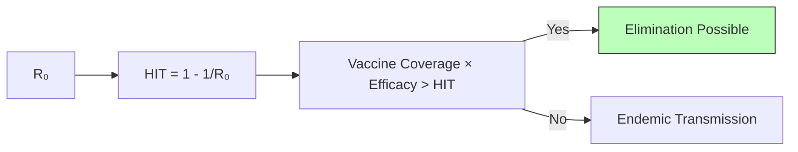
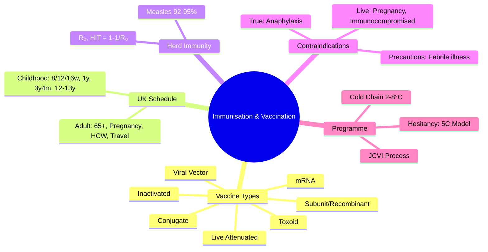

## 1. 1. Learning Objectives
By the end of this note you should be able to:
- [ ] Describe UK routine immunisation schedule (childhood, adolescent, adult, selective)
- [ ] Classify vaccine types: live attenuated, inactivated, subunit, mRNA, viral vector
- [ ] Calculate herd immunity threshold: 1 - 1/R₀
- [ ] Identify contraindications (true vs precaution) and precautions
- [ ] Explain cold chain, JCVI role, vaccine hesitancy (5C model)
- [ ] Apply to special groups: pregnancy, immunocompromised, travel, occupational

---

## 2. 2. Definition & Epidemiology

| Concept | Definition |
|---------|------------|
| **Vaccination** | Administration of vaccine to stimulate adaptive immunity |
| **Immunisation** | Process of becoming immune (includes vaccination + natural infection) |
| **Herd Immunity** | Indirect protection when sufficient population immune → transmission interrupted |
| **Vaccine Efficacy (VE)** | (1 - RR) × 100% in RCT; VE = (ARU - ARV)/ARU |
| **Vaccine Effectiveness** | Real-world protection (observational studies) |
| **Cold Chain** | 2-8°C storage/transport from manufacture to administration |
| **JCVI** | Joint Committee on Vaccination and Immunisation (UK advisory body) |

---

## 3. 3. Clinical Features / Presentation
*See schedule tables and vaccine types below.*

---

## 4. 4. Classification / Vaccine Types

| Type | Examples | Mechanism | Pros | Cons |
|------|----------|-----------|------|------|
| **Live Attenuated** | MMR, Varicella, Rotavirus, BCG, LAIV (nasal flu), Yellow Fever | Replicate weakly → strong humoral + cellular | Single dose often sufficient; durable; mucosal IgA | Contraindicated in pregnancy, immunocompromised; cold chain critical |
| **Inactivated/Whole Killed** | IPV, Hepatitis A, Rabies, Injectable Flu, Cholera | Dead pathogen → humoral mainly | Safe in immunocompromised, pregnancy | Multiple doses; boosters needed; weaker cellular |
| **Subunit/Recombinant** | Hepatitis B, HPV, MenB (4CMenB), Pertussis (acellular), Shingles | Purified antigen/protein | Safe; defined composition | Need adjuvant; multiple doses; cost |
| **Toxoid** | Diphtheria, Tetanus | Inactivated toxin | Prevents toxin-mediated disease | Boosters needed |
| **Conjugate** | Hib, MenACWY, PCV13/15/20 | Polysaccharide + protein carrier → T-cell dependent | Works in infants (<2y); memory | Cost |
| **mRNA** | COVID-19 (Pfizer, Moderna) | Host cells produce antigen | Rapid development; no live virus; strong response | Cold chain (-20/-70°C); reactogenicity |
| **Viral Vector** | COVID-19 (AstraZeneca, J&J), Ebola (rVSV) | Vector delivers gene | Strong cellular; single dose possible | Pre-existing vector immunity; rare VITT (AZ) |
| **VLP (Virus-Like Particle)** | HPV (Gardasil) | Self-assembling structural proteins | Non-infectious; high immunogenicity | Cost |

---

## 5. 5. Diagnosis & Investigations (UK Schedule)

**UK Routine Childhood Schedule (2024):**
| Age | Vaccines |
|-----|----------|
| **8 weeks** | DTaP/IPV/Hib/HepB (6-in-1), Rotavirus, MenB, PCV |
| **12 weeks** | DTaP/IPV/Hib/HepB (6-in-1), Rotavirus, PCV |
| **16 weeks** | DTaP/IPV/Hib/HepB (6-in-1), MenB |
| **1 year** | Hib/MenC, MMR, PCV booster, MenB booster |
| **2-10 years (annual)** | LAIV (nasal flu) |
| **3y 4m** | DTaP/IPV (pre-school booster), MMR 2nd dose |
| **12-13 years** | HPV (2 doses, 6-24m apart), MenACWY |
| **14 years** | Td/IPV (teenage booster), MenACWY (if missed) |

**UK Adult & Selective Programmes:**
| Group | Vaccines |
|-------|----------|
| **65+ years** | PPV23 (pneumococcal), Shingles (70-79), Flu (annual) |
| **Pregnancy** | Pertussis (16-32wks), Flu (any trimester), COVID, RSV (28wks+) |
| **Immunocompromised** | Additional PCV, MenB, HepB, inactivated flu (not LAIV) |
| **Healthcare Workers** | HepB, MMR, Varicella, BCG (if negative), Flu, COVID |
| **Travel** | HepA, Typhoid, Cholera, Yellow Fever, Rabies, JE, MenACWY |
| **Occupational** | HepB (lab, HCW), BCG (lab, vet, prison), Rabies (bat handlers) |

**Mermaid: Herd Immunity**

**Herd Immunity Thresholds:**
| Disease | R₀ | HIT (1-1/R₀) | Vaccine Efficacy | Coverage Needed |
|---------|-----|-------------|------------------|-----------------|
| Measles | 12-18 | 92-95% | 97% (2-dose MMR) | >95% |
| Pertussis | 12-17 | 92-94% | 80-85% | >95% |
| Polio | 5-7 | 80-86% | 99% (IPV) | >90% |
| Rubella | 6-7 | 83-86% | 97% (MMR) | >90% |
| Diphtheria | 6-7 | 83-86% | 95% | >90% |
| COVID (original) | 2.5-3 | 60-67% | ~90% | ~75% |

---

## 6. 6. Differential Diagnosis (Contraindications & Precautions)

| Category | True Contraindications | Precautions (Defer) |
|----------|----------------------|---------------------|
| **All Vaccines** | Anaphylaxis to vaccine/component | Acute febrile illness (>38.5°C) |
| **Live Vaccines** | Pregnancy, Severe immunocompromise (CD4<200, chemo, high-dose steroids), Anaphylaxis to neomycin/gelatin | Recent blood products (interval 3-11m), TB skin test timing |
| **Specific** | Encephalopathy <7d post-pertussis (DTaP), Intussusception hx (Rotavirus) | Thrombocytopenia (MMR), GBS <6wks post-vaccine |

**Egg Allergy:**
- **Influenza**: LAIV & inactivated OK (ovalbumin <0.12μg/ml); observe 15 min
- **Yellow Fever**: Contraindicated (higher ovalbumin); specialist referral
- **MMR**: Safe (grown in chick fibroblast, not egg)

---

## 7. 7. Management (Programme Delivery & Hesitancy)

**Cold Chain:**
- **2-8°C** standard; **monitor** with max-min thermometer/data logger
- **Breach**: Quarantine, risk assess, do NOT discard automatically; contact screening/immunisation team
- **Transport**: Validated cool boxes, ice packs, temperature monitoring

**Vaccine Hesitancy (WHO SAGE 5C Model):**
| Determinant | Description | Intervention |
|-------------|-------------|--------------|
| **Confidence** | Trust in safety/efficacy/system | Transparent data, HCW recommendation |
| **Complacency** | Low perceived risk | Risk communication, outbreaks reminders |
| **Convenience** | Access, cost, time | Extended hours, community venues, reminders |
| **Calculation** | Information seeking/weighing | Decision aids, tailored info |
| **Collective Responsibility** | Willingness to protect others | Altruism framing, community norms |

**JCVI Advice Process:**
Horizon scanning → Evidence review (burden, safety, efficacy, cost-effectiveness) → Modelling → Consultation → Statement → DHSC Minister → Implementation

---

## 8. 8. FCPS/MRCP High-Yield Summary (BULLET TABLE)

| Topic | Key Points |
|-------|------------|
| **Vaccine Types** | Live attenuated (MMR, Varicella, BCG, Rotavirus, LAIV) - contraindicated in pregnancy/immunocompromise |
| **Herd Immunity** | HIT = 1 - 1/R₀. Measles: R₀ 12-18 → HIT 92-95%. Need coverage × efficacy > HIT |
| **UK Schedule** | 8/12/16w: 6-in-1, Rotavirus, MenB, PCV. 1y: Hib/MenC, MMR, PCV, MenB. 3y4m: DTaP/IPV, MMR2. 12-13y: HPV, MenACWY |
| **Pregnancy** | Pertussis 16-32wks, Flu any trimester, COVID, RSV 28wks+ |
| **Contraindications** | Anaphylaxis (true). Live: pregnancy, severe immunocompromise. Precaution: acute febrile illness |
| **Egg Allergy** | Flu vaccines safe (low ovalbumin). Yellow fever contraindicated. MMR safe. |
| **Cold Chain** | 2-8°C. Breach: quarantine, risk assess, contact team. |
| **Vaccine Hesitancy** | 5C: Confidence, Complacency, Convenience, Calculation, Collective Responsibility |
| **JCVI** | Independent expert advisory committee; evidence-based recommendations |

---

## 9. 9. Viva Questions (MRCP PACES / FCPS)

| Question | Expected Answer |
|----------|-----------------|
| **Name live attenuated vaccines in UK schedule.** | MMR, Varicella, Rotavirus, BCG, LAIV (nasal flu), Yellow Fever (travel). Contraindicated in pregnancy and severe immunocompromise. |
| **What is herd immunity threshold for measles? How calculate?** | R₀=12-18. HIT=1-1/R₀ = 92-95%. Need vaccine coverage × efficacy > HIT. |
| **UK childhood immunisation schedule at 8, 12, 16 weeks?** | 8w: 6-in-1, Rotavirus, MenB, PCV. 12w: 6-in-1, Rotavirus, PCV. 16w: 6-in-1, MenB. |
| **Vaccines in pregnancy?** | Pertussis (16-32wks), Flu (any trimester), COVID, RSV (28wks+). All inactivated. |
| **True contraindications to vaccination?** | Anaphylaxis to vaccine/component. Live vaccines: pregnancy, severe immunocompromise. |
| **Egg allergy - which vaccines safe?** | Influenza (LAIV & inactivated) safe (ovalbumin <0.12μg). Yellow fever contraindicated. MMR safe. |
| **What is cold chain? Action on breach?** | 2-8°C storage/transport. Breach: quarantine vaccines, risk assess (duration, temp), contact immunisation team. Do NOT automatically discard. |
| **Vaccine hesitancy - WHO 5C model?** | Confidence, Complacency, Convenience, Calculation, Collective Responsibility. |
| **Difference between vaccine efficacy and effectiveness?** | Efficacy: RCT conditions (ideal). Effectiveness: real-world (observational). |
| **Conjugate vs plain polysaccharide vaccines?** | Conjugate (protein carrier) → T-cell dependent → works in infants, immunological memory. Plain polysaccharide → T-cell independent → no memory, poor <2y. |

---

## 10. 10. Confusions & Mnemonics

| Confusion | Clarification |
|-----------|---------------|
| **Vaccination vs Immunisation** | Vaccination = act of giving vaccine. Immunisation = process of becoming immune (includes natural infection). |
| **Efficacy vs Effectiveness** | Efficacy = RCT (ideal). Effectiveness = real world. Effectiveness ≤ Efficacy. |
| **LAIV vs Inactivated Flu** | LAIV: live attenuated, nasal, children 2-17y, contraindicated immunocompromised/pregnancy. Inactivated: injectable, all ages, safe in pregnancy/immunocompromised. |
| **MenB vs MenACWY** | MenB: 4CMenB (Bexsero), infant schedule. MenACWY: conjugate, adolescent/travel. |

**Mnemonic: LIVE VACCINES (UK)**
- **M**MR
- **V**aricella
- **R**otavirus
- **B**CG
- **L**AIV (nasal flu)
- **Y**ellow Fever

**Mnemonic: CONTRAINDICATIONS TO LIVE**
- **P**regnancy
- **I**mmunocompromise (severe)
- **A**naphylaxis to component

**Mnemonic: HERD IMMUNITY**
- **H**IT = **1 - 1/R₀**
- **M**easles **R**₀=12-18 → **H**IT=**92-95%**
- **C**overage × **E**fficacy > **H**IT

**Mnemonic: UK CHILDHOOD SCHEDULE (8-12-16-1)**
- **8w**: 6-in-1, Rota, MenB, PCV
- **12w**: 6-in-1, Rota, PCV
- **16w**: 6-in-1, MenB
- **1y**: Hib/MenC, MMR, PCV, MenB

**Mnemonic: PREGNANCY VACCINES**
- **P**ertussis (16-32wks)
- **F**lu (any)
- **C**OVID
- **R**SV (28wks+)

---

## 11. 11. Mind Map

---

## 12. 12. One-Page Revision Card

| Domain | Key Points |
|--------|------------|
| **Live Vaccines** | MMR, Varicella, Rotavirus, BCG, LAIV, Yellow Fever |
| **Contraindicated Live** | Pregnancy, Severe immunocompromise |
| **Herd Immunity** | HIT = 1 - 1/R₀. Measles 92-95% |
| **UK Childhood** | 8/12/16w: 6-in-1+Rota+MenB+PCV. 1y: Hib/MenC+MMR+PCV+MenB. 3y4m: DTaP/IPV+MMR2. 12-13y: HPV+MenACWY |
| **Pregnancy** | Pertussis 16-32w, Flu, COVID, RSV 28w+ |
| **Egg Allergy** | Flu OK. Yellow fever NO. MMR OK. |
| **Cold Chain** | 2-8°C. Breach: quarantine, assess, contact team |
| **Hesitancy 5C** | Confidence, Complacency, Convenience, Calculation, Collective |
| **JCVI** | Independent advisory; evidence → modelling → recommendation |

---

## 13. 13. Spaced Repetition Trackers

| Review Interval | Date Completed | Confidence (1-5) | Notes |
|-----------------|----------------|------------------|-------|
| 24 hours | | | |
| 7 days | | | |
| 15 days | | | |
| 30 days | | | |
| 90 days | | | |

---

## 14. 14. Self-Test Scorecard

| Section | Score /5 | Last Attempt |
|---------|----------|--------------|
| Vaccine Types | | |
| UK Schedule | | |
| Herd Immunity / HIT | | |
| Contraindications | | |
| Pregnancy Vaccines | | |
| Cold Chain | | |
| Hesitancy 5C | | |
| Viva Questions | | |
| Mnemonics | | |

---

## 15. 15. Local Navigation

- **Parent Heading**: [[../Population Health and Epidemiology|Population Health and Epidemiology]]
- **Chapter Map**: [[../Population Health and Epidemiology Hierarchy|Hierarchy]]
- **Chapter MOC**: [[../Population Health and Epidemiology MOC|MOC]]
- **Related**: [[Infectious Disease Epidemiology.md]], [[Disease Surveillance & Outbreak Investigation.md]], [[Health Promotion & Disease Prevention (Primary, Secondary, Tertiary).md]]

---

#medicine #population-health #epidemiology #davidson #fcps #mrcp
