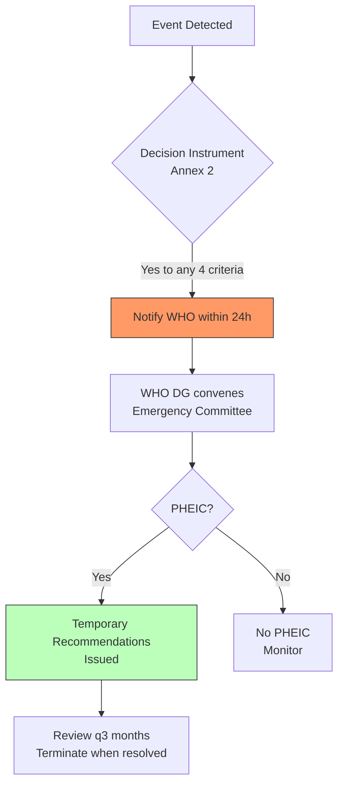
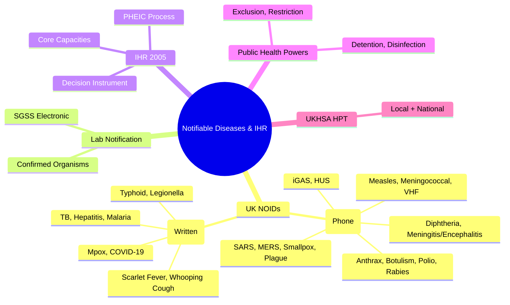

## 1. 1. Learning Objectives
By the end of this note you should be able to:
- [ ] List UK notifiable diseases (NOIDs) and causative organisms
- [ ] Describe statutory notification process: clinician → proper officer → UKHSA
- [ ] Explain International Health Regulations (IHR 2005): core capacities, PHEIC criteria
- [ ] Distinguish notifiable diseases, notifiable organisms, notifiable causative agents
- [ ] Apply Public Health Act powers: exclusion, restriction, detention
- [ ] Identify UKHSA/WHO reporting pathways and timelines

---

## 2. 2. Definition & Epidemiology

| Concept | Definition |
|---------|------------|
| **Notifiable Disease (NOID)** | Disease legally required to be reported by clinicians (clinical suspicion sufficient) |
| **Notifiable Organism** | Organism reported by laboratories (lab confirmation required) |
| **Proper Officer** | Consultant in Communicable Disease Control (CCDC) / UKHSA Health Protection Team |
| **IHR (2005)** | International Health Regulations - binding legal framework for global health security |
| **PHEIC** | Public Health Emergency of International Concern |
| **Core Capacities** | IHR required capabilities: surveillance, response, lab, risk communication, etc. |

---

## 3. 3. Clinical Features / Presentation
*See notification lists and processes below.*

---

## 4. 4. Classification / UK Notifiable Diseases (Health Protection Regulations 2010)

**Notifiable Diseases (Clinical Notification - Suspicion Sufficient):**
| Disease | Causative Organism | Urgency |
|---------|-------------------|---------|
| **Acute encephalitis** | Various (HSV, enterovirus, etc.) | Immediate |
| **Acute meningitis** | Bacterial, viral | Immediate |
| **Acute poliomyelitis** | Poliovirus | Immediate |
| **Anthrax** | Bacillus anthracis | Immediate |
| **Botulism** | Clostridium botulinum | Immediate |
| **Brucellosis** | Brucella spp. | Within 24h |
| **Cholera** | Vibrio cholerae O1/O139 | Immediate |
| **COVID-19** | SARS-CoV-2 | Within 24h |
| **Diphtheria** | Corynebacterium diphtheriae | Immediate |
| **Enteric fever (typhoid/paratyphoid)** | Salmonella Typhi/Paratyphi | Within 24h |
| **Food poisoning** | Various | Within 24h |
| **Haemolytic uraemic syndrome (HUS)** | STEC (E. coli O157) | Immediate |
| **Hepatitis A, B, C, E** | HAV, HBV, HCV, HEV | Within 24h (A/E immediate) |
| **Invasive Group A Strep (iGAS)** | S. pyogenes | Immediate |
| **Legionellosis** | Legionella pneumophila | Within 24h |
| **Leprosy** | Mycobacterium leprae | Within 24h |
| **Malaria** | Plasmodium spp. | Within 24h |
| **Measles** | Measles virus | Immediate |
| **Meningococcal septicaemia** | Neisseria meningitidis | Immediate |
| **MERS-CoV** | MERS coronavirus | Immediate |
| **Mpox** | Monkeypox virus | Immediate |
| **Plague** | Yersinia pestis | Immediate |
| **Rabies** | Rabies lyssavirus | Immediate |
| **Rubella** | Rubella virus | Immediate |
| **SARS** | SARS coronavirus | Immediate |
| **Scarlet fever** | S. pyogenes | Within 24h |
| **Smallpox** | Variola virus | Immediate |
| **Tetanus** | Clostridium tetani | Within 24h |
| **Tuberculosis** | Mycobacterium tuberculosis | Within 24h |
| **Typhus** | Rickettsia prowazekii | Within 24h |
| **Viral haemorrhagic fevers** | Ebola, Marburg, Lassa, etc. | Immediate |
| **Whooping cough** | Bordetella pertussis | Within 24h |
| **Yellow fever** | Yellow fever virus | Immediate |

**Notifiable Organisms (Laboratory Notification):**
- Salmonella spp., Shigella spp., E. coli O157, Campylobacter, Cryptosporidium, Giardia, Norovirus, Rotavirus
- Neisseria meningitidis, N. gonorrhoeae, S. pneumoniae, H. influenzae, Group A/B/C/G Strep
- Mycobacterium tuberculosis, Chlamydia trachomatis, HIV, Hepatitis viruses
- Influenza virus, RSV, SARS-CoV-2, MERS-CoV
- And many more per Public Health (Notification) Regulations

---

## 5. 5. Diagnosis & Investigations (Notification Process)

**Mermaid: UK Notification Flow**
```mermaid
flowchart TD
    A[Clinician Suspects NOID] --> B[Notify Proper Officer\nVerbally/Phone - IMMEDIATE]
    B --> C[Proper Officer (UKHSA HPT)]
    C --> D[Risk Assessment\nCase Definition]
    D --> E[Public Health Action\nContact tracing, exclusion, prophylaxis]
    E --> F[Lab Confirmation\nNotifiable Organism]
    F --> G[Lab → UKHSA\nElectronic (SGSS/Second Gen Sys)]
    G --> H[UKHSA National Surveillance]
    H --> I[Weekly/Monthly Reports\nWHO IHR Reporting]
    I --> J[Feedback to Clinician]
    style B fill:#f96,stroke:#333
    style E fill:#bfb,stroke:#333
```

**Notification Timelines:**
| Urgency | Examples | Action |
|---------|----------|--------|
| **Immediate** (phone) | Measles, meningococcal, VHF, anthrax, botulism, polio, rabies, SARS, MERS, smallpox, plague, diphtheria, acute meningitis/encephalitis, iGAS, HUS | Phone proper officer immediately (24/7) |
| **Within 24 hours** (written/electronic) | TB, hepatitis, malaria, typhoid, legionella, scarlet fever, whooping cough, mpox, COVID-19 | Written notification within 24h |

**Case Definitions (UKHSA):**
- **Confirmed**: Lab confirmed
- **Probable**: Clinical + epidemiological link
- **Possible**: Clinical features only

---

## 6. 6. Differential Diagnosis (IHR 2005)

**IHR (2005) - Key Elements:**
| Element | Description |
|---------|-------------|
| **Purpose** | Prevent, protect against, control, respond to international spread of disease |
| **Scope** | All public health risks (biological, chemical, radiological) |
| **Core Capacities (Annex 1)** | Surveillance, Response, Laboratory, Risk Communication, Human Resources, Points of Entry, Chemical/Radiation |
| **Decision Instrument (Annex 2)** | Algorithm for assessing events for PHEIC notification |
| **PHEIC Criteria** | 1) Serious public health impact, 2) Unusual/unexpected, 3) International spread risk, 4) Travel/trade restrictions risk |

**PHEIC Notification (Article 6-7):**
- State Party → WHO within 24h of assessment
- WHO DG declares PHEIC based on Emergency Committee advice
- Temporary Recommendations (non-binding but politically weighty)

**Mermaid: PHEIC Decision**


---

## 7. 7. Management (Public Health Powers)

**Public Health (Control of Disease) Act 1984 / Health Protection Regulations 2010:**
| Power | Application |
|-------|-------------|
| **Exclusion** | Exclude child/staff from school/childcare (e.g., measles, pertussis) |
| **Restriction** | Restrict movements, activities (e.g., food handler with Salmonella) |
| **Detention** | Detain in hospital (rare, e.g., XDR-TB, VHF) - Magistrate order |
| **Disinfection** | Premises, articles, conveyances |
| **Information** | Require info from persons/organisations |

**UKHSA Health Protection Teams (HPTs):**
- Local: 14 centres across England → advice, contact tracing, outbreak control
- National: Specialist teams (TB, GI, respiratory, VPD, travel, imported infections)
- Field epidemiology: Outbreak investigation teams

---

## 8. 8. FCPS/MRCP High-Yield Summary (BULLET TABLE)

| Topic | Key Points |
|-------|------------|
| **NOIDs** | ~30 diseases notifiable by clinicians on SUSPICION (not confirmation) |
| **Immediate Notification** | Measles, meningococcal, VHF, anthrax, botulism, polio, rabies, SARS, MERS, smallpox, plague, diphtheria, acute meningitis/encephalitis, iGAS, HUS |
| **24-hour Notification** | TB, hepatitis, malaria, typhoid, legionella, scarlet fever, whooping cough, mpox, COVID-19 |
| **Proper Officer** | UKHSA Health Protection Team (CCDC) |
| **Lab Notification** | Separate duty; confirmed organisms; electronic (SGSS) |
| **IHR 2005** | Binding on 196 states; core capacities; PHEIC mechanism |
| **PHEIC** | WHO DG declares; 4 criteria met; temporary recommendations |
| **Public Health Powers** | Exclusion, restriction, detention (magistrate), disinfection |
| **UKHSA HPT** | Local + national; contact tracing, outbreak control, advice |

---

## 9. 9. Viva Questions (MRCP PACES / FCPS)

| Question | Expected Answer |
|----------|-----------------|
| **Which diseases require IMMEDIATE notification in UK?** | Measles, meningococcal septicaemia, viral haemorrhagic fevers, anthrax, botulism, acute poliomyelitis, rabies, SARS, MERS, smallpox, plague, diphtheria, acute meningitis, acute encephalitis, invasive Group A Strep, HUS. |
| **Who is the "proper officer" for notification?** | Consultant in Communicable Disease Control (CCDC) / UKHSA Health Protection Team. |
| **Difference between notifiable disease and notifiable organism?** | Notifiable disease: clinician notifies on SUSPICION (clinical). Notifiable organism: laboratory notifies on CONFIRMATION (lab). |
| **What is IHR 2005? What are core capacities?** | International Health Regulations - binding framework for global health security. Core capacities: surveillance, response, laboratory, risk communication, human resources, points of entry, chemical/radiation. |
| **What is PHEIC? Who declares it?** | Public Health Emergency of International Concern. WHO Director-General declares based on Emergency Committee advice. |
| **PHEIC criteria (4)?** | 1) Serious public health impact, 2) Unusual/unexpected, 3) International spread risk, 4) Travel/trade restrictions risk. |
| **Public health powers for infectious disease?** | Exclusion (school/work), Restriction (movement/activity), Detention (hospital - magistrate order), Disinfection. |
| **Notification timeline for TB? Measles?** | TB: within 24 hours (written). Measles: IMMEDIATE (verbal/phone). |
| **What is SGSS?** | Second Generation Surveillance System - electronic lab reporting to UKHSA. |
| **Mpox notification status?** | Notifiable disease (immediate notification) since June 2022. |

---

## 10. 10. Confusions & Mnemonics

| Confusion | Clarification |
|-----------|---------------|
| **Clinical vs Lab Notification** | Clinical = suspicion sufficient (clinician duty). Lab = confirmation required (lab duty). Both required. |
| **Immediate vs 24h** | Immediate = phone/verbal now. 24h = written/electronic within 24h. |
| **Proper Officer ≠ GP** | Proper officer = UKHSA HPT (CCDC), not the GP. |
| **IHR vs WHO Constitution** | IHR = specific binding instrument for health emergencies. WHO Constitution = broader. |

**Mnemonic: IMMEDIATE NOTIFICATION (MAD-VIP RASH)**
- **M**eningococcal
- **A**nthrax
- **D**iphtheria
- **V**iral Haemorrhagic Fevers
- **I**nvasive GAS / **I**mmediate (Meningitis/Encephalitis)
- **P**olio / **P**lague
- **R**abies
- **A**cute Meningitis/Encephalitis
- **S**ARS/MERS/Smallpox
- **H**US / **H**iGAS

**Mnemonic: IHR CORE CAPACITIES (SLURP)**
- **S**urveillance
- **L**aboratory
- **U**nified Response
- **R**isk Communication
- **P**oints of Entry / **P**ersonnel (Human Resources)

**Mnemonic: PHEIC CRITERIA (SUIT)**
- **S**erious impact
- **U**nusual/unexpected
- **I**nternational spread
- **T**ravel/trade restrictions

**Mnemonic: PUBLIC HEALTH POWERS (ERDD)**
- **E**xclusion
- **R**estriction
- **D**etention
- **D**isinfection

---

## 11. 11. Mind Map



---

## 12. 12. One-Page Revision Card

| Domain | Key Points |
|--------|------------|
| **NOIDs** | ~30 diseases; clinician notifies on SUSPICION |
| **Immediate** | Measles, Meningococcal, VHF, Anthrax, Botulism, Polio, Rabies, SARS/MERS, Smallpox, Plague, Diphtheria, Meningitis/Encephalitis, iGAS, HUS |
| **24-hour** | TB, Hepatitis, Malaria, Typhoid, Legionella, Scarlet Fever, Pertussis, Mpox, COVID |
| **Proper Officer** | UKHSA HPT (CCDC) |
| **Lab Notify** | Confirmed organisms; SGSS electronic |
| **IHR 2005** | Binding; core capacities (surveillance, lab, response, etc.) |
| **PHEIC** | WHO DG declares; 4 criteria (SUIT) |
| **PH Powers** | Exclusion, Restriction, Detention, Disinfection |

---

## 13. 13. Spaced Repetition Trackers

| Review Interval | Date Completed | Confidence (1-5) | Notes |
|-----------------|----------------|------------------|-------|
| 24 hours | | | |
| 7 days | | | |
| 15 days | | | |
| 30 days | | | |
| 90 days | | | |

---

## 14. 14. Self-Test Scorecard

| Section | Score /5 | Last Attempt |
|---------|----------|--------------|
| Immediate vs 24h NOIDs | | |
| Notification Process | | |
| IHR Core Capacities | | |
| PHEIC Criteria | | |
| Public Health Powers | | |
| UKHSA Structure | | |
| Viva Questions | | |
| Mnemonics | | |

---

## 15. 15. Local Navigation

- **Parent Heading**: [[../Population Health and Epidemiology|Population Health and Epidemiology]]
- **Chapter Map**: [[../Population Health and Epidemiology Hierarchy|Hierarchy]]
- **Chapter MOC**: [[../Population Health and Epidemiology MOC|MOC]]
- **Related**: [[Disease Surveillance & Outbreak Investigation.md]], [[Immunisation & Vaccination Programs.md]], [[Infectious Disease Epidemiology.md]]

---

#medicine #population-health #epidemiology #davidson #fcps #mrcp
