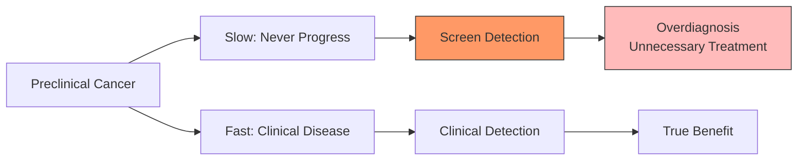
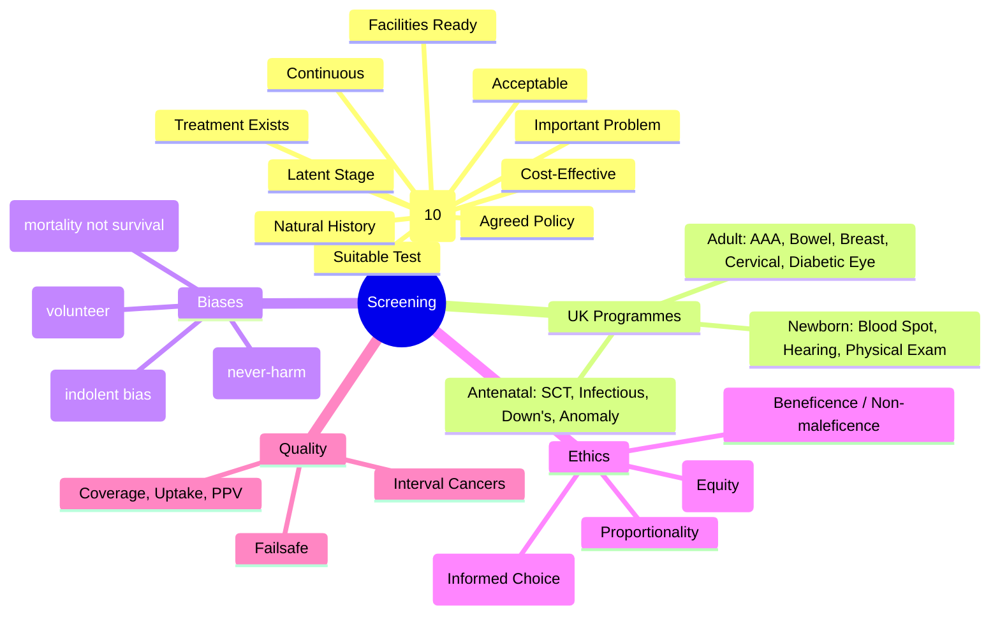

## 1. 1. Learning Objectives
By the end of this note you should be able to:
- [ ] List and apply Wilson-Jungner criteria (10 principles) for screening programmes
- [ ] Describe UK National Screening Programmes (adult + antenatal/newborn)
- [ ] Explain screening biases: lead-time, length, overdiagnosis, selection
- [ ] Calculate PPV/NPV in screening context; understand prevalence dependence
- [ ] Distinguish screening vs diagnostic testing; screening vs case-finding
- [ ] Apply ethical framework: benefits, harms, autonomy, justice, proportionality

---

## 2. 2. Definition & Epidemiology

| Concept | Definition |
|---------|------------|
| **Screening** | Systematic application of test to asymptomatic population to identify those at high risk, who benefit from early intervention |
| **Case-Finding** | Opportunistic testing of at-risk individuals presenting for other reasons |
| **Diagnostic Test** | Applied to symptomatic individuals to confirm/exclude diagnosis |
| **Wilson-Jungner Criteria (1968)** | 10 principles for screening programme appraisal |
| **Programme Standards** | Failsafe, quality assurance, informed choice, equity of access |

---

## 3. 3. Clinical Features / Presentation
*Methodological framework - see Wilson-Jungner criteria and bias types below.*

---

## 4. 4. Classification / Wilson-Jungner Criteria (10 Principles)

| Criterion | Description | Modern Interpretation |
|-----------|-------------|----------------------|
| **1. Important Health Problem** | High burden (prevalence × severity) | Measured by DALYs, QALYs, mortality |
| **2. Accepted Treatment** | Effective intervention for screen-detected cases | Evidence-based, accessible, timely |
| **3. Facilities for Diagnosis/Treatment** | Service capacity for screen-positive | Workforce, pathways, MDTs |
| **4. Recognisable Latent/Early Stage** | Detectable preclinical phase (DPCP) | Biology allows early detection |
| **5. Suitable Test** | Valid, acceptable, safe, cost-effective | Sn/Sp, LR, AUC; patient-acceptable |
| **6. Test Acceptable to Population** | High uptake, low anxiety | Cultural, literacy, invasiveness |
| **7. Natural History Understood** | Progression from latent to clinical | Epidemiological evidence |
| **8. Agreed Treatment Policy** | Who to treat, when, how | Guidelines, thresholds, pathways |
| **9. Cost-Effective** | Resource use vs benefit (ICER < threshold) | £/QALY, budget impact, opportunity cost |
| **10. Continuous Process** | Not one-off; quality assured, monitored | Failsafe, KPIs, equity audit |

**UK National Screening Committee (UK NSC) Criteria** - updated Wilson-Jungner with explicit evidence requirements.

---

## 5. 5. Diagnosis & Investigations (UK Screening Programmes)

**UK Adult Screening Programmes (England):**
| Programme | Target | Test | Interval | Key Metrics |
|-----------|--------|------|----------|-------------|
| **Abdominal Aortic Aneurysm (AAA)** | Men 65 | Ultrasound | Once | Rupture risk >5.5cm |
| **Bowel Cancer** | 60-74 (extending to 50) | FIT (faecal immunochemical) | 2 years | FIT >120 μg/g → colonoscopy |
| **Breast Cancer** | Women 50-70 (47-73 invite) | Mammography | 3 years | 2-view mammogram |
| **Cervical Cancer** | Women 25-64 | HPV primary + cytology | 3yr (25-49), 5yr (50-64) | HPV +ve → cytology/triage |
| **Diabetic Eye** | Diabetics 12+ | Digital retinal photography | Annual | R0/R1/R2/M0 grading |

**UK Antenatal & Newborn Screening:**
| Programme | Timing | Test |
|-----------|--------|------|
| **Sickle Cell & Thalassaemia** | 10 wks antenatal | Blood test (HPLC) |
| **Infectious Diseases (HIV, Hep B, Syphilis)** | Booking | Serology |
| **Down's/Edwards/Patau** | 10-14 wks | Combined test (NT + PAPP-A + β-hCG) or NIPT |
| **Fetal Anomaly** | 18-21 wks | Ultrasound (TIFFA) |
| **Newborn Blood Spot** | Day 5 | Heel prick (9 conditions: PKU, MCADD, MSUD, IVA, GA1, HCU, CHT, CF, SCD) |
| **Newborn Hearing** | Before 4 wks | AOAE / AABR |
| **Newborn Physical Exam** | 72 hrs & 6-8 wks | Hips, heart, eyes, testes |

---

## 6. 6. Differential Diagnosis (Screening Biases)

| Bias | Mechanism | Effect | Mitigation |
|------|-----------|--------|------------|
| **Lead-Time Bias** | Earlier detection without changing death time | Apparent ↑ survival (artificial) | Use mortality (not survival) as endpoint; RCT with mortality |
| **Length Bias** | Screening detects slower-growing (less aggressive) cases | Overestimates benefit; misses aggressive fast-progressing | RCT; interval cancer analysis |
| **Overdiagnosis** | Detects lesions that would never cause symptoms/death | Harm from unnecessary treatment | RCT; autopsy studies; long-term follow-up |
| **Selection Bias** | Volunteers healthier/higher risk than non-volunteers | Distorts benefit estimate | Population-based invitation; intention-to-screen analysis |
| **Self-Selection Bias** | Those attending differ systematically | Overestimates effectiveness | Compare invitees vs non-invitees |

**Mermaid: Lead-Time Bias**

**Mermaid: Overdiagnosis**

---

## 7. 7. Management (Programme Quality & Ethics)

**Failsafe System:**
- Track every step: invitation → test → result → referral → treatment
- No patient lost; alerts for delays
- Audit: coverage, uptake, detection rate, PPV, interval cancers

**Ethical Framework (Nuffield Council / WHO):**
| Principle | Application |
|-----------|-------------|
| **Beneficence** | Net benefit > harm (mortality reduction > overdiagnosis) |
| **Non-maleficence** | Minimise false positives, anxiety, overtreatment |
| **Autonomy** | Informed choice (not just consent); balanced info on harms/benefits |
| **Justice** | Equitable access; address uptake inequalities (deprivation, ethnicity) |
| **Proportionality** | Intrusiveness proportionate to benefit |

**Informed Choice vs Informed Consent:**
- **Informed Choice**: Screening is offer; balanced info; decision aid; no pressure
- **Informed Consent**: Diagnostic/treatment; specific procedure risks

---

## 8. 8. FCPS/MRCP High-Yield Summary (BULLET TABLE)

| Topic | Key Points |
|-------|------------|
| **Wilson-Jungner 10** | Important problem, treatment, facilities, latent stage, suitable test, acceptable, natural history, policy, cost-effective, continuous |
| **Screening vs Diagnostic** | Screening: asymptomatic population, high Sn. Diagnostic: symptomatic, high Sp. |
| **PPV in Screening** | LOW because prevalence low in asymptomatic. PPV = (Sn×Prev)/(Sn×Prev+(1-Sp)×(1-Prev)) |
| **Lead-Time Bias** | Earlier diagnosis → longer survival FROM DIAGNOSIS, but same death time. Use mortality endpoint! |
| **Length Bias** | Screening picks up slow-growing (indolent) cases more than fast. Overestimates benefit. |
| **Overdiagnosis** | Detecting "cancer" that would never harm. Breast: ~19% overdiagnosis. Prostate: high with PSA. |
| **UK Adult Programmes** | AAA (men 65), Bowel (FIT 60-74), Breast (mammo 50-70), Cervical (HPV 25-64), Diabetic Eye (annual 12+) |
| **UK Newborn** | Blood spot (9 conditions), Hearing (AOAE/AABR), Physical exam (hips, heart, eyes, testes) |
| **Failsafe** | Track every step; no patient lost; audit coverage, uptake, detection, PPV, interval cancers |

---

## 9. 9. Viva Questions (MRCP PACES / FCPS)

| Question | Expected Answer |
|----------|-----------------|
| **List Wilson-Jungner criteria (or key ones).** | 1) Important health problem, 2) Accepted treatment, 3) Facilities, 4) Recognisable latent stage, 5) Suitable test, 6) Acceptable to population, 7) Natural history understood, 8) Agreed treatment policy, 9) Cost-effective, 10) Continuous process. |
| **Screening vs diagnostic test - difference?** | Screening: asymptomatic population, aims for high sensitivity (rule out). Diagnostic: symptomatic, aims for high specificity (rule in). |
| **What is lead-time bias? How avoid?** | Earlier detection makes survival from diagnosis appear longer without changing death time. Use disease-specific MORTALITY (not survival) in RCTs. |
| **What is length bias?** | Screening more likely to detect slow-growing/less aggressive disease (longer preclinical phase). Overestimates benefit; misses fast aggressive cancers. |
| **What is overdiagnosis? Example.** | Detection of disease that would never cause symptoms/death in patient's lifetime. Breast screening ~19% overdiagnosis; PSA prostate high overdiagnosis. |
| **Why is PPV low in screening?** | Prevalence of preclinical disease in asymptomatic population is low. PPV = (Sn×Prev)/[Sn×Prev+(1-Sp)×(1-Prev)]. Low Prev → low PPV. |
| **Name UK adult screening programmes.** | AAA (men 65), Bowel (FIT 60-74), Breast (mammo 50-70), Cervical (HPV primary 25-64), Diabetic Eye (annual 12+). |
| **Failsafe in screening - what is it?** | System ensuring no patient lost at any step: invite → test → result → referral → treatment. Audit: coverage, uptake, detection rate, PPV, interval cancers. |
| **Informed choice vs informed consent?** | Informed choice: screening offer with balanced info on benefits/harms, decision aids, no pressure. Informed consent: for diagnostic/treatment procedures. |
| **Ethical principles for screening?** | Beneficence (net benefit), Non-maleficence (minimise harm), Autonomy (informed choice), Justice (equitable access), Proportionality. |

---

## 10. 10. Confusions & Mnemonics

| Confusion | Clarification |
|-----------|---------------|
| **Screening = Prevention?** | Screening = SECONDARY prevention (early detection). Primary = prevent onset. Tertiary = reduce complications. |
| **Interval Cancers** | Cancers diagnosed between screening rounds. Reflect test sensitivity, sojourn time, screening interval. |
| **Sojourn Time** | Time in detectable preclinical phase. Long sojourn → less frequent screening needed. |
| **NIPT vs Combined Test** | NIPT: cell-free DNA, higher Sn/Sp for trisomies, not diagnostic. Combined: NT + biochemistry. NIPT contingent on high-risk combined. |

**Mnemonic: WILSON-JUNGNER (10)**
- **W**orthwhile problem (Important)
- **I**ntervention accepted (Treatment)
- **L**ogistics ready (Facilities)
- **S**tage detectable (Latent stage)
- **O**ptimal test (Suitable test)
- **N**eed acceptance (Acceptable)
- **J**ourney known (Natural history)
- **U**nified policy (Treatment policy)
- **N**et benefit (Cost-effective)
- **G**oing concern (Continuous)
- **E**vidence-based (Modern add)
- **R**eview ongoing (Modern add)

**Mnemonic: SCREENING BIASES (LLOSS)**
- **L**ead-time (survival artifact)
- **L**ength (indolent over-represented)
- **O**verdiagnosis (never-harm detected)
- **S**election (volunteer bias)
- **S**elf-selection (attenders differ)

**Mnemonic: UK SCREENING PROGRAMMES (ABBCD)**
- **A**AA (men 65)
- **B**owel (FIT 60-74)
- **B**reast (mammo 50-70)
- **C**ervical (HPV 25-64)
- **D**iabetic Eye (annual 12+)

---

## 11. 11. Mind Map

---

## 12. 12. One-Page Revision Card

| Domain | Key Points |
|--------|------------|
| **Wilson-Jungner** | 10 criteria: problem, treatment, facilities, latent stage, test, acceptable, natural history, policy, cost-effective, continuous |
| **Screening vs Diagnostic** | Screening: asymptotic, high Sn. Diagnostic: symptomatic, high Sp. |
| **PPV in Screening** | Low (low prevalence) → many false positives |
| **Lead-Time Bias** | Earlier dx → longer survival FROM DX, same death. Use MORTALITY. |
| **Length Bias** | Detects slow-growing more → overestimates benefit |
| **Overdiagnosis** | Detects never-harm disease → unnecessary treatment |
| **UK Adult 5** | AAA, Bowel, Breast, Cervical, Diabetic Eye |
| **Newborn 3** | Blood Spot (9 cond), Hearing, Physical Exam |
| **Failsafe** | Track invite → test → result → referral → treat |
| **Informed Choice** | Balanced info, decision aids, no pressure |

---

## 13. 13. Spaced Repetition Trackers

| Review Interval | Date Completed | Confidence (1-5) | Notes |
|-----------------|----------------|------------------|-------|
| 24 hours | | | |
| 7 days | | | |
| 15 days | | | |
| 30 days | | | |
| 90 days | | | |

---

## 14. 14. Self-Test Scorecard

| Section | Score /5 | Last Attempt |
|---------|----------|--------------|
| Wilson-Jungner Criteria | | |
| UK Screening Programmes | | |
| Lead-Time Bias | | |
| Length Bias | | |
| Overdiagnosis | | |
| PPV/Prevalence | | |
| Ethics | | |
| Viva Questions | | |
| Mnemonics | | |

---

## 15. 15. Local Navigation

- **Parent Heading**: [[../Population Health and Epidemiology|Population Health and Epidemiology]]
- **Chapter Map**: [[../Population Health and Epidemiology Hierarchy|Hierarchy]]
- **Chapter MOC**: [[../Population Health and Epidemiology MOC|MOC]]
- **Related**: [[Validity, Reliability & Diagnostic Accuracy (Sensitivity, Specificity, PPV, NPV, ROC).md]], [[Health Promotion & Disease Prevention (Primary, Secondary, Tertiary).md]], [[Measures of Disease Frequency (Incidence, Prevalence, Rates).md]]

---

#medicine #population-health #epidemiology #davidson #fcps #mrcp
