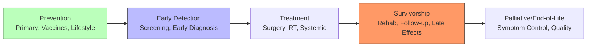
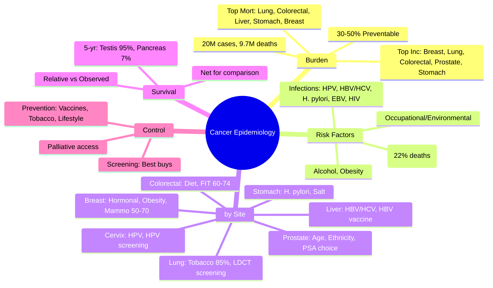

## 1. 1. Learning Objectives
By the end of this note you should be able to:
- [ ] Describe global cancer burden (GBD): incidence, mortality, DALYs by site
- [ ] Classify risk factors: tobacco, alcohol, obesity, infections, occupational, environmental
- [ ] Apply prevention levels: primary (vaccination, lifestyle), secondary (screening), tertiary (rehab)
- [ ] Interpret cancer registration, staging (TNM), survival metrics (relative, net)
- [ ] Distinguish incidence vs mortality patterns by HDI/development level

---

## 2. 2. Definition & Epidemiology

| Metric | Global (GLOBOCAN 2022) | UK |
|--------|------------------------|-----|
| **New Cases** | 20 million | ~390,000/year |
| **Deaths** | 9.7 million | ~167,000/year |
| **5-Year Prevalence** | 53.5 million | ~3.5 million |
| **Lifetime Risk** | ~1 in 5 | ~1 in 2 (born after 1960) |
| **Top Sites (Cases)** | Breast, Lung, Colorectal, Prostate, Stomach | Breast, Prostate, Lung, Bowel |
| **Top Sites (Deaths)** | Lung, Colorectal, Liver, Stomach, Breast | Lung, Bowel, Prostate, Breast |

**Trends:**
- Age-standardised incidence ↑ (aging, detection, risk factors)
- Age-standardised mortality ↓ in HICs (screening, treatment)
- LMICs: rising burden, later stage at diagnosis
- 30-50% preventable (WHO)

---

## 3. 3. Clinical Features / Presentation
*Epidemiological patterns by site - see tables below.*

---

## 4. 4. Classification / Major Cancer Sites Epidemiology

| Cancer | Global Incidence Rank | Global Mortality Rank | Key Risk Factors | Screening |
|--------|----------------------|----------------------|------------------|-----------|
| **Lung** | 2nd | 1st | Tobacco (85%), radon, asbestos, air pollution, occupational | LDCT (high-risk smokers) |
| **Breast (F)** | 1st | 5th | Female, age, hormonal (early menarche, late menopause, HRT, OC), obesity (postmeno), alcohol, radiation, BRCA | Mammography (50-70) |
| **Colorectal** | 3rd | 2nd | Age, diet (red/processed meat, low fibre), obesity, inactivity, smoking, alcohol, IBD, family, Lynch/FAP | FIT/Bowel scope (60-74) |
| **Prostate** | 4th | 8th | Age, ethnicity (Black >), family, BRCA2, diet | PSA (informed choice) |
| **Stomach** | 5th | 4th | H. pylori, salted/smoked foods, smoking, low fruit/veg, family | None (endoscopy in high-risk) |
| **Liver** | 6th | 3rd | HBV, HCV, aflatoxin, alcohol, NAFLD/NASH, cirrhosis | HBV vac; surveillance cirrhosis |
| **Cervical** | 7th | 9th | HPV (16/18), smoking, HIV, OC long-term, multiparity | HPV primary (25-64) |
| **Oesophageal** | 8th | 6th | Tobacco, alcohol (synergy), obesity, Barrett's, achalasia | None (surveillance Barrett's) |
| **Thyroid** | 9th | - | Radiation, iodine deficiency/excess, female, genetics | None |
| **Pancreas** | 12th | 7th | Smoking, obesity, DM, chronic pancreatitis, family | None |

---

## 5. 5. Diagnosis & Investigations (Survival & Registration)

**Cancer Registration:**
- **Population-based** cancer registries (PBCR) → incidence, survival, prevalence
- **Hospital-based** → clinical patterns, treatment
- **Data**: Site (ICD-O), Morphology, Stage (TNM), Grade, Treatment, Follow-up

**Survival Metrics:**
| Metric | Definition | Use |
|--------|------------|-----|
| **Observed Survival** | % alive at time t after diagnosis | Crude prognosis |
| **Relative Survival** | Observed / Expected (general population) | Net cancer survival (removes other-cause death) |
| **Net Survival** | Hypothetical: only cancer as cause of death | International comparison (age-standardised) |
| **Conditional Survival** | Survival given already survived x years | Improves with time for many cancers |

**TNM Staging (AJCC/UICC 8th Ed):**
- **T**: Primary tumour size/extent
- **N**: Regional lymph nodes
- **M**: Distant metastasis
- **Stage Grouping**: 0, I, II, III, IV (prognostic)

**Mermaid: Cancer Control Continuum**

---

## 6. 6. Differential Diagnosis (Epidemiological Patterns)

| Pattern | Explanation |
|---------|-------------|
| **Incidence > Mortality** | Screening detection (breast, prostate, thyroid), indolent cancers, better treatment |
| **Mortality ≈ Incidence** | Poor prognosis, late presentation (pancreas, lung, liver, oesophagus) |
| **HIC vs LMIC** | HIC: breast, prostate, colorectal, lung (screening, aging). LMIC: infection-related (cervix, liver, stomach), advanced stage |
| **Sex Differences** | Male > female for most (except breast, thyroid). Lung: historical smoking patterns. |
| **Ethnic Differences** | Prostate: Black > White > Asian. Breast: White > Black > Asian (but Black more aggressive). Stomach/Liver: Asian >. |
| **Age Patterns** | Most ↑ exponentially with age. Exceptions: testicular (young men), bone (bimodal), thyroid (younger women). |

---

## 7. 7. Management (Prevention & Control)

**WHO "Best Buys" for Cancer:**
| Prevention | Intervention |
|------------|--------------|
| **Primary** | HPV vaccination (90% girls by 15), HBV vaccination (birth dose), Tobacco control (MPOWER), Alcohol reduction, Obesity prevention, Occupational/environmental protection |
| **Secondary** | Breast screening (mammo 50-69), Cervical screening (HPV test 30-49), Colorectal screening (FIT 50-74), Oral visual inspection (high-risk) |
| **Tertiary** | Palliative care access, Pain relief (morphine), Survivorship care, Rehabilitation |

**Global Initiatives:**
- **WHO Global Breast Cancer Initiative**: 2.5% annual mortality reduction → 2.5M deaths averted by 2040
- **WHO Cervical Cancer Elimination**: 90% HPV vaccination, 70% screening, 90% treatment by 2030
- **Global Initiative for Childhood Cancer**: 60% survival by 2030
- **IARC/GLOBOCAN**: Global cancer observatory

---

## 8. 8. FCPS/MRCP High-Yield Summary (BULLET TABLE)

| Topic | Key Points |
|-------|------------|
| **Global Burden** | 20M cases, 9.7M deaths (2022). 30-50% preventable. |
| **Top Incidence** | Breast, Lung, Colorectal, Prostate, Stomach |
| **Top Mortality** | Lung, Colorectal, Liver, Stomach, Breast |
| **Risk Factors** | Tobacco (22% cancer deaths), Alcohol, Obesity, Infections (HPV, HBV/HCV, H. pylori), Occupational |
| **Infections → Cancer** | HPV (cervix, oropharynx, anogenital), HBV/HCV (liver), H. pylori (stomach), EBV (lymphoma, NPC), HIV (Kaposi, lymphoma) |
| **Screening** | Breast: mammo 50-70. Cervical: HPV 25-64. Bowel: FIT 60-74. Lung: LDCT high-risk smokers. |
| **Survival** | Relative survival for comparison. 5-yr: Testis 95%, Breast 86%, Lung 16%, Pancreas 7%. |
| **Staging** | TNM (T tumour, N nodes, M metastasis). Stage I-IV. |
| **Health Inequalities** | Deprivation: later stage, lower survival, higher incidence (smoking-related). |

---

## 9. 9. Viva Questions (MRCP PACES / FCPS)

| Question | Expected Answer |
|----------|-----------------|
| **Top 5 cancers by incidence globally?** | Breast, Lung, Colorectal, Prostate, Stomach. |
| **Top 5 cancers by mortality globally?** | Lung, Colorectal, Liver, Stomach, Breast. |
| **What proportion of cancers are preventable?** | 30-50% (WHO). Main: tobacco, alcohol, obesity, infections, occupational. |
| **Infections causing cancer - name 5.** | HPV (cervix, oropharynx), HBV/HCV (liver), H. pylori (stomach), EBV (Burkitt, NPC), HIV (Kaposi, lymphoma), HTLV-1 (ATLL), KSHV (Kaposi). |
| **UK screening programmes for cancer?** | Breast (mammo 50-70), Cervical (HPV primary 25-64), Bowel (FIT 60-74). Lung: targeted LDCT (pilot/rolling out). |
| **Relative vs observed survival?** | Observed = % alive. Relative = observed/expected (general pop). Removes competing mortality; enables international comparison. |
| **TNM staging - what does each letter mean?** | T = primary tumour size/extent. N = regional lymph nodes. M = distant metastasis. |
| **Lung cancer - why is mortality ≈ incidence?** | Poor prognosis, late presentation, limited early detection (until LDCT), rapid progression. |
| **Cervical cancer elimination targets (WHO 2030)?** | 90% girls HPV vaccinated by 15, 70% women screened 35/45, 90% precancer/cancer treated. |
| **Health inequalities in cancer?** | Deprived: higher incidence (smoking-related), later stage at diagnosis, lower survival, less access to treatment. |

---

## 10. 10. Confusions & Mnemonics

| Confusion | Clarification |
|-----------|---------------|
| **Incidence vs Mortality patterns** | Screening ↑ incidence without ↑ mortality (overdiagnosis). Poor survival → mortality ≈ incidence. |
| **Age-standardisation** | Essential for comparison across populations/time. World Standard Population (Segi) or ESP. |
| **Relative vs Net Survival** | Relative = observed/expected. Net = hypothetical only cancer death. Net preferred for international comparison. |
| **HPV Vaccine** | Prevents HPV 16/18 (70% cervical) + 31/33/45/52/58 (9-valent). Also prevents oropharyngeal, anal, vaginal, vulvar. |

**Mnemonic: TOP CANCER INCIDENCE (BLue CaPS)**
- **B**reast
- **L**ung
- **C**olorectal
- **P**rostate
- **S**tomach

**Mnemonic: TOP CANCER MORTALITY (LCLSB)**
- **L**ung
- **C**olorectal
- **L**iver
- **S**tomach
- **B**reast

**Mnemonic: CANCER RISK FACTORS (TOBACCO)**
- **T**obacco (22% deaths)
- **O**besity
- **B**oose (Alcohol)
- **A**ge
- **C**hronic infections (HPV, HBV, HCV, H. pylori)
- **C**arcinogens (occupational, environmental)
- **O**ther (radiation, hormones, immunosuppression)

**Mnemonic: INFECTION CANCERS (HEVY)**
- **H**BV/HCV → **L**iver
- **E**BV → Lymphoma, NPC
- **V**PH (HPV) → Cervix, Oropharynx
- **Y**ersinia? No - **H**. **P**ylori → Stomach

**Mnemonic: UK CANCER SCREENING (BBC)**
- **B**reast (mammo 50-70)
- **B**owel (FIT 60-74)
- **C**ervical (HPV 25-64)

---

## 11. 11. Mind Map

---

## 12. 12. One-Page Revision Card

| Domain | Key Points |
|--------|------------|
| **Global** | 20M cases, 9.7M deaths; 30-50% preventable |
| **Top Incidence** | Breast, Lung, Colorectal, Prostate, Stomach |
| **Top Mortality** | Lung, Colorectal, Liver, Stomach, Breast |
| **Risk Factors** | Tobacco (22%), Alcohol, Obesity, Infections, Occupational |
| **Infections** | HPV→Cervix, HBV/HCV→Liver, H.pylori→Stomach, EBV→Lymphoma |
| **UK Screening** | Breast (mammo), Cervical (HPV), Bowel (FIT) |
| **Survival** | Relative = observed/expected. Net for int'l comparison |
| **Staging** | TNM: T tumour, N nodes, M mets |
| **Inequalities** | Deprived: later stage, lower survival |

---

## 13. 13. Spaced Repetition Trackers

| Review Interval | Date Completed | Confidence (1-5) | Notes |
|-----------------|----------------|------------------|-------|
| 24 hours | | | |
| 7 days | | | |
| 15 days | | | |
| 30 days | | | |
| 90 days | | | |

---

## 14. 14. Self-Test Scorecard

| Section | Score /5 | Last Attempt |
|---------|----------|--------------|
| Global Burden Stats | | |
| Site-Specific Epi | | |
| Risk Factors | | |
| Infection-Cancer Links | | |
| Screening Programmes | | |
| Survival Metrics | | |
| Viva Questions | | |
| Mnemonics | | |

---

## 15. 15. Local Navigation

- **Parent Heading**: [[../Population Health and Epidemiology|Population Health and Epidemiology]]
- **Chapter Map**: [[../Population Health and Epidemiology Hierarchy|Hierarchy]]
- **Chapter MOC**: [[../Population Health and Epidemiology MOC|MOC]]
- **Related**: [[Cardiovascular Disease Epidemiology.md]], [[Measures of Disease Burden (DALY, QALY, HALE, YLL, YLD).md]], [[Screening (Wilson-Jungner Criteria, Programs, Ethics).md]]

---

#medicine #population-health #epidemiology #davidson #fcps #mrcp
