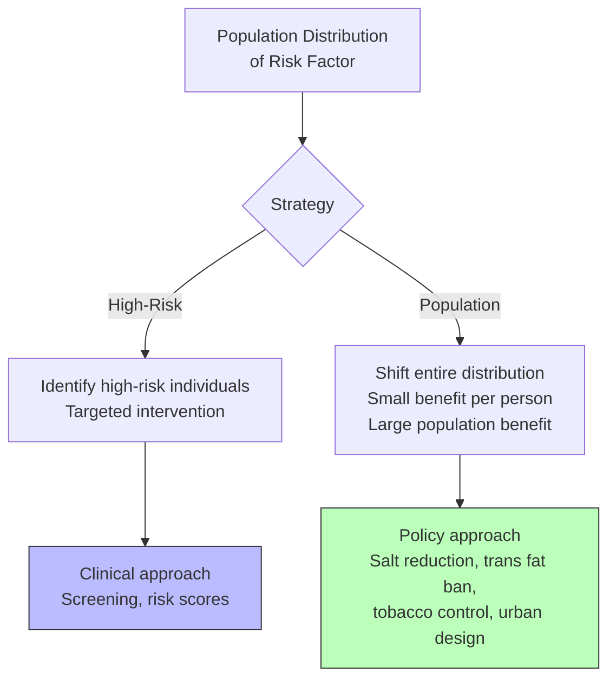
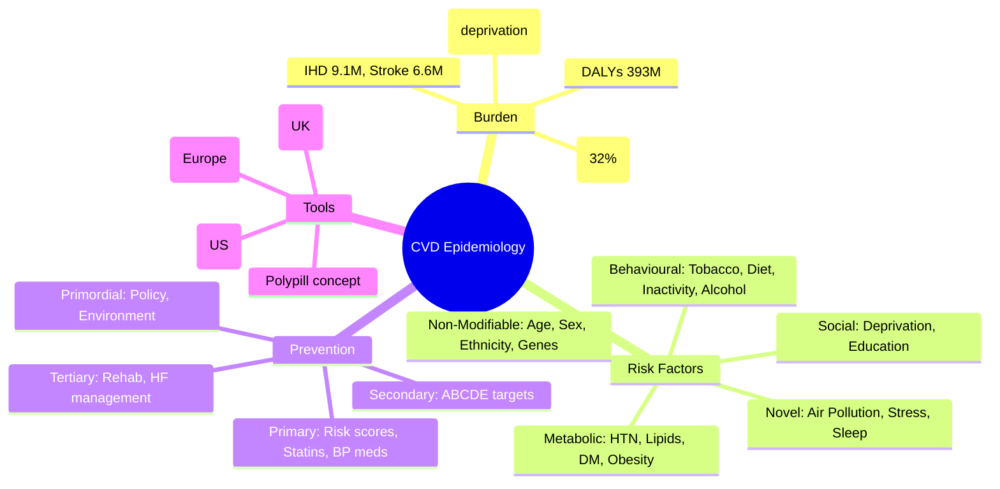

## 1. 1. Learning Objectives
By the end of this note you should be able to:
- [ ] Describe global CVD burden (GBD): IHD, stroke, hypertensive heart disease
- [ ] Classify risk factors: non-modifiable, modifiable (behavioural, metabolic), novel
- [ ] Apply prevention levels: primordial, primary, secondary, tertiary
- [ ] Calculate cardiovascular risk: QRISK3, SCORE2, ASCVD
- [ ] Explain population vs high-risk prevention strategies (Rose)
- [ ] Describe polypill concept and implementation challenges

---

## 2. 2. Definition & Epidemiology

| Metric | Global (GBD 2019) | UK |
|--------|-------------------|-----|
| **CVD Deaths** | 18.6 million (32% all deaths) | ~160,000/year (27% deaths) |
| **IHD Deaths** | 9.1 million | ~65,000 |
| **Stroke Deaths** | 6.6 million | ~35,000 |
| **CVD DALYs** | 393 million | Major contributor |
| **Prevalence** | 520+ million cases | ~7.6 million UK |

**Trends:**
- Age-standardised mortality ↓ in HICs (50% since 1990)
- Absolute numbers ↑ due to aging/population growth
- LMICs: rising burden (epidemiological transition)
- Premature CVD (<70y) major focus for SDG 3.4

---

## 3. 3. Clinical Features / Presentation
*Epidemiological patterns - see risk factors and prevention below.*

---

## 4. 4. Classification / Risk Factors

| Category | Risk Factor | Population Attributable Fraction (PAF) |
|----------|-------------|----------------------------------------|
| **Non-Modifiable** | Age, Sex (male > female pre-menopause), Ethnicity (South Asian >), Family History, Genetics (polygenic) | N/A |
| **Behavioural** | Tobacco (smoking, smokeless), Unhealthy diet (high Na, low fruit/veg, trans fat), Physical inactivity, Harmful alcohol use | Tobacco ~15-20% CVD; Diet ~30% |
| **Metabolic** | Hypertension (SBP≥140), Dyslipidaemia (LDL-C↑, HDL-C↓), Diabetes/Hyperglycaemia, Overweight/Obesity (BMI≥25) | Hypertension ~50% stroke, ~40% IHD; Lipids ~30% |
| **Novel/Emerging** | Air pollution (PM2.5), Sleep apnoea, Chronic inflammation (hs-CRP), Psychosocial stress, Depression, Migraine, Autoimmune, CKD, HIV, Cancer therapy | Air pollution ~20% CVD deaths |
| **Social Determinants** | Deprivation, Education, Employment, Housing, Access to care | Gradient: most deprived 2-3x CVD mortality |

**Major Risk Factor Clustering:**
- **Metabolic Syndrome**: Central obesity + 2 of (HTN, high TG, low HDL, high fasting glucose)
- **Cardiorenal Metabolic Syndrome**: CVD + CKD + DM + Obesity interplay

---

## 5. 5. Diagnosis & Investigations (Risk Scores & Prevention)

**Cardiovascular Risk Scores (Primary Prevention):**
| Score | Population | Variables | Output |
|-------|------------|-----------|--------|
| **QRISK3** | UK, 25-84y | Age, sex, ethnicity, deprivation, smoking, BP, cholesterol, BMI, DM, CKD, AF, RA, SLE, family history, meds | 10-year CVD risk % |
| **SCORE2** | Europe, 40-69y | Age, sex, smoking, SBP, total cholesterol | 10-year fatal CVD risk (calibrated per region) |
| **ASCVD (US)** | US, 40-79y | Age, sex, race, TC, HDL, SBP, treatment, DM, smoking | 10-year ASCVD risk % |
| **Framingham** | Historical | Age, sex, TC, HDL, SBP, treatment, smoking, DM | 10-year CHD risk |

**UK Thresholds (NICE CG181):**
- **≥10% 10-year QRISK** → Offer statin (atorvastatin 20mg)
- **<10%** → Lifestyle advice, reassess

**Mermaid: Rose's Prevention Strategies**

---

## 6. 6. Differential Diagnosis (Prevention Confusions)

| Confusion | Clarification |
|-----------|---------------|
| **High-Risk vs Population Strategy** | High-risk: identify/treat individuals above threshold (clinical). Population: shift whole distribution (policy). Rose: "A large number of people at small risk may give rise to more cases than a small number at high risk." |
| **Primordial vs Primary** | Primordial: prevent risk factor emergence (trans fat ban, urban design). Primary: prevent disease in those with risk factors (statin, antihypertensive). |
| **Secondary Prevention** | Post-event: antiplatelet, statin, beta-blocker, ACEi, cardiac rehab. Targets: LDL<1.4, BP<130/80, HbA1c<48. |
| **Polypill** | Fixed-dose combination (statin + 2-3 antihypertensives ± aspirin). Improves adherence, cost-effective. TIPS-3, PolyIran trials showed CVD reduction. |
| **QRISK vs SCORE** | QRISK: UK, includes deprivation, ethnicity, more variables. SCORE: Europe, fatal CVD only, calibrated by region. |

---

## 7. 7. Management (Prevention Strategies)

**WHO "Best Buys" for CVD Prevention:**
| Intervention | Cost-Effectiveness |
|--------------|-------------------|
| Tobacco tax, smoke-free laws, plain packaging | Very cost-effective |
| Salt reduction (reformulation, labelling) | Very cost-effective |
| Trans fat elimination (legislative) | Very cost-effective |
| Public awareness (diet, physical activity) | Cost-effective |
| Drug therapy for high CVD risk (≥20-30% 10yr) | Cost-effective |
| Aspirin for secondary prevention | Cost-effective |

**Secondary Prevention Targets (ESC/NICE):**
| Target | Goal |
|--------|------|
| **LDL-C** | <1.4 mmol/L (≥50% reduction from baseline) |
| **Non-HDL-C** | <2.2 mmol/L |
| **BP** | <130/80 mmHg |
| **HbA1c** | <48 mmol/mol (6.5%) |
| **Smoking** | Complete cessation |
| **BMI** | 20-25 kg/m² |
| **Physical Activity** | 150 min moderate/week |

---

## 8. 8. FCPS/MRCP High-Yield Summary (BULLET TABLE)

| Topic | Key Points |
|-------|------------|
| **CVD #1 Global Killer** | 18.6M deaths (32%); IHD 9.1M, Stroke 6.6M |
| **Top Risk Factors** | Hypertension (PAF ~40% IHD, 50% stroke), Tobacco, Diet, High LDL, Air Pollution |
| **Rose's Theorem** | Population strategy > high-risk for total burden; high-risk for individual benefit |
| **QRISK3** | UK standard; ≥10% 10-yr → statin; includes ethnicity, deprivation, comorbidities |
| **SCORE2** | Europe; fatal CVD; calibrated by region |
| **Polypill** | Statin + 2-3 BP meds ± aspirin; ↑ adherence, ↓ cost; TIPS-3: 31% CVD reduction |
| **Secondary Prevention** | "ABCDE": Antiplatelet, BP, Cholesterol, Diet/Diabetes, Exercise |
| **SDG 3.4** | Reduce premature NCD mortality by 1/3 by 2030 |
| **UK CVD** | ~160K deaths/year; 7.6M living with CVD; major health inequality driver |

---

## 9. 9. Viva Questions (MRCP PACES / FCPS)

| Question | Expected Answer |
|----------|-----------------|
| **What are the major modifiable risk factors for CVD?** | Hypertension, tobacco, unhealthy diet, physical inactivity, dyslipidaemia, diabetes, obesity, harmful alcohol, air pollution. |
| **Explain Rose's population vs high-risk strategy.** | High-risk: identify/treat individuals above threshold (clinical). Population: shift entire risk distribution via policy (salt reduction, tobacco control). Population prevents more total cases; high-risk gives larger individual benefit. |
| **What is QRISK3? When offer statin per NICE?** | UK CVD risk score (25-84y). Includes age, sex, ethnicity, deprivation, smoking, BP, lipids, BMI, DM, CKD, AF, RA, family history. NICE: ≥10% 10-year risk → offer atorvastatin 20mg. |
| **Polypill - components and evidence?** | Fixed-dose: statin + 2-3 antihypertensives (ACEi/ARB, CCB, thiazide) ± aspirin. PolyIran: 34% CVD reduction. TIPS-3: 31% reduction in intermediate risk. Improves adherence, cost-effective. |
| **Secondary prevention targets post-MI?** | LDL<1.4 (or ≥50% reduction), BP<130/80, HbA1c<48, BMI 20-25, smoking cessation, cardiac rehab, antiplatelet, statin, beta-blocker, ACEi/ARB. |
| **Population attributable fraction of hypertension for stroke?** | ~50% of stroke attributable to hypertension. |
| **Trans fat elimination - WHO REPLACE?** | Review sources, Promote replacement, Legislate, Assess, Create awareness, Enforce. Cost-saving, prevents CVD. |
| **Air pollution and CVD?** | PM2.5 → oxidative stress, inflammation, atherosclerosis, arrhythmia. ~20% CVD deaths attributable. WHO target 5 μg/m³ annual mean. |
| **CVD health inequalities in UK?** | Most deprived 2-3x CVD mortality vs least deprived. Marmot: proportional universalism. |

---

## 10. 10. Confusions & Mnemonics

| Confusion | Clarification |
|-----------|---------------|
| **QRISK vs Framingham** | QRISK: UK, ethnicity, deprivation, more variables, better calibrated for UK. Framingham: US, overestimates in UK. |
| **Primary vs Secondary Prevention Statin** | Primary: QRISK≥10%, atorvastatin 20mg. Secondary: established CVD, atorvastatin 80mg (high intensity). |
| **SCORE vs SCORE2** | SCORE2: updated (2021), includes non-fatal? No, still fatal CVD only; better calibration, age 40-69, region-specific. |
| **Polypill = Fixed Dose** | Not personalised titration; but adherence benefit outweighs for population. |

**Mnemonic: CVD RISK FACTORS (HALT-D)**
- **H**ypertension
- **A**ge / **A**ir pollution
- **L**ipids (LDL↑)
- **T**obacco
- **D**iabetes / **D**iet / **D**eprivation

**Mnemonic: ROSE STRATEGIES**
- **H**igh-Risk = **H**ospital/Clinical (individual)
- **P**opulation = **P**olicy/Public Health (societal)

**Mnemonic: QRISK3 VARIABLES (A SEB-DC RAF)**
- **A**ge, **S**ex, **E**thnicity, **B**MI
- **D**eprivation, **C**holesterol/BP
- **R**A/SLE, **A**F, **F**amily History

**Mnemonic: SECONDARY PREVENTION (ABCDE)**
- **A**ntiplatelet / **A**CEi
- **B**eta-blocker / **B**P <130/80
- **C**holesterol (LDL<1.4) / **C**ardiac Rehab
- **D**iabetes (HbA1c<48) / **D**iet
- **E**xercise / **E**ducation

**Mnemonic: POLYPILL COMPONENTS (SAT)**
- **S**tatin
- **A**CEi/ARB + **A**mlodipine + **T**hiazide
- ± **A**spirin

---

## 11. 11. Mind Map

---

## 12. 12. One-Page Revision Card

| Domain | Key Points |
|--------|------------|
| **Global Burden** | 18.6M deaths (IHD 9.1M, Stroke 6.6M) |
| **Top Risk** | Hypertension (PAF 40-50%), Tobacco, Diet, LDL, Air Pollution |
| **Rose** | Population shift > high-risk for total cases |
| **QRISK3** | UK; ≥10% → atorvastatin 20mg |
| **SCORE2** | Europe; fatal CVD; regional calibration |
| **Polypill** | Statin + 2-3 BP meds ± aspirin; TIPS-3 31% reduction |
| **Secondary Targets** | LDL<1.4, BP<130/80, HbA1c<48, No smoking |
| **Best Buys** | Tobacco tax, Salt reduction, Trans fat ban |
| **Inequalities** | Deprived 2-3x mortality |

---

## 13. 13. Spaced Repetition Trackers

| Review Interval | Date Completed | Confidence (1-5) | Notes |
|-----------------|----------------|------------------|-------|
| 24 hours | | | |
| 7 days | | | |
| 15 days | | | |
| 30 days | | | |
| 90 days | | | |

---

## 14. 14. Self-Test Scorecard

| Section | Score /5 | Last Attempt |
|---------|----------|--------------|
| CVD Burden Statistics | | |
| Risk Factor PAFs | | |
| Rose's Strategies | | |
| QRISK3/SCORE2 | | |
| Polypill Evidence | | |
| Secondary Prevention | | |
| Viva Questions | | |
| Mnemonics | | |

---

## 15. 15. Local Navigation

- **Parent Heading**: [[../Population Health and Epidemiology|Population Health and Epidemiology]]
- **Chapter Map**: [[../Population Health and Epidemiology Hierarchy|Hierarchy]]
- **Chapter MOC**: [[../Population Health and Epidemiology MOC|MOC]]
- **Related**: [[Measures of Disease Burden (DALY, QALY, HALE, YLL, YLD).md]], [[Health Promotion & Disease Prevention (Primary, Secondary, Tertiary).md]], [[Global Burden of Disease (GBD Study, Risk Factors).md]]

---

#medicine #population-health #epidemiology #davidson #fcps #mrcp

## PasTest Scenario SBAs (Clinical Vignettes)

> **Auto-generated PasTest/Mediscope-style scenario SBAs** grounded in the authored source. Each scenario tests a real clinical fact (triad, specific sign, contraindication, trial, first-line Rx) extracted from the topic. *Source: Ch 6: Population Health — Cardiovascular Disease Epidemiology*

**Q1.** Which of the following features is most specific or characteristic of Cardiovascular Disease Epidemiology?

  - **A.** SCORE vs SCORE2
  - **B.** A feature common to many acute inflammatory conditions
  - **C.** A non-specific sign that does not localise the diagnosis
  - **D.** An investigation finding rather than a clinical feature

  > **Answer: A** — SCORE vs SCORE2
  >
  > *Source:* |
| **SCORE vs SCORE2** | SCORE2: updated (2021), includes non-fatal? No, still fatal CVD only; better calibration, age 40-69, region-specific

**Q2.** What is the most appropriate first-line therapy for Cardiovascular Disease Epidemiology?

  - **A.** WHO "Best Buys" for CVD Prevention:
  - **B.** An advanced/surgical therapy reserved for refractory disease
  - **C.** Symptomatic treatment only, no disease-modifying therapy
  - **D.** Empiric broad-spectrum therapy without specific indication

  > **Answer: A** — WHO "Best Buys" for CVD Prevention:
  >
  > *Source:* **WHO "Best Buys" for CVD Prevention:**

