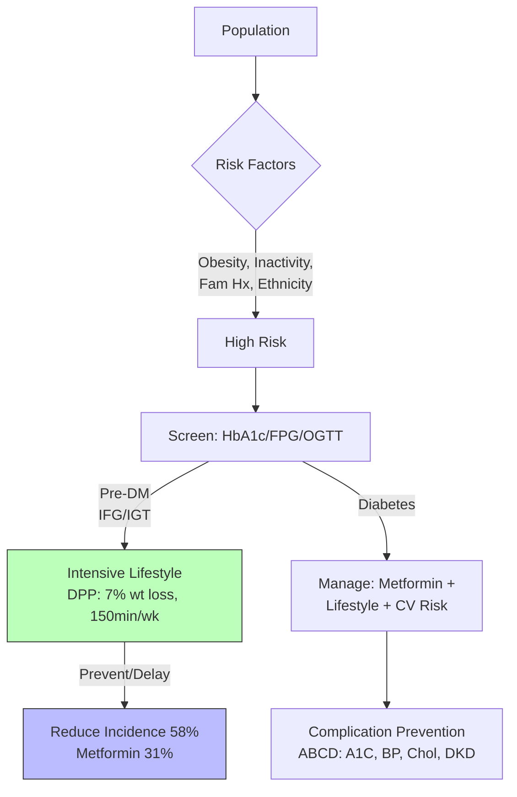

## 1. 1. Learning Objectives
By the end of this note you should be able to:
- [ ] Describe global diabetes burden (IDF Atlas): prevalence, incidence, mortality, projections
- [ ] Distinguish T1DM vs T2DM epidemiology: age, ethnicity, geography, trends
- [ ] Apply prevention: primary (lifestyle), secondary (screening, pre-DM intervention), tertiary (complication prevention)
- [ ] Calculate diabetes risk scores: FINDRISC, CANRISK, ADA
- [ ] Explain health economics: direct/indirect costs, cost-effectiveness of prevention

---

## 2. 2. Definition & Epidemiology

| Metric | Global (IDF 2021/2024) | UK |
|--------|------------------------|-----|
| **Adults 20-79y with Diabetes** | 537 million (10.5%) | ~4.9 million (diagnosed) |
| **Undiagnosed** | 240 million (44%) | ~850,000 |
| **Pre-Diabetes (IGT/IFG)** | 541 million (10.6%) | ~13.6 million |
| **Deaths (20-79y)** | 6.7 million (12% all deaths) | ~40,000/year |
| **Health Expenditure** | $966 billion (9% global) | £10-15 billion/year NHS |
| **Projections 2045** | 783 million (+46%) | Rising |

**Type Distribution:**
- **T2DM**: 90-95% (insulin resistance + relative deficiency)
- **T1DM**: 5-10% (absolute insulin deficiency, autoimmune)
- **GDM**: ~14% pregnancies (IDF), ↑ with age, obesity, ethnicity
- **Other**: MODY, LADA, secondary, neonatal (<1%)

---

## 3. 3. Clinical Features / Presentation
*Epidemiological patterns - see risk factors and demographics below.*

---

## 4. 4. Classification / Risk Factors & Demographics

| Factor | T1DM | T2DM |
|--------|------|------|
| **Age Peak** | Childhood/adolescence (bimodal <15, >30) | >40y (now ↑ in youth) |
| **Sex** | Slight male excess | Similar (varies by population) |
| **Ethnicity** | White > (highest Finland/Sardinia) | South Asian, Black, Hispanic, Indigenous > White |
| **Geography** | High latitudes (Finland 60/100K) | Pacific Islands, MENA, South Asia, Caribbean |
| **Genetics** | HLA-DR3/DR4 (40-50%); monogenic rare | Polygenic (TCF7L2, PPARG, KCNJ11); heritability 40-70% |
| **Modifiable (T2DM)** | - | Obesity (central), inactivity, diet (UPF, SSB), sleep, stress, microbiome |
| **Metabolic** | - | Pre-diabetes (IFG/IGT), MetS, NAFLD, PCOS, GDM hx, HTN, dyslipidaemia |

**Key Epidemiological Concepts:**
- **Thrifty Gene/Genotype Hypothesis**: Evolutionary adaptation to feast/famine → maladaptive in obesogenic environment
- **Developmental Origins (Barker)**: Low birth weight → ↑ T2DM, CVD (epigenetic programming)
- **Metabolic Syndrome**: Central obesity + 2 of (HTN, high TG, low HDL, high glucose) → 5x T2DM risk

---

## 5. 5. Diagnosis & Investigations (Screening & Risk Scores)

**Screening Criteria (ADA/WHO/NICE):**
| Group | Test | Interval |
|-------|------|----------|
| **Adults ≥40y** | HbA1c / FPG / OGTT | 3 years |
| **High-risk (BMI≥25 + 1 risk)** | HbA1c / FPG / OGTT | Annual |
| **GDM** | 75g OGTT 24-28wks | Per pregnancy |
| **Children BMI≥85th %ile + risk** | HbA1c / FPG / OGTT | 3 years from 10y/puberty |

**Diagnostic Thresholds:**
| Test | Normoglycaemia | Pre-Diabetes | Diabetes |
|------|----------------|--------------|----------|
| **FPG** | <5.6 (100) | 5.6-6.9 (100-125) | ≥7.0 (126) |
| **HbA1c** | <42 (6.0%) | 42-47 (6.0-6.4%) | ≥48 (6.5%) |
| **2h OGTT** | <7.8 (140) | 7.8-11.0 (140-199) | ≥11.1 (200) |
| **Random PG** | - | - | ≥11.1 (200) + symptoms |

**Risk Scores for T2DM:**
| Score | Variables | Use |
|-------|-----------|-----|
| **FINDRISC** | Age, BMI, WC, activity, veg/fruit, BP, hyperglycaemia, family | Europe, 8-item, score ≥15 high risk |
| **CANRISK** | Age, sex, ethnicity, BMI, WC, activity, diet, BP, hyperglycaemia, family, education | Canada, validated multi-ethnic |
| **ADA Risk Test** | Age, sex, family, HTN, activity, weight, GDM | US, simple 7-question |
| **QDiabetes** | Age, sex, ethnicity, BMI, smoking, steroids, CVD, HTN, DM, family, mental illness, deprivation | UK, GP records, 10-year risk |

**Mermaid: Diabetes Prevention Pathway**


---

## 6. 6. Differential Diagnosis (Epidemiological Patterns)

| Pattern | Explanation |
|---------|-------------|
| **T1DM Incidence ↑** | ~3-5%/year globally; environmental triggers (viral, vitamin D, microbiome, hygiene) |
| **T2DM in Youth ↑** | Driven by childhood obesity, inactivity, intrauterine exposure (GDM); aggressive phenotype |
| **Ethnic Disparities** | South Asian: younger onset, lower BMI, higher insulin resistance, ↑ CVD risk |
| **Undiagnosed Fraction** | ~44% globally; higher in LMICs, low-resource settings; screening yield depends on prevalence |
| **GDM → T2DM** | 50% develop T2DM within 10 years; postpartum OGTT essential |
| **Diabetes Mortality** | CVD 50-60%, renal 10-20%, infection, cancer; ↓ with modern management |

---

## 7. 7. Management (Prevention Evidence & Economics)

**Landmark Prevention Trials:**
| Trial | Population | Intervention | Result |
|-------|------------|--------------|--------|
| **Da Qing (China)** | IGT | Diet ± Exercise ± Both | 6-yr: 31-46% ↓ DM; 20-yr: 43% ↓ DM, 41% ↓ CVD |
| **DPP (US)** | Pre-DM (IGT + FPG) | Intensive Lifestyle (7% wt, 150min) vs Metformin vs Placebo | 3-yr: Lifestyle 58% ↓, Metformin 31% ↓ vs placebo |
| **DPPOS (Follow-up)** | DPP cohort | Long-term | 15-yr: Lifestyle 27% ↓, Metformin 18% ↓; microvascular ↓ |
| **Finnish DPS** | Pre-DM | Lifestyle counselling | 58% ↓; sustained benefit |
| **ADDITION-Europe** | Screen-detected T2DM | Intensive multifactorial vs Routine | CVD events similar; risk factors improved |

**Health Economics:**
- **Direct Costs**: Meds, monitoring, admissions, complications (amputation, dialysis, CVD)
- **Indirect Costs**: Productivity loss, absenteeism, early retirement, caregiver burden
- **Cost-Effectiveness**: Lifestyle intervention ~$1,000-5,000/QALY; Metformin cost-saving in high-risk
- **NHS DPP**: Digital/remote interventions scaling; NICE: cost-effective at £20K/QALY

---

## 8. 8. FCPS/MRCP High-Yield Summary (BULLET TABLE)

| Topic | Key Points |
|-------|------------|
| **Global Burden** | 537M adults (10.5%); 6.7M deaths; $966B cost; 783M by 2045 |
| **T2DM = 90-95%** | Obesity-driven epidemic; South Asian/Black/Indigenous highest risk |
| **T1DM Incidence** | Rising 3-5%/yr; Finland highest (60/100K); environmental triggers |
| **Pre-Diabetes** | 541M (IGT/IFG); high conversion to T2DM (5-10%/yr) |
| **Screening** | Adults ≥40y or high-risk; HbA1c/FPG/OGTT; FINDRISC/CANRISK/QDiabetes |
| **Diagnostic Thresholds** | FPG≥7.0, HbA1c≥48, 2hOGTT≥11.1, Random≥11.1+symptoms |
| **Prevention Evidence** | Da Qing, DPP: Lifestyle 58% ↓, Metformin 31% ↓; sustained long-term |
| **GDM** | 14% pregnancies; 50% → T2DM within 10y; postpartum OGTT |
| **Complications** | Micro: retinopathy, nephropathy, neuropathy. Macro: CVD (50-60% mortality) |
| **Economics** | 9% global health spend; prevention highly cost-effective (<£5K/QALY) |

---

## 9. 9. Viva Questions (MRCP PACES / FCPS)

| Question | Expected Answer |
|----------|-----------------|
| **Global diabetes prevalence and projection?** | 537M adults (10.5%) in 2021; projected 783M by 2045 (+46%). 6.7M deaths/year. |
| **T1DM vs T2DM epidemiology differences?** | T1DM: childhood peak, White ethnicity, high latitude, HLA-associated, 5-10%. T2DM: adult (now youth), obesity-driven, South Asian/Black/Indigenous high risk, 90-95%. |
| **Diagnostic thresholds for diabetes?** | FPG ≥7.0 mmol/L, HbA1c ≥48 mmol/mol (6.5%), 2h OGTT ≥11.1 mmol/L, Random ≥11.1 + symptoms. |
| **Pre-diabetes definitions?** | IFG: FPG 5.6-6.9. IGT: 2h OGTT 7.8-11.0. HbA1c 42-47 (6.0-6.4%). |
| **Key diabetes prevention trials?** | Da Qing (China): diet/exercise 31-46% ↓ at 6y, sustained. DPP (US): intensive lifestyle 58% ↓, metformin 31% ↓ at 3y. |
| **FINDRISC / QDiabetes - what are they?** | FINDRISC: 8-item European risk score (age, BMI, WC, activity, diet, BP, hyperglycaemia, family). QDiabetes: UK GP-record based 10-year risk. |
| **GDM epidemiology and long-term risk?** | ~14% pregnancies; risk factors: age, obesity, ethnicity, family, previous GDM/macrosomia. 50% develop T2DM within 10 years. |
| **Diabetes complications - epidemiology?** | CVD 50-60% deaths; retinopathy 30-40% (leading blindness); nephropathy 20-40% (leading ESRD); neuropathy 50%; foot ulcer 15-25% lifetime. |
| **Health economics of diabetes?** | 9% global health expenditure ($966B). UK NHS £10-15B/year. Prevention highly cost-effective (<£5K/QALY). |
| **Ethnic disparities in T2DM?** | South Asian: onset 5-10y younger, lower BMI threshold (23 vs 25), higher insulin resistance, 2-4x CVD risk vs White. |

---

## 10. 10. Confusions & Mnemonics

| Confusion | Clarification |
|-----------|---------------|
| **IFG vs IGT** | IFG = impaired FPG (hepatic IR). IGT = impaired 2h OGTT (muscle IR). Different pathophysiology; IGT higher CVD risk. |
| **Screening vs Diagnostic Thresholds** | Same thresholds; screening uses them in asymptomatic. Diagnostic requires confirmation (repeat test) unless symptomatic. |
| **HbA1c Limitations** | Affected by haemoglobinopathies, anaemia, renal failure, pregnancy, ethnicity (slightly higher in Black). Not for T1DM diagnosis (acute). |
| **DPP Lifestyle = 7% weight + 150min** | Key numbers: 7% body weight loss, 150 min/week moderate activity, low-fat calorie-restricted diet. |

**Mnemonic: DIABETES DIAGNOSTIC (FHOR)**
- **F**PG ≥7.0
- **H**bA1c ≥48
- **O**GTT 2h ≥11.1
- **R**andom ≥11.1 + symptoms

**Mnemonic: PRE-DIABETES (IFG-IGT)**
- **I**FG: **F**PG 5.6-6.9 (hepatic IR)
- **I**GT: **2h OGTT** 7.8-11.0 (muscle IR)
- **H**bA1c 42-47

**Mnemonic: DPP LIFESTYLE (7-150)**
- **7**% weight loss
- **150** min/week activity

**Mnemonic: ETHNIC RISK (SABI)**
- **S**outh **A**sian
- **B**lack
- **I**ndigenous
- (Highest risk, younger onset, lower BMI)

**Mnemonic: COMPLICATIONS (CVD-REN)**
- **CVD** 50-60% mortality
- **R**etinopathy (blindness)
- **E**SRD (nephropathy)
- **N**europathy/Foot (amputation)

---

## 11. 11. Mind Map

```mermaid
mindmap
  root((Diabetes Epidemiology))
    Burden
      537M (10.5%), 6.7M deaths
      783M by 2045
      $966B (9% health spend)
    Types
      T2DM 90-95%
      T1DM 5-10% (rising)
      GDM 14% preg
      Other <1%
    Risk Factors
      T1DM: HLA, latitude, viruses
      T2DM: Obesity, inactivity, diet
      Ethnicity: SA, Black, Indigenous
      GDM hx, Pre-DM, MetS
    Screening
      ≥40y or high-risk
      HbA1c/FPG/OGTT
      FINDRISC/QDiabetes
    Prevention
      DPP: Lifestyle 58%↓, Metformin 31%↓
      Da Qing: sustained
      Primary: lifestyle
      Secondary: pre-DM intervention
    Complications
      CVD 50-60% deaths
      Micro: eye, kidney, nerve
```

---

## 12. 12. One-Page Revision Card

| Domain | Key Points |
|--------|------------|
| **Global** | 537M adults, 6.7M deaths, 783M by 2045 |
| **T2DM 90-95%** | Obesity-driven; SA/Black/Indigenous highest |
| **Diagnostic** | FPG≥7.0, HbA1c≥48, 2hOGTT≥11.1, Rand≥11.1+sx |
| **Pre-DM** | IFG 5.6-6.9, IGT 7.8-11.0, HbA1c 42-47 |
| **Screening** | ≥40y or high-risk; FINDRISC/QDiabetes |
| **Prevention** | DPP: 7% wt, 150min → 58% ↓; Metformin 31% ↓ |
| **GDM** | 14% preg; 50% → T2DM in 10y |
| **Complications** | CVD 50-60% deaths; retinopathy, nephropathy, neuropathy |
| **Economics** | 9% health spend; prevention <£5K/QALY |

---

## 13. 13. Spaced Repetition Trackers

| Review Interval | Date Completed | Confidence (1-5) | Notes |
|-----------------|----------------|------------------|-------|
| 24 hours | | | |
| 7 days | | | |
| 15 days | | | |
| 30 days | | | |
| 90 days | | | |

---

## 14. 14. Self-Test Scorecard

| Section | Score /5 | Last Attempt |
|---------|----------|--------------|
| Global Burden Stats | | |
| T1DM vs T2DM Epi | | |
| Diagnostic Thresholds | | |
| Prevention Trials | | |
| Risk Scores | | |
| Complications Epi | | |
| Viva Questions | | |
| Mnemonics | | |

---

## 15. 15. Local Navigation

- **Parent Heading**: [[../Population Health and Epidemiology|Population Health and Epidemiology]]
- **Chapter Map**: [[../Population Health and Epidemiology Hierarchy|Hierarchy]]
- **Chapter MOC**: [[../Population Health and Epidemiology MOC|MOC]]
- **Related**: [[Cardiovascular Disease Epidemiology.md]], [[Cancer Epidemiology.md]], [[Measures of Disease Burden (DALY, QALY, HALE, YLL, YLD).md]]

---

#medicine #population-health #epidemiology #davidson #fcps #mrcp

## PasTest Scenario SBAs (Clinical Vignettes)

> **Auto-generated PasTest/Mediscope-style scenario SBAs** grounded in the authored source. Each scenario tests a real clinical fact (triad, specific sign, contraindication, trial, first-line Rx) extracted from the topic. *Source: Ch 6: Population Health — Diabetes & Metabolic Disease Epidemiology*

**Q1.** Which of the following features is most specific or characteristic of Diabetes & Metabolic Disease Epidemiology?

  - **A.** Screening vs Diagnostic Thresholds
  - **B.** A feature common to many acute inflammatory conditions
  - **C.** A non-specific sign that does not localise the diagnosis
  - **D.** An investigation finding rather than a clinical feature

  > **Answer: A** — Screening vs Diagnostic Thresholds
  >
  > *Source:* |
| **Screening vs Diagnostic Thresholds** | Same thresholds; screening uses them in asymptomatic. Diagnostic requires confirmation (repeat test) unless symptomatic

**Q2.** What is the most appropriate first-line therapy for Diabetes & Metabolic Disease Epidemiology?

  - **A.** Health Economics: + Direct Costs + Indirect Costs
  - **B.** An advanced/surgical therapy reserved for refractory disease
  - **C.** Symptomatic treatment only, no disease-modifying therapy
  - **D.** Empiric broad-spectrum therapy without specific indication

  > **Answer: A** — Health Economics: + Direct Costs + Indirect Costs
  >
  > *Source:* **Health Economics:**
- **Direct Costs**: Meds, monitoring, admissions, complications (amputation, dialysis, CVD)
- **Indirect Costs**: Productivity loss, absenteeism, early retirement, caregiver burd

