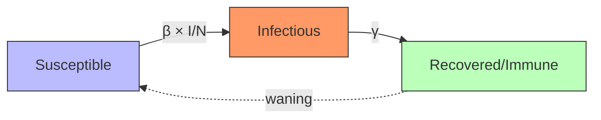
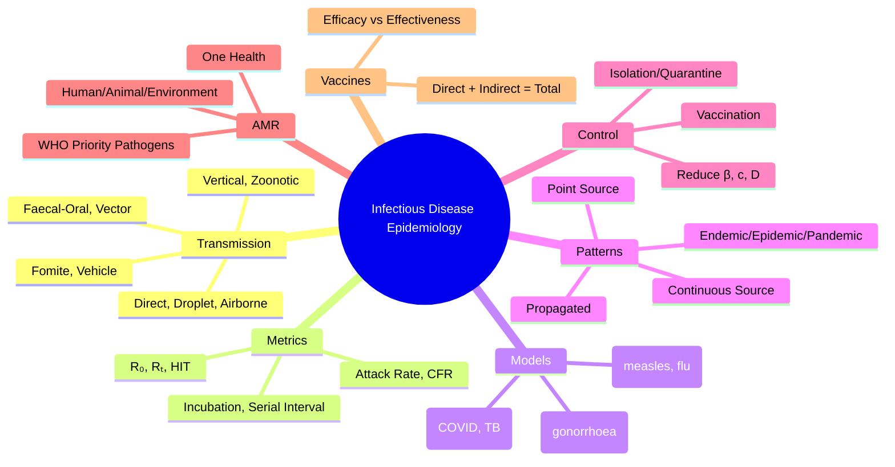

## 1. 1. Learning Objectives
By the end of this note you should be able to:
- [ ] Describe transmission modes: direct, indirect, vector-borne, vertical
- [ ] Calculate and interpret R₀, Rₜ, herd immunity threshold, generation time
- [ ] Apply epidemic models: SIR, SEIR, compartmental
- [ ] Distinguish epidemic patterns: point source, propagated, endemic, pandemic
- [ ] Explain antimicrobial resistance (AMR) epidemiology: drivers, surveillance, containment
- [ ] Apply vaccine epidemiology: efficacy vs effectiveness, impact, hesitancy

---

## 2. 2. Definition & Epidemiology

| Concept | Definition |
|---------|------------|
| **Infectious Disease Epidemiology** | Study of distribution, determinants, dynamics of infections in populations |
| **Transmission** | Pathogen movement from reservoir to susceptible host |
| **R₀ (Basic Reproduction Number)** | Average secondary cases from 1 infectious in fully susceptible population |
| **Rₜ (Effective Reproduction Number)** | Average secondary cases at time t (with immunity/interventions) |
| **Herd Immunity Threshold** | Proportion immune needed to interrupt transmission: 1 - 1/R₀ |
| **Serial Interval** | Time between symptom onset in infector-infectee pair |
| **Generation Time** | Time between infection of infector and infectee |

---

## 3. 3. Clinical Features / Presentation
*Methodological concepts - see transmission and modelling below.*

---

## 4. 4. Classification / Transmission Modes

| Mode | Mechanism | Examples |
|------|-----------|----------|
| **Direct Contact** | Person-to-person physical contact | STIs, skin infections, Ebola |
| **Droplet** | Large droplets >5μm, short range (<1-2m) | Influenza, pertussis, meningococcal, COVID-19 (partly) |
| **Airborne** | Aerosols <5μm, long-range, prolonged suspension | Measles, TB, varicella, SARS-CoV-2 (partly) |
| **Fomite** | Contaminated inanimate objects | Norovirus, rotavirus, C. difficile |
| **Faecal-Oral** | Ingestion of faecally contaminated material | Cholera, typhoid, hepatitis A, polio |
| **Vector-Borne** | Arthropod vector transmits | Malaria (mosquito), dengue, Lyme, plague |
| **Vehicle-Borne** | Food, water, blood, IV fluids | Salmonellosis, hepatitis B/C, HIV (blood) |
| **Vertical** | Mother to fetus/infant | HIV, syphilis, CMV, rubella, Zika, HBV |
| **Zoonotic** | Animal to human | Rabies, Ebola, COVID-19 (suspected), avian flu |

---

## 5. 5. Diagnosis & Investigations (Modelling & Metrics)

**Key Metrics:**
| Metric | Formula | Interpretation |
|--------|---------|----------------|
| **R₀** | β × c × D | >1 = epidemic potential; <1 = dies out |
| **HIT** | 1 - 1/R₀ | Proportion immune for elimination |
| **Attack Rate** | Cases / Exposed population | Outbreak intensity |
| **Case Fatality Rate** | Deaths / Confirmed cases | Severity |
| **Incubation Period** | Exposure to symptom onset | Quarantine duration |
| **Serial Interval** | Symptom onset infector → infectee | Contact tracing window |

**R₀ Values (Approximate):**
| Disease | R₀ | HIT (1-1/R₀) |
|---------|----|--------------|
| Measles | 12-18 | 92-95% |
| Pertussis | 12-17 | 92-94% |
| Chickenpox | 10-12 | 90-92% |
| Polio | 5-7 | 80-86% |
| Rubella | 6-7 | 83-86% |
| COVID-19 (original) | 2.5-3.5 | 60-71% |
| Influenza | 1.3-1.8 | 23-44% |
| Ebola | 1.5-2.5 | 33-60% |
| MERS | <1 (limited human spread) | N/A |

**Compartmental Models:**
- **SIR**: Susceptible → Infectious → Recovered (measles, influenza)
- **SEIR**: Susceptible → Exposed (latent) → Infectious → Recovered (COVID, TB)
- **SIS**: Susceptible → Infectious → Susceptible (no immunity: gonorrhoea)
- **SIRS**: Temporary immunity wanes

**Mermaid: SIR Model**

---

## 6. 6. Differential Diagnosis (Epidemic Patterns)

| Pattern | Description | Example |
|---------|-------------|---------|
| **Point Source** | Single exposure, sharp peak, rapid decline | Foodborne outbreak |
| **Continuous Common Source** | Ongoing exposure, plateau | Contaminated water supply |
| **Propagated** | Person-to-person, serial peaks (generations) | Influenza, measles, COVID-19 |
| **Endemic** | Constant baseline in population | Malaria (hyperendemic areas) |
| **Epidemic** | Cases > expected in area/time | Seasonal influenza |
| **Pandemic** | Worldwide spread across continents | COVID-19, 1918 influenza |
| **Sporadic** | Occasional, irregular cases | Rabies, tetanus |

---

## 7. 7. Management (Control Strategies & AMR)

**Transmission Control:**
| Target | Measures |
|--------|----------|
| **Reduce Susceptibles** | Vaccination, prophylaxis |
| **Reduce Infectiousness** | Treatment (antibiotics, antivirals), isolation |
| **Reduce Contact Rate** | Distancing, quarantine, school closure, travel restriction |
| **Reduce Transmission Probability** | Masks, ventilation, hand hygiene, PPE, vector control |

**Antimicrobial Resistance (AMR) Epidemiology:**
| Driver | Examples |
|--------|----------|
| **Human Use** | Overprescribing, incomplete courses, OTC access |
| **Animal/Agriculture** | Growth promotion, prophylaxis, residues |
| **Environmental** | Pharma waste, hospital effluent, agriculture runoff |
| **Transmission** | Poor IPC, travel, migration, healthcare-associated |

**AMR Surveillance:**
- **GLASS** (WHO Global Antimicrobial Resistance Surveillance System)
- **EARS-Net** (Europe), **NARMS** (US), **CARA** (UK)
- **Priority Pathogens**: CRE, MRSA, VRE, MDR-TB, XDR-TB, ESBL, fluoroquinolone-resistant Salmonella

**One Health Approach:** Human + Animal + Environmental health integration for zoonoses and AMR.

---

## 8. 8. FCPS/MRCP High-Yield Summary (BULLET TABLE)

| Topic | Key Points |
|-------|------------|
| **Transmission Modes** | Direct, droplet, airborne, fomite, faecal-oral, vector, vehicle, vertical, zoonotic |
| **R₀** | β × c × D. >1 = epidemic. Measles 12-18, COVID 2.5-3.5, Flu 1.3-1.8 |
| **Herd Immunity** | HIT = 1 - 1/R₀. Measles 92-95%, COVID 60-71% |
| **Epidemic Curves** | Point (sharp), Continuous (plateau), Propagated (serial peaks) |
| **Models** | SIR (measles), SEIR (COVID, TB), SIS (gonorrhoea) |
| **Serial Interval** | Symptom to symptom. Contact tracing window. |
| **AMR** | Human/animal/environment drivers. One Health. WHO priority pathogens. |
| **Vaccine Impact** | Direct (protect vaccinee) + Indirect (herd) = Total effect |
| **Outbreak Control** | Reduce β (transmission prob), c (contacts), D (duration infectious) |

---

## 9. 9. Viva Questions (MRCP PACES / FCPS)

| Question | Expected Answer |
|----------|-----------------|
| **Define R₀ and herd immunity threshold.** | R₀ = average secondary cases from 1 infectious in fully susceptible population. HIT = 1 - 1/R₀ = proportion immune needed to interrupt transmission. |
| **R₀ of measles, COVID, influenza?** | Measles 12-18, COVID original 2.5-3.5, Influenza 1.3-1.8. |
| **Difference between R₀ and Rₜ?** | R₀ = theoretical, fully susceptible population. Rₜ = effective at time t, accounting for immunity, interventions, depletion of susceptibles. |
| **Transmission modes - give examples.** | Direct: STIs. Droplet: influenza. Airborne: measles, TB. Faecal-oral: cholera. Vector: malaria. Fomite: norovirus. Vertical: HIV, syphilis. |
| **SIR vs SEIR model?** | SIR: S→I→R (no latent period). SEIR: S→E→I→R (E=exposed/latent). SEIR for diseases with incubation period (COVID, TB). |
| **Epidemic curve patterns?** | Point source: single exposure, sharp peak. Continuous: ongoing exposure, plateau. Propagated: person-to-person, serial peaks. |
| **AMR drivers - One Health?** | Human: overuse, misuse. Animal: growth promotion, prophylaxis. Environment: pharma waste. Transmission: poor IPC, travel. |
| **Vaccine efficacy vs effectiveness?** | Efficacy: RCT (ideal conditions). Effectiveness: real-world observational. Effectiveness ≤ Efficacy. |
| **Serial interval vs generation time?** | Generation: infection→infection. Serial: symptom→symptom. Serial ≈ generation + incubation difference. |
| **How reduce Rₜ below 1?** | Reduce β (masks, ventilation, treatment), reduce c (distancing, quarantine), reduce D (early isolation, treatment), increase immunity (vaccination). |

---

## 10. 10. Confusions & Mnemonics

| Confusion | Clarification |
|-----------|---------------|
| **R₀ vs Attack Rate** | R₀ = transmission potential. Attack rate = proportion infected in outbreak. Related but distinct. |
| **Airborne vs Droplet** | Airborne: <5μm, long-range, N95/FFP3. Droplet: >5μm, <1-2m, surgical mask. COVID has both components. |
| **Incubation vs Latent Period** | Incubation: exposure→symptoms. Latent: exposure→infectious. Latent ≤ Incubation (can be infectious before symptoms). |
| **Vaccine Impact** | Total = Direct + Indirect (herd). Indirect can exceed direct for high R₀ diseases. |
| **Endemic vs Epidemic** | Endemic = constant baseline. Epidemic = >expected. Hyperendemic = high constant. |

**Mnemonic: TRANSMISSION MODES (DD-AFV-Z)**
- **D**irect **D**roplet
- **A**irborne
- **F**omite **F**aecal-oral
- **V**ector **V**ehicle
- **Z**oonotic **Z**ертикальная (Vertical)

**Mnemonic: R-ZERO (βCD)**
- **R**₀ = **β** (transmissibility) × **c** (contacts) × **D** (duration)

**Mnemonic: HERD IMMUNITY (HIT)**
- **H**IT = **1 - 1/R₀**
- **M**easles **R**₀=12-18 → **H**IT=**92-95%**

**Mnemonic: EPIDEMIC PATTERNS (PCP)**
- **P**oint source = **P**eak
- **C**ontinuous = **C**onstant/Plateau
- **P**ropagated = **P**eaks serial

**Mnemonic: AMR ONE HEALTH (HAET)**
- **H**uman use
- **A**nimal agriculture
- **E**nvironment
- **T**ransmission (IPC, travel)

---

## 11. 11. Mind Map

---

## 12. 12. One-Page Revision Card

| Domain | Key Points |
|--------|------------|
| **Transmission** | Direct, droplet, airborne, fomite, faecal-oral, vector, vehicle, vertical, zoonotic |
| **R₀** | β × c × D. Measles 12-18, COVID 2.5-3.5, Flu 1.3-1.8 |
| **HIT** | 1 - 1/R₀. Measles 92-95% |
| **Models** | SIR (no latency), SEIR (latency), SIS (no immunity) |
| **Epidemic Curves** | Point (peak), Continuous (plateau), Propagated (serial peaks) |
| **Serial Interval** | Symptom→symptom; contact tracing window |
| **AMR** | One Health: Human, Animal, Environment |
| **Control** | Reduce β (masks, treatment), c (distancing), D (isolation) |
| **Vaccine** | Efficacy (RCT) vs Effectiveness (real world) |

---

## 13. 13. Spaced Repetition Trackers

| Review Interval | Date Completed | Confidence (1-5) | Notes |
|-----------------|----------------|------------------|-------|
| 24 hours | | | |
| 7 days | | | |
| 15 days | | | |
| 30 days | | | |
| 90 days | | | |

---

## 14. 14. Self-Test Scorecard

| Section | Score /5 | Last Attempt |
|---------|----------|--------------|
| Transmission Modes | | |
| R₀ / HIT Calculations | | |
| SIR/SEIR Models | | |
| Epidemic Patterns | | |
| AMR One Health | | |
| Vaccine Epidemiology | | |
| Viva Questions | | |
| Mnemonics | | |

---

## 15. 15. Local Navigation

- **Parent Heading**: [[../Population Health and Epidemiology|Population Health and Epidemiology]]
- **Chapter Map**: [[../Population Health and Epidemiology Hierarchy|Hierarchy]]
- **Chapter MOC**: [[../Population Health and Epidemiology MOC|MOC]]
- **Related**: [[Disease Surveillance & Outbreak Investigation.md]], [[Immunisation & Vaccination Programs.md]], [[Notifiable Diseases & International Health Regulations.md]]

---

#medicine #population-health #epidemiology #davidson #fcps #mrcp
