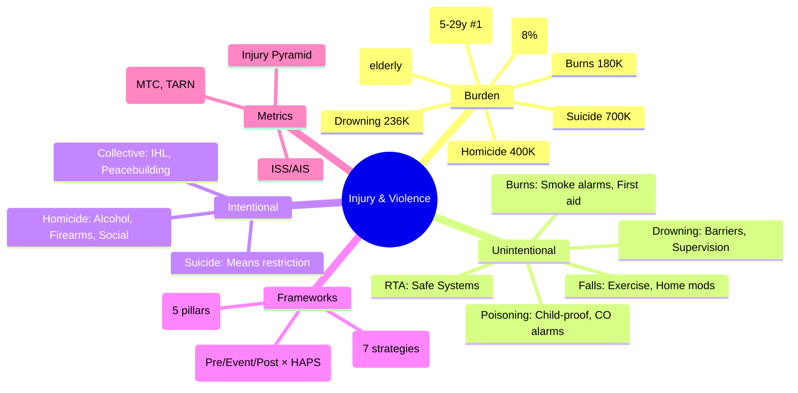

## 1. 1. Learning Objectives
By the end of this note you should be able to:
- [ ] Describe global injury burden: 4.4M deaths, leading causes (RTA, falls, drowning, burns, violence)
- [ ] Apply Haddon Matrix: pre-event, event, post-event × host, agent, environment
- [ ] Distinguish unintentional vs intentional (violence) injuries
- [ ] Apply Safe Systems approach (roads) and violence prevention frameworks
- [ ] Interpret injury metrics: mortality, morbidity (disability, ISS), cost
- [ ] Identify priority populations: children, elderly, LMICs, occupational

---

## 2. 2. Definition & Epidemiology

| Metric | Global (GBD 2019) | UK |
|--------|-------------------|-----|
| **Injury Deaths** | 4.4 million (8% all deaths) | ~13,000/year |
| **RTA Deaths** | 1.35 million | ~1,700 |
| **Fall Deaths** | ~700,000 | ~5,000 (leading injury death elderly) |
| **Drowning** | ~236,000 | ~200 |
| **Burns** | ~180,000 | ~200 |
| **Suicide** | ~700,000 | ~5,500 |
| **Homicide** | ~400,000 | ~600 |
| **DALYs** | ~300 million | Major |
| **Leading Killer 5-29y** | **Road Traffic Accidents** | RTA |

**Injury Pyramid (for each death):**
- Deaths: 1
- Hospitalisations: ~10-50
- ED visits: ~100-200
- Community-treated: ~500-1000

---

## 3. 3. Clinical Features / Presentation
*Epidemiological patterns by mechanism - see classifications below.*

---

## 4. 4. Classification / Injury Types

| Category | Mechanism | Key Populations | Prevention Priority |
|----------|-----------|-----------------|---------------------|
| **Unintentional** | | | |
| Road Traffic (RTA) | Vehicle occupant, pedestrian, cyclist, motorcyclist | 5-29y (leading), LMICs (90% deaths) | Safe Systems, helmet, seatbelt, speed |
| Falls | Slips, trips, height, stairs | Elderly (>65y), children, occupational | Home mods, exercise, gait assessment |
| Drowning | Open water, pools, baths | Children 1-4y, males, LMICs, flood | Barriers, supervision, swim skills, lifejackets |
| Burns | Thermal, chemical, electrical | Children <5y (scalds), LMICs (cooking), occupational | Smoke alarms, water temp, first aid |
| Poisoning | Medicines, CO, chemicals | Children <5y, suicide intent, occupational | Child-resistant packs, CO alarms |
| **Intentional (Violence)** | | | |
| Self-harm/Suicide | Hanging, pesticide, firearms, jumping | 15-29y (4th leading), male completion | Means restriction, mental health, gatekeepers |
| Interpersonal/Homicide | Firearms, sharp objects, assault | Young males, intimate partner, gangs | Social programmes, alcohol control, policing |
| Collective/War | Conflict, terrorism | Populations in conflict zones | Peacebuilding, IHL, humanitarian protection |
| **Other** | | | |
| Occupational | Machinery, falls, chemicals, ergonomic | Workers, informal sector | OSH regulations, hierarchy of controls |
| Sports/Recreation | Contact sports, water, adventure | Youth, athletes | Rules, protective gear, concussion protocols |

---

## 5. 5. Diagnosis & Investigations (Frameworks & Metrics)

**Haddon Matrix (Classic Injury Prevention Framework):**
| Phase \ Factor | **Host (Human)** | **Agent (Energy/Vehicle)** | **Physical Environment** | **Social Environment** |
|----------------|------------------|----------------------------|--------------------------|------------------------|
| **Pre-Event** (Prevent crash) | Licensing, training, sobriety, vision | Vehicle standards, brakes, tyres | Road design, lighting, signage | Speed limits, traffic laws, enforcement |
| **Event** (Reduce injury) | Seatbelts, helmets, airbags, child restraints | Crumple zones, collapsible steering | Barriers, clear zones, breakaway poles | Emergency notification (eCall) |
| **Post-Event** (Improve outcome) | First aid, bystander CPR, trauma training | Fire suppression, fuel cut-off | Trauma system access, helicopter EMS | Trauma registries, rehabilitation, compensation |

**Safe Systems Approach (Roads):**
- **Safe Roads** (design, star rating)
- **Safe Speeds** (limits, enforcement, traffic calming)
- **Safe Vehicles** (standards, NCAP, tech: AEB, ESC)
- **Safe Road Users** (licensing, impairment, distraction, vulnerable users)
- **Post-Crash Response** (trauma care, data)

**Violence Prevention (WHO INSPIRE / Ecological Model):**
| Level | Strategies |
|-------|------------|
| **Individual** | Life skills, parenting, CBT, substance treatment |
| **Relationship** | Home visiting, mentoring, bystander programmes |
| **Community** | Safe streets, alcohol outlet density, youth centres |
| **Societal** | Legislation (firearms, alcohol), gender equality, poverty reduction, data systems |

**Injury Severity Metrics:**
- **ISS (Injury Severity Score)**: Sum of squares of highest AIS in 3 body regions (1-75; >15 major trauma)
- **AIS (Abbreviated Injury Scale)**: 1-6 per injury (1 minor, 6 maximal)
- **RTS (Revised Trauma Score)**: Physiologic (GCS, SBP, RR) → triage
- **Disability Weights** (GBD): Fractures, TBI, spinal cord, burns

---

## 6. 6. Differential Diagnosis (Epidemiological Patterns)

| Pattern | Explanation |
|---------|-------------|
| **RTA: LMICs 90% deaths** | Mixed traffic, poor infrastructure, weak enforcement, older vehicles, delayed care |
| **Falls: Elderly exponential** | Sarcopenia, polypharmacy, comorbidity, environment; hip fracture → 20% 1-yr mortality |
| **Drowning: Children 1-4y** | Curiosity, lack of barriers, supervision lapses; buckets, wells, pools |
| **Burns: LMICs cooking** | Open fires, kerosene, loose clothing; female > male in some regions |
| **Suicide: Pesticides (LMICs), Firearms (US), Hanging (UK)** | Means restriction most effective single intervention |
| **Homicide: Young males, firearms** | Gangs, drugs, inequality, alcohol; intimate partner violence (female victims) |

---

## 7. 7. Management (Prevention & Trauma Systems)

**Evidence-Based Interventions (WHO "Best Buys"):**
| Injury | Intervention | Effectiveness |
|--------|--------------|---------------|
| **RTA** | Speed cameras, helmet laws (motorcycle 42% ↓ death), seatbelts (45-50% ↓ death), BAC limits, child restraints | High |
| **Falls (Elderly)** | Exercise (balance/strength 30-40% ↓), home hazard assessment, medication review, vision correction | Moderate-High |
| **Drowning** | Pool fencing (isolation 70% ↓), lifejackets, swim lessons, supervision | High |
| **Burns** | Smoke alarms (50% ↓ death), water heater <50°C, first aid (cool 20min) | High |
| **Suicide** | Pesticide bans (Sri Lanka 50% ↓), bridge barriers, gun safe storage, media guidelines | High |
| **Violence** | Early childhood programmes, alcohol pricing/availability, firearm laws, parenting | Moderate |

**Trauma Systems:**
- **Inclusive Trauma Systems**: Pre-hospital → ED → Definitive care → Rehab
- **Major Trauma Centres (MTCs)**: 24/7 consultants, CT, OR, ICU, all specialties
- **Trauma Networks**: Triage tools (RTS, ISS), bypass protocols, performance indicators (TARN)
- **Rehabilitation**: Early multidisciplinary, community integration, vocational

---

## 8. 8. FCPS/MRCP High-Yield Summary (BULLET TABLE)

| Topic | Key Points |
|-------|------------|
| **Global Injury Deaths** | 4.4M (8%); RTA 1.35M, Falls 700K, Suicide 700K, Homicide 400K, Drowning 236K, Burns 180K |
| **RTA #1 Killer 5-29y** | 90% deaths in LMICs; pedestrians/cyclists/motorcyclists = 54% (vulnerable users) |
| **Falls Leading Elderly** | Hip fracture: 20% 1-yr mortality; exercise 30-40% ↓ falls |
| **Haddon Matrix** | Pre/Event/Post × Host/Agent/Physical Env/Social Env |
| **Safe Systems** | Safe Roads, Speeds, Vehicles, Users, Post-Crash |
| **Suicide Means Restriction** | Most effective single intervention (pesticides, firearms, barriers) |
| **Injury Pyramid** | 1 death : 10-50 hosp : 100-200 ED : 500-1000 community |
| **ISS** | >15 major trauma; sum of squares top 3 AIS |
| **Trauma Systems** | MTCs, networks, TARN, rehab |
| **Violence Prevention** | INSPIRE: Implementation, Norms, Safe environments, Parenting, Income, Response, Education |

---

## 9. 9. Viva Questions (MRCP PACES / FCPS)

| Question | Expected Answer |
|----------|-----------------|
| **Global injury deaths and leading causes?** | 4.4M/year (8%). RTA 1.35M, Falls ~700K, Suicide ~700K, Homicide ~400K, Drowning 236K, Burns 180K. |
| **RTA epidemiology - who most affected?** | Leading killer 5-29y. 90% deaths in LMICs. Vulnerable users (pedestrians, cyclists, motorcyclists) = 54% of deaths. |
| **Haddon Matrix - describe phases and factors.** | Phases: Pre-event (prevent), Event (reduce severity), Post-event (improve outcome). Factors: Host, Agent/Vehicle, Physical Environment, Social Environment. |
| **Safe Systems approach for road safety?** | 5 pillars: Safe Roads (design), Safe Speeds (limits/calming), Safe Vehicles (standards/tech), Safe Road Users (behaviour), Post-Crash Response (trauma care). |
| **Falls in elderly - prevention evidence?** | Exercise (balance/strength) 30-40% reduction. Multifactorial: home hazards, medication review, vision, footwear. Hip fracture 20% 1-yr mortality. |
| **Suicide prevention - most effective intervention?** | Means restriction: pesticide bans (Sri Lanka 50% ↓), bridge barriers, firearm safe storage, media reporting guidelines. |
| **Drowning - key populations and prevention?** | Children 1-4y (buckets, pools, wells). Pool isolation fencing 70% ↓. Lifejackets, supervision, swim skills. |
| **Burns - LMIC vs HIC patterns?** | LMIC: cooking fires, kerosene, females, children. HIC: scalds (kids), flame (adults), occupational. Smoke alarms 50% ↓ death. |
| **What is ISS? How calculated?** | Injury Severity Score: sum of squares of highest AIS in 3 most injured body regions. Range 1-75. >15 = major trauma. |
| **Violence prevention - WHO INSPIRE?** | 7 strategies: Implementation of laws, Norms change, Safe environments, Parenting support, Income strengthening, Response services, Education/life skills. |

---

## 10. 10. Confusions & Mnemonics

| Confusion | Clarification |
|-----------|---------------|
| **Unintentional vs Intentional** | Unintentional = RTA, falls, drowning, burns, poisoning. Intentional = suicide, homicide, war. Both use Haddon Matrix. |
| **Haddon vs Safe Systems** | Haddon = general framework (all injuries). Safe Systems = specific application for roads (vision zero). |
| **ISS vs AIS** | AIS = per injury (1-6). ISS = sum of squares top 3 body regions. ISS derived from AIS. |
| **Injury Pyramid** | Ratios vary by mechanism/context. Deaths = tip; hospitalisations/ED = burden for health systems. |
| **Violence = Public Health Issue** | Not just criminal justice. Ecological model: individual, relationship, community, societal. |

**Mnemonic: INJURY DEATHS (RFS-DHB)**
- **R**TA 1.35M
- **F**alls 700K
- **S**uicide 700K
- **D**rowning 236K
- **H**omicide 400K
- **B**urns 180K

**Mnemonic: HADDON MATRIX (PE-HAPS)**
- **P**re, **E**vent, **P**ost
- **H**ost, **A**gent, **P**hysical, **S**ocial

**Mnemonic: SAFE SYSTEMS (5 RSVUP)**
- **R**oads (design)
- **S**peeds (limits)
- **V**ehicles (standards)
- **U**sers (behaviour)
- **P**ost-crash (trauma care)

**Mnemonic: SUICIDE MEANS (RPFBG)**
- **R**estriction **P**esticides
- **F**irearms safe storage
- **B**arriers (bridges)
- **G**uidelines (media)

**Mnemonic: VIOLENCE INSPIRE (7)**
- **I**mplementation of laws
- **N**orms change
- **S**afe environments
- **P**arenting
- **I**ncome
- **R**esponse services
- **E**ducation

---

## 11. 11. Mind Map

---

## 12. 12. One-Page Revision Card

| Domain | Key Points |
|--------|------------|
| **Global Deaths** | 4.4M: RTA 1.35M, Falls 700K, Suicide 700K, Homicide 400K |
| **RTA** | 5-29y #1 killer; 90% LMICs; vulnerable users 54% |
| **Falls** | Elderly leading; hip fracture 20% 1-yr mort; exercise 30-40% ↓ |
| **Haddon** | Pre/Event/Post × Host/Agent/Phys Env/Soc Env |
| **Safe Systems** | Roads, Speeds, Vehicles, Users, Post-Crash |
| **Suicide** | Means restriction most effective |
| **Drowning** | Kids 1-4y; pool fence 70% ↓ |
| **ISS** | Sum squares top 3 AIS; >15 major |
| **INSPIRE** | 7 violence prevention strategies |

---

## 13. 13. Spaced Repetition Trackers

| Review Interval | Date Completed | Confidence (1-5) | Notes |
|-----------------|----------------|------------------|-------|
| 24 hours | | | |
| 7 days | | | |
| 15 days | | | |
| 30 days | | | |
| 90 days | | | |

---

## 14. 14. Self-Test Scorecard

| Section | Score /5 | Last Attempt |
|---------|----------|--------------|
| Global Burden Stats | | |
| Mechanism-Specific Epi | | |
| Haddon Matrix | | |
| Safe Systems | | |
| Suicide/Violence Prevention | | |
| Trauma Systems/ISS | | |
| Viva Questions | | |
| Mnemonics | | |

---

## 15. 15. Local Navigation

- **Parent Heading**: [[../Population Health and Epidemiology|Population Health and Epidemiology]]
- **Chapter Map**: [[../Population Health and Epidemiology Hierarchy|Hierarchy]]
- **Chapter MOC**: [[../Population Health and Epidemiology MOC|MOC]]
- **Related**: [[Mental Health & Neurological Disorders Epidemiology.md]], [[Global Burden of Disease (GBD Study, Risk Factors).md]], [[Health Promotion & Disease Prevention (Primary, Secondary, Tertiary).md]]

---

#medicine #population-health #epidemiology #davidson #fcps #mrcp

## PasTest Scenario SBAs (Clinical Vignettes)

> **Auto-generated PasTest/Mediscope-style scenario SBAs** grounded in the authored source. Each scenario tests a real clinical fact (triad, specific sign, contraindication, trial, first-line Rx) extracted from the topic. *Source: Ch 6: Population Health — Injury & Violence Epidemiology*

**Q1.** Which of the following features is most specific or characteristic of Injury & Violence Epidemiology?

  - **A.** Haddon vs Safe Systems
  - **B.** A feature common to many acute inflammatory conditions
  - **C.** A non-specific sign that does not localise the diagnosis
  - **D.** An investigation finding rather than a clinical feature

  > **Answer: A** — Haddon vs Safe Systems
  >
  > *Source:* |
| **Haddon vs Safe Systems** | Haddon = general framework (all injuries). Safe Systems = specific application for roads (vision zero)

**Q2.** What is the most appropriate first-line therapy for Injury & Violence Epidemiology?

  - **A.** Burns
  - **B.** An advanced/surgical therapy reserved for refractory disease
  - **C.** Symptomatic treatment only, no disease-modifying therapy
  - **D.** Empiric broad-spectrum therapy without specific indication

  > **Answer: A** — Burns
  >
  > *Source:* **Burns**   Smoke alarms (50% ↓ death), water heater <50°C, first aid (cool 20min)   High

