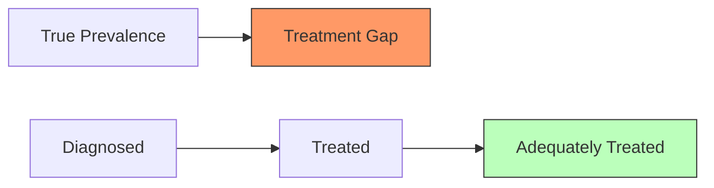
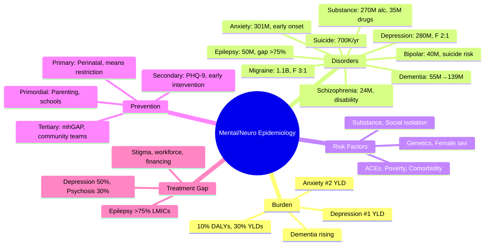

## 1. 1. Learning Objectives
By the end of this note you should be able to:
- [ ] Describe global burden of mental/neurological disorders (GBD): depression, anxiety, bipolar, schizophrenia, dementia, epilepsy, migraine
- [ ] Identify risk factors: genetic, early life adversity, social determinants, comorbidities, substance use
- [ ] Apply prevention: primary (parenting, schools, workplace), secondary (screening, early intervention), tertiary (rehab, recovery)
- [ ] Explain treatment gap: magnitude, causes, WHO mhGAP
- [ ] Interpret suicide epidemiology: rates, methods, prevention strategies
- [ ] Distinguish neurological vs mental health epidemiology and overlap

---

## 2. 2. Definition & Epidemiology

| Disorder | Global Prevalence | Global YLD Rank | Key Features |
|----------|-------------------|-----------------|--------------|
| **Depressive Disorders** | ~280M (3.8%) | #1 | Female > male, peak 50-60y, recurrent |
| **Anxiety Disorders** | ~301M (4%) | #2 | Female > male, early onset, comorbid |
| **Bipolar Disorder** | ~40M (0.5%) | #18 | Equal sex, onset 20-30y, high suicide risk |
| **Schizophrenia** | ~24M (0.3%) | #15 | Male earlier onset, chronic, high disability |
| **Dementia** | ~55M | #7 (neurological) | Age exponential, 60% in LMICs, Alzheimer's 60-70% |
| **Epilepsy** | ~50M | #12 | 80% in LMICs, treatment gap >75% |
| **Migraine** | ~1.1B | #2 (neurological) | Female 3:1, peak 30-40y, high disability |
| **Substance Use** | ~270M (alcohol), ~35M (drugs) | High | Male > female, young adults, comorbidity |
| **Autism/ADHD** | ~1% / ~5% | Rising | Childhood onset, lifelong |

**Mental/Neurological = 10% global DALYs, 30% YLDs**
- Depression + Anxiety = ~50% mental health DALYs
- Suicide: ~700K/year (4th leading death 15-29y)
- Dementia: projected 139M by 2050

---

## 3. 3. Clinical Features / Presentation
*Epidemiological patterns by disorder - see risk factors and prevention below.*

---

## 4. 4. Classification / Risk Factors

| Domain | Risk Factors |
|--------|--------------|
| **Genetic** | Family history (all major disorders); polygenic (GWAS: depression, schizophrenia, bipolar, Alzheimer's); rare variants (APP, PSEN1/2 for early Alzheimer's) |
| **Early Life** | Adverse childhood experiences (ACEs), maltreatment, bullying, parental loss, prenatal stress/infection |
| **Social Determinants** | Poverty, unemployment, housing instability, discrimination, social isolation, loneliness, violence |
| **Comorbidities** | Chronic physical illness (CVD, diabetes, cancer, COPD) → 2-3x depression/anxiety |
| **Substance Use** | Alcohol, cannabis, opioids, stimulants → bidirectional with mental disorders |
| **Neurological** | Stroke, TBI, Parkinson's, MS → depression, dementia, psychosis |
| **Demographic** | Female (depression, anxiety, migraine); Male (substance, suicide completion, early-onset schizophrenia); Age (dementia exponential, youth onset mental); LGBTQ+ (minority stress) |

---

## 5. 5. Diagnosis & Investigations (Screening & Metrics)

**Screening Tools (Population/Primary Care):**
| Disorder | Tool | Threshold |
|----------|------|-----------|
| **Depression** | PHQ-2 (2-item), PHQ-9 | PHQ-2 ≥3 → PHQ-9; PHQ-9 ≥10 |
| **Anxiety** | GAD-2, GAD-7 | GAD-2 ≥3 → GAD-7; GAD-7 ≥10 |
| **Dementia** | GPCOG, MoCA, MMSE | MoCA <26, MMSE <24 |
| **Alcohol** | AUDIT-C, CAGE | AUDIT-C ≥5 (M), ≥4 (F) |
| **Psychosis** | Prodromal Questionnaire (PQ-B) | High-risk referral |

**Key Metrics:**
- **Treatment Gap** = (Prevalence - Treated) / Prevalence. Depression ~50%, Psychosis ~30%, Epilepsy >75% (LMICs), Dementia ~50% undiagnosed
- **Years Lived with Disability (YLD)** = Prevalence × Disability Weight
- **Suicide Rate** = Deaths per 100,000 population (age-standardised)

**Mermaid: Treatment Gap**

---

## 6. 6. Differential Diagnosis (Epidemiological Patterns)

| Pattern | Explanation |
|---------|-------------|
| **Female > Male (Depression/Anxiety)** | Hormonal, psychosocial, reporting bias, help-seeking |
| **Male > Female (Suicide Completion)** | More lethal methods (firearms, hanging), less help-seeking |
| **Early Onset (Anxiety, ADHD, Autism)** | Neurodevelopmental; median onset anxiety ~11y |
| **Late Onset (Dementia, Late-life Depression)** | Neurodegenerative, vascular, medical comorbidity |
| **Comorbidity Rule** | Mental-mental > chance; Mental-physical bidirectional |
| **Treatment Gap** | Stigma, workforce shortage, financing, primary care capacity, LMIC > HIC |

---

## 7. 7. Management (Prevention & WHO mhGAP)

**Prevention Strategies:**
| Level | Interventions |
|-------|---------------|
| **Primordial** | Parenting programmes, school SEL, anti-bullying, workplace mental health, urban design (green space), poverty reduction |
| **Primary** | Perinatal mental health, stress management, physical activity, sleep hygiene, substance prevention, suicide means restriction |
| **Secondary** | Screening (PHQ-9, GAD-7), early intervention psychosis, post-natal depression, post-stroke depression, memory clinics |
| **Tertiary** | Community mental health teams, crisis resolution, supported employment, rehabilitation, dementia care, carer support |

**WHO mhGAP (Mental Health Gap Action Programme):**
- Priority conditions: Depression, Psychosis, Bipolar, Epilepsy, Dementia, SUD, Suicide, Child/adolescent
- Integration into primary care: trained non-specialists, supervision, referral pathways
- Psychosocial interventions: psychoeducation, CBT, IPT, family, peer support

**Suicide Prevention (WHO LIVE LIFE):**
- **L**eadership (national strategy)
- **I**nterpersonal (gatekeeper training)
- **V**ulnerable groups (follow-up post-attempt)
- **E**nvironment (means restriction: pesticides, firearms, barriers)
- **L**ife skills (youth)
- **I**dentification (screening)
- **F**ollow-up (post-discharge)
- **E**valuation (surveillance)

---

## 8. 8. FCPS/MRCP High-Yield Summary (BULLET TABLE)

| Topic | Key Points |
|-------|------------|
| **Mental/Neuro = 10% DALYs, 30% YLDs** | Depression #1 YLD, Anxiety #2, Migraine #2 neuro |
| **Depression** | 280M, female 2:1, recurrent, comorbid CVD/DM |
| **Anxiety** | 301M, early onset, comorbid |
| **Dementia** | 55M → 139M by 2050; Alzheimer's 60-70%; 60% LMICs |
| **Epilepsy** | 50M; treatment gap >75% LMICs; stigma |
| **Suicide** | 700K/year; 4th leading death 15-29y; male completion > female attempt |
| **Treatment Gap** | Depression ~50%, Psychosis ~30%, Epilepsy >75% LMICs |
| **Risk Factors** | ACEs, poverty, comorbidity, substance, social isolation |
| **Prevention** | Parenting, schools, workplace, screening, mhGAP integration |
| **Suicide Prevention** | Means restriction, gatekeepers, follow-up, media guidelines |

---

## 9. 9. Viva Questions (MRCP PACES / FCPS)

| Question | Expected Answer |
|----------|-----------------|
| **Top causes of YLDs globally?** | 1) Low back pain, 2) Depressive disorders, 3) Headache disorders, 4) Anxiety disorders, 5) Neck pain. Mental/neurological = 30% YLDs. |
| **Depression epidemiology - prevalence, sex ratio?** | ~280M (3.8%). Female:male ~2:1. Peak prevalence 50-60y. Recurrent (50% recurrence after 1st episode). |
| **Dementia global burden and projection?** | 55M currently, projected 139M by 2050. 60% in LMICs. Alzheimer's 60-70%. Exponential with age. |
| **Epilepsy treatment gap?** | >75% in LMICs receive no treatment. Causes: stigma, cost, workforce, drug supply, diagnosis. |
| **Suicide epidemiology - key facts?** | ~700K/year globally. 4th leading cause death 15-29y. Male:female completion ~3:1; female attempts > male. Methods: pesticide, hanging, firearms. |
| **What is WHO mhGAP?** | Mental Health Gap Action Programme: integrate priority mental/neurological conditions into primary care via trained non-specialists, supervision, referral. Conditions: depression, psychosis, bipolar, epilepsy, dementia, SUD, suicide, child/adolescent. |
| **Risk factors for mental disorders?** | ACEs, poverty, unemployment, discrimination, social isolation, chronic physical illness, substance use, genetics, urbanisation. |
| **Prevention levels for mental health?** | Primordial: parenting, school SEL, workplace. Primary: perinatal, stress mgmt, means restriction. Secondary: screening (PHQ-9), early intervention. Tertiary: community teams, rehab, carer support. |
| **Why male > female suicide completion?** | More lethal methods, less help-seeking, higher impulsivity, alcohol involvement. |
| **Migraine epidemiology?** | ~1.1B (14%). Female 3:1. Peak 30-40y. #2 neurological YLD. High disability during attacks. |

---

## 10. 10. Confusions & Mnemonics

| Confusion | Clarification |
|-----------|---------------|
| **YLD vs YLL in Mental Health** | Mental disorders = mostly YLD (low mortality directly, high disability). YLL from suicide, comorbid physical illness. |
| **Prevalence vs Lifetime Risk** | 12-month prevalence ~4-5% depression. Lifetime risk ~15-20%. |
| **Treatment Gap Definition** | (Prevalence - Treated) / Prevalence. Not same as "untreated" (includes inadequately treated). |
| **Dementia vs Alzheimer's** | Dementia = syndrome. Alzheimer's = most common cause (60-70%). Others: vascular, Lewy body, frontotemporal. |
| **Suicide Rate vs Attempts** | Rate = deaths/100K. Attempts 10-20x deaths. Female attempts > male; male deaths > female. |

**Mnemonic: MENTAL YLD LEADERS (DAMN)**
- **D**epressive disorders (#1)
- **A**nxiety disorders (#2)
- **M**igraine (#2 neuro)
- **N**eck/back pain (musculoskeletal)

**Mnemonic: DEPRESSION EPIDEMIOLOGY (FRCR)**
- **F**emale 2:1
- **R**ecurrent (50%)
- **C**omorbid (CVD, DM)
- **R**ising (youth, post-COVID)

**Mnemonic: DEMENTIA (55-139-60)**
- **55**M now
- **139**M by 2050
- **60**% in LMICs

**Mnemonic: SUICIDE PREVENTION (LIVE LIFE)**
- **L**eadership (strategy)
- **I**nterpersonal (gatekeepers)
- **V**ulnerable (follow-up)
- **E**nvironment (means restriction)
- **L**ife skills
- **I**dentification (screening)
- **F**ollow-up
- **E**valuation

**Mnemonic: MHGAP CONDITIONS (DEBDS CS)**
- **D**epression
- **E**pilepsy
- **B**ipolar
- **D**ementia
- **S**chizophrenia
- **C**hild/Adolescent
- **S**ubstance/Suicide

---

## 11. 11. Mind Map

---

## 12. 12. One-Page Revision Card

| Domain | Key Points |
|--------|------------|
| **Burden** | 10% DALYs, 30% YLDs |
| **Depression** | 280M, F 2:1, recurrent, comorbid |
| **Anxiety** | 301M, early onset |
| **Dementia** | 55M→139M, 60% LMICs, Alz 60-70% |
| **Epilepsy** | 50M, gap >75% LMICs |
| **Suicide** | 700K/yr, M completion > F |
| **Treatment Gap** | Depression 50%, Epilepsy >75% LMICs |
| **mhGAP** | Primary care integration |
| **Prevention** | Parenting, schools, screening, rehab |
| **Suicide Prevention** | LIVE LIFE: means restriction, gatekeepers |

---

## 13. 13. Spaced Repetition Trackers

| Review Interval | Date Completed | Confidence (1-5) | Notes |
|-----------------|----------------|------------------|-------|
| 24 hours | | | |
| 7 days | | | |
| 15 days | | | |
| 30 days | | | |
| 90 days | | | |

---

## 14. 14. Self-Test Scorecard

| Section | Score /5 | Last Attempt |
|---------|----------|--------------|
| Global Burden Stats | | |
| Disorder-Specific Epi | | |
| Risk Factors | | |
| Treatment Gap | | |
| Suicide Epidemiology | | |
| mhGAP | | |
| Viva Questions | | |
| Mnemonics | | |

---

## 15. 15. Local Navigation

- **Parent Heading**: [[../Population Health and Epidemiology|Population Health and Epidemiology]]
- **Chapter Map**: [[../Population Health and Epidemiology Hierarchy|Hierarchy]]
- **Chapter MOC**: [[../Population Health and Epidemiology MOC|MOC]]
- **Related**: [[Measures of Disease Burden (DALY, QALY, HALE, YLL, YLD).md]], [[Global Burden of Disease (GBD Study, Risk Factors).md]], [[Health Promotion & Disease Prevention (Primary, Secondary, Tertiary).md]]

---

#medicine #population-health #epidemiology #davidson #fcps #mrcp
