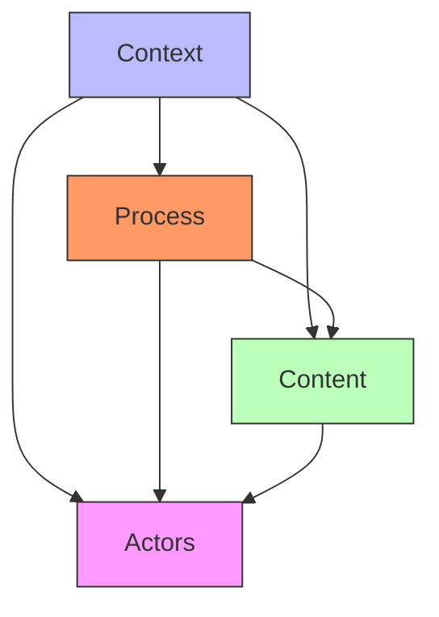
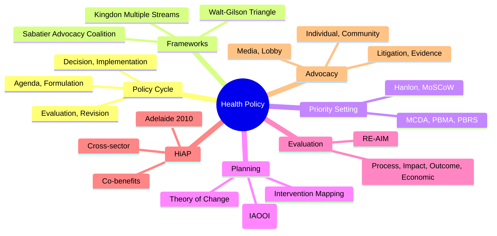

## 1. 1. Learning Objectives
By the end of this note you should be able to:
- [ ] Describe health policy cycle: agenda setting, formulation, implementation, evaluation, revision
- [ ] Apply priority setting frameworks: MCDA, PBMA, PBRS, Hanlon
- [ ] Distinguish programme planning: logic models, theory of change, intervention mapping
- [ ] Apply evaluation: process, impact, outcome, economic; RE-AIM, logic models
- [ ] Describe advocacy: media, lobby, coalition building, community mobilisation
- [ ] Apply Health in All Policies (HiAP), policy analysis (Walt-Gilson)

---

## 2. 2. Definition & Epidemiology

| Concept | Definition |
|---------|------------|
| **Health Policy** | Decisions, plans, actions undertaken to achieve specific health goals in society |
| **Public Policy** | Government actions affecting society (incl. health indirectly) |
| **Policy Cycle** | Stages through which policy evolves: agenda, formulation, implementation, evaluation |
| **Health in All Policies (HiAP)** | Approach integrating health considerations into all policy sectors |
| **Advocacy** | Active support for a cause to influence decisions; political, media, community |
| **Logic Model** | Visual depiction of inputs → activities → outputs → outcomes → impact |

---

## 3. 3. Clinical Features / Presentation
*Methodological framework - see policy cycle and planning below.*

---

## 4. 4. Classification / Policy Cycle & Frameworks

**Policy Cycle (Stages):**
| Stage | Description | Tools |
|-------|-------------|-------|
| **1. Agenda Setting** | Identify issues for action | Kingdon (streams: problem, policy, politics), media, advocacy |
| **2. Policy Formulation** | Develop options, consult stakeholders | Evidence review, scenarios, MCDA, EtD frameworks |
| **3. Decision Making** | Choose option | Political negotiation, costing, Cabinet, Parliament |
| **4. Implementation** | Translate policy to action | Plans, regulations, financing, workforce, IT |
| **5. Evaluation** | Assess impact | Process, outcome, impact, economic evaluation |
| **6. Revision/Update** | Adjust based on evaluation | Lessons learned, new evidence, change of govt |

**Policy Triangle (Walt & Gilson 1994):**
```
              Context
              (Social, Economic,
                Political)
                  |
                  ↓
         ┌────────────────┐
         │                │
    Policy───────Actors───────
Content          (Stakeholders)  Process
         │                │
         └────────────────┘
                  ↑
              Policy
              Content
```

**Mermaid: Policy Triangle**


---

## 5. 5. Diagnosis & Investigations (Planning & Evaluation)

**Priority Setting Frameworks:**
| Framework | Description |
|-----------|-------------|
| **MCDA (Multi-Criteria Decision Analysis)** | Weighted criteria scoring (health gain, equity, cost, feasibility, acceptability) |
| **PBMA (Programme Budgeting & Marginal Analysis)** | Disinvest from low-value to fund high-value; marginal analysis |
| **PBRS (Prioritisation Based on Realistic Scoring)** | Multidisciplinary scoring; realistic, evidence-based |
| **Hanlon Method** | (Magnitude + Severity) × Effectiveness ÷ Cost |
| **MoSCoW** | Must / Should / Could / Won't have (IT/software origin) |
| **Accountable/Reasonableness** | Daniels & Sabin: fair process, transparent decisions |

**Programme Planning:**

**Logic Model (5 Components):**
| Component | Description | Example (Diabetes Prevention) |
|-----------|-------------|-------------------------------|
| **Inputs** | Resources needed | Funding, staff, training, partnerships |
| **Activities** | What is done | Education, screening, lifestyle coaching |
| **Outputs** | Direct products | Sessions delivered, people screened |
| **Outcomes** | Short-medium effects | Knowledge ↑, behaviour change, weight loss |
| **Impact** | Long-term effects | Diabetes incidence ↓, complications ↓ |

**Theory of Change:**
- Causal pathway (assumptions + interventions = outcomes)
- Long-term change vision + preconditions
- Indicator-based testing of assumptions

**Intervention Mapping (IM):**
1. Needs assessment (proximal/distal)
2. Matrices of change objectives (behavioural/environmental)
3. Theory-based methods
4. Programme design
5. Adoption/implementation
6. Evaluation planning

**Evaluation Types:**
| Type | Question | Methods | Example |
|------|----------|---------|---------|
| **Process** | Was it delivered? | Audit, fidelity, reach, dose | Sessions held, attendance |
| **Impact** | Did it work? | RCT, quasi-experimental | HbA1c reduction, weight loss |
| **Outcome** | Long-term effects? | Cohort, time series | Diabetes incidence |
| **Economic** | Value for money? | CEA, CUA, CBA, ROI | £/QALY |

**RE-AIM Framework:**
- **R**each (proportion participating)
- **E**ffectiveness (outcomes)
- **A**doption (settings adopting)
- **I**mplementation (fidelity)
- **M**aintenance (sustained at individual, setting)

---

## 6. 6. Differential Diagnosis (Policy/Planning Confusions)

| Confusion | Clarification |
|-----------|---------------|
| **Policy vs Plan** | Policy = general direction, principles. Plan = specific actions, timelines, resources. |
| **Implementation vs Evaluation** | Implementation = putting into action. Evaluation = assessing effects. |
| **Logic Model vs Theory of Change** | Logic model = sequence (what leads to what). Theory of change = causal mechanisms (why). |
| **Process vs Impact Evaluation** | Process = was it done as planned. Impact = did it work (outcomes). |
| **Policy vs Politics** | Policy = content (decisions). Politics = process (power, values, interests). |

---

## 7. 7. Management (Advocacy & HiAP)

**Advocacy Strategies:**
| Level | Strategy |
|-------|----------|
| **Individual** | Patient stories, clinician voice, expert testimony |
| **Community** | Coalition building, grassroots mobilisation, lived experience |
| **Media** | Press releases, op-eds, social media, interviews |
| **Lobby** | Direct contact with policymakers, briefings, parliamentary questions |
| **Litigation** | Legal challenges, judicial review (e.g., air quality, tobacco) |
| **Evidence** | Research, data, infographics, policy briefs |

**Health in All Policies (HiAP):**
- Integrates health into all policy sectors (transport, housing, education, fiscal)
- Joint working, HIA, co-benefits framing
- Examples: Sugar tax (fiscal + health), Active travel (transport + health), 20mph limits
- Adelaide Statement (2010), EU HiAP framework

**Health Impact Assessment (HIA):**
- Prospective, predicts health effects of policy/project outside health sector
- 5-step: Screening, Scoping, Risk Assessment, Appraisal, Reporting
- Mandatory in some jurisdictions (Wales, Scotland)

**Other Approaches:**
- **Advocacy Coalition Framework (Sabatier)**: Policy change through belief systems
- **Multiple Streams (Kingdon)**: Problem, policy, politics streams converge
- **Punctuated Equilibrium (Baumgartner/Jones)**: Long stability + rapid change

---

## 8. 8. FCPS/MRCP High-Yield Summary (BULLET TABLE)

| Topic | Key Points |
|-------|------------|
| **Policy Cycle** | Agenda, Formulation, Decision, Implementation, Evaluation, Revision |
| **Policy Triangle (Walt-Gilson)** | Content × Process × Actors × Context |
| **Kingdon** | Streams: Problem, Policy, Politics (window of opportunity) |
| **MCDA** | Weighted criteria scoring |
| **PBMA** | Marginal analysis: disinvest low-value, fund high-value |
| **Logic Model** | Inputs → Activities → Outputs → Outcomes → Impact |
| **Theory of Change** | Causal pathway + assumptions + indicators |
| **Evaluation** | Process, Impact, Outcome, Economic |
| **RE-AIM** | Reach, Effectiveness, Adoption, Implementation, Maintenance |
| **HiAP** | Health in All Policies (Adelaide 2010) |
| **Advocacy** | Individual, Community, Media, Lobby, Litigation, Evidence |

---

## 9. 9. Viva Questions (MRCP PACES / FCPS)

| Question | Expected Answer |
|----------|-----------------|
| **Stages of policy cycle?** | Agenda setting → Policy formulation → Decision making → Implementation → Evaluation → Revision/update. |
| **Walt & Gilson Policy Triangle?** | 4 elements: Content, Process, Actors, Context. Health policy analysis requires considering all four (not just content). |
| **Kingdon multiple streams?** | Three streams: Problem (recognised issue), Policy (feasible solution), Politics (favourable climate). Window of opportunity when all three converge. |
| **Logic model components?** | 5: Inputs → Activities → Outputs → Outcomes → Impact. |
| **Difference: Logic model vs Theory of Change?** | Logic model = sequence (what leads to what). Theory of change = causal mechanisms (why) and assumptions to test. |
| **MCDA for priority setting?** | Multi-Criteria Decision Analysis: weighted criteria (health gain, equity, cost, feasibility, acceptability) scored for each option. |
| **PBMA approach?** | Programme Budgeting and Marginal Analysis: reallocate from low-value to high-value interventions using marginal analysis (gain from one option vs opportunity cost). |
| **RE-AIM framework?** | Reach, Effectiveness, Adoption, Implementation, Maintenance. Evaluates translation of interventions to real-world settings. |
| **Health in All Policies (HiAP)?** | Approach integrating health into all policy sectors (transport, housing, education). Co-benefits framing. Adelaide Statement 2010. |
| **HIA steps?** | 5: Screening → Scoping → Risk Assessment → Appraisal → Reporting. Prospective, predicts health effects of non-health policies. |

---

## 10. 10. Confusions & Mnemonics

| Confusion | Clarification |
|-----------|---------------|
| **Policy vs Plan** | Policy = direction + principles. Plan = specific actions + timelines + resources. |
| **Implementation ≠ Adoption** | Implementation = how delivered. Adoption = decision to use. RE-AIM: Adoption = settings. |
| **Effectiveness vs Efficacy** | Efficacy = ideal RCT conditions. Effectiveness = real-world (relevant to policy/RE-AIM). |
| **Policy Content vs Politics** | Content = substance. Politics = values, power, interests. Walt-Gilson: integrate all. |
| **Logic Model vs Evaluation** | Logic model = plan/design. Evaluation = assessment of outcomes. |

**Mnemonic: POLICY CYCLE (AFDIE-R)**
- **A**genda
- **F**ormulation
- **D**ecision
- **I**mplementation
- **E**valuation
- **R**evision

**Mnemonic: POLICY TRIANGLE (CPAC)**
- **C**ontent
- **P**rocess
- **A**ctors
- **C**ontext

**Mnemonic: KINGDON STREAMS (3P)**
- **P**roblem
- **P**olicy
- **P**olitics

**Mnemonic: LOGIC MODEL (IAOOI)**
- **I**nputs
- **A**ctivities
- **O**utputs
- **O**utcomes
- **I**mpact

**Mnemonic: RE-AIM (5)**
- **R**each
- **E**ffectiveness
- **A**doption
- **I**mplementation
- **M**aintenance

**Mnemonic: ADVOCACY LEVELS (ICMELI)**
- **I**ndividual
- **C**ommunity
- **M**edia
- **E**vidence
- **L**obby
- **I**tigation

**Mnemonic: HIA STEPS (SS-RAM)**
- **S**creening
- **S**coping
- **R**isk Assessment
- **A**ppraisal
- **M**onitoring

---

## 11. 11. Mind Map



---

## 12. 12. One-Page Revision Card

| Domain | Key Points |
|--------|------------|
| **Policy Cycle** | Agenda, Formulation, Decision, Implementation, Evaluation, Revision |
| **Triangle** | Content, Process, Actors, Context (Walt-Gilson) |
| **Kingdon** | 3 streams: Problem, Policy, Politics (window of opportunity) |
| **MCDA** | Weighted criteria scoring |
| **PBMA** | Marginal analysis (reallocate) |
| **Logic Model** | Inputs → Activities → Outputs → Outcomes → Impact |
| **Theory of Change** | Causal pathway + assumptions |
| **Evaluation** | Process, Impact, Outcome, Economic |
| **RE-AIM** | Reach, Effectiveness, Adoption, Implementation, Maintenance |
| **HiAP** | Health in All Policies |
| **Advocacy** | Individual, Community, Media, Lobby, Litigation, Evidence |

---

## 13. 13. Spaced Repetition Trackers

| Review Interval | Date Completed | Confidence (1-5) | Notes |
|-----------------|----------------|------------------|-------|
| 24 hours | | | |
| 7 days | | | |
| 15 days | | | |
| 30 days | | | |
| 90 days | | | |

---

## 14. 14. Self-Test Scorecard

| Section | Score /5 | Last Attempt |
|---------|----------|--------------|
| Policy Cycle | | |
| Walt-Gilson Triangle | | |
| Kingdon Streams | | |
| Priority Setting (MCDA/PBMA) | | |
| Logic Model | | |
| RE-AIM | | |
| HiAP / Advocacy | | |
| Viva Questions | | |
| Mnemonics | | |

---

## 15. 15. Local Navigation

- **Parent Heading**: [[../Population Health and Epidemiology|Population Health and Epidemiology]]
- **Chapter Map**: [[../Population Health and Epidemiology Hierarchy|Hierarchy]]
- **Chapter MOC**: [[../Population Health and Epidemiology MOC|MOC]]
- **Related**: [[Health Systems, UHC & Health Economics.md]], [[Health Needs Assessment.md]], [[Evidence-Based Medicine & Clinical Guidelines.md]]

---

#medicine #population-health #epidemiology #davidson #fcps #mrcp
