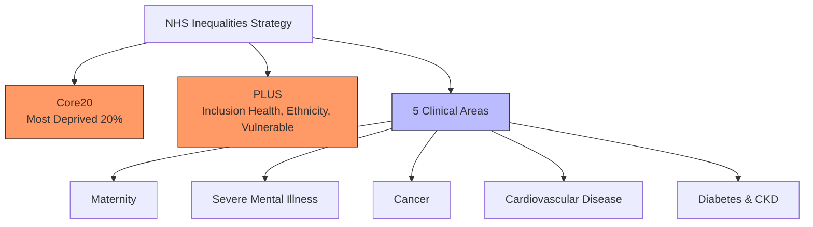
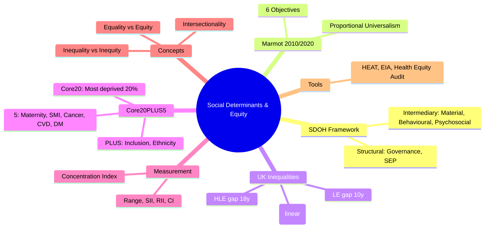

## 1. 1. Learning Objectives
By the end of this note you should be able to:
- [ ] Define social determinants of health (SDOH): structural and intermediary
- [ ] Describe Marmot Review (2010, 2020): Fair Society Healthy Lives; six policy objectives
- [ ] Apply concepts: social gradient, health inequalities vs inequities, intersectionality
- [ ] Identify key UK/NHS policy: Core20PLUS5, health equity assessment
- [ ] Calculate concentration index, slope index of inequality for health inequality measurement
- [ ] Discuss structural racism, poverty, early years, employment, housing, environment

---

## 2. 2. Definition & Epidemiology

| Concept | Definition |
|---------|------------|
| **Social Determinants of Health (SDOH)** | Conditions in which people are born, grow, work, live, age (WHO CSDH 2008) |
| **Health Inequalities** | Differences in health (avoidable and unavoidable) |
| **Health Inequities** | Differences in health that are unfair, unjust, avoidable (Marmot, Whitehead) |
| **Social Gradient** | Health improves with each step up socioeconomic position (linear, not just poor vs rich) |
| **Structural Determinants** | Governance, economic, social policies; governance, education, social protection |
| **Intermediary Determinants** | Material circumstances, behaviours, biological, psychosocial |

**UK Health Inequalities (2024):**
| Metric | Most Deprived vs Least Deprived (Quintile 1 vs 5) |
|--------|-----------------------------------------------------|
| **Healthy Life Expectancy** | 52y vs 70y (gap 18y, M); 51y vs 68y (F) |
| **Life Expectancy** | 73.9y vs 83.4y (gap ~10y, M) |
| **Infant Mortality** | 2x rate in most deprived |
| **Obesity (Reception)** | 2x rate in most deprived |
| **Smoking Prevalence** | 3-4x rate in most deprived |
| **Mental Health (Common)** | 2x rate in most deprived |
| **CVD Mortality** | 2-3x rate in most deprived |
| **Diabetes Prevalence** | 2x rate in most deprived |

---

## 3. 3. Clinical Features / Presentation
*Conceptual framework - see Marmot policy objectives and measurement below.*

---

## 4. 4. Classification / Marmot Six Policy Objectives (2010/2020)

| # | Objective | Key Actions |
|---|-----------|-------------|
| **1** | **Give Every Child the Best Start in Life** | Pre-conception care, early years, parenting support, paid parental leave, Sure Start, early intervention |
| **2** | **Enable All Children, Young People, Adults to Maximise Capabilities & Control** | High-quality education, lifelong learning, work-based training, comprehensive PSHE |
| **3** | **Create Fair Employment & Good Work for All** | Living wage, zero-hours regulation, occupational health, flexible work, mental health support |
| **4** | **Ensure Healthy Standard of Living for All** | Adequate social security, in-work benefits, minimum income, fuel poverty reduction, healthy food access |
| **5** | **Create & Develop Healthy & Sustainable Places & Communities** | Active travel, green space, housing quality, air quality, community resilience, planning |
| **6** | **Strengthen Role & Impact of Ill-Health Prevention** | Universal proportionalism, screening uptake, immunisation equity, prevention in primary care |

**Mermaid: Marmot's Conceptual Framework**
```mermaid
flowchart TD
    A[Social Stratification\n(Govt, Macro) ] --> B[Structural Determinants\nGovernance, Education, Social Protection]
    B --> C[Social Position\nIncome, Education, Occupation]
    C --> D[Intermediary Determinants\nMaterial, Behavioural, Psychosocial, Biological]
    D --> E[Equity in Health & Wellbeing]
    style A fill:#bbf,stroke:#333
    style E fill:#bfb,stroke:#333
```

**WHO CSDH Conceptual Framework (Solar & Irwin):**
- **Social Stratification** (structural): Socioeconomic-political context
- **Socioeconomic Position** (structural): Class, education, occupation, income, gender, ethnicity
- **Intermediary**: Material, behavioural, psychosocial, biological
- **Cross-cutting**: Social capital, social cohesion

---

## 5. 5. Diagnosis & Investigations (Measurement)

**Health Inequality Measurement:**
| Measure | Formula | Interpretation |
|---------|---------|----------------|
| **Range (Gap)** | LE in Q5 - LE in Q1 | Simple; loses intermediate gradient |
| **Absolute Concentration Index (ACI)** | 2 × Cov(LE, FR) | Signed; positive = pro-rich; size = magnitude |
| **Relative Concentration Index (RCI)** | ACI / Mean LE | -1 to +1; standardisation |
| **Slope Index of Inequality (SII)** | β from weighted regression of LE on cumulative rank | Absolute inequality; range across social spectrum |
| **Relative Index of Inequality (RII)** | SII / mean LE | Relative inequality |
| **Theil Index, Atkinson Index** | Information-theoretic; decomposable | Gini-like; between/within group |

**NHS Core20PLUS5 (2021-2024):**
- **Core20**: Most deprived 20% of population (IMD)
- **PLUS**: Population groups (ethnicity, inclusion health, protected characteristics, vulnerable)
- **5 Clinical Areas**: Maternity, Severe Mental Illness, Cancer, CVD (Lipid/AF/HF/HTN), Diabetes

**Mermaid: Core20PLUS5**


---

## 6. 6. Differential Diagnosis (Key Confusions)

| Confusion | Clarification |
|-----------|---------------|
| **Inequalities vs Inequities** | Inequality = difference (any). Inequity = unfair difference (avoidable, justice-related). |
| **Proportional Universalism vs Targeted** | Targeted: only at-risk group (efficient but stigmatising). Universal: all (equitable). Proportional: universal + intensity scaled to need. |
| **Race vs Ethnicity vs Racism** | Race: social construct (no biological basis). Ethnicity: shared culture/ancestry. Structural/institutional racism: discriminatory systems. |
| **Poverty vs Deprivation** | Poverty: lack of resources (income <60% median). Deprivation: lack of services/opportunities (IMD). Health impact: multidimensional. |
| **Social Gradient vs Bimodal** | Gradient = linear across all SES, not just "poor" vs "rich". Even middle-class have better health than working-class. |
| **Equality vs Equity** | Equality = same resources. Equity = resources proportionate to need. |

---

## 7. 7. Management (Proportionate Universalism & Actions)

**Proportionate Universalism (Marmot):**
- **Universal action** (not targeted alone)
- **Scale and intensity** proportionate to level of disadvantage
- Examples: Smoking cessation (universal access + intensive support for deprived); Sure Start (universal + extra for deprived)

**NHS Actions:**
- **Health Equity Assessment Tool (HEAT)**: Embed equity in policies/programmes
- **Equality Impact Assessment (EIA)**: Legal requirement (Equality Act 2010)
- **Core20PLUS5**: Population targeting + clinical priorities
- **Personalised Care**: Social prescribing, health coaching
- **Wider Determinants**: Anchor institutions, employment, estates

**Individual Clinician Actions:**
- **Ask** about social circumstances (housing, employment, food security)
- **Refer** to social prescribing, welfare advice, housing support
- **Advocate** for patients (letters for benefits, housing)
- **Equity audit** of own practice
- **Cultural competence** and trauma-informed care

**Intersectionality (Crenshaw):**
- Multiple social categories (race, gender, class, sexuality, disability) interact
- Compound disadvantage (not just additive)
- E.g., Black disabled women face unique barriers
- Lens for design, not just measurement

---

## 8. 8. FCPS/MRCP High-Yield Summary (BULLET TABLE)

| Topic | Key Points |
|-------|------------|
| **Health Inequalities UK** | HLE gap 18y (M) most vs least deprived; LE gap ~10y; 2-3x mortality CVD |
| **Inequalities vs Inequities** | Inequality = difference. Inequity = unfair, avoidable, unjust. |
| **Social Gradient** | Health improves linearly with SES, not just poor vs rich |
| **Marmot 6 Objectives** | 1) Best start, 2) Maximise capabilities, 3) Fair employment, 4) Healthy standard living, 5) Healthy places, 6) Strengthen prevention |
| **Proportional Universalism** | Universal + scaled to need (Marmot) |
| **Core20PLUS5** | Core20 (most deprived) + PLUS (vulnerable groups) + 5 clinical areas |
| **WHO CSDH** | Structural (stratification, SEP) → Intermediary (material, behavioural) → Health |
| **Measurement** | Range, Concentration Index, SII, RII, Theil |
| **Intersectionality** | Multiple categories interact; compound disadvantage |
| **NHS Tools** | HEAT (Health Equity Assessment Tool), EIA (Equality Impact Assessment) |

---

## 9. 9. Viva Questions (MRCP PACES / FCPS)

| Question | Expected Answer |
|----------|-----------------|
| **Difference between health inequality and health inequity?** | Inequality = difference in health (any). Inequity = unfair, unjust, avoidable difference (justice-related). |
| **Marmot's 6 policy objectives?** | 1) Best start in life (early years), 2) Maximise capabilities/control (education), 3) Fair employment/good work, 4) Healthy standard of living, 5) Healthy sustainable places, 6) Strengthen ill-health prevention. |
| **What is proportionate universalism?** | Universal action with scale and intensity proportionate to level of disadvantage (Marmot 2010). Avoids stigma of targeted-only; reaches gradient. |
| **NHS Core20PLUS5 - what is it?** | NHS Inequalities Strategy. Core20: most deprived 20% (IMD). PLUS: inclusion health, ethnicity, protected characteristics. 5: Maternity, Severe Mental Illness, Cancer, CVD, Diabetes. |
| **UK HLE gap most vs least deprived?** | ~18 years gap in HLE between most and least deprived quintiles (men). Even larger gap in healthy life. |
| **Social gradient - what is it?** | Linear improvement in health with each step up socioeconomic position. Not just "poor vs rich" dichotomy - even middle-class have better health. |
| **What is intersectionality (Crenshaw)?** | Multiple social categories (race, gender, class, sexuality, disability) interact to produce unique compound disadvantage. Not just additive. |
| **Tools for measuring health inequality?** | Range, Slope Index of Inequality (SII), Relative Index of Inequality (RII), Concentration Index, Theil Index, Atkinson Index. |
| **Individual clinician actions on inequalities?** | Ask about social circumstances, refer to welfare/housing/social prescribing, advocate (letters), audit own practice, cultural competence. |
| **WHO CSDH conceptual framework?** | Structural determinants (socioeconomic-political context, socioeconomic position) → Intermediary determinants (material, behavioural, psychosocial, biological) → Health equity. |

---

## 10. 10. Confusions & Mnemonics

| Confusion | Clarification |
|-----------|---------------|
| **Inequality = Equity** | NO. Equity = fairness, justice, morality. Inequality = mathematical difference. Inequity subset. |
| **Proportional Universalism** | Universal action (everyone) + Scaled to need (more for deprived). Not "targeted only". |
| **IMD vs Poverty** | IMD = Index of Multiple Deprivation (7 domains). Not just income; includes health, education, crime, housing, environment, access. |
| **Race = Biological** | FALSE. Race = social construct. No biological/genetic basis. Ethnicity = cultural/ancestral. |

**Mnemonic: MARMOT 6 OBJECTIVES (BEMSH-P)**
- **B**est start in life
- **E**ducation/Enable capabilities
- **M**aximise control
- **S**tandard of living (fair)
- **H**ealthy places
- **P**revention strengthening

**Mnemonic: SDOH FRAMEWORK (CBSI)**
- **C**ontext (Governance, Policy)
- **B**oth structural and intermediary
- **S**ocioeconomic position (SEP)
- **I**ntermediary determinants

**Mnemonic: CORE20PLUS5**
- **C**ore20 = Most deprived 20%
- **P**LUS = Inclusion health, ethnicity, vulnerable
- **5** = Maternity, SMI, Cancer, CVD, Diabetes

**Mnemonic: INEQUALITY MEASURES (CSR)**
- **C**oncentration Index (CI)
- **S**II (Slope Index of Inequality)
- **R**II (Relative Index of Inequality)

**Mnemonic: EQUALITY vs EQUITY**
- **E**quality = **E**qual treatment
- **E**quity = **E**quity requires **E**quity (justice, need-based)

**Mnemonic: CLINICIAN ACTIONS (AIREA)**
- **A**sk (social circumstances)
- **I**nquire (housing, food, employment)
- **R**efer (social prescribing)
- **E**quity audit
- **A**dvocate

---

## 11. 11. Mind Map



---

## 12. 12. One-Page Revision Card

| Domain | Key Points |
|--------|------------|
| **Inequality vs Inequity** | Inequality = difference. Inequity = unfair, avoidable, unjust. |
| **Social Gradient** | Linear across SES, not just poor/rich |
| **Marmot 6** | Best start, Education, Fair work, Standard living, Places, Prevention |
| **Proportional Universalism** | Universal + scaled to need |
| **Core20PLUS5** | Core20, PLUS, 5 (Maternity, SMI, Cancer, CVD, DM) |
| **UK Gap** | HLE 18y, LE 10y, CVD 2-3x mortality |
| **WHO CSDH** | Structural → Intermediary → Health |
| **Measurement** | SII, RII, Concentration Index |
| **Intersectionality** | Compound, not additive |
| **Clinician Actions** | Ask, Refer, Advocate, Audit |

---

## 13. 13. Spaced Repetition Trackers

| Review Interval | Date Completed | Confidence (1-5) | Notes |
|-----------------|----------------|------------------|-------|
| 24 hours | | | |
| 7 days | | | |
| 15 days | | | |
| 30 days | | | |
| 90 days | | | |

---

## 14. 14. Self-Test Scorecard

| Section | Score /5 | Last Attempt |
|---------|----------|--------------|
| SDOH Definition | | |
| Marmot 6 Objectives | | |
| Proportional Universalism | | |
| Core20PLUS5 | | |
| UK Inequality Gaps | | |
| Measurement Tools | | |
| Intersectionality | | |
| Viva Questions | | |
| Mnemonics | | |

---

## 15. 15. Local Navigation

- **Parent Heading**: [[../Population Health and Epidemiology|Population Health and Epidemiology]]
- **Chapter Map**: [[../Population Health and Epidemiology Hierarchy|Hierarchy]]
- **Chapter MOC**: [[../Population Health and Epidemiology MOC|MOC]]
- **Related**: [[Health Systems, UHC & Health Economics.md]], [[Health Promotion & Disease Prevention (Primary, Secondary, Tertiary).md]], [[Health Needs Assessment.md]]

---

#medicine #population-health #epidemiology #davidson #fcps #mrcp
