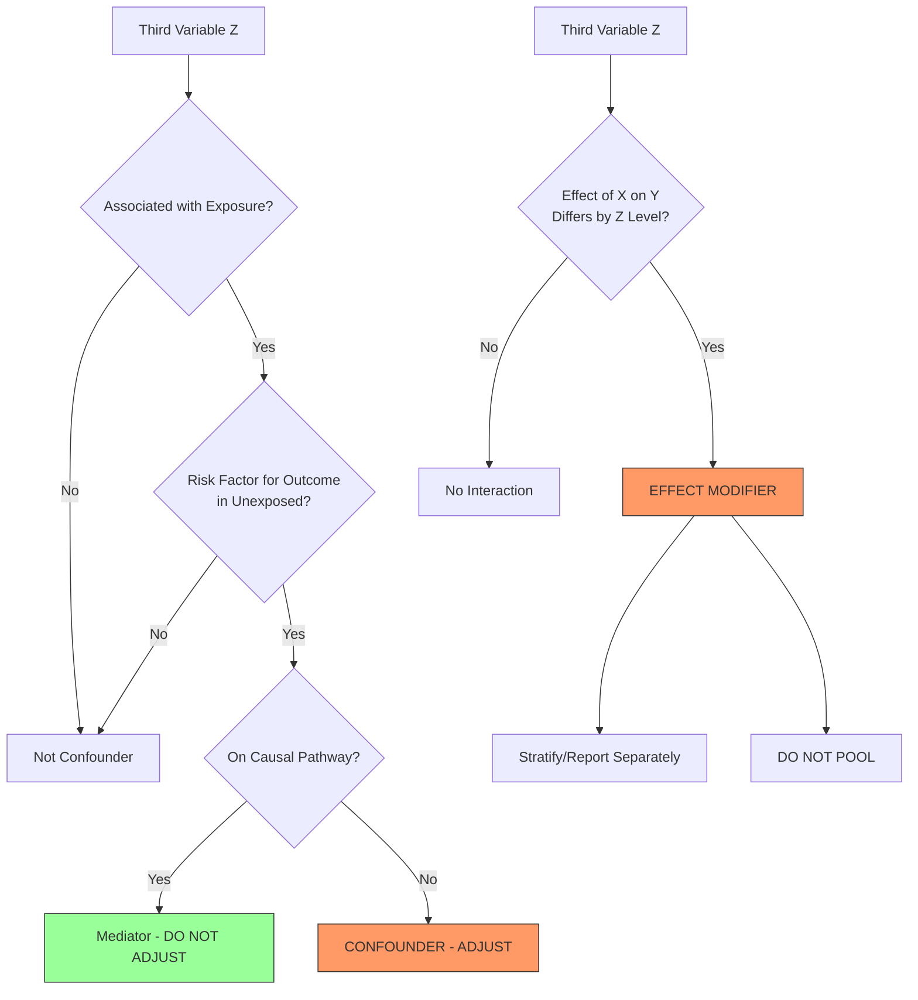
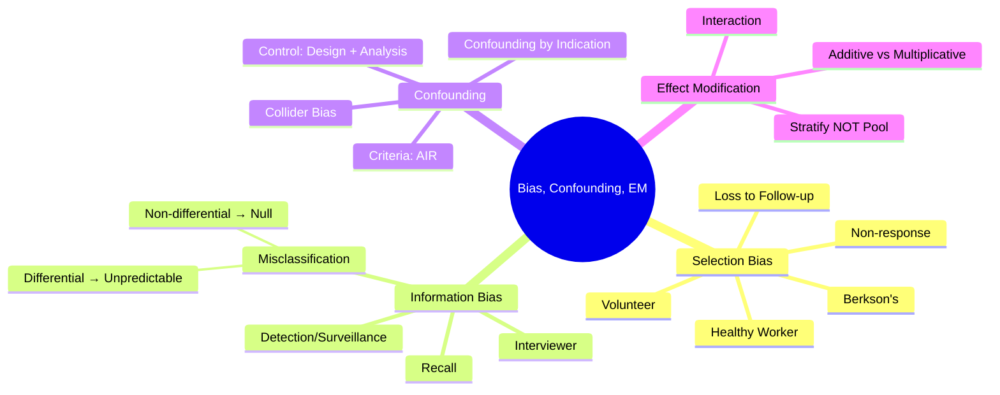

## 1. Learning Objectives
By the end of this note you should be able to:
- [ ] Classify bias: selection, information, confounding
- [ ] Identify major bias types in each study design
- [ ] Define confounding: criteria, examples, control methods (design + analysis)
- [ ] Distinguish effect modification (interaction) from confounding
- [ ] Apply to critical appraisal: identify threats to validity in study scenarios

---

## 2. Definition & Epidemiology

| Concept | Definition |
|---------|------------|
| **Bias** | Systematic error in design/conduct/analysis → deviation of result from truth |
| **Selection Bias** | Systematic difference in characteristics between those selected vs not selected for study |
| **Information Bias** | Systematic error in measurement of exposure/outcome (misclassification) |
| **Confounding** | Distortion of exposure-outcome association by third factor associated with both |
| **Effect Modification** | True difference in effect magnitude across levels of third variable (not bias) |

---

## 3. Clinical Features / Presentation
*Methodological concept - see bias typology below.*

---

## 4. Classification / Bias Typology by Design

| Bias Category | Type | Definition | Design Susceptible | Prevention/Control |
|---------------|------|------------|-------------------|-------------------|
| **Selection** | **Berkson's** | Hospital controls ≠ population exposure dist | Case-control | Population-based controls |
| | **Healthy Worker** | Employed healthier than general pop | Cohort (occupational) | Internal comparison; general pop referent |
| | **Non-response** | Responders differ from non-responders | Cross-sectional, Cohort | High response; compare responders vs non |
| | **Loss to Follow-up** | Dropouts differ in outcome risk | Cohort, RCT | ITT; track reasons; sensitivity analysis |
| | **Volunteer/Self-selection** | Volunteers differ from non-volunteers | RCT, Cohort | Broad recruitment; pragmatic trials |
| **Information** | **Recall** | Cases recall exposure differently than controls | Case-control | Blinded interview; records; biomarkers |
| | **Interviewer** | Interviewer knows hypothesis/status | Case-control, Cohort | Blinded interviewers; standardised tools |
| | **Detection/Surveillance** | Exposed group screened more intensively | Cohort, RCT | Equal surveillance; blinded outcome assess |
| | **Misclassification** | Error in exposure/outcome measurement | All | Validation sub-study; objective measures |
| | - **Non-differential** | Same in both groups → bias toward null | All | - |
| | - **Differential** | Different between groups → unpredictable | All | - |
| **Confounding** | **Confounding by Indication** | Treatment given based on severity | Observational therapy studies | Propensity score; instrumental variable; RCT |
| | **Channeling Bias** | Drugs channelled to specific patient types | Pharmacoepidemiology | New-user design; active comparator |

---

## 5. Diagnosis & Investigations (Confounding Criteria & Control)

**Confounding Criteria (Must Meet ALL 3):**
1. Associated with exposure (in source population)
2. Independent risk factor for outcome (in unexposed)
3. Not on causal pathway (not mediator)

**Mermaid: Confounding vs Effect Modification**

**Control of Confounding:**

| Stage | Methods |
|-------|---------|
| **Design** | Randomisation (RCT), Restriction, Matching (case-control, cohort) |
| **Analysis** | Stratification (Mantel-Haenszel), Multivariable regression, Propensity score (matching/weighting/stratification), Instrumental variable, G-methods (IPTW, g-estimation) |

---

## 6. Differential Diagnosis (Key Confusions)

| Confusion | Clarification |
|-----------|---------------|
| **Confounding vs Effect Modification** | Confounding = bias (distortion); adjust to get TRUE effect. Effect modification = REAL difference in effect across subgroups; STRATIFY and report separately. |
| **Confounding vs Mediation** | Confounder: cause of both exposure & outcome (Z→X, Z→Y). Mediator: on pathway (X→Z→Y). Adjusting for mediator blocks part of effect → underestimates total effect. |
| **Matching ≠ Confounder Control** | Matching in case-control controls confounding ONLY if matched factor is confounder. Overmatching (matching on exposure correlate) causes bias. Matched analysis REQUIRED (conditional logistic). |
| **Non-differential Misclassification** | Biases toward null (RR→1, OR→1). Differential misclassification: unpredictable direction. |
| **Selection Bias in Case-Control** | Controls must represent exposure distribution in source population that produced cases. Hospital controls often fail this (Berkson's). |
| **Confounding by Indication** | Severity → treatment AND outcome. Standard regression may not fully adjust (unmeasured severity). Need propensity score, IV, or RCT. |

---

## 7. Management (Critical Appraisal Checklist)

| Study | Key Bias Questions |
|-------|-------------------|
| **RCT** | Randomisation adequate? Allocation concealed? Blinding (participants, personnel, outcome assessors)? ITT analysis? Loss to follow-up <20% balanced? |
| **Cohort** | Exposed/unexposed comparable at baseline? Confounders measured/adjusted? Follow-up complete? Outcome assessment blinded? |
| **Case-Control** | Cases/controls from same source population? Controls represent exposure dist? Exposure assessment blinded? Recall bias minimised? Matching appropriate? |
| **Cross-Sectional** | Representative sample? Valid measurements? Temporality unclear? |
| **Systematic Review** | Comprehensive search? Risk of bias assessment (RoB 2, ROBINS-I)? Heterogeneity explored? Publication bias (funnel plot)? |

---

## 8. FCPS/MRCP High-Yield Summary (BULLET TABLE)

| Topic | Key Points |
|-------|------------|
| **Confounder** | Meets 3 criteria: associated with exposure, risk factor for outcome, not on pathway. ADJUST. |
| **Effect Modifier** | Effect differs by stratum. STRATIFY and report separate effects. NOT bias. |
| **Mediator** | On causal pathway (X→Z→Y). DO NOT ADJUST for total effect. |
| **Selection Bias** | Berkson's (hospital controls), healthy worker, loss to follow-up, non-response. |
| **Information Bias** | Recall (cases remember more), interviewer, detection/surveillance, misclassification. |
| **Non-differential Misclass** | Bias toward null. Differential: unpredictable. |
| **Confounding Control** | Design: randomisation, restriction, matching. Analysis: stratification, regression, propensity score. |
| **Residual Confounding** | Imperfect measurement of confounder → incomplete adjustment. Always possible in observational. |
| **Collider Bias** | Conditioning on common effect of exposure & outcome → induces association. Avoid adjusting for colliders. |

---

## 9. Viva Questions (MRCP PACES / FCPS)

| Question | Expected Answer |
|----------|-----------------|
| **Define confounding. Give classic example.** | Distortion by third factor associated with both exposure and outcome, not on pathway. Classic: smoking → lung cancer confounded by age (age→smoking, age→cancer). Or alcohol→CHD confounded by smoking. |
| **How to distinguish confounding from effect modification?** | Confounding: crude ≠ adjusted (pooling biased). Effect modification: stratum-specific effects differ significantly (interaction p<0.05). Confounding = bias; EM = biology. |
| **What is confounding by indication? How to address?** | Treatment assigned based on severity (indication). Severity → treatment AND outcome. Address: propensity score, instrumental variable, active comparator, new-user design, RCT. |
| **Types of selection bias in case-control?** | Berkson's (hospital controls), control selection not from source population, overmatching. |
| **Recall bias - when occurs? Direction?** | Case-control. Cases recall exposures more thoroughly than controls. Biases OR away from null (overestimates). |
| **Non-differential vs differential misclassification?** | Non-differential: same error in both groups → bias toward null. Differential: error differs by group → unpredictable direction. |
| **When is matching appropriate in case-control? What analysis?** | Match on confounders (age, sex). Must use CONDITIONAL logistic regression. Overmatching (on exposure correlate) introduces bias. |
| **What is a collider? Example of collider bias.** | Variable caused by both exposure and outcome. Conditioning on it induces spurious association. E.g., hospital admission (collider) in study of risk factors for disease - both exposure and outcome increase admission probability. |
| **Propensity score - what is it? Methods?** | Probability of exposure given covariates. Methods: matching, inverse probability weighting (IPTW), stratification, covariate adjustment. Balances observed confounders. |

---

## 10. Confusions & Mnemonics

| Confusion | Clarification |
|-----------|---------------|
| **Adjust for mediator = bad** | Blocks pathway → underestimates total effect. Use mediation analysis for direct/indirect effects. |
| **Stratification vs Regression** | Stratification: Mantel-Haenszel pooled estimate. Regression: multivariable adjustment. Both valid; regression handles continuous confounders better. |
| **Propensity Score ≠ Magic** | Only balances OBSERVED confounders. Unmeasured confounding remains. |
| **Interaction Scale** | Additive (RD) vs multiplicative (RR). Public health: additive. Etiology: multiplicative. |

**Mnemonic: BIAS TYPES**
- **B**erkson's (selection)
- **I**nformation (recall, interviewer, detection)
- **A**llocation (selection in RCT)
- **S**urveillance (detection bias)

**Mnemonic: CONFOUNDER CRITERIA (AIR)**
- **A**ssociated with **E**xposure
- **I**ndependent risk factor for **O**utcome
- **R**oute not on causal pathway

**Mnemonic: CONFOUNDING vs EFFECT MODIFICATION**
- **C**onfounding = **C**orrection needed (adjust)
- **E**ffect **M**odification = **M**easure separately (stratify)

**Mnemonic: BIAS DIRECTION**
- **N**on-differential → **N**ull
- **D**ifferential → **D**irection unknown
- **R**ecall → **R**aises OR (away from null)
- **H**ealthy worker → **L**owers risk (spurious protection)

---

## 11. Mind Map

---

## 12. One-Page Revision Card

| Domain | Key Points |
|--------|------------|
| **Confounder** | AIR: Associated Exposure, Independent Outcome Risk, Not on Route |
| **Effect Modifier** | Stratify; report separate effects; biological truth |
| **Mediator** | On pathway; don't adjust for total effect |
| **Selection Bias** | Berkson's, healthy worker, loss to FU, non-response |
| **Info Bias** | Recall (cases>controls), interviewer, detection, misclass |
| **Misclassification** | Non-diff → null; Diff → unpredictable |
| **Confounding Control** | Design: randomise, restrict, match. Analysis: stratify, regress, PS |
| **Confounding by Indication** | Severity → Rx + Outcome; PS, IV, active comparator |
| **Collider** | X→C←Y; conditioning induces bias; don't adjust |

---

## 13. Spaced Repetition Trackers

| Review Interval | Date Completed | Confidence (1-5) | Notes |
|-----------------|----------------|------------------|-------|
| 24 hours | | | |
| 7 days | | | |
| 15 days | | | |
| 30 days | | | |
| 90 days | | | |

---

## 14. Self-Test Scorecard

| Section | Score /5 | Last Attempt |
|---------|----------|--------------|
| Bias Classification | | |
| Confounding Criteria | | |
| Confounding vs EM vs Mediator | | |
| Confounding Control Methods | | |
| Selection Bias Types | | |
| Information Bias Types | | |
| Critical Appraisal | | |
| Viva Questions | | |
| Mnemonics | | |

---

## 15. Local Navigation

- **Parent Heading**: [[../Population Health and Epidemiology|Population Health and Epidemiology]]
- **Chapter Map**: [[../Population Health and Epidemiology Hierarchy|Hierarchy]]
- **Chapter MOC**: [[../Population Health and Epidemiology MOC|MOC]]
- **Related**: [[Study Designs (Descriptive, Analytical, Experimental).md]], [[Measures of Association (RR, OR, HR, AR, PAR).md]], [[Systematic Reviews, Meta-analysis, GRADE.md]]

---

#medicine #population-health #epidemiology #davidson #fcps #mrcp
