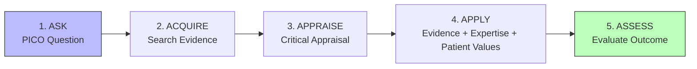
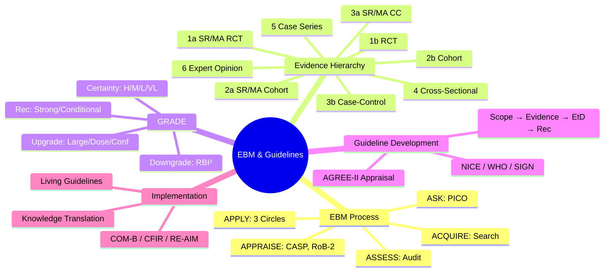

## 1. Learning Objectives
By the end of this note you should be able to:
- [ ] Formulate clinical questions using PICO/PICO(T)
- [ ] Navigate evidence hierarchy: SR/MA > RCT > Cohort > Case-Control > XS > Expert opinion
- [ ] Apply critical appraisal tools: CASP, JBI, CEBM checklists
- [ ] Understand guideline development: NICE, WHO, SIGN, GRADE methodology
- [ ] Distinguish strong vs conditional recommendations
- [ ] Apply implementation science: barriers, facilitators, KT frameworks

---

## 2. Definition & Epidemiology

| Concept | Definition |
|---------|------------|
| **Evidence-Based Medicine (EBM)** | Integration of best research evidence with clinical expertise and patient values |
| **PICO** | Population, Intervention, Comparison, Outcome (T = Time/Type of study) |
| **Evidence Hierarchy** | Ranking of study designs by susceptibility to bias |
| **Clinical Guideline** | Systematically developed statements to assist practitioner/patient decisions |
| **Recommendation Strength** | Strong (do it) vs Conditional/Conditional (consider context) |
| **Knowledge Translation (KT)** | Process of moving evidence into practice |

---

## 3. Clinical Features / Presentation
*Methodological framework - see PICO examples and appraisal below.*

---

## 4. Classification / Evidence Hierarchy (Therapy/Harm)

| Level | Design | Certainty |
|-------|--------|-----------|
| **1a** | SR/MA of RCTs | Highest |
| **1b** | Individual RCT (large, low RoB) | High |
| **2a** | SR/MA of Cohort Studies | Moderate-High |
| **2b** | Individual Cohort Study | Moderate |
| **3a** | SR/MA of Case-Control Studies | Low-Moderate |
| **3b** | Individual Case-Control Study | Low |
| **4** | Cross-Sectional Studies | Low |
| **5** | Case Series / Reports | Very Low |
| **6** | Expert Opinion / Mechanism | Lowest |

**Diagnosis/Prognosis Hierarchies differ slightly:**
- Diagnosis: Cross-sectional (diagnostic accuracy) > Case-Control > Cohort
- Prognosis: Cohort > Case-Control > Case Series

---

## 5. Diagnosis & Investigations (PICO & Appraisal)

**PICO Formulation:**
| Element | Therapy | Diagnosis | Prognosis | Harm/Etiology |
|---------|---------|-----------|-----------|---------------|
| **P** | Patient/problem | Patient/problem | Patient/problem | Exposed population |
| **I** | Intervention | Index test | Prognostic factor | Exposure |
| **C** | Comparison (placebo/active) | Reference standard | Comparison group | Unexposed/comparator |
| **O** | Outcome | Accuracy (Sn/Sp) | Outcome occurrence | Outcome occurrence |
| **T** | RCT/SR | Cross-sectional | Cohort | Cohort/Case-Control |

**Example PICO:**
> "In adults with Type 2 diabetes (P), does SGLT2 inhibitor (I) vs placebo/standard care (C) reduce major adverse cardiovascular events (O)? (T: RCT)"

**Mermaid: EBM 5 Steps**


**Critical Appraisal Tools:**
| Tool | For | Key Domains |
|------|-----|-------------|
| **CASP** | All designs | Validity, Results, Applicability |
| **JBI** | All designs | Detailed checklists per design |
| **CEBM** | Rapid appraisal | Level of evidence + quality |
| **RoB-2** | RCT | Randomisation, deviations, missing, measurement, reporting |
| **ROBINS-I** | Non-randomised | Confounding, selection, classification, deviations, missing, measurement, reporting |
| **AGREE-II** | Guidelines | Scope, stakeholder, rigour, clarity, applicability, editorial |

---

## 6. Differential Diagnosis (EBM Confusions)

| Confusion | Clarification |
|-----------|---------------|
| **EBM ≠ Guidelines** | EBM = process (ask, acquire, appraise, apply). Guidelines = product (recommendations). Guidelines should be EBM-based. |
| **Strong vs Conditional Rec** | Strong: "We recommend" - most patients should receive. Conditional: "We suggest" - different choices for different patients; shared decision-making. |
| **Evidence vs Recommendation** | High certainty evidence → can be strong OR conditional. Low certainty → usually conditional. Depends on benefit-harm balance, values, resources. |
| **Appraisal vs Synthesis** | Appraisal = assess individual study quality. Synthesis = combine across studies (MA, narrative). |
| **Statistical vs Clinical Significance** | p<0.05 ≠ clinically important. Need MIDE/MCID, NNT, absolute effects. |
| **Applicability (External Validity)** | Study population ≠ your patient? Intervention feasible? Outcomes relevant? |

---

## 7. Management (Guideline Development & Implementation)

**Guideline Development Process (NICE/WHO/GRADE):**
1. **Scope & Topic Selection** - burden, variability, new evidence
2. **Guideline Group** - multidisciplinary, patient reps, no COI
3. **PICO Questions** - prioritised
4. **Evidence Review** - SR/MA per question (GRADE)
5. **Evidence-to-Decision (EtD) Frameworks** - balance benefits/harms, values, resources, equity, acceptability, feasibility
6. **Draft Recommendations** - strong/conditional, direction
7. **Consultation & Peer Review**
8. **Publication & Dissemination**
9. **Implementation & Evaluation**
10. **Update Schedule** - surveillance, formal review

**Mermaid: Evidence to Decision**
```mermaid
flowchart TD
    A[Evidence\n(GRADE Certainty)] --> B[EtD Framework]
    C[Benefits vs Harms] --> B
    D[Values & Preferences] --> B
    E[Resources/Cost] --> B
    F[Equity] --> B
    G[Acceptability] --> B
    H[Feasibility] --> B
    B --> I{Recommendation}
    I -->|Strong For| J["We recommend..."]
    I -->|Conditional For| K["We suggest..."]
    I -->|Conditional Against| L["We suggest against..."]
    I -->|Strong Against| M["We recommend against..."]
    style J fill:#bfb,stroke:#333
    style M fill:#fbb,stroke:#333
```

**Implementation Science Frameworks:**
| Framework | Focus |
|-----------|-------|
| **COM-B** | Capability, Opportunity, Motivation → Behaviour |
| **TDF** | Theoretical Domains Framework (14 domains) |
| **CFIR** | Consolidated Framework for Implementation Research |
| **RE-AIM** | Reach, Effectiveness, Adoption, Implementation, Maintenance |
| **EPIS** | Exploration, Preparation, Implementation, Sustainment |

---

## 8. FCPS/MRCP High-Yield Summary (BULLET TABLE)

| Topic | Key Points |
|-------|------------|
| **EBM = 3 Circles** | Best Evidence + Clinical Expertise + Patient Values/Circumstances |
| **PICO** | Mandatory for focused question; drives search strategy |
| **Hierarchy** | SR/MA RCT > RCT > Cohort > Case-Control > XS > Expert |
| **GRADE** | Certainty: High/Mod/Low/VLow. Starts: RCT=High, Obs=Low |
| **Recommendation** | Strong (⊕⊕) vs Conditional (⊕◯). Based on EtD framework. |
| **NICE Process** | Topic → Scope → Evidence Review → Committee → Consultation → Publish |
| **AGREE-II** | 6 domains, 23 items; assesses guideline quality |
| **Implementation Gap** | "Know-do gap" - evidence not translated. Frameworks: COM-B, CFIR, RE-AIM |
| **MIDE/MCID** | Minimal Important Difference - smallest change patient perceives as beneficial |

---

## 9. Viva Questions (MRCP PACES / FCPS)

| Question | Expected Answer |
|----------|-----------------|
| **Define EBM. What are its three components?** | Integration of best research evidence, clinical expertise, and patient values/circumstances. (Sackett 1996). |
| **Formulate a PICO for: "Does melatonin help insomnia in elderly?** | P: Elderly (>65) with insomnia. I: Melatonin. C: Placebo/benzodiazepine. O: Sleep onset latency, total sleep time, quality. T: RCT. |
| **Evidence hierarchy for therapy?** | SR/MA of RCTs > RCT > Cohort > Case-Control > Cross-sectional > Case series > Expert opinion. |
| **GRADE: What are the 5 downgrade domains?** | Risk of Bias, Inconsistency, Indirectness, Imprecision, Publication Bias. |
| **GRADE: RCT starts High. When upgrade?** | Large effect (RR>2/+1, RR>5/+2), Dose-response, Confounding would reduce effect. |
| **Strong vs Conditional recommendation - difference?** | Strong: "We recommend" - most informed patients would want it; can be policy. Conditional: "We suggest" - majority but not all; shared decision-making needed; context-dependent. |
| **How is NICE guideline developed?** | Topic selection → Scope → Evidence review (SR/MA, GRADE) → Committee (multidisciplinary) → EtD frameworks → Draft → Consultation → Publication → Implementation tools → Surveillance/Update. |
| **What is AGREE-II? What does it assess?** | Appraisal of Guidelines for REsearch & Evaluation. 6 domains: Scope & Purpose, Stakeholder Involvement, Rigour of Development, Clarity of Presentation, Applicability, Editorial Independence. |
| **Implementation frameworks - name 3.** | COM-B (Capability, Opportunity, Motivation), CFIR (Consolidated Framework), RE-AIM (Reach, Effectiveness, Adoption, Implementation, Maintenance), TDF, EPIS. |
| **Statistical vs Clinical significance?** | Statistical: p-value, CI. Clinical: MCID/MIDE, NNT, absolute risk reduction. Large trial can show statistically significant but clinically trivial effect. |

---

## 10. Confusions & Mnemonics

| Confusion | Clarification |
|-----------|---------------|
| **Level of Evidence vs Grade of Recommendation** | Old systems conflated them. GRADE separates: certainty of evidence (High/Mod/Low/VLow) from strength of recommendation (Strong/Conditional). |
| **Conditional ≠ Weak** | "Conditional" replaced "Weak" (GRADE 2.0). Conditional = contextual; requires shared decision-making. |
| **EtD Framework** | Evidence-to-Decision: structured table for each recommendation transparent about judgements. |
| **Living Guidelines** | Continuously updated as new evidence emerges (e.g., COVID-19). Surveillance triggers. |
| **Conflict of Interest** | Intellectual + financial. Thresholds for exclusion from voting on specific recs. |

**Mnemonic: EBM 5 A'S**
- **A**SK (PICO)
- **A**CQUIRE (Search)
- **A**PPRAISE (CASP, RoB-2)
- **A**PPLY (Expertise + Patient Values)
- **A**SSESS (Audit outcome)

**Mnemonic: PICO**
- **P**atient / Population / Problem
- **I**ntervention / Index test / Exposure
- **C**omparison / Control / Reference
- **O**utcome
- **T**ype of study / Time

**Mnemonic: GRADE REC STRENGTH**
- **S**trong = **S**hould do (most patients)
- **C**onditional = **C**ontext matters (shared decision)

**Mnemonic: ET DECISION FRAMEWORK**
- **E**vidence (certainty)
- **T**rade-offs (benefits vs harms)
- **V**alues (patient preferences)
- **R**esources (cost)
- **E**quity
- **A**cceptability
- **F**easibility

**Mnemonic: IMPLEMENTATION COM-B**
- **C**apability (physical, psychological)
- **O**pportunity (social, physical environment)
- **M**otivation (reflective, automatic)
- **B**ehaviour

---

## 11. Mind Map



---

## 12. One-Page Revision Card

| Domain | Key Points |
|--------|------------|
| **EBM** | Best Evidence + Expertise + Patient Values |
| **PICO** | Population, Intervention, Comparison, Outcome |
| **Hierarchy** | SR/MA > RCT > Cohort > CC > XS > Expert |
| **GRADE Certainty** | RCT=High, Obs=Low → ± adjust |
| **Downgrade** | RoB, Inconsistency, Indirectness, Imprecision, Pub Bias |
| **Upgrade** | Large effect, Dose-response, Plausible confounding |
| **Recommendation** | Strong (most should) vs Conditional (context/shared DM) |
| **EtD Framework** | Evidence, Trade-offs, Values, Resources, Equity, Acceptability, Feasibility |
| **NICE Process** | Topic → Scope → Evidence → Committee → Consultation → Publish → Implement |
| **Implementation** | COM-B, CFIR, RE-AIM, TDF, EPIS |

---

## 13. Spaced Repetition Trackers

| Review Interval | Date Completed | Confidence (1-5) | Notes |
|-----------------|----------------|------------------|-------|
| 24 hours | | | |
| 7 days | | | |
| 15 days | | | |
| 30 days | | | |
| 90 days | | | |

---

## 14. Self-Test Scorecard

| Section | Score /5 | Last Attempt |
|---------|----------|--------------|
| PICO Formulation | | |
| Evidence Hierarchy | | |
| GRADE Framework | | |
| Strong vs Conditional Rec | | |
| Guideline Process (NICE) | | |
| AGREE-II | | |
| Implementation Frameworks | | |
| Viva Questions | | |
| Mnemonics | | |

---

## 15. Local Navigation

- **Parent Heading**: [[../Population Health and Epidemiology|Population Health and Epidemiology]]
- **Chapter Map**: [[../Population Health and Epidemiology Hierarchy|Hierarchy]]
- **Chapter MOC**: [[../Population Health and Epidemiology MOC|MOC]]
- **Related**: [[Systematic Reviews, Meta-analysis, GRADE.md]], [[Study Designs (Descriptive, Analytical, Experimental).md]], [[Validity, Reliability & Diagnostic Accuracy (Sensitivity, Specificity, PPV, NPV, ROC).md]]

---

#medicine #population-health #epidemiology #davidson #fcps #mrcp
