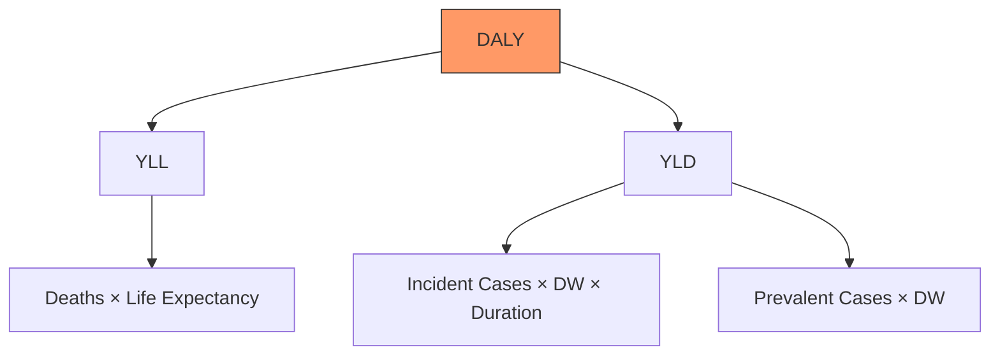
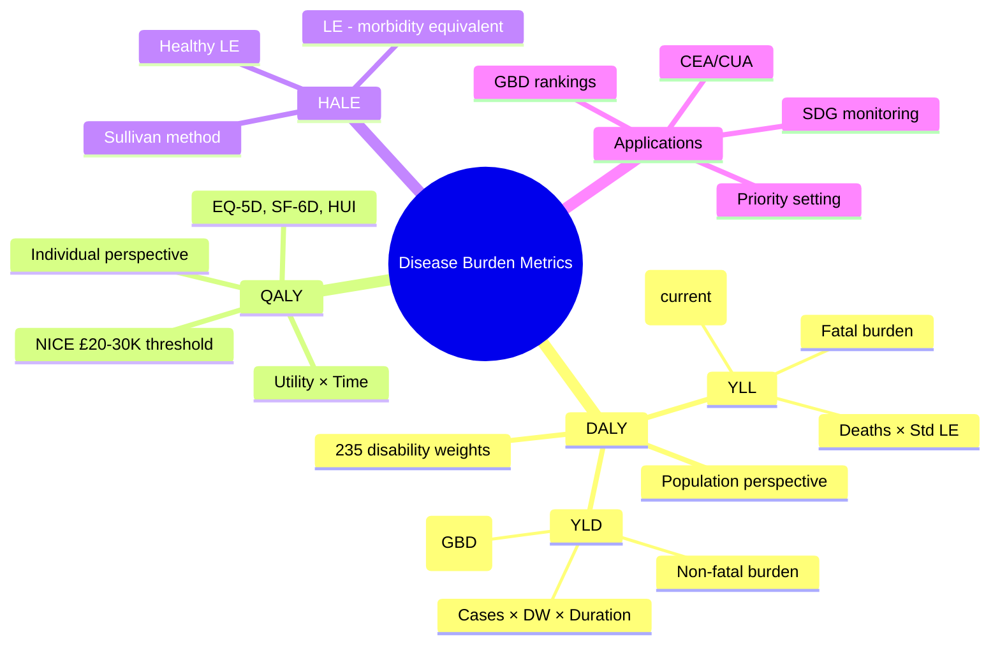

## 1. Learning Objectives
By the end of this note you should be able to:
- [ ] Define and calculate DALY, YLL, YLD, QALY, HALE
- [ ] Explain discounting, age-weighting (historical), and disability weights
- [ ] Distinguish prevalence-based vs incidence-based DALY approaches
- [ ] Interpret GBD study rankings and country-level burden profiles
- [ ] Apply QALYs to cost-effectiveness thresholds (NICE £20-30K/QALY)

---

## 2. Definition & Epidemiology

| Metric | Full Name | Formula | Unit | Perspective |
|--------|-----------|---------|------|-------------|
| **DALY** | Disability-Adjusted Life Year | YLL + YLD | Years lost | Population health gap (ideal vs actual) |
| **YLL** | Years of Life Lost | N × L | Years | Premature mortality |
| **YLD** | Years Lived with Disability | I × DW × L | Years | Non-fatal burden |
| **QALY** | Quality-Adjusted Life Year | Σ (Utility × Time) | Years | Individual health gain (economic eval) |
| **HALE** | Health-Adjusted Life Expectancy | LE – (YLD/LE) equivalent | Years | Population equivalent healthy years |

**Key Parameters:**
- **N** = number of deaths
- **L** = standard life expectancy at age of death (GBD uses theoretical minimum risk life expectancy ~86y)
- **I** = number of incident cases (incidence-based) or prevalent cases (prevalence-based)
- **DW** = disability weight (0 = full health, 1 = death); GBD 2019 has 235 weights
- **Utility** = health state value (0–1); EQ-5D, SF-6D, HUI commonly used

---

## 3. Clinical Features / Presentation
*Methodological concept - see calculation examples below.*

---

## 4. Classification / Types of Burden Measures

| Dimension | DALY (GBD) | QALY (Economic Eval) |
|-----------|------------|----------------------|
| **Philosophy** | Gap measure (loss from ideal) | Gain measure (utility from intervention) |
| **Perspective** | Population/societal | Individual/patient |
| **Time horizon** | Lifetime (incidence) or year (prevalence) | Intervention time horizon |
| **Valuation** | Disability weights (population surveys) | Utilities (patient/community preferences) |
| **Discounting** | 3% standard (GBD 2010+) | 3.5% (NICE), 3% (US) |
| **Age-weighting** | Removed in GBD 2010 | Not used |
| **Equity weights** | None standard | Sometimes applied |

**DALY Calculation Methods:**
| Approach | Formula | Use Case |
|----------|---------|----------|
| **Incidence-based** | Σ (I × DW × L) + YLL | GBD standard; captures future burden of new cases |
| **Prevalence-based** | Σ (P × DW) + YLL | Cross-sectional snapshot; simpler for annual updates |

---

## 5. Diagnosis & Investigations (Calculation Examples)

**YLL Example:**
```
Death at age 50. Standard LE at 50 = 36 years.
YLL = 1 × 36 = 36 DALYs
If 1000 such deaths: 36,000 YLL
```

**YLD Example (Incidence-based):**
```
1000 new cases of moderate depression (DW=0.4) with avg duration 10 years
YLD = 1000 × 0.4 × 10 = 4,000 DALYs
```

**QALY Example:**
```
Treatment gives 5 years at utility 0.8 vs 5 years at 0.6
QALY gain = 5 × (0.8 – 0.6) = 1.0 QALY
Cost £20,000 → ICER = £20,000/QALY (NICE threshold £20-30K)
```

**HALE Calculation (Sullivan Method):**
```
HALE = Σ (Proportion of life in health state × Utility of state)
Or: HALE = Life Expectancy – (YLD per capita equivalent years)
```

**Mermaid: DALY Composition**


---

## 6. Differential Diagnosis (Metric Confusions)

| Confusion | Clarification |
|-----------|---------------|
| **DALY vs QALY** | DALY = loss (bad); QALY = gain (good). DALYs averted = QALYs gained conceptually, but different valuation methods. |
| **YLL vs YLD** | YLL = fatal burden (mortality); YLD = non-fatal burden (morbidity). Communicable diseases → high YLL; NCDs/mental health → high YLD. |
| **Incidence vs Prevalence YLD** | Incidence: future burden of new cases; Prevalence: current burden. GBD uses incidence-based for planning. |
| **Disability Weight vs Utility** | DW: 0=health, 1=death (population valuation). Utility: 1=health, 0=death (individual valuation). DW ≈ 1 – Utility. |
| **HALE vs LE** | LE = total years; HALE = healthy-equivalent years. HALE < LE always. Gap = years in ill health. |

---

## 7. Management (Application)

| Context | Application |
|---------|-------------|
| **GBD Country Profiles** | Top 10 causes of DALYs, YLL, YLD; risk factor attribution; trends 1990-present |
| **Health Priority Setting** | Rank diseases by DALYs; identify cost-effective interventions (DALYs averted per $) |
| **Cost-Effectiveness (NICE)** | ICER = ΔCost / ΔQALY; threshold £20-30K/QALY; end-of-life modifier |
| **Resource Allocation** | DALY burden guides WHO essential medicines, vaccine intro, vertical programs |
| **Monitoring SDG 3** | HALE, DALY rates track SDG 3.4 (NCD mortality), 3.3 (communicable) |

---

## 8. FCPS/MRCP High-Yield Summary (BULLET TABLE)

| Topic | Key Points |
|-------|------------|
| **DALY = YLL + YLD** | One DALY = 1 lost healthy year. Population measure. |
| **YLL** | Deaths × standard life expectancy at age of death. No discounting in current GBD. |
| **YLD** | Cases × disability weight × duration. 235 health states in GBD 2019. |
| **Top global YLL** | Ischaemic heart disease, stroke, LRI, diarrhoea, neonatal, TB, road injury |
| **Top global YLD** | Low back pain, depressive disorders, headache, anxiety, neck pain, diabetes |
| **QALY** | Utility (0-1) × time. Utility from EQ-5D, SF-6D, HUI, TTO, SG. |
| **ICER threshold** | NICE: £20-30K/QALY. ≤£20K cost-effective; £20-30K uncertain; >£30K not cost-effective. |
| **HALE** | "Healthy life expectancy." Global ~63y (2019). UK ~70y. Gap LE-HALE = morbidity burden. |
| **Discounting** | 3% per year standard. Values future health less. Controversial for equity. |

---

## 9. Viva Questions (MRCP PACES / FCPS)

| Question | Expected Answer |
|----------|-----------------|
| **Define DALY. How does it differ from QALY?** | DALY = YLL+YLD = years of healthy life lost (gap measure, population). QALY = utility × time = years of healthy life gained (gain measure, individual). DALYs averted ≈ QALYs gained but different valuation. |
| **Calculate YLL for 500 deaths at age 60 (LE=26y).** | YLL = 500 × 26 = 13,000 years. |
| **What are disability weights? Give examples.** | DW quantifies severity on 0-1 scale. GBD 2019: mild anaemia 0.004, moderate depression 0.4, severe COPD 0.408, treated HIV 0.078, terminal cancer 0.54. Derived from population surveys (paired comparison). |
| **A treatment costs £50,000 and gives 2 QALYs. Is it cost-effective by NICE?** | ICER = £25,000/QALY. In NICE £20-30K range - uncertain, needs end-of-life/other modifiers. |
| **Why does GBD use incidence-based YLD?** | Captures future burden of new cases; better for prevention planning; avoids prevalence dependence on past incidence/survival. |
| **What is HALE? How calculated?** | Health-adjusted life expectancy. Sullivan method: HALE = Σ (proportion life in state × utility). Or LE – equivalent YLD years. |
| **Name top 3 causes of YLD globally.** | Low back pain, depressive disorders, headache disorders. |
| **What is discounting in DALYs? Why controversial?** | 3% per year - values present health more than future. Controversial: discriminates against future generations, undervalues prevention. |

---

## 10. Confusions & Mnemonics

| Confusion | Clarification |
|-----------|---------------|
| **GBD vs National** | GBD uses standard LE (86y) for all countries; national burden studies may use national LE. |
| **Risk factor attribution** | Population attributable fraction (PAF) applied to DALYs → attributable DALYs. |
| **Comorbidity adjustment** | GBD uses multiplicative independence assumption for co-occurring conditions. |

**Mnemonic: DALY COMPONENTS**
- **D**ead = **YLL** (Years Life Lost)
- **A**live but **L**iving with disability = **YLD** (Years Lived with Disability)
- **Y**ou add them = **DALY**

**Mnemonic: QALY ECONOMICS**
- **Q**uality **A**djusted **L**ife **Y**ear
- **E**Q-5D for utility
- **C**ost-effectiveness: **£20-30K/QALY**
- **O**pportunity cost
- **N**ICE threshold
- **O**ptimization
- **M**arginal analysis
- **I**CER = ΔC/ΔQ
- **C**omparators needed
- **S**ensitivity analysis

**Mnemonic: HALE vs LE**
- **H**ALE = **H**ealthy **A**djusted **L**ife **E**xpectancy
- **L**E = **L**ife **E**xpectancy (total)
- **H**ALE < **L**E always
- Difference = years in ill health

---

## 11. Mind Map



---

## 12. One-Page Revision Card

| Domain | Key Points |
|--------|------------|
| **DALY** | YLL + YLD = healthy years lost (gap) |
| **YLL** | Deaths × standard LE at age of death |
| **YLD** | Cases × disability weight × duration |
| **DW** | 0=health, 1=death; 235 states (GBD 2019) |
| **QALY** | Utility × time; gain measure; EQ-5D utility |
| **ICER** | ΔCost/ΔQALY; NICE £20-30K/QALY |
| **HALE** | Healthy life expectancy; < LE |
| **Top YLL** | IHD, stroke, LRI, diarrhoea, neonatal |
| **Top YLD** | Low back pain, depression, headache |
| **Discounting** | 3% standard; equity concerns |

---

## 13. Spaced Repetition Trackers

| Review Interval | Date Completed | Confidence (1-5) | Notes |
|-----------------|----------------|------------------|-------|
| 24 hours | | | |
| 7 days | | | |
| 15 days | | | |
| 30 days | | | |
| 90 days | | | |

---

## 14. Self-Test Scorecard

| Section | Score /5 | Last Attempt |
|---------|----------|--------------|
| DALY/YLL/YLD Definitions | | |
| Calculation Examples | | |
| QALY/ICER/NICE | | |
| HALE vs LE | | |
| GBD Top Causes | | |
| Disability Weights | | |
| Viva Questions | | |
| Mnemonics | | |

---

## 15. Local Navigation

- **Parent Heading**: [[../Population Health and Epidemiology|Population Health and Epidemiology]]
- **Chapter Map**: [[../Population Health and Epidemiology Hierarchy|Hierarchy]]
- **Chapter MOC**: [[../Population Health and Epidemiology MOC|MOC]]
- **Related**: [[Measures of Disease Frequency (Incidence, Prevalence, Rates).md]], [[Global Burden of Disease (GBD Study, Risk Factors).md]], [[Health Systems, UHC & Health Economics.md]]

---

#medicine #population-health #epidemiology #davidson #fcps #mrcp
