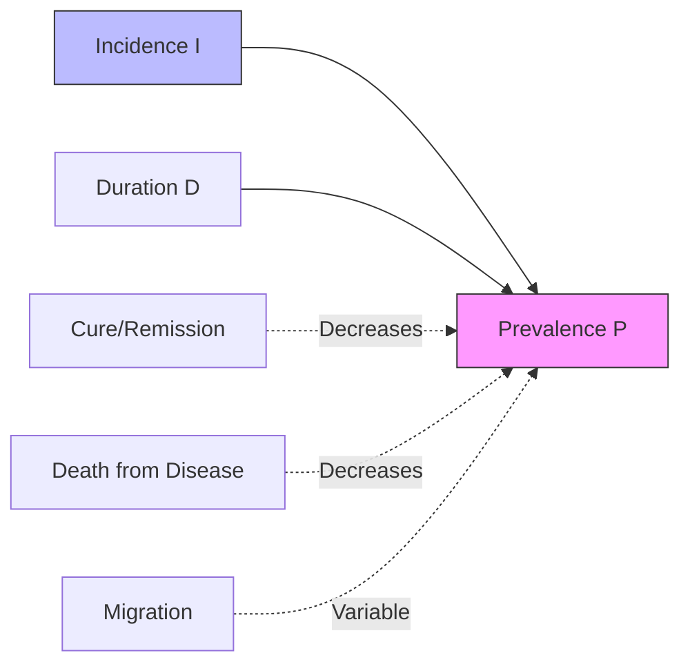
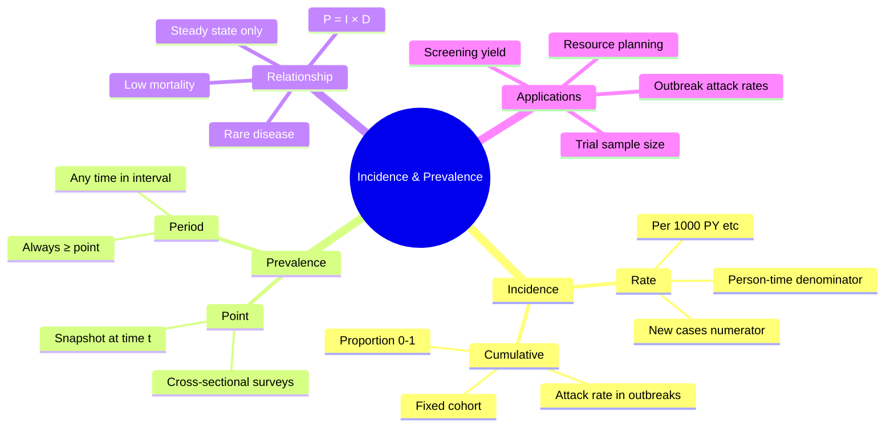

## 1. Learning Objectives
By the end of this note you should be able to:
- [ ] Define and calculate incidence rate, cumulative incidence, and prevalence
- [ ] Distinguish between point prevalence and period prevalence
- [ ] Explain the relationship between incidence and prevalence (P = I × D)
- [ ] Calculate and interpret person-time at risk
- [ ] Apply concepts to exam scenarios (screening, outbreak investigation, chronic disease monitoring)

---

## 2. Definition & Epidemiology

| Feature | Detail |
|---------|--------|
| **Incidence Rate (IR)** | Number of **new** cases per unit person-time at risk (e.g., per 1,000 person-years) |
| **Cumulative Incidence (CI)** | Proportion of at-risk population developing disease over a specified period (risk); range 0–1 |
| **Point Prevalence** | Proportion with disease at a **single point** in time (snapshot) |
| **Period Prevalence** | Proportion with disease at **any time** during a specified period |
| **Person-Time** | Sum of time each person is at risk and under observation; handles varying follow-up, competing risks |
| **Relationship** | Prevalence ≈ Incidence × Duration (for stable, low-mortality diseases) |

**Key Formula:**
```
Incidence Rate = New cases / Σ Person-time at risk
Cumulative Incidence = New cases / Population at risk at start
Point Prevalence = Existing cases at time t / Population at time t
Period Prevalence = Cases existing anytime in period / Average population in period
Prevalence ≈ Incidence × Mean Duration (steady state, rare disease, low mortality)
```

**Exam-relations:** UK prevalence T2DM ~7%; IR ~5/1,000 person-years. Breast cancer CI (UK women to age 85) ~1/7.

---

## 3. Clinical Features / Presentation
*Not applicable - methodological concept. See "Clinical Features" in disease-specific epidemiology topics.*

---

## 4. Classification / Types of Measures

| Measure Type | Numerator | Denominator | Time Dimension | Use Case |
|--------------|-----------|-------------|----------------|----------|
| **Incidence Rate** | New cases | Person-time at risk | Rate (per PY) | Dynamic populations, varying follow-up, acute diseases |
| **Cumulative Incidence** | New cases | Population at risk at start | Proportion (0–1) | Fixed cohorts, short follow-up, competing risks minimal |
| **Point Prevalence** | Existing cases at t | Population at t | Proportion (0–1) | Cross-sectional surveys, resource planning, burden snapshot |
| **Period Prevalence** | Cases during period | Average population | Proportion (0–1) | Chronic diseases, seasonal conditions, health service planning |
| **Attack Rate** | Cases in outbreak | Exposed population | Proportion (0–1) | Outbreak investigation (foodborne, norovirus) |
| **Case Fatality Rate** | Deaths from disease | Diagnosed cases | Proportion (0–1) | Disease severity, prognosis |
| **Mortality Rate** | Deaths (cause-specific) | Total population | Rate (per PY) | Population health monitoring, ICD-coded death data |

**Incidence vs Prevalence - Key Distinctions:**

| Parameter | Incidence | Prevalence |
|-----------|-----------|------------|
| **Measures** | Risk / Rate of onset | Burden at a time |
| **Numerator** | New cases only | All existing cases |
| **Time element** | Requires follow-up | Cross-sectional OK |
| **Affects by** | Exposure, prevention | Incidence + Duration + Cure + Death |
| **Screening use** | Not directly | Directly (yield = prevalence) |

---

## 5. Diagnosis & Investigations
*Methodological note - see Calculation Examples below.*

**Calculating Person-Time (Exam Scenario):**
```
Example: 10 people followed for 5 years:
- 3 develop disease at years 1, 2, 3
- 1 lost to follow-up at year 2
- 1 dies (non-disease) at year 4
- 5 complete 5 years disease-free

Person-time = (1+2+3) + 2 + 4 + (5×5) = 6 + 2 + 4 + 25 = 37 PY
If 3 new cases: IR = 3/37 = 0.081 per PY = 81 per 1,000 PY
```

**Mermaid: Incidence-Prevalence Relationship**


---

## 6. Differential Diagnosis (Methodological Confusions)

| Confusion | Clarification |
|-----------|---------------|
| **Incidence ≠ Prevalence** | Incidence = new cases (speedometer); Prevalence = existing cases (odometer) |
| **Cumulative Incidence ≠ Incidence Rate** | CI = proportion (0–1); IR = rate per person-time; CI ≈ IR × time if IR constant, low |
| **Rate vs Ratio vs Proportion** | Rate: time in denominator (PY); Ratio: numerator/denominator different units; Proportion: numerator subset of denominator (0–1) |
| **Period vs Point Prevalence** | Period includes all cases during interval; Point is snapshot; Period > Point always |
| **Attack Rate = CI in outbreak** | Attack rate is cumulative incidence in a defined exposed group over outbreak period |

---

## 7. Management (Conceptual Application)

| Scenario | Application |
|----------|-------------|
| **Screening program planning** | Yield = Prevalence × Sensitivity; PPV depends critically on prevalence |
| **Outbreak investigation** | Calculate attack rates by exposure; compare exposed vs unexposed (RR) |
| **Chronic disease monitoring** | Prevalence tracks burden; incidence tracks prevention success |
| **Clinical trial design** | Sample size based on expected incidence in control group |
| **Health economics** | Prevalence used for DALY prevalence-based methods; incidence for incidence-based DALYs |

---

## 8. FCPS/MRCP High-Yield Summary (BULLET TABLE)

| Topic | Key Points |
|-------|------------|
| **P = I × D** | ONLY valid if: steady state, disease rare (<10%), no migration, constant I & D, low case-fatality |
| **Person-time** | Always use for incidence RATE; handles staggered entry, loss to follow-up, competing death |
| **Prevalence ↑ when** | Incidence ↑ OR Duration ↑ (better survival, chronic disease) OR Migration of cases in |
| **Prevalence ↓ when** | Incidence ↓ (prevention) OR Duration ↓ (cure, death) OR Migration out |
| **Cross-sectional study** | Measures PREVALENCE only; cannot calculate incidence directly |
| **Cohort study** | Measures INCIDENCE (rate or cumulative); can calculate prevalence at baseline/follow-up |
| **Rare disease** | OR ≈ RR ≈ Hazard Ratio; Prevalence ≈ Incidence × Duration |
| **Common disease** | OR overestimates RR; use log-binomial or Poisson regression for RR |

---

## 9. Viva Questions (MRCP PACES / FCPS)

| Question | Expected Answer |
|----------|-----------------|
| **Define incidence rate and cumulative incidence. When would you use each?** | Incidence rate = new cases per person-time (handles varying follow-up). Cumulative incidence = proportion developing disease over fixed period (simple cohorts, short follow-up). Use IR for dynamic populations, CI for fixed cohorts. |
| **What is the relationship between prevalence and incidence? When does it hold?** | P ≈ I × D. Holds only in steady state: constant incidence, constant duration, rare disease (<10%), no migration, low case-fatality. |
| **A screening test has 90% sensitivity, 95% specificity. Disease prevalence is 1%. What is PPV?** | PPV = (0.9 × 0.01) / (0.9×0.01 + 0.05×0.99) = 0.009 / 0.0585 ≈ 15.4%. LOW PPV because low prevalence. |
| **In an outbreak of 200 people exposed to chicken salad, 60 develop gastroenteritis. What is the attack rate?** | Attack rate = 60/200 = 30%. This is cumulative incidence in the exposed group over the outbreak period. |
| **Why does incidence rate use person-time denominator?** | Accounts for: staggered entry, variable follow-up, loss to follow-up, competing risks (death), changing population size. Simple N/D fails if follow-up differs. |
| **If a new treatment improves survival of a chronic disease without curing it, what happens to prevalence?** | Prevalence INCREASES. Duration increases (patients live longer with disease), incidence unchanged → P = I × D rises. |
| **Distinguish point prevalence from period prevalence. Which is larger?** | Point = cases at single time t / population at t. Period = cases at any time during interval / average population. Period prevalence ≥ Point prevalence always. |
| **What is case fatality rate vs mortality rate?** | CFR = deaths from disease / diagnosed cases (severity). Mortality rate = cause-specific deaths / total population (population burden). |

---

## 10. Confusions & Mnemonics

| Confusion | Clarification |
|-----------|---------------|
| **Rate vs Ratio vs Proportion** | **Rate**: time in denominator (per PY). **Ratio**: different units (M:F ratio). **Proportion**: numerator ⊂ denominator (0–1). |
| **Prevalence-OR-RR** | In cross-sectional: Prevalence OR ≠ Incidence RR. In rare disease: OR ≈ RR. Common disease: OR > RR. |
| **Person-years trick** | If 100 people × 2 years = 200 PY. If 10 drop at 1 year: (10×1) + (90×2) = 190 PY. |

**Mnemonic: P = I × D (PREVALID)**
- **P**revalence
- **R**equires
- **E**quilibrium (steady state)
- **V**ery rare disease (<10%)
- **A**ll constant (I, D)
- **L**ow mortality
- **I**mmigration negligible
- **D**uration only variable

**Mnemonic: INCIDENCE PERSON-TIME**
- **I**ncludes all at-risk time
- **N**ew cases only
- **C**ounts dropouts proportionally
- **I**mmigration/emigration handled
- **D**eath from other causes censored
- **E**ntry staggered allowed
- **N**on-constant follow-up OK
- **C**ompeteing risks addressed
- **E**xact time at risk used

---

## 11. Mind Map



---

## 12. One-Page Revision Card

| Domain | Key Points |
|--------|------------|
| **Definition** | Incidence = new cases; Prevalence = existing cases |
| **Key Formula** | P = I × D (steady state, rare, low mortality) |
| **Incidence Rate** | New cases / Person-time (handles variable follow-up) |
| **Cumulative Incidence** | New cases / Population at start (proportion 0–1) |
| **Point Prevalence** | Cases at time t / Population at t |
| **Period Prevalence** | Cases any time in period / Average population |
| **Person-Time** | Gold standard denominator for rates |
| **Attack Rate** | CI in exposed outbreak group |
| **Screening Yield** | Prevalence × Sensitivity |
| **PPV Trap** | Low prevalence → low PPV even with good test |

---

## 13. Spaced Repetition Trackers

| Review Interval | Date Completed | Confidence (1-5) | Notes |
|-----------------|----------------|------------------|-------|
| 24 hours | | | |
| 7 days | | | |
| 15 days | | | |
| 30 days | | | |
| 90 days | | | |

---

## 14. Self-Test Scorecard

| Section | Score /5 | Last Attempt |
|---------|----------|--------------|
| Definitions & Formulae | | |
| Person-Time Calculation | | |
| P = I × D Conditions | | |
| Incidence vs Prevalence | | |
| Screening/Outbreak Application | | |
| Viva Questions | | |
| Mnemonics | | |

---

## 15. Local Navigation

- **Parent Heading**: [[../Population Health and Epidemiology|Population Health and Epidemiology]]
- **Chapter Map**: [[../Population Health and Epidemiology Hierarchy|Hierarchy]]
- **Chapter MOC**: [[../Population Health and Epidemiology MOC|MOC]]
- **Related**: [[Measures of Association (RR, OR, HR, AR, PAR).md]], [[Measures of Disease Burden (DALY, QALY, HALE, YLL, YLD).md]], [[Study Designs (Descriptive, Analytical, Experimental).md]]

---

#medicine #population-health #epidemiology #davidson #fcps #mrcp
