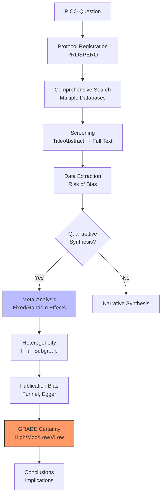
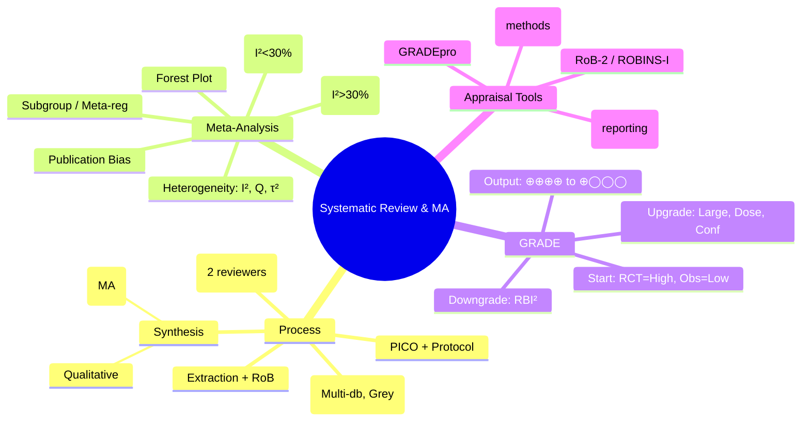

## 1. Learning Objectives
By the end of this note you should be able to:
- [ ] Distinguish systematic review vs narrative review vs meta-analysis
- [ ] Interpret forest plots: effect sizes, CIs, weights, pooled estimate
- [ ] Assess heterogeneity: I², Q-test, τ²; random vs fixed effects
- [ ] Apply GRADE: rate certainty of evidence (High/Moderate/Low/Very Low)
- [ ] Identify publication bias: funnel plot, Egger's test, trim-and-fill
- [ ] Appraise SR/MA using PRISMA, AMSTAR-2, ROB-2/ROBINS-I

---

## 2. Definition & Epidemiology

| Term | Definition |
|------|------------|
| **Systematic Review (SR)** | Explicit question, comprehensive search, explicit inclusion criteria, critical appraisal, synthesis (qualitative or quantitative) |
| **Meta-Analysis (MA)** | Statistical synthesis of effect estimates from multiple studies (quantitative SR) |
| **Forest Plot** | Graphical display of individual study effects + pooled estimate with CI |
| **Heterogeneity** | Variation in true effects across studies beyond chance |
| **GRADE** | Grading of Recommendations Assessment, Development and Evaluation - rates certainty of evidence |

---

## 3. Clinical Features / Presentation
*Methodological concept - see forest plot interpretation and GRADE tables below.*

---

## 4. Classification / Meta-Analysis Models

| Model | Assumption | When Used | Weighting |
|-------|-----------|-----------|-----------|
| **Fixed Effect** | Single true effect; differences = sampling error | Low heterogeneity (I² < 25-30%) | Inverse variance (1/SE²) |
| **Random Effects** | True effects vary (distribution); estimates exchangeable | Moderate/high heterogeneity (I² > 30%) | Inverse variance + τ² (between-study variance) |

**Heterogeneity Metrics:**
| Metric | Interpretation | Thresholds |
|--------|----------------|------------|
| **Cochran's Q** | χ² test of homogeneity | p<0.10 = significant heterogeneity |
| **I²** | % total variation due to heterogeneity | 0-25% low, 25-50% moderate, 50-75% substantial, >75% considerable |
| **τ² (tau²)** | Between-study variance | Estimate of true effect variance |
| **τ (tau)** | SD of true effects | √τ² |

---

## 5. Diagnosis & Investigations (Forest Plot & GRADE)

**Forest Plot Elements:**
```
Study A    ●—————●     Weight 20%   OR 1.2 [0.8, 1.8]
Study B    ●——————●    Weight 35%   OR 0.9 [0.6, 1.3]
Study C    ●——●       Weight 15%   OR 1.5 [1.1, 2.0]
Study D    ●—————●     Weight 30%   OR 1.1 [0.7, 1.6]
                        Pooled:   OR 1.1 [0.9, 1.3]   I²=35%
```
- **Square** = point estimate (size ∝ weight)
- **Horizontal line** = 95% CI
- **Diamond** = pooled estimate (center = estimate, width = CI)
- **Vertical line** = null (OR=1, RR=1, MD=0)

**Mermaid: SR/MA Process**


**GRADE Domains (Downgrade Factors):**
| Domain | Downgrade If |
|--------|--------------|
| **Risk of Bias** | Serious (1 level) or Very Serious (2 levels) limitations per RoB-2/ROBINS-I |
| **Inconsistency** | Unexplained heterogeneity (I² >50%, varying directions) |
| **Indirectness** | Population/Intervention/Comparator/Outcome differs from question |
| **Imprecision** | Wide CI crossing decision threshold; optimal information size not met |
| **Publication Bias** | Funnel plot asymmetry; small-study effects |

**GRADE Domains (Upgrade Factors):**
| Domain | Upgrade If |
|--------|------------|
| **Large Effect** | RR >2 or <0.5 (1 level); >5 or <0.2 (2 levels) |
| **Dose-Response** | Gradient of effect across exposure levels |
| **Plausible Confounding** | Would reduce effect (bias toward null) |

**GRADE Output:**
| Certainty | Meaning | Symbol |
|-----------|---------|--------|
| **High** | True effect likely close to estimate | ⊕⊕⊕⊕ |
| **Moderate** | True effect probably close | ⊕⊕⊕◯ |
| **Low** | True effect may be substantially different | ⊕⊕◯◯ |
| **Very Low** | True effect likely substantially different | ⊕◯◯◯ |

---

## 6. Differential Diagnosis (SR/MA Confusions)

| Confusion | Clarification |
|-----------|---------------|
| **SR vs MA** | SR = process; MA = statistical technique. SR can exist without MA (qualitative synthesis). |
| **Fixed vs Random Effects** | Fixed: assumes one true effect. Random: assumes distribution of true effects. Random gives wider CI, more weight to smaller studies. |
| **I² vs Q-test** | Q-test: p-value (sensitive to number of studies). I²: magnitude (preferred). Low power of Q with few studies. |
| **Heterogeneity vs Diversity** | I² = proportion of observed variance that is real. With high precision studies, I² can be high even if clinical diversity low. |
| **Subgroup vs Meta-regression** | Subgroup: categorical. Meta-regression: continuous/multiple covariates. Both observational (ecological fallacy risk). |
| **Publication Bias vs Small-Study Effects** | Small studies show larger effects → funnel asymmetry. Causes: publication bias, poor quality, heterogeneity, chance. |

---

## 7. Management (Critical Appraisal Checklist)

| Tool | Purpose |
|------|---------|
| **PRISMA** | Reporting guideline (27 items) for SR/MA |
| **AMSTAR-2** | Critical appraisal of SR methods (16 items) |
| **ROB-2** | Risk of bias for RCTs (5 domains) |
| **ROBINS-I** | Risk of bias for non-randomised studies (7 domains) |
| **GRADE** | Certainty of evidence for outcomes |
| **Funnel Plot / Egger** | Publication bias / small-study effects |

**Key Appraisal Questions:**
1. Is PICO clear? Was protocol registered (PROSPERO)?
2. Search comprehensive? Grey literature? Multiple databases?
3. Selection & extraction independent/duplicate?
4. Risk of bias assessed per study (RoB-2/ROBINS-I)?
5. Heterogeneity explored (I², subgroups, meta-regression)?
6. Publication bias assessed (funnel, Egger, trim-and-fill)?
7. GRADE applied per outcome? Summary of findings table?
8. Conclusions match evidence certainty?

---

## 8. FCPS/MRCP High-Yield Summary (BULLET TABLE)

| Topic | Key Points |
|-------|------------|
| **Hierarchy Top** | SR/MA of RCTs = highest evidence level |
| **Fixed Effect** | I² <30%; assumes single truth; weight = 1/SE² |
| **Random Effects** | I² >30%; assumes effect distribution; weight = 1/(SE²+τ²); wider CI |
| **I² Interpretation** | 0-25% low, 25-50% moderate, 50-75% substantial, >75% considerable |
| **Forest Plot** | Square=estimate, line=CI, diamond=pooled, vertical=null |
| **GRADE Starts** | RCTs = High; Observational = Low (then up/down) |
| **Downgrade** | RoB, Inconsistency, Indirectness, Imprecision, Pub Bias |
| **Upgrade** | Large effect, Dose-response, Confounding would reduce effect |
| **Funnel Plot** | Asymmetry = publication bias / small-study effects |
| **Trim-and-fill** | Imputes missing studies; adjusts pooled estimate |

---

## 9. Viva Questions (MRCP PACES / FCPS)

| Question | Expected Answer |
|----------|-----------------|
| **Difference between systematic review and meta-analysis?** | SR = systematic process (question, search, selection, appraisal, synthesis). MA = statistical pooling of effect estimates. SR can be qualitative (no MA). |
| **When to use fixed vs random effects?** | Fixed: I² <30%, assumes single true effect. Random: I² >30%, assumes true effects vary. Random gives wider CI and more weight to smaller studies. |
| **What is I²? Interpret 60%.** | I² = % of total variation due to heterogeneity (not chance). 60% = substantial heterogeneity; explore sources (subgroups, meta-regression); use random effects. |
| **Describe a forest plot.** | Each study: square (point estimate, size=weight), horizontal line (95% CI). Diamond: pooled estimate (center), width (pooled CI). Vertical line: null (OR=1). |
| **GRADE: RCT starts at High. When downgrade?** | Risk of bias (serious/very serious), Inconsistency (unexplained heterogeneity), Indirectness (PICO mismatch), Imprecision (wide CI, OIS not met), Publication bias (funnel asymmetry). |
| **GRADE: Observational starts at Low. When upgrade?** | Large effect (RR>2 or <0.5: +1; RR>5 or <0.2: +2), Dose-response gradient, Confounding would reduce observed effect. |
| **Funnel plot asymmetry - causes?** | Publication bias (negative studies unpublished), small-study effects (poor quality), heterogeneity, chance, true effect differs by study size. |
| **What is trim-and-fill?** | Iterative method: identifies asymmetry, imputes missing studies to restore symmetry, recalculates pooled estimate. |
| **Subgroup analysis vs meta-regression?** | Subgroup: categorical moderator (e.g., drug class). Meta-regression: continuous/multiple covariates. Both ecological (study-level) associations. |

---

## 10. Confusions & Mnemonics

| Confusion | Clarification |
|-----------|---------------|
| **Weight in RE model** | RE weights = 1/(SE² + τ²). Smaller studies get relatively MORE weight vs FE. |
| **Prediction Interval** | Random effects: 95% PI = pooled ± 1.96τ. Range where true effect of NEW study would lie. Wider than CI. |
| **Hartung-Knapp** | Adjustment for SE of pooled estimate in RE; more conservative CI; recommended. |
| **Network MA** | Compares multiple treatments simultaneously (A vs B, B vs C → A vs C indirect). Requires transitivity/consistency. |

**Mnemonic: SR/MA STEPS (PICO to GRADE)**
- **P**ROSPERO protocol
- **I**nprehensive search
- **C**ritical appraisal (RoB-2/ROBINS-I)
- **O**utcome synthesis (FE/RE)
- **H**eterogeneity (I², subgroups)
- **P**ublication bias (funnel, Egger)
- **G**RADE certainty
- **R**eporting (PRISMA, SoF table)

**Mnemonic: GRADE DOWNGRADE (RISK OFF)**
- **R**isk of **B**ias
- **I**nconsistency
- **I**ndirectness
- **I**mprecision
- **P**ublication **B**ias

**Mnemonic: GRADE UPGRADE (LARGE)**
- **L**arge **E**ffect
- **D**ose-**R**esponse
- **P**lausible confounding (**A**gainst observed effect)

**Mnemonic: HETEROGENEITY I²**
- **I**² **L**ow <25%
- **I**² **M**oderate 25-50%
- **I**² **S**ubstantial 50-75%
- **I**² **C**onsiderable >75%

---

## 11. Mind Map



---

## 12. One-Page Revision Card

| Domain | Key Points |
|--------|------------|
| **SR vs MA** | SR = process; MA = statistical pooling |
| **Fixed Effect** | I²<30%, single truth, weight=1/SE² |
| **Random Effects** | I²>30%, effect distribution, weight=1/(SE²+τ²) |
| **Forest Plot** | Square=estimate, line=CI, diamond=pooled |
| **I²** | 0-25% low, 25-50% mod, 50-75% subst, >75% considerable |
| **GRADE Start** | RCT=High, Observational=Low |
| **Downgrade** | RoB, Inconsistency, Indirectness, Imprecision, Pub Bias |
| **Upgrade** | Large effect (RR>2), Dose-response, Plausible confounding |
| **Publication Bias** | Funnel asymmetry, Egger's test, trim-and-fill |
| **Prediction Interval** | Pooled ± 1.96τ (random effects) |

---

## 13. Spaced Repetition Trackers

| Review Interval | Date Completed | Confidence (1-5) | Notes |
|-----------------|----------------|------------------|-------|
| 24 hours | | | |
| 7 days | | | |
| 15 days | | | |
| 30 days | | | |
| 90 days | | | |

---

## 14. Self-Test Scorecard

| Section | Score /5 | Last Attempt |
|---------|----------|--------------|
| SR/MA Definitions | | |
| Fixed vs Random Effects | | |
| Forest Plot Interpretation | | |
| Heterogeneity (I², Q, τ²) | | |
| GRADE Framework | | |
| Publication Bias | | |
| Appraisal Tools (PRISMA, AMSTAR) | | |
| Viva Questions | | |
| Mnemonics | | |

---

## 15. Local Navigation

- **Parent Heading**: [[../Population Health and Epidemiology|Population Health and Epidemiology]]
- **Chapter Map**: [[../Population Health and Epidemiology Hierarchy|Hierarchy]]
- **Chapter MOC**: [[../Population Health and Epidemiology MOC|MOC]]
- **Related**: [[Evidence-Based Medicine & Clinical Guidelines.md]], [[Study Designs (Descriptive, Analytical, Experimental).md]], [[Bias, Confounding, Effect Modification.md]]

---

#medicine #population-health #epidemiology #davidson #fcps #mrcp
