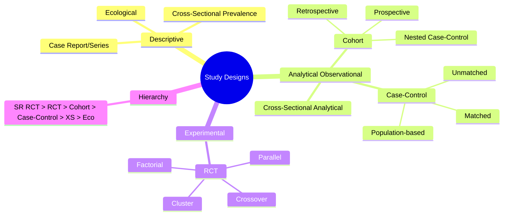

## 1. Learning Objectives
By the end of this note you should be able to:
- [ ] Classify study designs: descriptive vs analytical vs experimental
- [ ] Compare cohort, case-control, cross-sectional, RCT, ecological designs
- [ ] Identify appropriate design for incidence, prevalence, RR, OR, HR
- [ ] Explain hierarchy of evidence (RCT > cohort > case-control > cross-sectional > ecological)
- [ ] Apply design choice to exam scenarios (rare disease, rare exposure, latency, ethics)

---

## 2. Definition & Epidemiology

| Design Category | Designs | Key Feature | Measures |
|-----------------|---------|-------------|----------|
| **Descriptive** | Case report, case series, cross-sectional (prevalence), ecological | Describe distribution (person, place, time) | Prevalence, rates, patterns |
| **Analytical (Observational)** | Cohort, case-control, cross-sectional (analytical), nested case-control | Observe exposure → outcome; compare groups | RR, OR, HR, AR |
| **Experimental** | RCT, cluster RCT, crossover, N-of-1, factorial | Investigator assigns exposure | RR, RD, HR, NNT |

---

## 3. Clinical Features / Presentation
*Methodological concept - see design comparison table below.*

---

## 4. Classification / Study Design Comparison

| Feature | **RCT** | **Cohort** | **Case-Control** | **Cross-Sectional** | **Ecological** |
|---------|---------|------------|------------------|---------------------|----------------|
| **Assignment** | Randomised | Observed | Observed | Observed | Group-level |
| **Direction** | Exposure → Outcome | Exposure → Outcome | Outcome → Exposure | Simultaneous | Group-level assoc |
| **Timing** | Prospective | Prospective/Retrospective | Retrospective | Cross-sectional | Cross-sectional |
| **Incidence** | ✓ | ✓ | ✗ | ✗ | ✗ (group rates) |
| **Prevalence** | ✓ | ✓ | ✗ | ✓ | ✓ |
| **RR** | ✓ | ✓ | ✗ | (PR) | ✗ |
| **OR** | ✓ | ✓ | ✓ | (POR) | ✓ |
| **HR** | ✓ | ✓ | ✗ | ✗ | ✗ |
| **Rare Disease** | Good | Poor (large N, long FU) | **Best** | Poor | Possible |
| **Rare Exposure** | Good | **Best** | Poor | Poor | Possible |
| **Latency** | Good | Good | Recall bias | Poor | Possible |
| **Confounding** | Minimised by randomisation | Adjust in analysis | Matching, adjustment | Adjustment | **Ecological fallacy** |
| **Cost/Time** | High/High | High/High | Low/Medium | Low/Low | Low/Low |
| **Ethics** | Equipoise required | Usually ethical | Usually ethical | Usually ethical | Usually ethical |

**Hierarchy of Evidence (Therapy/Harm):**
```
1. Systematic Review/Meta-analysis of RCTs
2. Individual RCT (large, well-designed)
3. Systematic Review of Cohort Studies
4. Individual Cohort Study
5. Case-Control Study
6. Cross-Sectional Study
7. Ecological Study
8. Case Series/Reports
9. Expert Opinion
```

---

## 5. Diagnosis & Investigations (Design Selection Algorithm)

**Mermaid: Study Design Decision Flow**
```mermaid
flowchart TD
    A[Research Question] --> B{Therapy/Prevention?}
    B -->|Yes| C[RCT if ethical/feasible]
    B -->|No (Etiology/Harm)| D{Outcome Rare?}
    D -->|Yes| E[Case-Control]
    D -->|No| F{Exposure Rare?}
    F -->|Yes| G[Cohort]
    F -->|No| H[Cohort or Cross-Sectional]
    C --> I[If RCT not possible → Cohort]
    E --> J[If exposure rare → Cohort]
    G --> K[Retrospective cohort if data exist]
    H --> L[Cross-sectional for prevalence]
    style C fill:#bbf,stroke:#333
    style E fill:#fbf,stroke:#333
    style G fill:#bfb,stroke:#333
```

---

## 6. Differential Diagnosis (Design Confusions)

| Confusion | Clarification |
|-----------|---------------|
| **Cohort vs Case-Control** | Cohort: start with exposure, follow for outcome. Case-control: start with outcome, look back at exposure. |
| **Cross-Sectional Analytical vs Descriptive** | Descriptive: prevalence only. Analytical: compares exposed vs unexposed for association (PR/POR). |
| **Nested Case-Control** | Case-control WITHIN a cohort: efficient for rare outcomes in cohort; uses cohort's exposure data (no recall bias). |
| **Ecological Fallacy** | Group-level association ≠ individual-level association. E.g., countries with high fat intake have high CHD, but within country, fat intake may not predict CHD. |
| **Case Series vs Cohort** | Case series: no comparison group. Cohort: has unexposed comparison group. |
| **RCT vs Cluster RCT** | Individual randomisation vs group (cluster) randomisation. Cluster RCT needs ICC adjustment, larger sample. |

---

## 7. Management (Design Application)

| Scenario | Best Design | Reasoning |
|----------|-------------|-----------|
| **New drug efficacy** | RCT | Gold standard; randomisation balances confounders |
| **Rare disease etiology** | Case-control | Efficient; starts with cases |
| **Rare exposure etiology** | Cohort | Starts with exposed group |
| **Long latency (asbestos→mesothelioma)** | Cohort (retrospective) | Follow-up already happened in records |
| **Disease burden (prevalence)** | Cross-sectional | Snapshot; efficient |
| **Outbreak investigation** | Case-control (retrospective cohort if small) | Rapid; compares exposures |
| **Risk factor trends** | Ecological | Group-level data available |
| **Diagnostic test accuracy** | Cross-sectional (cases+controls) | Sensitivity/specificity need known disease status |

---

## 8. FCPS/MRCP High-Yield Summary (BULLET TABLE)

| Topic | Key Points |
|-------|------------|
| **RCT = Gold Standard** | Randomisation → exchangeability → causal inference. CONSORT reporting. |
| **Cohort for incidence** | Only design giving direct incidence rates & RR (except RCT). |
| **Case-Control for rare outcome** | Efficient; OR estimates RR if rare. Matching controls confounding. |
| **Cross-Sectional = Prevalence** | Cannot establish temporality (exposure↔outcome simultaneous). |
| **Ecological = Hypothesis-generating** | Ecological fallacy risk; cannot infer individual risk. |
| **Nested Case-Control** | Best of both: cohort exposure data + case-control efficiency. |
| **Retrospective Cohort** | Uses existing records; faster/cheaper; same measures as prospective. |
| **Crossover RCT** | Each subject = own control; washout critical; only chronic stable conditions. |
| **Cluster RCT** | ICC inflates sample size; contamination avoided; analysis at cluster level. |

---

## 9. Viva Questions (MRCP PACES / FCPS)

| Question | Expected Answer |
|----------|-----------------|
| **Hierarchy of evidence for therapy?** | SR of RCTs > RCT > SR of cohorts > Cohort > Case-control > Cross-sectional > Ecological > Case series > Expert opinion |
| **Study on rare disease (incidence 1/100,000) and common exposure. Best design?** | Case-control. Cohort would need huge N and long follow-up. |
| **Study on rare exposure (prevalence 0.1%) and common outcome. Best design?** | Cohort. Start with the rare exposed group. |
| **Why can't cross-sectional establish causality?** | Exposure and outcome measured simultaneously → temporality unclear (reverse causation possible). |
| **What is a nested case-control study?** | Case-control within an existing cohort. Uses cohort's baseline exposure data → no recall bias. Efficient for rare outcomes. |
| **What is ecological fallacy? Example.** | Group-level association ≠ individual-level. E.g., high alcohol-consuming countries have low CHD, but within country, heavy drinkers have higher CHD. |
| **Difference between retrospective cohort and case-control?** | Retrospective cohort: defined by exposure at baseline, follow records forward to outcome. Case-control: defined by outcome, look back at exposure. |
| **When is crossover RCT appropriate?** | Chronic stable condition (asthma, hypertension), reversible treatment effect, adequate washout, no carryover. |
| **What is intention-to-treat (ITT) analysis?** | Analyse all randomised participants in assigned groups regardless of adherence. Preserves randomisation benefits. |

---

## 10. Confusions & Mnemonics

| Confusion | Clarification |
|-----------|---------------|
| **Case-control gives OR only** | Cannot calculate incidence → no RR. OR ≈ RR if outcome rare in source population. |
| **Matching in case-control** | Controls matched to cases on confounders (age, sex). Must use conditional logistic regression. Overmatching = matching on exposure-related factor → bias. |
| **Retrospective ≠ Case-Control** | Retrospective COHORT uses past exposure records, follows forward. Case-control starts with outcome. |
| **Cross-sectional PR vs RR** | Prevalence Ratio ≠ Risk Ratio. PR overestimates RR if duration differs between exposed/unexposed. |

**Mnemonic: CHORUS (Design Hierarchy)**
- **C**ochrane SR of RCTs
- **H**igh-quality RCT
- **O**bservational Cohort
- **R**etrospective Cohort
- **U**nmatched Case-Control
- **S**urvey Cross-Sectional

**Mnemonic: COHORT vs CASE-CONTROL**
- **C**ohort: **C**ause → **E**ffect (Exposure → Outcome)
- **C**ase-Control: **E**ffect → **C**ause (Outcome → Exposure)

**Mnemonic: ECOLOGICAL FALLACY**
- **E**cological = **G**roup **L**evel
- **O**bserved **L**ink
- **O**ften **G**oes
- **A**gainst **L**ogic
- **I**ndividual
- **C**annot **A**ssume
- **L**ink holds at individual level!

---

## 11. Mind Map



---

## 12. One-Page Revision Card

| Domain | Key Points |
|--------|------------|
| **RCT** | Randomised, prospective, RR/HR, gold standard, ITT |
| **Cohort** | Exposure→Outcome, incidence, RR/HR, rare exposure |
| **Case-Control** | Outcome→Exposure, OR, rare outcome, matching |
| **Cross-Sectional** | Snapshot, prevalence, PR/POR, no temporality |
| **Ecological** | Group-level, hypothesis only, ecological fallacy |
| **Nested CC** | CC inside cohort, no recall bias, efficient |
| **Hierarchy** | SR RCT > RCT > Cohort > CC > XS > Eco |
| **Rare Disease** | → Case-Control |
| **Rare Exposure** | → Cohort |
| **ITT** | Analyse as randomised |

---

## 13. Spaced Repetition Trackers

| Review Interval | Date Completed | Confidence (1-5) | Notes |
|-----------------|----------------|------------------|-------|
| 24 hours | | | |
| 7 days | | | |
| 15 days | | | |
| 30 days | | | |
| 90 days | | | |

---

## 14. Self-Test Scorecard

| Section | Score /5 | Last Attempt |
|---------|----------|--------------|
| Design Classification | | |
| Cohort vs Case-Control | | |
| Cross-Sectional Limits | | |
| Ecological Fallacy | | |
| Nested Case-Control | | |
| Hierarchy of Evidence | | |
| Design Selection | | |
| Viva Questions | | |
| Mnemonics | | |

---

## 15. Local Navigation

- **Parent Heading**: [[../Population Health and Epidemiology|Population Health and Epidemiology]]
- **Chapter Map**: [[../Population Health and Epidemiology Hierarchy|Hierarchy]]
- **Chapter MOC**: [[../Population Health and Epidemiology MOC|MOC]]
- **Related**: [[Measures of Disease Frequency (Incidence, Prevalence, Rates).md]], [[Measures of Association (RR, OR, HR, AR, PAR).md]], [[Bias, Confounding, Effect Modification.md]]

---

#medicine #population-health #epidemiology #davidson #fcps #mrcp
