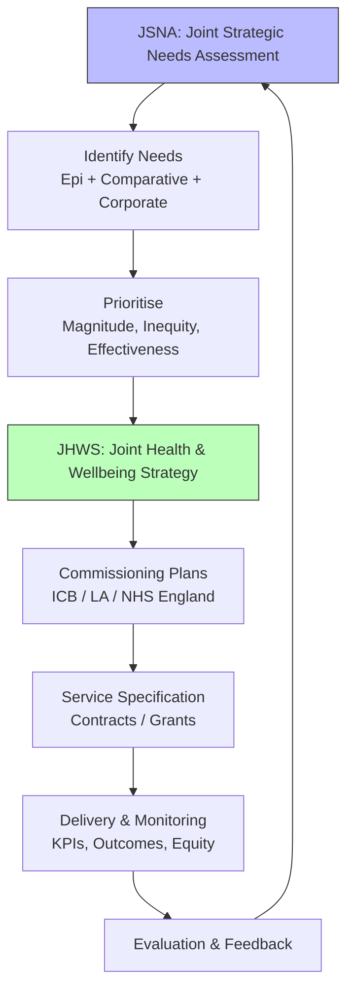
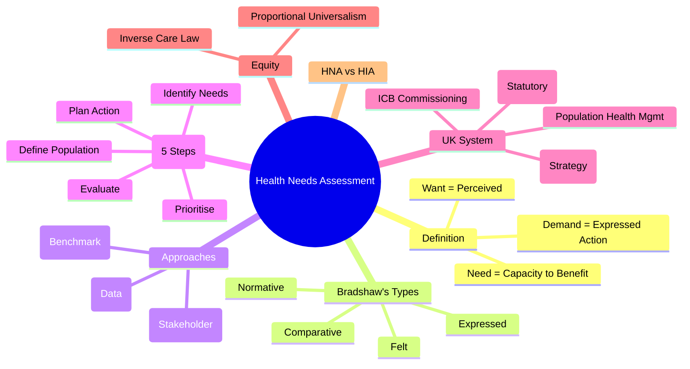

## 1. Learning Objectives
By the end of this note you should be able to:
- [ ] Define Health Needs Assessment (HNA) and distinguish from health wants/demands
- [ ] Describe 5-step HNA cycle and 3 methodological approaches
- [ ] Apply HNA to commissioning: JSNA → JHWS → Commissioning plans
- [ ] Identify equity considerations: proportional universalism, inverse care law
- [ ] Distinguish HNA from Health Impact Assessment (HIA)

---

## 2. Definition & Epidemiology

| Concept | Definition |
|---------|------------|
| **Health Need** | Capacity to benefit from healthcare intervention (ability to benefit) |
| **Health Want** | Patient/client perceived desire for care |
| **Health Demand** | Want expressed as action (e.g., appointment request) |
| **Health Needs Assessment** | Systematic method to identify unmet health needs, prioritise, plan services |
| **JSNA** | Joint Strategic Needs Assessment (UK statutory duty, LA + ICB) |
| **JHWS** | Joint Health and Wellbeing Strategy (informed by JSNA) |

**Bradshaw's Taxonomy of Need (1972):**
| Type | Description | Example |
|------|-------------|---------|
| **Normative** | Expert-defined (guidelines, standards) | NICE guidelines, vaccination schedule |
| **Felt** | Patient-perceived need | "I want a knee replacement" |
| **Expressed** | Felt need turned into action | GP referral for knee X-ray |
| **Comparative** | Comparison with similar populations | Higher admission rate than peer CCGs |

---

## 3. Clinical Features / Presentation
*Methodological process - see HNA cycle below.*

---

## 4. Classification / HNA Approaches

| Approach | Description | When Used |
|----------|-------------|-----------|
| **Epidemiological** | Population data: demographics, morbidity, mortality, risk factors, service use | Foundation for all HNA; objective, quantitative |
| **Comparative** | Compare with similar populations/areas/benchmarks | Identify unwarranted variation; equity audit |
| **Corporate/Qualitative** | Stakeholder views: patients, public, professionals, voluntary sector | Capture felt/expressed needs; acceptability, values |

**HNA Cycle (5 Steps):**
| Step | Action | Tools |
|------|--------|-------|
| **1. Define Population** | Geographic, demographic, condition-specific | GIS mapping, population registers |
| **2. Identify Needs** | Epidemiological data + stakeholder engagement | JSNA datasets, surveys, focus groups, complaints |
| **3. Prioritise Needs** | Criteria: magnitude, severity, inequality, effectiveness, cost-effectiveness, acceptability | MoSCoW, weighted scoring, PEM, CEA |
| **4. Plan Action** | Service redesign, commissioning, prevention, workforce | Logic models, theory of change |
| **5. Evaluate Impact** | Process, outcome, impact evaluation | KPIs, PROMs, PREMs, equity metrics |

---

## 5. Diagnosis & Investigations (Data Sources & Methods)

**Key Data Sources for Epidemiological HNA:**
| Source | Content |
|--------|---------|
| **ONS/ Census** | Demographics, deprivation (IMD), ethnicity, housing |
| **Primary Care (GP)** | Prevalence (QOF), prescribing, referrals, LTC registers |
| **Secondary Care (HES)** | Admissions, A&E, procedures, outpatient, waiting times |
| **Public Health** | Screening uptake, immunisation, sexual health, substance misuse |
| **Mortality (ONS)** | Cause-specific, avoidable, LE, healthy LE, SMR |
| **Surveys** | Health Survey England, GP Patient Survey, Active Lives |
| **Community Assets** | Voluntary sector, green space, leisure, social capital |

**Mermaid: HNA to Commissioning Flow**

**Prioritisation Frameworks:**
| Framework | Criteria |
|-----------|----------|
| **PEM (Priority, Equity, Magnitude)** | Simple 3-criterion scoring |
| **MoSCoW** | Must, Should, Could, Won't have |
| **Hanlon Method** | (Magnitude + Severity) × Effectiveness ÷ Cost |
| **Multi-Criteria Decision Analysis (MCDA)** | Weighted criteria: health gain, equity, cost, acceptability, feasibility |

---

## 6. Differential Diagnosis (HNA vs Related Concepts)

| Concept | Distinction |
|---------|-------------|
| **HNA vs HIA** | HNA: identifies health needs for service planning. HIA: assesses health IMPACT of policies/projects (non-health sectors: transport, housing). |
| **HNA vs Audit** | HNA: forward-looking (what do we NEED?). Audit: backward-looking (are we doing what we SHOULD?). |
| **Need vs Demand** | Need = capacity to benefit. Demand = expressed want. Supply-induced demand = provider creates demand. |
| **Equity vs Equality** | Equality = same for all. Equity = proportionate to need (proportional universalism). |
| **Inverse Care Law** | Those with greatest need get least care (Tudor Hart 1971). Market forces, access barriers. |

---

## 7. Management (Application in UK System)

| Structure | Role |
|-----------|------|
| **JSNA** | Statutory duty (Health & Social Care Act 2012). LA + ICB. Evidence base for JHWS. |
| **JHWS** | Strategy from JSNA. Priorities for commissioning. |
| **ICB (Integrated Care Board)** | NHS commissioning body. Uses JSNA/JHWS for 5-year plan. |
| **Place-based Partnerships** | Neighbourhood/Place/System levels. Population health management. |
| **Population Health Management (PHM)** | Data-driven segmentation, risk stratification, proactive care. |

**Proportional Universalism (Marmot):**
- Universal services for all
- Scale and intensity proportionate to need/disadvantage
- Reduces gradient, not just gap

---

## 8. FCPS/MRCP High-Yield Summary (BULLET TABLE)

| Topic | Key Points |
|-------|------------|
| **Need Definition** | Capacity to benefit from healthcare (not want/demand) |
| **Bradshaw's 4 Types** | Normative, Felt, Expressed, Comparative |
| **3 HNA Approaches** | Epidemiological (data), Comparative (benchmark), Corporate (stakeholder) |
| **5-Step Cycle** | Define population → Identify → Prioritise → Plan → Evaluate |
| **JSNA/JHWS** | Legal duty (LA+ICB). JSNA evidence → JHWS strategy → Commissioning |
| **Prioritisation** | Magnitude, severity, inequality, effectiveness, cost-effectiveness |
| **Equity** | Proportional universalism. Inverse care law = greatest need gets least care |
| **HNA vs HIA** | HNA = service needs. HIA = health impact of non-health policies. |
| **Population Health Management** | Risk stratification, segmentation, proactive intervention |

---

## 9. Viva Questions (MRCP PACES / FCPS)

| Question | Expected Answer |
|----------|-----------------|
| **Define health need. How does it differ from want and demand?** | Need = capacity to benefit from intervention. Want = perceived desire. Demand = want expressed as action. |
| **What are Bradshaw's four types of need?** | Normative (expert), Felt (perceived), Expressed (action), Comparative (benchmark). |
| **Describe the 5-step HNA cycle.** | 1) Define population, 2) Identify needs (epi/comparative/corporate), 3) Prioritise (criteria), 4) Plan action, 5) Evaluate impact. |
| **What is JSNA? Who is responsible?** | Joint Strategic Needs Assessment. Statutory duty of Local Authority + ICB (Health & Social Care Act 2012). |
| **How does JSNA link to commissioning?** | JSNA evidence → JHWS priorities → ICB/LA commissioning plans → service specs → contracts → monitoring. |
| **What are the three approaches to HNA?** | Epidemiological (population data), Comparative (benchmarks), Corporate/Qualitative (stakeholder views). |
| **Prioritisation criteria for health needs?** | Magnitude (how many), Severity (how bad), Inequity/inequality, Effectiveness of intervention, Cost-effectiveness, Acceptability. |
| **What is proportional universalism?** | Universal services for all, but scale and intensity proportionate to level of disadvantage (Marmot). |
| **Inverse Care Law - what is it?** | "The availability of good medical care tends to vary inversely with the need for it in the population served" (Tudor Hart 1971). |
| **HNA vs Health Impact Assessment?** | HNA: identifies unmet health needs for healthcare planning. HIA: predicts health effects of policies/projects in non-health sectors (transport, housing, planning). |

---

## 10. Confusions & Mnemonics

| Confusion | Clarification |
|-----------|---------------|
| **JSNA vs JHWS** | JSNA = assessment (evidence). JHWS = strategy (action plan). |
| **Normative vs Comparative** | Normative = expert standards. Comparative = benchmark vs peers. |
| **HNA is iterative** | Not one-off; cycles with commissioning and evaluation. |
| **Corporate approach = Qualitative** | Not just corporate sector; "corporate" = stakeholder/collective perspective. |

**Mnemonic: BRADSHAW NEEDS**
- **N**ormative (expert)
- **E**xpressed (action)
- **E**quals comparative? No - **C**omparative
- **D**emand? No - **F**elt (perceived)

**Mnemonic: HNA CYCLE (DIPPE)**
- **D**efine population
- **I**dentify needs
- **P**rioritise
- **P**lan action
- **E**valuate

**Mnemonic: JSNA → JHWS → COMMISSIONING**
- **J**SNA = **J**ust the evidence (assessment)
- **J**HWS = **J**oin together for strategy
- **C**ommissioning = **C**ontracts for services

**Mnemonic: PRIORITISATION (MSEICA)**
- **M**agnitude
- **S**everity
- **E**quity / **I**nequity
- **I**ntervention effectiveness
- **C**ost-effectiveness
- **A**cceptability

---

## 11. Mind Map

---

## 12. One-Page Revision Card

| Domain | Key Points |
|--------|------------|
| **Need** | Capacity to benefit (not want/demand) |
| **Bradshaw** | Normative, Felt, Expressed, Comparative |
| **Approaches** | Epidemiological, Comparative, Corporate |
| **Cycle** | Define → Identify → Prioritise → Plan → Evaluate |
| **JSNA** | LA + ICB statutory duty; evidence base |
| **JHWS** | Strategy from JSNA priorities |
| **Prioritise** | Magnitude, Severity, Equity, Effectiveness, Cost, Acceptability |
| **Equity** | Proportional universalism (Marmot) |
| **Inverse Care Law** | Greatest need → least care |
| **HNA vs HIA** | HNA=service needs; HIA=policy health impact |

---

## 13. Spaced Repetition Trackers

| Review Interval | Date Completed | Confidence (1-5) | Notes |
|-----------------|----------------|------------------|-------|
| 24 hours | | | |
| 7 days | | | |
| 15 days | | | |
| 30 days | | | |
| 90 days | | | |

---

## 14. Self-Test Scorecard

| Section | Score /5 | Last Attempt |
|---------|----------|--------------|
| Need/Want/Demand | | |
| Bradshaw's 4 Types | | |
| 3 Approaches | | |
| 5-Step Cycle | | |
| JSNA/JHWS | | |
| Prioritisation Criteria | | |
| Equity Concepts | | |
| Viva Questions | | |
| Mnemonics | | |

---

## 15. Local Navigation

- **Parent Heading**: [[../Population Health and Epidemiology|Population Health and Epidemiology]]
- **Chapter Map**: [[../Population Health and Epidemiology Hierarchy|Hierarchy]]
- **Chapter MOC**: [[../Population Health and Epidemiology MOC|MOC]]
- **Related**: [[Health Promotion & Disease Prevention (Primary, Secondary, Tertiary).md]], [[Screening (Wilson-Jungner Criteria, Programs, Ethics).md]], [[Health Systems, UHC & Health Economics.md]]

---

#medicine #population-health #epidemiology #davidson #fcps #mrcp
